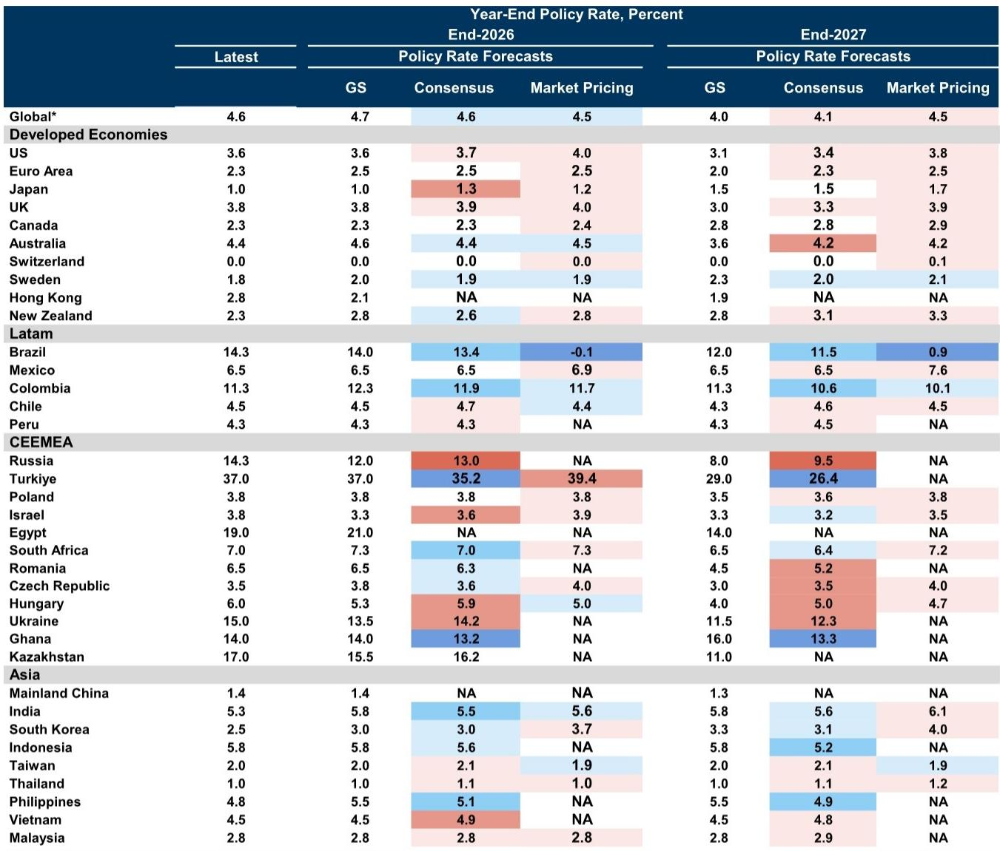
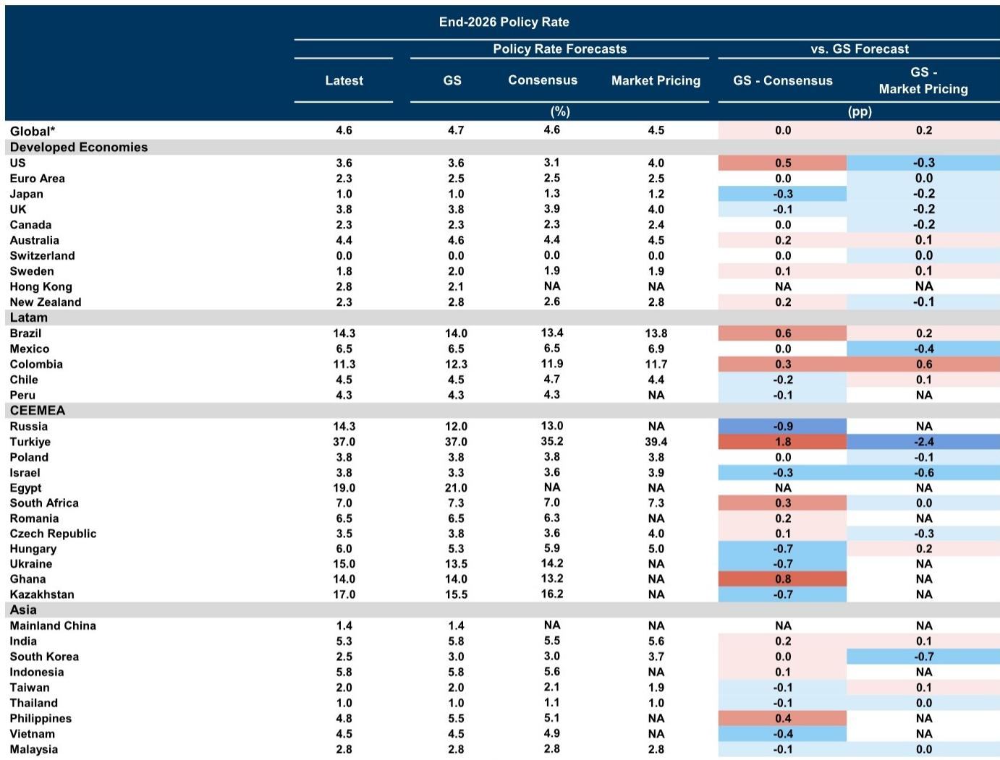
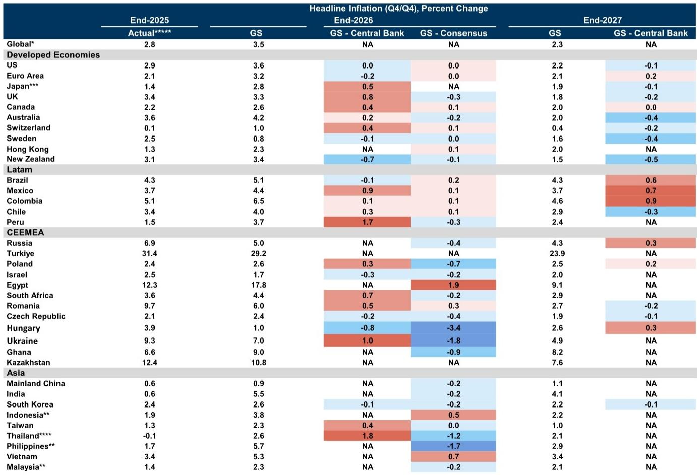

# The Global Rate Cycle Has Fractured: Central Banks Are No Longer Moving Together

The era of synchronized global monetary policy is over. For much of the post-pandemic period, central banks around the world marched in roughly the same direction—first hiking aggressively to combat inflation, then pausing, and eventually beginning to cut. That narrative no longer holds. According to the latest central bank policy tracker, the global monetary landscape has fragmented into three distinct regimes: economies that are still raising rates, economies that are cutting, and a large middle group that is simply holding steady. This is not a pause before a unified easing cycle resumes. It is a structural divergence driven by geopolitics, inflation persistence, and asymmetric growth trajectories.

The most striking signal from the data is the disconnect between what central banks are doing and what financial conditions are doing. Over the last three months, 39% of developed-market central banks raised rates, and none cut. Yet the Global Financial Conditions Index eased by 24 basis points over the same period. In plain language, central banks tightened policy, but markets and credit conditions became looser. This is a paradox that deserves serious attention. It suggests that the transmission mechanism of monetary policy is weakening, that markets are pricing a future easing that central banks are not yet delivering, or that non-policy factors such as risk appetite and liquidity are overriding official rate signals.

The implications for investors are profound. If you are positioning portfolios based on the assumption that global rates are in a secular decline, the data says otherwise. If you are assuming that central banks will act in concert, the data shows fragmentation. And if you believe that financial conditions reflect policy intentions, the data reveals a dangerous gap. This article unpacks the tracker's findings into a strategic framework, identifies the unresolved questions, and offers a decision-making lens for navigating the months ahead.

## The Hawkish Surge in Developed Markets Is Real, but It Is Not Uniform

The headline number is unambiguous: over the past three months, no developed-market central bank cut rates, and 39% raised them. This is a sharp reversal from the easing bias that dominated early 2025. The war in Iran is cited as a proximate cause, but the underlying story is more structural. Several developed economies are experiencing sticky inflation in services, tight labor markets, and fiscal expansion that complicates the inflation fight. The central banks of New Zealand, the Euro Area, Sweden, Norway, and Japan are all expected to raise rates over the next four quarters. That is not a dovish outlook.

Yet the composition matters more than the aggregate. The United States is forecast to cut rates by 25 basis points through June 2027 and 50 basis points by end-2027. The United Kingdom is expected to deliver 75 basis points of cuts over the same horizon. These two large economies are pulling in the opposite direction of the smaller DMs that are hiking. The net effect is a DM average that shows a slight increase of 8 basis points over the next four quarters. But that average masks a bimodal distribution: a few economies are tightening meaningfully, while the two largest are easing.

The strategic takeaway is that DM policy divergence is not random. It correlates with inflation persistence and fiscal stance. Economies with larger fiscal deficits and tighter labor markets are hiking. Economies where inflation has receded closer to target are cutting. This means that the old heuristic of "follow the Fed" is no longer sufficient. Investors need to assess each DM economy on its own inflation dynamics, not on a global template.

## Emerging Markets Are Cutting, but the Averages Conceal a Three-Speed World

The EM picture is even more complex. On a GDP-weighted basis, emerging-market central banks are forecast to cut rates by an average of 33 basis points over the next four quarters. That sounds like a coordinated easing cycle. But the regional breakdown tells a different story. CEEMEA (Central and Eastern Europe, Middle East, and Africa) is expected to deliver 208 basis points of cuts. Latin America is forecast to cut by 35 basis points. Asia, by contrast, is expected to hike by 4 basis points.

This is not a uniform EM easing cycle. It is a story of three distinct regions with fundamentally different inflation and growth dynamics. CEEMEA economies, many of which hiked aggressively earlier in the cycle, now have room to ease as inflation moderates and growth slows. Latin America is more cautious, with Brazil actually raising its end-2026 forecast by 75 basis points to 14.0%. Asia is the most restrained, with several economies holding or even raising rates. South Korea raised its end-2027 forecast by 25 basis points to 3.25%. Taiwan removed further rate cuts and now forecasts a hold at 2%.

The implication is that EM investors cannot rely on a single "EM rate view." The opportunity set is granular. The largest easing potential is in CEEMEA, but that comes with higher geopolitical risk and currency volatility. Latin America offers a mixed picture, with Brazil still tight and Mexico more neutral. Asia offers the least easing and the most policy discipline. A portfolio strategy that treats all EM debt or currencies as a single trade is likely to underperform.

## The Easing Financial Conditions Paradox: Why Markets Are Looser Despite Tighter Policy

Perhaps the most analytically challenging finding in the tracker is the divergence between policy rates and financial conditions. Over the last three months, central banks have tilted hawkish, but the Global Financial Conditions Index eased by 24 basis points. In developed markets, the easing was 34 basis points. In emerging markets, it was 10 basis points. How is this possible?

There are several plausible explanations, and each has different implications for investors. First, financial conditions are driven by more than just policy rates. Equity prices, credit spreads, exchange rates, and risk appetite all matter. If equity markets rallied or credit spreads narrowed, that could offset the tightening from higher policy rates. Second, forward guidance matters. If markets believe that current rate hikes are temporary and that easing will resume next year, they may price looser conditions today. Third, the war in Iran may have triggered safe-haven flows that lowered yields in some markets even as central banks hiked.

The strategic question is whether this divergence is sustainable. If central banks continue to hike while financial conditions ease, they may feel compelled to hike more to regain control. That would create a feedback loop: markets ease, central banks tighten further, markets ease more. Alternatively, if the easing in financial conditions reflects genuine disinflation or productivity gains, then central banks may tolerate it. The tracker does not resolve this question, and it is the single most important unknown for the next six months.

## The Forecasts Are Dovish Relative to Markets but Hawkish Relative to Consensus in Key Economies

One of the most useful features of the tracker is the comparison of GS forecasts to both consensus and market pricing. The headline is that GS forecasts are dovish relative to market pricing in 73% of DMs and 57% of EMs. That means GS expects lower rates than what markets are pricing. But relative to consensus, the picture is more balanced: in DMs, GS is below consensus in 27% of economies and above in 27%. In EMs, GS is below in 32% and above in 36%.

The interesting cases are the outliers. In the United States, GS forecasts end-2026 at 3.6%, which is 50 basis points above consensus and 40 basis points below market pricing. This is a significant divergence. GS is more hawkish than the consensus view but more dovish than what markets are pricing. In Brazil, GS is 60 basis points above consensus and 20 basis points above market pricing. In Turkey, GS is 180 basis points above consensus and 240 basis points below market pricing. These are not small differences.

The analytical implication is that there are material pricing opportunities in the gap between GS forecasts and market pricing. If GS is correct that the Fed will cut less than markets expect, then short-end US rates may be too low. If GS is correct that Brazil will stay tighter than consensus expects, then Brazilian real yields may offer value. But the opposite is also true: if markets are right and GS is wrong, then those trades will lose money. The tracker provides the data to identify these gaps, but it does not tell you which side to take. That requires a judgment call on the specific economy.

## What the Report Does Not Fully Answer: The Transmission Mechanism and the Balance Sheet Question

Every good research report raises as many questions as it answers. This tracker is no exception. There are two areas where the analysis is incomplete, and both are critical for portfolio construction.

First, the report documents the divergence between policy rates and financial conditions but does not fully explain the transmission mechanism. Why are financial conditions easing despite tighter policy? Is it because the rate hikes are small and concentrated in smaller economies? Is it because equity markets are ignoring rates? Is it because the easing is in credit spreads rather than rates? Without a deeper decomposition, investors cannot assess whether the divergence will persist or reverse. This is a research gap that the full report may address, but the tracker itself leaves it open.

Second, the balance sheet discussion is brief but important. The report notes that balance sheets as a share of GDP remain elevated relative to 2019 in New Zealand and Australia. It also notes that in the US, there is scope for a modest reduction in the Fed's balance sheet if reserve demand warrants, but the bar to a meaningful decline is high. This is a critical issue for liquidity. If central banks begin quantitative tightening in earnest while also hiking rates, the combined effect on financial conditions could be much larger than the rate hikes alone. But the tracker does not model this interaction. Investors are left to guess whether balance sheet normalization will accelerate or remain on hold.

These two unresolved questions create a natural entry point for deeper analysis. Readers who want to understand the full picture, including the original charts that decompose financial conditions and balance sheet trajectories, should consult the complete report.

## A Decision Framework for Navigating the Fragmented Rate Cycle

Given the complexity of the current environment, investors need a structured approach to making rate-related decisions. Based on the tracker's data, here is a four-step framework.

Step one: Distinguish between policy rate direction and financial conditions. Do not assume that a hawkish central bank means tight financial conditions. Check the FCI for the specific economy. If financial conditions are easing despite rate hikes, the central bank may need to do more. If they are tightening despite rate cuts, the central bank may be done.

Step two: Identify the regime for each economy. Is it in a hiking regime, a cutting regime, or a hold regime? The tracker provides clear data on recent actions and forward forecasts. Use that to classify each economy. Then ask whether the economy is likely to switch regimes. The US and UK are in cutting regimes. The Euro Area, Japan, and New Zealand are in hiking regimes. Brazil is in a hiking regime. CEEMEA is largely in a cutting regime. Asia is in a hold-to-hike regime.

Step three: Compare GS forecasts to market pricing and consensus. Where GS is significantly above or below, there is a potential trade. But do not automatically trade the gap. Ask why GS is different. Is it because GS has a different inflation forecast? A different growth forecast? A different view on geopolitical risk? The tracker includes GDP growth forecasts that can help answer this question.

Step four: Monitor the balance sheet. The tracker's data on balance sheets as a share of GDP is a leading indicator. If balance sheet reduction accelerates, it will tighten financial conditions even if policy rates are unchanged. If it slows, it will ease conditions. This is a second-order effect that many investors ignore.

## The Unanswered Questions That Make the Full Report Essential

No single report can answer everything. The tracker provides an excellent snapshot of where central banks are and where they are headed. But it leaves several meaningful questions open. Why is the transmission mechanism so weak? Will balance sheet normalization accelerate? How will the war in Iran evolve and affect central bank decisions? What happens if the US cuts rates while the Euro Area hikes? These are not academic questions. They will determine whether portfolios that are long duration or short duration outperform in 2027.

The full report contains the original charts and data that allow investors to explore these questions in greater depth. It includes the decomposition of financial conditions, the detailed balance sheet projections, and the country-level forecast revisions that are only summarized here. For serious investors who need to make real allocation decisions, the full report is an essential resource.

Join the community to read the full report and review the original charts.

*This article is for learning and discussion only and does not constitute investment advice.*

Personal reading notes and learning share only. Not investment advice.

