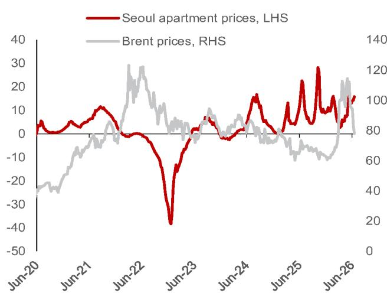

# NOM：韩国央行转向，通胀让位给房价

韩国央行的决策天平正在发生一次关键倾斜。过去一年多，市场习惯用“通胀粘性”和“全球紧缩”来理解韩国货币政策的方向。但NOM最新发布的研报揭示了一个更微妙的转折：通胀风险已经明显消退，真正主导韩国央行政策节奏的，变成了首尔公寓价格的持续攀升。

这不是一个短期的噪音扰动，而是政策逻辑框架的系统性切换。理解这一变化，对于判断韩国资产定价、韩元汇率走向乃至整个亚洲利率周期的节奏，都至关重要。

NOM维持其加息路径预测——7月、10月和明年1月各加息25个基点，终端利率达到3.25%。但报告的真正价值不在于这个数字本身，而在于它点出了支撑这个路径的“支柱”已经更换：从对抗通胀，转向防范金融稳定风险。

**KC评论：** 很多投资者习惯把韩国央行的加息决策简化为“通胀数据+美联储动作”的函数。NOM的报告提醒我们，在通胀压力已经大幅缓解的背景下，韩国央行可能正在进入一个更复杂的决策阶段——房价和家庭债务的“金融稳定”权重正在上升。这意味着，即使未来CPI数据出现低于预期的读数，也不一定意味着加息节奏会放缓。

## 1. 能源溢价消退，通胀不再是加息的急迫理由

NOM报告中最清晰的一个信号是：通胀风险正在快速消散。布伦特原油价格在美国-伊朗停火协议后，已经回撤至接近冲突前的水平，这几乎完全抹去了韩国央行在2026年下半年通胀展望中嵌入的能源溢价。

韩国央行此前的预测是基于布伦特原油均价约95美元/桶的假设。油价的实际回落意味着，7月货币政策会议时，通胀预测面临的下行风险正在累积。除非油价出现戏剧性的逆转，否则支撑此前“连续加息”策略的通胀支柱已经显著弱化。

这一判断直接指向一个结论：韩国央行没有理由再维持“鹰派急行军”式的加息节奏。通胀不再是需要“灭火”的紧急问题，而是变成了一个可以“按季度观察”的常规变量。

## 2. 首尔房价年化上涨15.8%，金融稳定成为新锚点

与通胀的消退形成鲜明对比的，是首尔房地产市场的持续升温。NOM报告引用数据显示，首尔公寓价格在6月最后一周以年化15.8%的速度上涨，这已经是连续第八周保持两位数的年化涨幅。

这个数字的冲击力在于两点：一是持续性，价格加速并未在短暂的调控措施后停滞；二是绝对水平，年化15.8%的涨幅在任何一个发达经济体都足以触发监管警觉。

对于韩国央行而言，房价问题已经不再是“需要关注”的次要矛盾，而是“需要行动”的首要政策驱动因素。报告明确将其定义为“日益重要的金融稳定担忧”。

**KC评论：** 理解韩国央行的行为逻辑，关键在于区分“通胀驱动”和“金融稳定驱动”的加息。前者的特点是“快、猛、可预期”——数据高就加，数据低就停。后者的特点是“慢、稳、有节奏”——央行需要在不引发市场恐慌的前提下，逐步冷却资产价格泡沫。NOM报告中“后续加息将以有节奏的步伐进行”的判断，正是基于这一逻辑转换。完整报告中对首尔房价的周度高频数据图，是理解这一判断最直观的工具。

## 3. 加息路径不变，但节奏和含义已经改变

NOM维持7月、10月和明年1月各加息25个基点的预测，终端利率仍看3.25%。但报告的核心洞见在于：同样是加息，不同阶段的加息对市场的影响完全不同。

7月的加息，大概率是“惯性加息”——基于此前已经充分沟通的路径，市场已经消化。但7月之后的加息，其性质将发生转变：它们将不再由通胀数据驱动，而是由金融稳定考量驱动。

这意味着市场需要重新校准对韩国央行反应函数的理解。过去一年，市场判断加息节奏的锚是“CPI vs 预期”的偏差。未来，这个锚将转向“房价增速 vs 政策容忍度”的偏差。而房价数据的波动性远低于CPI，这意味着韩国央行的政策路径可能会变得更加可预测，但也更加“钝化”——不会因为单月的CPI低于预期就改变节奏。

## 4. 报告尚未完全回答的关键问题：家庭债务的临界点在哪里？

NOM报告将金融稳定作为核心关切，但有一个关键问题没有展开：韩国央行对房价上涨的“容忍上限”在哪里？或者说，首尔房价年化涨幅超过什么水平，会触发央行采取比“有节奏加息”更严厉的措施？

从历史经验看，韩国央行在2016-2017年也曾面临类似的房价压力，当时央行在维持宽松的同时，更多依赖宏观审慎工具（如贷款价值比LTV上限）来降温。但这一次，宏观审慎工具的空间是否足够？如果房价持续以15%以上的年化速度上涨，央行是否会被迫采取更激进的加息，甚至提前实施加息计划？

报告没有给出明确的量化阈值。这可能是读者在读完NOM完整报告后，需要结合自身对韩国房地产市场的理解来补充的关键判断。

## 5. 给投资者的观察框架：三个信号比一个数据更重要

基于NOM报告的逻辑，未来几个月跟踪韩国央行决策，建议关注以下三个信号，而不是仅仅盯着月度CPI数据：

第一，首尔公寓价格的周度数据。NOM报告已经提供了高频跟踪框架。如果周度年化涨幅从15%以上回落至个位数，金融稳定压力自然缓解，加息节奏可能放缓甚至暂停。反之，如果涨幅进一步加速至20%以上，市场需要为更鹰派的政策定价。

第二，韩国央行官员在公开讲话中关于“金融稳定”的措辞频率和强度。如果行长或委员在讲话中开始用“严重关切”“必须采取行动”等强硬表述，这比任何通胀预测都更能预示加息节奏的加速。

第三，家庭信贷的增长速度。房价上涨本身不是问题，问题在于推动房价上涨的资金来源。如果家庭信贷增速同步上升，意味着杠杆在累积，金融稳定的风险在实质性增加。这是NOM报告逻辑链条中需要读者自行补充的一块拼图。

**KC评论：** NOM这份报告的真正价值，不在于它预测了7月加息，而在于它提供了一个理解韩国央行“从通胀到金融稳定”的政策框架切换。对于关注韩国资产、韩元汇率或亚洲利率周期的读者来说，这个框架比任何单月数据都更有指导意义。报告中的高频房价图表和韩国央行通胀预测的假设条件分析，是理解这一框架切换的关键材料。

---

上述三个观察信号中，家庭信贷增长的具体数据、韩国央行内部对房价容忍度的估算，以及如果房价继续加速可能触发的政策选项，在NOM这份完整报告中都有更细致的拆解。每天由AI agent与人工review生成的国际投行中文摘要与KC评论，会持续更新这些关键数据和图表，方便读者快速把握市场动态。欢迎在社群微信群里继续讨论，获取当日最新的数据图表合集。

Personal reading notes and learning share only. Not investment advice.

