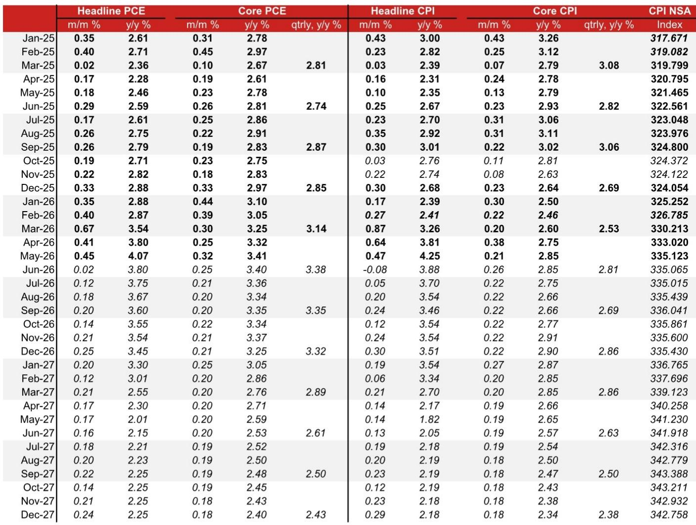
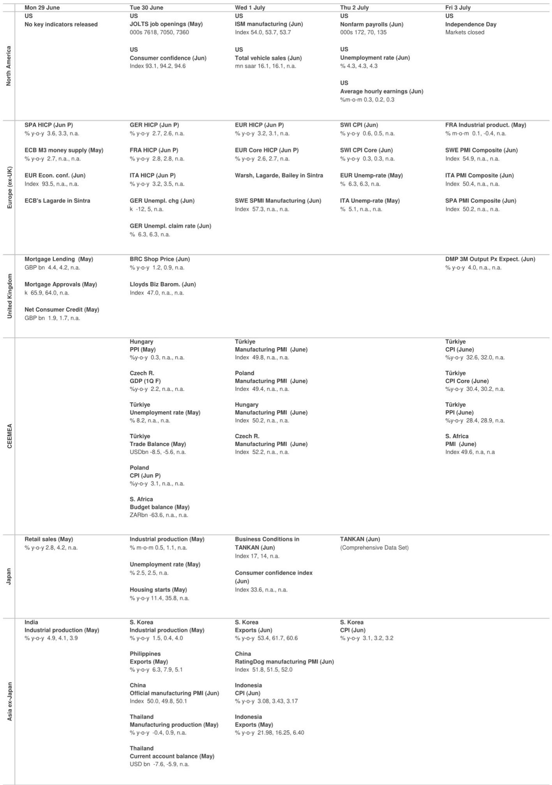
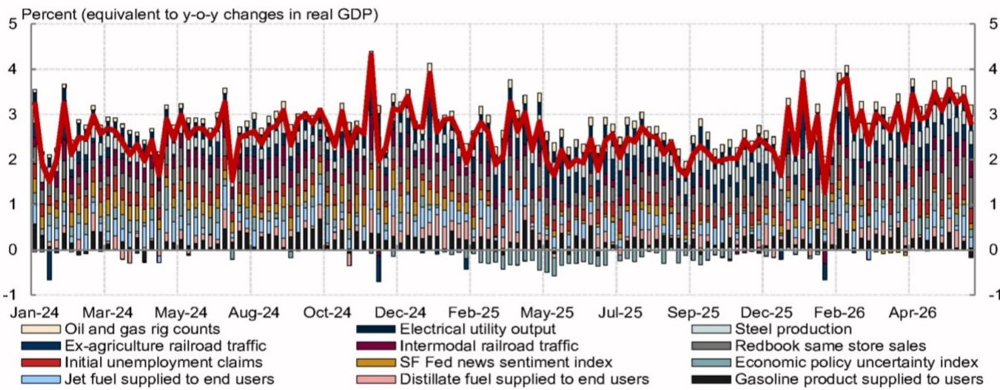

# The U.S. Labor Market Is Slowing, But Not Breaking — And That Is Exactly What Keeps the Fed on Hold

The most important economic data point for the next quarter is not the inflation print or the GDP revision. It is the June nonfarm payrolls number, which a global investment bank expects to decelerate sharply to 70,000. This slowdown matters not because it signals recession, but because it reveals the precise mechanism by which the Federal Reserve is being held in place. The labor market is resilient enough to prevent rate cuts, yet soft enough to prevent rate hikes. That equilibrium is the central strategic fact for markets.

The June payrolls report is expected to show a significant pullback from the noisy, temporary factors that inflated the May print. Leisure and hospitality hiring, likely boosted by FIFA World Cup-related employment and seasonal distortions, is expected to reverse. The outsized gain in local government employment, which pushed government job growth to its strongest monthly pace since July 2024, is also expected to fade. This is not deterioration. It is normalization. But normalization in a context where the Fed is already divided between hawks who see entrenched inflation and doves who see transitory factors creates a delicate analytical challenge.

The core argument that emerges from the data is this: the U.S. economy is exhibiting a resilience that frustrates both the inflation hawks and the growth doves. Real personal spending accelerated in May despite geopolitical uncertainty. Durable goods orders, excluding transportation, rose 1.3% month-over-month, well above consensus. Business investment is broad-based and strong. Yet wage measures continue to trend lower, albeit gradually. The Atlanta Fed Wage Growth Tracker and ADP Pay Insights both confirm that wage pressure is easing, which should help prevent a pickup in wage-sensitive supercore services inflation. This is the Goldilocks scenario that keeps the Fed in wait-and-see mode.

The question for investors is not whether the Fed will cut or hike in July. The question is whether the current equilibrium can persist through the methodological changes to the PCE price index scheduled for September 2026, through the ongoing geopolitical uncertainty in the Middle East, and through the political pressures emanating from the White House. The answer requires a deeper understanding of what is really driving the divergence between headline inflation and underlying inflation trends.

## The June Payrolls Slowdown Reflects Noise, Not Weakness, But the Noise Matters for Policy Perception

The headline expectation of 70,000 job gains in June represents a significant deceleration from the year-to-date average. But the composition of that slowdown is critical. The May print was boosted by temporary factors that are now reversing. Leisure and hospitality hiring, which reflected FIFA World Cup-related employment and seasonal noise, is expected to unwind. The outsized increase in local government employment, which pushed government job gains to their strongest monthly pace since July 2024, is also expected to fade.

This is not a labor market that is cracking. Layoff measures remain subdued. Labor demand appears to be stabilizing after a downtrend in 2025. Weekly ADP data, while slowed from its peak, continue to point to solid private-sector employment growth. Continuing claims rose through the June NFP survey reference week, but that is a marginal signal, not a trend. Survey data are mixed: flash PMIs point to some softening, while regional surveys suggest modest improvement.

The so-what here is that the Fed will see this report as consistent with its narrative of a resilient labor market that does not require immediate intervention. Chair Warsh, speaking at the ECB's Sintra forum, is expected to keep his cards close, deflecting pointed questions by deferring to the five task forces currently being assembled. The key signal will be how he frames recent developments in the Middle East and the decline in crude oil prices. If he characterizes falling oil prices as an encouraging sign for the inflation outlook, that would signal a dovish lean. That signal matters more than the payrolls number itself.

## The Fed Is Divided on the Nature of Inflation, But the Division Itself Prevents Action

The post-FOMC commentary reveals a central bank that is genuinely uncertain about the inflation trajectory. New York Fed President Williams remains dovish, comfortable that the current stance of monetary policy can bring inflation down to 2% on a sustained basis. He acknowledges that inflation remains unquestionably elevated, but he expects it to decline as tariff effects fade, energy prices stabilize, and shelter inflation eases.

Chicago Fed President Goolsbee, a hawk, continues to express concerns over the resilience of services inflation. Minneapolis Fed President Kashkari revealed that he penciled in one rate hike for 2026 in his June dot plot. The hawkish policymakers have emphasized the importance of the composition of inflation, suggesting their recent hawkish pivot was not driven simply by temporary factors such as tariffs or higher energy prices.

Yet Goolsbee also said that one month of inflation data would be "no month," which suggests that the June inflation data are unlikely to lead to a rate hike at the July FOMC meeting. Despite his hawkish bias, Goolsbee seemed to support the Fed's wait-and-see mode for now. This is the critical insight: the division within the Fed is real, but it is a division that paralyzes rather than polarizes. Neither the hawks nor the doves have enough evidence to force a move.

The Treasury Secretary's comments reinforce this view. He indicated further reduction in political pressures on easing monetary policy, expressed confidence in Warsh's leadership, and mentioned favorably the mid-cycle adjustments to the policy rate in early 1997 when former Fed Chair Greenspan engineered a single rate hike that did not weigh on economic activity. This is not a White House that is pushing for cuts. It is a White House that has become neutral on the near-term monetary policy outlook.

The implication is clear: the Fed is on hold through at least the end of 2027. That is the base case from this analysis. But the base case rests on the assumption that the current inflation dynamics persist. And that assumption is about to be tested.

## The Methodological Changes to the PCE Price Index Could Reshape the Inflation Debate in a Way the Report Does Not Fully Explore

The Bureau of Economic Analysis has announced future changes to its methodology for estimating certain key PCE price components, including portfolio management and investment advice services, legal services, and computer software and accessories. The net impact from these changes has the potential to lower year-over-year core PCE inflation by 20 to 30 basis points. These changes will take effect on 30 September 2026, along with annual revisions to the national account data.

This is a significant development that the report identifies but does not fully explore. The wedge between core PCE inflation and core CPI inflation could narrow substantially after these methodological changes are implemented. Currently, the wedge remains large: core PCE inflation stood at 3.41% year-over-year in May, while the trimmed-mean PCE inflation stood at 2.41%. That 100-basis-point gap highlights the importance of how to gauge the underlying inflation trend.

The report notes that from the trimmed-mean inflation perspective, inflation has not accelerated much. Considering lower crude oil prices, waning impact from tariffs, and moderating wage growth, it seems reasonable for the Fed to remain patient on rate hikes. But the methodological changes add another layer of complexity. If the BEA's changes lower core PCE inflation by 20 to 30 basis points, the gap between headline and trimmed-mean inflation narrows. That could make the doves more comfortable, but it could also make the hawks more suspicious that the data are being manipulated to justify inaction.

The report does not answer the question of how Chair Warsh or the task force on the inflation framework will weight the PCE trimmed-mean inflation versus the headline numbers. That is a meaningful open question. The answer will determine whether the Fed's patience is rewarded with a genuine disinflationary trend or punished by a resurgence of price pressures that the methodological changes obscure.

## A Decision Framework for Investors: Three Scenarios for the Next Six Months

The data and analysis in this report point to three distinct scenarios for the next six months. Each scenario has different implications for asset allocation and risk management.

Scenario One: The Equilibrium Persists. In this scenario, the labor market continues to show resilience without overheating. Wage growth continues to moderate gradually. The methodological changes to the PCE price index take effect and lower core inflation modestly. The Fed remains on hold through the end of 2027. This is the base case, and it implies that the current market pricing is broadly correct. The risk is complacency: investors assume the equilibrium will persist and are caught off guard by a shock.

Scenario Two: The Hawks Win. In this scenario, services inflation proves stickier than expected. The methodological changes to the PCE price index are seen as insufficient to address the underlying price pressures. The Fed, led by hawkish regional presidents who are not currently voters but will become voters in 2026, moves toward a rate hike. This scenario is unlikely in the near term, but the report's analysis of the individual dot plots suggests it is not impossible. The risk is that the market is underpricing the probability of a hike in 2026.

Scenario Three: The Doves Win. In this scenario, the labor market softens more than expected. The June payrolls slowdown proves to be the beginning of a trend, not a one-month noise event. The methodological changes to the PCE price index lower inflation more than anticipated. The Fed, led by Warsh and Williams, begins to signal a willingness to cut rates. This scenario is also unlikely in the near term, but the report's analysis of the divergence between core PCE and trimmed-mean inflation suggests it is possible if the data continue to soften.

The decision framework for investors is to monitor three leading indicators: the weekly continuing claims data, the monthly wage growth measures, and the Fed's characterization of energy prices. If continuing claims rise consistently, wage growth accelerates, and the Fed begins to emphasize the transitory nature of energy price declines, that is a signal that the equilibrium is shifting toward the dovish scenario. If the opposite occurs, the hawkish scenario becomes more likely.

## The Unanswered Questions That Make the Full Report Essential Reading

This analysis leaves several meaningful questions unanswered. How will the BEA's methodological changes interact with the Fed's inflation framework? Will the Fed's task force on the inflation framework put a heavy weight on trimmed-mean inflation, or will it continue to focus on the headline core PCE number? How will the geopolitical developments in the Middle East affect energy prices and, by extension, the Fed's assessment of inflation? What is the probability that the non-voting regional Fed presidents, who submitted the most hawkish dots, will influence policy when they become voters in 2026?

These are not trivial questions. They are the questions that will determine whether the current equilibrium persists or breaks. The report provides the data and the analytical framework to answer them, but the answers require a deeper dive into the original charts and the full set of assumptions underlying the forecasts.

Join the community to read the full report and review the original charts.

*This article is for learning and discussion only and does not constitute investment advice.*

Personal reading notes and learning share only. Not investment advice.

