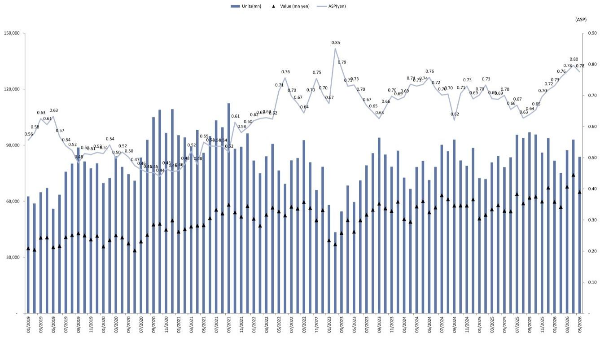
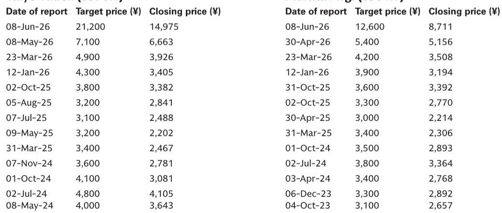
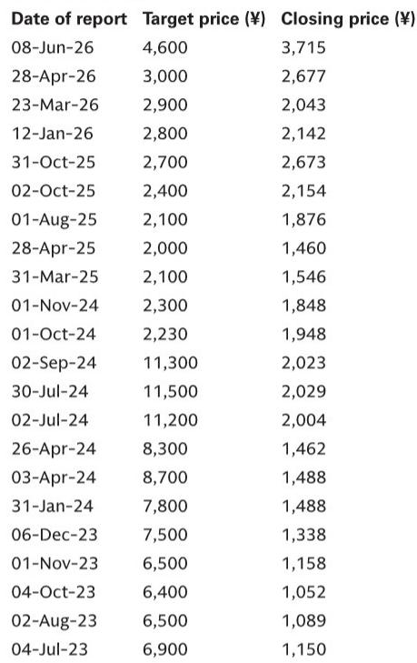

# MLCC Export Data Confirms the AI Infrastructure Boom Is Real, and the Pricing Power Shift Has Not Yet Begun

The May Ministry of Finance trade data for Japan's multilayer ceramic capacitor (MLCC) exports tells a story that is both reassuring and strategically incomplete. On the surface, the numbers appear mixed: export value fell 12% month-over-month, volume dropped 10%, and average selling prices slipped 3%. Any investor scanning headline figures would be forgiven for seeing a softening trend. But the year-over-year comparisons tell the real story: export value surged 19%, volume rose 7%, and even the modest ASP decline of 3% month-over-month must be understood in the context of Japan's Golden Week holiday disruption. The critical insight is not that May was weak, but that the underlying demand trajectory remains exceptionally strong. The more important question, however, is whether the market is correctly pricing in the coming inflection in product mix and pricing power that the next six to twelve months will likely deliver.

The report's core argument centers on three Japanese component leaders: Murata Manufacturing, Taiyo Yuden, and TDK. All three carry Buy ratings, and the rationale hinges on a thesis that goes well beyond simple volume growth. The analysts are betting that the composition of MLCC demand is shifting decisively toward higher-value AI server applications, and that this shift will materially improve average selling prices and margins in the second half of the fiscal year. The May trade data, when read correctly, supports this view. The month-over-month softness was a calendar artifact, not a demand signal. The year-over-year strength confirms that end-market consumption, particularly from data center and automotive customers, is accelerating. The question for investors is whether they are positioned for the next phase of the cycle, or still anchored to the old one.

## The May Data Confirms the AI Demand Cycle Is Accelerating, Not Peaking

The most common mistake in interpreting monthly trade data is to overweight the latest print and underweight the trend. May's month-over-month decline in MLCC export value, volume, and ASP is easily explained by the Golden Week holiday period, which compressed shipping schedules and delayed order fulfillment. Anyone who has followed Japanese industrial data for more than a quarter knows this pattern. The year-over-year numbers are what matter, and they are unambiguous. Export value up 19%, volume up 7%, and ASP up on a comparable basis despite the holiday effect. This is not a peak. This is a ramp.

The report's conference call with Murata reinforces this interpretation. Management described order trends as "at a very high level," with AI and data center applications continuing to show very strong demand. More tellingly, the company noted that the sense of recovery in automotive applications has been strengthening recently. This is significant because automotive MLCC demand had been a source of concern through much of 2024 and early 2025, as electric vehicle adoption rates moderated and traditional internal combustion engine production stabilized. If automotive is now joining the AI-driven recovery, the demand picture becomes broader and more durable.

The strategic implication is straightforward: the current cycle is not a single-product story. It is a multi-end-market expansion where AI infrastructure is leading, but automotive is following. For investors, this reduces the risk of a sharp demand reversal if any single end market softens. The diversification of demand drivers provides a cushion that was absent in previous cycles driven primarily by smartphone replacement.

## The Second Half Product Mix Shift Will Be the True Test of Margin Expansion

The report identifies the April-to-June period's book-to-bill ratio and the July-to-September outlook as the key metrics to watch, rather than the first quarter earnings themselves. This is a nuanced but important distinction. Earnings in any given quarter are affected by the timing of sales recognition, which can obscure the underlying demand trajectory. The book-to-bill ratio, by contrast, captures the flow of orders relative to shipments and provides a forward-looking signal. A ratio above 1.0 indicates that orders are outpacing shipments, which typically precedes higher revenue and, eventually, pricing power.

The more transformative factor, however, is the expected improvement in product mix from AI server MLCCs. Not all MLCCs are created equal. The components used in AI servers are higher-capacitance, higher-voltage, and require tighter tolerances than those used in consumer electronics or even standard enterprise servers. They command significantly higher average selling prices and carry better margins. As these products become a larger share of total MLCC output, the aggregate ASP for the industry should rise, even if prices for legacy products remain stable or decline modestly.

This is where the report's most provocative insight lies. The analysts state that discussions of price hikes on a like-for-like basis will be more important around year-end, when 2027 comes into view, than during the first quarter results season. This is a carefully calibrated statement. It implies that the current pricing environment is not yet reflecting the supply-demand tightness that the data suggests. Volume is strong, but pricing power has not fully materialized. The year-end period, when contract negotiations for the following year typically occur, will be the true inflection point. If the analysts are correct, the market is currently pricing MLCC stocks based on volume growth alone, without fully discounting the margin expansion that higher ASPs would bring.

## What the Report Does Not Fully Answer: The Timing and Magnitude of the Pricing Inflection

For all its analytical rigor, the report leaves several critical questions open. The most important is the precise timing and magnitude of the expected pricing improvement. The analysts point to the year-end as a key checkpoint, but they do not specify what level of price increases they are modeling, nor do they provide a sensitivity analysis showing how different pricing scenarios would affect their target prices. This is not a criticism of the report, which is based on publicly available trade data and conference call commentary, but it is a gap that investors must fill with their own analysis.

A second open question concerns the supply side. The report does not address whether capacity additions by Murata, Taiyo Yuden, and TDK are sufficient to meet the demand they are forecasting, or whether capacity constraints could cap volume growth and accelerate pricing. If supply is tight, pricing could improve faster and by more than the analysts currently expect. If capacity additions are running ahead of demand, the pricing inflection could be delayed or muted. The report's bullish stance implies a favorable supply-demand balance, but the data to confirm this is not presented.

A third question relates to the competitive landscape. Chinese MLCC manufacturers have been increasing their capacity and improving their quality, particularly in mid-range products. If the AI server opportunity attracts new entrants or accelerates existing competitors' roadmaps, the pricing power that the analysts expect could be eroded. The report's focus on Japanese leaders is justified by their technological leadership in high-end MLCCs, but the competitive dynamics are worth monitoring.

## A Decision Framework for Investors Evaluating MLCC Exposure

For investors who want to act on the thesis without waiting for the full report, a structured decision framework is essential. The first variable is time horizon. If your investment horizon is less than six months, the May trade data and the upcoming first quarter earnings season provide limited actionable information. The month-over-month noise will dominate, and the pricing inflection is not expected until year-end. Short-term traders should be cautious.

If your horizon is twelve months or longer, the case is more compelling. The year-over-year growth trend is established, the end-market diversification is improving, and the product mix shift is a structural driver that will play out over multiple quarters. The key risk to manage is the timing of the pricing inflection. If price hikes are delayed or smaller than expected, the stock price reaction could be negative in the near term, even if the long-term thesis remains intact.

The second variable is positioning. The report covers three names, but they are not identical. Murata is the largest and most diversified, with exposure across consumer, automotive, and industrial end markets. Taiyo Yuden is more concentrated in MLCCs and may offer higher leverage to the pricing cycle. TDK has a broader product portfolio that includes magnetic components and power supplies, which provides diversification but also dilutes the MLCC exposure. Investors should align their position with their conviction on the MLCC cycle specifically versus the broader Japanese electronics ecosystem.

The third variable is the risk of yen appreciation. All three companies report in yen, and a stronger yen would reduce the value of their export revenues. The report identifies yen appreciation as a key risk for all three names. Investors should consider hedging currency exposure or sizing positions accordingly.

## Join the Community to Read the Full Report and Review the Original Charts

The full report contains detailed price target methodologies, valuation frameworks, and historical target price trajectories for Murata Manufacturing, Taiyo Yuden, and TDK. It also includes the original Ministry of Finance export data charts that underpin the analysis. For investors who want to build conviction in the MLCC cycle thesis, or who need to stress-test the assumptions behind the Buy ratings, the complete document is essential reading. The analysts' valuation methodology, which applies an 80% premium to the sector multiple for Murata and Taiyo Yuden, and a 10% premium for TDK, is based on a specific view of the cycle that may or may not be fully discounted by the market. Reviewing the original charts and the supporting data will allow you to form your own judgment.

Join the community to read the full report and review the original charts.

*This article is for learning and discussion only and does not constitute investment advice.*

Personal reading notes and learning share only. Not investment advice.

