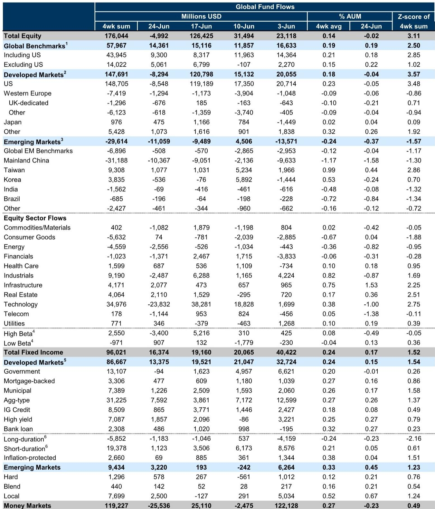
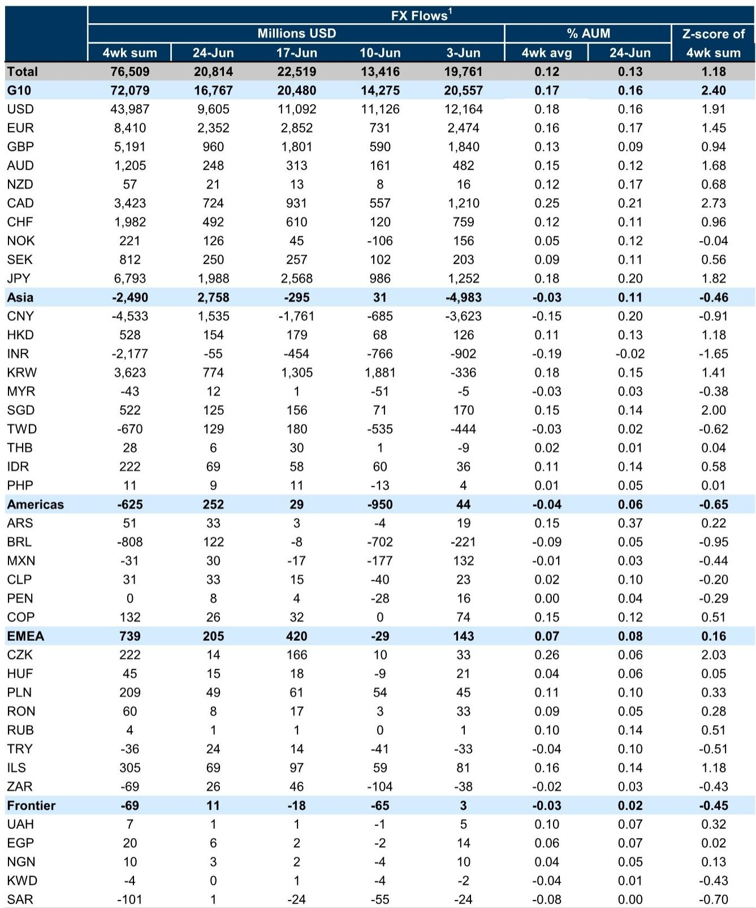
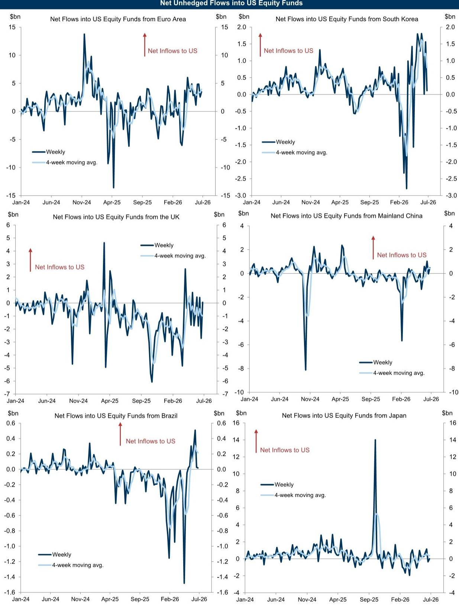

# The Tech Exodus Is Not a Reversal: Why the Rotation from Equities to Fixed Income Signals a Structural Shift, Not a Panic

The weekly fund flow data for the period ending June 24 presents a clear and decisive signal: global equity funds flipped to net outflows of $5 billion after absorbing a massive $126 billion in the prior week, while fixed income funds maintained their steady inflow trajectory at $16 billion. This is not a simple risk-off move. It is a strategic reallocation driven by a concentrated unwinding of the technology trade, a deepening divergence between developed and emerging markets, and a persistent demand for income products that reflects a fundamental repricing of risk premia. The controlling insight is that the current rotation reveals a market that is not fleeing risk entirely, but is meticulously selecting where it will accept exposure. For investors, the question is no longer whether to be long or short, but how to navigate a regime where capital is simultaneously fleeing the sector that drove the rally and rewarding the asset class that has been the safe harbor.

Why now matters is a function of the velocity and composition of these flows. The technology sector, which had seen $35 billion in inflows over the prior four weeks, experienced a record reversal of nearly $24 billion in outflows in a single week. This is not a garden-variety profit-taking event. It is a coordinated exit that suggests institutional and retail investors alike are questioning the sustainability of the AI-driven narrative that has dominated market psychology since the beginning of the year. At the same time, fixed income flows remain broad-based, with short-duration, inflation-protected, and aggregate-type bond funds all seeing positive demand. The message is that capital is not hiding in cash—money market fund assets actually declined by $26 billion—but is migrating toward instruments that offer a more explicit and predictable return stream. This is a market that is repricing duration and credit risk, not one that is capitulating.

The strategic implication is profound: the AI investment boom, which the report notes is expected to continue, may no longer be a sufficient tailwind for equity markets as a whole. Instead, it may become a more idiosyncratic driver, benefiting only those companies and sectors that can demonstrate tangible earnings delivery rather than narrative momentum. The dollar's resilience through recent tech wobbles, as the report observes, suggests that the shock is not a US-specific negative, but the divergence between equity and fixed income flows indicates that the global macro environment is becoming more complex. Investors need to look past the headline flow numbers and understand the granular shifts that are redrawing the map of capital allocation.

## The Technology Sector Unwind Is the Most Concentrated Capitulation in Months, and It Signals a Regime Change in Risk Appetite

The magnitude of the technology sector outflow is the single most important data point in this week's report. After a four-week cumulative inflow of $35 billion, the sector hemorrhaged $23.8 billion in the week ending June 24. This represents a swing of nearly $60 billion in net positioning over a five-week period. To put this in context, the technology sector's share of total equity flows has been the dominant driver of the broader market's positive momentum. When that driver reverses, the entire equity complex feels the strain.

The critical question is whether this is a tactical pullback or a structural shift. The report's observation that the dollar held up during the February software sell-off and the recent tech wobbles suggests that the market is treating these events as sector-specific rather than systemic. However, the scale of the outflow in a single week indicates that the selling is not merely hedge fund de-risking. It appears to include a broader base of mutual fund and ETF investors who are re-evaluating their exposure to a sector that has become extraordinarily crowded. The z-score for technology sector flows over the four-week sum was 2.75, indicating that the prior inflow was statistically extreme. When such extreme positioning unwinds, it tends to be violent and sustained.

The implication for portfolio construction is that the technology sector can no longer be treated as a default overweight. The era of passive acceptance of tech exposure through broad market indices may be coming to an end. Investors who rely on the AI narrative as a catch-all justification for equity exposure must now differentiate between companies that are genuinely benefiting from AI adoption and those that are merely riding the thematic wave. The fund flow data suggests that the market is beginning to make that distinction, and it is doing so with force.

## Fixed Income Flows Are Not a Safe Haven Trade but a Yield-Seeking Migration That Reflects a New Equilibrium

The resilience of fixed income flows is the other side of the coin. At $16 billion in net inflows for the week, and a four-week cumulative of $96 billion, the demand for bonds is broad and deep. Short-duration funds, inflation-protected bonds, and aggregate-type funds all saw positive inflows. Notably, long-duration funds continued to see outflows, with a four-week cumulative of negative $5.9 billion. This is not a flight to safety in the traditional sense, where investors buy long-duration Treasuries as a hedge against equity risk. Instead, it is a yield-seeking migration into instruments that offer a positive real return with limited duration risk.

The sustained inflows into short-duration and inflation-protected bonds suggest that investors are not convinced that the inflation battle is over. They are willing to accept a lower nominal yield in exchange for protection against the risk that central banks may need to keep rates higher for longer. This is a subtle but important signal. It implies that the market is pricing in a scenario where economic growth remains resilient enough to support credit, but inflation remains sticky enough to prevent aggressive rate cuts. This is the "higher for longer" regime that has been the dominant theme in macro discussions, and the fund flow data confirms that investors are acting on it.

For equity investors, this creates a powerful headwind. When bonds offer a competitive yield with lower volatility, the equity risk premium must expand to attract capital. The fact that fixed income flows remain strong even as equity flows turn negative suggests that the risk-reward calculus is shifting. Investors are no longer willing to accept equity-like volatility for bond-like returns. They are demanding a higher premium for taking equity risk, and until that premium materializes, capital will continue to flow into fixed income.

## The Emerging Market Divergence Is the Most Underappreciated Risk in the Report

The report reveals a stark divergence within emerging markets that deserves far more attention than it typically receives. Mainland China equity funds saw net outflows of $10.4 billion in a single week, bringing the four-week cumulative outflow to over $31 billion. In contrast, Taiwan equity funds saw net inflows of $1.1 billion, with a four-week cumulative of $9.3 billion. This is not a uniform EM sell-off. It is a targeted rotation away from China and toward Taiwan, driven by the technology supply chain dynamics that favor Taiwan's semiconductor ecosystem.

The fixed income side of EM tells a similar story. Emerging market bond funds saw net inflows of $3.2 billion, with local currency bonds dominating at $2.5 billion. This suggests that investors are willing to take EM currency risk in certain jurisdictions but are avoiding the equity risk associated with China. The z-score for EM local currency bond flows was 1.24, indicating above-average demand. The implication is that the EM investment universe is fracturing along lines of technology exposure, fiscal credibility, and currency stability.

For global allocators, this means that a simple "EM overweight" or "EM underweight" is no longer sufficient. The dispersion within EM is now as wide as the dispersion between EM and DM. Investors need to make country-specific and even sector-specific decisions within EM. The report's data suggests that Taiwan and Korea are benefiting from the AI supply chain, while China and India are experiencing capital outflows. This is a critical distinction that will define EM performance in the coming quarters.

## What the Report Does Not Fully Answer: The Interaction Between Equity Outflows and FX Flows

The report provides a wealth of data on equity, fixed income, and FX flows, but it does not fully explore the interaction between these three channels. Specifically, the data shows that the USD, EUR, and JPY saw the strongest net demand in cross-border FX flows, while CNY saw net inflows after several weeks of outflows. This raises an important question: are the equity outflows from China being recycled into CNY-denominated fixed income, or are they being repatriated into USD and EUR?

The report's observation that the dollar's resilience through the tech sell-off reflects, in part, that the shock was not clearly US-negative is helpful, but it does not explain the mechanics of how capital is moving between asset classes and currencies. For example, the net outflow from US equity funds of $8.5 billion in the week ending June 24 coincided with strong USD demand. This suggests that the equity outflows are not being converted into foreign currency but are remaining in USD, possibly moving into US fixed income or money markets. However, money market fund assets declined, so the capital may be moving directly into bond funds.

The unanswered question is whether the FX flows are leading or lagging the equity flows. If the dollar continues to strengthen despite equity outflows, it would suggest that the demand for USD-denominated assets is coming from non-equity sources, such as corporate hedging or central bank reserve management. If the dollar weakens in the coming weeks, it would indicate that the equity outflows are eventually being repatriated. This is a crucial distinction for any investor trying to forecast currency movements in the context of a tech-led equity sell-off.

## A Decision Framework for Investors: Navigate the Three Dimensions of Rotation

Given the complexity of the current flow environment, investors need a structured framework to make sense of the data and position their portfolios accordingly. The following decision framework is designed to translate the report's findings into actionable considerations.

First, assess your exposure to the technology sector. The data suggests that the technology trade has become overcrowded and is now unwinding. Investors should review their portfolio's concentration in technology stocks, particularly those that are leveraged to the AI narrative without clear earnings visibility. The outflow of $23.8 billion in a single week is a warning that the exit door can become narrow quickly. Consider reducing exposure to the broad technology sector and focusing on specific sub-sectors or companies with proven revenue growth and margin expansion.

Second, evaluate your fixed income duration and credit positioning. The sustained inflows into short-duration and inflation-protected bonds indicate that the market is not pricing in a rapid decline in interest rates. Investors should consider tilting their fixed income exposure toward shorter maturities and inflation-linked instruments. Avoid long-duration bonds, which continue to see outflows. At the same time, the demand for high-yield and bank loan funds suggests that credit risk is still being rewarded, but with careful selection. The z-score for high-yield flows was 0.79, indicating moderate demand, but this could weaken if the equity sell-off broadens.

Third, make granular decisions within emerging markets. The divergence between China and Taiwan is the most important EM dynamic. Investors should avoid broad EM funds and instead consider country-specific or sector-specific vehicles. Taiwan's technology supply chain exposure makes it a beneficiary of the AI investment boom, while China's regulatory and economic challenges continue to drive capital outflows. Within EM fixed income, local currency bonds are seeing strong inflows, suggesting that investors are willing to take currency risk in select jurisdictions. However, this requires careful analysis of each country's fiscal and monetary policy credibility.

Finally, monitor the interaction between equity and FX flows. If the dollar continues to strengthen despite equity outflows, it may indicate that the capital is staying within the US and moving into fixed income. If the dollar weakens, it would suggest that the equity outflows are being repatriated, which could signal a broader risk-off move. Investors should use FX flows as a leading indicator for equity market sentiment. A sustained dollar rally in the face of equity outflows would be a bullish signal for US fixed income but a bearish signal for global equities.

## The Open Questions That Demand a Deeper Dive

The report provides an invaluable snapshot of capital flows, but it also raises several questions that cannot be answered by the data alone. The most pressing is whether the technology sector outflow is a one-time event or the beginning of a sustained rotation. The prior week's inflow of $38 billion into technology was a record, and the subsequent outflow of $24 billion may simply be a correction of that extreme positioning. However, if the outflow continues in the coming weeks, it would indicate a more fundamental shift in investor sentiment toward the sector.

Another open question is the role of passive investing in amplifying these flows. The report does not distinguish between active and passive fund flows, but the size and speed of the technology sector reversal suggest that passive vehicles, which have become the dominant channel for equity exposure, may be exacerbating the move. When investors redeem from passive technology ETFs, the forced selling can create a feedback loop that drives prices lower and triggers further redemptions. Understanding the composition of these flows is critical for predicting their persistence.

Finally, the report's observation that the AI investment boom is expected to continue raises the question of how this will interact with the current rotation. If the AI theme remains intact, the technology sector outflows may be temporary, and capital could rotate back into the sector once valuations adjust. However, if the AI narrative becomes tarnished by disappointing earnings or regulatory challenges, the outflows could accelerate. The fund flow data is a lagging indicator of sentiment, but it is the most direct measure of what investors are actually doing with their money. The coming weeks will reveal whether this is a pause or a pivot.

Join the community to read the full report and review the original charts.

*This article is for learning and discussion only and does not constitute investment advice.*

Personal reading notes and learning share only. Not investment advice.

