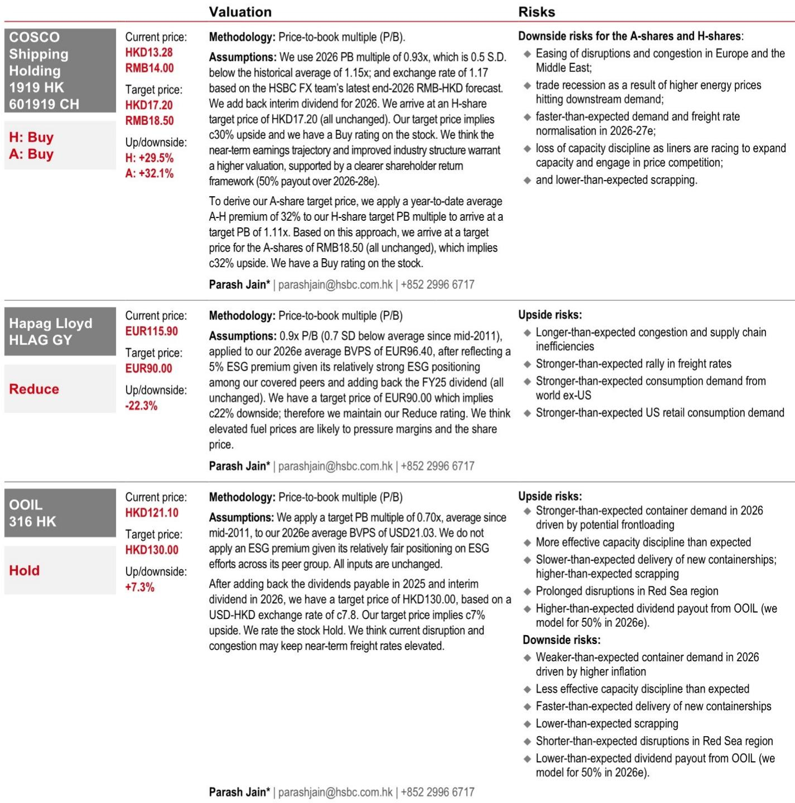
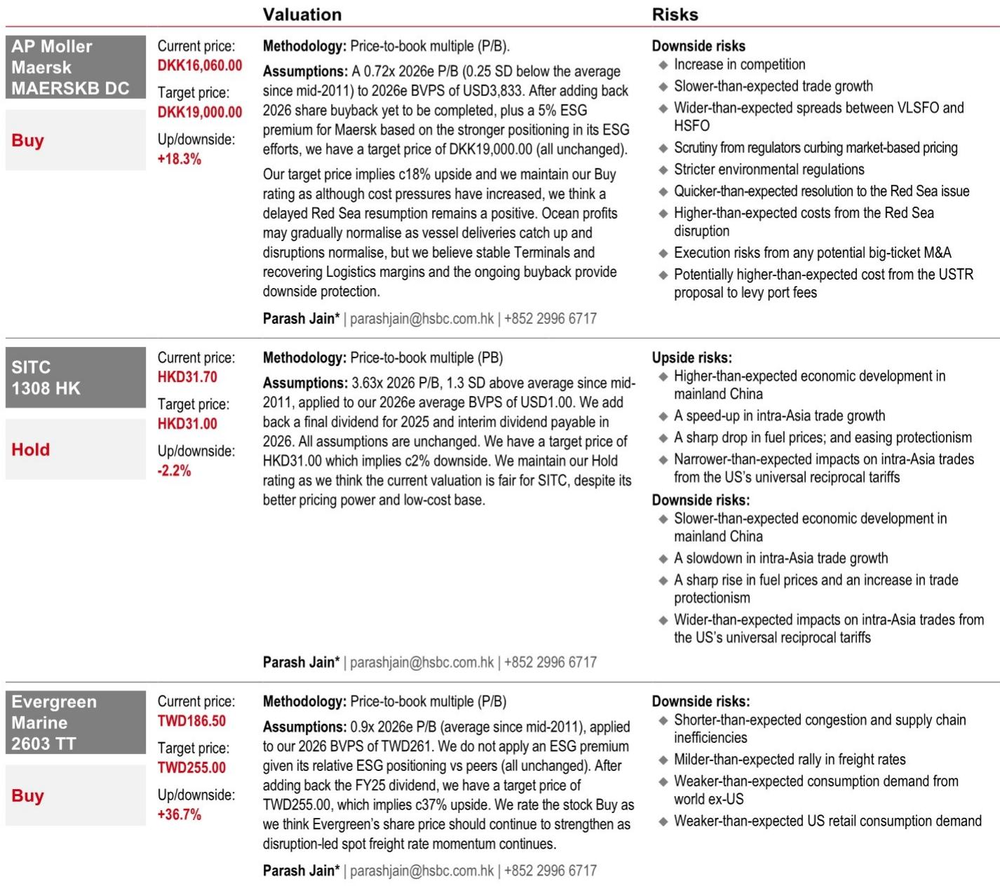
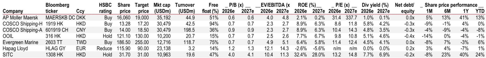

# HSBC：集装箱航运的景气周期比市场想的更长

当市场还在为集装箱航运的短期繁荣是否会戛然而止而争论时，HSBC与Linerlytica在6月25日的联合研讨会上给出了一个反共识的判断：这轮上行周期的驱动力不是关税前抢运，而是科技驱动的结构性需求。运价不仅没有见顶，还在6月下旬继续攀升。这意味着，行业EBIT利润率将从一季度的约5%跳升至二季度的约10%，三季度还有进一步上行的空间。

对于长期被贴上“周期性过山车”标签的集装箱航运来说，这个判断的分量不亚于一次行业认知的重塑。如果需求真的是结构性的，那么当前估值中隐含的“景气很快消退”的假设，就需要被重新审视。

## 1. 运价还在涨，而且涨得比市场预期的更久

HSBC的这份研报最直接的信号是：运价没有在传统旺季前掉头向下。截至6月下旬，美西航线现货运价维持在约每40英尺集装箱6000美元，美东航线在7000至8000美元区间。更重要的是，船公司还在推动7月新一轮涨价。租船费率维持高位，且租船与运费的价差正在收窄——这是运价上涨动能尚未衰竭的典型信号。

市场此前普遍预期，随着中国出口数据走弱，运价会在短暂冲高后回落。但HSBC的结论恰恰相反：有效运力紧张叠加需求改善，市场至少会坚挺到8月，甚至可能延续到9月。这意味着二季度和三季度的盈利弹性可能被严重低估。

> **KC评论：** 这里的关键不是运价绝对水平，而是运价上涨的持续性。如果市场预期的是“脉冲式冲高后回落”，那么当前股价可能只反映了短暂的盈利脉冲。但如果运价能维持到三季度末，整个年度的盈利预测都需要上修。完整报告里对运价分航线的逐月走势图，值得仔细看。

## 2. 需求不是抢跑，是科技基建在拉动

这是整份报告最核心的认知突破。HSBC指出，传统中国出口品类今年1-5月表现疲弱：服装下降1.6%，鞋类下降10.3%，玩具下降12.6%。这与“消费者抢运”的故事完全矛盾。如果真是关税前抢运，这些消费品类应该最先受益。

那么，运量增长来自哪里？答案是AI和数据中心建设，以及清洁能源技术（电池、电动车、太阳能）和配套的数据中心电力基础设施。这些不是短期库存行为，而是资本开支驱动的结构性需求。用HSBC的话说，需求是“科技主导且基础广泛”的。

这一判断的意义在于，它将集装箱航运从“消费周期股”重新定义为“科技基建受益股”。如果这个逻辑成立，那么即使美国关税政策出现波动，需求的基本盘也不会轻易崩塌。

## 3. 新兴市场正在吃掉过剩运力

HSBC的数据显示，跨太平洋航线运量同比增长约4-5%，5月强劲，6月更趋坚挺。欧洲需求高于去年峰值。但真正值得关注的是新兴市场：非洲航线运量年初至今增长50%，拉美增长12%。这些航线正在有效吸收全球过剩运力。

这意味着，即使美国需求放缓，全球集装箱航运的供需平衡也不会立刻恶化。新兴市场的增长为行业提供了一个“缓冲垫”，这是以往周期中很少出现的情况。

> **KC评论：** 非洲和拉美的运量增长50%和12%，这些数字在以往的周期报告中很少出现。如果新兴市场的运量增长是可持续的，那么全球航运的“需求锚点”正在发生结构性转移。完整报告中对各区域运量的月度拆解，是理解这一趋势的关键素材。

## 4. 红海回归是最大的下行风险，但时间窗口不确定

HSBC明确指出了当前市场最大的不确定性：红海航线的正常化。据Linerlytica估算，如果红海航线恢复，将释放约6%的全球有效运力，足以引发运价大幅修正。而当前全球港口拥堵仅吸收了约2%的运力。

但问题在于，红海回归的时间节点完全不可预测。地缘政治博弈、安全局势的演变，都使得“何时回归”变成了一个高度不确定的变量。HSBC的结论是：2026年需求增速（6-7%）仍将高于供给增速（约5%），短期供需缺口仍在。但2027-2028年新船交付高峰（供给增速约14%）将带来真正的考验。

对于投资者而言，这意味着：短期盈利向上有弹性，但长期估值面临供给过剩的压制。如何在“短期景气”和“长期过剩”之间定价，是当前市场分歧的核心。

## 5. 盈利弹性正在被低估

HSBC的测算显示，尽管燃料成本比冲突前高出约30%，但运营成本仅上升约2-3%。而中国出口集装箱运价指数（CCFI）已上涨约40-42%。这意味着利润将出现明显拐点：行业EBIT利润率可能从一季度的约5%提升至二季度的约10%，如果三季度运价维持，还有进一步上行空间。

HSBC甚至指出，马士基和赫伯罗特有可能上调2026年全年业绩指引。如果这一判断兑现，当前股价中隐含的“盈利见顶”预期将被证伪。

## 6. 联盟重组改变份额，但不改变定价权

HSBC还讨论了行业格局的变化。Linerlytica认为，Gemini合作联盟因合同敞口、现货折扣和轴辐式运营成本而表现不佳，时刻表可靠性的溢价可能有限。但整体来看，联盟重组更多是份额的重新分配，而不是竞争格局的根本改变。

这意味着，行业定价权仍然掌握在头部船公司手中，但不同公司的盈利分化会加大。那些能够将规模优势转化为议价权的公司，将在本轮周期中受益更多。

## 7. 2027-2028年的供给浪潮才是真正的“灰犀牛”

HSBC没有回避长期风险。新船交付将在2027年下半年加速，2028年达到顶峰，届时供给增速约14%，大概率超过需求。当前订单量仍然庞大（今年约500万TEU，年初至今约200万TEU），而拆船能力有限（最多每年约100万TEU），这意味着2028年净运力增速仍将高达11-12%。

这是一个典型的“周期股困境”：短期景气与长期过剩并存。对于长线投资者来说，关键在于判断这轮结构性需求能否持续到足以消化2027年后的供给浪潮。HSBC的报告没有给出明确答案，但提出了一个值得追问的方向：科技驱动的需求增长，是否会比市场预期的更持久？

> **KC评论：** 2027-2028年的供给浪潮是确定的，但需求端的不确定性更大。如果AI和数据中心建设持续加速，清洁能源出口继续扩张，那么航运需求的结构性增长可能部分抵消供给压力。完整报告中对2026-2028年供需平衡的量化模型，是判断这一问题的核心工具。

## 顺着这些未解问题继续讨论

HSBC这份报告的价值，不在于给出了一个简单的“买或卖”建议，而在于它重新定义了市场对集装箱航运周期的认知框架。需求的结构性变化、新兴市场的运量增长、盈利弹性的低估——这些都是值得深入拆解的方向。

但报告中也有一些尚未完全展开的追问：科技驱动的需求到底能持续多久？红海回归的时间节点如何预判？2027年后的供给压力能否被结构性需求消化？这些问题的答案，可能决定未来18个月航运板块的真正走势。

我们每天会由AI agent加人工review，生成国际投行的中文摘要与KC评论，daily更新约10-40页，也包含当天最新数据图表合集。这些内容既方便喂给AI做进一步分析，也方便人工快速把握全球市场的动态变化。欢迎来知识星球或微信群里继续讨论，一起拆解这些未解之问。

Personal reading notes and learning share only. Not investment advice.

