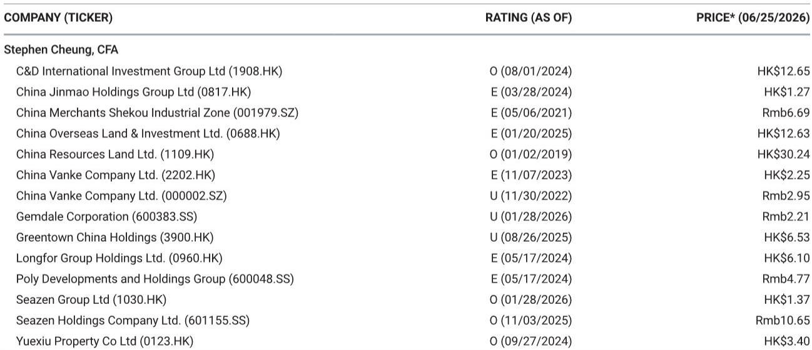
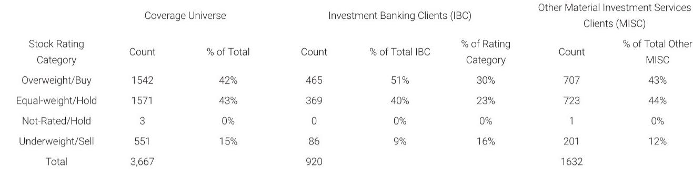

# 摩根斯坦利：MS：地产股跌回历史最低估值，但这不是抄底信号

地产板块跌回去了。不是跌回起点，是跌到比起点更低的位置。

自五月中旬以来，中国开发商股票整体回撤超过30%，同期恒生指数仅下跌13%。MS在最新发布的中国地产行业报告中承认，这一轮下跌的幅度“超出了他们此前的预期”——即便他们原本就对行业持谨慎态度。

现在，整个板块的市净率已经回落至0.30倍，处于历史最低区间。对于信奉价值投资的资金来说，这个数字看起来很有诱惑力。但MS的判断是：低估值不等于底部，更不等于买点。

核心问题在于：市场在交易什么？交易的是“还能不能更差”，而不是“什么时候变好”。

---

## 1. 这轮下跌的驱动力不是基本面本身，而是资金流向的系统性转移

MS将本轮地产股下跌归因为两个因素的叠加：销售端快速冷却，以及资金向AI相关板块的大规模转移。

销售端的冷却并不意外。三至五月期间，市场曾出现一波短暂的销售反弹和房价跌幅收窄，这在当时引发了一些“触底”讨论。但进入六月后，高频数据显示动能正在迅速消退。MS预计，三季度主要城市的二手住宅成交同比可能转负，新房价格环比跌幅将较二季度有所扩大。

更值得关注的是资金流向的结构性变化。AI主题在五月中旬之后持续升温，吸引了大量原本可能配置在地产板块的资金。这不是一个短期现象。当市场的主线叙事从“复苏”切换为“技术革命”，地产这种需要漫长等待基本面验证的板块，在资金争夺中天然处于劣势。

> **KC评论：** 资金流向的转移意味着，即使地产股的基本面没有进一步恶化，股价也可能持续承压。因为估值不仅仅是利润的函数，也是资金供给的函数。完整报告中对资金流向的量化分析值得细读，它会帮助你判断这个“挤出效应”到底有多大。

---

## 2. 政策空间正在收窄，七月底的政治局会议很难成为催化剂

很多投资者还在等待政策信号。但MS的判断是：三季度增量住房政策空间有限。

理由有三。第一，三至五月已经出现了一轮销售反弹和房价跌幅收窄，即便现在动能减弱，政策制定者仍倾向于观察现有措施的持续效果，而不是仓促加码。第二，在K型复苏的宏观背景下，政策资源更倾向于支持科技、高端制造等方向，而非再度大规模刺激地产。第三，七月底的政治局会议通常不会出台具体细则，更多是定调方向——而当前定调方向大概率是“巩固已有成果”，而非“推出新工具”。

这并不意味着政策完全缺席，而是说市场的政策预期需要下调。对于地产股而言，缺乏政策催化意味着估值修复缺乏最直接的驱动力。

---

## 3. 中报季将是下一个压力测试点，但市场的焦点已经提前转移

开发商通常从七月中旬开始发布上半年业绩预告或指引。MS预计，大部分开发商的中报将呈现盈利下滑甚至亏损，原因是结转收入减少和利润率持续压缩。

这个判断本身并不意外。但真正值得关注的是市场会如何反应。如果中报数据低于预期，股价可能进一步承压；如果中报数据符合预期甚至略好，市场也可能因为“已经Price in”而无动于衷。也就是说，中报季很难成为一个正向催化剂。

更关键的是，市场现在对“过去”的业绩已经不敏感了。投资者的注意力已经从“上半年赚了多少”转向“下半年还能卖多少”。而销售端的动能正在减弱，这意味着市场对未来的预期只会变得更谨慎，而不是更乐观。

> **KC评论：** 中报季的真正价值不在于业绩数字本身，而在于管理层给出的下半年指引。哪些开发商敢于给出正向指引，哪些只能模糊其词，这本身就是区分“alpha选手”和“beta跟风者”的重要信号。完整报告中包含对主要开发商盈利趋势的详细拆解，可以帮助你提前锁定需要重点关注的几家。

---

## 4. 报告尚未完全回答的关键问题：这轮估值重置是周期性的还是结构性的

MS在报告中反复强调一个观点：即便没有实体市场的明显复苏，部分开发商仍具备“自下而上的alpha”——即通过自身经营改善实现超额收益。

这个判断的核心逻辑是：在行业总量收缩的背景下，那些拥有优质购物中心租金收入、土地储备质量更高、财务纪律更强的开发商，可以通过“存量资产运营效率提升”和“市场份额集中”两条路径实现利润增长。

但这里有一个尚未被完全回答的问题：如果实体市场长期处于低景气状态，这些alpha选手的估值溢价能维持多久？换言之，市场现在给予华润置地（MS的首选标的）、建发国际、新城发展等公司的估值溢价，是基于“它们比别人好”，还是基于“行业终将复苏”的隐含假设？

如果行业长期不复苏，alpha选手最终也会被拖累——只是时间问题。这个时间差有多长，才是决定当前估值是否合理的核心变量。

---

## 5. 真正的观察框架：不是“买不买地产”，而是“买谁的地产”

MS给出了一个非常清晰的选股框架：只看那些具备“可信的自我改善alpha”的开发商。

具体而言，他们继续看好华润置地（首选）、建发国际和新城发展，认为这三家公司在当前估值下具备更有吸引力的风险收益比。这三家公司的共同点是：即使实体市场没有明显复苏，它们依然有相对稳健的每股盈利前景，并且存在中期估值重估的潜力。

相反，他们对金地集团和万科保持看空立场，核心理由是“土地储备枯竭”。对于开发商而言，土地储备就是未来的收入来源。当土储不足以支撑未来2-3年的开发规模时，即便市场复苏，这些公司也缺乏参与的能力。

这个选股框架背后的逻辑其实更值得深思：在地产行业的下行周期中，“规模”不再是护城河，“土储质量”和“运营效率”才是。那些过去靠高杠杆快速扩张的公司，现在面临的不只是销售下滑，而是整个商业模式的不可持续。

> **KC评论：** MS对万科A股给出“低于大盘”评级、H股是“与大市同步”，这个分化本身就值得玩味。背后的逻辑是什么？完整报告中对万科土储质量和现金流状况的详细分析，可以帮助你理解为什么两家评级不同，以及这个差异是否合理。

---

## 6. 低估值陷阱：历史最低P/B不一定意味着安全边际

0.30倍的市净率，确实处于历史最低水平。但MS的态度很明确：低估值适合价值投资者长期关注，但短期内缺乏催化剂，销售和盈利压力将继续压制股价表现。

这里需要区分两个概念：估值低不等于估值有支撑。当一家公司的资产质量在持续恶化时，账面净资产本身就在缩水。市净率的分母在变小，分子也在变小，所谓的“低估值”可能只是一个动态的陷阱。

真正值得关注的是：哪些开发商的资产质量是真实的，哪些是虚的。购物中心租金收入、已竣工物业的账面价值、土地储备的可变现能力——这些才是决定“0.30倍P/B到底是便宜还是合理”的关键。

---

这份报告的核心判断可以用一句话概括：地产股已经跌到了历史最低估值，但低估值本身不是买入的理由。真正的机会只属于那些即使行业不复苏也能活得好、甚至活得更好的公司。而对于大多数开发商而言，三季度可能比二季度更艰难。

但报告中也留下了一些未完全展开的问题：如果实体市场持续低迷，alpha选手的估值溢价能维持多久？政策层面是否会在四季度出现超预期转向？资金从地产向AI的转移是阶段性现象还是长期趋势？这些问题，都需要更深入的数据和更持续的跟踪才能回答。

我们每天会由AI agent加上人工review，生成国际投行中文摘要与KC评论，daily更新约10到40页，并整理当天最新数据图表合集。这些内容既方便喂给AI，也方便人工快速把握market dynamics。欢迎来星球微信群里继续讨论。

Personal reading notes and learning share only. Not investment advice.

