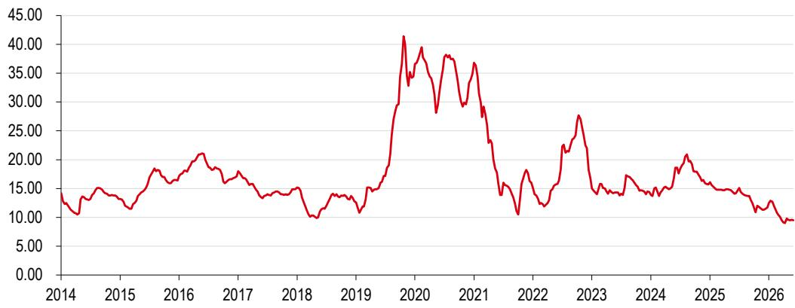
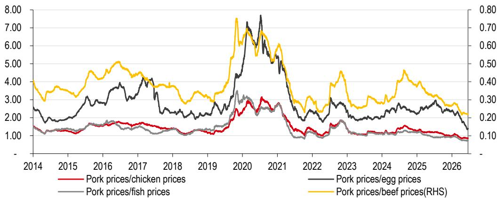
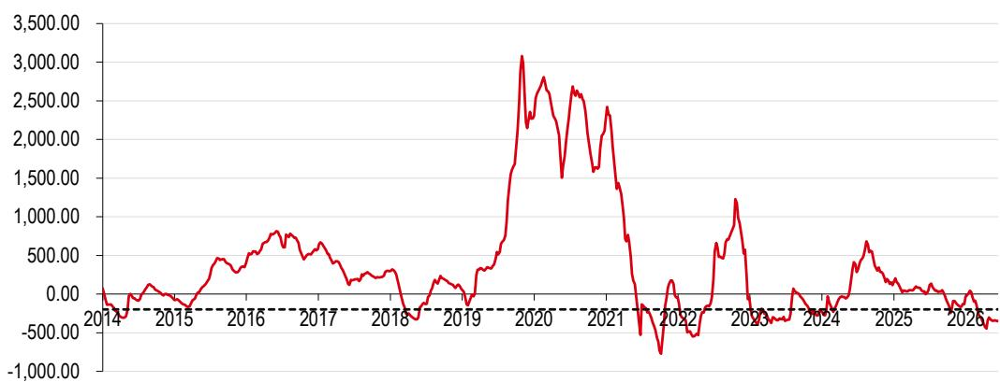
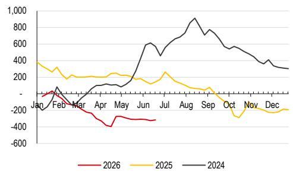
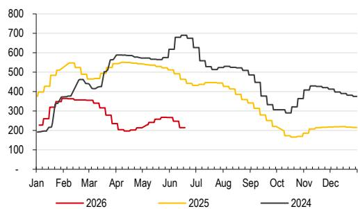
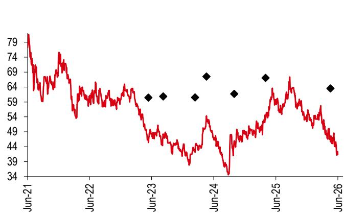
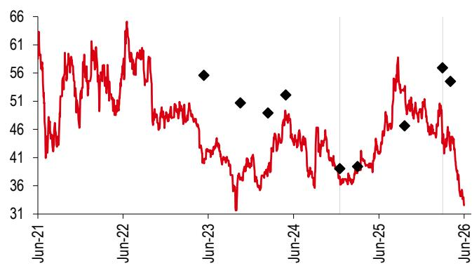
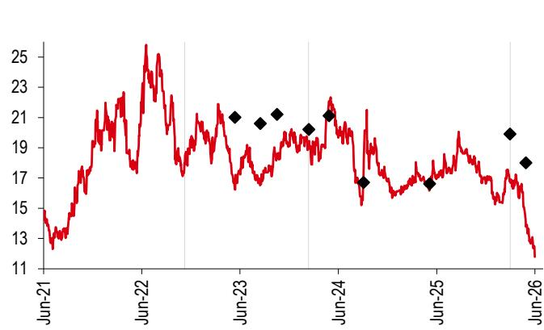

# China's hog industry

At the trough, mapping the path to recovery

\- Second-worst loss cycle since 2014 with self-breeding losses for around 9 months

\- Sow inventory reduction accelerates through 2Q26; supply contraction from 4Q26e driving hog price recovery

\- Maintain Buy ratings on Muyuan, Wens and Haid Group with unchanged TPs

Review: a record-breaking downcycle. China's hog sector is navigating its second-deepest loss cycle since 2014. The national hog price hit RMB9/kg in April 2026 – an all-time low since 2014 – and is currently oscillating around RMB9.5/kg. Self-breeding losses exceed RMB300/head, with over-RMB200/head losses persisting for over three months, making this the second-worst loss amplitude and the second-longest severe-loss episode on record. Despite pork being the cheapest animal protein source (supporting resilient demand evidenced by cold-storage inventory at a three-year high), oversupply has kept prices suppressed. The root cause traces back to May 2025, when MARA guided corporate producers to cut sow inventories, and while they complied, non-corporate producers expanded capacity, worsening the supply overhang for 1H26. Our estimates show that adding 10,000 head of sows against the policy tide in May 2025 would have incurred significant losses in March 2026 and onward.

## Outlook: capacity depletion underway; hog price inflection in 4Q26e. We

maintain our view that the decline in sow inventories will accelerate through 2Q26, driven by three forces: 1) financially strained non-corporate producers being forced to reduce sow herds (below, we analyze the losses from expanding sow heads against policy guidance in May 2025); 2) corporate producers maintaining sow levels per MARA guidance; and 3) piglet-specialist farms likely to cut capacity if 7kg piglet prices fall below RMB200/head. Production efficiency gains will partially offset the sow inventory reduction, but with the national sow inventory already down 3.3% y-o-y as of March 2026 and on track to reach MARA's 37.5 million target, we expect y-o-y hog supply to contract from 4Q26e onward, driving a moderate price recovery. Looking into 2027, sustained supply contraction should support a y-o-y price improvement.

Maintain Buy ratings on Muyuan, Wens and Haid. From a valuation standpoint, Muyuan Foods and Wens Foodstuff have both priced in this prolonged loss cycle and are trading at what we view as mid-cycle bottoms — levels that imply permanent impairment of earnings power, a scenario we believe is overly pessimistic given the hog cycle's self-correction mechanism. Haid Group offers an earlier earnings recovery catalyst in 3Q26e. We maintain our Buy ratings on Muyuan, Wens, and Haid. See valuation and key risks on page 2.

## Disclosures & Disclaimer

This report must be read with the disclosures and the analyst certifications in the Disclosure appendix, and with the Disclaimer, which forms part of it.

China

Yihui Sha\* (Reg. No. S1700519100001)

Head of A-share Agriculture Research

HSBC Qianhai Securities Limited

yihui.sha@hsbcqh.com.cn

+86 21 5066 2004

\* Employed by a non-US affiliate of HSBC Securities (USA) Inc, and is not registered/ qualified pursuant to FINRA regulations

No country for bears

The $24^{\text{th}}$ edition of the EM Sentiment Survey Click to view

Issuer of report: HSBC Qianhai Securities Limited

View HSBC Qianhai Securities Research at: https://www.research.hsbc.com

Source: Wind, HSBC Qianhai Securities estimates

Valuation and risks

<table><tr><td colspan="2"></td><td>Valuation</td><td>Risks</td></tr><tr><td>Haid Group002311 CH</td><td rowspan="2">Current price:RMB42.40Target price:RMB63.50Up/downside:+49.8%</td><td rowspan="2">Methodology: Target PE multiple (unchanged).Assumptions: We forecast a net profit CAGR of 13% in 2025-28e, 19% lower than the historical average in 2014-25; our target multiple is therefore 21.9x, 19% lower than the historical average in 2014-25. Based on our 2026e EPS of RMB2.90, we derive a target price of RMB63.50 (all unchanged). Our TP implies c50% upside to the current share price; we therefore retain our Buy rating on the stock.Yihui Sha* (Reg no: S1700519100001) | yihui.sha@hsbcqh.com.cn | +86 21 5066 2004</td><td rowspan="2">Downside risks◆ Overseas expansion below expectations◆ An avian flu outbreak◆ Unexpected surge in raw material prices◆ 2Q26e net profit under pressure due to drag of hog segment</td></tr><tr><td>Buy</td></tr><tr><td>Muyuan Foods002714 CH</td><td rowspan="2">Current price:RMB33.02Target price:RMB54.50Up/downside:+65.1%</td><td rowspan="2">Methodology: EV/EBITDA multiple (unchanged)Assumptions: We use an EV/EBITDA multiple of 10x, which is the 2014-24 historical average of its peers with high dividend payout ratio. Applying this target multiple to our 2026-27 average EBITDA of RMB38,133m, we derive a target price of RMB54.50 (all unchanged). Our TP implies c65% upside. Combined with the company&#x27;s cost leadership, industrial chain extension and expected industry cycle reversal, we maintain our Buy rating.Yihui Sha* (Reg no: S1700519100001) | yihui.sha@hsbcqh.com.cn | +86 21 5066 2004</td><td rowspan="2">Downside risks◆ African Swine Fever or other hog diseases◆ Slower-than-expected industry capacity reduction◆ Higher-than-expected raw material price hikes.◆ 2Q26e net profit under pressure due to sluggish hog price</td></tr><tr><td>Buy</td></tr><tr><td>WensFoodstuff300498 CH</td><td rowspan="2">Current price:RMB12.15Target price:RMB18.00Up/downside:+48.1%</td><td rowspan="2">Methodology: PB-ROEAssumption: Based on our 2026-27 average ROE estimate of 18%, we use a 2.52x target PB. Based on our 2026-27 average BVPS estimate of RMB7.16, we derive a target price of RMB18.00 (all unchanged). Our target price implies c48% upside. We maintain our Buy rating on this stock.Yihui Sha* (Reg no: S1700519100001) | yihui.sha@hsbcqh.com.cn | +86 21 5066 2004</td><td rowspan="2">Downside risks◆ African Swine Fever or other hog diseases.◆ Slower-than-expected industry capacity reduction.◆ Higher-than-expected raw material price hikes.◆ 2Q26e net profit under pressure due to sluggish hog price</td></tr><tr><td>Buy</td></tr></table>

\* Employed by a non-US affiliate of HSBC Securities (USA) Inc, and is not registered/ qualified pursuant to FINRA regulations  
Note: Priced as of 23 June 2026

## Where are hog prices now?

Absolute price: In April 2026, the national average hog price (source: National Bureau of Statistics, NBS) hit RMB9/kg, the lowest point since 2014 (Exhibit 1). The market has since recovered modestly to \~RMB9.5/kg but remains deeply depressed by historical standards.

Relative price (protein substitution): Pork prices relative to chicken, beef, eggs, and fish have all fallen to historical trough levels (Exhibit 2), making pork the one of the cheapest animal-protein sources in the current consumer environment. This provides a structural demand floor for pork consumption.

Profitability and loss cycle duration: deep and persistent losses. Self-breeding farmers are currently losing \~RMB300/head (source: Wind, Exhibit 3). Losses have endured for over 9 months (since Sep 2025, averaging RMB215/head). This is the second-deepest loss amplitude (after 2021's RMB318/head).

## Why are prices so low?

Supply-side driven, not demand-side. Pork's relative-value advantage as the cheapest animal protein should sustain resilient consumer demand. Indeed, downstream cold-storage inventory hit a three-year high year-to-date (source: SCI), signalling robust off-take from the processing channel and strong underlying consumption. The evidence points to oversupply as the primary driver, not weak demand.

Exhibit 1. Hog price (RMB/kg): lowest since 2014  
  
Source: NBS, HSBC Qianhai Securities

Exhibit 2. Pork price near multi-year lows vs. other meats – lowest since 2014  
  
Source: Wind, HSBC Qianhai Securities

Exhibit 3. Profitability of self-breeding farmers since 2014 (RMB/head)  
  
Source: Wind, HSBC Qianhai Securities  
Note: If a loss cycle is interrupted only by a brief period of profitability with profits under RMB50/head before reverting to losses, we treat the entire period as one continuous loss cycle.

Exhibit 4. Historical loss cycle of self-breeding farmers (since 2014)

<table><tr><td>Loss cycle</td><td>Duration</td><td>Avg Loss (RMB/head)</td></tr><tr><td>Jan ~ Jul 2014</td><td>6 months</td><td>-151</td></tr><tr><td>end-Oct 2014 ~ Apr 2015</td><td>6months</td><td>-70</td></tr><tr><td>Mar ~ Jul 2018</td><td>5 months</td><td>-198</td></tr><tr><td>Jan ~early Mar 2019</td><td>1.5 months</td><td>-70</td></tr><tr><td>Jun 2021~ Jun 2022 (excl. Nov 2021)</td><td>11 months (combined)</td><td>-318</td></tr><tr><td>Jan 2023 ~May 2024</td><td>16 months</td><td>-211</td></tr><tr><td>Sep 2025 – present (Jun 2026)</td><td>~9 months (ongoing)</td><td>-215</td></tr></table>

Source: Wind, HSBC Qianhai Securities

## Why the oversupply?

Hog supply from March 2026 onward is determined by the breeding sow inventory \~10 months prior, i.e., the sow herd dynamics starting May 2025.

In May 2025, the Ministry of Agriculture and Rural Affairs (MARA) held multiple meetings urging large-scale corporate farms to cap or reduce their sow herds, signaling an impending sector-wide contraction. The market turned more optimistic on 2026e hog prices in anticipation of reduced supply.

By end-September 2025, Muyuan's sow reduction alone exceeded the national total decline (Exhibit 5), suggesting that while corporate players complied with MARA's guidance to reduce or stabilise sow herds, non-corporate (smallholder) producers were still expanding capacity.

This is consistent with our previously published view: corporate players would pare sow numbers under policy direction but would simultaneously optimise their sow herd structure (higher PSY, better survival rates), boosting per-sow productivity and partially offsetting the headcount reduction. Meanwhile, non-corporate producers continued adding sows through at least September 2025, further inflating the supply pipeline for March-July 2026. This is the very reason we held a bearish view on 1H26 hog prices in our earlier reports (see Hog price downtrend continues in 1H26, 13 October 2025).

Exhibit 5. Quarterly changes in sow inventories since 2025 (m head)

<table><tr><td></td><td>Mar-25</td><td>Jun-25</td><td>Sep-25</td><td>Dec-25</td><td>Mar-26</td></tr><tr><td>National sow inventories (NBS)</td><td>40.39</td><td>40.43</td><td>40.35</td><td>39.61</td><td>39.04</td></tr><tr><td>changes (q-o-q, m head)</td><td></td><td>+0.04</td><td>-0.08</td><td>-0.74</td><td>-0.57</td></tr><tr><td>Muyuan&#x27;s sow inventories</td><td>3.49</td><td>3.43</td><td>3.31</td><td>3.23</td><td>3.13</td></tr><tr><td>changes (q-o-q, m head)</td><td></td><td>-0.05</td><td>-0.13</td><td>-0.07</td><td>-0.10</td></tr></table>

Source: NBS, Wind, company announcement, HSBC Qianhai Securities

## How much did adding 10,000 sows in May 2025 lose?

We simplify the hog production chain to two cases for breeding sows: 1) selling piglets; or 2) selling finishing hogs.

Scenario 1: Purchasing culled sows as breeding sows. Culled sows typically weigh 180kg+. In May 2025, the average culled-sow price was RMB11.7/kg, implying a total outlay of RMB21.1m for 10,000 head.

\- Weaned piglet path. Weaned piglets from these sows would be ready by October 2025. At that time, the weaned-piglet price was RMB172/head vs. a cost of RMB292/head, resulting in a loss of \~RMB12.4m if all piglets were sold immediately.

\- Finishing hog path. We believe most non-specialised piglet producers would not sell piglets at a loss; they would instead raise piglets to finishing weight. The corresponding ready date would be March 2026. The average loss per finishing hog in March was RMB242/head, implying a total loss of \~RMB23.0m.

Scenario 2: Converting replacement gilts to breeding sows. In May 2025, the cost of a replacement gilt (50kg → breeding-ready) was RMB2,849/head. For 10,000 head, the upfront outlay was RMB28.5m. Subsequent piglet/hog losses are identical to Scenario 1.

Net-net: adding 10,000 sows between May and August 2025 would have incurred upfront costs of RMB20-30m. In addition, finishing hog sales may generate a further RMB20m in losses. We believe the combined sow purchase costs and finishing hog losses impose significant financial strain on hog breeding farmers.

Exhibit 6. Analysis of purchasing 1 breeding sow starting from May 2025 (RMB)

<table><tr><td></td><td>May 2025</td><td>Jun 2025</td><td>Jul 2025</td><td>Aug 2025</td><td>Sep 2025</td></tr><tr><td>Scenario 1</td><td>2,106</td><td>1,974</td><td>1,934</td><td>1,832</td><td>1,734</td></tr><tr><td>Scenario 2</td><td>2,849</td><td>2,840</td><td>2,837</td><td>2,855</td><td>2,859</td></tr><tr><td>Corresponding weaned piglet sale date</td><td>Oct 2025</td><td>Nov 2025</td><td>Dec 2025</td><td>Jan 2026</td><td>Feb 2026</td></tr><tr><td># of weaned piglet</td><td>10.3</td><td>10.3</td><td>10.1</td><td>10.2</td><td>10.3</td></tr><tr><td>Weaned piglet price(RMB/head)</td><td>172</td><td>207</td><td>218</td><td>292</td><td>360</td></tr><tr><td>Weaned piglet cost(RMB/head)</td><td>292</td><td>288</td><td>287</td><td>289</td><td>284</td></tr><tr><td>Profit/loss if selling weaned piglet</td><td>-1,240</td><td>-832</td><td>-702</td><td>30</td><td>785</td></tr><tr><td>Corresponding finishing hog sale date</td><td>Mar 2026</td><td>Apr 2026</td><td>May 2026</td><td>Jun 2026</td><td>Jul 2026</td></tr><tr><td># of finishing hogs</td><td>9.5</td><td>9.5</td><td>9.3</td><td>9.4</td><td>9.5</td></tr><tr><td>Profit/loss if selling finishing hogs</td><td>-2,298</td><td>-3,135</td><td>-2,831</td><td>-2,965</td><td>NM</td></tr></table>

Source: SCI, Wind, HSBC Qianhai Securities estimates

## Why will capacity continue to deplete?

Non-corporate producers who expanded against policy guidance are under severe financial strain. Our analysis suggests these players suffered meaningful losses from the May 2025 expansion and are now being forced to reduce capacity, even if their price outlook remains optimistic.

Corporate producers have already reduced sow inventory in line with MARA guidance. Absent further policy intervention, we expect corporate sow herds to stabilise at current levels. Additional policy pressure could trigger further reductions.

Other self-breeding farmers, even those who did not expand in May 2025, are being squeezed by the March – June 2026 deep-loss environment. The sustained losses will push these operators to reduce sow inventory as working capital depletes.

Piglet-specialist farms. Weaned-piglet prices held up relatively well through 1H26, keeping losses modest and not yet triggering this capacity exit, in our view. However, if the 7kg weaned-piglet price falls and stays below RMB200/head, we expect this segment to accelerate capacity reduction as well.

Conclusion: We maintain our view that hog industry capacity will accelerate its decline through 2Q26e.

Exhibit 7. Self-breeding profits (RMB/head)  
  
Source: SCI, HSBC Qianhai Securities

Exhibit 8. Piglet (7kg) price (RMB/head)  
  
Source: SCI, HSBC Qianhai Securities

## The impact of efficiency gains

Efficiency improvements will partially offset the impact of sow inventory reduction. We estimate the sow efficiency corresponding to finishing hog volumes in:

◆ 1H26e: Production efficiency +2-3% y-o-y

2H26e: Further improvement to +4-5% y-o-y, though persistent losses may cap actual gains below this range

2027e: Efficiency improvement of \~2-3% y-o-y, driven primarily by:

\- Sow structure optimisation at corporate farms

\- Elimination of low-efficiency capacity from non-corporate producers forced out of the market

This is consistent with the production efficiency trajectory observed among leading corporate players since 2024.

As of March 2026, the national breeding sow inventory was down $3.3\%$ y-o-y. MARA has lowered the target sow inventory threshold to 37.5m head. Given deep losses in 2Q26, if the sequential monthly decline averages $0.5 - 1\%$ , the sow herd could reach MARA's target by 3Q26e, implying a y-o-y decline of approximately $7\%$ .

We therefore expect China's hog supply to contract y-o-y in 2027e, driving a year-on-year price recovery.

## When is the inflection point?

Based on breeding sow inventory trends combined with production efficiency indicators, we expect y-o-y supply contraction to begin in 4Q26e. However, the rising cold-storage inventory (at a three-year high y-t-d) will partially absorb the supply reduction.

Our base case: a moderate price recovery in 4Q26e, rather than a sharp rebound. A full-cycle recovery would require sustained depletion of both live-hog and cold-storage inventories.

# Disclosure appendix

## Analyst Certification

The following analyst(s), economist(s), or strategist(s) who is(are) primarily responsible for this report, including any analyst(s) whose name(s) appear(s) as author of an individual section or sections of the report and any analyst(s) named as the covering analyst(s) of a subsidiary company in a sum-of-the-parts valuation certifies(y) that the opinion(s) on the subject security(ies) or issuer(s), any views or forecasts expressed in the section(s) of which such individual(s) is(are) named as author(s), and any other views or forecasts expressed herein, including any views expressed on the back page of the research report, accurately reflect their personal view(s) and that no part of their compensation was, is or will be directly or indirectly related to the specific recommendation(s) or views contained in this research report: Yihui Sha

## Important disclosures

## Equities: Stock ratings and basis for financial analysis

HSBC and its affiliates, including the issuer of this report (“HSBC”) believes an investor’s decision to buy or sell a stock should depend on individual circumstances such as the investor’s existing holdings, risk tolerance and other considerations and that investors utilise various disciplines and investment horizons when making investment decisions. Ratings should not be used or relied on in isolation as investment advice. Different securities firms use a variety of ratings terms as well as different rating systems to describe their recommendations and therefore investors should carefully read the definitions of the ratings used in each research report. Further, investors should carefully read the entire research report and not infer its contents from the rating because research reports contain more complete information concerning the analysts’ views and the basis for the rating.

## From 23rd March 2015 HSBC has assigned ratings on the following basis:

The target price is based on the analyst's assessment of the stock's actual current value, although we expect it to take six to 12 months for the market price to reflect this. When the target price is more than $20\%$ above the current share price, the stock will be classified as a Buy; when it is between $5\%$ and $20\%$ above the current share price, the stock may be classified as a Buy or a Hold; when it is between $5\%$ below and $5\%$ above the current share price, the stock will be classified as a Hold; when it is between $5\%$ and $20\%$ below the current share price, the stock may be classified as a Hold or a Reduce; and when it is more than $20\%$ below the current share price, the stock will be classified as a Reduce.

Our ratings are re-calibrated against these bands at the time of any ‘material change’ (initiation or resumption of coverage, change in target price or estimates).

Upside/Downside is the percentage difference between the target price and the share price.

## Prior to this date, HSBC's rating structure was applied on the following basis:

For each stock we set a required rate of return calculated from the cost of equity for that stock's domestic or, as appropriate, regional market established by our strategy team. The target price for a stock represented the value the analyst expected the stock to reach over our performance horizon. The performance horizon was 12 months. For a stock to be classified as Overweight, the potential return, which equals the percentage difference between the current share price and the target price, including the forecast dividend yield when indicated, had to exceed the required return by at least 5 percentage points over the succeeding 12 months (or 10 percentage points for a stock classified as Volatile\*). For a stock to be classified as Underweight, the stock was expected to underperform its required return by at least 5 percentage points over the succeeding 12 months (or 10 percentage points for a stock classified as Volatile\*). Stocks between these bands were classified as Neutral.

\*A stock was classified as volatile if its historical volatility had exceeded $40\%$ , if the stock had been listed for less than 12 months (unless it was in an industry or sector where volatility is low) or if the analyst expected significant volatility. However, stocks which we did not consider volatile may in fact also have behaved in such a way. Historical volatility was defined as the past month's average of the daily 365-day moving average volatilities. In order to avoid misleadingly frequent changes in rating, however, volatility had to move 2.5 percentage points past the $40\%$ benchmark in either direction for a stock's status to change.

## Rating distribution for long-term investment opportunities

As of 31 March 2026, the distribution of all independent ratings published by HSBC is as follows:

Buy 59% (12% of these provided with Investment Banking Services in the past 12 months)

Hold 36% (12% of these provided with Investment Banking Services in the past 12 months)

Sell 6% (6% of these provided with Investment Banking Services in the past 12 months)

For the purposes of the distribution above the following mapping structure is used during the transition from the previous to current rating models: under our previous model, Overweight = Buy, Neutral = Hold and Underweight = Sell; under our current model Buy = Buy, Hold = Hold and Reduce = Sell. For rating definitions under both models, please see “Stock ratings and basis for financial analysis” above.

For the distribution of non-independent ratings published by HSBC, please see the disclosure page available at http://www.hsbcnet.com/gbm/financial-regulation/investment-recommendations-disclosures.

## Share price and rating changes for long-term investment opportunities

Haid Group (002311.SZ) share price performance CNY Vs HSBC rating history

Rating & target price history

<table><tr><td>From</td><td>To</td><td>Date</td><td>Analyst</td></tr><tr><td>N/A</td><td>Buy</td><td>16 Oct 2019</td><td>Andy Li</td></tr><tr><td>Target price</td><td>Value</td><td>Date</td><td>Analyst</td></tr><tr><td>Price 1</td><td>60.40</td><td>06 Jun 2023</td><td>Yihui Sha</td></tr><tr><td>Price 2</td><td>60.80</td><td>01 Sep 2023</td><td>Yihui Sha</td></tr><tr><td>Price 3</td><td>60.50</td><td>06 Mar 2024</td><td>Yihui Sha</td></tr><tr><td>Price 4</td><td>67.50</td><td>13 May 2024</td><td>Yihui Sha</td></tr><tr><td>Price 5</td><td>61.70</td><td>23 Oct 2024</td><td>Yihui Sha</td></tr><tr><td>Price 6</td><td>67.00</td><td>25 Apr 2025</td><td>Yihui Sha</td></tr><tr><td>Price 7</td><td>63.50</td><td>12 May 2026</td><td>Yihui Sha</td></tr></table>

Source: HSBC  
Source: HSBC

Muyuan Foods (002714.SZ) share price performance
CNY Vs HSBC rating history  
  
Source: HSBC

Rating & target price history

<table><tr><td>From</td><td>To</td><td>Date</td><td>Analyst</td></tr><tr><td>Hold</td><td>Buy</td><td>21 Apr 2021</td><td>Andy Li</td></tr><tr><td>Buy</td><td>Hold</td><td>08 Jan 2025</td><td>Yihui Sha</td></tr><tr><td>Hold</td><td>Buy</td><td>24 Mar 2026</td><td>Yihui Sha</td></tr><tr><td>Target price</td><td>Value</td><td>Date</td><td>Analyst</td></tr><tr><td>Price 1</td><td>55.60</td><td>06 Jun 2023</td><td>Yihui Sha</td></tr><tr><td>Price 2</td><td>50.70</td><td>09 Nov 2023</td><td>Yihui Sha</td></tr><tr><td>Price 3</td><td>48.90</td><td>06 Mar 2024</td><td>Yihui Sha</td></tr><tr><td>Price 4</td><td>52.10</td><td>22 May 2024</td><td>Yihui Sha</td></tr><tr><td>Price 5</td><td>39.00</td><td>08 Jan 2025</td><td>Yihui Sha</td></tr><tr><td>Price 6</td><td>39.40</td><td>25 Mar 2025</td><td>Yihui Sha</td></tr><tr><td>Price 7</td><td>46.60</td><td>13 Oct 2025</td><td>Yihui Sha</td></tr><tr><td>Price 8</td><td>56.90</td><td>24 Mar 2026</td><td>Yihui Sha</td></tr><tr><td>Price 9</td><td>54.50</td><td>27 Apr 2026</td><td>Yihui Sha</td></tr></table>

Source: HSBC

Wens Foodstuff Group (300498.SZ) share price performance CNY Vs HSBC rating history

Rating & target price history

<table><tr><td>From</td><td>To</td><td>Date</td><td>Analyst</td></tr><tr><td>Hold</td><td>Buy</td><td>01 Dec 2022</td><td>Yihui Sha</td></tr><tr><td>Buy</td><td>Hold</td><td>06 Mar 2024</td><td>Yihui Sha</td></tr><tr><td>Hold</td><td>Buy</td><td>24 Mar 2026</td><td>Yihui Sha</td></tr><tr><td>Target price</td><td>Value</td><td>Date</td><td>Analyst</td></tr><tr><td>Price 1</td><td>21.00</td><td>06 Jun 2023</td><td>Yihui Sha</td></tr><tr><td>Price 2</td><td>20.60</td><td>08 Sep 2023</td><td>Yihui Sha</td></tr><tr><td>Price 3</td><td>21.20</td><td>09 Nov 2023</td><td>Yihui Sha</td></tr><tr><td>Price 4</td><td>20.20</td><td>06 Mar 2024</td><td>Yihui Sha</td></tr><tr><td>Price 5</td><td>21.10</td><td>21 May 2024</td><td>Yihui Sha</td></tr><tr><td>Price 6</td><td>16.70</td><td>26 Sep 2024</td><td>Yihui Sha</td></tr><tr><td>Price 7</td><td>16.60</td><td>29 May 2025</td><td>Yihui Sha</td></tr><tr><td>Price 8</td><td>19.90</td><td>24 Mar 2026</td><td>Yihui Sha</td></tr><tr><td>Price 9</td><td>18.00</td><td>22 May 2026</td><td>Yihui Sha</td></tr><tr><td colspan="4">Source: HSBC</td></tr></table>

Source: HSBC

To view a list of all the independent fundamental ratings/recommendations disseminated by HSBC during the preceding 12-month period, and the location where we publish our quarterly distribution of non-fundamental recommendations (applicable to Fixed Income and Currencies research only), please use the following links to access the disclosure page:

Clients of HSBC Private Bank: www.research.privatebank.hsbc.com/Disclosures

All other clients: www.research.hsbc.com/A/Disclosures

## HSBC & Analyst disclosures

## Disclosure checklist

<table><tr><td>Company</td><td>Ticker</td><td>Recent price</td><td>Price date</td><td>Disclosure</td></tr><tr><td>HAID GROUP</td><td>002311.SZ</td><td>41.40</td><td>24 Jun 2026</td><td>7</td></tr><tr><td>MUYUAN FOODS</td><td>002714.SZ</td><td>32.53</td><td>24 Jun 2026</td><td>-</td></tr><tr><td>WENS FOODSTUFF GROUP</td><td>300498.SZ</td><td>11.79</td><td>24 Jun 2026</td><td>-</td></tr></table>

1 HSBC has managed or co-managed a public offering of securities for this company within the past 12 months.

2 HSBC expects to receive or intends to seek compensation for investment banking services from this company in the next 3 months.

3 At the time of publication of this report, HSBC Securities (USA) Inc. is a Market Maker in securities issued by this company.

4 As of 31 May 2026, HSBC beneficially owned 1% or more of a class of common equity securities of this company.

5 This company was a client of HSBC or had during the preceding 12 month period been a client of and/or paid compensation to HSBC in respect of investment banking services.

6 This company was a client of HSBC or had during the preceding 12 month period been a client of and/or paid compensation to HSBC in respect of non-investment banking securities-related services.

7 This company was a client of HSBC or had during the preceding 12 month period been a client of and/or paid compensation to HSBC in respect of non-securities services.

8 A covering analyst/s has received compensation from this company in the past 12 months.

9 A covering analyst/s or a member of his/her household has a financial interest in the securities of this company, as detailed below.

10 A covering analyst/s or a member of his/her household is an officer, director or supervisory board member of this company, as detailed below.

11 At the time of publication of this report, HSBC is a non-US Market Maker in securities issued by this company and/or in securities in respect of this company.

12 As of 19 June 2026, HSBC beneficially held a net long position of more than $0.5\%$ of this company's total issued share capital, calculated according to the SSR methodology.

13 As of 19 June 2026, HSBC beneficially held a net short position of more than $0.5\%$ of this company's total issued share capital, calculated according to the SSR methodology.

14 HSBC Qianhai Securities Limited holds 1% or more of a class of common equity securities of this company.

HSBC and its affiliates will from time to time sell to and buy from customers the securities/instruments, both equity and debt (including derivatives) of companies covered in HSBC on a principal or agency basis or act as a market maker or liquidity provider in the securities/instruments mentioned in this report.

Analysts, economists, and strategists are paid in part by reference to the profitability of HSBC which includes investment banking, sales & trading, and principal trading revenues.

Whether, or in what time frame, an update of this analysis will be published is not determined in advance.

Non-U.S. analysts may not be associated persons of HSBC Securities (USA) Inc, and therefore may not be subject to FINRA Rule 2241 or FINRA Rule 2242 restrictions on communications with the subject company, public appearances and trading securities held by the analysts.

Economic sanctions laws imposed by certain jurisdictions such as the US, the EU, the UK, and others, may prohibit persons subject to those laws from making certain types of investments, including by transacting or dealing in securities of particular issuers, sectors, or regions. This report does not constitute advice in relation to any such laws and should not be construed as an inducement to transact in securities in breach of such laws.

For disclosures in respect of any company mentioned in this report, please see the most recently published report on that company available at www.hsbcnet.com/research. HSBC Private Bank clients should contact their Relationship Manager for queries regarding other research reports. In order to find out more about the proprietary models used to produce this report, please contact the authoring analyst.

## Additional disclosures

1 This report is dated as at 25 June 2026.

2 All market data included in this report are dated as at close 23 June 2026, unless a different date and/or a specific time of day is indicated in the report.

3 HSBC has procedures in place to identify and manage any potential conflicts of interest that arise in connection with its Research business. HSBC's analysts and its other staff who are involved in the preparation and dissemination of Research operate and have a management reporting line independent of HSBC's Investment Banking business. Information Barrier procedures are in place between the Investment Banking, Principal Trading, and Research businesses to ensure that any confidential and/or price sensitive information is handled in an appropriate manner.

4 You are not permitted to use, for reference, any data in this document for the purpose of (i) determining the interest payable, or other sums due, under loan agreements or under other financial contracts or instruments, (ii) determining the price at which a financial instrument may be bought or sold or traded or redeemed, or the value of a financial instrument, and/or (iii) measuring the performance of a financial instrument or of an investment fund.

5 This report may be a translation of a report authored in another language. If so, and if there is any discrepancy between versions, the original-language version shall prevail.

## Production & distribution disclosures

1. This report was produced and signed off by the author on 25 Jun 2026 08:28 GMT.

2. In order to see when this report was first disseminated please see the disclosure page available at https://research.hsbcqh.com.cn/R/34/VrdCZxR

# Disclaimer

Legal entities as at 13 May 2026:

HSBC Bank plc; HSBC Continental Europe; HSBC Continental Europe SA, Germany; HSBC Bank Middle East Limited, DIFC; HSBC Bank Middle East Limited, Dubai branch; HSBC Yatirim Menkul Degerler AS, Istanbul; The Hongkong and Shanghai Banking Corporation Limited, Hong Kong; The Hongkong and Shanghai Banking Corporation Limited, Singapore Branch; The Hongkong and Shanghai Banking Corporation Limited, Seoul Securities Branch; The Hongkong and Shanghai Banking Corporation Limited, Seoul Branch; HSBC Qianhai Securities Limited; HSBC Securities (Taiwan) Corporation Limited; HSBC Securities and Capital Markets (India) Private Limited, Mumbai; HSBC Bank Australia Limited; HSBC Securities (USA) Inc., New York; HSBC México, SA, Institución de Banca Múltiple, Grupo Financiero HSBC; Banco HSBC SA

Issuer of report

HSBC Qianhai Securities Limited
Unit 2201, 22/F, Qianhai Chow Tai Fook Finance Tower (Phase I), No. 66 Shu Niu Avenue, Nanshan Subdistrict, the Shenzhen Qianhai Shenzhen-Hong Kong Cooperation Zone, the PRC
Phone number: +86 755 8898 3288
Website: www.hsbcqh.com.cn

In mainland China, this document is issued and approved by HSBC Qianhai Securities Limited for the information of its clients only; it is not intended for and should not be distributed to retail customers in mainland China. HSBC Qianhai Securities Limited is regulated by the China Securities Regulatory Commission ("CSRC") and is qualified to engage in Securities Investment Advisory Business in mainland China [91440300MA5EPLHG1B]. All inquiries by recipients must be directed to the HSBC Qianhai Securities Limited contact in mainland China. If it is received by a customer of an affiliate of HSBC Qianhai Securities Limited, its provision to the recipient is subject to the terms of business in place between the recipient and such affiliate. This document is being supplied to you solely for your information and may not be redistributed or passed on, directly or indirectly, to any other person, in whole or in part, for any purpose. This document is not and should not be construed as an offer to sell or solicitation of an offer to purchase or subscribe for any investment. HSBC Qianhai Securities Limited has based this document on information obtained from sources it believes to be reliable but which it has not independently verified; HSBC Qianhai Securities Limited makes no guarantee, representation or warranty and accepts no responsibility or liability as to its accuracy or completeness. The decision and responsibility on whether or not to purchase, subscribe or sell (as applicable) must be taken by the investor. No consideration has been given to the particular investment objectives, financial situation or particular needs of any recipient. Any form of written or verbal commitment on the sharing of gains or losses from the securities investment between the investors and the HSBC Qianhai Securities Limited arising from the research services provided are not permitted and shall be invalid. Expressions of opinion are those of the Research Division of HSBC Qianhai Securities Limited only and are subject to change without notice. From time to time research analysts conduct site visits of covered issuers. HSBC Qianhai Securities Limited and its affiliates and/or their officers, directors and employees may have positions in any securities mentioned in this document (or in any related investment) and may from time to time add to or dispose of any such securities (or investment) to the extent permitted by law. HSBC policies prohibit research analysts from accepting payment or reimbursement for travel expenses from the issuer for such visits. HSBC Qianhai Securities Limited and its affiliates may act as market maker or have assumed an underwriting commitment in the securities of companies discussed in this document (or in related investments), may sell them to or buy them from customers on a principal basis and may also perform or seek to perform investment banking or underwriting services for or relating to those companies and may also be represented on the supervisory board or any other committee of those companies. This document may contain hyperlinks to external websites for convenience of its recipients. HSBC Qianhai Securities Limited are not responsible for any content therein.

The Hongkong and Shanghai Banking Corporation Limited owns 90% and Qianhai Financial Holdings Co., Ltd. ("QFH") owns 10% of shares in HSBC Qianhai Securities Limited, which prepared and/or contributed to this research report. HSBC Qianhai Securities Limited has established policies and procedures reasonably designed to prevent QFH from exercising direct or indirect influence over the content of HSBC Qianhai Securities Limited research reports and the choice of companies that will be the subject of research reports. Furthermore, HSBC Qianhai Securities Limited has established additional policies and procedures reasonably designed to prevent any person or entity, whether from within HSBC Qianhai Securities Limited, QFH or otherwise, from influencing the activities of the HSBC Qianhai Securities Limited's research analysts or the content of research reports.

In Hong Kong, this document has been distributed by The Hongkong and Shanghai Banking Corporation Limited in the conduct of its Hong Kong regulated business for the information of its institutional and professional customers; it is not intended for and should not be distributed to retail customers in Hong Kong, unless permitted otherwise. The Hongkong and Shanghai Banking Corporation Limited makes no representations that the products or services mentioned in this document are available to persons in Hong Kong. Any enquiries with respect to any matters arising from, or in connection with, this research report should be directed to the recipient's contact person at The Hongkong and Shanghai Banking Corporation Limited. The analyst(s) named in this research report who is(are) not employed by and/or accredited to The Hongkong and Shanghai Banking Corporation Limited is(are) not licensed to carry on any regulated activities in Hong Kong under the SFO. The analyst(s) is(are) only named in this research report as being a source of the information contained herein and does(do) not purport to carry on any regulated activities in Hong Kong under the SFO or hold himself/herself(themselves) out as being able to do so. The document is intended to be distributed in its entirety. Unless governing law permits otherwise, you must contact a HSBC Group member in your home jurisdiction if you wish to use HSBC Group services in effecting a transaction in any investment mentioned in this document.

In the UK, this publication is distributed by HSBC Bank plc for the information of its Clients (as defined in the Rules of FCA) and those of its affiliates only. Nothing herein excludes or restricts any duty or liability to a customer which HSBC Bank plc has under the Financial Services and Markets Act 2000 or under the Rules of FCA and PRA. A recipient who chooses to deal with any person who is not a representative of HSBC Bank plc in the UK will not enjoy the protections afforded by the UK regulatory regime. HSBC Bank plc is regulated by the Financial Conduct Authority and the Prudential Regulation Authority.

In the European Economic Area, this publication has been distributed by HSBC Continental Europe or by such other HSBC affiliate from which the recipient receives relevant services.

In Japan, this publication has been distributed by HSBC Securities (Japan) Co., Ltd.. It may not be further distributed in whole or in part for any purpose. In Korea, this publication is distributed by either The Hongkong and Shanghai Banking Corporation Limited, Seoul Securities Branch ("HBAP SLS") or The Hongkong and Shanghai Banking Corporation Limited, Seoul Branch ("HBAP SEL") for the general information of professional investors specified in Article 9 of the Financial Investment Services and Capital Markets Act ("FSCMA"). This publication is not a prospectus as defined in the FSCMA. It may not be further distributed in whole or in part for any purpose. Both HBAP SLS and HBAP SEL are regulated by the Financial Services Commission and the Financial Supervisory Service of Korea. In Singapore, this publication is distributed by The Hongkong and Shanghai Banking Corporation Limited, Singapore Branch for the general information of institutional investors or other persons specified in Sections 274 and 304 of the Securities and Futures Act 2001 of Singapore ("SFA") and accredited investors and other persons in accordance with the conditions specified in Sections 275 and 305 of the SFA. Only Economics or Currencies reports are intended for distribution to a person who is not an Accredited Investor, Expert Investor or Institutional Investor as defined in SFA. The Hongkong and Shanghai Banking Corporation Limited, Singapore Branch accepts legal responsibility for the contents of reports. This publication is not a prospectus as defined in the SFA. It may not be further distributed in whole or in part for any purpose. The Hongkong and Shanghai Banking Corporation Limited Singapore Branch is regulated by the Monetary Authority of Singapore. Recipients in Singapore should contact a "Hongkong and Shanghai Banking Corporation Limited, Singapore Branch" representative in respect of any matters arising from, or in connection with this report. Please refer to The Hongkong and Shanghai Banking Corporation Limited Singapore Branch's website at www.business.hsbc.com.sg for contact details. In Australia, this publication has been distributed by The Hongkong and Shanghai Banking Corporation Limited (ABN 65 117 925 970, AFSL 301737) for the general information of its "wholesale" customers (as defined in the Corporations Act 2001). Where distributed to retail customers, this research is distributed by HSBC Bank Australia Limited (ABN 48 006 434 162, AFSL No. 232595). These respective entities make no representations that the products or services mentioned in this document are available to persons in Australia or are necessarily suitable for any particular person or appropriate in accordance with local law. No consideration has been given to the particular investment objectives, financial situation or particular needs of any recipient.

HSBC Securities (USA) Inc., a US-registered broker-dealer and member of FINRA, accepts responsibility for the content of this research report prepared by its non-US foreign affiliate. The information contained herein is under no circumstances to be construed as investment advice and is not tailored to the needs of the recipient. All US persons receiving and/or accessing this report and wishing to effect transactions in any security discussed herein should do so with HSBC Securities (USA) Inc. in the United States and not with its non-US foreign affiliate, the issuer of this report. HSBC México, S.A., Institución de Banca Múltiple, Grupo Financiero HSBC is authorized and regulated by Secretaría de Hacienda y Crédito Público and Comisión Nacional Bancaria y de Valores (CNBV). In Brazil, this document has been distributed by Banco HSBC SA ("HSBC Brazil"), and/or its affiliates. As required by Resolution No. 20/2021 of the Securities and Exchange Commission of Brazil (Comissão de Valores Mobiliários), potential conflicts of interest concerning (i) HSBC Brazil and/or its affiliates; and (ii) the analyst(s) responsible for authoring this report are stated on the chart above labelled "HSBC & Analyst Disclosures".

If you are a customer of HSBC International Wealth & Premier Banking ("IWPB"), including HSBC Private Bank, you are eligible to receive this publication only if: (i) you have been approved to receive relevant research publications by an applicable HSBC legal entity; (ii) you have agreed to the applicable HSBC entity's terms and conditions and/or customer declaration for accessing research; and (iii) you have agreed to the terms and conditions of any other internet banking, online banking, mobile banking and/or investment services offered by that HSBC entity, through which you will access research publications (collectively with (ii), the "Terms"). If you do not meet the above eligibility requirements, please disregard this publication and, if you are a IWPB customer, please notify your Relationship Manager or call the relevant customer hotline. Distribution of this publication is the sole responsibility of the HSBC entity with whom you have agreed the Terms. Receipt of research publications is strictly subject to the Terms and any other conditions or disclaimers applicable to the provision of the publications that may be advised by IWPB. © Copyright 2026, HSBC Qianhai Securities Limited, ALL RIGHTS RESERVED. No part of this publication may be reproduced, stored in a retrieval system, or transmitted, in any form or by any means, electronic, mechanical, photocopying, recording, or otherwise, without the prior written permission of HSBC Qianhai Securities Limited.