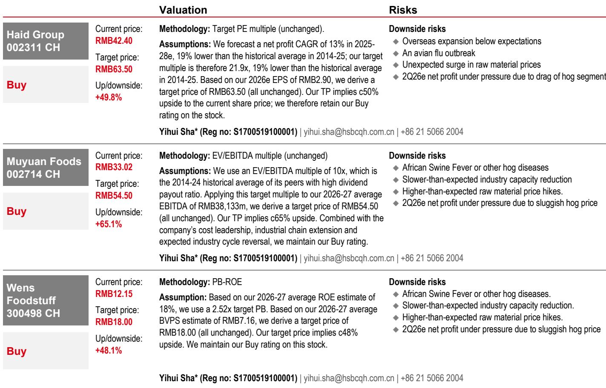
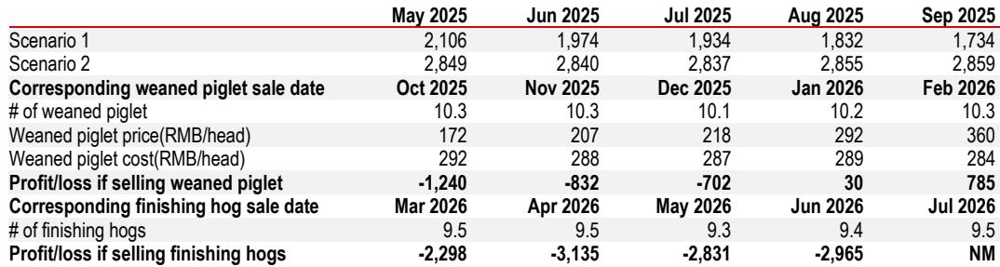

# China's Hog Industry Has Reached the Point of Maximum Pain — But the Cycle Is About to Turn

The Chinese hog market is suffering through its second-worst loss cycle since 2014, with self-breeding farmers losing over RMB300 per head and more than nine consecutive months of negative margins. At first glance, this looks like a sector in freefall. But beneath the surface, the conditions for a structural recovery are quietly assembling. The question is not whether the cycle will turn, but when — and which players will survive to capture the upside.

This is not a demand crisis. Pork has become the cheapest animal protein in China relative to chicken, beef, eggs, and fish. Cold-storage inventories are at a three-year high, signaling robust downstream off-take. The culprit is unmistakably oversupply — and the oversupply has a specific origin story that reveals where the next inflection point will come from.

Understanding that story requires looking back to May 2025, when China's Ministry of Agriculture and Rural Affairs urged corporate producers to cut sow inventories. Corporate players complied. Non-corporate producers did not. They expanded into the teeth of policy guidance, misreading the signal and setting themselves up for the losses now crushing the industry. The report we are drawing from quantifies the cost of that miscalculation with surgical precision, and the numbers are sobering.

For investors, the current trough is not a time to look away. It is a time to map the path to recovery with clarity.

## The Second-Deepest Loss Cycle in a Decade Has a Single Root Cause: Capacity Misallocation

The national hog price hit RMB9 per kilogram in April 2026 — the lowest point since 2014. It has since recovered modestly to around RMB9.5, but remains deeply depressed. Self-breeding losses exceed RMB300 per head, and losses above RMB200 per head have persisted for over three months. By amplitude and duration, this is the second-worst loss cycle on record, trailing only the 2021-2022 downturn.

The conventional explanation is simple oversupply. But the more revealing question is: where did the oversupply come from? The answer lies in the divergence between corporate and non-corporate behavior following MARA's May 2025 guidance.

Corporate producers — the large-scale, publicly listed operators — reduced sow inventories as directed. Muyuan's sow reduction alone exceeded the national total decline by end-September 2025. Non-corporate producers, by contrast, continued adding sows through at least September 2025, inflating the supply pipeline for March through July 2026. This is precisely why the report had maintained a bearish view on first-half 2026 hog prices.

The consequence is now playing out in real time. Producers who expanded against the policy tide are carrying the heaviest losses. The report calculates that adding 10,000 sows between May and August 2025 would have required an upfront outlay of RMB20-30 million, followed by additional losses of roughly RMB20 million from finishing hog sales. For smallholders operating on thin margins, those numbers are existential.

## Capacity Depletion Is Accelerating Through Three Distinct Channels, Not One

The recovery thesis does not rest on a single mechanism. It rests on three simultaneous forces that are now converging to shrink the sow herd.

First, financially strained non-corporate producers are being forced to reduce sow herds. The losses from the May 2025 expansion have already inflicted severe damage. Even if these operators remain optimistic about future prices, they are running out of working capital to sustain current capacity. The math is unforgiving: when your cost structure generates losses of RMB200-300 per head for months on end, the decision to cut capacity is made for you.

Second, corporate producers have already reduced sow inventory in line with MARA guidance. They are now stabilizing at current levels. This means the corporate sector will not be a source of further supply expansion in the near term. If anything, additional policy pressure could trigger further reductions, tightening supply further.

Third, piglet-specialist farms represent a potential accelerant. Weaned-piglet prices held up relatively well through first-half 2026, keeping losses in this segment modest. But if the 7kg piglet price falls and stays below RMB200 per head, the report expects this segment to accelerate capacity reduction as well. That threshold is not far away.

The combination of these three forces leads to a clear conclusion: sow inventory decline will accelerate through the second quarter of 2026. The national sow inventory was already down 3.3 percent year-on-year as of March 2026. With MARA's target threshold at 37.5 million head, and deep losses persisting into the second quarter, the herd could reach that target by the third quarter — implying a year-on-year decline of approximately 7 percent.

## Efficiency Gains Will Partially Offset Sow Reduction, But Not Enough to Prevent Supply Contraction

A sophisticated investor will immediately ask: does sow reduction automatically translate into lower hog supply? The answer is no, because productivity improvements can offset headcount reductions.

The report estimates that production efficiency corresponding to finishing hog volumes will improve by 2-3 percent year-on-year in first-half 2026, and by 4-5 percent in the second half — though persistent losses may cap actual gains below that range. For 2027, efficiency improvement is projected at roughly 2-3 percent year-on-year, driven by sow structure optimization at corporate farms and the elimination of low-efficiency capacity from non-corporate producers.

These are meaningful numbers, but they are not large enough to fully offset a 7 percent sow inventory decline. The arithmetic is straightforward: even with productivity gains, year-on-year hog supply is expected to contract from the fourth quarter of 2026 onward. That contraction is the necessary condition for a price recovery.

## The Inflection Point Arrives in the Fourth Quarter of 2026, But It Will Be Moderate, Not Explosive

Based on breeding sow inventory trends combined with production efficiency indicators, the report expects year-on-year supply contraction to begin in the fourth quarter of 2026. This is the inflection point that patient investors have been waiting for.

However, there is an important caveat. Cold-storage inventory is at a three-year high year-to-date. When supply begins to contract, some of that reduction will be absorbed by drawing down frozen inventories rather than pushing spot prices higher. This means the price recovery is likely to be moderate rather than sharp — at least initially.

A full-cycle recovery would require sustained depletion of both live-hog and cold-storage inventories. That process will take time. The report's base case is a moderate price recovery in the fourth quarter of 2026, followed by year-on-year price improvement through 2027 as supply contraction persists.

For investors, the implication is clear: the timing of entry matters enormously. Buying into the trough before the inflection point is a bet on cycle timing. Buying after the inflection point is confirmed is a bet on trend following. Both can work, but they require different risk tolerances and holding periods.

## What the Report Does Not Fully Answer: Three Open Questions

No analytical framework is complete, and this one leaves several meaningful questions unanswered.

First, how will policy evolve? MARA has already lowered the target sow inventory threshold to 37.5 million head. But what happens if the herd declines below that level? Will policy shift from contraction to stabilization? The report does not model a policy reversal scenario. Investors need to watch for signals from Beijing.

Second, what is the demand elasticity at current prices? Pork is already the cheapest animal protein, and cold-storage inventories are high. But if the economy weakens further, could pork consumption contract despite its relative price advantage? The report assumes resilient demand, but that assumption has not been stress-tested against a deeper macroeconomic slowdown.

Third, what happens to the non-corporate producers who survive? If capacity consolidation accelerates, the survivors will be larger, more efficient, and more disciplined. That could permanently alter the industry structure. But the report does not project the long-term market share implications of this cycle.

These are not weaknesses in the analysis. They are the natural boundaries of any forward-looking framework. And they are precisely the questions that make the full report worth reading.

## A Decision Framework for Investors: Three Lenses for Positioning

For readers who want to translate this analysis into actionable thinking, three lenses are useful.

The cycle timing lens. The inflection point is projected for the fourth quarter of 2026. Investors who believe they can time the cycle should focus on entry points before that window. The risk is that the recovery is slower or shallower than expected, and that inventory drawdowns delay the price response.

The stock selection lens. Not all producers will benefit equally from the recovery. The report maintains Buy ratings on Muyuan Foods, Wens Foodstuff, and Haid Group, each for different reasons. Muyuan and Wens are trading at what the report views as mid-cycle bottoms — levels that imply permanent impairment of earnings power. Haid Group offers an earlier earnings recovery catalyst in the third quarter of 2026. The key is to understand which companies have the balance sheet to survive the remaining months of losses and the operational efficiency to capture upside when prices turn.

The structural change lens. This cycle is accelerating a long-term trend: the shift from fragmented smallholder production to industrialized corporate farming. Producers who survive this downturn will emerge stronger, with lower cost structures and greater market share. Investors who take a multi-year view should consider not just the cycle, but the structural winners it will create.

## Join the community to read the full report and review the original charts.

The analysis summarized here draws on detailed data — including quarterly sow inventory changes, per-head loss calculations across multiple scenarios, and historical loss-cycle comparisons — that cannot be fully captured in a summary. The original charts and tables provide the granular evidence behind each conclusion.

*This article is for learning and discussion only and does not constitute investment advice.*

Personal reading notes and learning share only. Not investment advice.

