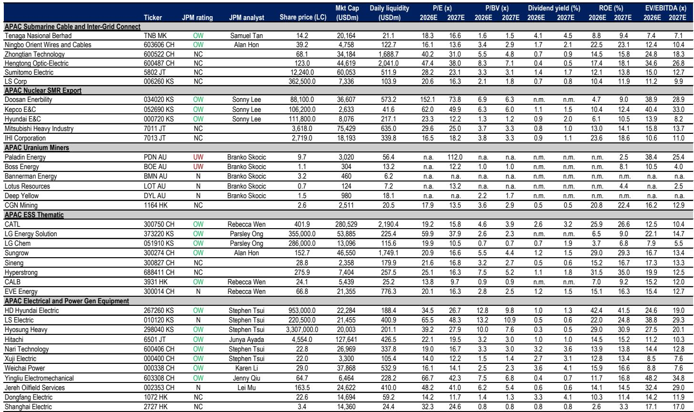
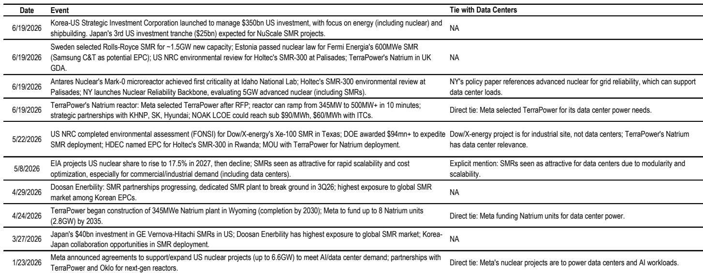
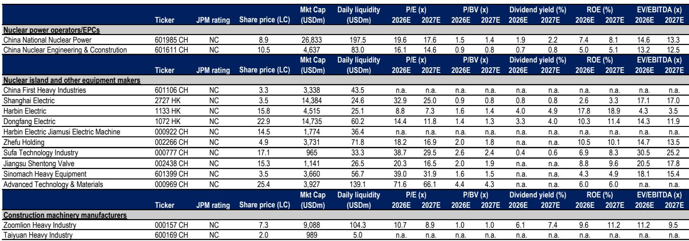

# JPM：数据中心“后院起火”，反而催生了亚太能源转型的新主线

当美国社会对AI数据中心的抵制从社区抗议升级为联邦监管改革，一场关于“谁为电力基础设施买单”的博弈正在改写全球能源转型的投资逻辑。JPM最新发布的亚太能源转型研报指出，FERC（美国联邦能源监管委员会）近期提出的电网并网改革，核心并非仅仅为了加速数据中心供电，更关键的是防止普通居民为数据中心的扩张“交叉补贴”。这一变化，正在将“表后（BTM）发电”从一种备选方案推向前所未有的战略高地。

对于亚太的投资者而言，这意味着能源转型的价值链正在经历一次深刻的“需求重构”。报告明确点出，亚太储能系统（ESS）、电气与发电设备以及核电SMR三大主题将直接受益。但这不仅仅是技术清单的更迭，而是一场关于“社会许可”如何决定技术路径的预演。

## 1. 社会反弹是表层的，成本传导的“政治风险”才是真正的监管变量

市场此前对FERC改革的关注点大多集中在“如何让数据中心的电更快接上”。但JPM这份报告揭示了一个更微妙的维度：改革文件中与“加速”并列的五大领域之一，是“成本透明度和防止成本向普通用户转移”。这意味着，监管机构正在认真对待一个尖锐的社会问题——AI发展的巨额电力投资，是否应该由不享受其红利的家庭用户来买单。

这并非杞人忧天。PJM市场的容量拍卖价格已逼近监管上限，而美国部分地区正讨论保护居民免于为数据中心开发付费的两党法案。当电力成本成为政治议题，数据中心的“社会运营许可证”就变得比技术可行性更关键。因此，任何能够减轻公共电网负担、从而降低居民电费上涨压力的技术方案，都将获得额外的政策倾斜。

> **KC评论：** 很多人看AI电力需求只看“总量”增长，但JPM提醒我们，看“成本分配”更重要。如果监管层强力介入，数据中心自建发电（BTM）就不再只是“快”的问题，而是“必须”的问题。这为相关设备商创造了一个需求逻辑的“双击”。

## 2. 表后发电（BTM）从“速度优势”升级为“社会许可优势”，这是需求逻辑的根本性跃迁

过去，数据中心选择BTM方案的主要理由是“速度”——在电网排队动辄数年的背景下，自建发电能确保项目按时上线。JPM的分析师明确表示，现在BTM获得了第二个、甚至更强大的驱动力：“社会许可”。

通过自带发电（BYOG）模式，数据中心可以大幅减少对公共电网的依赖，从而直接回应“居民补贴企业”的质疑。这种模式不仅缓解了电网拥堵，更重要的是，它把数据中心的电力成本内部化，消除了公共舆论的靶子。报告认为，随着监管政策持续推进，这可能成为BTM采纳率长期上升的“顺风”，并最终引发电力供应范式的根本性转变。

这意味着，投资逻辑需要从“谁能在电网外更快发电”切换到“谁能提供让社区和政府都放心的发电方案”。噪音、排放、土地利用，这些曾经被忽视的“软因素”，现在成了硬约束。

## 3. 亚太供应链的“赢家”不是简单的产品出口，而是提供“社会友好型”综合解决方案的能力

JPM在亚太能源转型价值链中筛选出的受益标的，并非随机罗列。它们共同指向一个核心能力：提供满足“社会友好”标准的BTM综合方案。

- **储能系统（ESS）**：报告特别强调了ESS的“社会优势”。相比柴油发电机，ESS零碳、低噪音，能有效缓解社区对数据中心噪音污染的投诉。更重要的是，ESS在微电网中扮演“时间平移”的角色，通过削峰填谷平抑电价，这本身就是对“成本转移”担忧的直接回应。
- **SOFC燃料电池**：其燃料灵活性（未来可兼容绿氢）和近零的NOx/SOx排放，使其更容易获得建设许可。潍柴动力将SOFC产能目标从2026年的30MW提升至2030年的1GW，这一增速远超此前市场预期，背后正是数据中心需求对技术路线的“暴力拉升”。
- **核电SMR**：虽然仍是中期故事，但其先进燃料（如TRISO颗粒）带来的更高安全阈值和“灵活部署”的BTM属性，使其成为长期期权。

> **KC评论：** 这份报告最值得细看的不是股票代码，而是它如何把“社会接受度”这个模糊概念，拆解成了储能、燃料电池、SMR等具体技术路径的竞争力评估。这比单纯看装机量预测更有前瞻性。完整报告中还包含了PJM拍卖价格数据、各类发电设备的交付周期对比表，这些图表是理解“速度”与“成本”博弈的关键。

## 4. 一个尚未被充分定价的变量：数据中心正在成为“技术路线加速器”，燃料电池的案例只是开始

报告中最具洞察力的部分，或许是它对燃料电池技术路线的分析。过去，质子交换膜（PEM）燃料电池因快速启停和低温特性，在汽车领域占据主导。但数据中心稳态运行的特点，让固体氧化物燃料电池（SOFC）的高效率优势得以凸显。数据中心的需求，正在“扭曲”燃料电池的技术演进方向，使其从车用转向固定式发电。

这揭示了一个更宏大的趋势：AI数据中心的电力需求，正在成为全球能源技术“从实验室走向规模化”的终极加速器。潍柴动力2026年AIDC柴油发动机目标从2600-2800台上调至3500-4000台，以及SOFC产能的激进扩张，都表明这一趋势已在发生。但报告没有完全展开的是：这种“加速”是否会带来供应链瓶颈？当所有数据中心都追求同一套BTM方案时，关键设备（如燃气轮机、大型储能逆变器）的交货周期是否会再次拉长？这可能是下一阶段需要密切关注的风险。

## 5. 对于决策者：你的观察框架需要从“电网容量”切换到“社区许可 + 设备交付周期”

基于JPM的逻辑，投资者和产业决策者应该建立一个新的评估框架：

第一，**关注监管动态的“二阶效应”**。不要只看FERC是否批准了并网，要看它如何定义“成本转移”。任何强化居民保护的条款，都是BTM方案的利好。

第二，**重新评估设备交付周期**。报告中引用的数据（H级CCGT需36-60个月，而高速内燃机仅15-24个月）表明，在“时间就是算力”的竞争中，交付速度本身就是护城河。能够提供快速部署方案的企业，将获得定价权。

第三，**警惕“技术同质化”风险**。当所有数据中心都涌向燃气轮机+储能+SOFC的“标准套餐”时，关键部件的供应安全和价格波动将成为新的不确定性。报告提及的专家反馈显示，数据中心正在“混合使用不同品牌、不同尺寸的发动机”，这暗示供应链尚未成熟，也意味着存在差异化机会。

这份JPM报告的价值，在于它把一场看似遥远的美国监管辩论，与亚太能源转型企业的订单前景紧密连接起来。它告诉我们，AI时代的能源赢家，不仅要有技术，更要有“社会智慧”。

每天，我们的AI agent会结合人工review，从JPM、GS等国际投行的最新报告中提炼出类似的关键洞察，并整理成约10-40页的中文摘要与数据图表合集。这些内容既能方便你快速喂给AI模型做深度分析，也能让你在几分钟内把握全球市场的核心动态。如果你对文中提到的PJM拍卖价格曲线、各类发电设备的完整交付周期对比表，或是潍柴动力、宁德时代等标的的详细估值模型感兴趣，欢迎来我们的星球微信群继续讨论。我们会在每日更新中，持续追踪FERC改革的后续进展及其对亚太供应链的传导效应。

---

Personal reading notes and learning share only. Not investment advice.

