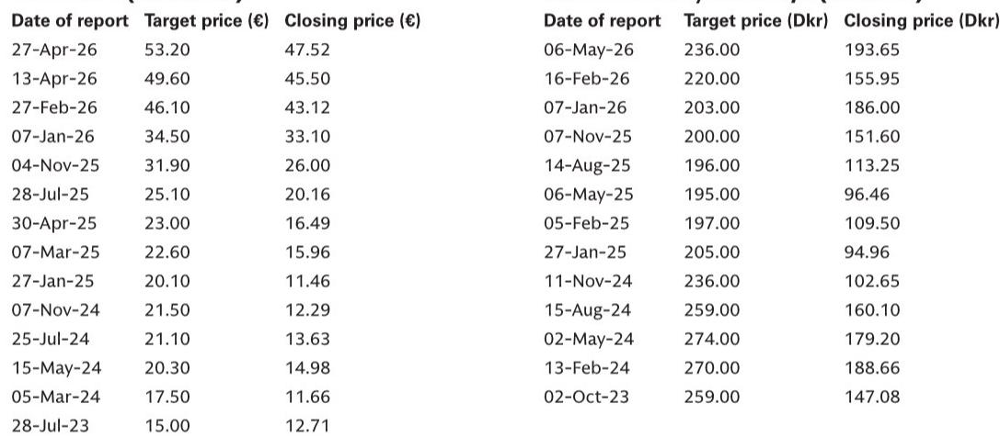
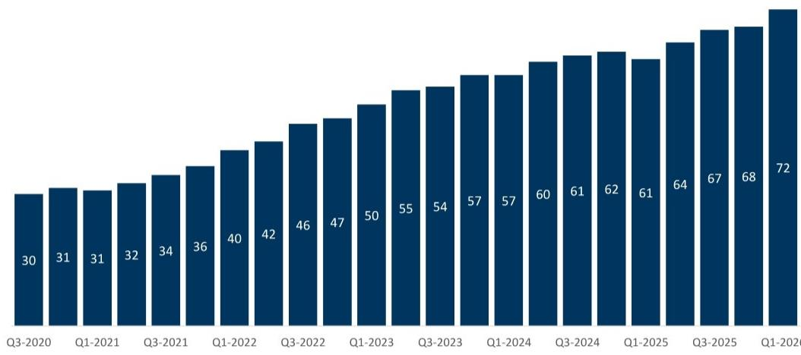
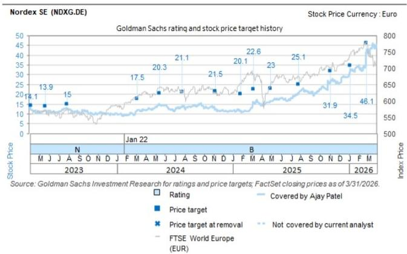

# GS：美国风电订单正在加速，但市场低估了利润上修的幅度

当市场还在争论特朗普关税政策对清洁能源的冲击时，一份来自GS的研报揭示了一个反直觉的信号：欧洲风电制造商正在美国获得大量订单，且是在政策尚未完全明确的前提下。

Vestas 在昨晚宣布，其在美国获得了总计 869 兆瓦的陆上风电订单。这并非孤例。根据GS统计，Vestas 在 2026 年第二季度已从美国获得 1.5 吉瓦的订单，过去四个季度的滚动订单量达到 5.2 吉瓦。Nordex 同样不甘示弱，在 2025 年下半年获得 1.1 吉瓦有条件订单的基础上，又新增了三个总规模达 0.5 吉瓦的确定订单。

这份报告的核心判断是：美国风电订单的持续恢复，正在为 Vestas 和 Nordex 的盈利前景提供超出当前预期的上行风险。GS对两家公司均维持“买入”评级，Vestas 目标价 236 丹麦克朗，Nordex 目标价 53.2 欧元。

但真正值得追问的是：为什么在政策不确定性笼罩下，订单反而在加速？这背后隐藏着怎样的结构性变化？

## 1. 美国风电市场正在经历一场“无声的修复”，而非衰退

市场对特朗普政府可能对进口风电设备加征 232 条款关税的担忧并非没有道理。但现实是，订单数据正在讲述一个不同的故事。

Vestas 在美国的订单积压正在以肉眼可见的速度增长。Nordex 也在积极重返美国市场，其目标是恢复到约 20% 的美国市场份额。GS的研究显示，Nordex 在过去 12 个月中已经看到了订单回升的迹象，这为其实现市场份额目标提供了支撑。

为什么开发商愿意在政策前景不明朗的情况下下订单？答案可能在于：市场已经将关税风险纳入了定价，而当前的 PPA（购电协议）价格已经足够高，足以消化潜在的关税成本。

> **KC 评论：** 市场习惯将“政策不确定性”等同于“行业利空”，但这份报告提示我们，当 PPA 价格从 30 美元/兆瓦时涨到 70 美元/兆瓦时以上时，风电项目的经济性已经发生了质变。开发商算的是经济账，不是政治账。完整报告中对 PPA 价格走势的详细拆解，是理解这一逻辑的关键。

## 2. 真正的驱动力不是政策，而是 PPA 价格翻倍带来的回报改善

GS在报告中展示了一个关键图表：美国 PPA 价格已从 2020-2021 年的约 30 美元/兆瓦时，飙升至当前的 70 美元/兆瓦时以上。

这一价格翻倍的背后，是多重因素的共振：电力需求上升、竞争减少、设备成本上升和等待时间延长（回流效应），再加上更高的资金成本。这些因素共同推高了美国可再生能源项目的回报率。

对于风电设备制造商而言，这意味着两件事：第一，客户（开发商）有更强的意愿支付更高的设备价格；第二，客户对设备交付的确定性要求更高，因为他们已经锁定了高价的 PPA 合同，任何延迟都会造成巨大损失。

这就是为什么即使存在关税风险，开发商仍然愿意下单。他们赌的是：即使加征关税，项目的经济性依然可行，而如果关税最终低于预期，那将是额外的惊喜。

## 3. GS的盈利预测中尚未充分计入美国订单贡献

这是这份报告最反直觉的部分。GS明确表示，其对 Vestas 和 Nordex 的盈利预测“并未包含规模性的美国订单”，以反映政策不确定性。这意味着，当前股价所反映的盈利预期，是建立在“美国市场贡献有限”的保守假设之上的。

而现实是，美国订单正在加速。如果这些订单最终转化为收入，GS的盈利预测将面临显著的上行风险。

对于 Vestas，GS预计其将在 2027 财年实现 90% 的中期目标，主要驱动力来自海上风电业务达到盈亏平衡。但美国陆上风电订单的额外贡献，可能使这一进程更快、幅度更大。

对于 Nordex，GS认为其受益于与 Vestas 相同的行业顺风，更高的利润率和更强的资产负债表将转化为更高的价值回报。

> **KC 评论：** 这是典型的“预期差”投资逻辑。市场已经将坏消息定价，但好消息尚未被计入。GS的报告本质上是在说：如果美国订单的恢复是可持续的，那么当前估值可能低估了 10-20% 的盈利潜力。完整报告中关于两家公司估值模型的具体假设和风险因素，值得仔细推敲。

## 4. 报告尚未完全回答的关键问题：关税风险到底有多大？

尽管GS对美国风电订单的前景持乐观态度，但报告并未完全回答一个关键问题：如果 232 条款关税最终落地，且税率超出市场预期，会对这些订单产生多大的冲击？

报告提到了“政策不确定性”，但并未给出一个详尽的压力测试。例如，如果关税税率达到 25% 或更高，Vestas 和 Nordex 的利润率会受到多大影响？它们是否有能力将成本转嫁给开发商？这些问题的答案，决定了当前乐观叙事的脆弱性。

另一个未完全展开的问题是：美国电力需求增长的可持续性。PPA 价格的上涨部分得益于 AI 数据中心的电力需求爆发，但这一需求是否存在周期性风险？

## 5. 对投资者的观察框架：三个关键信号

基于GS的分析，投资者可以从以下三个维度跟踪美国风电市场的真实走势：

第一，PPA 价格的边际变化。如果 PPA 价格继续维持在 70 美元/兆瓦时以上，甚至进一步上涨，那么风电项目的经济性将继续改善，订单的可持续性将得到验证。如果 PPA 价格出现拐点，则需要警惕。

第二，Vestas 和 Nordex 的订单公告频率和规模。GS的报告已经指出，第二季度的订单量在加速。投资者应关注这一趋势是否能在第三季度延续。

第三，关税政策的实际落地情况。这是最大的不确定性变量。任何关于 232 条款关税进展的消息，都可能对股价产生重大影响。

## 风险提示

GS在报告中列出了关键的下行风险：全球陆上/海上风电装机量下降、美国装机量低于预期、风电行业缺乏并购活动、大宗商品价格大幅下跌导致风电相对火电的竞争力下降。

对于 Vestas，GS还特别提到了海上风电业务的风险，以及其估值模型中 M&A 估值成分的有效性。对于 Nordex，风险因素包括政府政策变化和大宗商品价格下跌。

---

上述分析只是GS这份深度报告的一部分。在完整报告中，还包含了对 Vestas 和 Nordex 的详细估值模型、DCF 假设、M&A 估值方法、财务预测以及风险因素的全景式拆解。这些内容对于理解当前欧洲风电制造商的真实价值至关重要。

每天，我们的 AI agent 会结合人工 review，从国际投行最新报告中提炼 10-40 页的中文摘要与 KC 评论，并整理当天最新的数据图表合集。这些内容既方便直接喂给 AI 做进一步分析，也方便人工快速把握全球市场的动态变化。

欢迎加入我们的讨论群，与产业决策者和专业投资者一起，持续跟踪这些关键判断的验证与修正。

Personal reading notes and learning share only. Not investment advice.

