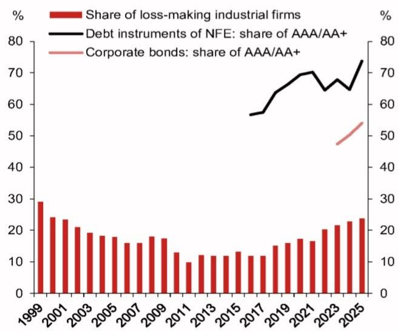

# NOM：中国信用评级体系已无法反映企业真实风险

当超过一半的债券发行人手握AAA或AA+评级，而同时近四分之一工业企业处于亏损状态，这两个数字放在一起，指向的不是技术性偏差，而是整个评级信号系统的失灵。

NOM亚洲经济团队在最新一份研报中提出了一个直指中国债券市场核心机制的问题：国内评级体系正在被日益上升的亏损企业比例所挑战。报告援引数据指出，截至2026年第一季度，59%的发行人被评为AAA或AA+，非金融企业债务融资工具中这一比例甚至高达74.6%。与此同时，国家统计局数据显示，2025年亏损工业企业占比升至23.8%，为2000年以来最高；2026年前四个月这一比例进一步攀升至32.4%。

评级膨胀与财务恶化之间的背离，已经不是技术细节，而是一个系统性的风险信号。它意味着投资者和监管机构正在被一套无法有效区分信用质量的标签所引导。

> **KC评论：** 这份报告的核心判断不是“企业很烂”或“评级很水”这种泛泛之谈。它的价值在于把两个趋势放在一起看：评级分布越来越集中在上游，而企业基本面越来越下沉。这种背离对债券定价、投资组合风险管理、甚至货币政策传导都有直接含义。完整报告中有更多关于不同行业亏损分布和评级迁移率的数据，值得细读。

## 1. 评级膨胀的规模已经超出技术性偏差，接近系统失灵

NOM报告引用的数据揭示了一个令人不安的结构性特征。在发达债券市场，即使是信用质量较高的企业群体，AAA评级也是稀缺资源。但在中国，这一评级已成为“标配”。当大部分发行人都拿到同一档评级时，评级的区分度和信息含量就趋近于零。

这种膨胀并非一日之功。报告追踪显示，非金融企业AAA/AA+评级债务融资工具的占比在过去几年持续攀升，目前已接近四分之三。而同期，企业的盈利状况却在系统性恶化。亏损企业占比从2017年的11.8%翻倍至2025年的23.8%，2026年一季度更是突破了30%的关口。

两个趋势的交叉点，就是评级体系的可信度拐点。当评级无法有效区分健康企业与困境企业，投资者就不得不依赖其他成本更高的信息渠道，或者干脆用脚投票。这对债券市场的流动性和定价效率都是负面冲击。

## 2. 亏损企业占比升至2000年以来最高，但评级并未同步反映

报告中最具冲击力的数据来自国家统计局。2025年全年亏损工业企业占比23.8%，已经超过2008年金融危机和2015年产能过剩时期的水平。而2026年前四个月32.4%的亏损比例，更指向一个仍在恶化的趋势。

这一数字背后是两股力量的叠加。一方面是持续的房地产下行周期，它不仅直接拖累相关产业链，还通过财富效应和信贷收缩间接影响更广泛的消费和投资。另一方面，即使AI相关产业有局部亮点，其体量和就业吸纳能力尚不足以对冲传统部门的失速。

但关键在于：评级机构似乎并未充分反映这一恶化趋势。如果亏损企业占比已经超过三成，而AAA/AA+评级占比仍接近六成，那么评级体系正在向市场传递系统性偏乐观的信号。这种错位对风险定价和资源配置都有深远影响。

> **KC评论：** 很多人看到“亏损企业占比32%”的第一反应是“经济很差”。但NOM报告真正想说的是：如果评级体系不调整，投资者可能无法准确知道哪些企业是真正安全的。这就好比一张地图上所有道路都标成绿色，但实际交通状况已经亮起红灯。报告中有关于不同所有制企业亏损分布的具体图表，能帮助判断风险集中在哪类主体。

## 3. 评级失灵的直接后果：投资者和监管者都在“盲飞”

NOM报告明确指出，在脆弱的宏观经济环境下，一个有缺陷的国内评级体系可能掩盖潜在的违约风险，并向投资者和政策制定者传递误导信号。

对于投资者而言，评级失真意味着两个层面的问题。第一，信用定价无法有效展开，优质企业与高风险企业之间的利差可能被人为压缩，导致风险溢价失真。第二，投资组合的风险暴露难以准确衡量，尤其是在机构投资者面临内部风控和外部监管的评级门槛约束时，评级膨胀可能让组合实际承担的风险远超账面显示。

对于政策制定者而言，评级信号失灵可能干扰货币政策的传导效率。如果银行和非银机构依据评级进行信贷投放和风险定价，那么评级体系的偏差就可能扭曲资金流向，使得本应流向优质企业的低成本资金被稀释，或者风险较高的企业以过低成本获得融资。

## 4. 监管层已经意识到问题，但改革路径尚不清晰

报告提到，包括中国人民银行在内的监管机构已经要求国内评级机构改革其评级体系，以更准确地反映本地企业的信用风险。这是一个积极的信号，表明问题已经被识别并进入政策议程。

但改革并非一蹴而就。评级体系的重塑涉及方法论调整、历史数据迁移、市场预期管理以及可能的短期阵痛。如果评级标准骤然收紧，大量发行人的评级可能被下调，引发债券价格重估、质押融资门槛变化、甚至触发部分产品的提前赎回条款。如何在提升评级准确性的同时避免市场冲击，是监管层需要权衡的难题。

报告没有展开讨论的一个关键问题是：改革的具体时间表和过渡安排是什么？不同评级机构之间的标准统一如何实现？这些问题对于投资者判断未来信用市场的演变方向至关重要。

## 5. 报告尚未完全回答的关键问题：AI相关产业能否成为信用质量的支撑点

NOM报告在提到经济困境时，用了一个值得注意的措辞：“Despite the AI boom”。这表明报告承认AI相关产业确实带来了局部增长动能，但认为其不足以抵消房地产下行带来的系统性压力。

但这里有一个尚未充分展开的问题：AI相关产业的信用质量如何？如果这部分企业整体评级较高且盈利状况良好，那么评级膨胀可能部分反映了经济结构的转型——即高评级企业占比上升，低评级企业占比下降，但低评级企业中的亏损企业比例更高。换句话说，评级分布可能正在从“均匀分布”向“两极分化”演变。

报告没有给出这一细分数据。如果投资者能够看到按行业划分的评级与亏损交叉分析，就能更准确地判断评级膨胀到底是系统性失真，还是结构转型的副产品。这也是完整报告中值得深入挖掘的方向。

## 6. 对投资者的观察框架：从评级标签转向现金流和资产质量

在评级体系改革完成之前，投资者需要建立自己的信用评估框架，而不是过度依赖外部评级。

第一，关注企业的经营性现金流与债务覆盖能力，而非仅仅看评级符号。在亏损企业占比超过30%的环境下，评级背后的方法论可能已经跟不上现实变化。

第二，关注行业间的信用分化。房地产、建筑、部分制造业的信用风险可能仍在上升，而AI、新能源、高端制造等领域可能呈现出不同的信用轨迹。评级体系可能未能充分反映这种分化。

第三，关注评级迁移的方向和速度。如果监管推动评级改革，未来一段时间内评级下调的频率和幅度可能明显增加。投资者需要提前评估自身组合对评级下调的敏感度。

第四，关注政策信号。央行和监管机构对评级体系改革的态度、具体措施和时间表，将是影响债券市场定价的重要变量。报告提到“requested domestic rating agencies revamp their rating systems”，但具体执行细节尚未公开，这本身就是值得跟踪的变量。

> **KC评论：** NOM这份报告的价值不在于给出一个简单的“买”或“卖”建议，而在于提供了一个观察中国信用市场的分析框架。它揭示了一个容易被忽视但影响深远的结构性问题。完整报告中包含更多关于评级迁移矩阵、行业亏损分布以及国际评级对比的图表，这些数据对于构建自己的信用分析模型非常有帮助。

评级体系的改革不会一蹴而就，但信号已经出现。对于关注中国债券市场和信用风险的投资者而言，理解这个信号的含义，比等待评级更新更重要。

每天，我们的AI agent与人工review团队会生成国际投行中文摘要与KC评论，daily更新约10-40页，并整理当天最新数据图表合集，方便喂给AI，也方便人工快速把握market dynamics。欢迎来我们的星球微信群继续讨论。

Personal reading notes and learning share only. Not investment advice.

