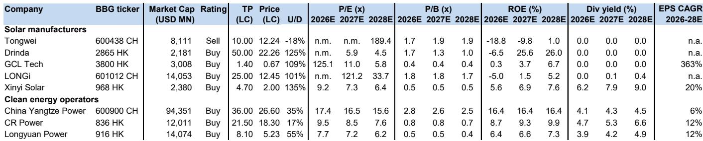
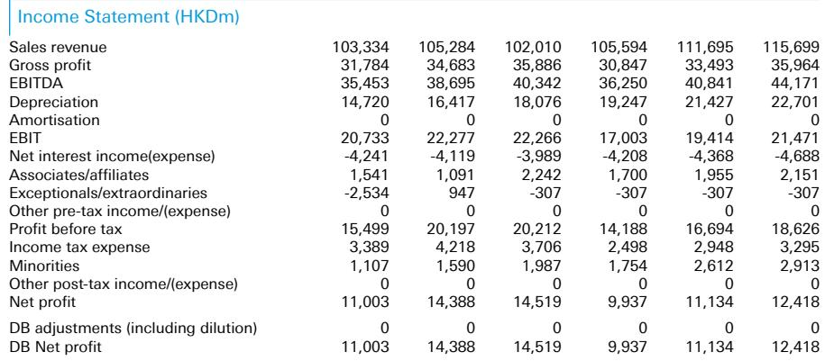

# DB：中国光伏装机跌至四年最低，但真正的机会在电力运营商

2026年5月，中国新增光伏装机8.7GW，同比暴跌91%。这个数字如果只看同比，很容易被归因为去年抢装潮的高基数效应。但DB最新研报做了一个更关键的对比：剔除2025年5月的异常高基数后，2026年前五个月的累计装机仍比2024年同期低25%，比2023年同期低3%。这意味着，中国光伏行业正在经历的不是一次短期波动，而是实质性装机增速失速——五年来的最低水平。

这份报告同时释放了两个看似矛盾但实则高度相关的信号：光伏供给端尚未见底，但需求端可能因异常高温而迎来结构性支撑。真正值得关注的，不是光伏制造商的困境何时反转，而是电力运营商在电价承压、资产分拆、派息提升三重逻辑下的价值重估。

## 1. 光伏产业链最痛苦的阶段可能还在7-8月，而非已经过去

DB报告指出，多晶硅价格已跌至每公斤33元人民币，逼近其预估的每公斤30元左右的底部区间。但短期内产出仍在增加，这意味着整个光伏价值链在7-8月将继续承压，任何有意义的复苏都要等到2026年四季度季节性需求改善，或看到切实可行的政策落地。

> **KC评论：** 市场常常把“接近底部”误解为“即将反弹”。实际上，价格逼近成本线不等于产能出清。只有当行业亏损持续足够长、足够深，迫使高成本产能真正退出，供需平衡才能重建。DB认为这个拐点不会在第三季度到来。

这份报告对通威股份的判断尤为尖锐。DB维持卖出评级，目标价从13元下调至10元，预计2026-2027年净亏损将比此前预测扩大10%，2028年每股收益下调25%。核心逻辑是多晶硅和电池片的平均售价假设进一步走低。通威股价年初至今已下跌约40%，跑输沪深300指数48%，跑输光伏同行22%。但DB明确表示，尚未看到多晶硅环节的拐点信号，且担忧通威更高杠杆的资产负债表限制了其业务转型能力。

这引出一个关键问题：光伏制造商的估值陷阱。当一家公司股价已跌去四成、市盈率看似“便宜”时，投资者容易产生抄底冲动。但DB的框架提醒我们，在产能出清完成之前，低估值可能只是价值陷阱的伪装。

## 2. 电力需求增长正在加速，AI相关用电同比增速已超45%

与光伏供给端的寒意形成对比，中国电力需求端正在升温。2026年5月，全社会用电量同比增长6.9%，较4月的6.0%进一步加速。分部门看，工业用电增速从5.3%升至6.0%，商业用电从8.9%升至9.7%，居民用电从6.0%升至7.5%。

最引人注目的是AI相关电力需求。互联网数据服务用电量同比增长45.4%，较4月的42.8%继续攀升，延续了2026年初以来的强劲增长趋势。DB在研报中专门用了一个图表展示这一数据，并将其与整体用电增速做对比——差距正在拉大，而非收窄。

这一趋势对电力运营商的含义是结构性的：AI和算力基础设施的电力需求不是短期脉冲，而是持续增长的增量。但问题在于，这种增量需求能否转化为运营商的利润改善，取决于电价走势和利用小时数。

## 3. 高温可能成为夏季电力需求的催化剂，但2022年极端情况不宜简单线性外推

中国国家气候中心预计，2026年7月全国大部分地区气温正常至偏高，部分地区降雨偏多。DB将这一预测与2022年夏季做了对比——2022年是中国自1961年以来最热的夏季，7-8月居民用电需求同比飙升27-34%，推动全社会用电增速达到7-12%。

但报告谨慎地指出，当前预测尚不表明会重演2022年的极端热浪。这意味着，投资者可以对高温带来的电力需求弹性保持关注，但不应将其作为核心投资假设。真正需要跟踪的，是7-8月实际气温数据与气象预测之间的偏差，以及这种偏差对电力运营商利用小时数和电价的传导。

> **KC评论：** 高温对电力股的影响不是线性的。如果只是正常偏热，电力需求增量可能被市场电价下行抵消。只有在极端热浪重现、电力供需出现阶段性紧张时，运营商才可能获得超预期的电价弹性。完整报告中有2000年以来的月度利用小时数对比图，这个数据集本身就能帮投资者建立判断基准。

## 4. 华润电力分拆新能源业务上市：短期业绩承压，长期派息提升是关键变量

DB在这份研报中重点分析了华润电力的新能源分拆上市。华润新能源计划发行不超过24.2亿股，发行价每股10.11元人民币，DB估算募集资金约240亿元人民币，可将华润电力的净负债率降低约20个百分点。

但短期来看，华润新能源指引2026年上半年净利润同比下降19-30%，原因包括不利天气、更高的风力和光伏弃电率、更低的实现电价、补贴收入减少以及产能扩张带来的成本上升。DB据此将华润电力2026-2028年每股收益预测下调22-23%，目标价从23港元降至21.5港元。

真正值得关注的不是短期盈利下修，而是分拆后的派息政策变化。DB预计，随着新能源业务上市，华润电力将在未来三年内逐步将分红比例从目前的40%提升至45-50%。对于一家当前市盈率不到10倍、股息率接近5%的电力运营商而言，派息率的持续提升意味着股东的现金回报将加速增长。

但这里有一个未被完全回答的问题：在电价市场化改革持续推进、新能源项目面临越来越大的电价折扣压力的背景下，华润电力能否通过规模扩张和成本优化来抵消电价下行的影响？DB将电价相关的不确定性列为首要下行风险，但并未给出量化情景分析。

## 5. 报告尚未完全回答的关键问题：电价下行与装机增长之间的张力如何化解

整份研报最值得深思的矛盾点在于：一方面，光伏装机增速大幅放缓，供给端压力持续；另一方面，电力运营商面临的市场化电价仍在同比下跌9-13%（2026年1-6月平均）。DB在报告正文中展示了这一数据，但没有展开讨论其结构性含义。

如果电价持续承压，即使装机量增长、利用小时数改善，电力运营商的利润弹性也会被压缩。这也是为什么DB对华润电力的目标价下调主要归因于更低的电价假设。但另一方面，光伏供给侧的出清如果最终实现，新项目成本有望进一步下降，这可能反过来支撑运营商的长期回报率。

这种张力如何化解，取决于三个变量：电价市场化改革的节奏、煤炭价格的走势、以及电力需求增长的持续性。DB的数据显示，2026年上半年秦皇岛现货动力煤均价同比上涨10%，这对火电占比仍较高的运营商构成了成本压力。

## 6. 投资者的观察框架：三个维度区分赢家与输家

基于DB这份研报的数据和判断，投资者可以从三个维度构建自己的观察框架：

第一，区分供给端和需求端的信号。光伏制造商的困境是供给端产能过剩的结果，而电力运营商的机遇是需求端结构性增长的结果。两者不能混为一谈。DB对光伏制造商普遍持谨慎态度，但对华润电力、长江电力等运营商维持买入评级。

第二，关注派息政策而非短期盈利。在电力运营商板块，短期盈利受天气、电价、补贴等多种因素扰动，可预测性较低。但派息政策的调整是管理层意志的明确信号。华润电力分拆后派息率提升的预期，长江电力稳定的高分红记录，都是比季度盈利更值得关注的长期变量。

第三，跟踪AI用电增速是否持续。互联网数据服务用电量45%的同比增速如果能够维持，将对电力需求结构产生深远影响。但这一数据在DB研报中只是月度观测点，尚未形成长期预测模型。投资者需要自行跟踪后续月份的数据趋势，并评估其对不同运营商的影响差异。

> **KC评论：** DB这份研报最珍贵的地方不是单一结论，而是它把光伏供给侧、电力需求侧、电价走势、公司微观变化放在同一个框架里。完整报告有超过20张图表，包括月度利用小时数、估值对比、分红历史等，这些原始数据本身比任何单一判断都更有价值。

## 结语：顺着这些未解问题继续深挖

DB这份研报留下了几个值得继续追问的问题：光伏产业链的产能出清何时真正到来？电价下行趋势是否会因AI需求增长而逆转？华润电力分拆后的派息提升能否如期兑现？高温天气对2026年夏季电力需求的弹性究竟有多大？

这些问题无法在一个研报摘要中得到完整答案。它们需要持续跟踪月度数据、对比不同机构的假设、以及更细致的公司层面分析。这正是我们每天在做的事情——由AI agent加人工review生成国际投行的中文摘要与KC评论，每日更新约10-40页，整理当天最新数据图表合集，既方便喂给AI做进一步分析，也方便人工快速把握市场动态。欢迎来知识星球和微信群里继续讨论，一起把这些问题拆解得更清楚。

Personal reading notes and learning share only. Not investment advice.

