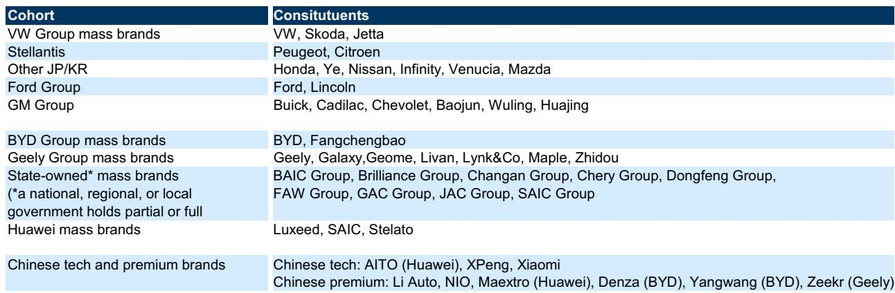
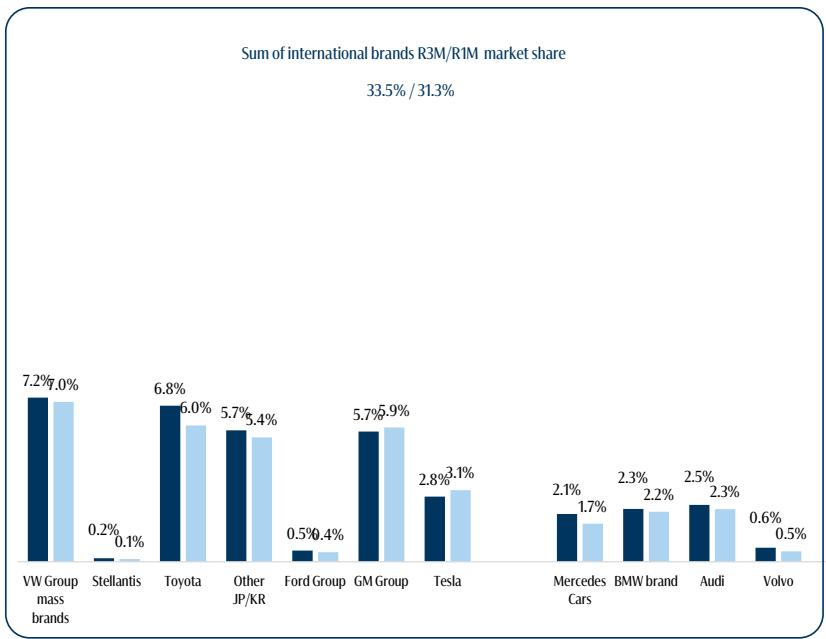
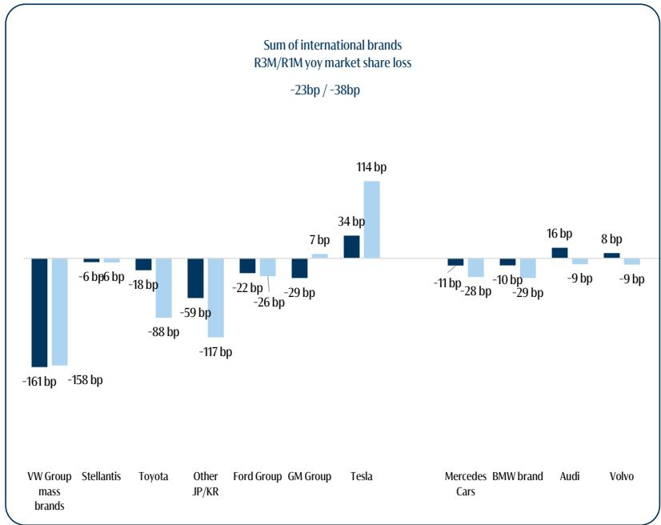

# GS：中国车市正在重写欧洲豪车利润区的游戏规则

中国汽车市场正在发生一场“静默的利润转移”。GS最新发布的2026年5月中国市场月度追踪报告揭示了一个关键趋势：欧洲豪华品牌在中国整体上仍在守住份额，但利润最丰厚的价格带正被中国科技与高端品牌系统性地渗透。这不是一场简单的份额争夺，而是一场利润池的重新分配。

大众集团在主流市场遭遇了所有外资品牌中最剧烈的份额流失，而比亚迪和吉利这些本土巨头的主流品牌也在同步承压。真正值得关注的信号是：中国品牌正在从“以价换量”转向“以产品换定价权”，而这个过程才刚刚开始。

以下是这份报告的核心洞察。

## 1. 欧洲豪华品牌的“表面稳定”掩盖了利润区的结构性侵蚀

GS数据显示，2026年5月，梅赛德斯奔驰、宝马、奥迪和沃尔沃四个欧洲豪华品牌在中国市场的份额合计变化为-75个基点（一个月同比）和+2个基点（三个月同比）。从三个月维度看，几乎持平。但细节揭示出完全不同的图景。

奔驰和宝马的份额正在加速流失。奔驰一个月同比下滑28个基点，宝马下滑29个基点。奥迪和沃尔沃则相对抗跌，分别微增9个和16个基点。奥迪受益于其新推出的AUDI品牌（与上汽合作）带来的增量销售，沃尔沃则依靠本土开发的XC70插电混动车型的强劲表现。

但更值得关注的是，这些品牌利润最丰厚的价格带正在被中国科技与高端品牌系统性地渗透。GS定义的“中国科技与高端品牌”组合——包括AITO、小鹏、小米、理想、蔚来、仰望、腾势、极氪等——在5月合计增加了329个基点（一个月同比）和279个基点（三个月同比）的市场份额。极氪和小米是领涨者，分别贡献了93个和72个基点的月同比增幅。

> **KC评论：** 这不是“欧洲豪华品牌不行了”的简单叙事。奔驰、宝马、奥迪在中国的利润池高度集中在30万至50万元人民币的价格带，而中国品牌正在这个区间密集投放产品。极氪8X、蔚来ES9、小鹏GX、问界M6这些车型的定价几乎全部瞄准了这个区间。份额的绝对变化不大，但利润的边际变化可能远超份额数字所暗示的幅度。完整报告中的品牌定义和价格带拆分图表值得仔细研读，它揭示了“同价位但不同利润结构”的竞争本质。

## 2. 大众集团是外资主流品牌中暴露最深的，而特斯拉是唯一的例外

GS数据清晰地显示，大众集团的主流品牌（大众、斯柯达、捷达）在5月共失去了158个基点（一个月同比）和161个基点（三个月同比）的市场份额，是所有外资主流品牌中下滑最剧烈的。斯柯达退出中国市场的影响仅占其中微不足道的7个基点。

与此同时，零跑汽车却逆势大幅增长193个基点（一个月同比）和152个基点（三个月同比），并正在同步向欧洲市场扩张。这是一个值得注意的对比：一个在中国市场快速崛起的品牌，正在将本土的规模优势反向输出到欧洲。

特斯拉是报告中唯一一个没有丢失份额的国际品牌。这或许反映了其在电动车领域的品牌溢价和产品力依然强劲，但也可能与报告统计周期内的具体车型交付节奏有关。

> **KC评论：** 大众在中国的困境不是突然发生的，但这份数据把它量化到了“最严重”的程度。更关键的是，零跑的崛起不是孤例——它代表了一种“中国品牌规模化后反向输出”的新模式。报告没有展开的是，这种模式对欧洲本土OEM的长期定价权和利润结构意味着什么。完整报告中对零跑的覆盖分析和其欧洲扩张策略的细节，可能是理解这一趋势的关键。

## 3. 本土巨头的“内卷”同样残酷：比亚迪和吉利的主流品牌也在失守

GS数据揭示了一个容易被忽视的事实：即便是中国本土的龙头企业，其主流品牌也在丢失份额。比亚迪集团（含比亚迪和方程豹品牌）在5月失去了168个基点（一个月同比）和227个基点（三个月同比）的市场份额。吉利集团（含吉利、银河、几何、领克等）也分别下滑了63个和116个基点。

原因并不复杂：主流市场是竞争最激烈的战场。今年中国市场的补贴政策对主流车型的支持力度有所减弱，而高端车型的投放节奏却在加快。这意味着，即便是比亚迪这样的销量冠军，也无法在主流市场独善其身。

> **KC评论：** 这组数据打破了“中国品牌全面碾压”的简单叙事。比亚迪和吉利的主流品牌失守，恰恰说明中国车市的竞争已经从“谁便宜谁赢”进入了“谁的产品定义更精准谁赢”的阶段。主流市场的利润空间正在被压缩，而高端市场的利润空间正在被争夺。报告中对“补贴政策变化对主流市场的影响”这一分析逻辑，是理解当前竞争格局的底层框架。

## 4. 报告尚未完全回答的关键问题：欧洲豪华品牌的利润缓冲期还有多久？

GS的报告清晰地描绘了当前的竞争态势，但有一个关键问题没有被完全回答：欧洲豪华品牌在中国还能维持多久的利润缓冲？

目前，奔驰、宝马、奥迪在中国仍然有可观的利润贡献，这得益于其品牌溢价和渠道优势。但中国科技与高端品牌的产品力正在快速提升，且定价策略越来越激进。如果这些品牌在30万至50万元价格带的份额继续以每月200-300个基点的速度增长，欧洲豪华品牌的利润拐点可能在12-18个月内到来。

另一个未解问题是：欧洲豪华品牌的新一代产品（如宝马的Neue Klasse）能否在中国市场扭转颓势？GS报告提到，宝马的客户正在推迟购买，等待年底Neue Klasse的发布。这意味着，市场对宝马的下一代产品寄予厚望，但也意味着如果Neue Klasse不能达到预期，宝马将面临更严峻的份额和利润双重压力。

## 5. 给产业决策者的观察框架：三个关键变量

基于这份报告的分析逻辑，我们认为以下三个变量将决定未来12个月中国汽车市场的竞争走向：

第一，中国科技与高端品牌的产品投放节奏。报告显示，极氪、小米等品牌正在快速推出新车型，且定价精准。如果这一节奏持续，欧洲豪华品牌在30万至50万元价格带的份额压力只会加剧。

第二，补贴政策的变化方向。报告指出，今年补贴对主流车型的支持力度减弱，这在一定程度上解释了比亚迪和吉利主流品牌失守的原因。如果补贴政策在下半年调整，主流市场的竞争格局可能再次变化。

第三，欧洲豪华品牌的新产品周期。宝马的Neue Klasse、奔驰的下一代电动平台，以及奥迪与上汽合作的AUDI品牌，都是决定其能否在中国市场稳住利润的关键。这些产品的市场反馈将在未来6-12个月内明朗。

这份GS报告提供了极其精细的月度份额变化数据，覆盖了约90个活跃品牌。但数字背后真正的竞争逻辑——利润池的转移、产品定义权的争夺、以及补贴政策的二阶影响——需要更深入的讨论。

我们每天会由AI agent与人工review生成国际投行中文摘要与KC评论，daily更新约10-40页，并整理当天最新数据图表合集，方便喂给AI，也方便人工快速把握market dynamics。欢迎来星球微信群里继续讨论。

Personal reading notes and learning share only. Not investment advice.

