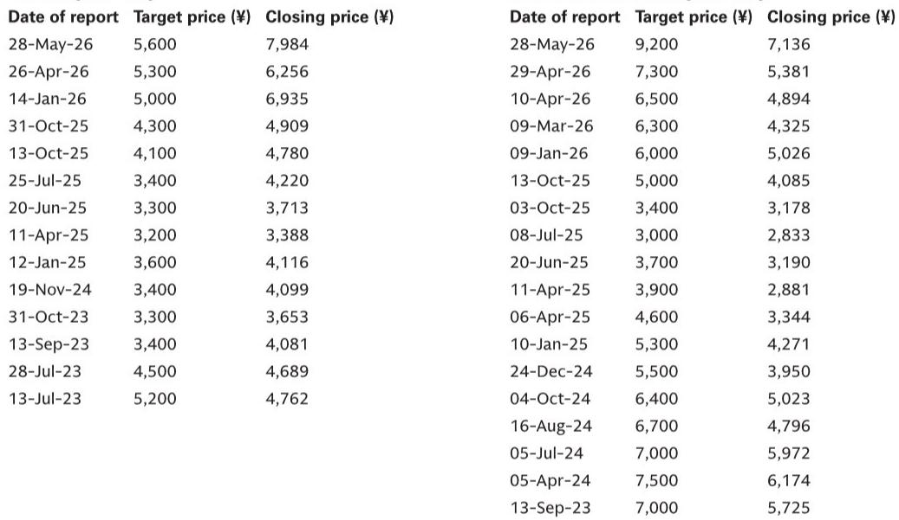
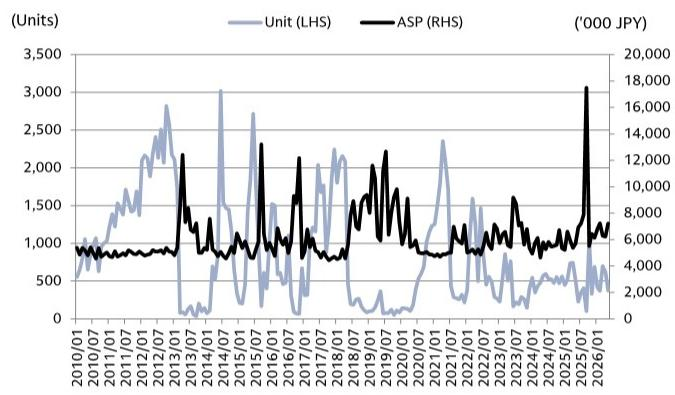
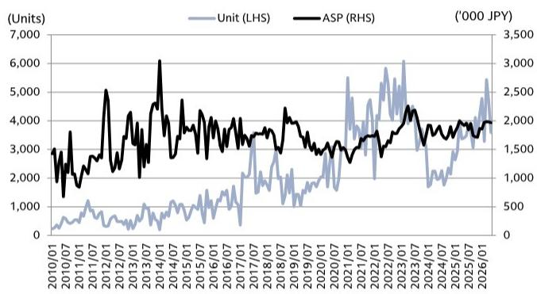

# Japan's Robot Exports Are Signaling a Demand Inflection That Markets Are Not Pricing In

The global robotics industry has entered a critical juncture, and the latest trade data from Japan—the world's dominant producer of industrial robots—reveals a pattern that is far more nuanced than the headline growth numbers suggest. In May 2026, total Japanese robot export volume rose 9% year-on-year, yet the month-over-month decline of 24% tells a very different story about the trajectory of automation investment across key end markets. The divergence between volume and value, the sharp regional disparities, and the contrasting performance between robots and vertical machining centers all point to a market that is rotating rather than accelerating.

The conventional narrative that automation demand is on a steady, AI-driven upward climb is too simplistic. What the data actually shows is a market undergoing a structural shift: China's appetite for general-purpose robots is maturing, North American demand is losing momentum against tough comparables, and the much-hyped recovery in precision machining for smartphones and electronics has yet to materialize. For investors, the question is not whether automation is growing, but where the growth is real, where it is fading, and which companies are positioned to benefit from the next phase of the cycle.

This analysis draws on Japan's Ministry of Finance customs data for May 2026, which serves as a reliable proxy for global robot and Robodrill volume trends given that Japanese manufacturers account for the majority of worldwide production. The data is granular enough to track export flows from specific ports to specific regions, allowing us to estimate the performance of individual companies—particularly Fanuc and Yaskawa Electric—with reasonable confidence. What emerges is a picture of a market that is bifurcated, with pockets of genuine strength masking broader weakness.

---

## The Aggregate Robot Data Conceals a Sharp Divergence Between Volume and Value That Signals Pricing Pressure

At first glance, the headline figures for Japan's total robot exports in May 2026 appear encouraging. Global export volume reached 10,828 units, up 9% year-on-year. China, the single largest destination, absorbed 5,390 units, a 6% increase. North America grew 3%, and Europe posted a 7% gain. Yet the month-over-month numbers tell a starkly different story: global volume fell 24% from April, with every region experiencing double-digit declines—China down 13%, North America down 17%, and Europe down 25%.

The more troubling signal, however, lies in the value data. Total export value declined 8% year-on-year and 22% month-over-month. The average selling price (ASP) for global robot exports fell 16% year-on-year to ¥1.99 million. In North America, ASPs dropped 20%; in Europe, they plunged 39%. China was the only region where ASPs rose, and only by a modest 3%.

This divergence between volume growth and value compression is the most important structural signal in the data. It suggests that the mix of robots being exported is shifting toward lower-cost models, or that competitive pricing pressure is intensifying across most regions. The fact that Europe—historically a premium market for Japanese robotics—saw a 39% ASP decline while volume rose only 7% indicates that manufacturers are cutting prices to maintain market share in a region that may be facing its own industrial slowdown.

The so-what for investors is clear: revenue growth in the robot sector is likely to lag volume growth for the foreseeable future. Companies that compete primarily on price or that have heavy exposure to commoditized robot segments will face margin compression. The winners will be those that can command pricing power through differentiation—either in specialized applications, software integration, or aftermarket services.

---

## Fanuc's Robot Exports Show Resilience in North America but a Concerning Loss of Momentum in China, the Critical Growth Market

Fanuc, the world's largest robot manufacturer by revenue, provides the clearest window into the state of global automation demand. The company's estimated export volume from its Yamanashi and Tsukuba plants reached 7,175 units globally in May, up 18% year-on-year but down 24% month-over-month. The year-on-year growth is respectable, but the sequential decline is the steepest since the post-pandemic inventory correction of 2023.

The regional breakdown is where the strategic picture becomes more interesting. Fanuc's exports to North America rebounded to 1,389 units, up 13% year-on-year after a negative April. But the momentum appears fragile. The year-on-year growth rate, while positive, is decelerating, and the high prior-year base suggests that the easy comps are behind us. North American manufacturing investment, particularly in automotive, has been driven by reshoring incentives and EV battery plant construction, but these are lumpy, project-based expenditures that do not guarantee sustained robot demand.

China, however, is the real concern. Fanuc's exports to China totaled 3,591 units in May, up only 5% year-on-year and down 23% month-over-month. The month-over-month momentum has been negative for two consecutive months: -14% in April and -23% in May. This is not the trajectory of a market that is accelerating. The report notes that companies with relative strength in small 6-axis or SCARA robots—typically used in electronics assembly—are benefiting more from AI-related demand in China. Fanuc's product mix appears less aligned with this trend, which raises questions about whether the company is losing share in the fastest-growing segment of the Chinese market.

The implication is that Fanuc's China exposure, which accounts for roughly half of its robot export volume, is becoming a source of risk rather than growth. If Chinese demand for general-purpose robots is plateauing while AI-specific applications favor lighter, more specialized robots, Fanuc may need to adjust its product strategy or face persistent volume headwinds in its largest market.

---

## Yaskawa Electric's Collapse in Export Volume Reveals a Sharp Slowdown in OEM-Driven Projects Across Asia

While Fanuc's data is concerning, Yaskawa Electric's May export figures are alarming. From its Moji production base in Kyushu, the company exported only 347 units globally, a 54% year-on-year decline and a 73% month-over-month collapse. This is not a seasonal fluctuation; it is a demand shock.

The regional breakdown is revealing. Exports to South Korea, Yaskawa's largest Asian market outside China, fell 80% month-over-month to just 74 units. Exports to China dropped 51% month-over-month to 60 units. Even India, which had shown a sharp spike in April, reversed dramatically with an 86% month-over-month decline.

The report attributes this to OEM-related projects beginning to wind down. This is a critical insight. Yaskawa's robot business has historically been tied to large-scale OEM programs—automotive assembly lines, electronics manufacturing systems, and general industrial automation projects for major manufacturers. When these projects are in their execution phase, they generate lumpy, high-volume orders. When they end, the drop-off is equally abrupt.

The so-what is that Yaskawa's business model carries inherent volatility that is not fully captured by annual revenue forecasts. Investors who model steady-state growth for Yaskawa are likely to be surprised by these periodic demand troughs. The company's reliance on project-based OEM business, rather than recurring aftermarket or software revenue, makes it more exposed to the capex cycle of its largest customers.

Furthermore, the decline in India is particularly noteworthy. India has been touted as the next great automation frontier, with many analysts projecting a multi-year growth runway as manufacturing shifts from China. Yet the May data suggests that Indian demand is not yet deep or broad enough to absorb meaningful robot volumes on a consistent basis. The spike in April may have been a single large order rather than the start of a sustainable trend.

---

## Robodrill Exports Confirm That Smartphone-Related Demand Has Not Materialized in CY26, Extending the Downturn for Precision Machining

The Robodrill—Fanuc's No. 30 vertical machining center—is a bellwether for precision manufacturing demand, particularly in electronics and smartphone components. The May data is unequivocal: global Robodrill export volume fell 26% year-on-year and 27% month-over-month. Exports to China, the largest market, totaled 559 units, down 4% year-on-year but down 33% month-over-month. Exports to Asia excluding China and Japan (AeCJ) fell 39% year-on-year.

The report explicitly states that "smartphone-related demand has remained limited in CY26." This is a significant admission. Many market participants had expected the smartphone replacement cycle, driven by AI-capable devices and 5G adoption in emerging markets, to revive demand for precision machining. That recovery has not happened.

The value data for Robodrills offers a partial offset: global ASPs rose 12% year-on-year to ¥7.99 million, driven by a 21% increase in China. This suggests that the units being shipped are higher-specification machines, possibly for more complex applications rather than high-volume commodity production. But volume is the dominant driver of revenue in this business, and the volume trend is decisively negative.

For investors in Fanuc, the Robodrill weakness is a double blow. The robot business, while growing in volume, faces pricing pressure. The Robodrill business, which traditionally enjoys higher margins, is contracting in volume. The combined effect is a revenue and margin headwind that the company's current valuation may not fully reflect.

The strategic question is whether the Robodrill downturn is cyclical or structural. If smartphone production has permanently shifted to lower-cost, lower-precision manufacturing bases in Southeast Asia or India, the demand for Japanese-made vertical machining centers may never return to prior peaks. If, on the other hand, the current weakness is merely a delay in the replacement cycle, then the recovery could be sharp when it comes. The data does not yet provide a clear answer, but the longer the weakness persists, the more the structural argument gains weight.

---

## The Report Leaves Unanswered a Critical Question: Is the AI-Driven Automation Boom Real, and Which Robot Segments Will Benefit?

For all its granularity, the May trade data raises a question that it cannot fully answer: where is the AI-driven automation boom that has been widely predicted? The narrative has been that AI will accelerate automation across manufacturing, logistics, and services, driving a super-cycle of robot demand. Yet the data shows a market that is growing modestly at best, with significant regional and product-level weaknesses.

The report hints at an answer: companies with relative strength in small 6-axis or SCARA robots are benefiting more from AI-related demand in China. This suggests that the AI boom, to the extent it is real, is not a rising tide that lifts all robot boats. It is concentrated in specific applications—likely electronics assembly, semiconductor handling, and data center-related manufacturing—that require lightweight, high-speed, precise robots. General-purpose industrial robots used in automotive or heavy machinery may see limited benefit.

This has profound implications for investment strategy. If the AI automation cycle favors specialized robots over general-purpose ones, then companies like Yaskawa, which have historically focused on larger, heavier robots for automotive and heavy industry, may be structurally disadvantaged. Conversely, companies with strong positions in SCARA and small 6-axis robots—or those that can pivot their product mix quickly—may capture disproportionate share of the growth.

The data does not allow us to identify which specific companies are winning in these segments, but it does tell us that the aggregate numbers are masking a significant divergence. Investors who treat all robot companies as equivalent beneficiaries of the AI theme are likely to be disappointed.

---

## A Decision Framework for Investors: How to Interpret the Diverging Signals in Japan's Automation Trade Data

The May 2026 trade data provides a rich but complex set of signals. To make it actionable, investors should apply a structured framework that separates noise from trend, and identifies which data points are most predictive of future company performance.

First, prioritize month-over-month trends over year-on-year comparisons. The year-on-year numbers are flattered by weak prior-year comparables in many regions. The month-over-month declines in both volume and value are more indicative of current momentum. A market that is growing 9% year-on-year but declining 24% month-over-month is not accelerating; it is oscillating.

Second, disaggregate by region and by product. The robot and Robodrill markets are not moving together, and even within robots, the performance varies significantly by destination. China's volume growth is slowing, North America's is fragile, and Europe's is being bought with price cuts. A company's regional mix is a stronger predictor of its near-term performance than the global average.

Third, watch the ASP trend. When ASPs are falling faster than volumes are rising, it indicates pricing pressure and a deteriorating competitive environment. This is particularly true in Europe, where the 39% ASP decline in robots is a red flag. Companies that can maintain or grow ASPs—through software, service, or product differentiation—are likely to outperform.

Fourth, distinguish between project-based and recurring demand. Yaskawa's collapse in May is a textbook example of project risk. Companies with high exposure to large OEM programs will experience lumpy revenue that makes quarterly comparisons misleading. Investors should normalize for project cycles and focus on underlying market share and competitive position.

Fifth, do not assume that AI-driven demand is broad-based. The data suggests that AI benefits are concentrated in specific robot types and applications. Investors should verify that a company's product portfolio aligns with the segments that are actually growing, rather than assuming that the AI theme will lift all participants.

---

## Join the community to read the full report and review the original charts

The May 2026 trade data from Japan's Ministry of Finance offers a rare window into the real-time state of global automation demand, but it also raises questions that only deeper analysis can answer. Which robot segments are truly benefiting from AI? How sustainable is the pricing pressure in Europe? Will smartphone-related demand for Robodrills recover in the second half of the year? The full report from the global investment bank that produced this analysis includes detailed charts on shipment value by destination, export volume trends for Fanuc and Yaskawa, and historical ASP trajectories that provide essential context for these questions. To access the complete data and analysis, join the community where the original report and exhibits are available for review.

*This article is for learning and discussion only and does not constitute investment advice.*

Personal reading notes and learning share only. Not investment advice.

