MS & CO. LED
Sean Diffley, CFA
Equity Analyst
Sean.DIFFLEY@morganstanley.com +1 212 761-5868
Brian Nowak, CFA
Equity Analyst
Brian.Nowak@morganstanley.com +1 212 761-3365
Erik W Woodring
Equity Analyst
Erik.Woodring@morganstanley.com +1 212 296-8083
Daniel Duran
Equity Analyst
Daniel.Duran@morganstanley.com +1 212 761-4822
Patrick A Ho
Equity Analyst
Patrick.Ho@morganstanley.com +1 212 761-2764
Erica Crouser
Data Analyst
Erica.Crouser@morganstanley.com +1 212 761-4807

June 25, 2026 09:18 AM GMT

AI & The Entertainment Industry | North America

# 16th Annual Streaming Survey, More Is More

Our 16th annual survey of \~3K American consumers suggests a competitive, but growing streaming landscape with AMZN Prime, NFLX & GOOGL's YouTube showing the strongest engagement & stickiness. The ave HH has >5 services and watches \~3 hours of content per day, while Sports are increasingly streamed.

AlphaWise α

## Key Takeaways

Nearly $90\%$ (21 of 24) of entertainment services surveyed saw y/y increases in engagement this year, while the big continue to get bigger (AMZN, NFLX & GOOGL/YT)

NFLX continues to have the strongest net retention score and is perceived to have the best original content, despite investor concerns over engagement

DIS's ESPN remains the dominant sports platform, while Disney+ and Hulu saw solid increases in engagement

\- Paramount+ and HBO Max scored best on having people's favorite TV shows, which bodes well for the pro forma PSKY+WBD

■ META is gaining traction in video with Facebook & Instagram Reels showing the largest y/y increases in engagement across platforms

## Top 10 takeaways from our 16th annual Alphawise streaming survey:

1. More services, more hours... the average US HH has >5 streaming services including free (5.4 vs 4.9 last year) with 3+ paid subscriptions (up to 3.2 from 3.1 last year, see Exhibit 25) & watches \~3 hours per day of TV, movies and online videos (with older cohorts skewing higher, see Exhibit 26 - Exhibit 27).

2. Distribution at scale is the holy grail... Amazon Prime Video (+264bps y/y to 66%), Netflix (+352bps y/y to 55%) and YouTube (+476bps to 47%) remain the 3 dominant streaming platforms w/ penetration up y/y (see Exhibit 1).

3. DIS & PSKY+HBO solid engagement... Disney+/Hulu also saw y/y increases (+100-200bps y/y) to 36/38%, while Paramount+ and HBO Max were also up >200bps y/y to 28/27%, which bodes well for the pro forma PSKY+WBD (see Exhibit 1).

4. Everything is TV... IG/FB Reels & TikTok see largest y/y increases... Social platforms saw the largest y/y gains on self-reported usage for entertainment with META's Instagram/Facebook Reels and TikTok up >1,000bps y/y, as these platforms push harder into short-form video with more long-form coming, which is increasingly

MS does and seeks to do business with companies covered in MS. As a result, investors should be aware that the firm may have a conflict of interest that could affect the objectivity of MS. Investors should consider MS as only a single factor in making their investment decision.

For analyst certification and other important disclosures, refer to the Disclosure Section, located at the end of this report.

competing with TV time (see Exhibit 1). We are also monitoring micro dramas as an emerging category taking more time spent for younger consumers.

5. NFLX, followed by AMZN & HBO for "best" original programming... Netflix is perceived to have the best original programing (+360bps y/y to 31%) after declining the last few years (see Exhibit 9), while Amazon Prime (+72bps to 17%) and HBO Max (+260bps to 7%) also saw steady gains (see Exhibit 8); Netflix scores best on adding content that people like and having a broad selection, while Paramount+ and HBO Max scored best on having people's favorite TV shows (see Exhibit 10). Users approach Netflix with higher intentionality, typically launching the platform with a specific title in mind (see Exhibit 12) and with higher attention than other services (see Exhibit 14), leading to higher "quality" engagement (Exhibit 15). Meanwhile, Disney+, Peacock and YouTube are often the destination for browsing and/or background entertainment.

6. Ad-tier adoption increasing... The Netflix ad-tier continues to gain traction rising to 26% (from 22% last year) of total respondents, while those without ads held steady at \~30% suggesting that ad-supported offerings are more incremental than cannibalistic (see Exhibit 28).

7. YT TV most popular vMVPD... Google's YouTube TV is the most preferred vMVPD with strong y/y gains (\~30%), followed by Hulu+ Live TV (\~20%), while Charter's video push does appear to be bearing fruit (see Exhibit 22 - Exhibit 23).

8. Sports biggest live draw, increasingly streamed... >60% of people regularly watch Sports live on TV (although this is down y/y to 62% vs 65% last year) and those viewing naturally indexes higher among pay-TV users (>70%), although \~30% of those not using pay-TV report regularly watching live sports content (see Exhibit 40 - Exhibit 41).

9. DIS/ESPN remains top stop for sports... Disney's ESPN remains the dominant channel/platform for watching sports (31% vs 30% last year) with a modest bump after launching ESPN Unlimited (see Exhibit 42), meanwhile Amazon is making strides coming in at #2 (22% vs 17% last year) likely helped by the NFL/TNF and Netflix moved up a few notches (12% vs 10% last year).

10. Starz and AMC+ remained at the bottom of the self-reported usage scale and also had the weakest net retention scores, while Apple TV+ engagement was down y/y (see Exhibit 1), but did score well on quality of engagement (high primary focus & destination marks).

We remain Overweight DIS, NFLX & PSKY, Equal-weight WBD & STRZ, and Underweight AMCX.

## Spotlight on Netflix

Netflix sentiment has deteriorated (down -23% YTD, market cap down >\$130bn since WB deal announced on Dec 5) driven by: 1) concerns around engagement growth slowing and a lack of recent break-through new content; 2) less margin expansion than historical (\~200bps vs \~300bps); 3) AI positioning uncertainty (on the notion that UGC platforms are better positioned); 4) concerns of elevated churn / unfavorable seasonality; and 5) an M&A discount post WB S&S interest.

Despite investor concerns around engagement and pricing power, Netflix showed the strongest net retention score of all video streaming services (+18 = 36% to cancel last – 18% to cancel first), followed by YouTube Premium and Amazon Prime Video.

While Netflix recently increased prices, the value perception remains strong with most thinking that the current standard ad-free plan pricing at \~\$20 per month is a 'great buy for the money' while they have room to >\$30 per month before it is perceived to be 'getting expensive' and would give some thought to subscribing.

## The HBO Max/Paramount+ Super Service

Key to our OW rating on PSKY is its ability to merge Paramount+ and HBO Max into a unified profitable "super service". Survey results below are encouraging, with only 10% of HBO/Para+ subs very unlikely or somewhat unlike to subscribe to the new super service. Even more, \~40-50% of non-HBO/Para+ subs would reportedly sign on to the super service (Exhibit 17 - Exhibit 18). Per the survey, there's a \~28% overlap in HBO/Para+ subscribers vs MSe \~25-30%.

## Streaming Service Adoption

Amazon Prime Video, Netflix, and YouTube (free) continue to lead the pack among video streaming platforms, used by 66%, 55%, and 47% of respondents, respectively. Platform adoption is up YoY overall, with the average respondent subscribing to 5.4 free or paid services (vs. 5.0 last year).

Exhibit 1: Paid streaming service user penetration sees gains YoY  
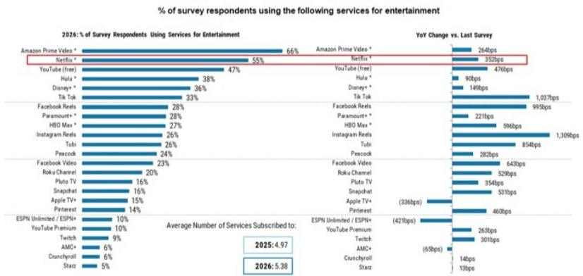  
Note: \* Netflix, HBO Max, Disney+, Hulu, Paramount+, and Amazon Prime Video reflect each respective service with or without ads.  
Source: AlphaWise, MS

## Share of Time

Exhibit 2: Among total TV/video watchers, AMZN, NFLX, and YT lead on SVOD share of time  
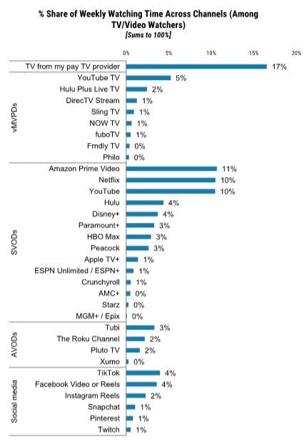  
Source: AlphaWise, MS

Exhibit 3: Pay TV subs spend 43% of their watching time watching pay TV, suggesting further opportunity for streaming.  
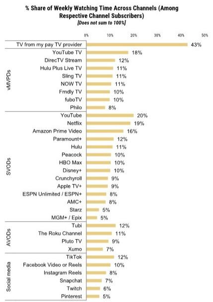  
Source: AlphaWise, MS

Exhibit 4: Netflix and YouTube get the largest on-platform watching hours/share than other streaming services

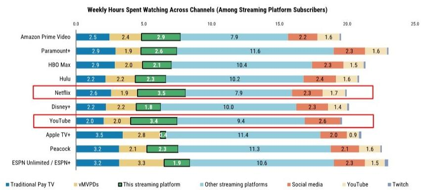  
Source: AlphaWise, MS

## Quality of Engagement on Streaming Platforms

As video streaming reaches near-ubiquity, platforms are shifting their focus to maximizing retention, quality, engagement, and monetization of their subscriber bases.

Retention: We asked respondents which of their streaming services they would cancel first, if they had to choose, and which would they cancel last. Consistent with other findings from our survey, Netflix, Amazon Prime Video, and YouTube appear to outcompete the rest of the competition – for all three of these platforms, current users were more likely to indicate them as the service they would cancel last than

as the one they would cancel first, implying that they are not easily replaced. The stickiness of these platforms could be attributed to the quality of their content, breadth of variety, or in the case of Prime Video, being part of a service bundle like Amazon Prime. Perhaps not surprisingly, ad-tier subscriptions are generally more likely than ad-free ones to be the first to cancel.

Exhibit 5: Prime Video, Netflix, and YT Premium are more likely to be canceled last than canceled first

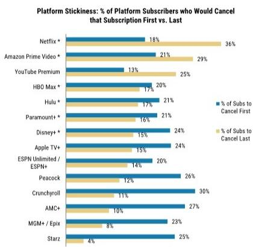  
Note: \* Netflix, HBO Max, Disney+, Hulu, Paramount+, and Amazon Prime Video reflect each respective service with or without ads.  
Source: AlphaWise, MS  
Exhibit 6: Meanwhile, platform subscribers are quicker to drop Starz, Crunchyroll, and MGM+

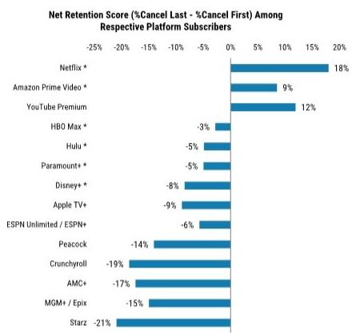  
Note: \* Netflix, HBO Max, Disney+, Hulu, Paramount+, and Amazon Prime Video reflect each respective service with or without ads.  
Source: AlphaWise, MS

Exhibit 7: Generally, ad-free tiers are stickier than their with-ads counterparts. In our view, likely due to the price sensitivity of subscribers

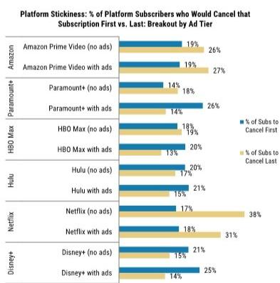  
Source: AlphaWise, MS

Quality of Content: In 2020, Netflix was the undisputed leader on the perceived quality of its original programming, but the "streaming wars" in ensuing years saw a rapid influx of competition from other platforms. Our 2026 survey indicates a second consecutive year of growth in the percentage of total respondents who view Netflix as having the "best original programming" among its peers. Compared to other major streaming platforms, Netflix scores highest as a platform that "adds content I like", "has a broad selection of content", and "has my favorite movies".

Why do you subscribe to \_\_\_\_? (Among Platform Subscribers)  
Exhibit 8: Netflix continues to lead on original programming, increasing further YoY  
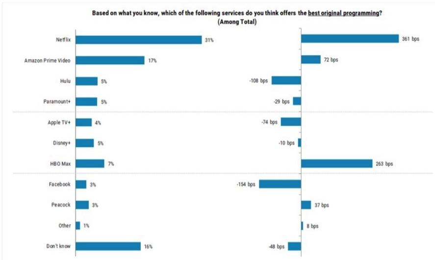  
Source: AlphaWise, MS  
% of respondents viewing Netflix as service with "best original programming" among major streaming services & premium networks

Exhibit 9: After years of decline, Netflix appears to be regaining ground as the host of the best original programming

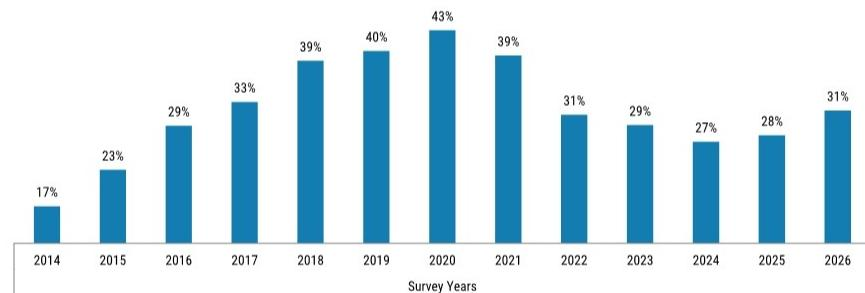  
Source: AlphaWise, MS

Exhibit 10: Netflix leads on many content quality-related metrics, although Paramount+, HBO Max, and Peacock compete closely on TV shows

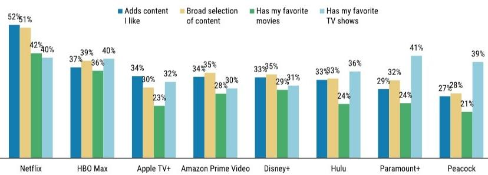  
Source: AlphaWise, MS

Platform Market Fit: The quality of engagement with platform content is a complex and multifaceted measure, and can vary across user segments. We asked streaming subscribers about their typical level of focus when watching content on that platform, and about how often they come to the platform with a specific piece of

content in mind. Overall, a large majority of subscribers watch platform content as a primary focus, and come to platforms with a specific content destination, although levels vary across platforms. Interestingly, results suggest that these two measures are positively correlated. Netflix, Apple TV+, and HBO Max users are the most likely to be fully focused when they watch, and they are most likely to have 'destination content'. Meanwhile, Disney+, YouTube, and Peacock are relatively more associated with playing in the background and browsing. Scoring lower on these indices may not indicate lower quality of engagement, but rather fulfilling a distinct market niche.

Across most platforms tested, younger subscribers (18-24) had the lowest focus index scores, suggesting higher rates of multitasking behaviors.

Exhibit 11: When you watch content on each of these platforms, how often is the content your primary focus versus something you mainly have on in the background while doing other activities?  
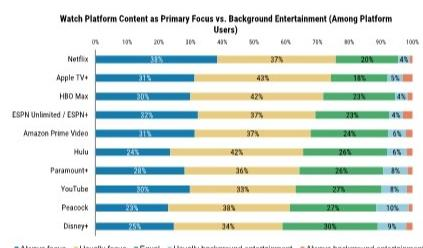  
Source: AlphaWise, MS

Exhibit 12: Netflix, Apple TV+, and HBO Max elicit the most focus for subscribers  
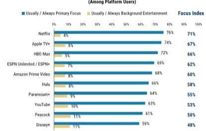  
Source: AlphaWise, MS

Exhibit 13: How often do you open this platform with a specific show, movie, or video in mind?  
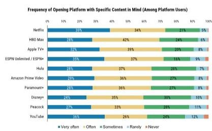  
Source: AlphaWise, MS

Exhibit 14: YouTube, Peacock, and Disney+ have the most 'browsing' users  
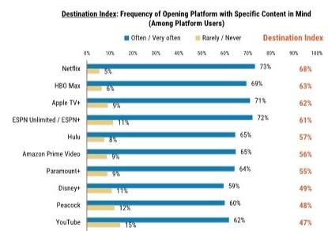  
Source: AlphaWise, MS

Exhibit 15: Quality is King: Focus index and destination index are positively correlated  
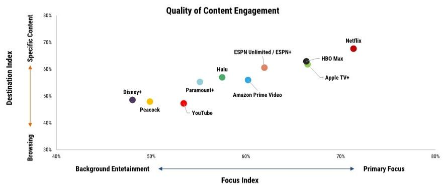  
Source: AlphaWise, MS

Users who actively chose their subscription are more focused on its content. Focus index scores differed depending on the reasons why respondents have the subscription(s) they have – Netflix users who subscribed to Netflix to access its specific content (e.g., sports programming, favorite movies, etc.) are more likely to be fully focused when watching, compared to their counterparts who have Netflix because someone else in their household uses it, or because it was part of a wireless bundle. This framework holds true across all platforms tested, with a few exceptions such as Disney+ (which is more often purchased for children in the household).

Exhibit 16: Level of focus is lower among platform users who got their subscription via a bundle or another member of their household

<table><tr><td></td><td colspan="12">Reasons for Subscribing to [Streaming Service]</td></tr><tr><td>Focus Index (%Primary focus - %Background entertainment)</td><td>Has my favorite TV shows*</td><td>Has my favorite movies*</td><td>Has a broad selection of movies / TV shows</td><td>Good value for the money</td><td>Continues to add movies and TV shows that I like*</td><td>There are no ads / an acceptable amount of ads</td><td>Has live sports programming</td><td>Someone else in my household uses it</td><td>Included with my home internet or wireless phone plan</td><td>Included with a bundle with [another streaming service]**</td><td>Included with some other types of subscription**</td><td>Subscribed via free annual offer with Apple hardware purchase</td></tr><tr><td>Netflix</td><td>77%</td><td>79%</td><td>76%</td><td>79%</td><td>78%</td><td>78%</td><td>80%</td><td>61%</td><td>71%</td><td></td><td></td><td></td></tr><tr><td>Amazon Prime Video</td><td>73%</td><td>74%</td><td>74%</td><td>69%</td><td>74%</td><td>77%</td><td>75%</td><td>55%</td><td></td><td></td><td>60%</td><td></td></tr><tr><td>Hulu</td><td>70%</td><td>70%</td><td>70%</td><td>69%</td><td>70%</td><td>75%</td><td>63%</td><td>45%</td><td>65%</td><td>58%</td><td>67%</td><td></td></tr><tr><td>Disney+</td><td>50%</td><td>52%</td><td>63%</td><td>56%</td><td>64%</td><td>59%</td><td>65%</td><td>47%</td><td>60%</td><td>47%</td><td></td><td></td></tr><tr><td>Apple TV+</td><td>70%</td><td>70%</td><td>70%</td><td>69%</td><td>70%</td><td>67%</td><td>63%</td><td>45%</td><td></td><td>58%</td><td>65%</td><td>75%</td></tr><tr><td>HBO Max</td><td>73%</td><td>73%</td><td>74%</td><td>70%</td><td>77%</td><td>75%</td><td>78%</td><td>55%</td><td>68%</td><td></td><td></td><td></td></tr><tr><td>Paramount+</td><td>72%</td><td>66%</td><td>65%</td><td>66%</td><td>69%</td><td>69%</td><td>68%</td><td>25%</td><td>69%</td><td></td><td>55%</td><td></td></tr><tr><td>Peacock</td><td>69%</td><td>62%</td><td>68%</td><td></td><td>65%</td><td>68%</td><td>66%</td><td>38%</td><td>59%</td><td>53%</td><td></td><td></td></tr><tr><td>Weighted Average</td><td>70%</td><td>71%</td><td>72%</td><td>66%</td><td>73%</td><td>73%</td><td>71%</td><td>49%</td><td>66%</td><td>52%</td><td>61%</td><td></td></tr></table>

Note: \*For Disney+, states "Has my / my kids' favorite TV shows/movies" and "Continues to add movies and TV shows I / my family likes"; \*\*SVOD bundling pairs include Disney+/Hulu and Apple TV+/Peacock.; \*\*\*Other types of subscriptions include Prime membership (Amazon Prime Video), Hulu+ with Live TV subscription (Hulu), Apple One subscription (Apple TV+), and Walmart+ subscription (Paramount+).  
Source: AlphaWise, MS

## Netflix Pricing Sensitivity

While Netflix recently increased prices, the value perception remains strong with most thinking that the current standard ad-free plan pricing at \~\$20 per month is a 'great buy for the money' while they have room to >\$30 per month before it is perceived to be 'getting expensive' and would give some thought to subscribing.

Exhibit 17: Netflix's pricing power remains clear as churn remains contained even through price hikes  
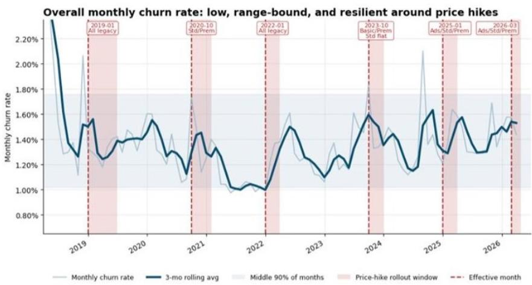  
Note: Credit card data is a panel proxy subject to panel composition, card/payment switching, and billing-timing bias; churn should be interpreted directionally, not as reported NFLX subscriber churn; We define churn as a card that paid for NFLX in each of the prior six months and then had no NFLX payments for two consecutive months.  
Source: AlphaWise, Carbon Arc - Credit Card US Complete Panel, MS

Exhibit 18: Price sensitivity test suggests near-optimal pricing for Netflix  
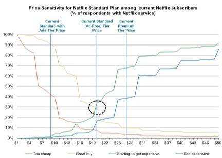  
Source: AlphaWise, MS

Exhibit 19: Current Netflix subs and non-subs have very similar views on pricing  
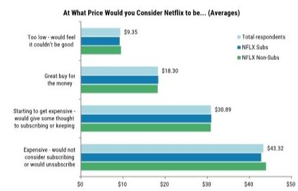  
Source: AlphaWise, MS

2018 survey 2019 survey 2020 survey 2021 survey 2022 survey 2023 survey 2024 survey 2025 survey 2026 survey

## Video Entertainment / Streaming Landscape

Traditional pay TV still has an audience, but vMVPD and streaming platforms continue to innovate. Around 40% of respondents in our survey report having a traditional pay-TV subscription, down from 44% last year, but in line with the 3 preceding waves. This suggests the continued existence of a core audience for whom pay TV is not replaceable yet. 25-34-year-olds and higher-income households are more likely to have pay TV than other groups, but this is also true of vMVPDs.

YouTube TV and Hulu+ Live TV are the top vMVPD services, used by 29% and 21% of respondents' households, respectively. Both increased their share of total vMVPD subscriptions YoY, taking share from DirecTV Stream, NOW TV, and fubo TV.

Exhibit 20: Pay-TV subscriptions among total respondents ticked down YoY to $40\%$ , in line with 2022-24 levels

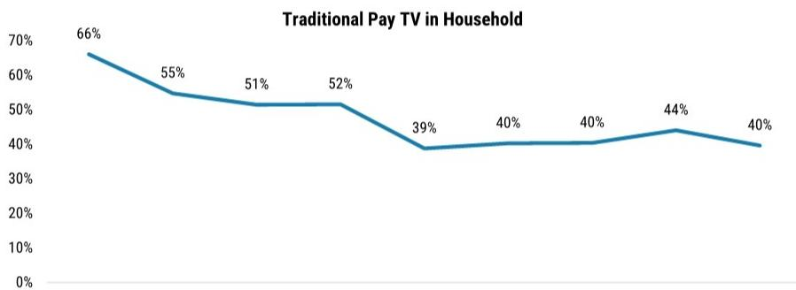  
Source: AlphaWise, MS

Exhibit 21: Pay-TV and vMVPD subscription rates are highest among 25-34-year-olds, males, and higher-income households

2026: Household Subscribes to Traditional Pay TV / vMVPD, by Demographics

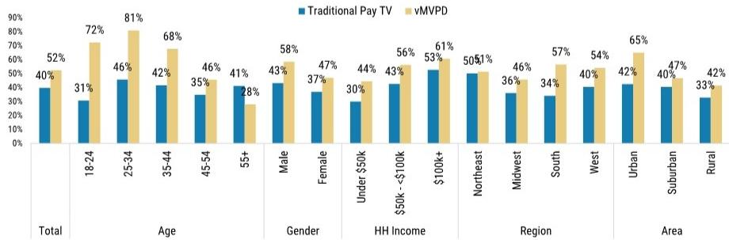  
Source: AlphaWise, MS

Exhibit 22: About half of respondents have a vMVPD, led by YouTube TV  
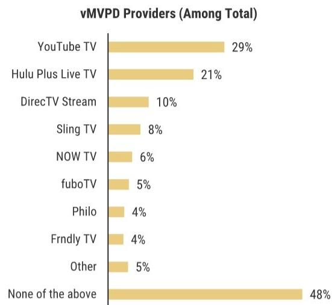  
Source: AlphaWise, MS

Exhibit 23: YouTube TV and Hulu+ Live TV tick up in share of total subscriptions YoY  
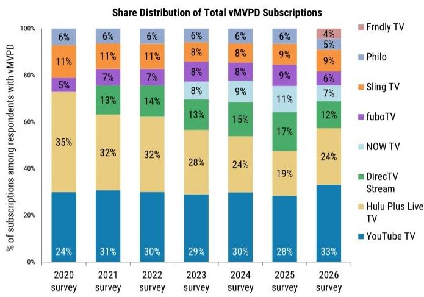  
Source: AlphaWise, MS

## Streaming Service Adoption

Amazon Prime Video, Netflix, and YouTube (free) continue to lead the pack among video streaming platforms, used by 66%, 55%, and 47% of respondents, respectively. Platform adoption is up YoY overall, with the average respondent subscribing to 5.4 free or paid services (vs. 5.0 last year). Looking to paid subscriptions, the average respondent subscribes to 3.2 services, up from 3.1 in 2025.

Exhibit 24: Paid streaming service user penetration sees gains YoY  
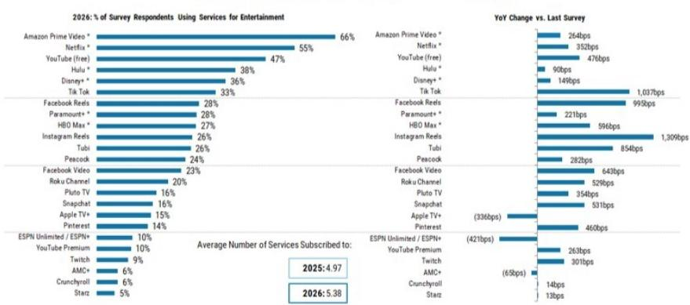  
Note: \* Netflix, HBO Max, Disney+, Hulu, Paramount+, and Amazon Prime Video reflect each respective service with or without ads.  
Source: AlphaWise, MS

Exhibit 25: On average, survey respondents subscribe to 3.2 paid video streaming services, up slightly from 3.1 last year  
Average Number of Paid Streaming Services Subscribed To (Among Total)  
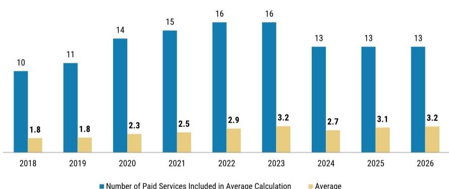  
Note: List of paid streaming services included in average calculation are Netflix, Prime Video, Disney+, Hulu, ESPN+, HBO Max, Paramount+, Apple TV+, YouTube Premium, Peacock, Starz, MGM+/Epix, AMC+. Excludes Crunchyroll.  
Source: Company data, MS estimate

## Share of Time

The average US HH has >5 streaming services including free (5.4 vs 4.9 last year); with 3+ paid subscriptions (up to 3.2 from 3.1 last year) & watches 3 hours per day of TV, movies and online videos – with older cohorts skewing higher.

Exhibit 26: Across all age groups, SVODs have the largest share of watching time  
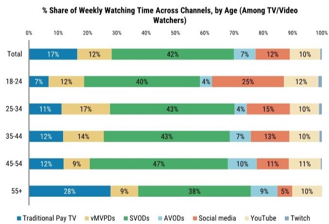  
Source: AlphaWise, MS

Exhibit 27: Older groups watch more hours of TV/video per week, driven by pay TV  
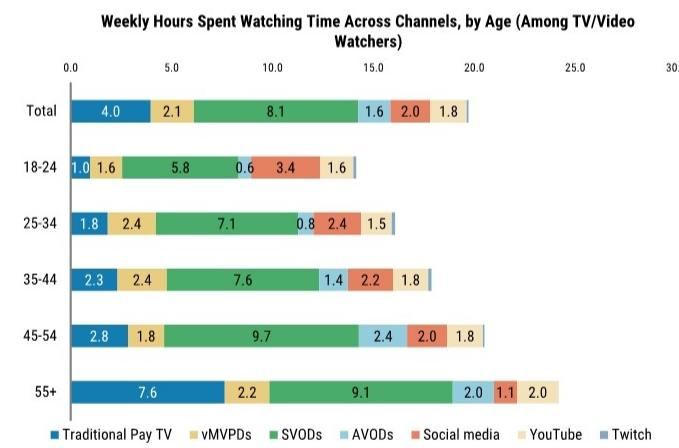  
Source: AlphaWise, MS

## Ad Tier Subscriptions

Since introducing cheaper ad-supported subscription tiers several years ago, adoption has climbed steadily. Netflix, Disney+ and HBO Max have seen some cannibalization as a portion of existing users trade down to these lower-revenue tiers, but as overall adoption rallies over time, these platforms become more effectively monetized. Hulu, Paramount+ and Amazon Prime Video have seen little to no impact on adoption rates of their ad-free tiers, even as ad-supported tier adoption increases YoY.

Exhibit 28: Across all platforms, adoption of ad-tier subscriptions is trending upward... Streaming Platform Adoption: Advertisement / No Advertisement Tiers  
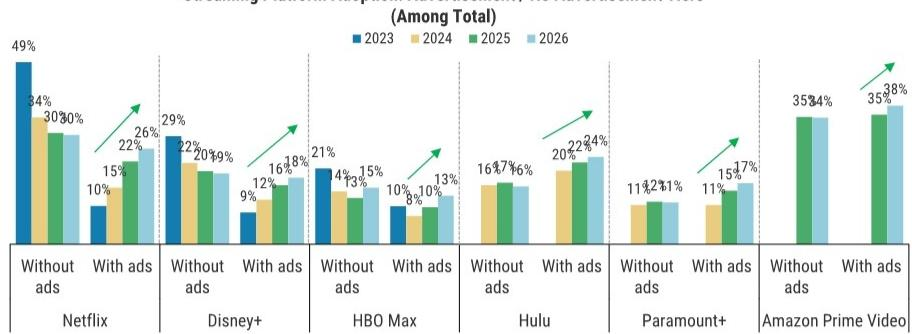  
Source: AlphaWise, MS  
Percent of Users with Advertisement / No Advertisement Tiers (Among Users of Each Service)  
■ Without ads  
■ With ads

Exhibit 29: ... and ad-tier subscriptions are making up an increasing share of each platform's user base

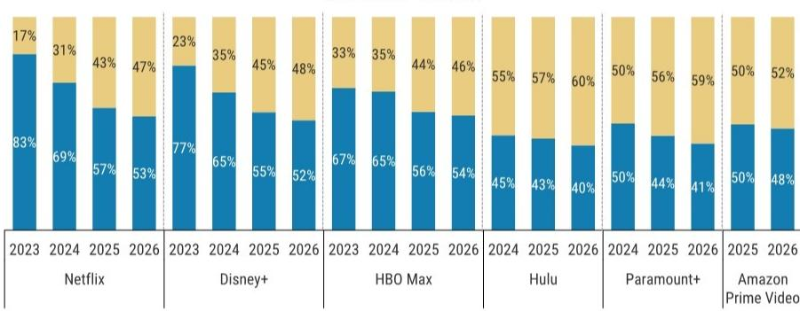  
Source: AlphaWise, MS

Platform Market Fit: The quality of engagement with platform content is a complex and multifaceted measure, and can vary across user segments. We asked streaming subscribers about their typical level of focus when watching content on that platform, and about how often they come to the platform with a specific piece of content in mind. Overall, a large majority of subscribers watch platform content as a primary focus, and come to platforms with a specific content destination, although levels vary across platforms. Interestingly, results suggest that these two measures are positively correlated. Netflix, Apple TV+, and HBO Max users are the most likely to be fully focused when they watch, and they are most likely to have 'destination content'. Meanwhile, Disney+, YouTube, and Peacock are relatively more associated with playing in the background and browsing. Scoring lower on these indices may not indicate lower quality of engagement, but rather fulfilling a distinct market niche.

Across most platforms tested, younger subscribers (18-24) had the lowest focus index scores, suggesting higher rates of multitasking behaviors.

Exhibit 30: When you watch content on each of these platforms, how often is the content your primary focus versus something you mainly have on in the background while doing other activities?

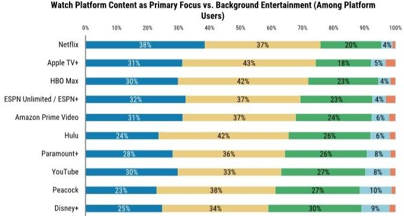  
- Always focus
- Usually focus
- Equal
- Usually background entertainment
- Always background entertainment  
Source: AlphaWise, MS

Exhibit 31: Netflix, Apple TV+, and HBO Max elicit the most focus for subscribers  
Focus Index: Watch Platform Content as Primary Focus vs. Background Entertainment (Among Platform Users)  
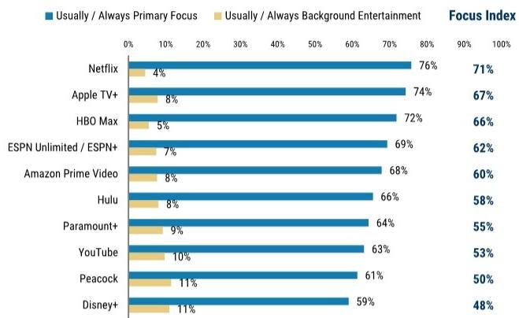  
Source: AlphaWise, MS

Exhibit 32: How often do you open this platform with a specific show, movie, or video in mind?

Frequency of Opening Platform with Specific Content in Mind (Among Platform Users)  
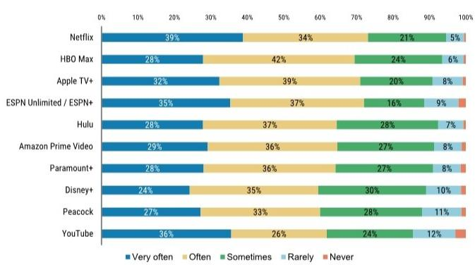  
Source: AlphaWise, MS  
Exhibit 33: YouTube, Peacock, and Disney+ have the most 'browsing' users  
Destination Index: Frequency of Opening Platform with Specific Content in Mind (Among Platform Users)

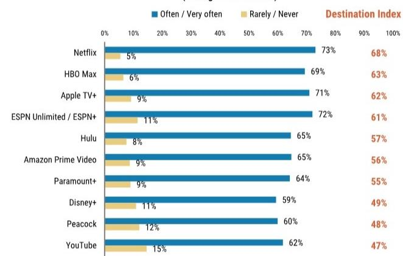  
Source: AlphaWise, MS

## Exhibit 34:

Focus index and destination index are positively correlated

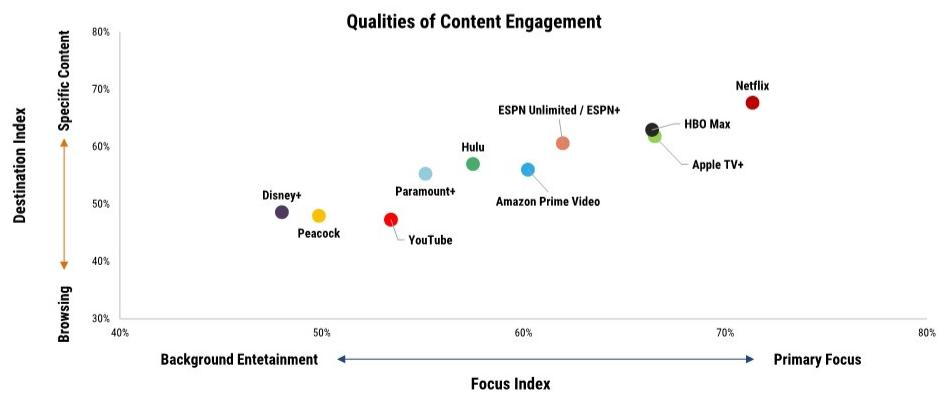  
Source: AlphaWise, MS

Subscribers' focus level varies depending on their reasons for subscribing to streaming platforms. Perhaps not surprisingly, respondents who had more passive entry points to their subscriptions are less likely to watch that platform as their primary focus. For example, having a subscription because "someone else in my household uses it" or because "it was included in a bundle" report lower focus index scores than average. Higher focus index scores are associated with liking the content or accepting the ad load.

Exhibit 35: Level of focus is lower among platform users who got their subscription via a bundle or another member of their household

<table><tr><td></td><td colspan="12">Reasons for Subscribing to [Streaming Service]</td></tr><tr><td>Focus Index (%Primary focus - %Background entertainment)</td><td>Has my favorite TV shows*</td><td>Has my favorite movies*</td><td>Has a broad selection of movies / TV shows</td><td>Good value for the money</td><td>Continues to add movies and TV shows that I like*</td><td>There are no ads / an acceptable amount of ads</td><td>Has five sports programming</td><td>Someone else in my household uses it</td><td>Included with my home Internet or wireless phone plan</td><td>Included with a bundle with [another streaming service]**</td><td>Included with some other type of subscription***</td><td>Subscribed via free annual offer with Apple hardware purchase</td></tr><tr><td>Netflix</td><td>77%</td><td>79%</td><td>76%</td><td>79%</td><td>78%</td><td>78%</td><td>80%</td><td>61%</td><td>71%</td><td></td><td></td><td></td></tr><tr><td>Amazon Prime Video</td><td>73%</td><td>74%</td><td>74%</td><td>69%</td><td>74%</td><td>77%</td><td>75%</td><td>55%</td><td></td><td></td><td>60%</td><td></td></tr><tr><td>Hulu</td><td>70%</td><td>70%</td><td>70%</td><td>69%</td><td>70%</td><td>75%</td><td>63%</td><td>45%</td><td>65%</td><td>58%</td><td>67%</td><td></td></tr><tr><td>Disney+</td><td>50%</td><td>52%</td><td>63%</td><td>56%</td><td>84%</td><td>59%</td><td>65%</td><td>47%</td><td>60%</td><td>47%</td><td></td><td></td></tr><tr><td>Apple TV+</td><td>70%</td><td>70%</td><td>70%</td><td>69%</td><td>70%</td><td>67%</td><td>63%</td><td>45%</td><td></td><td>58%</td><td>65%</td><td>75%</td></tr><tr><td>HBO Max</td><td>73%</td><td>73%</td><td>74%</td><td>70%</td><td>77%</td><td>75%</td><td>72%</td><td>55%</td><td>68%</td><td></td><td></td><td></td></tr><tr><td>Paramount+</td><td>72%</td><td>66%</td><td>65%</td><td>66%</td><td>69%</td><td>69%</td><td>71%</td><td>25%</td><td>69%</td><td></td><td>55%</td><td></td></tr><tr><td>Peacock</td><td>69%</td><td>62%</td><td>68%</td><td></td><td>65%</td><td>68%</td><td>67%</td><td>38%</td><td>59%</td><td>53%</td><td></td><td></td></tr><tr><td>Weighted Average</td><td>70%</td><td>71%</td><td>72%</td><td>66%</td><td>73%</td><td>73%</td><td>71%</td><td>49%</td><td>66%</td><td>52%</td><td>61%</td><td></td></tr></table>

Note: Color scales applied per row.  
\*For Disney+, states "Has my / my kids' favorite TV shows/movies" and "Continues to add movies and TV shows I / my family likes"; \*\*SVOD bundling pairs include Disney+/Hulu and Apple TV+/Peacock; \*\*\*Other types of subscriptions include Prime membership (Amazon Prime Video), Hulu+ with Live TV subscription (Hulu), Apple One subscription (Apple TV+), and Walmart+ subscription (Paramount+).
Source: AlphaWise, MS

## Potential Impact of Combined HBO Max / Paramount+ Platform

Key to our OW rating on PSKY is its ability to merge Paramount+ and HBO Max into a unified profitable service. Results below are encouraging, as only 10% of subscribers are very unlikely or somewhat unlikely to subscribe to the new super service. Additionally, having access to this combined service may earn PSKY some competitive share from peers: 17% of respondents would likely replace one of their other existing paid subscriptions when adding the combined HBO Max / Paramount+, with Amazon Prime Video, Netflix, and Hulu being the biggest potential share donors. We caveat that survey respondents can tend to over-estimate future actions, especially without a known price point, so our survey estimations represent a maximal potential impact.

Exhibit 36: More than half of respondents are at least somewhat likely to subscribe combined service  
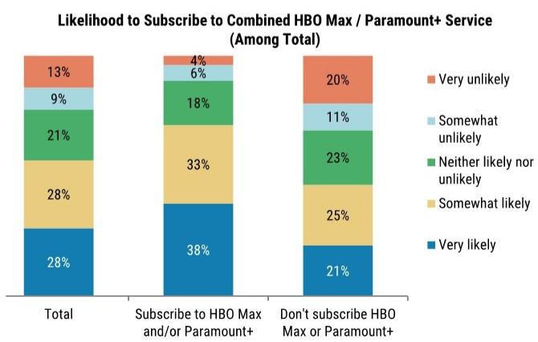  
Source: AlphaWise, MS  
Exhibit 37: Likely way of adding the combined HBO Max/Paramount+ service?  
Likely Way of Adding Combined HBO Max / Paramount+ (Among Total)

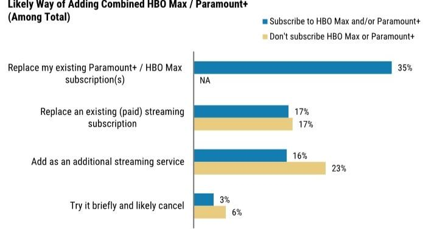  
Source: AlphaWise, MS

## Exhibit 38:

Amazon Prime Video is the most likely streaming platform to be replaced by a hypothetical HBO Max / Paramount+ platform

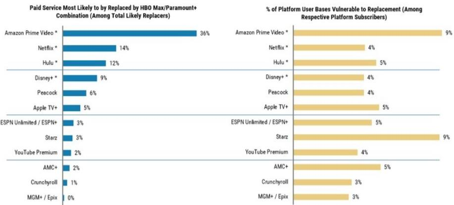  
Note: \* Netflix, HBO Max, Disney+, Hulu, Paramount+, and Amazon Prime Video reflect each respective service with or without ads.  
Source: AlphaWise, MS

Exhibit 39: If respondents in our survey were to follow through on their expected actions, we see significant upside for PSKY

k:\graphics\misc\2000\FID Excel Project\202635 Connectivity & Online Streaming Tables & Charts.xlsx:Combo HBO Para+

Potential Share Shift Following Introduction of HBO Max / Paramount+ Combination Offering (Among Total)

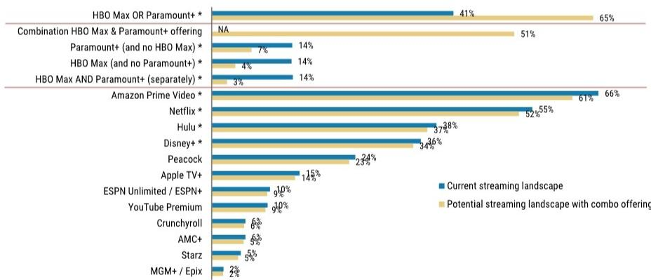  
Note: \* Netflix, HBO Max, Disney+, Hulu, Paramount+, and Amazon Prime Video reflect each respective service with or without ads.  
Source: AlphaWise, MS

\- Don't have access to live sports
- Have access to live sports but don't watch regularly
- Regularly watch live sports

## Live Sports

Access to televised live sports has historically been a significant advantage for traditional pay TV over à la carte streaming services.

Exhibit 40: Almost two thirds of the survey watch sports regularly...

Regularly Watch Live Sports (Among Total)

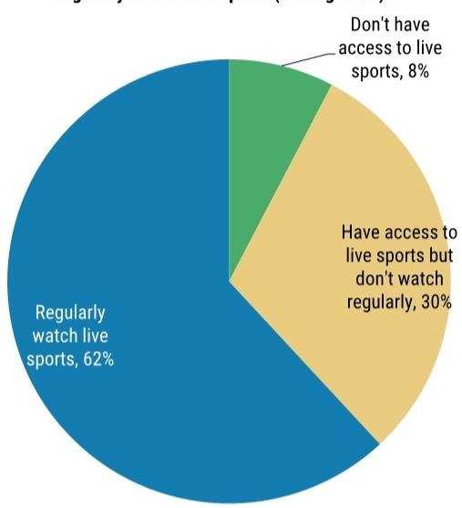  
Exhibit 41: ... skewing towards pay-TV subscribers  
Regularly Watch Live Sports, by TV Subscription

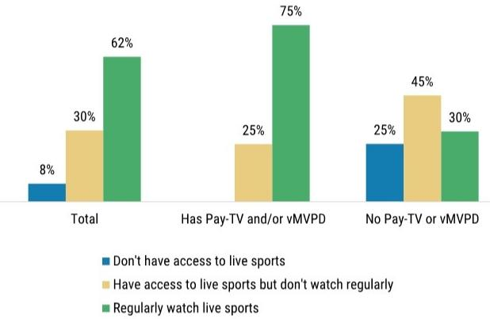  
Note: Access to live sports includes respondents who subscribe to pay TV/vMVPDs, Amazon Prime Video, Apple TV+, Disney+, ESPN+, Hulu, HBO Max, Netflix, Paramount+, and/or Peacock.  
Source: AlphaWise, MS  
Note: Access to live sports includes respondents who subscribe to pay TV/vMVPDs, Amazon Prime Video, Apple TV+, Disney+, ESPN+, Hulu, HBO Max, Netflix, Paramount+, and/or Peacock.  
Source: AlphaWise, MS

Exhibit 42: Over half of total respondents report regularly watching live sports on a TV channel (led by ESPN at 31%), and about a third watch live sports on a streaming platform (led by Prime Video at 22%)

Channels/Platforms Where Regularly Watching Live Sports (Among Total)

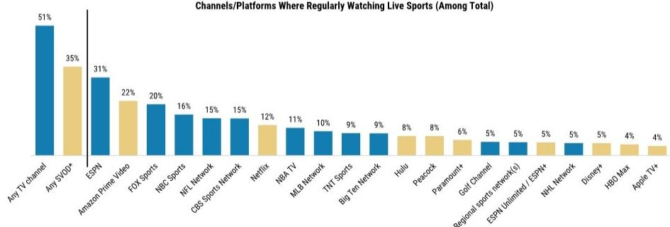  
Note: \*Any SVOD\* includes SVODs with live sports offerings.  
Source: AlphaWise, MS

Exhibit 43: Watching live sports on SVOD is up 3ppt YoY...  
Watch Live Sports on TV / Streaming Platforms (Among  
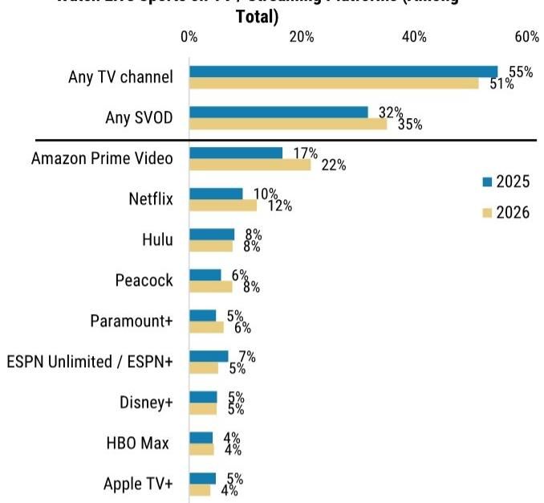  
Source: AlphaWise, MS  
Exhibit 44: ... driven most by Prime Video and Peacock

Watch Live Sports on Streaming Platforms (Among Respective Platform Users)  
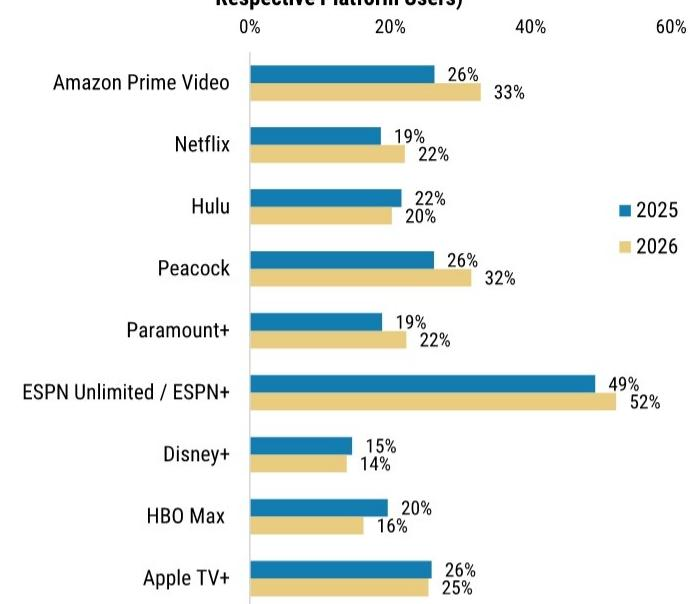  
Source: AlphaWise, MS  
Exhibit 45:  
Peacock and Amazon Prime have the highest percentage of users who subscribe for live sports programming  
Subscribe to Platform Because it Has Live Sports Programming (Among Respective Subscribers)

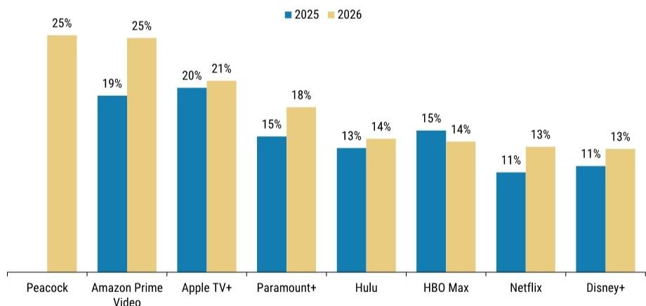  
Source: AlphaWise, MS

## AlphaWise Survey Methodology

Online survey among $\sim 3,000$ consumers $18+$ year old in the U.S. Total sample is representative of the U.S. general population in terms of age, gender, and region. The margin of error on the total sample is $\pm 1.8\%$ at $95\%$ confidence level; higher for subgroups.

## Survey Sample Profile

Exhibit 46: Sample age distribution  
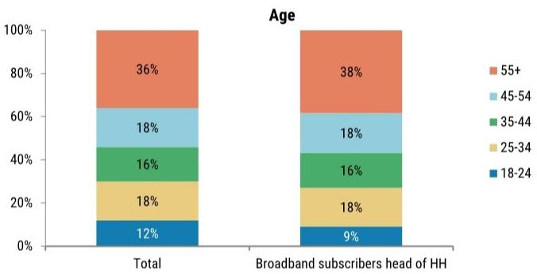  
Source: AlphaWise, MS

Exhibit 47: Sample gender distribution  
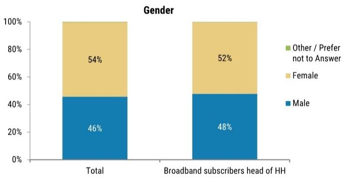  
Source: AlphaWise, MS

Exhibit 48: Sample region distribution  
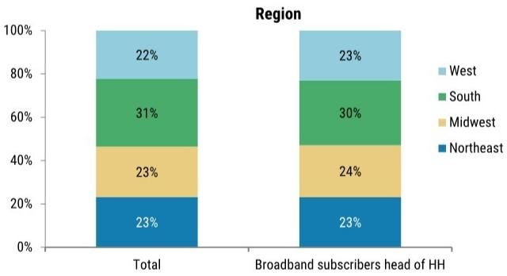  
Source: AlphaWise, MS

Exhibit 49: Sample area distribution  
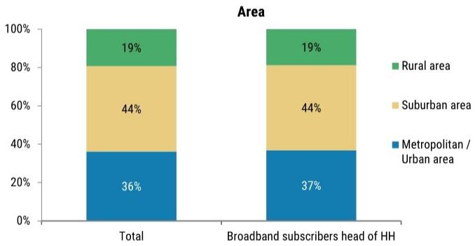  
Source: AlphaWise, MS

Exhibit 50: Sample household income distribution  
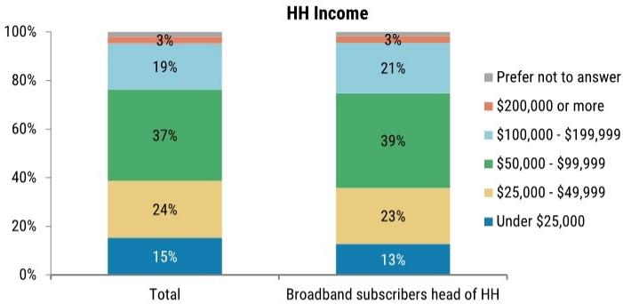  
Source: AlphaWise, MS

## Disclosure Section

The information and opinions in MS were prepared by MS & Co. LLC, and/or MS C.T.V.M. S.A., and/or MS Mexico, Casa de Bolsa, S.A. de C.V., and/or MS Canada Limited. As used in this disclosure section, "MS" includes MS & Co. LLC, MS C.T.V.M. S.A., MS Mexico, Casa de Bolsa, S.A. de C.V., MS Canada Limited and their affiliates as necessary.

For important disclosures, stock price charts and equity rating histories regarding companies that are the subject of this report, please see the MS Disclosure Website at www.morganstanley.com/eqr/disclosures/webapp/generalresearch, or contact your investment representative or MS at 1585 Broadway, (Attention: Research Management), New York, NY, 10036 USA.

For valuation methodology and risks associated with any recommendation, rating or price target referenced in this research report, please contact the Client Support Team as follows: US/Canada +1 800 303-2495; Hong Kong +852 2848-5999; Latin America +1 718 754-5444 (U.S.); London +44 (0)20-7425-8169; Singapore +65 6834-6860; Sydney +61 (0)2-9770-1505; Tokyo +81 (0)3-6836-9000. Alternatively you may contact your investment representative or MS at 1585 Broadway, (Attention: Research Management), New York, NY 10036 USA.

## Analyst Certification

The following analysts hereby certify that their views about the companies and their securities discussed in this report are accurately expressed and that they have not received and will not receive direct or indirect compensation in exchange for expressing specific recommendations or views in this report: Sean Diffley, CFA; Daniel Duran; Patrick A Ho; Brian Nowak, CFA; Erik W Woodring.

## Global Research Conflict Management Policy

MS has been published in accordance with our conflict management policy, which is available at www.morganstanley.com/institutional/research/conflictpolicies. A Portuguese version of the policy can be found at www.morganstanley.com.br

## Important Regulatory Disclosures on Subject Companies

The analyst or strategist (or a household member) identified below owns the following securities (or related derivatives): Erik W Woodring - AMC Networks, Inc.(common or preferred stock), Walt Disney Co(common or preferred stock).

As of May 29, 2026, MS beneficially owned 1% or more of a class of common equity securities of the following companies covered in MS: AMC Networks, Inc., Netflix Inc, Paramount Skydance Corporation, Starz Entertainment Corp., Walt Disney Co, Warner Bros Discovery Inc..

Within the last 12 months, MS has received compensation for investment banking services from AMC Networks, Inc., Netflix Inc, Paramount Skydance Corporation, Walt Disney Co.

In the next 3 months, MS expects to receive or intends to seek compensation for investment banking services from AMC Networks, Inc., Netflix Inc, Paramount Skydance Corporation, Starz Entertainment Corp., Walt Disney Co, Warner Bros Discovery Inc..

Within the last 12 months, MS has received compensation for products and services other than investment banking services from AMC Networks, Inc., Netflix Inc, Walt Disney Co, Warner Bros Discovery Inc..

Within the last 12 months, MS has provided or is providing investment banking services to, or has an investment banking client relationship with, the following company: AMC Networks, Inc., Netflix Inc, Paramount Skydance Corporation, Starz Entertainment Corp., Walt Disney Co, Warner Bros Discovery Inc..

Within the last 12 months, MS has either provided or is providing non-investment banking, securities-related services to and/or in the past has entered into an agreement to provide services or has a client relationship with the following company: AMC Networks, Inc., Netflix Inc, Paramount Skydance Corporation, Walt Disney Co, Warner Bros Discovery Inc..

An employee, director or consultant of MS is a director of Walt Disney Co. This person is not a research analyst or a member of a research analyst's household.

MS & Co. LLC makes a market in the securities of AMC Networks, Inc., Starz Entertainment Corp..

The equity research analysts or strategists principally responsible for the preparation of MS have received compensation based upon various factors, including quality of research, investor client feedback, stock picking, competitive factors, firm revenues and overall investment banking revenues. Equity Research analysts' or strategists' compensation is not linked to investment banking or capital markets transactions performed by MS or the profitability or revenues of particular trading desks.

MS and its affiliates do business that relates to companies/instruments covered in MS, including market making, providing liquidity, fund management, commercial banking, extension of credit, investment services and investment banking. MS sells to and buys from customers the securities/instruments of companies covered in MS on a principal basis. MS may have a position in the debt of the Company or instruments discussed in this report. MS trades or may trade as principal in the debt securities (or in related derivatives) that are the subject of the debt research report.

Certain disclosures listed above are also for compliance with applicable regulations in non-US jurisdictions.

## STOCK RATINGS

MS uses a relative rating system using terms such as Overweight, Equal-weight, Not-Rated or Underweight (see definitions below). MS does not assign ratings of Buy, Hold or Sell to the stocks we cover. Overweight, Equal-weight, Not-Rated and Underweight are not the equivalent of buy, hold and sell. Investors should carefully read the definitions of all ratings used in MS. In addition, since MS contains more complete information concerning the analyst's views, investors should carefully read MS, in its entirety, and not infer the contents from the rating alone. In any case, ratings (or research) should not be used or relied upon as investment advice. An investor's decision to buy or sell a stock should depend on individual circumstances (such as the investor's existing holdings) and other considerations.

## Global Stock Ratings Distribution

(as of May 31, 2026)

The Stock Ratings described below apply to MS's Fundamental Equity Research and do not apply to Debt Research produced by the Firm.

For disclosure purposes only (in accordance with FINRA requirements), we include the category headings of Buy, Hold, and Sell alongside our ratings of Overweight, Equal-weight, Not-Rated and Underweight. MS does not assign ratings of Buy, Hold or Sell to the stocks we cover. Overweight, Equal-weight, Not-Rated and Underweight are not the equivalent of buy, hold, and sell but represent recommended relative weightings (see definitions below). To satisfy regulatory requirements, we correspond Overweight, our most positive stock rating, with a buy recommendation; we correspond Equal-weight and Not-Rated to hold and Underweight to sell recommendations, respectively.

<table><tr><td rowspan="2">Stock Rating Category</td><td colspan="2">Coverage Universe</td><td colspan="3">Investment Banking Clients (IBC)</td><td colspan="2">Other Material Investment Services Clients (MISC)</td></tr><tr><td>Count</td><td>% of Total</td><td>Count</td><td>% of Total IBC</td><td>% of Rating Category</td><td>Count</td><td>% of Total Other MISC</td></tr><tr><td>Overweight/Buy</td><td>1542</td><td>42%</td><td>465</td><td>51%</td><td>30%</td><td>707</td><td>43%</td></tr><tr><td>Equal-weight/Hold</td><td>1571</td><td>43%</td><td>369</td><td>40%</td><td>23%</td><td>723</td><td>44%</td></tr><tr><td>Not-Rated/Hold</td><td>3</td><td>0%</td><td>0</td><td>0%</td><td>0%</td><td>1</td><td>0%</td></tr><tr><td>Underweight/Sell</td><td>551</td><td>15%</td><td>86</td><td>9%</td><td>16%</td><td>201</td><td>12%</td></tr><tr><td>Total</td><td>3,667</td><td></td><td>920</td><td></td><td></td><td>1632</td><td></td></tr></table>

Data include common stock and ADRs currently assigned ratings. Investment Banking Clients are companies from whom MS received investment banking compensation in the last 12 months. Due to rounding off of decimals, the percentages provided in the "% of total" column may not add up to exactly 100 percent.

## Analyst Stock Ratings

Overweight (O). The stock's total return is expected to exceed the average total return of the analyst's industry (or industry team's) coverage universe, on a risk-adjusted basis, over the next 12-18 months.

Equal-weight (E). The stock's total return is expected to be in line with the average total return of the analyst's industry (or industry team's) coverage universe, on a risk-adjusted basis, over the next 12-18 months.

Not-Rated (NR). Currently the analyst does not have adequate conviction about the stock's total return relative to the average total return of the analyst's industry (or industry team's) coverage universe, on a risk-adjusted basis, over the next 12-18 months.

Underweight (U). The stock's total return is expected to be below the average total return of the analyst's industry (or industry team's) coverage universe, on a risk-adjusted basis, over the next 12-18 months.

Unless otherwise specified, the time frame for price targets included in MS is 12 to 18 months.

## Analyst Industry Views

Attractive (A): The analyst expects the performance of his or her industry coverage universe over the next 12-18 months to be attractive vs. the relevant broad market benchmark, as indicated below.

In-Line (I): The analyst expects the performance of his or her industry coverage universe over the next 12-18 months to be in line with the relevant broad market benchmark, as indicated below. Cautious (C): The analyst views the performance of his or her industry coverage universe over the next 12-18 months with caution vs. the relevant broad market benchmark, as indicated below. Benchmarks for each region are as follows: North America - S&P 500; Latin America - relevant MSCI country index or MSCI Latin America Index; Europe - MSCI Europe; Japan - TOPIX; Asia - relevant MSCI country index or MSCI sub-regional index or MSCI AC Asia Pacific ex Japan Index.

## Important Disclosures for MS Smith Barney LLC Customers

Important disclosures regarding any material conflict of interest that can reasonably be expected to have influenced MS Smith Barney LLC's choice of a third-party research provider or the subject company of a third-party research report, are available on the MS Wealth Management disclosure website at www.morganstanley.com/online/researchdisclosures. For MS specific disclosures, you may refer to https://www.morganstanley.com/eqr/disclosures/webapp/generalresearch.

Each MS report is reviewed and approved on behalf of MS Smith Barney LLC. This review and approval is conducted by the same person who reviews the research report on behalf of MS. This could create a conflict of interest.

## Other Important Disclosures

A member of Research who had or could have had access to the research prior to completion owns securities (or related derivatives) in the Netflix Inc, Walt Disney Co. This person is not a research analyst or a member of research analyst's household.

MS policy is to update research reports as and when the Research Analyst and Research Management deem appropriate, based on developments with the issuer, the sector, or the market that may have a material impact on the research views or opinions stated therein. In addition, certain Research publications are intended to be updated on a regular periodic basis (weekly/monthly/quarterly/annual) and will ordinarily be updated with that frequency, unless the Research Analyst and Research Management determine that a different publication schedule is appropriate based on current conditions.

MS is not acting as a municipal advisor and the opinions or views contained herein are not intended to be, and do not constitute, advice within the meaning of Section 975 of the Dodd-Frank Wall Street Reform and Consumer Protection Act.

MS produces an equity research product called a "Tactical Idea." Views contained in a "Tactical Idea" on a particular stock may be contrary to the recommendations or views expressed in research on the same stock. This may be the result of differing time horizons, methodologies, market events, or other factors. For all research available on a particular stock, please contact your sales representative or go to Matrix at http://www.morganstanley.com/matrix.

MS is provided to our clients through our proprietary research portal on Matrix and also distributed electronically by MS to clients. Certain, but not all, MS products are also made available to clients through third-party vendors or redistributed to clients through alternate electronic means as a convenience. For access to all available MS, please contact your sales representative or go to Matrix at http://www.morganstanley.com/matrix.

Any access and/or use of MS is subject to MS's Terms of Use (http://www.morganstanley.com/terms.html). By accessing and/or using MS, you are indicating that you have read and agree to be bound by our Terms of Use (http://www.morganstanley.com/terms.html). In addition you consent to MS processing your personal data and using cookies in accordance with our Privacy Policy and our Global Cookies Policy (http://www.morganstanley.com/privacy\_pledge.html), including for the purposes of setting your preferences and to collect readership data so that we can deliver better and more personalized service and products to you. To find out more information about how MS processes personal data, how we use cookies and how to reject cookies see our Privacy Policy and our Global Cookies Policy (http://www.morganstanley.com/privacy\_pledge.html). Please use the provided link to review the Terms and Conditions and Most Important Terms and Conditions for MS India Company Private Limited (https://www.morganstanley.com/assets/pdfs/about-us-global-offices/india/Terms\_and\_conditions.pdf) and the following link to review the audit report (https://ny.matrix.ms.com/eqr/research/webapp/researchdocs/

## MSICPL\_Morgan\_Stanley\_Research\_Audit\_Report.pdf).

If you do not agree to our Terms of Use and/or if you do not wish to provide your consent to MS processing your personal data or using cookies please do not access our research. MS does not provide individually tailored investment advice. MS has been prepared without regard to the circumstances and objectives of those who receive it. MS recommends that investors independently evaluate particular investments and strategies, and encourages investors to seek the advice of a financial adviser. The appropriateness of an investment or strategy will depend on an investor's circumstances and objectives. The securities, instruments, or strategies discussed in MS may not be suitable for all investors, and certain investors may not be eligible to purchase or participate in some or all of them. MS is not an offer to buy or sell or the solicitation of an offer to buy or sell any security/instrument or to participate in any particular trading strategy. The value of and income from your investments may vary because of changes in interest rates, foreign exchange rates, default rates, prepayment rates, securities/instruments prices, market indexes, operational or financial conditions of companies or other factors. There may be time limitations on the exercise of options or other rights in securities/instruments transactions. Past performance is not necessarily a guide to future performance. Estimates of future performance are based on assumptions that may not be realized. If provided, and unless otherwise stated, the closing price on the cover page is that of the primary exchange for the subject company's securities/instruments.

The fixed income research analysts, strategists or economists principally responsible for the preparation of MS have received compensation based upon various factors, including quality, accuracy and value of research, firm profitability or revenues (which include fixed income trading and capital markets profitability or revenues), client feedback and competitive factors. Fixed Income Research analysts', strategists' or economists' compensation is not linked to investment banking or capital markets transactions performed by MS or the profitability or revenues of particular trading desks.

The "Important Regulatory Disclosures on Subject Companies" section in MS lists all companies mentioned where MS owns 1% or more of a class of common equity securities of the companies. For all other companies mentioned in MS, MS may have an investment of less than 1% in securities/instruments or derivatives of securities/instruments of companies and may trade them in ways different from those discussed in MS. Employees of MS not involved in the preparation of MS may have investments in securities/instruments or derivatives of securities/instruments of companies mentioned and may trade them in ways different from those discussed in MS. Derivatives may be issued by MS or associated persons.

With the exception of information regarding MS, MS is based on public information. MS makes every effort to use reliable, comprehensive information, but we make no representation that it is accurate or complete. We have no obligation to tell you when opinions or information in MS change apart from when we intend to discontinue equity research coverage of a subject company. Facts and views presented in MS have not been reviewed by, and may not reflect information known to, professionals in other MS business areas, including investment banking personnel.

MS personnel may participate in company events such as site visits and are generally prohibited from accepting payment by the company of associated expenses unless pre-approved by authorized members of Research management.

MS may make investment decisions that are inconsistent with the recommendations or views in this report.

To our readers based in Taiwan or trading in Taiwan securities/instruments: Information on securities/instruments that trade in Taiwan is distributed by MS Taiwan Limited ("MSTL"). Such information is for your reference only. The reader should independently evaluate the investment risks and is solely responsible for their investment decisions. MS may not be distributed to the public media or quoted or used by the public media without the express written consent of MS. Any non-customer reader within the scope of Article 7-1 of the Taiwan Stock Exchange Recommendation Regulations accessing and/or receiving MS is not permitted to provide MS to any third party (including but not limited to related parties, affiliated companies and any other third parties) or engage in any activities regarding MS which may create or give the appearance of creating a conflict of interest. Information on securities/instruments that do not trade in Taiwan is for informational purposes only and is not to be construed as a recommendation or a solicitation to trade in such securities/instruments. MSTL may not execute transactions for clients in these securities/instruments.

MS is not incorporated under PRC law and the research in relation to this report is conducted outside the PRC. MS does not constitute an offer to sell or the solicitation of an offer to buy any securities in the PRC. PRC investors shall have the relevant qualifications to invest in such securities and shall be responsible for obtaining all relevant approvals, licenses, verifications and/or registrations from the relevant governmental authorities themselves. Neither this report nor any part of it is intended as, or shall constitute, provision of any consultancy or advisory service of securities investment as defined under PRC law. Such information is provided for your reference only.

MS is disseminated in Brazil by MS C.T.V.M. S.A. located at Av. Brigadeiro Faria Lima, 3600, 6th floor, São Paulo - SP, Brazil; and is regulated by the Comissão de Valores Mobiliários; in Mexico by MS México, Casa de Bolsa, S.A. de C.V which is regulated by Comision Nacional Bancaria y de Valores. Paseo de los Tamarindos 90, Torre 1, Col. Bosques de las Lomas Floor 29, 05120 Mexico City; in Japan by MS MUFG Securities Co., Ltd. and, for Commodities related research reports only, MS Capital Group Japan Co., Ltd; in Hong Kong by MS Asia Limited (which accepts responsibility for its contents) and by MS Bank Asia Limited; in Singapore by MS Asia (Singapore) Pte. (Registration number 199206298Z) and/or MS Asia (Singapore) Securities Pte Ltd (Registration number 200008434H), regulated by the Monetary Authority of Singapore (which accepts legal responsibility for its contents and should be contacted with respect to any matters arising from, or in connection with, MS) and by MS Bank Asia Limited, Singapore Branch (Registration number T14FC0118); in Australia to "wholesale clients" within the meaning of the Australian Corporations Act by MS Australia Limited A.B.N. 67 003 734 576, holder of Australian financial services license No. 233742, which accepts responsibility for its contents; in Australia to "wholesale clients" and "retail clients" within the meaning of the Australian Corporations Act by MS Wealth Management Australia Pty Ltd (A.B.N. 19 009 145 555, holder of Australian financial services license No. 240813, which accepts responsibility for its contents; in Korea by MS & Co International plc, Seoul Branch; in India by MS India Company Private Limited having Corporate Identification No (CIN) U22990MH1998PTC115305, regulated by the Securities and Exchange Board of India ("SEBI") and holder of licenses as a Research Analyst (SEBI Registration No. INH000001105); Stock Broker (SEBI Stock Broker Registration No. INZ000244438), Merchant Banker (SEBI Registration No. INM000011203), and depository participant with National Securities Depository Limited (SEBI Registration No. IN-DP-NSDL-567-2021) having registered office at Altimus, Level 39 & 40, Pandurang Budhkar Marg, Worli, Mumbai 400018, India; Telephone no. +91-22-61181000; Compliance Officer Details: Mr. Tejarshi Hardas, Tel. No.: +91-22-61181000 or Email: tejarshi.hardas@morganstanley.com; Grievance officer details: Mr. Tejarshi Hardas, Tel. No.: +91-22-61181000 or Email: msic-compliance@morganstanley.com. MS India Company Private Limited (MSICPL) may use AI tools in providing research services. All recommendations contained herein are made by the duly qualified research analysts; in Canada by MS Canada Limited; in Germany and the European Economic Area where required by MS Europe S.E., authorised and regulated by Bundesanstalt fuer Finanzdienstleistungsaufsicht (BaFin) under the reference number 149169; in the US by MS & Co. LLC, which accepts responsibility for its contents. MS & Co. International plc, authorized by the Prudential Regulation Authority and regulated by the Financial Conduct Authority and the Prudential Regulation Authority, disseminates in the UK research that it has prepared, and research which has been prepared by any of its affiliates, only to persons who (i) are investment professionals falling within Article 19(5) of the Financial Services and Markets Act 2000 (Financial Promotion) Order 2005 (as amended, the "Order"); (ii) are persons who are high net worth entities falling within Article 49(2)(a) to (d) of the Order; or (iii) are persons to whom an invitation or inducement to engage in investment activity (within the meaning of section 21 of the Financial Services and Markets Act 2000, as amended) may otherwise lawfully be communicated or caused to be communicated. RMB MS Proprietary Limited is a member of the JSE Limited and A2X (Pty) Ltd. RMB MS Proprietary Limited is a joint venture owned equally by MS International Holdings Inc. and RMB Investment Advisory (Proprietary) Limited, which is wholly owned by FirstRand Limited. The information in MS is being disseminated by MS Saudi Arabia, regulated by the Capital Market Authority in the Kingdom of Saudi Arabia, and is directed at Sophisticated investors only.

The information in MS is being communicated by MS & Co. International plc (DIFC Branch), regulated by the Dubai Financial Services Authority (the DFSA) or by MS & Co. International plc (ADGM Branch), regulated by the Financial Services Regulatory Authority Abu Dhabi (the FSRA), and is directed at Professional Clients only, as defined by the DFSA or the FSRA, respectively. The financial products or financial services to which this research relates will only be made available to a customer who we are satisfied meets the regulatory criteria of a Professional Client. A distribution of the different MS Research ratings or recommendations, in percentage terms for Investments in each sector covered, is available upon request from your sales representative.

The information in MS is being communicated by MS & Co. International plc (QFC Branch), regulated by the Qatar Financial Centre Regulatory Authority (the QFCRA), and is directed at business customers and market counterparties only and is not intended for Retail Customers as defined by the QFCRA.

As required by the Capital Markets Board of Turkey, investment information, comments and recommendations stated here, are not within the scope of investment advisory activity. Investment advisory service is provided exclusively to persons based on their risk and income preferences by the authorized firms. Comments and recommendations stated here are general in nature. These opinions may not fit to your financial status, risk and return preferences. For this reason, to make an investment decision by relying solely to this information stated here may not bring about outcomes that fit your expectations.

The trademarks and service marks contained in MS are the property of their respective owners. Third-party data providers make no warranties or representations relating to the accuracy, completeness, or timeliness of the data they provide and shall not have liability for any damages relating to such data. The Global Industry Classification Standard (GICS) was developed by and is the exclusive property of MSCI and S&P.

MS, or any portion thereof may not be reprinted, sold or redistributed without the written consent of MS.

Indicators and trackers referenced in MS may not be used as, or treated as, a benchmark under Regulation EU 2016/1011, or any other similar framework.

The issuers and/or fixed income products recommended or discussed in certain fixed income research reports may not be continuously followed. Accordingly, investors should regard those fixed income research reports as providing stand-alone analysis and should not expect continuing analysis or additional reports relating to such issuers and/or individual fixed income products. MS may hold, from time to time, material financial and commercial interests regarding the company subject to the Research report.

Registration granted by SEBI and certification from the National Institute of Securities Markets (NISM) in no way guarantee performance of the intermediary or provide any assurance of returns to investors. Investment in securities market are subject to market risks. Read all the related documents carefully before investing.

## © 2026 MS