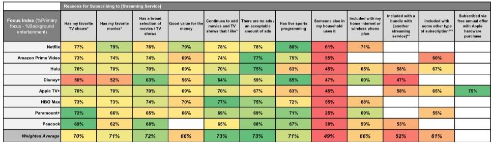
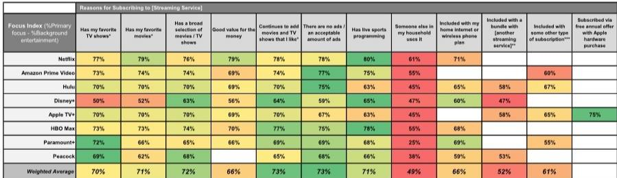

# 摩根斯坦利：MS：流媒体战争已结束，赢家不是靠内容取胜

美国消费者的流媒体订阅数量首次突破5个，日均观看时长接近3小时。但真正值得关注的信号不是总量的增长，而是用户行为正在发生结构性分化——少数平台正在吸收绝大多数注意力和付费意愿，而其他平台正被挤入“可随时取消”的备选名单。

MS最新发布的第16届年度流媒体调查，覆盖约3000名美国消费者，给出了一个清晰但反直觉的判断：流媒体的竞争格局已经不再是“内容军备竞赛”，而是进入了“注意力质量”的决胜阶段。报告核心发现是，亚马逊Prime Video、Netflix和谷歌旗下YouTube在用户渗透率、留存率和付费意愿上继续扩大领先优势，而Meta旗下的Facebook和Instagram Reels正在以惊人的速度抢占用户时间。

这份报告的价值不在于确认“头部平台很强”，而在于揭示了支撑这些平台优势的深层机制——用户与平台之间的交互模式差异，正在成为决定未来盈利能力和估值分化最关键的因素。

> **KC评论：** 多数投资者仍然在用“订阅用户数”和“内容预算”来衡量流媒体公司的价值。但MS这份调查表明，真正值得关注的是“用户打开平台时是否带着明确的目的”——这决定了广告变现效率、定价权以及用户流失风险。完整报告中包含大量关于用户行为模式的细分数据，这些数据对理解不同平台的真实竞争壁垒至关重要。

---

## 1. 用户时间总量在增长，但头部平台的份额增长更快

调查显示，美国平均每个家庭拥有5.4个流媒体服务（含免费），其中付费订阅从去年的3.1个增至3.2个。日均观看时长约3小时，年长用户群的观看时间更长。

但总量增长并不代表所有平台都能受益。亚马逊Prime Video渗透率同比上升264个基点至66%，Netflix上升352个基点至55%，YouTube上升476个基点至47%。这三家平台已经形成事实上的“流媒体基础设施”——用户订阅它们不是因为某个特定内容，而是因为“离不开”。

相比之下，Disney+和Hulu虽然也实现了100-200个基点的渗透率增长，分别达到36%和38%，但增速明显低于头部三强。Paramount+和HBO Max分别增长超过200个基点至28%和27%。

这个差距在用户留存数据上更为明显。Netflix在“最后取消”和“最先取消”的净得分中排名第一，达到+18分（36%用户将其列为最后取消，18%列为最先取消），YouTube Premium和亚马逊Prime Video紧随其后。而Starz、Crunchyroll和MGM+则处于净流出状态——用户更倾向于优先取消这些服务。

> **KC评论：** 渗透率数据本身并不足以判断竞争格局。真正有洞察力的指标是“净留存得分”——它衡量的是用户在多选订阅环境中的优先级排序。这份报告对每个平台的净留存得分做了详细拆解，并区分了广告版和无广告版的差异，这些数据在完整报告中以图表形式呈现，值得仔细研究。

---

## 2. Netflix的定价权比市场想象的要强

Netflix股价年初至今下跌约23%，市值从去年12月华纳兄弟探索交易宣布后蒸发超过1300亿美元。市场担忧集中在五个方面：用户增长放缓、缺乏突破性新内容、利润率扩张减速、AI定位不确定性以及并购折价。

但MS的调查给出了相反的证据。Netflix不仅净留存得分最高，在内容质量感知上也重新夺回领先地位——31%的受访者认为Netflix拥有“最佳原创内容”，同比上升360个基点，这是连续第二年增长。更关键的是，Netflix在“添加我喜欢的内容”和“内容选择广度”两个指标上均排名第一。

定价能力方面，调查显示用户普遍认为Netflix当前标准无广告版每月约20美元的价格“物超所值”，而价格需要涨到超过30美元/月才会被用户认为是“变贵了”并开始考虑是否继续订阅。这意味着Netflix在当前价格基础上仍有约50%的提价空间，而不会引发大规模用户流失。

Netflix用户的交互模式也与其他平台不同——用户更倾向于带着明确的目标打开Netflix（“目的地型使用”），在观看时注意力集中度最高。这种“高质量注意力”不仅提升了用户留存，也为广告变现提供了更好的基础。

---

## 3. 社交平台正在重新定义“电视”

调查中最令人意外的发现来自社交平台。Meta旗下的Instagram Reels和Facebook Reels，以及TikTok，在用户自报的娱乐使用时长上出现了超过1000个基点的同比增长。这些平台正在将短视频作为入口，逐步向长视频内容延伸，与传统电视和流媒体平台形成直接竞争。

MS在报告中特别指出，正在关注“微短剧”作为一个新兴类别，正在抢占年轻用户的更多时间。这一趋势对传统流媒体平台的威胁在于：用户注意力的碎片化正在改变“电视”的定义本身。

调查还显示，YouTube在用户观看时长份额上已经与Netflix相当，但两者的用户行为模式截然不同——YouTube更多被用于浏览和背景播放，而Netflix则对应着更高的专注度和目的性。这两种模式各有其商业价值，但变现效率和利润率差异显著。

> **KC评论：** 传统流媒体平台面临的真正竞争可能不是来自彼此，而是来自社交平台对用户注意力的重新分配。报告中对不同平台的“注意力质量”做了量化对比，包括专注指数和目的地指数，这些数据可以帮助投资者理解为什么YouTube和Netflix虽然用户时长接近，但商业模式和估值逻辑完全不同。

---

## 4. 超级服务合并：Paramount+与HBO Max的前景

MS对Paramount Global（PSKY）的增持评级，核心逻辑在于其将Paramount+和HBO Max合并为统一“超级服务”的能力。调查结果显示这一策略具有可行性：只有10%的现有HBO/Paramount+用户表示“非常不可能”或“不太可能”订阅新的超级服务，而40-50%的非用户表示愿意尝试。

两个平台目前的用户重叠率约为28%，与MS此前估计的25-30%基本一致。这意味着合并后的用户基数将具有显著的增量空间，而非简单的重复计算。

Paramount+和HBO Max在内容评价上各有优势——两者在“拥有用户最喜欢的电视节目”指标上得分最高，这为合并后的超级服务提供了差异化竞争力。

但合并的执行风险仍然存在。用户愿意尝试是一回事，能否将尝试转化为持续订阅并实现盈利是另一回事。报告没有完全展开的是：合并后的内容成本结构、广告变现协同效应以及用户迁移过程中的流失率。

---

## 5. 广告版订阅正在成为增量而非替代

调查显示，Netflix广告版的渗透率从去年的22%升至26%，而无广告版用户占比稳定在约30%。这一数据表明，广告版订阅主要吸引的是新用户或价格敏感型用户，而非无广告版用户的降级转换。

这一发现对行业意义重大。如果广告版订阅是增量而非替代，那么平台可以在不侵蚀ARPU的前提下扩大用户基数，同时获得广告收入的双重驱动。但前提是平台必须具备足够的广告库存和精准投放能力。

报告也指出，广告版用户的留存率普遍低于无广告版用户，这在意料之中——价格敏感型用户的忠诚度天然较低。但关键在于广告收入的增量能否覆盖较高的流失成本，这需要更详细的经济模型来验证。

---

## 6. 报告尚未完全回答的关键问题：体育直播的拐点何时到来

调查显示，超过60%的受访者经常在电视上观看体育直播，但这一比例同比下降了3个百分点至62%。付费电视用户的体育直播观看比例超过70%，但非付费电视用户中也有约30%的人经常观看体育直播。

迪士尼旗下的ESPN仍然是体育直播的绝对主导平台，占比31%，亚马逊以22%的份额位居第二（受益于NFL周四夜赛），Netflix从10%升至12%。

但报告没有深入讨论的是：体育直播的流媒体化是否会改变用户对付费电视的依赖？ESPN的流媒体版本ESPN Unlimited上线后对用户行为的具体影响如何？以及，当体育版权成本持续上升时，流媒体平台能否通过广告和订阅收入实现正的ROI？

这些问题对于理解迪士尼、亚马逊和Netflix在体育领域的长期竞争态势至关重要，但受限于调查数据的颗粒度，报告只给出了方向性判断，而非定量结论。

---

## 7. 投资者需要关注的新框架：从用户数量到注意力质量

这份报告最重要的贡献在于提出了一个评估流媒体平台的新框架——不再单纯关注用户数量或订阅增长，而是关注“注意力质量”的差异。

调查数据显示，用户打开平台时的意图（目的地型vs.浏览型）和观看时的专注程度（主要关注vs.背景播放），与平台的留存率和定价能力存在高度相关性。Netflix、Apple TV+和HBO Max的用户专注指数和目的地指数最高，而Disney+、YouTube和Peacock则更多被用于浏览和背景播放。

这一框架的实用性在于：它可以帮助投资者预测不同平台在广告变现效率、内容投资回报率和用户生命周期价值上的差异。高专注度、高目的性的平台，理论上能够支撑更高的广告单价和更强的定价权。

但这一框架目前仍处于描述性阶段，报告没有给出具体的量化模型来将“注意力质量”转化为财务预测。这可能是下一步研究的方向。

---

## 8. 如何利用这份报告构建自己的观察框架

对于关注流媒体行业的投资者和产业决策者，这份报告提供了几个可以持续跟踪的指标：

第一，关注净留存得分而非单纯的渗透率。渗透率反映的是用户基数，净留存得分反映的是用户优先级——后者更能预测用户流失风险和定价能力。

第二，区分“目的地型使用”和“浏览型使用”。前者对应更高的变现效率和更低的流失率，是平台长期价值的核心驱动因素。

第三，关注广告版订阅的增量效应而非替代效应。如果广告版用户主要来自新用户群体而非无广告版的降级，那么平台的双轮驱动模式是可持续的。

第四，密切跟踪社交平台对用户时间的侵蚀速度。短视频正在改变“电视”的定义，传统流媒体平台需要找到应对策略。

这些框架的验证需要持续的数据跟踪。MS的年度调查提供了跨年度的可比数据，但季度变化可能更为关键。

---

这份报告还有大量关于用户行为细分、不同平台的内容评价矩阵以及订阅决策驱动因素的详细数据，这些数据在完整报告中以图表形式呈现，对于深入理解竞争格局的演变至关重要。

我们每天会由AI agent加人工review的方式，生成国际投行中文摘要与KC评论，daily更新约10-40页，并整理当天最新数据图表合集，方便喂给AI，也方便人工快速把握market dynamics。欢迎来星球微信群继续讨论，一起跟踪这些关键指标的变化。

Personal reading notes and learning share only. Not investment advice.

