<table><tr><td colspan="2">MS TAIWAN LIMITED+</td></tr><tr><td colspan="2">Daniel Yen, CFA</td></tr><tr><td colspan="2">Equity Analyst</td></tr><tr><td>Daniel.Yen@morganstanley.com</td><td>+886 2 2730-2863</td></tr><tr><td colspan="2">Charlie Chan</td></tr><tr><td colspan="2">Equity Analyst</td></tr><tr><td>Charlie.Chan@morganstanley.com</td><td>+886 2 2730-1725</td></tr><tr><td colspan="2">MS ASIA LIMITED+</td></tr><tr><td colspan="2">Daisy Dai, CFA</td></tr><tr><td colspan="2">Equity Analyst</td></tr><tr><td>Daisy.Dai@morganstanley.com</td><td>+852 2848-7310</td></tr><tr><td colspan="2">MS TAIWAN LIMITED+</td></tr><tr><td colspan="2">Tiffany Yeh</td></tr><tr><td colspan="2">Equity Analyst</td></tr><tr><td>Tiffany.Yeh@morganstanley.com</td><td>+886 2 7712-3032</td></tr><tr><td colspan="2">MS ASIA LIMITED+</td></tr><tr><td colspan="2">Ethan Jia</td></tr><tr><td colspan="2">Research Associate</td></tr><tr><td>Ethan.Jia@morganstanley.com</td><td>+852 3963-2287</td></tr></table>

# Greater China Semiconductors | Asia Pacific

# Old Memory: Better to buy more

Unexpected persistent tightness in legacy memory supply is driving panicked purchasing by multiple enterprise customers. We reiterate our bullish view and raise PTs across our coverage.

## Key Takeaways

DDR4 buyers may build even larger demand buffers amid prolonged supply tightness.

\- MLC NAND shortages are forcing enterprise HDDs to use SLC NAND, indicating stronger demand.

■ NOR supply is increasingly concentrated among Taiwan vendors, given reduced output from the US.

DDR4 stronger orders from enterprise customers: We upgraded both Nanya Tech and Winbond back to OW on May 28 (link), given the ongoing tightness in DDR4. We now see enterprise customers securing supply as early as possible amid fears of shortages. Channel inventory remains low at under two weeks. This points to further DDR4 price increases into 4Q, following the double-digit monthly uptrend.

SLC NAND likely to see stronger demand from HDD: We noted that high-density SLC NAND can support datacenter eSSD (link). In addition, given the MLC NAND shortfall, enterprise HDDs are likely shifting to high-density SLC NAND. Enterprise HDDs previously used MLC NAND for firmware, hot data, and defect mapping. This shift reinforces continued pricing momentum into 4Q, following the 50–60% increase in 3Q.

NOR flash pricing increase led by Macronix, with potential supply–demand widening: We continue to see strong pricing increases from Macronix, driven by a shift toward NAND from NOR. We also see Micron reducing NOR supply into 2H, likely reallocating capacity to DRAM and NAND. At the same time, Vera Rubin rack ramp-up in 2H will require 50%+ higher NOR content versus Grace Blackwell racks. We therefore expect NOR pricing to rise 30–40% in 3Q and continue into 4Q.

Stock implications – we raise our earnings and PTs across the board: Winbond: PT raised to NT\$288; 2026/27/28 EPS raised by 4%/17%/24%. Nanya Tech: PT raised to NT\$550; 2026/27/28 EPS raised by 7%/15%/14%. Macronix: PT raised to NT\$220; 2026/27/28 EPS raised by 34%/20%/21%. GigaDevice: PT raised to Rmb888; 2026/27/28 EPS raised by 30%/46%/53%. PSMC: PT raised to NT\$111; 2026/27/28 EPS raised by 4%/48%/62%.

Asia Summer School 2026

<table><tr><td colspan="3">GREATER CHINA TECHNOLOGY SEMICONDUCTORS</td></tr><tr><td>Asia Pacific Industry View</td><td colspan="2">Attractive</td></tr><tr><td colspan="3">WHAT&#x27;S CHANGED</td></tr><tr><td>GigaDevice Semiconductor Beijing Inc (603986.SS)Price Target</td><td>FromRmb585.00</td><td>ToRmb888.00</td></tr><tr><td>Winbond Electronics Corp(2344.TW)Price Target</td><td>FromNT$222.00</td><td>ToNT$288.00</td></tr><tr><td>Nanya Technology Corp.(2408.TW)Price Target</td><td>FromNT$380.00</td><td>ToNT$550.00</td></tr><tr><td>Macronix International Co Ltd(2337.TW)Price Target</td><td>FromNT$202.00</td><td>ToNT$220.00</td></tr><tr><td>Powerchip Semiconductor Manufacturing Co (6770.TW)Price Target</td><td>FromNT$88.00</td><td>ToNT$111.00</td></tr></table>

MS does and seeks to do business with companies covered in MS. As a result, investors should be aware that the firm may have a conflict of interest that could affect the objectivity of MS. Investors should consider MS as only a single factor in making their investment decision.

## For analyst certification and other important disclosures, refer to the Disclosure Section, located at the end of this report.

+= Analysts employed by non-U.S. affiliates are not registered with FINRA, may not be associated persons of the member and may not be subject to FINRA restrictions on communications with a subject company, public appearances and trading securities held by a research analyst account.

## Key Charts and Exhibits

Exhibit 1: Order of preference: GC memory

<table><tr><td></td><td>Macronix2337.TW</td><td>Winbond2344.TW</td><td>AP Memory6531.TW</td><td>PSMC6770.TW</td><td>GigaDevice603986.SS</td><td>Nanya Tech2408.TW</td></tr><tr><td>Rating</td><td>Overweight</td><td>Overweight</td><td>Overweight</td><td>Overweight</td><td>Overweight</td><td>Overweight</td></tr><tr><td>Trading Currency</td><td>TWD</td><td>TWD</td><td>TWD</td><td>TWD</td><td>CNY</td><td>TWD</td></tr><tr><td>Price Target</td><td>220.0</td><td>288.0</td><td>1,555.0</td><td>111.0</td><td>888.0</td><td>550.0</td></tr><tr><td>Current Price (as of 2026/6/24)</td><td>172.0</td><td>205.0</td><td>1,115.0</td><td>85.7</td><td>705.1</td><td>443.5</td></tr><tr><td>Upside/(Downside) (%)</td><td>28%</td><td>40%</td><td>39%</td><td>30%</td><td>26%</td><td>24%</td></tr><tr><td>Market Cap (in USD mm)</td><td>9,780.7</td><td>26,999.2</td><td>5,685.1</td><td>11,308.3</td><td>69,101.7</td><td>43,068.6</td></tr><tr><td>Avg Daily Traded Vol (in USD mm)</td><td>264.9</td><td>478.6</td><td>79.2</td><td>256.3</td><td>1,346.6</td><td>647.1</td></tr><tr><td colspan="7">Street View: Ratings</td></tr><tr><td>Buy/Overweight</td><td>90%</td><td>100%</td><td>75%</td><td>67%</td><td>94%</td><td>86%</td></tr><tr><td>Hold/Equal-weight</td><td>0%</td><td>0%</td><td>25%</td><td>33%</td><td>6%</td><td>14%</td></tr><tr><td>Sell/Underweight</td><td>10%</td><td>0%</td><td>0%</td><td>0%</td><td>0%</td><td>0%</td></tr><tr><td>Bull Case Value</td><td>355.0</td><td>342.0</td><td>1,830.0</td><td>177.0</td><td>1,542.0</td><td>1,160.0</td></tr><tr><td>Upside (%)</td><td>106%</td><td>67%</td><td>64%</td><td>107%</td><td>119%</td><td>162%</td></tr><tr><td>Bear Case Value</td><td>130.0</td><td>118.0</td><td>620.0</td><td>55.0</td><td>648.0</td><td>305.0</td></tr><tr><td>Downside (%)</td><td>-24%</td><td>-42%</td><td>-44%</td><td>-36%</td><td>-8%</td><td>-31%</td></tr><tr><td>Risk/Reward Skew</td><td>4.4</td><td>1.6</td><td>1.4</td><td>3.0</td><td>14.7</td><td>5.2</td></tr><tr><td colspan="7">MS Estimates</td></tr><tr><td>FY26e</td><td>TWD</td><td>TWD</td><td>TWD</td><td>TWD</td><td>CNY</td><td>TWD</td></tr><tr><td>Sales</td><td>77,854</td><td>269,908</td><td>9,601</td><td>75,820</td><td>28,399</td><td>349,737</td></tr><tr><td>EBITDA</td><td>30,271</td><td>134,605</td><td>3,037</td><td>13,926</td><td>13,300</td><td>270,152</td></tr><tr><td>EBIT</td><td>22,733</td><td>118,994</td><td>2,976</td><td>6,362</td><td>13,050</td><td>257,966</td></tr><tr><td>EPS</td><td>9.84</td><td>21.27</td><td>17.65</td><td>4.80</td><td>16.68</td><td>65.56</td></tr><tr><td colspan="7">FY27e</td></tr><tr><td>Sales</td><td>143,216</td><td>432,740</td><td>17,829</td><td>102,954</td><td>46,298</td><td>524,965</td></tr><tr><td>EBITDA</td><td>64,657</td><td>234,811</td><td>6,491</td><td>38,229</td><td>23,646</td><td>391,551</td></tr><tr><td>EBIT</td><td>58,187</td><td>214,635</td><td>6,429</td><td>30,764</td><td>23,396</td><td>368,367</td></tr><tr><td>EPS</td><td>25.02</td><td>38.29</td><td>34.34</td><td>5.61</td><td>30.27</td><td>93.08</td></tr><tr><td colspan="7">FY26 MSe vs. Consensus Mean</td></tr><tr><td>Sales</td><td>-2.5%</td><td>9.2%</td><td>-3.0%</td><td>10.7%</td><td>56.8%</td><td>16.4%</td></tr><tr><td>EBITDA</td><td>-4.5%</td><td>-2.1%</td><td>-0.9%</td><td>-52.9%</td><td>77.7%</td><td>18.4%</td></tr><tr><td>EBIT</td><td>-20.7%</td><td>7.4%</td><td>3.8%</td><td>-74.4%</td><td>82.1%</td><td>19.8%</td></tr><tr><td>EPS</td><td>-26.0%</td><td>-0.1%</td><td>1.1%</td><td>-10.3%</td><td>88.0%</td><td>24.1%</td></tr><tr><td colspan="7">FY27 MSe vs. Consensus Mean</td></tr><tr><td>Sales</td><td>21.4%</td><td>25.7%</td><td>19.6%</td><td>20.7%</td><td>95.4%</td><td>26.7%</td></tr><tr><td>EBITDA</td><td>-4.5%</td><td>8.8%</td><td>26.0%</td><td>16.2%</td><td>148.3%</td><td>26.7%</td></tr><tr><td>EBIT</td><td>4.2%</td><td>34.2%</td><td>33.0%</td><td>30.6%</td><td>147.0%</td><td>25.8%</td></tr><tr><td>EPS</td><td>-9.7%</td><td>20.3%</td><td>27.0%</td><td>23.0%</td><td>167.2%</td><td>32.0%</td></tr><tr><td colspan="7">Valuation Multiples at Last Close</td></tr><tr><td colspan="7">FY26e</td></tr><tr><td>P/E</td><td>17.5x</td><td>9.6x</td><td>63.2x</td><td>17.8x</td><td>42.3x</td><td>6.8x</td></tr><tr><td>EV/EBIT</td><td>19.6x</td><td>10.3x</td><td>80.6x</td><td>44.1x</td><td>44.0x</td><td>7.4x</td></tr><tr><td>EV/EBITDA</td><td>11.9x</td><td>6.5x</td><td>53.5x</td><td>16.1x</td><td>34.0x</td><td>5.8x</td></tr><tr><td>EV/Sales</td><td>4.6x</td><td>3.2x</td><td>16.9x</td><td>3.0x</td><td>15.9x</td><td>4.5x</td></tr><tr><td>FCF Yield</td><td>-11.9%</td><td>2.9%</td><td>1.2%</td><td>28.6%</td><td>2.0%</td><td>-18.1%</td></tr><tr><td colspan="7">FY27e</td></tr><tr><td>P/E</td><td>6.9x</td><td>5.4x</td><td>32.5x</td><td>15.3x</td><td>23.3x</td><td>4.8x</td></tr><tr><td>EV/EBIT</td><td>5.3x</td><td>3.3x</td><td>24.9x</td><td>5.6x</td><td>18.7x</td><td>3.6x</td></tr><tr><td>EV/EBITDA</td><td>4.8x</td><td>3.0x</td><td>24.7x</td><td>4.5x</td><td>18.5x</td><td>3.3x</td></tr><tr><td>EV/Sales</td><td>2.2x</td><td>1.6x</td><td>9.0x</td><td>1.7x</td><td>9.5x</td><td>2.5x</td></tr><tr><td>FCF Yield</td><td>17.5%</td><td>18.9%</td><td>2.2%</td><td>16.2%</td><td>3.9%</td><td>19.3%</td></tr><tr><td colspan="7">Implied Multiples on MS Price Target</td></tr><tr><td colspan="7">FY26e</td></tr><tr><td>P/E</td><td>22.4x</td><td>13.5x</td><td>88.1x</td><td>23.1x</td><td>53.2x</td><td>8.4x</td></tr><tr><td>EV/EBIT</td><td>19.6x</td><td>10.3x</td><td>80.6x</td><td>44.1x</td><td>44.0x</td><td>7.4x</td></tr><tr><td>EV/EBITDA</td><td>14.8x</td><td>9.1x</td><td>79.0x</td><td>20.1x</td><td>43.2x</td><td>7.0x</td></tr><tr><td>EV/Sales</td><td>5.7x</td><td>4.5x</td><td>25.0x</td><td>3.7x</td><td>20.2x</td><td>5.4x</td></tr><tr><td colspan="7">FY27e</td></tr><tr><td>P/E</td><td>8.8x</td><td>7.5x</td><td>45.3x</td><td>19.8x</td><td>29.3x</td><td>5.9x</td></tr><tr><td>EV/EBIT</td><td>7.0x</td><td>5.7x</td><td>40.0x</td><td>15.5x</td><td>28.3x</td><td>4.7x</td></tr><tr><td>EV/EBITDA</td><td>6.3x</td><td>5.2x</td><td>39.7x</td><td>12.5x</td><td>28.0x</td><td>4.4x</td></tr><tr><td>EV/Sales</td><td>2.8x</td><td>2.8x</td><td>14.4x</td><td>4.6x</td><td>14.3x</td><td>3.3x</td></tr></table>

Source: FactSet (consensus mean), MS (e) estimates.

Exhibit 2: NOR flash demand and supply growth rates  
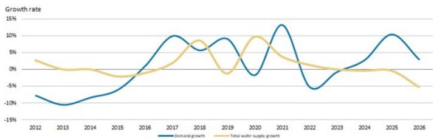  
Source: Company data, MS

Exhibit 3: NOR flash demand growth and supply growth by  
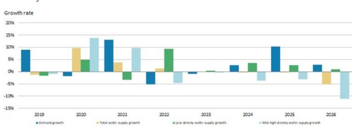  
Source: Company data, MS

Exhibit 4: DDR4 quarterly supply and demand summary  
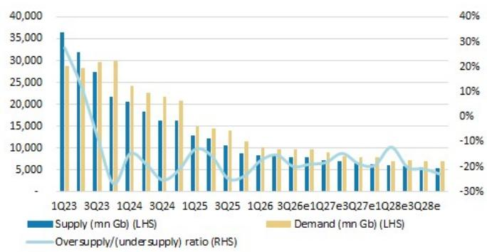  
Source: Company data, IDC, MS (e) estimates

Exhibit 5: Quarterly oversupply/undersupply ratio vs. Nanya and Winbond pricing Q/Q change  
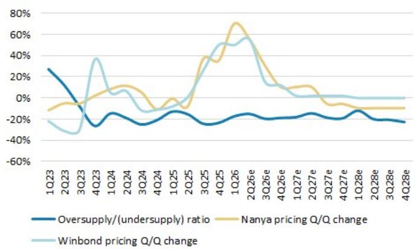  
Source: Company data, IDC, MS (e) estimates

Exhibit 6: Quarterly supply breakdown (mn Gb)  
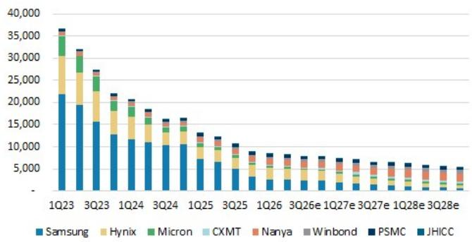  
Source: Company data, MS (e) estimates

Exhibit 7: Quarterly demand breakdown by product (mn Gb)  
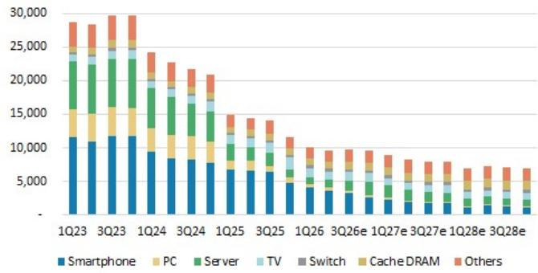  
Source: IDC, MS (e) estimates

Exhibit 8: DDR4 8Gb (1Gx8) pricing chart  
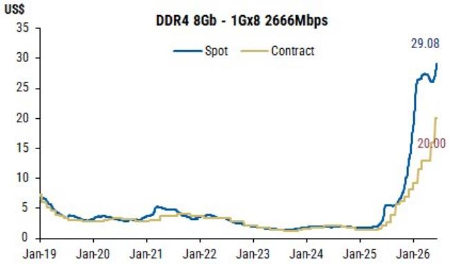  
Source: DRAMeXchange, MS. Data as of Jun 2026.

Exhibit 9: DDR5 16Gb (2Gx8) pricing chart  
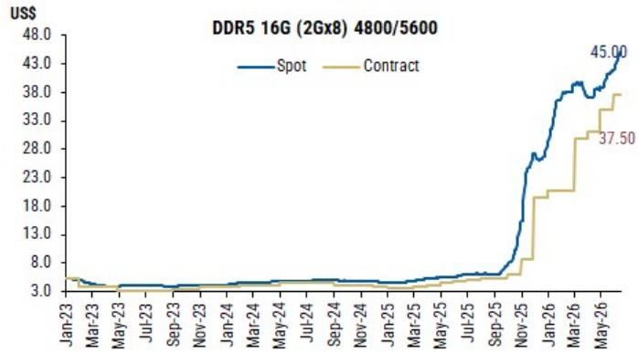  
Source: DRAMeXchange, MS. Data as of Jun 2026.

# Winbond: Estimate Revisions and Quarterly Financials

We raise our 2026/27/28 EPS estimates by 4%/17%/24% respectively. This reflects stronger than previously expected memory pricing strength across DDR4, NOR flash, and SLC NAND. We now expect DDR4 pricing to rise further into 4Q, post the double digit monthly pricing uptrend. SLC NAND pricing uptrend is highly likely to continue into 4Q, post 50-60% hike in 3Q. NOR pricing could be hiked by 30-40% in 3Q and even into 4Q.

Exhibit 10: Winbond: Estimate revisions

<table><tr><td>NT$ mn</td><td>New &#x27;26E</td><td>Old &#x27;26E</td><td>Diff.</td><td>New &#x27;27E</td><td>Old &#x27;27E</td><td>Diff.</td><td>New &#x27;28E</td><td>Old &#x27;28E</td><td>Diff.</td></tr><tr><td>Net sales</td><td>269,908</td><td>258,581</td><td>4%</td><td>432,740</td><td>377,335</td><td>15%</td><td>493,598</td><td>410,515</td><td>20%</td></tr><tr><td>COGS</td><td>(117,684)</td><td>(111,702)</td><td></td><td>(182,017)</td><td>(158,768)</td><td></td><td>(211,407)</td><td>(178,012)</td><td></td></tr><tr><td>Gross profit</td><td>152,224</td><td>146,879</td><td>4%</td><td>250,723</td><td>218,567</td><td>15%</td><td>282,192</td><td>232,503</td><td>21%</td></tr><tr><td>Operating expenses</td><td>(33,230)</td><td>(33,028)</td><td></td><td>(36,088)</td><td>(35,211)</td><td></td><td>(37,465)</td><td>(36,149)</td><td></td></tr><tr><td>Operating profit</td><td>118,994</td><td>113,852</td><td>5%</td><td>214,635</td><td>183,356</td><td>17%</td><td>244,727</td><td>196,354</td><td>25%</td></tr><tr><td>Non-op. income (exp)</td><td>715</td><td>715</td><td></td><td>776</td><td>776</td><td></td><td>756</td><td>756</td><td></td></tr><tr><td>Pretax Income</td><td>119,709</td><td>114,567</td><td>4%</td><td>215,411</td><td>184,133</td><td>17%</td><td>245,483</td><td>197,111</td><td>25%</td></tr><tr><td>Taxes</td><td>(23,975)</td><td>(22,946)</td><td></td><td>(43,082)</td><td>(36,827)</td><td></td><td>(50,284)</td><td>(40,609)</td><td></td></tr><tr><td>Net income</td><td>95,721</td><td>91,607</td><td>4%</td><td>172,315</td><td>147,293</td><td>17%</td><td>195,186</td><td>156,488</td><td>25%</td></tr><tr><td>Reported EPS</td><td>21.27</td><td>20.36</td><td>4%</td><td>38.29</td><td>32.73</td><td>17%</td><td>44.69</td><td>36.09</td><td>24%</td></tr><tr><td colspan="10">Margins</td></tr><tr><td>Gross margin</td><td>56.4%</td><td>56.8%</td><td>-0.4 ppt</td><td>57.9%</td><td>57.9%</td><td>0.0 ppt</td><td>57.2%</td><td>56.6%</td><td>0.5 ppt</td></tr><tr><td>Operating margin</td><td>44.1%</td><td>44.0%</td><td>0.1 ppt</td><td>49.6%</td><td>48.6%</td><td>1.0 ppt</td><td>49.6%</td><td>47.8%</td><td>1.7 ppt</td></tr><tr><td>Pretax margin</td><td>44.4%</td><td>44.3%</td><td>0.0 ppt</td><td>49.8%</td><td>48.8%</td><td>1.0 ppt</td><td>49.7%</td><td>48.0%</td><td>1.7 ppt</td></tr><tr><td>Net margin</td><td>35.5%</td><td>35.4%</td><td>0.0 ppt</td><td>39.8%</td><td>39.0%</td><td>0.8 ppt</td><td>39.5%</td><td>38.1%</td><td>1.4 ppt</td></tr><tr><td>Opex %</td><td>12.3%</td><td>12.8%</td><td>-0.5 ppt</td><td>8.3%</td><td>9.3%</td><td>-1.0 ppt</td><td>7.6%</td><td>8.8%</td><td>-1.2 ppt</td></tr></table>

<table><tr><td>NT$</td><td>New &#x27;26E</td><td>Old &#x27;26E</td><td>Diff.</td><td>New &#x27;27E</td><td>Old &#x27;27E</td><td>Diff.</td><td>New &#x27;28E</td><td>Old &#x27;28E</td><td>Diff.</td></tr><tr><td>BVPS</td><td>46.68</td><td>40.54</td><td>15%</td><td>85.02</td><td>73.32</td><td>16%</td><td>129.77</td><td>82.20</td><td>58%</td></tr></table>

Source: MS (E) estimates

Exhibit 11: Winbond: Quarterly financials

<table><tr><td>NT$ in million</td><td>4Q25</td><td>2Q25</td><td>3Q25</td><td>4Q25</td><td>1Q26</td><td>2Q26E</td><td>3Q26E</td><td>4Q26E</td><td>1Q27E</td><td>2Q27E</td><td>3Q27E</td><td>4Q27E</td><td>1Q28E</td><td>2Q28E</td><td>3Q28E</td><td>4Q28E</td><td>2025</td><td>2026E</td><td>2027E</td><td>2028E</td></tr><tr><td>Total Revenues</td><td>19,993</td><td>21,018</td><td>21,771</td><td>26,625</td><td>38,253</td><td>57,075</td><td>77,583</td><td>96,997</td><td>#######</td><td>#######</td><td>#######</td><td>#######</td><td>#######</td><td>#######</td><td>#######</td><td>#######</td><td>89,406</td><td>269,908</td><td>432,740</td><td>493,598</td></tr><tr><td>Sequential Change</td><td>7.0%</td><td>5.1%</td><td>3.6%</td><td>2.3%</td><td>25.9%</td><td>49.2%</td><td>43.7%</td><td>49.2%</td><td>5.6%</td><td>5.0%</td><td>2.4%</td><td>2.5%</td><td>5.5%</td><td>5.5%</td><td>5.5%</td><td>5.5%</td><td></td><td></td><td></td><td></td></tr><tr><td>Change vs Year Ago</td><td>-0.6%</td><td>-2.2%</td><td>2.1%</td><td>42.4%</td><td>91.3%</td><td>171.6%</td><td>256.4%</td><td>264.3%</td><td>164.0%</td><td>84.3%</td><td>42.0%</td><td>20.0%</td><td>18.7%</td><td>16.7%</td><td>13.1%</td><td>8.6%</td><td>9.6%</td><td>201.9%</td><td>60.3%</td><td>14.1%</td></tr><tr><td>Cost of Sales</td><td>(14,871)</td><td>(16,255)</td><td>(11,605)</td><td>(15,479)</td><td>(17,838)</td><td>(25,385)</td><td>(33,251)</td><td>(41,211)</td><td>(42,310)</td><td>(44,062)</td><td>(46,471)</td><td>(49,174)</td><td>(49,360)</td><td>(50,707)</td><td>(52,108)</td><td>(53,297)</td><td>(58,210)</td><td>(117,664)</td><td>(182,017)</td><td>(211,407)</td></tr><tr><td>Percent of Revenues</td><td>74.4%</td><td>77.3%</td><td>53.3%</td><td>58.1%</td><td>46.6%</td><td>44.5%</td><td>42.9%</td><td>42.5%</td><td>41.9%</td><td>41.9%</td><td>42.2%</td><td>42.3%</td><td>41.2%</td><td>41.3%</td><td>41.8%</td><td>42.2%</td><td>65.1%</td><td>43.6%</td><td>42.1%</td><td>42.8%</td></tr><tr><td>Gross Margin</td><td>5,122</td><td>4,763</td><td>10,166</td><td>11,146</td><td>20,415</td><td>31,690</td><td>44,332</td><td>55,787</td><td>58,685</td><td>61,132</td><td>63,694</td><td>67,212</td><td>70,526</td><td>72,011</td><td>72,454</td><td>73,142</td><td>31,196</td><td>152,224</td><td>250,723</td><td>282,192</td></tr><tr><td>Percent of Revenues</td><td>25.6%</td><td>22.7%</td><td>46.7%</td><td>51.9%</td><td>53.4%</td><td>55.5%</td><td>57.1%</td><td>55.5%</td><td>58.1%</td><td>58.1%</td><td>56.4%</td><td>56.4%</td><td>55.8%</td><td>58.7%</td><td>58.2%</td><td>57.8%</td><td>34.9%</td><td>56.4%</td><td>57.9%</td><td>59.7%</td></tr><tr><td>Total Opex</td><td>(6,087)</td><td>(6,058)</td><td>(6,463)</td><td>(7,054)</td><td>(7,865)</td><td>(7,967)</td><td>(8,493)</td><td>(8,905)</td><td>(8,718)</td><td>(8,870)</td><td>(9,149)</td><td>(9,351)</td><td>(9,369)</td><td>(9,375)</td><td>(9,365)</td><td>(9,356)</td><td>(25,662)</td><td>(33,230)</td><td>(36,088)</td><td>(37,465)</td></tr><tr><td>Percent of Revenues</td><td>30.4%</td><td>28.8%</td><td>29.7%</td><td>26.5%</td><td>20.6%</td><td>14.0%</td><td>10.9%</td><td>9.2%</td><td>8.6%</td><td>8.4%</td><td>8.3%</td><td>8.0%</td><td>7.8%</td><td>7.6%</td><td>7.5%</td><td>7.4%</td><td>28.7%</td><td>12.3%</td><td>8.3%</td><td>7.6%</td></tr><tr><td>Operating Income</td><td>(965)</td><td>(1,295)</td><td>3,703</td><td>4,092</td><td>12,550</td><td>23,723</td><td>35,840</td><td>46,881</td><td>49,967</td><td>52,262</td><td>54,545</td><td>57,861</td><td>61,151</td><td>62,636</td><td>63,089</td><td>63,787</td><td>5,534</td><td>118,994</td><td>214,635</td><td>244,727</td></tr><tr><td>Percent of Revenues</td><td>-4.8%</td><td>-6.2%</td><td>17.0%</td><td>15.4%</td><td>32.8%</td><td>41.6%</td><td>46.2%</td><td>48.3%</td><td>49.5%</td><td>49.7%</td><td>49.5%</td><td>49.7%</td><td>51.0%</td><td>51.0%</td><td>50.6%</td><td>50.4%</td><td>6.2%</td><td>44.1%</td><td>49.6%</td><td>49.6%</td></tr><tr><td>Total Non-operating Income(Loss)</td><td>(180)</td><td>(524)</td><td>(145)</td><td>(75)</td><td>138</td><td>199</td><td>189</td><td>189</td><td>199</td><td>199</td><td>189</td><td>189</td><td>189</td><td>189</td><td>189</td><td>189</td><td>(924)</td><td>715</td><td>776</td><td>756</td></tr><tr><td>Profit Before Taxes</td><td>(1,146)</td><td>(1,819)</td><td>3,558</td><td>4,017</td><td>12,688</td><td>23,922</td><td>36,029</td><td>47,071</td><td>50,166</td><td>52,461</td><td>54,734</td><td>58,050</td><td>61,340</td><td>62,825</td><td>63,278</td><td>63,976</td><td>4,610</td><td>119,709</td><td>215,411</td><td>245,483</td></tr><tr><td>Percent of Revenues</td><td>-5.7%</td><td>-8.7%</td><td>-6.3%</td><td>15.1%</td><td>33.2%</td><td>41.9%</td><td>45.4%</td><td>48.5%</td><td>50.1%</td><td>49.1%</td><td>57.7%</td><td>49.2%</td><td>53.8%</td><td>51.2%</td><td>50.8%</td><td>50.6%</td><td>5.2%</td><td>54.4%</td><td>54.4%</td><td>54.4%</td></tr><tr><td>Taxes</td><td>159</td><td>188</td><td>(857)</td><td>(922)</td><td>(2,571)</td><td>(4,784)</td><td>(7,206)</td><td>(9,414)</td><td>(10,033)</td><td>(10,492)</td><td>(10,947)</td><td>(11,610)</td><td>(12,268)</td><td>(12,565)</td><td>(12,656)</td><td>(12,795)</td><td>(1,433)</td><td>(23,975)</td><td>(43,082)</td><td>(50,284)</td></tr><tr><td>Tax Rate</td><td>13.9%</td><td>10.3%</td><td>24.1%</td><td>23.0%</td><td>20.3%</td><td>20.0%</td><td>20.0%</td><td>20.0%</td><td>20.0%</td><td>20.0%</td><td>20.0%</td><td>20.0%</td><td>20.0%</td><td>20.0%</td><td>20.0%</td><td>20.0%</td><td>31.1%</td><td>20.0%</td><td>20.0%</td><td>20.5%</td></tr><tr><td>Reported Income (TW GAAP)</td><td>(1,091)</td><td>(1,312)</td><td>2,943</td><td>3,422</td><td>10,114</td><td>19,134</td><td>28,820</td><td>37,653</td><td>40,129</td><td>41,965</td><td>43,784</td><td>46,436</td><td>49,069</td><td>50,257</td><td>50,619</td><td>51,177</td><td>3,962</td><td>95,721</td><td>172,315</td><td>195,186</td></tr><tr><td>Percent of Revenues</td><td>-5.5%</td><td>-6.2%</td><td>13.5%</td><td>12.9%</td><td>26.4%</td><td>33.5%</td><td>37.1%</td><td>38.8%</td><td>39.7%</td><td>39.9%</td><td>39.7%</td><td>39.9%</td><td>40.9%</td><td>41.0%</td><td>40.6%</td><td>40.5%</td><td>4.4%</td><td>35.5%</td><td>39.8%</td><td>39.5%</td></tr><tr><td>Change vs Year Ago</td><td>135.0%</td><td>N.A.</td><td>N.A.</td><td>N.A.</td><td>N.A.</td><td>0.0%</td><td>N.A.</td><td>N.A.</td><td>296.8%</td><td>111.3%</td><td>51.9%</td><td>23.3%</td><td>22.3%</td><td>19.8%</td><td>15.6%</td><td>10.2%</td><td>559.2%</td><td>2316.0%</td><td>30.0%</td><td>13.3%</td></tr><tr><td>Reported EPS (NTS, TW GAAP)</td><td>(0.24)</td><td>(0.29)</td><td>0.65</td><td>0.76</td><td>2.25</td><td>4.25</td><td>6.40</td><td>8.37</td><td>8.92</td><td>9.33</td><td>9.73</td><td>10.32</td><td>10.90</td><td>11.17</td><td>11.25</td><td>11.37</td><td>0.88</td><td>21.27</td><td>38.29</td><td>44.69</td></tr><tr><td>Sequential Change</td><td>61%</td><td>20%</td><td>-324%</td><td>16%</td><td>196%</td><td>89%</td><td>51%</td><td>31%</td><td>5%</td><td>5%</td><td>4%</td><td>6%</td><td>2%</td><td>1%</td><td>1%</td><td></td><td>493.9%</td><td>2316.0%</td><td>80.0%</td><td>16.7%</td></tr><tr><td>Change vs Year Ago</td><td>-118%</td><td>N.A.</td><td>N.A.</td><td>N.A.</td><td>N.A.</td><td>0%</td><td>879%</td><td>1000%</td><td>297%</td><td>119%</td><td>52%</td><td>23%</td><td>22%</td><td>20%</td><td>16%</td><td>10%</td><td></td><td></td><td></td><td></td></tr></table>

Source: Company data, MS (E) estimates

## Winbond: Valuation Methodology

We raise our PT to NT\$288 from NT\$222: We continue to apply P/B multiple methodology to derive our price target, in line with our approach for Greater China memory IDM peers and in view of the industry's high earnings volatility. Our new price target (base case scenario value) implies 6.2x 2026e BVPS and 3.4x 2027e BVPS vs. our prior target multiple of 5.5x 2026e BVPS, as we think DDR4 pricing strength and SLC NAND/SiCap opportunities could drive re-rating. We raise our bull case value to NT\$342 (7.3x our 2026e BVPS) and our bear case value to NT\$118 (2.5x our 2026e BVPS).

Exhibit 12: Winbond: Historical forward P/B  
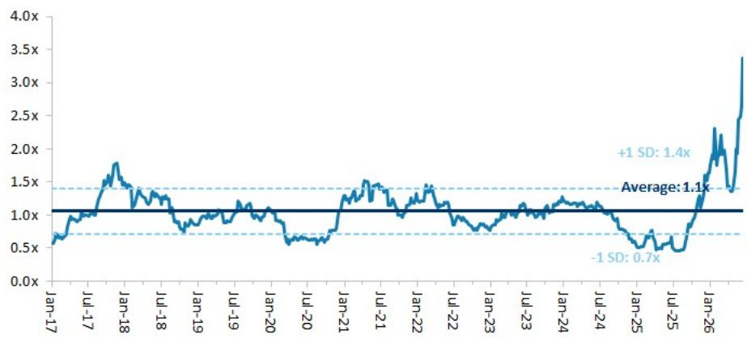  
Source: Company data, MS estimates

Exhibit 13: Winbond: Historical forward P/B vs ROE  
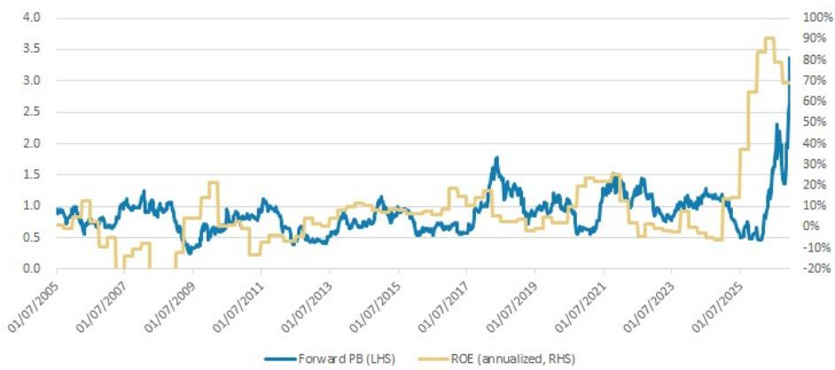  
Source: Company data, MS estimates

Exhibit 14: Winbond: Earnings estimate revision breadth  
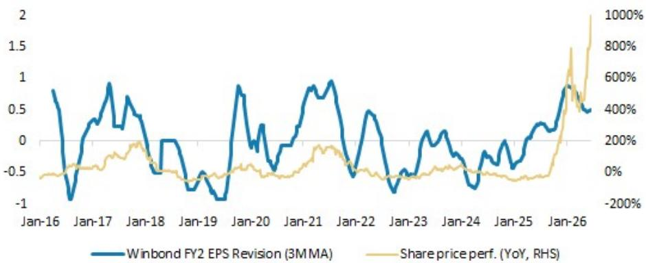  
Source: Company data, MS estimates

## Risk Reward – Winbond Electronics Corp (2344.TW)

DDR, NOR and SLC NAND pricing upside; long-term opportunities in CUBE

## PRICE TARGET NT\$288.00

Base case, 6.2x 2026e P/B. This method is in line with the approach we adopt for Greater China memory IDM peers, in view of the industry's high volatility. We believe the stock merits a multiple beyond the high end of its historical band of 0.5-1.5x since 2017, as we are seeing DRAM pricing upside, a sustainable NOR price hike, and opportunities in SLC NAND and SiCap foundry business.

## Consensus Price Target Distribution

Source: Refinitiv, MS

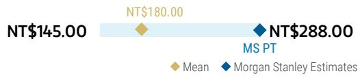

## RISK REWARD CHART

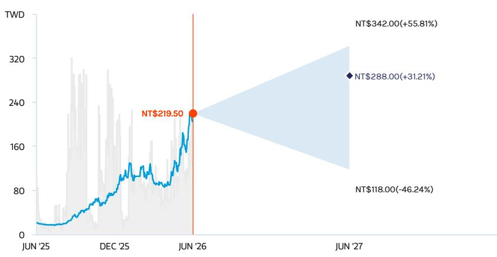  
Key: — Historical Stock Performance ● Current Stock Price ◆ Price Target  
Source: Refinitiv, MS

## OVERWEIGHT THESIS

\- We expect DDR3 and DDR4 price increases to continue in 2026. The supply/demand gap should widen into 2H26.
- We see NOR price hikes continuing throughout 2026.
- High density SLC NAND pricing is catching up, and we now expect a larger TAM from data center applications.
- We share management's view that CUBE could be meaningful in 2026, given engagement with multiple foundry partners and customers.
- We see potential for several headwinds ahead for the logic business.
- Our PT implies 3.4x 2027e P/B.

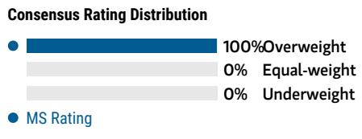  
Source: Refinitiv, MS

## Risk Reward Themes

## BULL CASE

## 7.3x 2026e BVPS

## NT\$342.00

NOR Flash pricing and DRAM prices rebound more in the next 12 months: NOR Flash rises dramatically. DRAM prices continue to rise drastically within the next 12 months, with 25nm accounting for >80% of sales.

## BASE CASE

## NT\$288.00

## 6.2x 2026e BVPS

Margin expansion benefiting from the memory up-cycle: 1) NOR Flash pricing rises significantly in the next 12 months; and 2) DRAM prices rise significantly in the next 12 months.

## BEAR CASE

## NT\$118.00

## 2.5x 2026e BVPS

NOR Flash prices face pressure in the next 12 months; DRAM market back to oversupply, with slower technology migration: 1) NOR Flash shows price declines; and 2) DRAM prices drop in the next 12 months.

## Risk Reward – Winbond Electronics Corp (2344.TW)

## KEY EARNINGS INPUTS

<table><tr><td>Drivers</td><td>Dec 2025</td><td>Dec 2026e</td><td>Dec 2027e</td><td>Dec 2028e</td></tr><tr><td>NOR ASP (%)</td><td>8</td><td>113</td><td>34</td><td>0</td></tr><tr><td>DRAM ASP (%)</td><td>(2)</td><td>258</td><td>34</td><td>10</td></tr><tr><td>Mobile RAM sales (NT$, mn)</td><td>5,302</td><td>21,486</td><td>36,103</td><td>40,921</td></tr><tr><td>DRAM sales (NT$, mn)</td><td>27,808</td><td>166,338</td><td>293,379</td><td>346,905</td></tr><tr><td>Flash sales (NT$, mn)</td><td>31,106</td><td>72,390</td><td>107,769</td><td>107,769</td></tr></table>

## INVESTMENT DRIVERS

\- DRAM pricing

\- NOR pricing

\- Technology migration

## GLOBAL REVENUE EXPOSURE

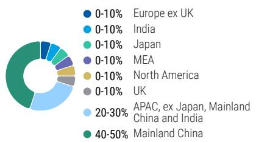

Source: MS Estimate View explanation of regional hierarchies here

## MS ALPHA MODELS

1/5 MOST 3 Month Horizon

Source: Refinitiv, FactSet, MS; 1 is the highest favored Quintile and 5 is the least favored Quintile

## RISKS TO PT/RATING

## RISKS TO UPSIDE

\- NOR Flash pricing increase, driven by stronger-than-expected demand

\- Stronger-than-expected DRAM pricing given ongoing supply shortage

\- Faster-than-expected SLC NAND development

## RISKS TO DOWNSIDE

\- NOR Flash downcycle, driven by weaker demand

\- Lower-than-expected DRAM pricing given ongoing oversupply

\- Slower-than-expected SLC NAND development

## OWNERSHIP POSITIONING

<table><tr><td>Inst. Owners, % Active</td><td>58.8%</td></tr></table>

Source: Refinitiv, MS

MS ESTIMATES VS. CONSENSUS  
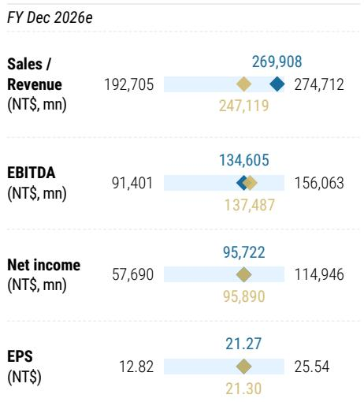  
Mean MS Estimates Source: Refinitiv, MS

## Winbond: Financial Summary

Exhibit 15: Financial summary  
Income Statement

<table><tr><td>NT$mn (Years End Dec )</td><td>2025</td><td>2026E</td><td>2027E</td><td>2028E</td></tr><tr><td>Net sales</td><td>89,406</td><td>269,308</td><td>432,740</td><td>493,598</td></tr><tr><td>COGS</td><td>(58,210)</td><td>(117,684)</td><td>(182,017)</td><td>(211,407)</td></tr><tr><td>Depreciation Expense</td><td>(12,683)</td><td>(15,219)</td><td>(19,785)</td><td>(25,721)</td></tr><tr><td>Variable Cost</td><td>(26,224)</td><td>(83,527)</td><td>(143,298)</td><td>(162,418)</td></tr><tr><td>Gross profit</td><td>31,196</td><td>152,224</td><td>250,723</td><td>282,192</td></tr><tr><td>Operating expenses</td><td>(25,662)</td><td>(33,230)</td><td>(36,088)</td><td>(37,465)</td></tr><tr><td>Operating income</td><td>5,534</td><td>118,994</td><td>214,635</td><td>244,727</td></tr><tr><td>Non-operating income</td><td>(324)</td><td>715</td><td>776</td><td>756</td></tr><tr><td>Pre-tax income</td><td>4,610</td><td>119,709</td><td>215,411</td><td>245,483</td></tr><tr><td>Income tax</td><td>(649)</td><td>(23,988)</td><td>(43,096)</td><td>(50,297)</td></tr><tr><td>Reported net Income</td><td>3,962</td><td>95,721</td><td>172,315</td><td>195,186</td></tr><tr><td>Adj wtd. avg. shrs( m)</td><td>4,500</td><td>4,500</td><td>4,500</td><td>4,500</td></tr><tr><td>Reported EPS (NT$)</td><td>0.88</td><td>21.27</td><td>38.29</td><td>44.69</td></tr><tr><td>Model are EPS (NT$)</td><td>0.88</td><td>21.27</td><td>38.29</td><td>44.69</td></tr></table>

Cash Flow Statement

Balance Sheet

<table><tr><td>NT$mn (Years End Dec )</td><td>2025</td><td>2026E</td><td>2027E</td><td>2028E</td></tr><tr><td>Cash</td><td>15,734</td><td>40,355</td><td>202,411</td><td>413,030</td></tr><tr><td>Mkt Securities</td><td>13,347</td><td>13,347</td><td>13,347</td><td>13,347</td></tr><tr><td>AR/NR</td><td>16,071</td><td>56,043</td><td>67,245</td><td>73,054</td></tr><tr><td>Inventory</td><td>25,758</td><td>104,435</td><td>125,310</td><td>136,134</td></tr><tr><td>Other</td><td>2,281</td><td>2,281</td><td>2,281</td><td>2,281</td></tr><tr><td>Current Assets</td><td>73,191</td><td>216,461</td><td>410,534</td><td>637,847</td></tr><tr><td>Long-term investments</td><td>19,266</td><td>19,216</td><td>19,156</td><td>19,116</td></tr><tr><td>Fixed assets</td><td>93,800</td><td>88,581</td><td>78,796</td><td>59,010</td></tr><tr><td>Other assets</td><td>5,935</td><td>5,935</td><td>5,935</td><td>5,935</td></tr><tr><td>Total Assets</td><td>192,192</td><td>330,193</td><td>514,481</td><td>721,909</td></tr><tr><td>S/T borrowings</td><td>2,739</td><td>2,739</td><td>2,739</td><td>2,739</td></tr><tr><td>AP/NP</td><td>8,224</td><td>28,428</td><td>33,921</td><td>36,765</td></tr><tr><td>Other ST liabilities</td><td>35,652</td><td>57,506</td><td>63,764</td><td>67,003</td></tr><tr><td>LT debt</td><td>26,399</td><td>26,399</td><td>26,399</td><td>26,399</td></tr><tr><td>Other LT liabilities</td><td>5,048</td><td>5,048</td><td>5,048</td><td>5,048</td></tr><tr><td>Total Liabilities</td><td>78,062</td><td>120,120</td><td>131,871</td><td>137,955</td></tr><tr><td>Common stocks</td><td>45,000</td><td>45,000</td><td>45,000</td><td>45,000</td></tr><tr><td>Preferred stocks</td><td>0</td><td>0</td><td>0</td><td>0</td></tr><tr><td>Capital Reserve</td><td>13,752</td><td>13,752</td><td>13,752</td><td>13,752</td></tr><tr><td>Retained earning</td><td>49,184</td><td>145,127</td><td>317,664</td><td>519,008</td></tr><tr><td>Other shareholders&#x27; equity</td><td>0</td><td>0</td><td>0</td><td>0</td></tr><tr><td>Total Equity</td><td>114,130</td><td>210,073</td><td>382,610</td><td>583,954</td></tr><tr><td>Total Liab. &amp; Shrhldr&#x27;s Equity</td><td>192,192</td><td>330,193</td><td>514,481</td><td>721,909</td></tr><tr><td>BVPS</td><td>25.4</td><td>46.7</td><td>85.0</td><td>129.8</td></tr></table>

<table><tr><td>NT$mn (Years End Dec )</td><td>2025</td><td>2026E</td><td>2027E</td><td>2028E</td></tr><tr><td>Cashflow from Operations</td><td>11,183</td><td>43,378</td><td>180,812</td><td>219,376</td></tr><tr><td>Net profits</td><td>3,177</td><td>95,721</td><td>172,315</td><td>201,121</td></tr><tr><td>Depreciation</td><td>12,308</td><td>15,219</td><td>19,785</td><td>19,785</td></tr><tr><td>Working Capital Change</td><td>(3,909)</td><td>(98,444)</td><td>(26,584)</td><td>(13,789)</td></tr><tr><td>Other adjustments</td><td>(394)</td><td>30,882</td><td>15,296</td><td>12,258</td></tr><tr><td>Cashflow from Investing</td><td>(7,658)</td><td>(18,132)</td><td>(10,331)</td><td>9,649</td></tr><tr><td>Capex</td><td>(5,296)</td><td>(10,000)</td><td>(10,000)</td><td>(10,000)</td></tr><tr><td>Change of LT Investment</td><td>0</td><td>0</td><td>0</td><td>0</td></tr><tr><td>Change of ST Investment</td><td>(971)</td><td>0</td><td>0</td><td>0</td></tr><tr><td>Other adjustments</td><td>(1,391)</td><td>(8,132)</td><td>(331)</td><td>19,649</td></tr><tr><td>Cashflow from financing</td><td>(1,561)</td><td>(625)</td><td>(8,425)</td><td>(18,405)</td></tr><tr><td>Increase in L/T debt</td><td>(1,698)</td><td>0</td><td>0</td><td>0</td></tr><tr><td>Increase in S/T debt</td><td>777</td><td>0</td><td>0</td><td>0</td></tr><tr><td>Cash Dividend Paid</td><td>0</td><td>0</td><td>0</td><td>0</td></tr><tr><td>Dir&amp; Emp Bonus Paid</td><td>0</td><td>0</td><td>0</td><td>0</td></tr><tr><td>Other adjustments</td><td>(640)</td><td>(625)</td><td>(8,425)</td><td>(18,405)</td></tr><tr><td>Exchange rate adjustment</td><td>(330)</td><td>0</td><td>(0)</td><td>0</td></tr><tr><td>Net change in cash</td><td>1,633</td><td>24,621</td><td>162,056</td><td>210,620</td></tr></table>

Financial Ratio

<table><tr><td></td><td>2025</td><td>2026E</td><td>2027E</td><td>2028E</td></tr><tr><td colspan="5">Growth(%)</td></tr><tr><td>Turnover</td><td>9.6</td><td>201.9</td><td>60.3</td><td>14.1</td></tr><tr><td colspan="5">Margins (%)</td></tr><tr><td>Gross Margin</td><td>34.9</td><td>56.4</td><td>57.9</td><td>57.2</td></tr><tr><td>Operating Margin</td><td>6.2</td><td>44.1</td><td>49.6</td><td>49.6</td></tr><tr><td>EBITA Margin</td><td>-8.0</td><td>38.4</td><td>45.0</td><td>44.4</td></tr><tr><td>Pretax Margin</td><td>5.2</td><td>44.4</td><td>49.8</td><td>49.7</td></tr><tr><td>Net Profit</td><td>4.4</td><td>35.5</td><td>39.8</td><td>39.5</td></tr><tr><td colspan="5">Return (%)</td></tr><tr><td>ROAE</td><td>4.3</td><td>88.7</td><td>84.5</td><td>51.9</td></tr><tr><td>ROAA</td><td>2.1</td><td>36.6</td><td>40.8</td><td>31.6</td></tr><tr><td colspan="5">Gearing (%)</td></tr><tr><td>Net Debt/Equity</td><td>31.9</td><td>5.6</td><td>(39.3)</td><td>(61.8)</td></tr><tr><td>Liabilities/Equity</td><td>68.4</td><td>57.2</td><td>34.5</td><td>23.6</td></tr><tr><td colspan="5">Ratios (X)</td></tr><tr><td>Current ratio</td><td>1.6</td><td>2.4</td><td>4.1</td><td>6.0</td></tr><tr><td>Quick ratio</td><td>0.7</td><td>1.1</td><td>2.7</td><td>4.6</td></tr><tr><td colspan="5">Others</td></tr><tr><td>AR/NR Turnover (days)</td><td>45</td><td>53</td><td>49</td><td>52</td></tr><tr><td>Inventory Turnover (days)</td><td>107</td><td>102</td><td>88</td><td>97</td></tr><tr><td>AP Turnover (days)</td><td>45</td><td>52</td><td>88</td><td>68</td></tr><tr><td>Cash Conversion (days)</td><td>107</td><td>104</td><td>49</td><td>81</td></tr></table>

## GigaDevice: Estimate Revisions and Quarterly Financials

We raise our EPS estimates for 2026/27/28 by 30%/46%/53%. This reflects stronger-than-expected memory pricing across DDR4, NOR flash, and SLC NAND. We now expect DDR4 pricing to rise further into 4Q, following the double-digit monthly uptrend. SLC NAND pricing is likely to continue rising into 4Q, after the 50–60% increase in 3Q. NOR pricing could increase by 30–40% in 3Q and extend into 4Q.

Exhibit 16: GigaDevice: Estimate revisions

<table><tr><td>Rmb mn</td><td>Current2026E</td><td>Previous2026E</td><td>Diff.</td><td>Current2027E</td><td>Previous2027E</td><td>Diff.</td><td>Current2028E</td><td>Previous2028E</td><td>Diff.</td></tr><tr><td>Net sales</td><td>28,399</td><td>22,018</td><td>29%</td><td>46,298</td><td>32,133</td><td>44%</td><td>57,916</td><td>37,996</td><td>52%</td></tr><tr><td>COGS</td><td>12,196</td><td>9,437</td><td></td><td>19,366</td><td>13,736</td><td></td><td>26,712</td><td>17,583</td><td></td></tr><tr><td>Gross profit</td><td>16,203</td><td>12,581</td><td>29%</td><td>26,932</td><td>18,397</td><td>46%</td><td>31,204</td><td>20,413</td><td>53%</td></tr><tr><td>Operating expenses</td><td>3,153</td><td>2,949</td><td></td><td>3,535</td><td>3,083</td><td></td><td>3,991</td><td>3,354</td><td></td></tr><tr><td>Operating profit</td><td>13,050</td><td>9,632</td><td>35%</td><td>23,396</td><td>15,314</td><td>53%</td><td>27,214</td><td>17,059</td><td>60%</td></tr><tr><td>Non-op. income (exp.)</td><td>(125)</td><td>(125)</td><td></td><td>20</td><td>20</td><td></td><td>20</td><td>20</td><td></td></tr><tr><td>Pretax Income</td><td>12,925</td><td>9,507</td><td>36%</td><td>23,416</td><td>15,334</td><td>53%</td><td>27,234</td><td>17,079</td><td>59%</td></tr><tr><td>Taxes</td><td>1,187</td><td>873</td><td></td><td>2,150</td><td>1,408</td><td></td><td>2,501</td><td>1,568</td><td></td></tr><tr><td>Net income</td><td>11,693</td><td>8,589</td><td>36%</td><td>21,221</td><td>13,881</td><td>53%</td><td>24,688</td><td>15,465</td><td>60%</td></tr><tr><td>Reported EPS (Rmb)</td><td>16.68</td><td>12.81</td><td>30%</td><td>30.27</td><td>20.71</td><td>46%</td><td>35.21</td><td>23.07</td><td>53%</td></tr><tr><td colspan="10">Margins</td></tr><tr><td>Gross margin</td><td>57.1%</td><td>57.1%</td><td>-0.1%</td><td>58.2%</td><td>57.3%</td><td>0.9%</td><td>53.9%</td><td>53.7%</td><td>0.2%</td></tr><tr><td>Operating margin</td><td>46.0%</td><td>43.7%</td><td>2.2%</td><td>50.5%</td><td>47.7%</td><td>2.9%</td><td>47.0%</td><td>44.9%</td><td>2.1%</td></tr><tr><td>Pretax margin</td><td>45.5%</td><td>43.2%</td><td>2.3%</td><td>50.6%</td><td>47.7%</td><td>2.9%</td><td>47.0%</td><td>44.9%</td><td>2.1%</td></tr><tr><td>Net margin</td><td>41.2%</td><td>39.0%</td><td>2.2%</td><td>45.8%</td><td>43.2%</td><td>2.6%</td><td>42.6%</td><td>40.7%</td><td>1.9%</td></tr></table>

Source: MS (E) estimates

Exhibit 17: GigaDevice: Quarterly financials

<table><tr><td>Rmb mn</td><td>1Q25</td><td>2Q25</td><td>3Q25</td><td>4Q25</td><td>1Q26</td><td>2Q26E</td><td>3Q26E</td><td>4Q26E</td><td>1Q27E</td><td>2Q27E</td><td>3Q27E</td><td>4Q27E</td><td>1Q28E</td><td>2Q28E</td><td>3Q28E</td><td>4Q28E</td><td>2025</td><td>2026E</td><td>2027E</td><td>2028E</td></tr><tr><td>Total Revenues</td><td>1,909</td><td>2,241</td><td>2,681</td><td>2,372</td><td>4,188</td><td>6,063</td><td>8,022</td><td>10,126</td><td>10,534</td><td>11,184</td><td>11,883</td><td>12,697</td><td>13,205</td><td>13,979</td><td>14,874</td><td>15,858</td><td>9,203</td><td>28,399</td><td>46,298</td><td>57,916</td></tr><tr><td>Sequential Change</td><td>11.9%</td><td>17.4%</td><td>19.6%</td><td>-11.5%</td><td>76.6%</td><td>44.8%</td><td>32.3%</td><td>26.2%</td><td>4.0%</td><td>6.2%</td><td>6.3%</td><td>6.8%</td><td>4.0%</td><td>5.9%</td><td>6.4%</td><td>6.6%</td><td></td><td></td><td></td><td></td></tr><tr><td>Change vs Year Ago</td><td>17.3%</td><td>13.1%</td><td>31.4%</td><td>39.0%</td><td>119.4%</td><td>170.5%</td><td>199.2%</td><td>326.9%</td><td>151.5%</td><td>84.5%</td><td>48.1%</td><td>25.4%</td><td>25.4%</td><td>25.0%</td><td>25.2%</td><td>24.9%</td><td>25.1%</td><td>208.6%</td><td>63.0%</td><td>25.1%</td></tr><tr><td>Cost of Sales</td><td>1,194</td><td>1,412</td><td>1,589</td><td>1,307</td><td>1,798</td><td>2,775</td><td>3,476</td><td>4,147</td><td>4,309</td><td>4,620</td><td>4,998</td><td>5,439</td><td>5,815</td><td>6,363</td><td>6,984</td><td>7,550</td><td>5,502</td><td>12,196</td><td>19,366</td><td>26,712</td></tr><tr><td>Percent of Revenues</td><td>63%</td><td>63%</td><td>59%</td><td>55%</td><td>43%</td><td>46%</td><td>43%</td><td>41%</td><td>41%</td><td>41%</td><td>42%</td><td>43%</td><td>44%</td><td>46%</td><td>47%</td><td>48%</td><td>60%</td><td>43%</td><td>42%</td><td>46%</td></tr><tr><td>Gross Profit</td><td>715</td><td>830</td><td>1,092</td><td>1,065</td><td>2,390</td><td>3,288</td><td>4,546</td><td>5,979</td><td>6,225</td><td>6,564</td><td>6,885</td><td>7,258</td><td>7,390</td><td>7,616</td><td>7,890</td><td>8,308</td><td>3,701</td><td>16,203</td><td>26,932</td><td>31,204</td></tr><tr><td>Percent of Revenues</td><td>37.4%</td><td>37.0%</td><td>40.7%</td><td>44.9%</td><td>57.1%</td><td>54.2%</td><td>56.7%</td><td>59.0%</td><td>59.1%</td><td>58.7%</td><td>57.9%</td><td>57.2%</td><td>56.0%</td><td>54.5%</td><td>53.0%</td><td>52.4%</td><td>40.2%</td><td>57.1%</td><td>58.2%</td><td>53.9%</td></tr><tr><td>Incremental Margin</td><td>73%</td><td>35%</td><td>60%</td><td>NM</td><td>73%</td><td>48%</td><td>64%</td><td>68%</td><td>60%</td><td>52%</td><td>48%</td><td>48%</td><td>26%</td><td>29%</td><td>31%</td><td>42%</td><td>49%</td><td>65%</td><td>60%</td><td>37%</td></tr><tr><td>Total Opex</td><td>540</td><td>545</td><td>574</td><td>518</td><td>666</td><td>741</td><td>824</td><td>921</td><td>822</td><td>858</td><td>900</td><td>956</td><td>928</td><td>968</td><td>1,017</td><td>1,078</td><td>2,176</td><td>3,153</td><td>3,535</td><td>3,991</td></tr><tr><td>Percent of Revenues</td><td>28.3%</td><td>24.3%</td><td>21.4%</td><td>21.8%</td><td>15.9%</td><td>12.2%</td><td>10.3%</td><td>9.1%</td><td>7.8%</td><td>7.7%</td><td>7.6%</td><td>7.5%</td><td>7.0%</td><td>6.9%</td><td>6.8%</td><td>6.8%</td><td>23.6%</td><td>11.1%</td><td>7.6%</td><td>6.9%</td></tr><tr><td>R&amp;D</td><td>292</td><td>276</td><td>262</td><td>257</td><td>358</td><td>368</td><td>383</td><td>403</td><td>290</td><td>300</td><td>315</td><td>335</td><td>290</td><td>300</td><td>315</td><td>335</td><td>1,117</td><td>1,513</td><td>1,240</td><td>1,240</td></tr><tr><td>Percent of Revenues</td><td>15.3%</td><td>12.3%</td><td>10.9%</td><td>10.8%</td><td>8.6%</td><td>8.1%</td><td>4.8%</td><td>4.0%</td><td>2.8%</td><td>2.7%</td><td>2.7%</td><td>2.6%</td><td>2.2%</td><td>2.1%</td><td>2.1%</td><td>2.1%</td><td>12.1%</td><td>5.3%</td><td>2.7%</td><td>2.1%</td></tr><tr><td>General &amp; administrative</td><td>136</td><td>156</td><td>161</td><td>160</td><td>174</td><td>179</td><td>184</td><td>194</td><td>195</td><td>200</td><td>205</td><td>215</td><td>216</td><td>221</td><td>226</td><td>236</td><td>612</td><td>732</td><td>816</td><td>900</td></tr><tr><td>Percent of Revenues</td><td>7.1%</td><td>6.9%</td><td>6.0%</td><td>6.7%</td><td>4.2%</td><td>3.0%</td><td>2.3%</td><td>1.9%</td><td>1.9%</td><td>1.8%</td><td>1.7%</td><td>1.7%</td><td>1.6%</td><td>1.6%</td><td>1.5%</td><td>1.5%</td><td>6.7%</td><td>2.6%</td><td>1.8%</td><td>1.6%</td></tr><tr><td>Selling &amp; marketing</td><td>112</td><td>113</td><td>121</td><td>101</td><td>134</td><td>194</td><td>256</td><td>324</td><td>337</td><td>357</td><td>380</td><td>406</td><td>422</td><td>447</td><td>475</td><td>507</td><td>446</td><td>908</td><td>1,480</td><td>1,851</td></tr><tr><td>Percent of Revenues</td><td>5.8%</td><td>5.0%</td><td>4.5%</td><td>4.3%</td><td>3.2%</td><td>3.2%</td><td>3.2%</td><td>3.2%</td><td>3.2%</td><td>3.2%</td><td>3.2%</td><td>3.2%</td><td>3.2%</td><td>3.2%</td><td>3.2%</td><td>3.2%</td><td>4.8%</td><td>3.2%</td><td>3.2%</td><td>3.2%</td></tr><tr><td>Operating Income</td><td>175</td><td>285</td><td>518</td><td>547</td><td>1,724</td><td>2,546</td><td>3,722</td><td>5,058</td><td>5,403</td><td>5,707</td><td>5,985</td><td>6,302</td><td>6,462</td><td>6,648</td><td>6,874</td><td>7,230</td><td>1,526</td><td>13,050</td><td>23,396</td><td>27,214</td></tr><tr><td>Percent of Revenues</td><td>9.2%</td><td>12.7%</td><td>19.3%</td><td>23.1%</td><td>41.2%</td><td>42.0%</td><td>46.4%</td><td>49.9%</td><td>51.3%</td><td>51.0%</td><td>50.4%</td><td>49.6%</td><td>48.9%</td><td>47.6%</td><td>46.2%</td><td>45.6%</td><td>16.6%</td><td>46.0%</td><td>50.5%</td><td>47.0%</td></tr><tr><td>Change vs Year Ago</td><td>12.7%</td><td>19.4%</td><td>36.9%</td><td>1331.9%</td><td>883.7%</td><td>793.2%</td><td>618.6%</td><td>824.2%</td><td>213.4%</td><td>124.1%</td><td>60.8%</td><td>24.6%</td><td>19.6%</td><td>16.5%</td><td>14.9%</td><td>14.7%</td><td>88%</td><td>755%</td><td>79%</td><td>16%</td></tr><tr><td>Total Non-operating Income(Loss)</td><td>60</td><td>75</td><td>10</td><td>35</td><td>(103)</td><td>(7)</td><td>(7)</td><td>(7)</td><td>5</td><td>5</td><td>5</td><td>5</td><td>5</td><td>5</td><td>5</td><td>5</td><td>181</td><td>(125)</td><td>20</td><td>20</td></tr><tr><td>Profit Before Taxes</td><td>236</td><td>360</td><td>528</td><td>583</td><td>1,621</td><td>2,539</td><td>3,715</td><td>5,050</td><td>5,408</td><td>5,712</td><td>5,990</td><td>6,307</td><td>6,467</td><td>6,653</td><td>6,879</td><td>7,235</td><td>1,706</td><td>12,925</td><td>23,416</td><td>27,234</td></tr><tr><td>Percent of Revenues</td><td>12%</td><td>16%</td><td>20%</td><td>25%</td><td>39%</td><td>42%</td><td>46%</td><td>50%</td><td>51%</td><td>51%</td><td>50%</td><td>50%</td><td>49%</td><td>48%</td><td>46%</td><td>46%</td><td>19%</td><td>46%</td><td>51%</td><td>47%</td></tr><tr><td>Taxes</td><td>(4)</td><td>12</td><td>11</td><td>10</td><td>149</td><td>233</td><td>341</td><td>464</td><td>497</td><td>524</td><td>550</td><td>579</td><td>594</td><td>611</td><td>632</td><td>664</td><td>29</td><td>1,187</td><td>2,150</td><td>2,501</td></tr><tr><td>Tax Rate</td><td>-1.7%</td><td>3.4%</td><td>2.1%</td><td>1.7%</td><td>9.2%</td><td>9.2%</td><td>9.2%</td><td>9.2%</td><td>9.2%</td><td>9.2%</td><td>9.2%</td><td>9.2%</td><td>9.2%</td><td>9.2%</td><td>9.2%</td><td>9.2%</td><td>1.7%</td><td>9.2%</td><td>9.2%</td><td>9.2%</td></tr><tr><td>Net Income, Cont Ops</td><td>240</td><td>348</td><td>517</td><td>573</td><td>1,473</td><td>2,306</td><td>3,374</td><td>4,587</td><td>4,911</td><td>5,187</td><td>5,440</td><td>5,728</td><td>5,873</td><td>6,042</td><td>6,247</td><td>6,571</td><td>1,877</td><td>11,738</td><td>21,266</td><td>24,733</td></tr><tr><td>Percent of Revenues</td><td>13%</td><td>16%</td><td>19%</td><td>24%</td><td>35%</td><td>38%</td><td>42%</td><td>45%</td><td>47%</td><td>46%</td><td>46%</td><td>45%</td><td>44%</td><td>43%</td><td>42%</td><td>41%</td><td>18%</td><td>41%</td><td>46%</td><td>43%</td></tr><tr><td>Reported Income</td><td>235</td><td>341</td><td>508</td><td>565</td><td>1,461</td><td>2,294</td><td>3,362</td><td>4,575</td><td>4,900</td><td>5,176</td><td>5,429</td><td>5,717</td><td>5,862</td><td>6,031</td><td>6,236</td><td>6,559</td><td>1,648</td><td>11,693</td><td>21,221</td><td>24,688</td></tr><tr><td>Percent of Revenues</td><td>12%</td><td>15%</td><td>19%</td><td>24%</td><td>35%</td><td>38%</td><td>42%</td><td>45%</td><td>47%</td><td>46%</td><td>46%</td><td>45%</td><td>44%</td><td>43%</td><td>42%</td><td>41%</td><td>18%</td><td>41%</td><td>46%</td><td>43%</td></tr><tr><td>Change vs Year Ago</td><td>15%</td><td>9%</td><td>61%</td><td>109%</td><td>523%</td><td>573%</td><td>562%</td><td>710%</td><td>235%</td><td>126%</td><td>61%</td><td>25%</td><td>20%</td><td>17%</td><td>15%</td><td>15%</td><td>49%</td><td>610%</td><td>81%</td><td>16%</td></tr><tr><td>Reported EPS (Rmb)</td><td>0.35</td><td>0.51</td><td>0.76</td><td>0.85</td><td>2.08</td><td>3.27</td><td>4.80</td><td>6.53</td><td>6.99</td><td>7.38</td><td>7.74</td><td>8.15</td><td>8.36</td><td>8.60</td><td>8.89</td><td>9.36</td><td>2.48</td><td>16.68</td><td>30.27</td><td>35.21</td></tr><tr><td>Change vs Year Ago</td><td>15%</td><td>10%</td><td>61%</td><td>108%</td><td>490%</td><td>538%</td><td>529%</td><td>672%</td><td>235%</td><td>126%</td><td>61%</td><td>25%</td><td>20%</td><td>17%</td><td>15%</td><td>15%</td><td>50%</td><td>574%</td><td>81%</td><td>16%</td></tr></table>

Source: Company data, MS (E) estimates

## GigaDevice: Valuation methodology

We raise our price target (base case) to Rmb888: We continue to derive our price target from a residual income model, which we believe best captures the stock's long-term value. Our key assumptions include a cost of equity of 8.9% (beta 1.1, risk-free rate 2%, and risk premium 6%), a payout ratio of 40%, a medium-term growth rate of 16.4%, and a terminal growth rate of 3.0% (all unchanged). Our new price target implies a 2026e P/E of 53x, above the historical average of 40x since 2016. Our bull case value rises to Rmb1,542 from Rmb1,016, and our bear case value increases to Rmb648 from Rmb427.

Exhibit 18: GigaDevice: Residual Income model

<table><tr><td>Rmb mn</td><td>2026E</td><td>2027E</td><td>2028E</td><td>2029E</td><td>2030E</td><td>2031E</td><td>2032E</td><td>2033E</td><td>2034E</td><td>2035E</td><td>2036E</td><td>2037E</td></tr><tr><td>Total Equity</td><td>30,422</td><td>48,135</td><td>66,457</td><td>84,789</td><td>106,118</td><td>130,934</td><td>159,808</td><td>193,403</td><td>232,491</td><td>277,969</td><td>330,883</td><td>392,449</td></tr><tr><td>Net Profit</td><td>11,693</td><td>21,221</td><td>24,688</td><td>28,724</td><td>33,421</td><td>38,885</td><td>45,243</td><td>52,640</td><td>61,247</td><td>71,261</td><td>82,912</td><td>96,468</td></tr><tr><td>ROAE</td><td>47.1%</td><td>54.0%</td><td>43.1%</td><td>38.0%</td><td>35.0%</td><td>32.8%</td><td>31.1%</td><td>29.8%</td><td>28.8%</td><td>27.9%</td><td>27.2%</td><td>26.7%</td></tr><tr><td>Residual Income</td><td>7,347</td><td>13,733</td><td>16,463</td><td>19,337</td><td>22,152</td><td>25,384</td><td>29,114</td><td>33,431</td><td>38,438</td><td>44,251</td><td>51,003</td><td>58,852</td></tr><tr><td>Spread</td><td>38.2%</td><td>45.1%</td><td>34.2%</td><td>29.1%</td><td>26.1%</td><td>23.9%</td><td>22.2%</td><td>20.9%</td><td>19.9%</td><td>19.0%</td><td>18.3%</td><td>17.8%</td></tr><tr><td>Ending Equity Capital</td><td>30,422</td><td></td><td></td><td></td><td></td><td></td><td></td><td></td><td></td><td></td><td></td><td></td></tr><tr><td>PV of Forecast Period</td><td>152,862</td><td></td><td></td><td></td><td></td><td></td><td></td><td></td><td></td><td></td><td></td><td></td></tr><tr><td>PV of Continuing Value</td><td>439,497</td><td></td><td></td><td></td><td></td><td></td><td></td><td></td><td></td><td></td><td></td><td></td></tr><tr><td>Equity Value</td><td>622,781</td><td></td><td></td><td></td><td></td><td></td><td></td><td></td><td></td><td></td><td></td><td></td></tr><tr><td>No. of Shares</td><td>701</td><td></td><td></td><td></td><td></td><td></td><td></td><td></td><td></td><td></td><td></td><td></td></tr><tr><td>Projected Price (Rmb)</td><td>888</td><td></td><td></td><td></td><td></td><td></td><td></td><td></td><td></td><td></td><td></td><td></td></tr></table>

Source: MS (E) estimates

Exhibit 19: GigaDevice: Historical forward P/E  
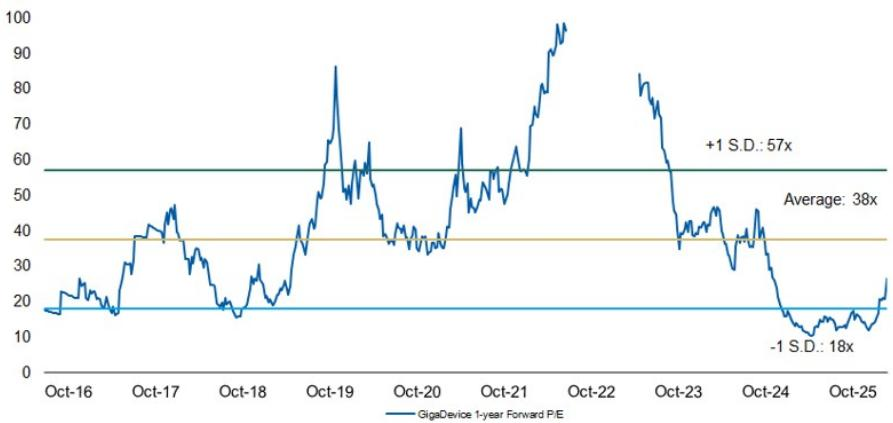  
Source: Company data, MS estimates

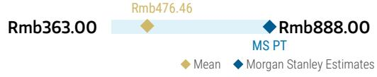

## Risk Reward – GigaDevice Semiconductor Beijing Inc (603986.SS)

Multiple drivers ahead

## PRICE TARGET Rmb888.00

Our price target is our base case value, derived from our residual income model. Key assumptions: cost of equity of 8.9% (beta 1.1, risk-free rate 2% and risk premium 6%), a payout ratio of 40%, medium-term growth rate of 16.4%, and a terminal growth rate of 3.0%.

Consensus Price Target Distribution

Source: Refinitiv, MS

## RISK REWARD CHART

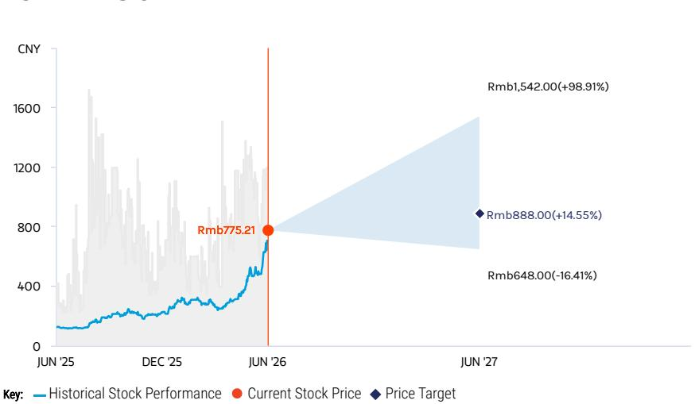  
Key: — Historical Stock Performance ● Current Stock Price ◆ Price Target  
Source: Refinitiv, MS

## OVERWEIGHT THESIS

\- We expect GigaDevice to continue to gain share in China's MCU market. Auto MCUs offer bigger opportunities as local self-sufficiency is low.
- We see further NOR Flash pricing upside, and expect GigaDevice NOR quality to catch up in the auto segment.
- Specialty DRAM pricing started to rebound in late 1Q25, and there are opportunities such as wafer-on-wafer specialty memory.
- We believe GigaDevice will ramp up 16G LPDDR4 and 32G DDR4 at CXMT's Gen 4 platform in 2027.
- Our price target implies 2026e P/E of 53x, above the historical average of 38x since 2016 but within +1 S.D. of 57x.

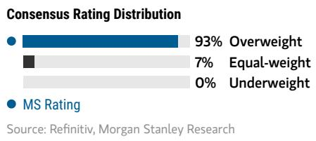  
Source: Refinitiv, MS

## Risk Reward Themes

Pricing Power: Positive
Secular Growth: Positive
View descriptions of Risk Rewards Themes here

## BULL CASE

## 92x 2026e EPS

Rmb1,542.00

NOR/SLC NAND prices rise more sharply into 2H26, and the company increases production of mid-/high-density NOR; MCU growth accelerates; DRAM business shows significant contribution: 1) Flash sales grow 300%+ Y/Y in 2026 via price hikes and meaningful growth in demand; 2) MCU sales growth significantly exceeds 40% in 2026; 3) contribution from WoW tops expectations in 2026-28e; 4) DDR4 price hike stronger than expected; 5) gross margin above 60% in 2026.

## BASE CASE

## 53x 2026e EPS

Rmb888.00

NOR/SLC NAND and DRAM pricing upside in 2026; moderate WoW contribution: 1) Flash sales rise 213% Y/Y in 2026; 2) MCU grows 28% in 2026; 3) meaningful contribution from WoW in 2026-28e; 4) significant DDR4 price hike in 2026; 5) gross margin at \~57% in 2026.

## BEAR CASE

Rmb648.00

## 39x 2026e EPS

NOR/SLC NAND price falls sharply into 2H26; MCU faces stronger competition from foreign and local vendors; pause in DRAM business development: 1) Flash sales grow less than expected in 2026, as ASP starts to drop towards the end of the year; 2) MCU sales decrease >10% Y/Y in 2026; 3) contribution from WoW falls below expectations in 2026-28e; 4) DDR4 price starts to decline towards the end of 2026; 5) gross margin below 35% in 2026.

◆ Mean ◆ MS Estimates

## Risk Reward – GigaDevice Semiconductor Beijing Inc (603986.SS)

## KEY EARNINGS INPUTS

<table><tr><td>Drivers</td><td>Dec 2025</td><td>Dec 2026e</td><td>Dec 2027e</td><td>Dec 2028e</td></tr><tr><td>NOR Flash ASP growth (%)</td><td>4</td><td>149</td><td>42</td><td>0</td></tr><tr><td>MCU ASP growth (%)</td><td>(8)</td><td>0</td><td>0</td><td>0</td></tr><tr><td>Gross margin (%)</td><td>40</td><td>56</td><td>58</td><td>54</td></tr></table>

## INVESTMENT DRIVERS

• Beneficiary of MCU localization

• Decreasing opex burden

• Development of AI glasses market

## GLOBAL REVENUE EXPOSURE

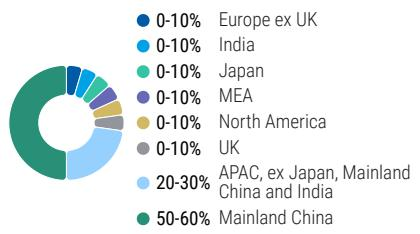  
Source: MS Estimate View explanation of regional hierarchies here

## MS ALPHA MODELS

4/5 MOST 3 Month Horizon

Source: Refinitiv, FactSet, MS; 1 is the highest favored Quintile and 5 is the least favored Quintile

## RISKS TO PT/RATING

## RISKS TO UPSIDE

• NOR up-cycle driven by stronger demand

\- Superior chip design, leading to increasing exposure to low-density NOR

\- Faster-than-expected DRAM development

## RISKS TO DOWNSIDE

• NOR down-cycle driven by weaker demand

\- Inferior chip design, leading to increasing exposure to mid-/high-density NOR

\- Slower-than-expected DRAM development

## OWNERSHIP POSITIONING

<table><tr><td>Inst. Owners, % Active</td><td>86.1%</td></tr></table>

Source: Refinitiv, MS

MS ESTIMATES VS. CONSENSUS  
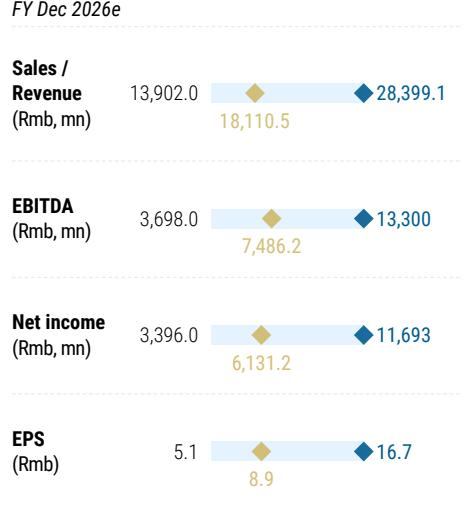  
Source: Refinitiv, MS

# GigaDevice: Financial Summary

## Exhibit 20: Financial Summary

<table><tr><td colspan="5">Income Statement</td></tr><tr><td>Rmb mn (Years End Dec )</td><td>2025</td><td>2026E</td><td>2027E</td><td>2028E</td></tr><tr><td>Net sales</td><td>9,203</td><td>28,399</td><td>46,298</td><td>57,916</td></tr><tr><td>COGS</td><td>(5,502)</td><td>(12,196)</td><td>(19,366)</td><td>(26,712)</td></tr><tr><td>Gross profit</td><td>3,701</td><td>16,203</td><td>26,932</td><td>31,204</td></tr><tr><td>Operating expenses</td><td>(2,176)</td><td>(3,153)</td><td>(3,535)</td><td>(3,991)</td></tr><tr><td>Operating income</td><td>1,526</td><td>13,050</td><td>23,396</td><td>27,214</td></tr><tr><td>Non-operating income</td><td>181</td><td>(125)</td><td>20</td><td>20</td></tr><tr><td>Pre-tax income</td><td>1,706</td><td>12,925</td><td>23,416</td><td>27,234</td></tr><tr><td>Income tax</td><td>29</td><td>1,187</td><td>2,150</td><td>2,501</td></tr><tr><td>Minority interests</td><td>(29)</td><td>(45)</td><td>(45)</td><td>(45)</td></tr><tr><td>Reported net Income</td><td>1,648</td><td>11,693</td><td>21,221</td><td>24,688</td></tr><tr><td>Adj.wtd.avg.shrs(m)</td><td>666</td><td>701</td><td>701</td><td>701</td></tr><tr><td>MW EPS (Rmb)</td><td>2.48</td><td>16.68</td><td>30.27</td><td>35.21</td></tr><tr><td>Reported EPS (Rmb)</td><td>2.48</td><td>16.68</td><td>30.27</td><td>35.21</td></tr></table>

Cash Flow Statement

<table><tr><td>Rmb mn (Years End Dec )</td><td>2025</td><td>2026E</td><td>2027E</td><td>2028E</td></tr><tr><td>Cashflow from Operations</td><td>2,032</td><td>9,555</td><td>18,596</td><td>22,156</td></tr><tr><td>Net profits</td><td>1,648</td><td>11,693</td><td>21,221</td><td>24,688</td></tr><tr><td>Depreciation</td><td>250</td><td>250</td><td>250</td><td>250</td></tr><tr><td>Working Capital Change</td><td>(440)</td><td>(2,389)</td><td>(2,875)</td><td>(2,782)</td></tr><tr><td>Other adjustments</td><td>574</td><td>0</td><td>0</td><td>0</td></tr><tr><td>Cashflow from Investing</td><td>(1,391)</td><td>(250)</td><td>(250)</td><td>(250)</td></tr><tr><td>Capex</td><td>(1,049)</td><td>(250)</td><td>(250)</td><td>(250)</td></tr><tr><td>Change of LT Investment</td><td>(1,886)</td><td>0</td><td>0</td><td>0</td></tr><tr><td>Change of ST Investment</td><td>0</td><td>0</td><td>0</td><td>0</td></tr><tr><td>Other adjustments</td><td>1,544</td><td>0</td><td>0</td><td>0</td></tr><tr><td>Cashflow from financing</td><td>(517)</td><td>(494)</td><td>(3,508)</td><td>(6,366)</td></tr><tr><td>Increase in L/T debt</td><td>0</td><td>0</td><td>0</td><td>0</td></tr><tr><td>Increase in S/T debt</td><td>(698)</td><td>0</td><td>0</td><td>0</td></tr><tr><td>Cash Dividend Paid</td><td>(243)</td><td>(494)</td><td>(3,508)</td><td>(6,366)</td></tr><tr><td>Dir&amp; Emp Bonus Paid</td><td>0</td><td>0</td><td>0</td><td>0</td></tr><tr><td>Issuance of stock</td><td>516</td><td>0</td><td>0</td><td>0</td></tr><tr><td>Other adjustments</td><td>(92)</td><td>0</td><td>0</td><td>0</td></tr><tr><td>Exchange rate adjustment</td><td>21</td><td>0</td><td>0</td><td>0</td></tr><tr><td>Net change in cash</td><td>146</td><td>8,810</td><td>14,838</td><td>15,540</td></tr></table>

<table><tr><td colspan="5">Balance Sheet</td></tr><tr><td>Rmb mn (Years End Dec )</td><td>2025</td><td>2026E</td><td>2027E</td><td>2028E</td></tr><tr><td>Cash</td><td>9,186</td><td>17,997</td><td>32,835</td><td>48,375</td></tr><tr><td>Mkt Securities</td><td>102</td><td>102</td><td>102</td><td>102</td></tr><tr><td>AR/NR</td><td>199</td><td>693</td><td>1,130</td><td>1,414</td></tr><tr><td>Inventory</td><td>3,066</td><td>5,799</td><td>9,209</td><td>12,702</td></tr><tr><td>Other</td><td>873</td><td>873</td><td>873</td><td>873</td></tr><tr><td>Current Assets</td><td>13,425</td><td>25,463</td><td>44,148</td><td>63,464</td></tr><tr><td>Long-term investments</td><td>4,085</td><td>4,085</td><td>4,085</td><td>4,085</td></tr><tr><td>Fixed assets</td><td>1,325</td><td>1,325</td><td>1,325</td><td>1,325</td></tr><tr><td>Deferred assets</td><td>432</td><td>432</td><td>432</td><td>432</td></tr><tr><td>Other assets</td><td>2,129</td><td>2,129</td><td>2,129</td><td>2,129</td></tr><tr><td>Total Assets</td><td>21,397</td><td>33,435</td><td>52,119</td><td>71,435</td></tr><tr><td>S/T borrowings</td><td>200</td><td>200</td><td>200</td><td>200</td></tr><tr><td>AP/NP</td><td>813</td><td>1,652</td><td>2,623</td><td>3,618</td></tr><tr><td>Other ST liabilities</td><td>934</td><td>934</td><td>934</td><td>934</td></tr><tr><td>LT debt</td><td>0</td><td>0</td><td>0</td><td>0</td></tr><tr><td>Other LT liabilities</td><td>226</td><td>226</td><td>226</td><td>226</td></tr><tr><td>Total Liabilities</td><td>2,174</td><td>3,013</td><td>3,984</td><td>4,979</td></tr><tr><td>Common shares</td><td>668</td><td>668</td><td>668</td><td>668</td></tr><tr><td>Additional capital</td><td>9,201</td><td>9,201</td><td>9,201</td><td>9,201</td></tr><tr><td>Retained earning</td><td>8,407</td><td>19,606</td><td>37,319</td><td>55,641</td></tr><tr><td>Other shareholders&#x27; equity</td><td>946</td><td>946</td><td>946</td><td>946</td></tr><tr><td>Total Equity</td><td>19,223</td><td>30,422</td><td>48,135</td><td>66,457</td></tr><tr><td>Total Liab. &amp; Shrhldr&#x27;s Equity</td><td>21,397</td><td>33,435</td><td>52,119</td><td>71,435</td></tr></table>

E = MS Estimates  
Source: MS, Company Data

Financial Ratios

<table><tr><td></td><td>2025</td><td>2026E</td><td>2027E</td><td>2028E</td></tr><tr><td colspan="5">Growth(%)</td></tr><tr><td>Turnover</td><td>25.1</td><td>208.6</td><td>63.0</td><td>25.1</td></tr><tr><td>Operating profits</td><td>88.1</td><td>755.4</td><td>79.3</td><td>16.3</td></tr><tr><td>EPS</td><td>49.6</td><td>573.6</td><td>81.5</td><td>16.3</td></tr><tr><td colspan="5">Margins (%)</td></tr><tr><td>Gross Margin</td><td>40.2</td><td>57.1</td><td>58.2</td><td>53.9</td></tr><tr><td>Operating Margin</td><td>16.6</td><td>46.0</td><td>50.5</td><td>47.0</td></tr><tr><td>Pretax Margin</td><td>18.5</td><td>45.5</td><td>50.6</td><td>47.0</td></tr><tr><td>Net Margin</td><td>17.9</td><td>41.2</td><td>45.8</td><td>42.6</td></tr><tr><td colspan="5">Return (%)</td></tr><tr><td>ROAE</td><td>9.2</td><td>47.1</td><td>54.0</td><td>43.1</td></tr><tr><td>ROAA</td><td>8.1</td><td>42.7</td><td>49.6</td><td>40.0</td></tr><tr><td colspan="5">Gearing (%)</td></tr><tr><td>Net Debt/Equity</td><td>(46.7)</td><td>(58.5)</td><td>(67.8)</td><td>(72.5)</td></tr><tr><td>Liabilities/Equity</td><td>11.3</td><td>9.9</td><td>8.3</td><td>7.5</td></tr><tr><td colspan="5">Ratios (X)</td></tr><tr><td>Current ratio</td><td>6.9</td><td>9.1</td><td>11.7</td><td>13.4</td></tr><tr><td>Quick ratio</td><td>4.8</td><td>6.7</td><td>9.0</td><td>10.5</td></tr><tr><td colspan="5">Others</td></tr><tr><td>AR/NR Turnover (days)</td><td>9</td><td>9</td><td>9</td><td>9</td></tr><tr><td>Inventory Turnover (days)</td><td>174</td><td>174</td><td>174</td><td>174</td></tr><tr><td>AP Turnover (days)</td><td>49</td><td>49</td><td>49</td><td>49</td></tr><tr><td>Cash Conversion (days)</td><td>133</td><td>133</td><td>133</td><td>133</td></tr></table>

## Nanya Tech: Estimate Revisions and Quarterly Financials

We raise our EPS estimates by 7% for 2026, 15% for 2027, and 14% for 2028. We now expect the 3Q DDR4 price increase to exceed prior expectations, with at least a 30% Q/Q rise versus the previous 20% assumption. DDR4 pricing is likely to remain elevated into 1H27, as the supply-demand gap will be difficult to close by then.

Exhibit 21: Nanya Tech: Estimate revisions

<table><tr><td>NT$ mn</td><td>New &#x27;26E</td><td>Old &#x27;26E</td><td>Diff.</td><td>New &#x27;27E</td><td>Old &#x27;27E</td><td>Diff.</td><td>New &#x27;28E</td><td>Old &#x27;28E</td><td>Diff.</td></tr><tr><td>Net sales</td><td>349,737</td><td>332,719</td><td>5%</td><td>524,965</td><td>471,750</td><td>11%</td><td>369,398</td><td>341,113</td><td>8%</td></tr><tr><td>Gross profit</td><td>275,271</td><td>258,553</td><td>6%</td><td>411,790</td><td>359,775</td><td>14%</td><td>231,930</td><td>205,545</td><td>13%</td></tr><tr><td>Operating profit</td><td>257,966</td><td>241,654</td><td>7%</td><td>368,367</td><td>319,538</td><td>15%</td><td>198,868</td><td>174,123</td><td>14%</td></tr><tr><td>Pretax Income</td><td>262,646</td><td>246,334</td><td>7%</td><td>372,644</td><td>323,815</td><td>15%</td><td>203,156</td><td>178,412</td><td>14%</td></tr><tr><td>Net income</td><td>211,423</td><td>198,340</td><td>7%</td><td>300,154</td><td>260,940</td><td>15%</td><td>164,103</td><td>144,097</td><td>14%</td></tr><tr><td>EPS (NT$)</td><td>65.56</td><td>61.50</td><td>7%</td><td>93.08</td><td>80.92</td><td>15%</td><td>50.89</td><td>44.68</td><td>14%</td></tr><tr><td colspan="10">Margins</td></tr><tr><td>Gross margin</td><td>78.7%</td><td>77.7%</td><td></td><td>78.4%</td><td>76.3%</td><td></td><td>62.8%</td><td>60.3%</td><td></td></tr><tr><td>Operating margin</td><td>73.8%</td><td>72.6%</td><td></td><td>70.2%</td><td>67.7%</td><td></td><td>53.8%</td><td>51.0%</td><td></td></tr><tr><td>Pretax margin</td><td>75.1%</td><td>74.0%</td><td></td><td>71.0%</td><td>68.6%</td><td></td><td>55.0%</td><td>52.3%</td><td></td></tr><tr><td>Net margin</td><td>60.5%</td><td>59.6%</td><td></td><td>57.2%</td><td>55.3%</td><td></td><td>44.4%</td><td>42.2%</td><td></td></tr><tr><td></td><td></td><td></td><td></td><td></td><td></td><td></td><td></td><td></td><td></td></tr><tr><td>NT$</td><td>New &#x27;26E</td><td>Old &#x27;26E</td><td>Diff.</td><td>New &#x27;27E</td><td>Old &#x27;27E</td><td>Diff.</td><td>New &#x27;27E</td><td>Old &#x27;27E</td><td>Diff.</td></tr><tr><td>BVPS (NT$)</td><td>122.12</td><td>117.90</td><td>4%</td><td>218.99</td><td>202.11</td><td>8%</td><td>271.95</td><td>248.61</td><td>9%</td></tr></table>

Source: MS (E) estimates

Exhibit 22: Nanya Tech: Quarterly financials

<table><tr><td>NT$ in million</td><td>1Q26</td><td>2Q26E</td><td>3Q26E</td><td>4Q26E</td><td>1Q27E</td><td>2Q27E</td><td>3Q27E</td><td>4Q27E</td></tr><tr><td>Total Revenues</td><td>49,087</td><td>79,416</td><td>105,308</td><td>115,925</td><td>127,613</td><td>140,478</td><td>132,148</td><td>124,726</td></tr><tr><td>Sequential Change</td><td>63.1%</td><td>61.8%</td><td>32.6%</td><td>10.1%</td><td>10.1%</td><td>10.1%</td><td>-5.9%</td><td>-5.6%</td></tr><tr><td>Change vs Year Ago</td><td>582.9%</td><td>654.5%</td><td>460.8%</td><td>285.2%</td><td>160.0%</td><td>76.9%</td><td>25.5%</td><td>7.6%</td></tr><tr><td>Cost of Sales</td><td>(15,771)</td><td>(17,635)</td><td>(19,600)</td><td>(21,460)</td><td>(22,822)</td><td>(24,277)</td><td>(25,732)</td><td>(40,344)</td></tr><tr><td>Percent of Revenues</td><td>32.1%</td><td>22.2%</td><td>18.6%</td><td>18.5%</td><td>17.9%</td><td>17.3%</td><td>19.5%</td><td>32.3%</td></tr><tr><td>Variable costs</td><td>(12,874)</td><td>(14,650)</td><td>(16,553)</td><td>(18,203)</td><td>(19,958)</td><td>(21,413)</td><td>(22,868)</td><td>(25,751)</td></tr><tr><td>as a % of revenue</td><td>26.2%</td><td>18.4%</td><td>15.7%</td><td>15.7%</td><td>15.6%</td><td>15.2%</td><td>17.3%</td><td>20.6%</td></tr><tr><td>Dep. &amp; Amort. expense</td><td>(2,897)</td><td>(2,986)</td><td>(3,046)</td><td>(3,257)</td><td>(2,864)</td><td>(2,864)</td><td>(2,864)</td><td>(14,593)</td></tr><tr><td>as a % of COGS</td><td>18.4%</td><td>16.9%</td><td>15.5%</td><td>15.2%</td><td>12.5%</td><td>11.8%</td><td>11.1%</td><td>36.2%</td></tr><tr><td>as a % of revenue</td><td>5.9%</td><td>3.8%</td><td>2.9%</td><td>2.8%</td><td>2.2%</td><td>2.0%</td><td>2.2%</td><td>11.7%</td></tr><tr><td>Gross Margin</td><td>33,316</td><td>61,781</td><td>85,708</td><td>94,465</td><td>104,791</td><td>116,201</td><td>106,416</td><td>84,382</td></tr><tr><td>Percent of Revenues</td><td>67.9%</td><td>77.8%</td><td>81.4%</td><td>81.5%</td><td>82.1%</td><td>82.7%</td><td>80.5%</td><td>67.7%</td></tr><tr><td>Total Opex</td><td>(3,205)</td><td>(3,987)</td><td>(4,781)</td><td>(5,331)</td><td>(10,329)</td><td>(11,228)</td><td>(11,016)</td><td>(10,850)</td></tr><tr><td>Percent of Revenues</td><td>6.5%</td><td>5.0%</td><td>4.5%</td><td>4.6%</td><td>8.1%</td><td>8.0%</td><td>8.3%</td><td>8.7%</td></tr><tr><td>R&amp;D</td><td>(2,109)</td><td>(2,214)</td><td>(2,325)</td><td>(2,511)</td><td>(2,800)</td><td>(2,940)</td><td>(3,087)</td><td>(3,241)</td></tr><tr><td>Percent of Revenues</td><td>4.3%</td><td>2.8%</td><td>2.2%</td><td>2.2%</td><td>2.2%</td><td>2.1%</td><td>2.3%</td><td>2.6%</td></tr><tr><td>Sales and Marketing</td><td>(347)</td><td>(562)</td><td>(745)</td><td>(820)</td><td>(2,042)</td><td>(2,248)</td><td>(2,114)</td><td>(1,996)</td></tr><tr><td>Percent of Revenues</td><td>0.7%</td><td>0.7%</td><td>0.7%</td><td>0.7%</td><td>1.6%</td><td>1.6%</td><td>1.6%</td><td>1.6%</td></tr><tr><td>General and Admin</td><td>(748)</td><td>(1,211)</td><td>(1,711)</td><td>(2,000)</td><td>(5,487)</td><td>(6,041)</td><td>(5,814)</td><td>(5,613)</td></tr><tr><td>Percent of Revenues</td><td>1.5%</td><td>1.5%</td><td>1.6%</td><td>1.7%</td><td>4.3%</td><td>4.3%</td><td>4.4%</td><td>4.5%</td></tr><tr><td>Operating Income</td><td>30,111</td><td>57,794</td><td>80,927</td><td>89,134</td><td>94,462</td><td>104,973</td><td>95,400</td><td>73,533</td></tr><tr><td>Percent of Revenues</td><td>61.3%</td><td>72.8%</td><td>76.8%</td><td>76.9%</td><td>74.0%</td><td>74.7%</td><td>72.2%</td><td>59.0%</td></tr><tr><td>EBITDA</td><td>33,008</td><td>60,779</td><td>83,973</td><td>92,391</td><td>97,325</td><td>107,837</td><td>98,263</td><td>88,126</td></tr><tr><td>EBITDA margin</td><td>67%</td><td>77%</td><td>80%</td><td>80%</td><td>76%</td><td>77%</td><td>74%</td><td>71%</td></tr><tr><td>Non-operating Income(Loss)</td><td>1,607</td><td>1,020</td><td>1,020</td><td>1,034</td><td>1,070</td><td>1,070</td><td>1,070</td><td>1,067</td></tr><tr><td>Profit Before Taxes</td><td>31,718</td><td>58,813</td><td>81,947</td><td>90,168</td><td>95,531</td><td>106,043</td><td>96,470</td><td>74,600</td></tr><tr><td>Percent of Revenues</td><td>64.6%</td><td>74.1%</td><td>77.8%</td><td>77.8%</td><td>74.9%</td><td>75.5%</td><td>73.0%</td><td>59.8%</td></tr><tr><td>Taxes</td><td>(5,660)</td><td>(11,512)</td><td>(18,618)</td><td>(15,434)</td><td>(17,047)</td><td>(20,756)</td><td>(21,917)</td><td>(12,769)</td></tr><tr><td>Tax Rate</td><td>17.8%</td><td>19.6%</td><td>22.7%</td><td>17.1%</td><td>17.8%</td><td>19.6%</td><td>22.7%</td><td>17.1%</td></tr><tr><td>Reported Income (TW GAAP)</td><td>26,058</td><td>47,302</td><td>63,329</td><td>74,734</td><td>78,484</td><td>85,287</td><td>74,552</td><td>61,830</td></tr><tr><td>Percent of Revenues</td><td>53.1%</td><td>59.6%</td><td>60.1%</td><td>64.5%</td><td>61.5%</td><td>60.7%</td><td>56.4%</td><td>49.6%</td></tr><tr><td>Change vs Year Ago</td><td>-1443%</td><td>-1253%</td><td>3951%</td><td>574%</td><td>201%</td><td>80%</td><td>18%</td><td>-17%</td></tr><tr><td>Reported EPS (NT$, TW GAAP)</td><td>8.08</td><td>14.67</td><td>19.64</td><td>23.17</td><td>24.34</td><td>26.45</td><td>23.12</td><td>19.17</td></tr><tr><td>Sequential Change</td><td>129%</td><td>82%</td><td>34%</td><td>18%</td><td>5%</td><td>9%</td><td>-13%</td><td>-17%</td></tr></table>

Source: Company data, MS (E) estimates

<table><tr><td>2024</td><td>2025</td><td>2026e</td><td>2027e</td><td>2028e</td></tr><tr><td>34,132</td><td>66,587</td><td>349,737</td><td>524,965</td><td>369,398</td></tr><tr><td>14.2%</td><td>95.1%</td><td>425.2%</td><td>50.1%</td><td>-29.6%</td></tr><tr><td>(32,292)</td><td>(50,841)</td><td>(74,466)</td><td>(113,175)</td><td>(137,468)</td></tr><tr><td>94.6%</td><td>76.4%</td><td>21.3%</td><td>21.6%</td><td>37.2%</td></tr><tr><td>(18,408)</td><td>(37,321)</td><td>(62,281)</td><td>(89,991)</td><td>(113,063)</td></tr><tr><td>53.9%</td><td>56.0%</td><td>17.8%</td><td>17.1%</td><td>30.6%</td></tr><tr><td>(13,883)</td><td>(13,520)</td><td>(12,186)</td><td>(23,184)</td><td>(24,404)</td></tr><tr><td>43.0%</td><td>26.6%</td><td>16.4%</td><td>20.5%</td><td>17.8%</td></tr><tr><td>40.7%</td><td>20.3%</td><td>3.5%</td><td>4.4%</td><td>6.6%</td></tr><tr><td>1,840</td><td>15,745</td><td>275,271</td><td>411,790</td><td>231,930</td></tr><tr><td>5.4%</td><td>23.6%</td><td>78.7%</td><td>78.4%</td><td>62.8%</td></tr><tr><td>(10,134)</td><td>(9,741)</td><td>(17,305)</td><td>(43,423)</td><td>(33,062)</td></tr><tr><td>29.7%</td><td>14.6%</td><td>4.9%</td><td>8.3%</td><td>9.0%</td></tr><tr><td>(7,685)</td><td>(7,041)</td><td>(9,160)</td><td>(12,068)</td><td>(11,637)</td></tr><tr><td>22.5%</td><td>10.6%</td><td>2.6%</td><td>2.3%</td><td>3.2%</td></tr><tr><td>(665)</td><td>(832)</td><td>(2,475)</td><td>(8,399)</td><td>(5,910)</td></tr><tr><td>1.9%</td><td>1.2%</td><td>0.7%</td><td>1.6%</td><td>1.6%</td></tr><tr><td>(1,784)</td><td>(1,868)</td><td>(5,670)</td><td>(22,955)</td><td>(15,515)</td></tr><tr><td>5.2%</td><td>2.8%</td><td>1.6%</td><td>4.4%</td><td>4.2%</td></tr><tr><td>(8,294)</td><td>6,004</td><td>257,966</td><td>368,367</td><td>198,868</td></tr><tr><td>-24.3%</td><td>9.0%</td><td>73.8%</td><td>70.2%</td><td>53.8%</td></tr><tr><td>5,589</td><td>19,524</td><td>270,152</td><td>391,551</td><td>223,272</td></tr><tr><td>16%</td><td>29%</td><td>77%</td><td>75%</td><td>60%</td></tr><tr><td>3,998</td><td>2,639</td><td>4,680</td><td>4,277</td><td>4,288</td></tr><tr><td>(4,297)</td><td>8,643</td><td>262,646</td><td>372,644</td><td>203,156</td></tr><tr><td>-12.6%</td><td>13.0%</td><td>75.1%</td><td>71.0%</td><td>55.0%</td></tr><tr><td>1,474</td><td>(1,269)</td><td>(51,224)</td><td>(72,490)</td><td>(39,053)</td></tr><tr><td>34.3%</td><td>14.7%</td><td>19.5%</td><td>19.5%</td><td>19.2%</td></tr><tr><td>(2,823)</td><td>7,373</td><td>211,423</td><td>300,154</td><td>164,103</td></tr><tr><td>-8.3%</td><td>11.1%</td><td>60.5%</td><td>57.2%</td><td>44.4%</td></tr><tr><td>-59%</td><td>-361%</td><td>2767%</td><td>42%</td><td>-45%</td></tr><tr><td>(0.91)</td><td>2.36</td><td>65.56</td><td>93.08</td><td>50.89</td></tr><tr><td>-59%</td><td>-359%</td><td>2677%</td><td>42%</td><td>-45%</td></tr><tr><td>53.3</td><td>54.6</td><td>117.3</td><td>210.4</td><td>261.3</td></tr></table>

## Nanya Tech: Valuation Methodology

We raise our price target (base case scenario value) from NT\$380 to NT\$550. Our price target reflects BVPS multiples of 4.50x for 2026 and 2.51x for 2027, versus ROE of 77% for 2026 and 57% for 2027. We expect DDR4 pricing strength and LTAs to drive a re-rating. We raise our bull and bear case values from NT\$805 and NT\$210 to NT\$1,160 and NT\$305, respectively, implying 9.50x and 2.50x 2026e BVPS.

Exhibit 23: Nanya Tech – Historical P/B band  
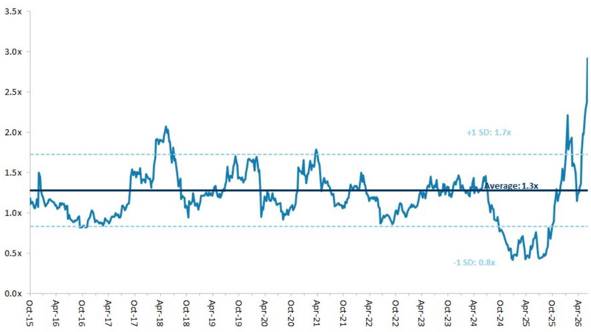  
Source: Company data, MS estimates

Exhibit 24: Nanya Tech: Historical forward P/B vs ROE  
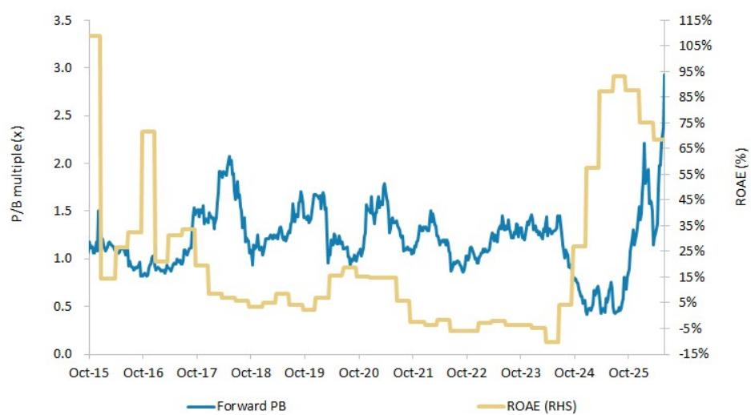  
Source: Company data, MS estimates

Exhibit 25: Nanya Tech: Earnings estimate revision breadth  
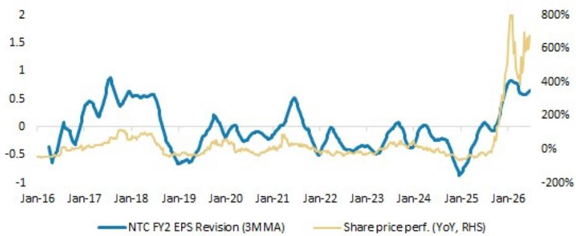  
Source: Company data, MS estimates

## Risk Reward – Nanya Technology Corp. (2408.TW)

DDR4 S/D becoming more favorable; OW

## PRICE TARGET NT\$550.00

Base case, P/B. We expect the stock to trade at 4.50x 2026, 2.51x 2027, and 2.02x 2028 BVPS, above its average since 2015. We think NTC will benefit from a supply-driven up-cycle as major memory players are exiting the DDR4 market. That should help NTC more than offset the competitive impact from CXMT in the near term.

## Consensus Price Target Distribution

Source: Refinitiv, MS

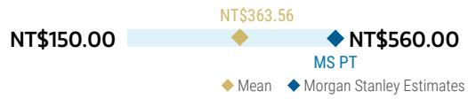

## RISK REWARD CHART

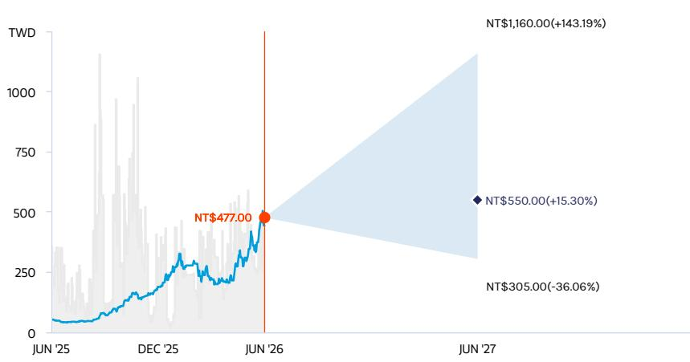  
Key: — Historical Stock Performance ● Current Stock Price ◆ Price Target  
Source: Refinitiv, MS

## OVERWEIGHT THESIS

\- Major memory suppliers are gradually exiting the DDR4 market, benefiting existing Taiwanese players, including Nanya Tech.
- We expect DDR4 shortage into 2H26 to help NTC more than offset the competitive impact from CXMT in 2026. The supply shortage appears set to widen into 2H26.
- Our price target reflects BVPS of 4.50x for 2026, 2.51x for 2027, and 2.02x for 2028.

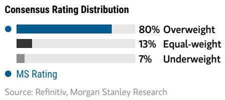

## Risk Reward Themes

Pricing Power: Positive
View descriptions of Risk Rewards Themes here

## BULL CASE

NT\$1,160.00

## 9.50x 2026e BVPS

DRAM prices strong; faster-than-expected 1a/1b nm ramp; competition from Korea and China is a non-factor: DRAM pricing becomes very strong in 2026 thanks to production cuts and relief of inventory pressure. NTC's utilization rate returns to the 100% level. Korean and Chinese competitors all exit the consumer DRAM market.

## BASE CASE

## 4.50x 2026e BVPS

## NT\$550.00 BEAR CASE

Strong DRAM cycle: Major DRAM players now plan to exit the DDR4 market, which positions Taiwanese players to benefit. We expect price-hike momentum to continue through 2026, with widened supply shortage into 2H26.

## NT\$305.00

## 2.50x 2026e BVPS

Specialty DRAM demand becomes weak in 2026 with intensifying Chinese competition: Nanya Tech could face more pressure from pricing and technological competition amid a weak cycle. Inventory remains at historical peak levels. SK hynix and Chinese DRAM competitors take all the market share in China. Nanya Tech's utilization rate falls to the 40% level.

◆ Mean ◆ MS Estimates

## Risk Reward – Nanya Technology Corp. (2408.TW)

## KEY EARNINGS INPUTS

<table><tr><td>Drivers</td><td>Dec 2025</td><td>Dec 2026e</td><td>Dec 2027e</td><td>Dec 2028e</td></tr><tr><td>12&quot; Wafers Out per quarter (000s)</td><td>825.0</td><td>830.0</td><td>855.0</td><td>900.0</td></tr><tr><td>Average Wafer Yield (%)</td><td>81.8</td><td>108.1</td><td>106.5</td><td>95.0</td></tr><tr><td>Total Die shipments - 2 gb equivalent (mn)</td><td>2,368.0</td><td>3,178.8</td><td>3,244.9</td><td>3,090.4</td></tr></table>

## INVESTMENT DRIVERS

• Specialty DRAM pricing

• Monthly sales momentum

• Industry outlook reported by industry peers

## GLOBAL REVENUE EXPOSURE

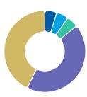  
Source: MS Estimate View explanation of regional hierarchies here

## MS ALPHA MODELS

1/5 MOST 3 Month Horizon

Source: Refinitiv, FactSet, MS; 1 is the highest favored Quintile and 5 is the least favored Quintile

## RISKS TO PT/RATING

## RISKS TO UPSIDE

\- Sustained DRAM prices from more disciplined supply and stronger demand

• Stronger pricing environment, enabling revenue guidance to be beaten

\- Faster-than-expected 1a/1b nm ramp-up progress

## RISKS TO DOWNSIDE

\- Slower-than-expected 1a/1b nm ramp-up

\- Less demand for specialty DRAM from 4K2K TVs and smart set-top boxes

## OWNERSHIP POSITIONING

<table><tr><td>Inst. Owners, % Active</td><td>51.9%</td></tr></table>

Source: Refinitiv, MS

## MS ESTIMATES VS. CONSENSUS

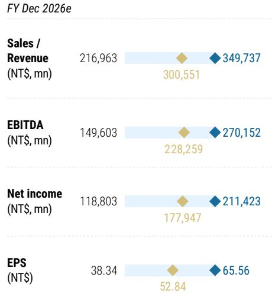  
Source: Refinitiv, MS

Nanya Tech: Financial Summary  
Income Statement

<table><tr><td>NT$mn (Years End Dec )</td><td>2025</td><td>2026E</td><td>2027E</td><td>2028E</td></tr><tr><td>Net sales</td><td>66,587</td><td>349,737</td><td>524,965</td><td>369,398</td></tr><tr><td>COGS</td><td>(50,841)</td><td>(74,466)</td><td>(113,175)</td><td>(137,468)</td></tr><tr><td>Depreciation Expense</td><td>(13,520)</td><td>(12,186)</td><td>(23,184)</td><td>(24,404)</td></tr><tr><td>Variable Cost</td><td>(37,321)</td><td>(62,281)</td><td>(89,991)</td><td>(113,063)</td></tr><tr><td>Gross profit</td><td>15,745</td><td>275,271</td><td>411,790</td><td>231,930</td></tr><tr><td>Operating expenses</td><td>(9,741)</td><td>(17,305)</td><td>(43,423)</td><td>(33,062)</td></tr><tr><td>Operating income</td><td>6,004</td><td>257,966</td><td>368,367</td><td>198,868</td></tr><tr><td>Non-operating income</td><td>2,639</td><td>4,680</td><td>4,277</td><td>4,288</td></tr><tr><td>Pre-tax income</td><td>8,643</td><td>262,646</td><td>372,644</td><td>203,156</td></tr><tr><td>Income tax</td><td>(1,269)</td><td>(51,224)</td><td>(72,490)</td><td>(39,053)</td></tr><tr><td>Reported net Income</td><td>7,373</td><td>211,423</td><td>300,154</td><td>164,103</td></tr><tr><td>Adj.wtd.avg.shrs(m)</td><td>3,123</td><td>3,225</td><td>3,225</td><td>3,225</td></tr><tr><td>Reported EPS (NT$)</td><td>2.36</td><td>65.56</td><td>93.08</td><td>50.89</td></tr><tr><td>EPS for consensus (NT$)</td><td>2.36</td><td>65.56</td><td>93.08</td><td>50.89</td></tr></table>

Cash Flow Statement

<table><tr><td>NT$mn (Years</td><td>2025</td><td>2026E</td><td>2027E</td><td>2028E</td></tr><tr><td>Cashflow fror</td><td>18,568</td><td>(197,872)</td><td>293,865</td><td>394,638</td></tr><tr><td>Net profits</td><td>7,373</td><td>211,423</td><td>300,154</td><td>164,103</td></tr><tr><td>Depreciation</td><td>14,034</td><td>12,186</td><td>23,184</td><td>24,404</td></tr><tr><td>Working Capital</td><td>5,697</td><td>(415,858)</td><td>(27,513)</td><td>201,138</td></tr><tr><td>Other adjustmei</td><td>(8,536)</td><td>(5,622)</td><td>(1,960)</td><td>4,993</td></tr><tr><td>Cashflow fror</td><td>(14,110)</td><td>(50,005)</td><td>(30,000)</td><td>(30,000)</td></tr><tr><td>Capex</td><td>(13,441)</td><td>(50,000)</td><td>(30,000)</td><td>(30,000)</td></tr><tr><td>Change of LT In</td><td>(612)</td><td>0</td><td>0</td><td>0</td></tr><tr><td>Change of ST Ir</td><td>0</td><td>0</td><td>0</td><td>0</td></tr><tr><td>Other adjustmei</td><td>(57)</td><td>(5)</td><td>0</td><td>0</td></tr><tr><td>Cashflow fror</td><td>(6,317)</td><td>238,453</td><td>5,000</td><td>(20,000)</td></tr><tr><td>Increase in L/T i</td><td>(6,750)</td><td>3,600</td><td>0</td><td>0</td></tr><tr><td>Increase in S/T i</td><td>(9,477)</td><td>234,941</td><td>5,000</td><td>(20,000)</td></tr><tr><td>Cash Dividend F</td><td>0</td><td>0</td><td>0</td><td>0</td></tr><tr><td>Dir&amp; Emp Bonus</td><td>(7,000)</td><td>0</td><td>0</td><td>0</td></tr><tr><td>Proceed Im New</td><td>0</td><td>0</td><td>0</td><td>0</td></tr><tr><td>Other adjustmei</td><td>16,909</td><td>(87)</td><td>0</td><td>0</td></tr><tr><td>Exchange rate i</td><td>(1,970)</td><td>1,019</td><td>0</td><td>0</td></tr><tr><td>Net change ii</td><td>-3,829</td><td>-8,405</td><td>268,865</td><td>344,638</td></tr></table>

Balance Sheet

<table><tr><td>NT$mn (Years End Dec )</td><td>2025</td><td>2026E</td><td>2027E</td><td>2028E</td></tr><tr><td>Cash</td><td>58,074</td><td>49,669</td><td>318,534</td><td>663,173</td></tr><tr><td>Mkt Securities</td><td>0</td><td>0</td><td>0</td><td>0</td></tr><tr><td>AR/NR</td><td>16,558</td><td>59,175</td><td>63,667</td><td>37,706</td></tr><tr><td>Inventory</td><td>27,288</td><td>402,624</td><td>433,191</td><td>256,554</td></tr><tr><td>Other</td><td>6,621</td><td>18,025</td><td>19,056</td><td>13,103</td></tr><tr><td>Current Assets</td><td>108,541</td><td>529,494</td><td>834,448</td><td>970,535</td></tr><tr><td>Long-term investments</td><td>5,904</td><td>7,583</td><td>8,538</td><td>9,492</td></tr><tr><td>Fixed assets</td><td>85,031</td><td>125,252</td><td>132,068</td><td>137,663</td></tr><tr><td>Other assets</td><td>8,977</td><td>5,145</td><td>5,145</td><td>5,145</td></tr><tr><td>Total Assets</td><td>208,453</td><td>667,473</td><td>980,198</td><td>1,122,836</td></tr><tr><td>S/T borrowings</td><td>5,060</td><td>240,000</td><td>245,000</td><td>225,000</td></tr><tr><td>APINP</td><td>6,481</td><td>8,576</td><td>16,122</td><td>14,662</td></tr><tr><td>Other ST liabilities</td><td>7,480</td><td>17,772</td><td>17,797</td><td>17,792</td></tr><tr><td>LT debt</td><td>14,196</td><td>17,796</td><td>17,796</td><td>17,796</td></tr><tr><td>Other LT liabilities</td><td>4,698</td><td>4,927</td><td>4,927</td><td>4,927</td></tr><tr><td>Total Liabilities</td><td>37,914</td><td>289,072</td><td>301,643</td><td>280,177</td></tr><tr><td>Common stocks</td><td>30,986</td><td>30,986</td><td>30,986</td><td>30,986</td></tr><tr><td>Preferred stocks</td><td>0</td><td>0</td><td>0</td><td>0</td></tr><tr><td>Capital Researve</td><td>33,081</td><td>33,168</td><td>33,168</td><td>33,168</td></tr><tr><td>Retained earning</td><td>106,333</td><td>314,111</td><td>614,265</td><td>778,368</td></tr><tr><td>Other shareholders&#x27; equity</td><td>0</td><td>0</td><td>0</td><td>0</td></tr><tr><td>Total Equity</td><td>170,538</td><td>378,402</td><td>678,556</td><td>842,659</td></tr><tr><td>Total Liab. &amp; Shrhldr&#x27;s Equity</td><td>208,453</td><td>667,473</td><td>980,198</td><td>1,122,836</td></tr><tr><td>BVPS</td><td>54.61</td><td>117.34</td><td>210.42</td><td>261.31</td></tr></table>

Financial Ratios

<table><tr><td></td><td>2025</td><td>2026E</td><td>2027E</td><td>2028E</td></tr><tr><td colspan="5">Growth(%)</td></tr><tr><td>Turnover</td><td>95.1</td><td>425.2</td><td>50.1</td><td>-29.6</td></tr><tr><td colspan="5">Margins (%)</td></tr><tr><td>Gross Margin</td><td>23.6</td><td>78.7</td><td>78.4</td><td>62.8</td></tr><tr><td>Operating Marg</td><td>9.0</td><td>73.8</td><td>70.2</td><td>53.8</td></tr><tr><td>EBITA Margin</td><td>-11.3</td><td>70.3</td><td>65.8</td><td>47.2</td></tr><tr><td>Pretax Margin</td><td>13.0</td><td>75.1</td><td>71.0</td><td>55.0</td></tr><tr><td>Net Profit</td><td>11.1</td><td>60.5</td><td>57.2</td><td>44.4</td></tr><tr><td colspan="5">Return (%)</td></tr><tr><td>ROAE</td><td>4.4</td><td>77.0</td><td>56.8</td><td>21.6</td></tr><tr><td>ROAA</td><td>3.6</td><td>48.3</td><td>36.4</td><td>15.6</td></tr><tr><td colspan="5">Gearing (%)</td></tr><tr><td>Net Debt/Equity</td><td>(22.7)</td><td>55.0</td><td>(8.2)</td><td>(49.9)</td></tr><tr><td>Liabilities/Equity</td><td>22.2</td><td>76.4</td><td>44.5</td><td>33.2</td></tr><tr><td colspan="5">Ratios (X)</td></tr><tr><td>Current ratio</td><td>5.7</td><td>2.0</td><td>3.0</td><td>3.8</td></tr><tr><td>Quick ratio</td><td>3.9</td><td>0.4</td><td>1.4</td><td>2.7</td></tr><tr><td colspan="5">Others</td></tr><tr><td>AR/NR Turnove</td><td>50</td><td>57</td><td>40</td><td>43</td></tr><tr><td>Inventory Turno</td><td>337</td><td>172</td><td>224</td><td>291</td></tr><tr><td>AP Turnover (da</td><td>59</td><td>47</td><td>42</td><td>52</td></tr><tr><td>Cash Conversio</td><td>328</td><td>182</td><td>222</td><td>281</td></tr></table>

## PSMC: Earnings Estimate Revisions

We raise our EPS forecasts for 2026/27/28 by 4%/48%/62%: This reflects stronger-than-expected DDR3/DDR4 memory pricing. We now expect DDR4 pricing to rise further into 4Q, following the double-digit monthly uptrend. We also incorporate a more meaningful revenue contribution from the 3D AI foundry business (including SiCap, wafer-on-wafer, and HBM PWF), accounting for 5%/10%/14% of total revenue in 2026/27/28.

Exhibit 26: PSMC: Earnings estimate revision summary

<table><tr><td>(NT$ mn)</td><td>New 2026e</td><td>Old 2026e</td><td>Diff.%</td><td>New 2027e</td><td>Old 2027e</td><td>Diff.%</td><td>New 2028e</td><td>Old 2028e</td><td>Diff.%</td></tr><tr><td>Net sales</td><td>75,820</td><td>73,014</td><td>4%</td><td>102,954</td><td>89,835</td><td>15%</td><td>118,635</td><td>91,960</td><td>29%</td></tr><tr><td>Gross profit</td><td>16,783</td><td>15,836</td><td>6%</td><td>41,003</td><td>30,217</td><td>36%</td><td>50,792</td><td>34,579</td><td>47%</td></tr><tr><td>Operating profit</td><td>22,630</td><td>21,712</td><td>4%</td><td>31,964</td><td>21,309</td><td>50%</td><td>41,036</td><td>25,090</td><td>64%</td></tr><tr><td>Pretax income</td><td>23,249</td><td>22,332</td><td>4%</td><td>32,649</td><td>21,994</td><td>48%</td><td>41,721</td><td>25,775</td><td>62%</td></tr><tr><td>Net income</td><td>21,365</td><td>20,631</td><td>4%</td><td>26,119</td><td>17,595</td><td>48%</td><td>33,377</td><td>20,620</td><td>62%</td></tr><tr><td>EPS (NT$)</td><td>4.80</td><td>4.64</td><td>4%</td><td>5.61</td><td>3.78</td><td>48%</td><td>7.16</td><td>4.43</td><td>62%</td></tr><tr><td colspan="10">Margins</td></tr><tr><td>Gross margin</td><td>22.1%</td><td>21.7%</td><td></td><td>39.8%</td><td>33.6%</td><td></td><td>42.8%</td><td>37.6%</td><td></td></tr><tr><td>Operating margin</td><td>29.8%</td><td>29.7%</td><td></td><td>31.0%</td><td>23.7%</td><td></td><td>34.6%</td><td>27.3%</td><td></td></tr><tr><td>Pretax margin</td><td>30.7%</td><td>30.6%</td><td></td><td>31.7%</td><td>24.5%</td><td></td><td>35.2%</td><td>28.0%</td><td></td></tr><tr><td>Net margin</td><td>28.2%</td><td>28.3%</td><td></td><td>25.4%</td><td>19.6%</td><td></td><td>28.1%</td><td>22.4%</td><td></td></tr></table>

<table><tr><td>(NT$)</td><td>New 2026e</td><td>Old 2026e</td><td>Diff.%</td><td>New 2027e</td><td>Old 2027e</td><td>Diff.%</td><td>New 2028e</td><td>Old 2028e</td><td>Diff.%</td></tr><tr><td>BVPS</td><td>42.2</td><td>42.1</td><td>0.4%</td><td>52.8</td><td>50.8</td><td>3.8%</td><td>64.6</td><td>60.4</td><td>6.8%</td></tr></table>

Source: Company data, MS (E) estimates

Exhibit 27: PSMC: Quarterly financials

<table><tr><td>(NT$ mn)</td><td>1Q25</td><td>2Q25</td><td>3Q25</td><td>4Q25</td><td>1Q26</td><td>2Q26e</td><td>3Q26e</td><td>4Q26e</td><td>1Q27e</td><td>2Q27e</td><td>3Q27e</td><td>4Q27e</td><td>1Q28e</td><td>2Q28e</td><td>3Q28e</td><td>4Q28e</td><td>2025</td><td>2026e</td><td>2027e</td><td>2028e</td><td></td></tr><tr><td>Total Revenues</td><td>11,116</td><td>11,278</td><td>11,840</td><td>12,495</td><td>13,572</td><td>17,915</td><td>21,068</td><td>23,264</td><td>24,193</td><td>25,347</td><td>26,277</td><td>27,136</td><td>28,082</td><td>29,266</td><td>30,213</td><td>31,075</td><td>46,730</td><td>75,820</td><td>102,954</td><td>118,635</td><td></td></tr><tr><td>Sequential Change</td><td>-0.1%</td><td>1.5%</td><td>5.0%</td><td>5.5%</td><td>8.6%</td><td>32.0%</td><td>17.6%</td><td>10.4%</td><td>4.0%</td><td>4.8%</td><td>3.7%</td><td>3.3%</td><td>4.5%</td><td>3.2%</td><td>3.2%</td><td>2.9%</td><td></td><td></td><td></td><td></td><td></td></tr><tr><td>Change vs Year Ago</td><td>2.7%</td><td>1.4%</td><td>1.6%</td><td>12.2%</td><td>22.1%</td><td>58.8%</td><td>77.9%</td><td>86.2%</td><td>78.3%</td><td>41.5%</td><td>24.7%</td><td>16.6%</td><td>16.1%</td><td>15.5%</td><td>15.0%</td><td>14.5%</td><td>4.5%</td><td>62.3%</td><td>35.8%</td><td>15.2%</td><td></td></tr><tr><td>Cost of Sales</td><td>(31,653)</td><td>(12,300)</td><td>(12,614)</td><td>(11,701)</td><td>(12,184)</td><td>(14,202)</td><td>(15,584)</td><td>(17,067)</td><td>(14,704)</td><td>(15,328)</td><td>(15,846)</td><td>(16,072)</td><td>(16,125)</td><td>(16,752)</td><td>(17,255)</td><td>(17,711)</td><td>(48,267)</td><td>(59,037)</td><td>(61,951)</td><td>(67,843)</td><td></td></tr><tr><td>Percent of Revenues</td><td>104.8%</td><td>109.1%</td><td>106.5%</td><td>93.6%</td><td>89.8%</td><td>79.3%</td><td>74.0%</td><td>73.4%</td><td>60.8%</td><td>60.5%</td><td>60.3%</td><td>59.2%</td><td>57.4%</td><td>57.2%</td><td>57.1%</td><td>57.0%</td><td>103.3%</td><td>77.9%</td><td>60.2%</td><td>57.2%</td><td></td></tr><tr><td>Gross Profit</td><td>(536)</td><td>(1,022)</td><td>(773)</td><td>794</td><td>1,388</td><td>3,712</td><td>5,485</td><td>6,198</td><td>9,489</td><td>10,020</td><td>10,431</td><td>11,064</td><td>11,957</td><td>12,513</td><td>12,959</td><td>13,364</td><td>(1,537)</td><td>16,783</td><td>41,003</td><td>50,792</td><td></td></tr><tr><td>Percent of Revenues</td><td>-4.8%</td><td>-9.1%</td><td>-8.5%</td><td>6.4%</td><td>10.2%</td><td>20.7%</td><td>26.0%</td><td>26.6%</td><td>39.2%</td><td>39.5%</td><td>39.7%</td><td>40.8%</td><td>42.6%</td><td>42.8%</td><td>42.9%</td><td>43.0%</td><td>NM</td><td>22.1%</td><td>39.8%</td><td>42.8%</td><td></td></tr><tr><td>Total Opex</td><td>(322)</td><td>(674)</td><td>(1,914)</td><td>(1,514)</td><td>12,835</td><td>(2,266)</td><td>3,334</td><td>(3,392)</td><td>(2,192)</td><td>(2,328)</td><td>(2,283)</td><td>(2,326)</td><td>(2,371)</td><td>(2,418)</td><td>(2,482)</td><td>(2,506)</td><td>(8,054)</td><td>5,847</td><td>(9,040)</td><td>(9,766)</td><td></td></tr><tr><td>Percent of Revenues</td><td>2.9%</td><td>6.0%</td><td>16.2%</td><td>12.1%</td><td>-94.6%</td><td>12.6%</td><td>11.1%</td><td>10.3%</td><td>9.1%</td><td>8.8%</td><td>8.7%</td><td>8.6%</td><td>8.4%</td><td>8.3%</td><td>8.1%</td><td>8.1%</td><td>17.2%</td><td>-7.7%</td><td>8.8%</td><td>8.2%</td><td></td></tr><tr><td>R&amp;D</td><td>(1,354)</td><td>(1,260)</td><td>(1,297)</td><td>(1,346)</td><td>(1,615)</td><td>(1,835)</td><td>(1,855)</td><td>(1,875)</td><td>(1,300)</td><td>(1,320)</td><td>(1,340)</td><td>(1,360)</td><td>(1,380)</td><td>(1,400)</td><td>(1,420)</td><td>(1,440)</td><td>(5,257)</td><td>(6,581)</td><td>(5,320)</td><td>(5,640)</td><td></td></tr><tr><td>Percent of Revenues</td><td>12.2%</td><td>11.2%</td><td>11.0%</td><td>10.8%</td><td>11.9%</td><td>9.1%</td><td>7.9%</td><td>7.2%</td><td>5.4%</td><td>5.2%</td><td>5.1%</td><td>5.0%</td><td>4.9%</td><td>4.8%</td><td>4.7%</td><td>4.6%</td><td>11.3%</td><td>8.7%</td><td>5.2%</td><td>4.8%</td><td></td></tr><tr><td>Sales and Marketing</td><td>(116)</td><td>(111)</td><td>(113)</td><td>(122)</td><td>(170)</td><td>(106)</td><td>(219)</td><td>(242)</td><td>(242)</td><td>(253)</td><td>(263)</td><td>(271)</td><td>(281)</td><td>(293)</td><td>(302)</td><td>(311)</td><td>(463)</td><td>(817)</td><td>(1,030)</td><td>(1,106)</td><td></td></tr><tr><td>Percent of Revenues</td><td>1.0%</td><td>1.0%</td><td>1.0%</td><td>1.0%</td><td>1.3%</td><td>1.0%</td><td>1.0%</td><td>1.0%</td><td>1.0%</td><td>1.0%</td><td>1.0%</td><td>1.0%</td><td>1.0%</td><td>1.0%</td><td>1.0%</td><td>1.0%</td><td>1.0%</td><td>1.1%</td><td>1.0%</td><td>1.0%</td><td></td></tr><tr><td>General and Admin</td><td>(622)</td><td>(583)</td><td>(569)</td><td>(560)</td><td>(744)</td><td>(744)</td><td>(759)</td><td>(774)</td><td>(950)</td><td>(965)</td><td>(960)</td><td>(995)</td><td>(1,010)</td><td>(1,025)</td><td>(1,040)</td><td>(1,055)</td><td>(2,334)</td><td>(3,022)</td><td>(3,890)</td><td>(4,130)</td><td></td></tr><tr><td>Percent of Revenues</td><td>5.6%</td><td>5.2%</td><td>4.8%</td><td>4.5%</td><td>4.5%</td><td>4.2%</td><td>3.6%</td><td>3.3%</td><td>3.9%</td><td>3.8%</td><td>3.7%</td><td>3.7%</td><td>3.6%</td><td>3.5%</td><td>3.4%</td><td>3.4%</td><td>5.0%</td><td>4.0%</td><td>3.8%</td><td>3.3%</td><td></td></tr><tr><td>Operating Income</td><td>(858)</td><td>(1,696)</td><td>(2,606)</td><td>(719)</td><td>14,226</td><td>1,447</td><td>3,155</td><td>3,806</td><td>1,297</td><td>7,781</td><td>8,148</td><td>8,738</td><td>9,586</td><td>10,096</td><td>10,497</td><td>10,858</td><td>(5,991)</td><td>22,630</td><td>31,964</td><td>41,036</td><td></td></tr><tr><td>Percent of Revenues</td><td>-7.7%</td><td>-15.0%</td><td>-22.7%</td><td>-5.8%</td><td>104.8%</td><td>8.1%</td><td>15.0%</td><td>16.4%</td><td>30.2%</td><td>30.7%</td><td>31.0%</td><td>32.2%</td><td>34.1%</td><td>34.5%</td><td>34.7%</td><td>34.9%</td><td>-20.5%</td><td>29.8%</td><td>31.0%</td><td>34.6%</td><td></td></tr><tr><td>Total Non-operating Income(Loss)</td><td>(74)</td><td>(1,529)</td><td>(41)</td><td>127</td><td>106</td><td>171</td><td>171</td><td>171</td><td>171</td><td>171</td><td>171</td><td>171</td><td>171</td><td>171</td><td>171</td><td>171</td><td>2,114</td><td>620</td><td>685</td><td>685</td><td></td></tr><tr><td>Profit Before Taxes</td><td>(932)</td><td>(3,226)</td><td>(2,737)</td><td>(592)</td><td>14,332</td><td>1,618</td><td>3,322</td><td>3,977</td><td>7,468</td><td>7,952</td><td>8,219</td><td>8,909</td><td>9,757</td><td>10,267</td><td>10,668</td><td>11,029</td><td>(7,477)</td><td>23,249</td><td>32,649</td><td>41,721</td><td></td></tr><tr><td>Percent of Revenues</td><td>-8.4%</td><td>-28.6%</td><td>-23.0%</td><td>-4.7%</td><td>105.6%</td><td>9.0%</td><td>15.8%</td><td>17.1%</td><td>30.9%</td><td>31.4%</td><td>31.7%</td><td>32.8%</td><td>34.7%</td><td>35.1%</td><td>35.3%</td><td>35.5%</td><td>NM</td><td>30.7%</td><td>31.7%</td><td>35.2%</td><td></td></tr><tr><td>Change vs Year Ago</td><td>112.9%</td><td>64.8%</td><td>-5.3%</td><td>-62.0%</td><td>-1637.2%</td><td>-150.2%</td><td>-221.8%</td><td>-771.5%</td><td>-47.9%</td><td>391.5%</td><td>150.4%</td><td>124.0%</td><td>30.7%</td><td>29.1%</td><td>28.2%</td><td>23.8%</td><td></td><td></td><td></td><td></td><td></td></tr><tr><td>Taxes</td><td>(165)</td><td>(108)</td><td>(1)</td><td>(62)</td><td>(101)</td><td>(324)</td><td>(864)</td><td>(795)</td><td>(1,494)</td><td>(1,590)</td><td>(1,664)</td><td>(1,782)</td><td>(1,951)</td><td>(2,053)</td><td>(2,134)</td><td>(2,206)</td><td>(336)</td><td>(1,804)</td><td>(6,530)</td><td>(8,344)</td><td></td></tr><tr><td>Tax Rate</td><td>-17.7%</td><td>-3.3%</td><td>0.0%</td><td>-10.4%</td><td>0.7%</td><td>20.0%</td><td>20.0%</td><td>20.0%</td><td>20.0%</td><td>20.0%</td><td>20.0%</td><td>20.0%</td><td>20.0%</td><td>20.0%</td><td>20.0%</td><td>20.0%</td><td>-4.5%</td><td>8.1%</td><td>20.0%</td><td>20.0%</td><td></td></tr><tr><td>Reported Income (TW GAAP)</td><td>(1,697)</td><td>(3,234)</td><td>(3,728)</td><td>(654)</td><td>14,231</td><td>1,294</td><td>3,658</td><td>3,182</td><td>5,974</td><td>6,362</td><td>6,665</td><td>7,137</td><td>7,806</td><td>8,214</td><td>8,534</td><td>8,823</td><td>(7,813)</td><td>21,565</td><td>26,119</td><td>33,377</td><td></td></tr><tr><td>Percent of Revenues</td><td>-9.5%</td><td>-29.6%</td><td>-23.0%</td><td>-5.2%</td><td>104.5%</td><td>7.2%</td><td>12.6%</td><td>13.7%</td><td>24.7%</td><td>20.1%</td><td>25.3%</td><td>26.3%</td><td>27.8%</td><td>28.1%</td><td>28.2%</td><td>28.4%</td><td>-15.7%</td><td>28.2%</td><td>28.4%</td><td>28.1%</td><td></td></tr><tr><td>Change vs Year Ago</td><td>149.8%</td><td>70.3%</td><td>-5.2%</td><td>-56.4%</td><td>-1397.2%</td><td>-138.8%</td><td>-197.4%</td><td>-586.5%</td><td>-58.0%</td><td>391.5%</td><td>150.4%</td><td>124.0%</td><td>30.7%</td><td>29.1%</td><td>28.2%</td><td>23.8%</td><td>NM</td><td>NM</td><td>22.3%</td><td>27.8%</td><td></td></tr><tr><td>EPS (NT$)</td><td>(0.26)</td><td>(0.80)</td><td>(0.65)</td><td>(0.16)</td><td>3.36</td><td>0.31</td><td>0.57</td><td>0.68</td><td>1.28</td><td>1.37</td><td>1.43</td><td>1.53</td><td>1.68</td><td>1.76</td><td>1.83</td><td>1.89</td><td>(1.87)</td><td>4.80</td><td>5.61</td><td>7.16</td><td></td></tr><tr><td>Change vs Year Ago</td><td>NM</td><td>NM</td><td>NM</td><td>NM</td><td>NM</td><td>NM</td><td>NM</td><td>NM</td><td>NM</td><td>-61.8%</td><td>347.2%</td><td>150.4%</td><td>124.0%</td><td>30.7%</td><td>29.1%</td><td>28.2%</td><td>23.8%</td><td>NM</td><td>NM</td><td>16.7%</td><td>27.8%</td></tr><tr><td>Weighted average shares</td><td>4,179</td><td>4,188</td><td>4,191</td><td>4,193</td><td>4,239</td><td>4,239</td><td>4,659</td><td>4,659</td><td>4,659</td><td>4,659</td><td>4,659</td><td>4,659</td><td>4,659</td><td>4,659</td><td>4,659</td><td>4,659</td><td>4,180</td><td>4,449</td><td>4,659</td><td>4,659</td><td></td></tr></table>

Source: Company data, MS (E) estimates

## PSMC: Valuation methodology

We raise our price target to NT\$111 from NT\$88: We incorporate our revised estimates and maintain our P/B valuation methodology. Our new target is based on a 2026e P/B of 2.6x, up from 2.1x previously, and above the historical average of 1.5x since 2021, reflecting our strong conviction in shipments, ASP improvements, and the emerging 3D AI foundry business. We believe PSMC is well positioned to benefit from its Micron partnership, including front-end migration to the 1y process node and back-end opportunities in advanced DRAM production (e.g., HBM). The company is also catching up with the DRAM pricing upcycle.

Exhibit 28: PSMC: Historical forward P/B  
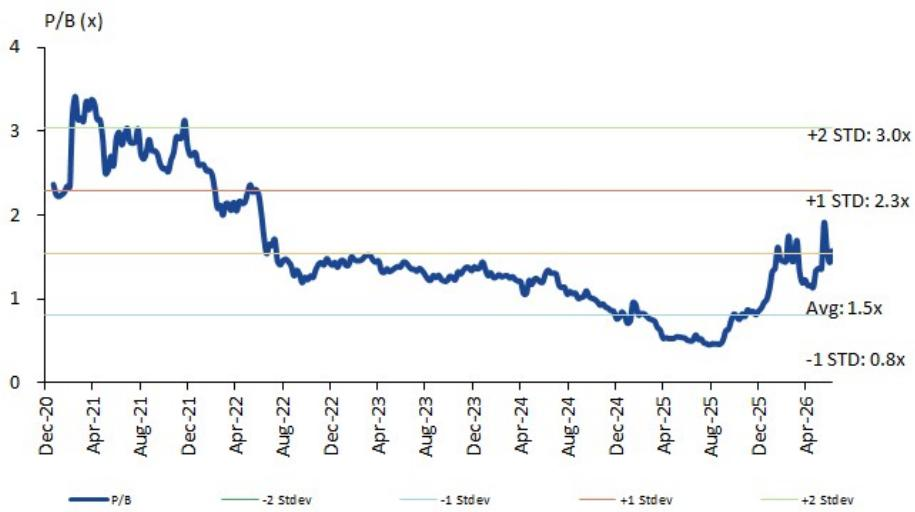  
Source: Company data, MS estimates

Exhibit 29: PSMC: Historical forward P/B vs ROE  
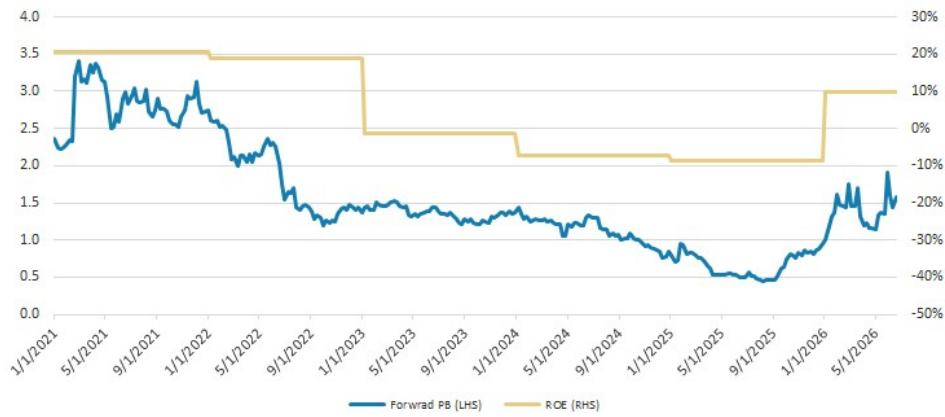  
Source: Company data, MS estimates

## Risk Reward – Powerchip Semiconductor Manufacturing Co (6770.TW)

Beneficiary of mature node up-cycle and EMIB supply chain

## PRICE TARGET NT\$111.00

Base case, 2.6x 2026e P/B. This method is in line with our approach for Greater China memory IDM players, in view of the industry's high volatility. Our 2.6x target P/B is higher than the historical average of 1.5x since 2021, reflecting our optimistic view on improved pricing and utilization.

## Consensus Price Target Distribution

Source: Refinitiv, MS

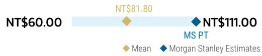

## RISK REWARD CHART

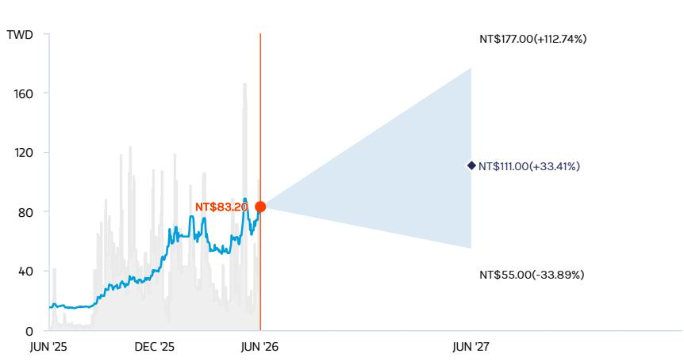  
Key: — Historical Stock Performance ● Current Stock Price ◆ Price Target  
Source: Refinitiv, MS

## OVERWEIGHT THESIS

■ We expect a mature node capacity shortage in 2H27, reflecting fast growth of AI power ICs as a key part of future AI infrastructure.

■ 3D AI foundry business is expected to be a major revenue contributor - we expect it to make up 5%/10%/14% of total revenue in 2026/27/28.

\- We see specialty DRAM price hikes continuing throughout 2026.
- Our new target is based on 2026e P/B of 2.6x, up from 2.1x - higher than the historical average of 1.5x since 2021, reflecting our optimistic view on improved pricing and utilization.

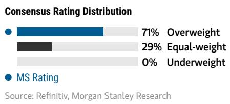  
Source: Refinitiv, MS

## Risk Reward Themes

<table><tr><td>Disruption:</td><td>Positive</td></tr><tr><td>Pricing Power:</td><td>Positive</td></tr></table>

View descriptions of Risk Rewards Themes here

## BULL CASE

## 4.2x 2026e BVPS

NT\$177.00

Strong sales growth with gross margin expansion: Our assumptions include: 1) a revenue CAGR of >40% in 2025-28; 2) gross margin expanding to 45%+ by 2028; 3) mature node foundry up-cycle longer than expected; 4) faster revenue ramp-up of 3D AI foundry business; 5) longer-than-expected specialty DRAM pricing increase.

## BASE CASE

## 2.6x 2026e BVPS

Revenue growth with gross margin improvement: Our assumptions include: 1) a revenue CAGR of 36.4% in 2025-28; 2) a gross margin increase to 43% by 2028; 3) a mature node foundry up-cycle; 4) additional contribution from 3D AI foundry business; 5) specialty DRAM pricing continuing to increase.

## NT\$111.00 BEAR CASE

NT\$55.00

## 1.3x 2026e BVPS

Revenue decline with gross margin erosion: Our assumptions include: 1) a revenue CAGR in the single digits (%) in 2025-28; 2) gross margin of <10% by 2028; 3) mature node foundry capacity no longer in shortage; 4) delays in revenue contribution from 3D AI foundry business; 5) decreases in specialty DRAM pricing.

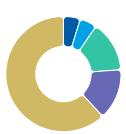  
◆ Mean ◆ MS Estimates
Source: Refinitiv, MS

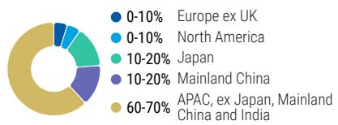

# Risk Reward – Powerchip Semiconductor Manufacturing Co (6770.TW)

## KEY EARNINGS INPUTS

<table><tr><td>Drivers</td><td>Dec 2025</td><td>Dec 2026e</td><td>Dec 2027e</td><td>Dec 2028e</td></tr><tr><td>Wafer shipment (k 8 inch)</td><td>2,614</td><td>2,881</td><td>2,965</td><td>755</td></tr><tr><td>Wafer ASP (USD)</td><td>457.7</td><td>474.7</td><td>517.3</td><td>522.0</td></tr><tr><td>Utilization rate (%) (%)</td><td>79.1</td><td>90.3</td><td>94.3</td><td>95.0</td></tr></table>

## INVESTMENT DRIVERS

\- Demand from consumer electronics clients

• Inventory in the supply chain

\- Utilization rate

\- Long-term agreements with clients

## GLOBAL REVENUE EXPOSURE

0-10% North America

10-20% Mainland China

\- 60-70% APAC, ex Japan, Mainland China and India

Source: MS Estimate View explanation of regional hierarchies here

## MS ALPHA MODELS

3/5 MOST 3 Month Horizon

Source: Refinitiv, FactSet, MS; 1 is the highest favored Quintile and 5 is the least favored Quintile

## RISKS TO PT/RATING

## RISKS TO UPSIDE

\- Pricing power is sustained in 2026.

\- Listing on main board attracts investment fund flows.

• Aluminum process enjoys higher margins.

## RISKS TO DOWNSIDE

\- Competition from China intensifies.

\- Price erosion is faster than expected.

\- Demand from consumer electronics clients weakens further.

\- Inventory in the supply chain takes longer to digest.

## OWNERSHIP POSITIONING

<table><tr><td>Inst. Owners, % Active</td><td>21.3%</td></tr></table>

Source: Refinitiv, MS  
FY Dec 2026e

## MS ESTIMATES VS. CONSENSUS

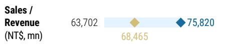

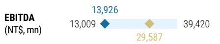

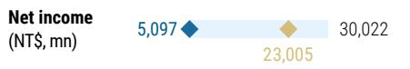

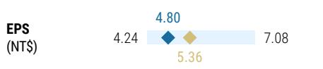

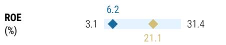

## PSMC: Financial Summary

Exhibit 30: Financial Summary

<table><tr><td colspan="5">Income Statement</td></tr><tr><td>NT$ mn (Years End Dec )</td><td>2025</td><td>2026e</td><td>2027e</td><td>2028e</td></tr><tr><td>Net sales</td><td>46,730</td><td>75,820</td><td>102,954</td><td>118,635</td></tr><tr><td>COGS</td><td>(48,267)</td><td>(59,037)</td><td>(61,951)</td><td>(67,843)</td></tr><tr><td>Gross profit</td><td>(1,537)</td><td>16,783</td><td>41,003</td><td>50,792</td></tr><tr><td>Operating expenses</td><td>(8,054)</td><td>5,847</td><td>(9,040)</td><td>(9,756)</td></tr><tr><td>R&amp;D</td><td>(5,257)</td><td>(6,581)</td><td>(5,320)</td><td>(5,640)</td></tr><tr><td>SG&amp;A</td><td>(2,797)</td><td>(3,840)</td><td>(4,920)</td><td>(5,316)</td></tr><tr><td>Operating income</td><td>(9,591)</td><td>22,630</td><td>31,964</td><td>41,036</td></tr><tr><td>Non-operating income</td><td>2,114</td><td>620</td><td>685</td><td>685</td></tr><tr><td>Pre-tax income</td><td>(7,477)</td><td>23,249</td><td>32,649</td><td>41,721</td></tr><tr><td>Income tax</td><td>(336)</td><td>(1,884)</td><td>(6,530)</td><td>(8,344)</td></tr><tr><td>Net income</td><td>(7,813)</td><td>21,365</td><td>26,119</td><td>33,377</td></tr><tr><td>Adj.wtd.avg.shrs (mn)</td><td>4,188</td><td>4,449</td><td>4,659</td><td>4,659</td></tr><tr><td>Reported EPS (NT$)</td><td>(1.87)</td><td>4.80</td><td>5.61</td><td>7.16</td></tr><tr><td>EPS for consensus (NT$)</td><td>(1.87)</td><td>4.80</td><td>5.61</td><td>7.16</td></tr></table>

Cash Flow Statement

<table><tr><td>NT$mn (Years End Dec )</td><td>2025</td><td>2026e</td><td>2027e</td><td>2028e</td></tr><tr><td>Cash flow from Operations</td><td>7,823</td><td>48,112</td><td>32,691</td><td>39,674</td></tr><tr><td>Net profits</td><td>(7,813)</td><td>21,360</td><td>26,113</td><td>33,370</td></tr><tr><td>Depreciation</td><td>9,283</td><td>7,564</td><td>7,465</td><td>5,594</td></tr><tr><td>Equity investment losses (income)</td><td>11</td><td>0</td><td>0</td><td>0</td></tr><tr><td>Other adjustments</td><td>6,343</td><td>19,188</td><td>(888)</td><td>710</td></tr><tr><td>Cash flow from Investing</td><td>3,554</td><td>41,439</td><td>(2,805)</td><td>(2,281)</td></tr><tr><td>Capex</td><td>(8,591)</td><td>(15,361)</td><td>(2,805)</td><td>(2,281)</td></tr><tr><td>Change of LT Investment</td><td>0</td><td>0</td><td>0</td><td>0</td></tr><tr><td>Change of ST Investment</td><td>12,145</td><td>0</td><td>0</td><td>0</td></tr><tr><td>Other adjustments</td><td>(0)</td><td>56,800</td><td>0</td><td>0</td></tr><tr><td>Cash flow from financing</td><td>(5,517)</td><td>59,944</td><td>25,991</td><td>24,564</td></tr><tr><td>Increase in L/T debt</td><td>6,140</td><td>0</td><td>0</td><td>0</td></tr><tr><td>Increase in S/T debt</td><td>0</td><td>3,000</td><td>3,000</td><td>3,000</td></tr><tr><td>Cash Dividend Paid</td><td>0</td><td>2,344</td><td>(6,409)</td><td>(7,836)</td></tr><tr><td>Dir&amp; Emp Bonus Paid</td><td>0</td><td>0</td><td>0</td><td>0</td></tr><tr><td>Issuance of stock</td><td>0</td><td>29,400</td><td>29,400</td><td>29,400</td></tr><tr><td>Dec/Inc-TreasureSt</td><td>0</td><td>25,200</td><td>0</td><td>0</td></tr><tr><td>Other Adjustments</td><td>(11,657)</td><td>0</td><td>0</td><td>0</td></tr><tr><td>Net change in cash</td><td>5,860</td><td>149,495</td><td>55,876</td><td>61,957</td></tr></table>

Balance Sheet

<table><tr><td>NT$mn (Years End Dec )</td><td>2025</td><td>2026e</td><td>2027e</td><td>2028e</td></tr><tr><td>Cash</td><td>16,789</td><td>166,284</td><td>222,160</td><td>284,117</td></tr><tr><td>Mkt Securities</td><td>2,800</td><td>2,800</td><td>2,800</td><td>2,800</td></tr><tr><td>AR/NR</td><td>6,550</td><td>4,846</td><td>6,581</td><td>7,583</td></tr><tr><td>Inventory</td><td>9,557</td><td>5,748</td><td>6,031</td><td>6,605</td></tr><tr><td>Other</td><td>8,451</td><td>8,451</td><td>8,451</td><td>8,451</td></tr><tr><td>Current Assets</td><td>44,148</td><td>188,129</td><td>246,023</td><td>309,556</td></tr><tr><td>Long-term investments</td><td>49</td><td>49</td><td>49</td><td>49</td></tr><tr><td>Fixed assets</td><td>122,004</td><td>109,520</td><td>104,861</td><td>101,547</td></tr><tr><td>Other assets</td><td>12,485</td><td>12,485</td><td>12,485</td><td>12,485</td></tr><tr><td>Total Assets</td><td>178,686</td><td>310,183</td><td>363,418</td><td>423,637</td></tr><tr><td>S/T borrowings</td><td>0</td><td>0</td><td>0</td><td>0</td></tr><tr><td>AP/NP</td><td>2,997</td><td>4,548</td><td>4,772</td><td>5,226</td></tr><tr><td>Other ST liabilities</td><td>19,789</td><td>34,912</td><td>38,818</td><td>43,650</td></tr><tr><td>LT debt</td><td>0</td><td>0</td><td>0</td><td>0</td></tr><tr><td>Other LT liabilities</td><td>73,900</td><td>73,900</td><td>73,900</td><td>73,900</td></tr><tr><td>Total Liabilities</td><td>96,685</td><td>113,360</td><td>117,491</td><td>122,776</td></tr><tr><td>Common shares</td><td>42,259</td><td>46,459</td><td>46,459</td><td>46,459</td></tr><tr><td>Retained earning</td><td>11,792</td><td>97,214</td><td>146,318</td><td>201,252</td></tr><tr><td>Other shareholders&#x27; equity</td><td>27,950</td><td>53,150</td><td>53,150</td><td>53,150</td></tr><tr><td>Total Equity</td><td>82,000</td><td>196,823</td><td>245,927</td><td>300,861</td></tr><tr><td>Total Liab. &amp; Shrhldr&#x27;s Equity</td><td>178,686</td><td>310,183</td><td>363,418</td><td>423,637</td></tr></table>

E = MS Estimates  
Source: MS, Company Data

Source: Company data, MS (E) estimates

<table><tr><td colspan="5">Financial Ratios</td></tr><tr><td></td><td>2025</td><td>2026e</td><td>2027e</td><td>2028e</td></tr><tr><td colspan="5">Growth(%)</td></tr><tr><td>Turnover</td><td>4.5</td><td>62.3</td><td>35.8</td><td>15.2</td></tr><tr><td>Operating profits</td><td>3.2</td><td>(335.9)</td><td>N/A</td><td>N/A</td></tr><tr><td>Pretax profits</td><td>9.4</td><td>(410.9)</td><td>40.4</td><td>27.8</td></tr><tr><td>Net profits</td><td>N/A</td><td>N/A</td><td>N/A</td><td>N/A</td></tr><tr><td>EPS</td><td>N/A</td><td>N/A</td><td>N/A</td><td>N/A</td></tr><tr><td colspan="5">Margins (%)</td></tr><tr><td>Gross Margin</td><td>(3.3)</td><td>22.1</td><td>39.8</td><td>42.8</td></tr><tr><td>Operating Margin</td><td>(20.5)</td><td>29.8</td><td>31.0</td><td>34.6</td></tr><tr><td>Pretax Margin</td><td>(16.0)</td><td>30.7</td><td>31.7</td><td>35.2</td></tr><tr><td>Net Profit</td><td>(16.7)</td><td>28.2</td><td>25.4</td><td>28.1</td></tr><tr><td colspan="5">Return (%)</td></tr><tr><td>ROAA</td><td>(4.3)</td><td>8.7</td><td>7.8</td><td>8.5</td></tr><tr><td>ROAE</td><td>(9.2)</td><td>15.3</td><td>11.8</td><td>12.2</td></tr><tr><td colspan="5">Gearing (%)</td></tr><tr><td>Net Debt/Equity</td><td>69.6</td><td>(46.9)</td><td>(60.3)</td><td>(69.9)</td></tr><tr><td>Liabilities/Equity</td><td>117.9</td><td>57.6</td><td>47.8</td><td>40.8</td></tr><tr><td colspan="5">Ratios (X)</td></tr><tr><td>Current ratio</td><td>1.9</td><td>4.8</td><td>5.6</td><td>6.3</td></tr><tr><td>Quick ratio</td><td>1.1</td><td>4.4</td><td>5.3</td><td>6.0</td></tr><tr><td colspan="5">Others</td></tr><tr><td>AR/NR Turnover (days)</td><td>23.3</td><td>23.3</td><td>23.3</td><td>23.3</td></tr><tr><td>Inventory Turnover (days)</td><td>35.5</td><td>35.5</td><td>35.5</td><td>35.5</td></tr><tr><td>AP Turnover (days)</td><td>28.1</td><td>28.1</td><td>28.1</td><td>28.1</td></tr><tr><td>Cash Conversion (days)</td><td>30.7</td><td>30.7</td><td>30.7</td><td>30.7</td></tr></table>

# Macronix: Earnings Estimate Revisions

We raise our 2026/27/28 EPS forecasts by 34%/20%/21%: This reflects stronger-than-expected memory pricing across NOR flash and SLC/MLC NAND. SLC/MLC NAND pricing is likely to continue rising into 4Q, following the 50–60% increase in 3Q. NOR pricing could increase by 30–40% in 3Q and extend into 4Q.

Exhibit 31: Macronix: Earnings Estimate Revisions

<table><tr><td>(NT$ mn)</td><td>New 2026e</td><td>Old 2026e</td><td>Diff.%</td><td>New 2027e</td><td>Old 2027e</td><td>Diff.%</td><td>New 2028e</td><td>Old 2028e</td><td>Diff.%</td></tr><tr><td>Net sales</td><td>77,854</td><td>66,682</td><td>17%</td><td>143,216</td><td>126,013</td><td>14%</td><td>144,185</td><td>127,564</td><td>13%</td></tr><tr><td>Gross profit</td><td>33,669</td><td>27,925</td><td>21%</td><td>72,197</td><td>61,874</td><td>17%</td><td>74,529</td><td>63,549</td><td>17%</td></tr><tr><td>Operating profit</td><td>22,733</td><td>16,970</td><td>34%</td><td>58,187</td><td>48,496</td><td>20%</td><td>60,159</td><td>49,869</td><td>21%</td></tr><tr><td>Pretax income</td><td>22,860</td><td>17,076</td><td>34%</td><td>58,171</td><td>48,421</td><td>20%</td><td>60,170</td><td>49,813</td><td>21%</td></tr><tr><td>Net income</td><td>19,377</td><td>14,478</td><td>34%</td><td>49,257</td><td>40,998</td><td>20%</td><td>50,950</td><td>42,178</td><td>21%</td></tr><tr><td>Diluted EPS</td><td>9.84</td><td>7.35</td><td>34%</td><td>25.02</td><td>20.82</td><td>20%</td><td>25.88</td><td>21.42</td><td>21%</td></tr><tr><td colspan="10">Margins</td></tr><tr><td>Gross margin</td><td>43.2%</td><td>41.9%</td><td>1.4 ppt</td><td>50.4%</td><td>49.1%</td><td>1.3 ppt</td><td>51.7%</td><td>49.8%</td><td>1.9 ppt</td></tr><tr><td>Operating margin</td><td>29.2%</td><td>25.4%</td><td>3.8 ppt</td><td>40.6%</td><td>38.5%</td><td>2.1 ppt</td><td>41.7%</td><td>39.1%</td><td>2.6 ppt</td></tr><tr><td>Pretax margin</td><td>29.4%</td><td>25.6%</td><td>3.8 ppt</td><td>40.6%</td><td>38.4%</td><td>2.2 ppt</td><td>41.7%</td><td>39.0%</td><td>2.7 ppt</td></tr><tr><td>Net margin</td><td>24.9%</td><td>21.7%</td><td>3.2 ppt</td><td>34.4%</td><td>32.5%</td><td>1.9 ppt</td><td>35.3%</td><td>33.1%</td><td>2.3 ppt</td></tr></table>

<table><tr><td>NT$</td><td>New &#x27;26E</td><td>Old &#x27;26E</td><td>Diff.</td><td>New &#x27;27E</td><td>Old &#x27;27E</td><td>Diff.</td><td>New &#x27;28E</td><td>Old &#x27;28E</td><td>Diff.</td></tr><tr><td>BVPS</td><td>31.41</td><td>28.92</td><td>9%</td><td>56.43</td><td>49.74</td><td>13%</td><td>82.30</td><td>71.17</td><td>16%</td></tr></table>

Source: Company data, MS (E) estimates

Exhibit 32: Macronix: Quarterly financials

<table><tr><td>(NT$ mn)</td><td>1Q26</td><td>2Q26e</td><td>3Q26e</td><td>4Q26e</td><td>1Q27e</td><td>2Q27e</td><td>3Q27e</td><td>4Q27e</td><td>1Q28e</td><td>2Q28e</td><td>3Q28e</td><td>4Q28e</td><td>2025</td><td>2026e</td><td>2027e</td><td>2028e</td></tr><tr><td>Total Revenues</td><td>10,469</td><td>14,309</td><td>20,894</td><td>32,181</td><td>34,004</td><td>36,865</td><td>36,197</td><td>36,150</td><td>36,106</td><td>36,064</td><td>36,025</td><td>35,989</td><td>28,880</td><td>77,854</td><td>143,216</td><td>144,185</td></tr><tr><td>Sequential Change</td><td>35.4%</td><td>36.7%</td><td>46.0%</td><td>54.0%</td><td>5.7%</td><td>8.4%</td><td>-1.8%</td><td>-0.1%</td><td>-0.1%</td><td>-0.1%</td><td>-0.1%</td><td>-0.1%</td><td></td><td></td><td></td><td></td></tr><tr><td>Change vs Year Ago</td><td>70.6%</td><td>110.5%</td><td>154.4%</td><td>316.4%</td><td>224.8%</td><td>157.6%</td><td>73.2%</td><td>12.3%</td><td>6.2%</td><td>-2.2%</td><td>-0.5%</td><td>-0.4%</td><td>11.6%</td><td>169.6%</td><td>84.0%</td><td>0.7%</td></tr><tr><td>Cost of Sales</td><td>(6,198)</td><td>(8,442)</td><td>(12,168)</td><td>(17,377)</td><td>(17,352)</td><td>(18,339)</td><td>(17,680)</td><td>(17,648)</td><td>(17,431)</td><td>(17,422)</td><td>(17,414)</td><td>(17,388)</td><td>(23,749)</td><td>(44,185)</td><td>(71,019)</td><td>(69,656)</td></tr><tr><td>Gross Profit</td><td>4,271</td><td>5,868</td><td>8,726</td><td>14,804</td><td>16,652</td><td>18,526</td><td>18,516</td><td>18,502</td><td>18,674</td><td>18,642</td><td>18,611</td><td>18,601</td><td>5,131</td><td>33,669</td><td>72,197</td><td>74,529</td></tr><tr><td>Gross Margin</td><td>40.8%</td><td>41.0%</td><td>41.8%</td><td>46.0%</td><td>49.0%</td><td>50.3%</td><td>51.2%</td><td>51.2%</td><td>51.7%</td><td>51.7%</td><td>51.7%</td><td>51.7%</td><td>17.8%</td><td>43.2%</td><td>50.4%</td><td>51.7%</td></tr><tr><td>Total Opex</td><td>(2,339)</td><td>(2,515)</td><td>(2,802)</td><td>(3,280)</td><td>(3,399)</td><td>(3,536)</td><td>(3,528)</td><td>(3,547)</td><td>(3,565)</td><td>(3,583)</td><td>(3,601)</td><td>(3,620)</td><td>(8,829)</td><td>(10,936)</td><td>(14,010)</td><td>(14,369)</td></tr><tr><td>Percent of Revenues</td><td>22.3%</td><td>17.6%</td><td>13.4%</td><td>10.2%</td><td>10.0%</td><td>9.6%</td><td>9.7%</td><td>9.8%</td><td>9.9%</td><td>9.9%</td><td>10.0%</td><td>10.1%</td><td>30.6%</td><td>14.0%</td><td>9.8%</td><td>10.0%</td></tr><tr><td>R&amp;D</td><td>(1,411)</td><td>(1,431)</td><td>(1,451)</td><td>(1,471)</td><td>(1,491)</td><td>(1,511)</td><td>(1,531)</td><td>(1,551)</td><td>(1,571)</td><td>(1,591)</td><td>(1,611)</td><td>(1,631)</td><td>(5,714)</td><td>(5,764)</td><td>(6,084)</td><td>(6,404)</td></tr><tr><td>Percent of Revenues</td><td>13.5%</td><td>10.0%</td><td>6.9%</td><td>4.6%</td><td>4.4%</td><td>4.1%</td><td>4.2%</td><td>4.3%</td><td>4.4%</td><td>4.4%</td><td>4.5%</td><td>4.5%</td><td>19.8%</td><td>7.4%</td><td>4.2%</td><td>4.4%</td></tr><tr><td>Sales and Marketing</td><td>(425)</td><td>(581)</td><td>(848)</td><td>(1,307)</td><td>(1,381)</td><td>(1,497)</td><td>(1,470)</td><td>(1,468)</td><td>(1,466)</td><td>(1,464)</td><td>(1,463)</td><td>(1,461)</td><td>(1,520)</td><td>(3,161)</td><td>(5,814)</td><td>(5,854)</td></tr><tr><td>Percent of Revenues</td><td>4.1%</td><td>4.1%</td><td>4.1%</td><td>4.1%</td><td>4.1%</td><td>4.1%</td><td>4.1%</td><td>4.1%</td><td>4.1%</td><td>4.1%</td><td>4.1%</td><td>4.1%</td><td>5.3%</td><td>4.1%</td><td>4.1%</td><td>4.1%</td></tr><tr><td>General and Admin</td><td>(503)</td><td>(503)</td><td>(503)</td><td>(503)</td><td>(528)</td><td>(528)</td><td>(528)</td><td>(528)</td><td>(528)</td><td>(528)</td><td>(528)</td><td>(528)</td><td>(1,594)</td><td>(2,011)</td><td>(2,112)</td><td>(2,112)</td></tr><tr><td>Percent of Revenues</td><td>4.8%</td><td>3.5%</td><td>2.4%</td><td>1.6%</td><td>1.6%</td><td>1.4%</td><td>1.5%</td><td>1.5%</td><td>1.5%</td><td>1.5%</td><td>1.5%</td><td>1.5%</td><td>5.5%</td><td>2.6%</td><td>1.5%</td><td>1.5%</td></tr><tr><td>Operating Income</td><td>1,933</td><td>3,353</td><td>5,924</td><td>11,524</td><td>13,253</td><td>14,991</td><td>14,988</td><td>14,955</td><td>15,110</td><td>15,059</td><td>15,010</td><td>14,981</td><td>(3,698)</td><td>22,733</td><td>58,187</td><td>60,159</td></tr><tr><td>Percent of Revenues</td><td>18.5%</td><td>23.4%</td><td>28.4%</td><td>35.8%</td><td>39.0%</td><td>40.7%</td><td>41.4%</td><td>41.4%</td><td>41.8%</td><td>41.8%</td><td>41.7%</td><td>41.6%</td><td>-12.8%</td><td>29.2%</td><td>40.6%</td><td>41.7%</td></tr><tr><td>Total Non-operating Income(Loss)</td><td>134</td><td>10</td><td>(9)</td><td>(8)</td><td>(7)</td><td>(4)</td><td>(3)</td><td>(2)</td><td>0</td><td>1</td><td>4</td><td>5</td><td>64</td><td>126</td><td>(16)</td><td>11</td></tr><tr><td>Profit Before Taxes</td><td>2,066</td><td>3,363</td><td>5,914</td><td>11,516</td><td>13,246</td><td>14,986</td><td>14,985</td><td>14,954</td><td>15,110</td><td>15,060</td><td>15,013</td><td>14,986</td><td>(3,633)</td><td>22,860</td><td>58,171</td><td>60,170</td></tr><tr><td>Percent of Revenues</td><td>19.7%</td><td>23.5%</td><td>28.3%</td><td>35.8%</td><td>39.0%</td><td>40.7%</td><td>41.4%</td><td>41.4%</td><td>41.8%</td><td>41.8%</td><td>41.7%</td><td>41.6%</td><td>-12.6%</td><td>29.4%</td><td>40.6%</td><td>41.7%</td></tr><tr><td>Change vs Year Ago</td><td>-313.2%</td><td>-338.9%</td><td>-720.0%</td><td>-3907.5%</td><td>541.0%</td><td>345.6%</td><td>153.4%</td><td>29.9%</td><td>14.1%</td><td>0.5%</td><td>0.2%</td><td>0.2%</td><td></td><td></td><td></td><td></td></tr><tr><td>Taxes</td><td>(287)</td><td>(515)</td><td>(905)</td><td>(1,762)</td><td>(2,027)</td><td>(2,293)</td><td>(2,288)</td><td>(2,312)</td><td>(2,304)</td><td>(2,297)</td><td>(2,293)</td><td>328</td><td>(3,468)</td><td>(8,900)</td><td>(9,206)</td><td></td></tr><tr><td>Tax Rate</td><td>-13.9%</td><td>15.3%</td><td>15.3%</td><td>15.3%</td><td>15.3%</td><td>15.3%</td><td>15.3%</td><td>15.3%</td><td>15.3%</td><td>15.3%</td><td>15.3%</td><td>9.0%</td><td>15.2%</td><td>15.3%</td><td>15.3%</td><td></td></tr><tr><td>Net Income, Cont Ops</td><td>1,779</td><td>2,849</td><td>5,009</td><td>9,754</td><td>11,220</td><td>12,694</td><td>12,692</td><td>12,666</td><td>12,798</td><td>12,756</td><td>12,716</td><td>12,693</td><td>(3,305)</td><td>19,391</td><td>49,271</td><td>50,964</td></tr><tr><td>Percent of Revenues</td><td>17.0%</td><td>19.9%</td><td>24.0%</td><td>30.3%</td><td>33.0%</td><td>34.4%</td><td>35.1%</td><td>35.0%</td><td>35.4%</td><td>35.4%</td><td>35.3%</td><td>35.3%</td><td>-11.4%</td><td>24.9%</td><td>34.4%</td><td>35.3%</td></tr><tr><td>Minority Interest</td><td>(4)</td><td>(4)</td><td>(4)</td><td>(4)</td><td>(4)</td><td>(4)</td><td>(4)</td><td>(4)</td><td>(4)</td><td>(4)</td><td>(4)</td><td>(4)</td><td>(3)</td><td>(14)</td><td>(14)</td><td>(14)</td></tr><tr><td>Reported Income (TW GAAP)</td><td>1,776</td><td>2,845</td><td>5,006</td><td>9,750</td><td>11,216</td><td>12,690</td><td>12,689</td><td>12,662</td><td>12,795</td><td>12,753</td><td>12,713</td><td>12,690</td><td>(3,308)</td><td>19,377</td><td>49,257</td><td>50,950</td></tr><tr><td>Percent of Revenues</td><td>17.0%</td><td>19.9%</td><td>24.0%</td><td>30.3%</td><td>33.0%</td><td>34.4%</td><td>35.1%</td><td>35.0%</td><td>35.4%</td><td>35.4%</td><td>35.3%</td><td>35.3%</td><td>-11.5%</td><td>24.9%</td><td>34.4%</td><td>35.3%</td></tr><tr><td>Change vs Year Ago</td><td>-303.4%</td><td>-322.9%</td><td>-679.9%</td><td>-3402.5%</td><td>531.6%</td><td>346.0%</td><td>153.5%</td><td>29.9%</td><td>14.1%</td><td>0.5%</td><td>0.2%</td><td>0.2%</td><td>2.9%</td><td>-685.8%</td><td>154.2%</td><td>3.4%</td></tr><tr><td>Reported Diluted EPS (NT$, TW GAAP)</td><td>0.90</td><td>1.44</td><td>2.54</td><td>4.95</td><td>5.70</td><td>6.44</td><td>6.44</td><td>6.43</td><td>6.50</td><td>6.48</td><td>6.46</td><td>6.44</td><td>(1.78)</td><td>9.84</td><td>25.02</td><td>25.88</td></tr><tr><td>Reported Basic EPS (NT$, GAAP)</td><td>0.90</td><td>1.44</td><td>2.54</td><td>4.95</td><td>5.70</td><td>6.44</td><td>6.44</td><td>6.43</td><td>6.50</td><td>6.48</td><td>6.46</td><td>6.44</td><td>(1.78)</td><td>9.84</td><td>25.02</td><td>25.88</td></tr></table>

Source: Company data, MS (E) estimates

## Macronix: Valuation Methodology

We raise our price target to NT\$220 from NT\$202: We continue to use a P/B multiple methodology to derive our price target, in line with our approach for Greater China memory IDM peers and in view of the industry's high volatility. Historically, forward P/B has had a similar trend vs. ROAE, and as we expect a net profit turnaround driven by elevated prices, we believe the stock will trade up to 7.0x 2026e BVPS (same as our prior target) vs. its historical band of 0.5x-1.5x since 2017.

We raise our bull case value to NT\$355, which is 11.3x our 2026e BVPS, and our bear case value to NT\$130, which is 4.1x our 2026e BVPS.

Exhibit 33: Forward P/B vs. ROAE  
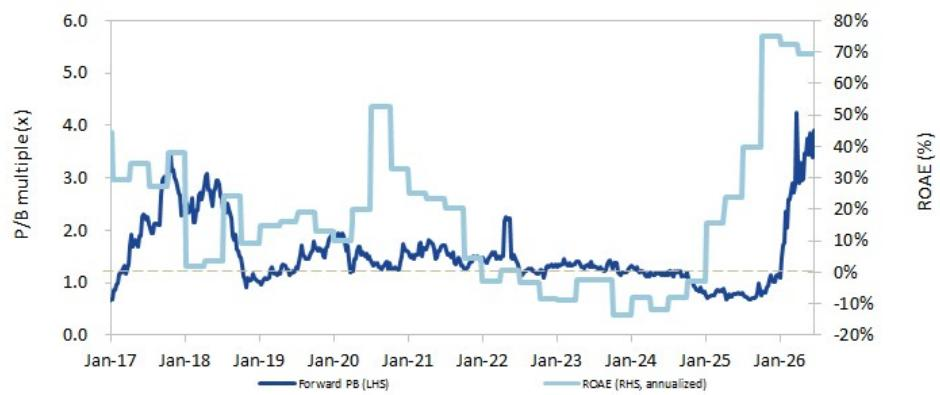  
Source: Factset, MS

Source: Refinitiv, MS

## Risk Reward – Macronix International Co Ltd (2337.TW) Top Pick

Top Pick; OW on legacy Flash opportunities

## PRICE TARGET NT\$220.00

Base case, P/B, in line with our Greater China memory coverage, due to the memory industry's cyclical nature. We apply a target multiple of 7.0x to our 2026 BVPS estimate, vs. its historical average of 1.5x since 2017. We continue to believe the P/B target is justifiable, as The MLC and legacy TLC NAND could be in greater shortage into 2H26, with under supply easily going up to 40%. The only supplier which could fill the gap remains Macronix.

Consensus Price Target Distribution

Source: Refinitiv, MS

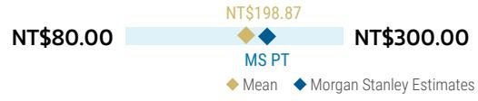

## RISK REWARD CHART

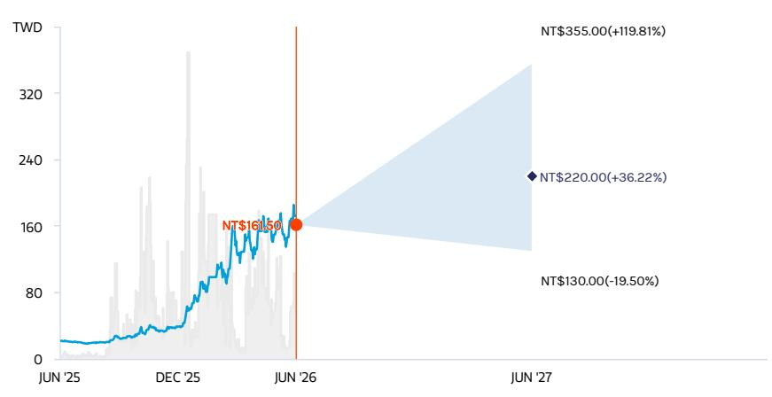  
Key: — Historical Stock Performance ● Current Stock Price ◆ Price Target  
Source: Refinitiv, MS

## OVERWEIGHT THESIS

■ MLC and legacy TLC NAND could be in greater shortage into 2H26, with under supply easily going up to 40%. The only supplier which could fill the gap in our view remains Macronix. Pricing for MLC and legacy TLC could could rise over 200% from 1Q26 to 4Q26.

■ We expect low-single-digit NOR undersupply throughout 2026, driven by capacity cannibalization from other high-margin products.

\- RÖM may benefit from the Nintendo Switch 2, which started selling in June 2025.
- We view the current P/B valuation as attractive given the strong near-term outlook.

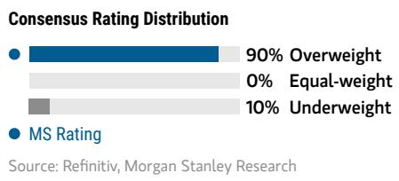

## Risk Reward Themes

View descriptions of Risk Rewards Themes here

## BULL CASE

## 11.3x 2026e BVPS

NT\$355.00

Higher than expected price hike for legacy NAND, and significant price hike for NOR throughout 2026: NAND revenue grows 1200%+, and NOR flash revenue grows 150%+ Y/Y in 2026.

## 7.0x 2026e BVPS

## NT\$220.00 BEAR CASE

Significant price hike for legacy NAND, and continued price hike for NOR throughout 2026: NAND revenue grows 833%, and NOR flash revenue grows 130% Y/Y in 2026.

NT\$130.00

## 4.1x 2026e BVPS

Moderate price hike for legacy NAND, and flattish price for NOR throughout 2026: NAND revenue grows <150%, and NOR flash revenue grows <80% Y/Y in 2026.

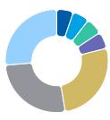  
Source: MS Estimate View explanation of regional hierarchies here

## Risk Reward – Macronix International Co Ltd (2337.TW)

## KEY EARNINGS INPUTS

<table><tr><td>Drivers</td><td>Dec 2025</td><td>Dec 2026e</td><td>Dec 2027e</td><td>Dec 2028e</td></tr><tr><td>NOR Flash pricing (NT$)</td><td>1,721</td><td>3,251</td><td>4,056</td><td>4,056</td></tr><tr><td>ROM sales (NT$, mn)</td><td>5,898</td><td>3,887</td><td>3,808</td><td>4,119</td></tr><tr><td>NAND sales (NT$, mn)</td><td>3,540</td><td>33,036</td><td>102,394</td><td>108,737</td></tr></table>

## INVESTMENT DRIVERS

\- NOR pricing trend

\- SLC NAND pricing

\- Peers' production expansion

## GLOBAL REVENUE EXPOSURE

## MS ALPHA MODELS

<table><tr><td>1/5 MOST</td><td>3 Month Horizon</td></tr></table>

Source: Refinitiv, FactSet, MS; 1 is the highest favored Quintile and 5 is the least favored Quintile

## RISKS TO PT/RATING

## RISKS TO UPSIDE

\- Wider legacy NAND supply / demand gap - NOR up-cycle, driven by limited supply expansion and/or stronger demand

\- Faster growth for Switch hardware and core titles

## RISKS TO DOWNSIDE

• Less severe legacy NAND supply / demand gap

\- NOR down-cycle, driven by faster supply expansion and/or demand weakness

\- Slower growth for Switch hardware and core titles

## OWNERSHIP POSITIONING

<table><tr><td>Inst. Owners, % Active</td><td>49.6%</td></tr></table>

Source: Refinitiv, MS

MS ESTIMATES VS. CONSENSUS  
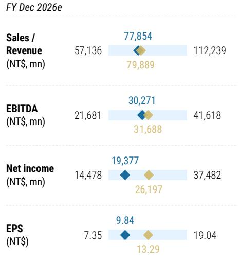  
◆ Mean ◆ MS Estimates  
Source: Refinitiv, MS

## Macronix: Financial Summary

Exhibit 34: Financial Summary

<table><tr><td colspan="5">Income Statement, 2025-2028e, Year End Dec</td></tr><tr><td>(NT$ mn)</td><td>2025</td><td>2026e</td><td>2027e</td><td>2028e</td></tr><tr><td>Turnover</td><td>28,880</td><td>77,854</td><td>143,216</td><td>144,185</td></tr><tr><td>YoY Growth</td><td>11.6%</td><td>169.6%</td><td>84.0%</td><td>0.7%</td></tr><tr><td>Less: COGS</td><td>(23,749)</td><td>(44,185)</td><td>(71,019)</td><td>(69,656)</td></tr><tr><td>Variable costs</td><td>(19,503)</td><td>(37,751)</td><td>(65,496)</td><td>(64,883)</td></tr><tr><td>Depreciation &amp; amort</td><td>(4,246)</td><td>(6,434)</td><td>(5,523)</td><td>(4,773)</td></tr><tr><td>Gross profit</td><td>5,131</td><td>33,669</td><td>72,197</td><td>74,529</td></tr><tr><td>YoY Growth</td><td>-15.9%</td><td>556.2%</td><td>114.4%</td><td>3.2%</td></tr><tr><td>% margin</td><td>17.8%</td><td>43.2%</td><td>50.4%</td><td>51.7%</td></tr><tr><td>Operating Expenses:</td><td>(8,829)</td><td>(10,936)</td><td>(14,010)</td><td>(14,369)</td></tr><tr><td>R&amp;D</td><td>(5,714)</td><td>(5,764)</td><td>(6,084)</td><td>(6,404)</td></tr><tr><td>Sales and Marketing</td><td>(1,520)</td><td>(3,161)</td><td>(5,814)</td><td>(5,854)</td></tr><tr><td>General and Admin</td><td>(1,594)</td><td>(2,011)</td><td>(2,112)</td><td>(2,112)</td></tr><tr><td>Operating Profit</td><td>(3,698)</td><td>22,733</td><td>58,187</td><td>60,159</td></tr><tr><td>YoY Growth</td><td>-5.8%</td><td>-714.8%</td><td>156.0%</td><td>3.4%</td></tr><tr><td>% margin</td><td>-12.8%</td><td>29.2%</td><td>40.6%</td><td>41.7%</td></tr><tr><td>Total Non-op</td><td>64</td><td>126</td><td>(16)</td><td>11</td></tr><tr><td>Pretax Profit</td><td>(3,633)</td><td>22,860</td><td>58,171</td><td>60,170</td></tr><tr><td>YoY Growth</td><td>2.5%</td><td>-729.2%</td><td>154.5%</td><td>3.4%</td></tr><tr><td>% margin</td><td>-12.6%</td><td>29.4%</td><td>40.6%</td><td>41.7%</td></tr><tr><td>Tax</td><td>328</td><td>(3,468)</td><td>(8,900)</td><td>(9,206)</td></tr><tr><td>Reported Net Income</td><td>(3,308)</td><td>19,377</td><td>49,257</td><td>50,950</td></tr><tr><td>Reported EPS (NT$)</td><td>(1.78)</td><td>9.84</td><td>25.02</td><td>25.88</td></tr><tr><td>ModelWare EPS (NT$)</td><td>(1.78)</td><td>9.84</td><td>25.02</td><td>25.88</td></tr></table>

<table><tr><td colspan="5">Balance sheet(NT$ mn)</td></tr><tr><td></td><td>2025</td><td>2026e</td><td>2027e</td><td>2028e</td></tr><tr><td colspan="5">Assets</td></tr><tr><td>Cash &amp; Equivalents</td><td>14,913</td><td>4,636</td><td>63,636</td><td>119,013</td></tr><tr><td>Marketable Security</td><td>7</td><td>7</td><td>7</td><td>7</td></tr><tr><td>A/R &amp; N/R</td><td>4,315</td><td>19,950</td><td>22,410</td><td>22,310</td></tr><tr><td>Inventories</td><td>9,813</td><td>42,109</td><td>42,766</td><td>42,136</td></tr><tr><td>Other Current Asset</td><td>190</td><td>190</td><td>190</td><td>190</td></tr><tr><td>Total current assets</td><td>29,425</td><td>67,078</td><td>129,195</td><td>183,843</td></tr><tr><td>LT Investment</td><td>6,618</td><td>6,613</td><td>6,609</td><td>6,607</td></tr><tr><td>Total Fixed Assets</td><td>38,549</td><td>53,012</td><td>48,299</td><td>44,466</td></tr><tr><td>Total Other Assets</td><td>3,909</td><td>3,909</td><td>3,909</td><td>3,909</td></tr><tr><td>Total Assets</td><td>78,500</td><td>130,612</td><td>188,012</td><td>238,824</td></tr><tr><td colspan="5"></td></tr><tr><td>A/P &amp; N/P</td><td>3,120</td><td>9,191</td><td>9,335</td><td>9,197</td></tr><tr><td>Accrued Expenses</td><td>0</td><td>0</td><td>0</td><td>0</td></tr><tr><td>Other Payable</td><td>1,877</td><td>1,877</td><td>1,877</td><td>1,877</td></tr><tr><td>Total Current Liab.</td><td>12,404</td><td>18,475</td><td>18,618</td><td>18,481</td></tr><tr><td>L-T Liabilities</td><td>17,386</td><td>47,386</td><td>55,386</td><td>55,386</td></tr><tr><td>Total Other L-T Liab</td><td>2,903</td><td>2,903</td><td>2,903</td><td>2,903</td></tr><tr><td>Total Liabilities</td><td>32,693</td><td>68,764</td><td>76,907</td><td>76,770</td></tr><tr><td colspan="5"></td></tr><tr><td>Common Stock</td><td>18,573</td><td>18,573</td><td>18,573</td><td>18,573</td></tr><tr><td>Preferred Stock</td><td></td><td></td><td></td><td></td></tr><tr><td>Capital Reserve</td><td>1,472</td><td>1,472</td><td>1,472</td><td>1,472</td></tr><tr><td>Retained earnings</td><td>25,916</td><td>41,957</td><td>91,213</td><td>142,163</td></tr><tr><td>Treasury Stock</td><td>(159)</td><td>(159)</td><td>(159)</td><td>(159)</td></tr><tr><td>Total Equity</td><td>45,808</td><td>61,848</td><td>111,105</td><td>162,054</td></tr></table>

<table><tr><td colspan="5">Key Ratios</td></tr><tr><td></td><td>2025</td><td>2026e</td><td>2027e</td><td>2028e</td></tr><tr><td colspan="5">Return (%)</td></tr><tr><td>ROAA</td><td>(0.0)</td><td>0.1</td><td>0.3</td><td>0.2</td></tr><tr><td>ROAE</td><td>(0.1)</td><td>0.2</td><td>0.4</td><td>0.4</td></tr><tr><td>OP. ATO</td><td>46.7%</td><td>62.0%</td><td>107.2%</td><td>111.5%</td></tr><tr><td colspan="5">Gearing (x)</td></tr><tr><td>Net Debt/ Equity</td><td>0.1x</td><td>0.7x</td><td>(0.1x)</td><td>(0.4x)</td></tr><tr><td>Current Ratio</td><td>2.4x</td><td>3.6x</td><td>6.9x</td><td>9.9x</td></tr><tr><td>Quick Ratio</td><td>1.6x</td><td>1.3x</td><td>4.6x</td><td>7.6x</td></tr><tr><td colspan="5">Operating Cycle</td></tr><tr><td>AR/NR Turnover (days)</td><td>115</td><td>80</td><td>54</td><td>56</td></tr><tr><td>Inventory Turnover (days)</td><td>330</td><td>279</td><td>215</td><td>219</td></tr><tr><td>AP Turnover (days)</td><td>77</td><td>63</td><td>47</td><td>48</td></tr><tr><td>Cash Conversion (days)</td><td>368</td><td>296</td><td>222</td><td>227</td></tr></table>

e = MS Estimates  
Source: Company Data, MS

Source: Company data, MS (E) estimates

<table><tr><td colspan="5">Cash Flow Statement</td></tr><tr><td>(NT$ mn)</td><td>2025</td><td>2026e</td><td>2027e</td><td>2028e</td></tr><tr><td>Net Income</td><td>(3,308)</td><td>19,377</td><td>49,257</td><td>50,950</td></tr><tr><td>Depreciation</td><td>5,094</td><td>7,537</td><td>6,470</td><td>5,591</td></tr><tr><td>Net Investment Losses (Gains)</td><td>(2)</td><td>0</td><td>0</td><td>0</td></tr><tr><td>Others</td><td>3,051</td><td>(41,854)</td><td>(2,969)</td><td>594</td></tr><tr><td>Cash Flow-Operating</td><td>4,835</td><td>(14,940)</td><td>52,758</td><td>57,135</td></tr><tr><td>(Purchase) of FA</td><td>(3,000)</td><td>(22,000)</td><td>(1,758)</td><td>(1,758)</td></tr><tr><td>Sale of Fix Asset</td><td>2</td><td>0</td><td>0</td><td>0</td></tr><tr><td>(Purchase)L-T Inv.</td><td>0</td><td>0</td><td>0</td><td>0</td></tr><tr><td>Sale of L-T Inv.</td><td>0</td><td>0</td><td>0</td><td>0</td></tr><tr><td>Sale(Pur.)S-T Inv.</td><td>144</td><td>0</td><td>0</td><td>0</td></tr><tr><td>Cash Flow-Investing</td><td>(2,884)</td><td>(22,000)</td><td>(1,758)</td><td>(1,758)</td></tr><tr><td>Inc(Dec)-S-T Debt</td><td>(2,488)</td><td>0</td><td>0</td><td>0</td></tr><tr><td>Dividend Paid</td><td>(3,337)</td><td>(3,337)</td><td>(3,337)</td><td>(3,337)</td></tr><tr><td>Dir.&amp;Emp.Bonus</td><td>0</td><td>0</td><td>0</td><td>0</td></tr><tr><td>Proceed from New Issue</td><td>0</td><td>0</td><td>0</td><td>0</td></tr><tr><td>Dec/Inc-TreasureSt</td><td>0</td><td>0</td><td>0</td><td>0</td></tr><tr><td>Others</td><td>2,884</td><td>30,000</td><td>8,000</td><td>0</td></tr><tr><td>Cash Flow-Financing</td><td>(2,941)</td><td>26,663</td><td>4,663</td><td>(3,337)</td></tr><tr><td>Change in Cash</td><td>3,289</td><td>(10,277)</td><td>55,663</td><td>52,040</td></tr><tr><td>Net cash/(debt), b/f</td><td>11,623</td><td>14,913</td><td>4,636</td><td>60,299</td></tr><tr><td>Net cash/(debt), c/f</td><td>14,913</td><td>4,636</td><td>60,299</td><td>112,339</td></tr></table>

## Risk Reward Reference links

1. View explanation of Options Probabilities methodology -

Options\_Probabilities\_Exhibit\_Link.pdf

2. View descriptions of Risk Rewards Themes - RR\_Themes\_Exhibit\_Link.pdf

3. View explanation of regional hierarchies - GEG\_Exhibit\_Link.pdf

4. View explanation of Theme/Exposure methodology -

ESG\_Sustainable\_Solutions\_External\_Link.pdf

5. View explanation of HERS methodology - ESG\_HERS\_External\_Link.pdf

## Disclosure Section

The information and opinions in MS were prepared or are disseminated by MS Asia Limited (which accepts the responsibility for its contents) and/or MS Asia (Singapore) Pte. (Registration number 199206298Z) and/or MS Asia (Singapore) Securities Pte Ltd (Registration number 200008434H), regulated by the Monetary Authority of Singapore (which accepts legal responsibility for its contents and should be contacted with respect to any matters arising from, or in connection with, MS), and/or MS Taiwan Limited and/or MS & Co International plc, Seoul Branch, and/or MS Australia Limited (A.B.N. 67 003 734 576, holder of Australian financial services license No. 233742, which accepts responsibility for its contents), and/or MS Wealth Management Australia Pty Ltd (A.B.N. 19 009 145 555, holder of Australian financial services license No. 240813, which accepts responsibility for its contents), and/or MS India Company Private Limited having Corporate Identification No (CIN) U22990MH1998PTC115305, regulated by the Securities and Exchange Board of India ("SEBI") and holder of licenses as a Research Analyst (SEBI Registration No. INH000001105); Stock Broker (SEBI Stock Broker Registration No. INZ000244438), Merchant Banker (SEBI Registration No. INM000011203), and depository participant with National Securities Depository Limited (SEBI Registration No. IN-DP-NSDL-567-2021) having registered office at Altimus, Level 39 & 40, Pandurang Budhkar Marg, Worli, Mumbai 400018, India; Telephone no. +91-22-61181000; Compliance Officer Details: Mr. Tejarshi Hardas, Tel. No.: +91-22-61181000 or Email: tejarshi.hardas@morganstanley.com; Grievance officer details: Mr. Tejarshi Hardas, Tel. No.: +91-22-61181000 or Email: msic-compliance@morganstanley.com which accepts the responsibility for its contents and should be contacted with respect to any matters arising from, or in connection with, MS, and their affiliates (collectively, "MS"). MS India Company Private Limited (MSICPL) may use AI tools in providing research services. All recommendations contained herein are made by the duly qualified research analysts.

For important disclosures, stock price charts and equity rating histories regarding companies that are the subject of this report, please see the MS Disclosure Website at www.morganstanley.com/eqr/disclosures/webapp/generalresearch, or contact your investment representative or MS at 1585 Broadway, (Attention: Research Management), New York, NY, 10036 USA.

For valuation methodology and risks associated with any recommendation, rating or price target referenced in this research report, please contact the Client Support Team as follows: US/Canada +1 800 303-2495; Hong Kong +852 2848-5999; Latin America +1 718 754-5444 (U.S.); London +44 (0)20-7425-8169; Singapore +65 6834-6860; Sydney +61 (0)2-9770-1505; Tokyo +81 (0)3-6836-9000. Alternatively you may contact your investment representative or MS at 1585 Broadway, (Attention: Research Management), New York, NY 10036 USA.

## Analyst Certification

The following analysts hereby certify that their views about the companies and their securities discussed in this report are accurately expressed and that they have not received and will not receive direct or indirect compensation in exchange for expressing specific recommendations or views in this report: Charlie Chan; Daisy Dai, CFA; Tiffany Yeh; Daniel Yen, CFA.

## Global Research Conflict Management Policy

MS has been published in accordance with our conflict management policy, which is available at www.morganstanley.com/institutional/research/conflictpolicies. A Portuguese version of the policy can be found at www.morganstanley.com.br

## Important Regulatory Disclosures on Subject Companies

As of May 29, 2026, MS beneficially owned 1% or more of a class of common equity securities of the following companies covered in MS: ACM Research Inc, Advanced Micro-Fabrication Equipment Inc, Advanced Wireless Semiconductor Co, Alchip Technologies Ltd, AllRing Tech Co., AP Memory Technology Corp, ASE Technology Holding Co. Ltd., ASMPT Ltd, Aspeed Technology, Cambricon Technology Corporation, Dosilicon Co Ltd, FOCI Fiber Optic Communications Inc, GigaDevice Semiconductor Beijing Inc, Global Unichip Corp, GlobalWafers Co Ltd, Gudeng Precision, Hon Precision, Hua Hong Semiconductor Ltd, King Yuan Electronics Co Ltd, Macronix International Co Ltd, MediaTek, Montage Technology Co Ltd, Nanya Technology Corp., NAURA Technology Group Co Ltd, Nuvoton Technology Corporation, Parade Technologies Ltd, Phison Electronics Corp, Realtek Semiconductor, Shanghai Fudan Microelectronics, Silergy Corp., Silicon Motion, TSMC, UMC, Vanguard International Semiconductor, WIN Semiconductors Corp, Winbond Electronics Corp, WinWay Technology Co Ltd, WPG Holdings, WT Microelectronics Co. Ltd..

Within the last 12 months, MS managed or co-managed a public offering (or 144A offering) of securities of Montage Technology Co Ltd, Powerchip Semiconductor Manufacturing Co.

Within the last 12 months, MS has received compensation for investment banking services from ASMPT Ltd, Montage Technology Co Ltd, Powerchip Semiconductor Manufacturing Co.

In the next 3 months, MS expects to receive or intends to seek compensation for investment banking services from Advanced Micro-Fabrication Equipment Inc, Alchip Technologies Ltd, AP Memory Technology Corp, ASE Technology Holding Co. Ltd., ASMedia Technology Inc, ASMPT Ltd, Aspeed Technology, Espressif Systems, GigaDevice Semiconductor Beijing Inc, GlobalWafers Co Ltd, Gudeng Precision, Himax Technologies Inc, Hua Hong Semiconductor Ltd, Iluvatar CoreX Semiconductor Co., Ltd., Innoscience, King Yuan Electronics Co Ltd, Macronix International Co Ltd, MediaTek, MetaX Integrated Circuits, Montage Technology Co Ltd, Novatek, Phison Electronics Corp, Powerchip Semiconductor Manufacturing Co, Realtek Semiconductor, Shenzhen Longsys Electronics Co Ltd, Silergy Corp., Silicon Motion, TSMC, UMC, Vanguard International Semiconductor, Winbond Electronics Corp, WinWay Technology Co Ltd, WPG Holdings, WT Microelectronics Co. Ltd..

Within the last 12 months, MS has received compensation for products and services other than investment banking services from ASE Technology Holding Co. Ltd., King Yuan Electronics Co Ltd, MediaTek, Nanya Technology Corp., Novatek, Nuvoton Technology Corporation, Realtek Semiconductor, Silicon Motion, SMIC, TSMC, UMC, Universal Scientific Ind. (Shanghai), Winbond Electronics Corp, WT Microelectronics Co. Ltd..

Within the last 12 months, MS has provided or is providing investment banking services to, or has an investment banking client relationship with, the following company: Advanced Micro-Fabrication Equipment Inc, Alchip Technologies Ltd, AP Memory Technology Corp, ASE Technology Holding Co. Ltd., ASMedia Technology Inc, ASMPT Ltd, Aspeed Technology, Espressif Systems, GigaDevice Semiconductor Beijing Inc, GlobalWafers Co Ltd, Gudeng Precision, Himax Technologies Inc, Hua Hong Semiconductor Ltd, Iluvatar CoreX Semiconductor Co., Ltd., Innoscience, King Yuan Electronics Co Ltd, Macronix International Co Ltd, MediaTek, MetaX Integrated Circuits, Montage Technology Co Ltd, Novatek, Phison Electronics Corp, Powerchip Semiconductor Manufacturing Co, Realtek Semiconductor, Shenzhen Longsys Electronics Co Ltd, Silergy Corp., Silicon Motion, TSMC, UMC, Vanguard International Semiconductor, Winbond Electronics Corp, WinWay Technology Co Ltd, WPG Holdings, WT Microelectronics Co. Ltd..

Within the last 12 months, MS has either provided or is providing non-investment banking, securities-related services to and/or in the past has entered into an agreement to provide services or has a client relationship with the following company: ASE Technology Holding Co. Ltd., King Yuan Electronics Co Ltd, MediaTek, Montage Technology Co Ltd, Nanya Technology Corp., Novatek, Nuvoton Technology Corporation, Realtek Semiconductor, Silicon Motion, SMIC, TSMC, UMC, Universal Scientific Ind. (Shanghai), Winbond Electronics Corp, WT Microelectronics Co. Ltd..

MS & Co. LLC makes a market in the securities of ACM Research Inc, Himax Technologies Inc, Silicon Motion.

The equity research analysts or strategists principally responsible for the preparation of MS have received compensation based upon various factors, including quality of research, investor client feedback, stock picking, competitive factors, firm revenues and overall investment banking revenues. Equity Research analysts' or strategists' compensation is not linked to investment banking or capital markets transactions performed by MS or the profitability or revenues of particular trading desks.

MS and its affiliates do business that relates to companies/instruments covered in MS, including market making, providing liquidity, fund management, commercial banking, extension of credit, investment services and investment banking. MS sells to and buys from customers the securities/instruments of companies covered in MS on a principal basis. MS may have a position in the debt of the Company or instruments discussed in this report. MS trades or may trade as principal in the debt securities (or in related derivatives) that are the subject of the debt research report.

Certain disclosures listed above are also for compliance with applicable regulations in non-US jurisdictions.

## STOCK RATINGS

MS uses a relative rating system using terms such as Overweight, Equal-weight, Not-Rated or Underweight (see definitions below). MS does not assign ratings of Buy, Hold or Sell to the stocks we cover. Overweight, Equal-weight, Not-Rated and Underweight are not the equivalent of buy, hold and sell. Investors should carefully read the definitions of all ratings used in MS. In addition, since MS contains more complete information concerning the analyst's views, investors should carefully read MS, in its entirety, and not infer the contents from the rating alone. In any case, ratings (or research) should not be used or relied upon as investment advice. An investor's decision to buy or sell a stock should depend on individual circumstances (such as the investor's existing holdings) and other considerations.

## Global Stock Ratings Distribution

## (as of May 31, 2026)

The Stock Ratings described below apply to MS's Fundamental Equity Research and do not apply to Debt Research produced by the Firm.

For disclosure purposes only (in accordance with FINRA requirements), we include the category headings of Buy, Hold, and Sell alongside our ratings of Overweight, Equal-weight, Not-Rated and Underweight. MS does not assign ratings of Buy, Hold or Sell to the stocks we cover. Overweight, Equal-weight, Not-Rated and Underweight are not the equivalent of buy, hold, and sell but represent recommended relative weightings (see definitions below). To satisfy regulatory requirements, we correspond Overweight, our most positive stock rating, with a buy recommendation; we correspond Equal-weight and Not-Rated to hold and Underweight to sell recommendations, respectively.

<table><tr><td></td><td colspan="2">Coverage Universe</td><td colspan="3">Investment Banking Clients (IBC)</td><td colspan="2">Other Material Investment ServicesClients (MISC)</td></tr><tr><td>Stock RatingCategory</td><td>Count</td><td>% of Total</td><td>Count</td><td>% of Total IBC</td><td>% of RatingCategory</td><td>Count</td><td>% of Total OtherMISC</td></tr><tr><td>Overweight/Buy</td><td>1542</td><td>42%</td><td>465</td><td>51%</td><td>30%</td><td>707</td><td>43%</td></tr><tr><td>Equal-weight/Hold</td><td>1571</td><td>43%</td><td>369</td><td>40%</td><td>23%</td><td>723</td><td>44%</td></tr><tr><td>Not-Rated/Hold</td><td>3</td><td>0%</td><td>0</td><td>0%</td><td>0%</td><td>1</td><td>0%</td></tr><tr><td>Underweight/Sell</td><td>551</td><td>15%</td><td>86</td><td>9%</td><td>16%</td><td>201</td><td>12%</td></tr><tr><td>Total</td><td>3,667</td><td></td><td>920</td><td></td><td></td><td>1632</td><td></td></tr></table>

Data include common stock and ADRs currently assigned ratings. Investment Banking Clients are companies from whom MS received investment banking compensation in the last 12 months. Due to rounding off of decimals, the percentages provided in the "% of total" column may not add up to exactly 100 percent.

## Analyst Stock Ratings

Overweight (O). The stock's total return is expected to exceed the average total return of the analyst's industry (or industry team's) coverage universe, on a risk-adjusted basis, over the next 12-18 months.

Equal-weight (E). The stock's total return is expected to be in line with the average total return of the analyst's industry (or industry team's) coverage universe, on a risk-adjusted basis, over the next 12-18 months.

Not-Rated (NR). Currently the analyst does not have adequate conviction about the stock's total return relative to the average total return of the analyst's industry (or industry team's) coverage universe, on a risk-adjusted basis, over the next 12-18 months.

Underweight (U). The stock's total return is expected to be below the average total return of the analyst's industry (or industry team's) coverage universe, on a risk-adjusted basis, over the next 12-18 months.

Unless otherwise specified, the time frame for price targets included in MS is 12 to 18 months.

## Analyst Industry Views

Attractive (A): The analyst expects the performance of his or her industry coverage universe over the next 12-18 months to be attractive vs. the relevant broad market benchmark, as indicated below.

In-Line (I): The analyst expects the performance of his or her industry coverage universe over the next 12-18 months to be in line with the relevant broad market benchmark, as indicated below. Cautious (C): The analyst views the performance of his or her industry coverage universe over the next 12-18 months with caution vs. the relevant broad market benchmark, as indicated below. Benchmarks for each region are as follows: North America - S&P 500; Latin America - relevant MSCI country index or MSCI Latin America Index; Europe - MSCI Europe; Japan - TOPIX; Asia - relevant MSCI country index or MSCI sub-regional index or MSCI AC Asia Pacific ex Japan Index.

## Important Disclosures for MS Smith Barney LLC Customers

Important disclosures regarding any material conflict of interest that can reasonably be expected to have influenced MS Smith Barney LLC's choice of a third-party research provider or the subject company of a third-party research report, are available on the MS Wealth Management disclosure website at www.morganstanley.com/online/researchdisclosures. For MS specific disclosures, you may refer to https://www.morganstanley.com/eqr/disclosures/webapp/generalresearch.

Each MS report is reviewed and approved on behalf of MS Smith Barney LLC. This review and approval is conducted by the same person who reviews the

research report on behalf of MS. This could create a conflict of interest.

## Other Important Disclosures

MS policy is to update research reports as and when the Research Analyst and Research Management deem appropriate, based on developments with the issuer, the sector, or the market that may have a material impact on the research views or opinions stated therein. In addition, certain Research publications are intended to be updated on a regular periodic basis (weekly/monthly/quarterly/annual) and will ordinarily be updated with that frequency, unless the Research Analyst and Research Management determine that a different publication schedule is appropriate based on current conditions.

MS is not acting as a municipal advisor and the opinions or views contained herein are not intended to be, and do not constitute, advice within the meaning of Section 975 of the Dodd-Frank Wall Street Reform and Consumer Protection Act.

MS produces an equity research product called a "Tactical Idea." Views contained in a "Tactical Idea" on a particular stock may be contrary to the recommendations or views expressed in research on the same stock. This may be the result of differing time horizons, methodologies, market events, or other factors. For all research available on a particular stock, please contact your sales representative or go to Matrix at http://www.morganstanley.com/matrix.

MS is provided to our clients through our proprietary research portal on Matrix and also distributed electronically by MS to clients. Certain, but not all, MS products are also made available to clients through third-party vendors or redistributed to clients through alternate electronic means as a convenience. For access to all available MS, please contact your sales representative or go to Matrix at http://www.morganstanley.com/matrix.

Any access and/or use of MS is subject to MS's Terms of Use (http://www.morganstanley.com/terms.html). By accessing and/or using MS, you are indicating that you have read and agree to be bound by our Terms of Use (http://www.morganstanley.com/terms.html). In addition you consent to MS processing your personal data and using cookies in accordance with our Privacy Policy and our Global Cookies Policy (http://www.morganstanley.com/privacy\_pledge.html), including for the purposes of setting your preferences and to collect readership data so that we can deliver better and more personalized service and products to you. To find out more information about how MS processes personal data, how we use cookies and how to reject cookies see our Privacy Policy and our Global Cookies Policy (http://www.morganstanley.com/privacy\_pledge.html). Please use the provided link to review the Terms and Conditions and Most Important Terms and Conditions for MS India Company Private Limited (https://www.morganstanley.com/assets/pdfs/about-us-global-offices/india/Terms\_and\_conditions.pdf) and the following link to review the audit report (https://ny.matrix.ms.com/eqr/research/webapp/researchdocs/MSICPL\_Morgan\_Stanley\_Research\_Audit\_Report.pdf).

If you do not agree to our Terms of Use and/or if you do not wish to provide your consent to MS processing your personal data or using cookies please do not access our research. MS does not provide individually tailored investment advice. MS has been prepared without regard to the circumstances and objectives of those who receive it. MS recommends that investors independently evaluate particular investments and strategies, and encourages investors to seek the advice of a financial adviser. The appropriateness of an investment or strategy will depend on an investor's circumstances and objectives. The securities, instruments, or strategies discussed in MS may not be suitable for all investors, and certain investors may not be eligible to purchase or participate in some or all of them. MS is not an offer to buy or sell or the solicitation of an offer to buy or sell any security/instrument or to participate in any particular trading strategy. The value of and income from your investments may vary because of changes in interest rates, foreign exchange rates, default rates, prepayment rates, securities/instruments prices, market indexes, operational or financial conditions of companies or other factors. There may be time limitations on the exercise of options or other rights in securities/instruments transactions. Past performance is not necessarily a guide to future performance. Estimates of future performance are based on assumptions that may not be realized. If provided, and unless otherwise stated, the closing price on the cover page is that of the primary exchange for the subject company's securities/instruments.

The fixed income research analysts, strategists or economists principally responsible for the preparation of MS have received compensation based upon various factors, including quality, accuracy and value of research, firm profitability or revenues (which include fixed income trading and capital markets profitability or revenues), client feedback and competitive factors. Fixed Income Research analysts', strategists' or economists' compensation is not linked to investment banking or capital markets transactions performed by MS or the profitability or revenues of particular trading desks.

The "Important Regulatory Disclosures on Subject Companies" section in MS lists all companies mentioned where MS owns 1% or more of a class of common equity securities of the companies. For all other companies mentioned in MS, MS may have an investment of less than 1% in securities/instruments or derivatives of securities/instruments of companies and may trade them in ways different from those discussed in MS. Employees of MS not involved in the preparation of MS may have investments in securities/instruments or derivatives of securities/instruments of companies mentioned and may trade them in ways different from those discussed in MS. Derivatives may be issued by MS or associated persons.

With the exception of information regarding MS, MS is based on public information. MS makes every effort to use reliable, comprehensive information, but we make no representation that it is accurate or complete. We have no obligation to tell you when opinions or information in MS change apart from when we intend to discontinue equity research coverage of a subject company. Facts and views presented in MS have not been reviewed by, and may not reflect information known to, professionals in other MS business areas, including investment banking personnel.

MS personnel may participate in company events such as site visits and are generally prohibited from accepting payment by the company of associated expenses unless pre-approved by authorized members of Research management.

MS may make investment decisions that are inconsistent with the recommendations or views in this report.

To our readers based in Taiwan or trading in Taiwan securities/instruments: Information on securities/instruments that trade in Taiwan is distributed by MS Taiwan Limited ("MSTL"). Such information is for your reference only. The reader should independently evaluate the investment risks and is solely responsible for their investment decisions. MS may not be distributed to the public media or quoted or used by the public media without the express written consent of MS. Any non-customer reader within the scope of Article 7-1 of the Taiwan Stock Exchange Recommendation Regulations accessing and/or receiving MS is not permitted to provide MS to any third party (including but not limited to related parties, affiliated companies and any other third parties) or engage in any activities regarding MS which may create or give the appearance of creating a conflict of interest. Information on securities/instruments that do not trade in Taiwan is for informational purposes only and is not to be construed as a recommendation or a solicitation to trade in such securities/instruments. MSTL may not execute transactions for clients in these securities/instruments.

Certain information in MS was sourced by employees of the Shanghai Representative Office of MS Asia Limited for the use of MS Asia Limited. MS is not incorporated under PRC law and the research in relation to this report is conducted outside the PRC. MS does not constitute an offer to sell or the solicitation of an offer to buy any securities in the PRC. PRC investors shall have the relevant qualifications to invest in such securities and shall be responsible for obtaining all relevant approvals, licenses, verifications and/or registrations from the relevant governmental authorities themselves. Neither this report nor any part of it is intended as, or shall constitute, provision of any consultancy or advisory service of securities investment as defined under PRC law. Such information is provided for your reference only.

MS is disseminated in Brazil by MS C.T.V.M. S.A. located at Av. Brigadeiro Faria Lima, 3600, 6th floor, São Paulo - SP, Brazil; and is regulated by the Comissão de Valores Mobiliários; in Mexico by MS México, Casa de Bolsa, S.A. de C.V which is regulated by Comision Nacional Bancaria y de Valores. Paseo de los Tamarindos 90, Torre 1, Col. Bosques de las Lomas Floor 29, 05120 Mexico City; in Japan by MS MUFG Securities Co., Ltd. and, for Commodities related research reports only, MS Capital Group Japan Co., Ltd; in Hong Kong by MS Asia Limited (which accepts responsibility for its contents) and by MS Bank Asia Limited; in Singapore by MS Asia (Singapore) Pte. (Registration number 199206298Z) and/or MS Asia (Singapore) Securities Pte Ltd (Registration number 200008434H), regulated by the Monetary Authority of Singapore (which accepts legal responsibility for its contents and should be contacted with respect to any matters arising from, or in connection with, MS) and by MS Bank Asia Limited, Singapore Branch (Registration number T14FC0118); in Australia to "wholesale clients" within the meaning of the Australian Corporations Act by MS Australia Limited A.B.N. 67 003 734 576, holder of Australian financial services license No. 233742, which accepts responsibility for its contents; in Australia to "wholesale clients" and "retail clients" within the meaning of the Australian Corporations Act by MS Wealth Management Australia Pty Ltd (A.B.N. 19 009 145 555, holder of Australian financial services license No. 240813, which accepts responsibility for its contents; in Korea by MS & Co International plc, Seoul Branch; in India by MS India Company Private Limited having Corporate Identification No (CIN) U22990MH1998PTC115305, regulated by the Securities and Exchange Board of India ("SEBI") and holder of licenses as a Research Analyst (SEBI Registration No. INH000001105); Stock Broker (SEBI Stock Broker Registration No. INZ000244438), Merchant Banker (SEBI Registration No. INM000011203), and depository participant with National Securities Depository Limited (SEBI Registration No. IN-DP-NSDL-567-2021) having registered office at Altimus, Level 39 & 40, Pandurang Budhkar Marg, Worli, Mumbai 400018, India; Telephone no. +91-22-61181000; Compliance Officer Details: Mr. Tejarshi Hardas, Tel. No.: +91-22-61181000 or Email: tejarshi.hardas@morganstanley.com; Grievance officer details: Mr. Tejarshi Hardas, Tel. No.: +91-22-61181000 or Email: msic-compliance@morganstanley.com. MS India Company Private Limited (MSICPL) may use AI tools in providing research services. All recommendations contained herein are made by the duly qualified research analysts; in Canada by MS Canada Limited; in Germany and the European Economic Area where required by MS Europe S.E., authorised and regulated by Bundesanstalt fuer Finanzdienstleistungsaufsicht (BaFin) under the reference number 149169; in the US by MS & Co. LLC, which accepts responsibility for its contents. MS & Co. International plc, authorized by the Prudential Regulation Authority and regulated by the Financial Conduct Authority and the Prudential Regulation Authority, disseminates in the UK research that it has prepared, and research which has been prepared by any of its affiliates, only to persons who (i) are investment professionals falling within Article 19(5) of the Financial Services and Markets Act 2000 (Financial Promotion) Order 2005 (as amended, the "Order"); (ii) are persons who are high net worth entities falling within Article 49(2)(a) to (d) of the Order; or (iii) are persons to whom an invitation or inducement to engage in investment activity (within the meaning of section 21 of the Financial Services and Markets Act 2000, as amended) may otherwise lawfully be communicated or caused to be communicated. RMB MS Proprietary Limited is a member of the JSE Limited and A2X (Pty) Ltd. RMB MS Proprietary Limited is a joint venture owned equally by MS International Holdings Inc. and RMB Investment Advisory (Proprietary) Limited, which is wholly owned by FirstRand Limited. The information in MS is being disseminated by MS Saudi Arabia, regulated by the Capital Market Authority in the Kingdom of Saudi Arabia, and is directed at Sophisticated investors only.

MS Hong Kong Securities Limited is the liquidity provider/market maker for securities of ASMPT Ltd, Hua Hong Semiconductor Ltd listed on the Stock Exchange of Hong Kong Limited. An updated list can be found on HKEx website: http://www.hkex.com.hk.

The information in MS is being communicated by MS & Co. International plc (DIFC Branch), regulated by the Dubai Financial Services Authority (the DFSA) or by MS & Co. International plc (ADGM Branch), regulated by the Financial Services Regulatory Authority Abu Dhabi (the FSRA), and is directed at Professional Clients only, as defined by the DFSA or the FSRA, respectively. The financial products or financial services to which this research relates will only be made available to a customer who we are satisfied meets the regulatory criteria of a Professional Client. A distribution of the different MS Research ratings or recommendations, in percentage terms for Investments in each sector covered, is available upon request from your sales representative.

The information in MS is being communicated by MS & Co. International plc (QFC Branch), regulated by the Qatar Financial Centre Regulatory Authority (the QFCRA), and is directed at business customers and market counterparties only and is not intended for Retail Customers as defined by the QFCRA.

As required by the Capital Markets Board of Turkey, investment information, comments and recommendations stated here, are not within the scope of investment advisory activity. Investment advisory service is provided exclusively to persons based on their risk and income preferences by the authorized firms. Comments and recommendations stated here are general in nature. These opinions may not fit to your financial status, risk and return preferences. For this reason, to make an investment decision by relying solely to this information stated here may not bring about outcomes that fit your expectations.

The trademarks and service marks contained in MS are the property of their respective owners. Third-party data providers make no warranties or representations relating to the accuracy, completeness, or timeliness of the data they provide and shall not have liability for any damages relating to such data. The Global Industry Classification Standard (GICS) was developed by and is the exclusive property of MSCI and S&P.

MS, or any portion thereof may not be reprinted, sold or redistributed without the written consent of MS.

Indicators and trackers referenced in MS may not be used as, or treated as, a benchmark under Regulation EU 2016/1011, or any other similar framework.

The issuers and/or fixed income products recommended or discussed in certain fixed income research reports may not be continuously followed. Accordingly, investors should regard those fixed income research reports as providing stand-alone analysis and should not expect continuing analysis or additional reports relating to such issuers and/or individual fixed income products. MS may hold, from time to time, material financial and commercial interests regarding the company subject to the Research report.

Registration granted by SEBI and certification from the National Institute of Securities Markets (NISM) in no way guarantee performance of the intermediary or provide any assurance of returns to investors. Investment in securities market are subject to market risks. Read all the related documents carefully before investing.

INDUSTRY COVERAGE: Greater China Technology Semiconductors

<table><tr><td>COMPANY (TICKER)</td><td>RATING (AS OF)</td><td>PRICE* (06/25/2026)</td></tr><tr><td colspan="3">Charlie Chan</td></tr><tr><td>ACM Research Inc (ACMR.O)</td><td>O (03/07/2023)</td><td>US$101.60</td></tr><tr><td>Advanced Micro-Fabrication Equipment Inc (688012.SS)</td><td>O (11/06/2023)</td><td>Rmb399.13</td></tr><tr><td>Advanced Wireless Semiconductor Co (8086.TWO)</td><td>U (07/14/2025)</td><td>NT$150.50</td></tr><tr><td>Alchip Technologies Ltd (3661.TW)</td><td>O (05/14/2021)</td><td>NT$4,230.00</td></tr><tr><td>ASE Technology Holding Co. Ltd. (3711.TW)</td><td>O (09/15/2024)</td><td>NT$641.00</td></tr><tr><td>Cambricon Technology Corporation (688256.SS)</td><td>O (04/27/2026)</td><td>Rmb1,505.00</td></tr><tr><td>Global Unichip Corp (3443.TW)</td><td>O (06/24/2026)</td><td>NT$4,850.00</td></tr><tr><td>GlobalWafers Co Ltd (6488.TWO)</td><td>E (05/19/2026)</td><td>NT$1,040.00</td></tr><tr><td>Gudeng Precision (3680.TWO)</td><td>O (11/25/2025)</td><td>NT$505.00</td></tr><tr><td>Hua Hong Semiconductor Ltd (1347.HK)</td><td>E (03/12/2026)</td><td>HK$192.80</td></tr><tr><td>Iluvatar CoreX Semiconductor Co., Ltd. (9903.HK)</td><td>O (04/27/2026)</td><td>HK$793.00</td></tr><tr><td>King Yuan Electronics Co Ltd (2449.TW)</td><td>O (03/03/2023)</td><td>NT$334.50</td></tr><tr><td>Maxscend Microelectronics Co Ltd (300782.SZ)</td><td>U (01/11/2021)</td><td>Rmb111.32</td></tr><tr><td>MediaTek (2454.TW)</td><td>O (11/28/2025)</td><td>NT$4,310.00</td></tr><tr><td>MetaX Integrated Circuits (688802.SS)</td><td>E (04/27/2026)</td><td>Rmb770.52</td></tr><tr><td>Nanya Technology Corp. (2408.TW)</td><td>O (05/28/2026)</td><td>NT$477.00</td></tr><tr><td>NAURA Technology Group Co Ltd (002371.SZ)</td><td>O (11/06/2023)</td><td>Rmb798.00</td></tr><tr><td>OmniVision Integrated Circuits Group Inc (603501.SS)</td><td>E (11/17/2025)</td><td>Rmb89.71</td></tr><tr><td>Phison Electronics Corp (8299.TWO)</td><td>E (02/25/2026)</td><td>NT$2,475.00</td></tr><tr><td>SG Micro Corp. (300661.SZ)</td><td>E (11/03/2025)</td><td>Rmb138.28</td></tr><tr><td>Silergy Corp. (6415.TW)</td><td>U (05/19/2026)</td><td>NT$615.00</td></tr><tr><td>SMIC (0981.HK)</td><td>O (10/21/2025)</td><td>HK$86.00</td></tr><tr><td>TSMC (2330.TW)</td><td>O (02/07/2022)</td><td>NT$2,390.00</td></tr><tr><td>UMC (2303.TW)</td><td>O (05/19/2026)</td><td>NT$178.50</td></tr><tr><td>Vanguard International Semiconductor (5347.TWO)</td><td>E (01/14/2026)</td><td>NT$220.00</td></tr><tr><td>WIN Semiconductors Corp (3105.TWO)</td><td>U (07/14/2025)</td><td>NT$463.00</td></tr><tr><td colspan="3">Daisy Dai, CFA</td></tr><tr><td>ASMPT Ltd (0522.HK)</td><td>O (07/24/2025)</td><td>HK$204.80</td></tr><tr><td>China Resources Microelectronics Limited (688396.SS)</td><td>U (03/02/2026)</td><td>Rmb84.72</td></tr><tr><td>Elan Microelectronics Corp (2458.TW)</td><td>O (10/03/2025)</td><td>NT$180.00</td></tr><tr><td>Empyrean Technology Co Ltd (301269.SZ)</td><td>E (01/17/2025)</td><td>Rmb110.10</td></tr><tr><td>Hangzhou Silan Microelectronics Co. Ltd. (600460.SS)</td><td>U (08/25/2025)</td><td>Rmb49.86</td></tr><tr><td>Innoscience (2577.HK)</td><td>E (10/13/2025)</td><td>HK$67.20</td></tr><tr><td>JCET Group Co Ltd (600584.SS)</td><td>E (01/16/2026)</td><td>Rmb104.17</td></tr><tr><td>Shanghai Fudan Microelectronics (1385.HK)</td><td>O (03/07/2025)</td><td>HK$28.24</td></tr><tr><td>SICC Co Ltd (688234.SS)</td><td>O (03/20/2026)</td><td>Rmb172.28</td></tr><tr><td>StarPower Semiconductor Ltd (603290.SS)</td><td>E (05/14/2026)</td><td>Rmb138.22</td></tr><tr><td>Unigroup Guoxin Microelectronics Co Ltd (002049.SZ)</td><td>U (01/10/2023)</td><td>Rmb87.50</td></tr><tr><td>Universal Scientific Ind. (Shanghai) (601231.SS)</td><td>O (11/05/2025)</td><td>Rmb36.19</td></tr><tr><td>Yangjie Technology (300373.SZ)</td><td>O (06/10/2022)</td><td>Rmb137.45</td></tr><tr><td colspan="3">Daniel Yen, CFA</td></tr><tr><td>AP Memory Technology Corp (6531.TW)</td><td>O (07/11/2025)</td><td>NT$1,100.00</td></tr><tr><td>ASMedia Technology Inc (5269.TW)</td><td>U (10/03/2025)</td><td>NT$1,435.00</td></tr><tr><td>Aspeed Technology (5274.TWO)</td><td>O (06/09/2025)</td><td>NT$17,425.00</td></tr><tr><td>Egis Technology Inc (6462.TWO)</td><td>E (01/28/2026)</td><td>NT$124.50</td></tr><tr><td>Espressif Systems (688018.SS)</td><td>O (05/15/2023)</td><td>Rmb124.23</td></tr><tr><td>GigaDevice Semiconductor Beijing Inc (603986.SS)</td><td>O (05/15/2025)</td><td>Rmb775.21</td></tr><tr><td>Macronix International Co Ltd (2337.TW)</td><td>O (09/18/2025)</td><td>NT$161.50</td></tr><tr><td>Montage Technology Co Ltd (6809.HK)</td><td>O (03/18/2026)</td><td>HK$459.00</td></tr><tr><td>Montage Technology Co Ltd (688008.SS)</td><td>O (03/18/2026)</td><td>Rmb279.16</td></tr><tr><td>Novatek (3034.TW)</td><td>U (02/04/2026)</td><td>NT$561.00</td></tr><tr><td>Nuvoton Technology Corporation (4919.TW)</td><td>U (11/10/2025)</td><td>NT$177.50</td></tr><tr><td>Parade Technologies Ltd (4966.TWO)</td><td>O (05/27/2026)</td><td>NT$658.00</td></tr><tr><td>Powerchip Semiconductor Manufacturing Co (6770.TW)</td><td>O (10/27/2025)</td><td>NT$83.20</td></tr><tr><td>Realtek Semiconductor (2379.TW)</td><td>E (01/30/2026)</td><td>NT$814.00</td></tr><tr><td>Shenzhen Goodix Technology Co Ltd (603160.SS)</td><td>U (07/14/2025)</td><td>Rmb59.81</td></tr><tr><td>Winbond Electronics Corp (2344.TW)</td><td>O (05/28/2026)</td><td>NT$219.50</td></tr><tr><td>WPG Holdings (3702.TW)</td><td>O (03/16/2026)</td><td>NT$107.00</td></tr><tr><td>WT Microelectronics Co. Ltd. (3036.TW)</td><td>O (01/27/2026)</td><td>NT$217.50</td></tr><tr><td colspan="3">Duan Liu</td></tr><tr><td>Dosilicon Co Ltd (688110.SS)</td><td>U (09/06/2024)</td><td>Rmb179.45</td></tr><tr><td>Shenzhen Longsys Electronics Co Ltd (301308.SZ)</td><td>E (02/25/2026)</td><td>Rmb677.30</td></tr><tr><td colspan="3">Tiffany Yeh</td></tr><tr><td>AllRing Tech Co. (6187.TWO)</td><td>O (09/23/2025)</td><td>NT$1,105.00</td></tr><tr><td>FOCI Fiber Optic Communications Inc (3363.TWO)</td><td>O (01/15/2025)</td><td>NT$629.00</td></tr><tr><td>Himax Technologies Inc (HIMX.O)</td><td>E (02/04/2026)</td><td>US$15.73</td></tr><tr><td>Hon Precision (7769.TW)</td><td>O (04/17/2026)</td><td>NT$6,920.00</td></tr><tr><td>MPI Corporation (6223.TWO)</td><td>O (04/17/2026)</td><td>NT$6,905.00</td></tr><tr><td>Silicon Motion (SIMO.O)</td><td>O (05/06/2024)</td><td>US$321.66</td></tr><tr><td>WinWay Technology Co Ltd (6515.TW)</td><td>O (04/17/2026)</td><td>NT$9,100.00</td></tr></table>

Stock Ratings are subject to change. Please see latest research for each company.  
\* Historical prices are not split adjusted.

## © 2026 MS