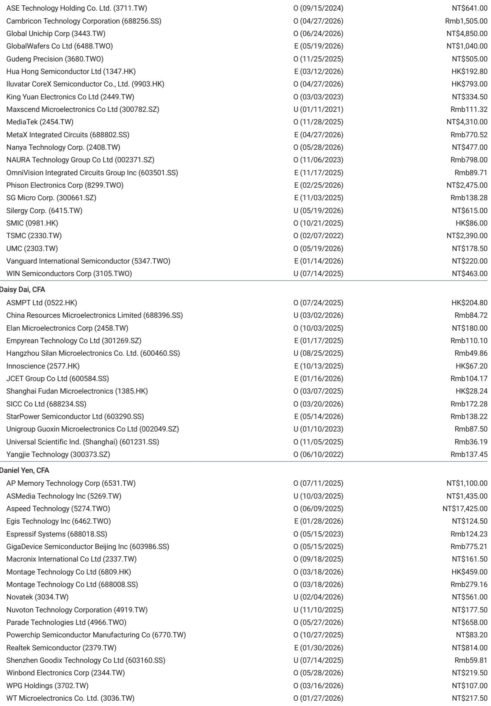
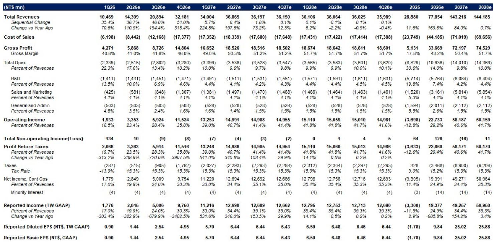
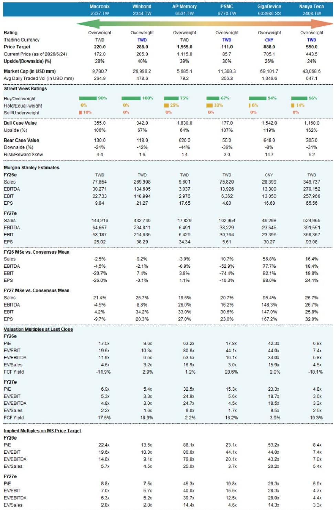

# 摩根斯坦利：MS：旧存储芯片正经历一场被低估的恐慌性采购

市场当下的注意力几乎全部集中在HBM、DDR5和先进封装上。但MS一份最新报告揭示了一个反直觉的判断：真正让企业客户陷入“恐慌性购买”的，不是最前沿的存储芯片，而是被视为“旧时代”的DDR4、NOR Flash和SLC NAND。

这份由Daniel Yen、Charlie Chan等分析师联合署名的研报，将华邦电、南亚科、旺宏、兆易创新和力积电的目标价全面上调，并在标题中直言：“Old Memory: Better to buy more”。

这不是一次简单的补库存周期。这是一场由供给结构性收缩、需求意外扩张和客户行为突变共同驱动的错配。它在告诉我们：旧存储芯片的紧俏，可能比市场预期的更持久、更深刻。

## 1. DDR4的紧俏正在从“涨价”演变为“囤积”，企业客户的行为已经发生变化

MS在5月底将南亚科和华邦电上调至增持时，市场看到的还是DDR4价格连续双位数月涨幅的“涨价故事”。但到了6月底，情况已经升级。

报告明确指出，企业客户正在“as early as possible securing supply amid fears of shortages”。渠道库存已经降至两周以下。这不再是简单的供需缺口，而是客户心态的转变——从“等降价再买”变成了“先锁定产能再说”。

这种恐慌性采购的后果是什么？它意味着即使后续实际需求没有爆发式增长，企业客户为了自保也会建立更高的安全库存。这种“需求缓冲”一旦形成，就会把原本可能只是几个季度的涨价周期拉长，并放大价格弹性。

> **KC评论：** 传统上，存储芯片的涨价周期往往在客户开始“double ordering”时见顶。但这一次，DDR4的供给端没有大规模扩产计划，而企业客户的订单行为已经提前“抢跑”。这轮涨价是否会在四季度之后继续，取决于企业客户的库存行为是否会从“恐慌”回归“理性”。完整报告中的Exhibit 4和Exhibit 5提供了DDR4供需季度模型和价格与供需比率的历史关系，这些图表可以帮助你判断当前的错配程度是否已经超出历史区间。

## 2. MLC NAND短缺倒逼硬盘厂商转向SLC NAND，一个被忽视的需求放大器

报告中最具洞察力的一个判断来自SLC NAND。MS指出，由于MLC NAND供给短缺，企业级HDD正在被迫从MLC NAND转向高密度SLC NAND。

这件事为什么重要？企业级HDD过去一直使用MLC NAND来存储固件、热数据和缺陷映射。现在MLC NAND缺了，HDD厂商只能求助于SLC NAND。而SLC NAND此前已经在数据中心eSSD领域获得了新的应用场景。

这意味着SLC NAND的需求端出现了一个“双重增量”：一是来自HDD的被动替代，二是来自eSSD的主动升级。报告预计SLC NAND在3季度涨价50-60%之后，4季度仍将继续上行。

> **KC评论：** 这个逻辑链条非常有意思。MLC NAND的短缺，居然成为了SLC NAND需求扩张的催化剂。它本质上是一个“跨产品替代效应”，在存储芯片的定价体系中并不常见。完整报告中对SLC NAND在HDD和eSSD两个场景下的用量拆解，是理解这个增量到底有多大的关键。

## 3. NOR Flash供给正在被美光主动收缩，而需求端却迎来Vera Rubin机柜的拉动

NOR Flash是这份报告中最被低估的品种。MS看到两个方向的力量在同时作用。

供给端，美光正在减少2H的NOR供应，很可能将产能重新分配给DRAM和NAND。这意味着全球NOR Flash的供给越来越集中在台湾厂商手中，尤其是旺宏。

需求端，Vera Rubin机柜的爬坡将在2H开始，每个机柜的NOR用量比Grace Blackwell机柜高出50%以上。这是一个典型的“AI基建溢出效应”——AI服务器不仅需要HBM和DDR5，还需要大量的NOR Flash来承载控制代码和固件。

在这两股力量作用下，报告预计NOR Flash在3季度涨价30-40%，并延续到4季度。

> **KC评论：** 旺宏是这一轮NOR涨价最直接的受益者。但这里有一个关键问题：美光退出NOR产能是临时调整还是长期战略？如果美光未来重新回归，NOR的供给格局就会发生变化。完整报告中的Exhibit 2和Exhibit 3给出了NOR Flash供需增长率的详细分解，可以帮助你判断这次涨价的结构性支撑到底有多强。

## 4. 报告尚未完全回答的关键问题：这轮涨价周期何时会遭遇需求端的“反噬”

MS的报告在逻辑上非常完整，但有一个问题没有被充分展开：当DDR4、SLC NAND和NOR Flash的价格持续上涨到一定水平后，企业客户是否会开始主动削减需求或寻找替代方案？

DDR4的价格上涨已经非常猛烈。如果DDR4的价格接近甚至超过DDR5，企业客户可能会加速向DDR5的迁移，从而在某个时点削弱DDR4的需求弹性。同样，NOR Flash的涨价如果传导到终端产品，OEM厂商是否会修改设计以降低NOR用量？

这不是否定报告的判断，而是提醒我们：任何涨价周期都有其内在的“天花板”。这个天花板在哪里，取决于下游客户的成本承受能力和技术替代的可行性。报告没有给出这个“天花板”的具体测算，而这恰恰是读者在做出投资决策前需要自己判断的。

## 5. 给读者的观察框架：三个信号决定这轮周期的长度和高度

基于MS的逻辑，我们可以提炼出一个三因素的观察框架，用来跟踪这轮旧存储芯片周期的演变：

第一，企业客户的库存行为。如果渠道库存从两周以下回升到四周以上，且企业客户停止“恐慌性采购”转为观望，那么涨价的斜率可能会放缓。这是最领先的指标。

第二，美光在NOR和MLC NAND上的产能策略。美光是否会在2H之后重新增加NOR供应，或者MLC NAND的短缺是否会在2027年得到缓解，将直接决定台湾厂商的议价能力。

第三，DDR5的价格走势和渗透率。DDR5的价格如果持续下行，会加速企业客户从DDR4向DDR5的迁移，从而在某个时点成为DDR4需求的“终结者”。报告中对DDR5的价格图表（Exhibit 9）值得持续跟踪。

这三个信号，比任何单一公司的季度业绩更能告诉你周期的位置。

---

MS这份报告的完整价值，在于它把DDR4、SLC NAND和NOR Flash这三个看似独立的涨价故事，串成了一个统一的逻辑：旧存储芯片的供给正在被结构性压缩，而需求端却因为AI基建溢出、替代效应和恐慌性采购而意外扩张。

但周期总有转折。什么时候转折，取决于我们上面提到的三个信号。

在投资和产业决策中，最危险的事情不是错过一个机会，而是把一个周期性涨价故事，错当成结构性成长故事来估值。

如果你想继续讨论这三个信号的实时变化，或者想看到每天由AI agent加上人工review生成的国际投行中文摘要与KC评论（daily更新约10-40页，包含当天最新数据图表合集），欢迎来我们的星球微信群里继续交流。这些内容既方便喂给AI做训练，也方便人工快速把握market dynamics。

Personal reading notes and learning share only. Not investment advice.

