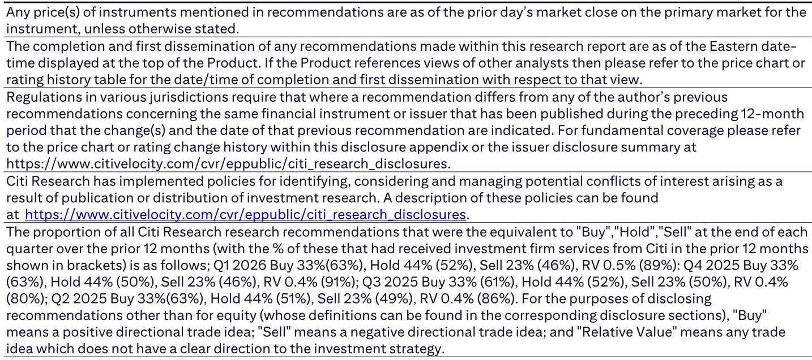
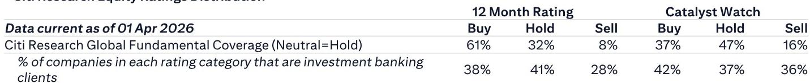
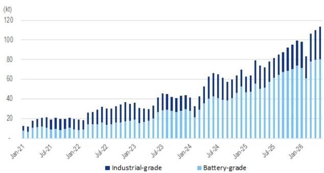

# Citi：锂价跌了，但真正的紧缺还没来

当锂价在过去一周从每吨16.7万元跌至15.7万元，市场的第一反应是恐慌。江西锂云母龙头复产的传闻像幽灵一样盘旋，下游采购商缩手观望，贸易商库存开始松动。但Citi最新发布的这份周度追踪报告，给出了一个和价格走势截然不同的判断：供需基本面依然紧张，去库存仍在延续，而三季度大量新电池产能的集中释放，可能会让这个市场再次措手不及。

这不是一份简单的“价格下跌，所以看空”的报告。Citi在5M26的进口数据中看到了一个被价格信号掩盖的结构性变化——锂原料的全球供应版图正在发生迁移，而市场对此的定价远未充分。如果你只看价格曲线，你会觉得行业正在走向过剩；但如果你看库存结构、看非洲矿的快速崛起、看下游产能的投产节奏，你会得到一个完全不同的结论。

这份报告最值得关注的核心判断是：锂的供需紧张格局并未被打破，当前的价格回调更多是情绪和短期博弈的结果，而非基本面的反转。Citi甚至明确表示，即便计入江西复产的预期，他们仍然维持看涨观点。这不是一个随大流的立场。

## 1. 5月进口数据揭示了一个被忽视的转折：非洲正在成为锂原料的新供应极

Citi的数据显示，2026年前五个月，中国进口碳酸锂约15.3万吨，同比增长153%。其中5月单月进口量达到约3.75万吨，创下历史新高。锂辉石方面，5M26进口274万吨，同比增长15%。

这些数字本身并不意外——中国作为全球最大的锂加工国，原料进口持续增长是常态。真正值得关注的是供应来源的结构性变化。

澳大利亚仍然是中国最大的锂辉石供应国，占比58%。但这一比例已经显著下降：2025年全年是62%，2025年前五个月是65%。换句话说，澳大利亚的份额在一年内下降了7个百分点。填补这个空缺的不是南美盐湖，而是非洲。尼日利亚和马里正在快速放量，2026年前五个月，非洲已经占到中国锂辉石进口的37%，而2025年全年这一比例是30%，2025年前五个月仅为25%。

> **KC评论：** 非洲矿的崛起速度可能超出了多数市场参与者的预期。一年之内份额从25%跳到37%，这不是边际变化，而是供应格局的重新定义。但非洲矿的问题在于矿石品位波动大、基础设施薄弱、政治风险高。Citi报告没有展开的是：这些非洲矿的边际成本曲线在哪里？如果锂价继续下跌，非洲供应是否会比澳洲供应更早出清？这份报告后面的图表值得仔细看，尤其是月度进口量的趋势图，能帮你判断非洲矿的放量是可持续的还是一波流。

这个结构变化的含义是多重的。一方面，非洲矿的涌入确实增加了短期供应弹性，压制了价格上涨的空间。但另一方面，非洲矿的供应稳定性远低于澳洲矿，一旦价格跌破某些非洲矿的成本线，供应的收缩速度也会快于市场预期。Citi的看涨观点，某种程度上是在赌市场低估了这种非对称风险。

## 2. 库存去化仍在继续，但库存结构的变化比总量更重要

Citi追踪的周度数据显示，截至6月25日当周，碳酸锂总库存为95,812吨，环比下降1%，减少833吨。这个去库存速度看似温和，但库存结构的变化更值得拆解。

下游玩家（主要是正极材料厂商）的库存环比增加了3%，达到48,285吨。冶炼厂的库存环比增加1%，至15,373吨。而“其他”（主要是电池厂商和贸易商）的库存环比大幅下降7%，至34,582吨。

这意味着什么？下游正极材料厂并没有在主动去库存，他们甚至在增加备货。真正的去库存压力集中在贸易商环节。贸易商库存下降7%，说明市场情绪悲观时，中间环节在主动抛售，而终端用户反而在逢低吸纳。

> **KC评论：** 库存数据最怕看总量不看结构。总量去库存听起来像利空，但如果去的是贸易商库存，下游反而在补货，那说明需求端并没有崩溃，只是渠道在重新分配风险。Citi报告里有两张库存图——月度和周度——放在一起看，能清晰看到从3月到6月的库存演变轨迹。我们每天整理的完整数据包里会更新这些图表，方便你跟踪这个结构变化是否在持续。

这个库存结构告诉我们，当前的价格下跌更多是中间环节的恐慌性出清，而非终端需求的塌陷。一旦贸易商库存出清完毕，而下游的补库需求仍在，价格可能会迎来一个快速的反弹窗口。

## 3. 三季度电池产能集中释放，可能是打破当前平衡的关键变量

Citi报告中有一个判断被很多人忽略了：“我们预计锂的供需动态可能继续保持紧张，因为大量新电池产能计划在2026年三季度投产。”

这句话的信息量很大。当前锂价承压，市场情绪悲观，但Citi认为真正决定供需平衡的不是现在的价格，而是三季度的产能投放节奏。如果大量电池产能在三季度集中爬坡，对锂盐的采购需求将是脉冲式的。而当前冶炼厂的库存只有1.5万吨左右，下游和贸易商合计库存约8.3万吨，这个库存缓冲并不算充裕。

这里有一个关键的不确定性：江西锂云母的复产进度。Citi在报告中提到“锂价一直受到对JXW复产的担忧的压力”，但即使考虑了复产因素，他们仍然维持看涨观点。这意味着Citi的判断是，即使江西复产，三季度的需求增量仍然足以消化这部分新增供应。

但这个判断需要两个前提假设：一是江西复产的实际进度不会超预期，二是三季度的电池产能确实能如期投产。这两个假设都存在不确定性。

## 4. 报告尚未完全回答的关键问题：非洲矿的成本曲线到底在哪里

Citi这份报告的数据颗粒度非常细，但有一个核心问题没有展开：非洲锂辉石的真实成本曲线。

澳洲矿的成本结构相对透明，Greenbushes、Pilbara等主要矿山的完全成本大致在每吨600-800美元（SC6%品位）。但非洲矿的情况要复杂得多。尼日利亚和马里的小型矿企，很多采用手选矿、简易重选等低效工艺，矿石品位波动大，运输成本高，加上当地电力、水资源的不确定性，其成本分布可能非常离散。

如果锂辉石价格（SC6% CIF中国）跌到每吨800美元以下，澳洲矿可能还能盈利，但部分非洲矿可能已经面临亏损。而一旦非洲矿开始减产，Citi报告中提到的37%的供应份额就会面临收缩风险。这个二阶效应，可能是当前市场定价最不充分的部分。

> **KC评论：** 这是整份报告最值得追问的问题。Citi给出了非洲矿的进口量数据，但没有给出成本曲线。我们会在每天的更新中整理主要矿山的最新成本数据，并结合锂价走势做一个压力测试。如果你想知道锂价跌到什么位置会触发非洲矿减产，这份完整的数据包会给你答案。

## 5. 给读者的观察框架：三个信号决定锂价的下一步方向

综合Citi这份报告的核心信息，我们整理了一个简单的观察框架，帮助你在未来几周跟踪锂市场的演变方向。

第一个信号：江西锂云母的复产进展。这是当前市场最大的情绪压制因素。如果复产进度低于预期，或者复产后的产量爬坡缓慢，市场可能会快速修正对供应过剩的担忧。Citi已经在这个假设上站队了。

第二个信号：贸易商库存的去化速度。当前贸易商库存正在快速下降，这个趋势能否持续，以及何时触底，是判断价格拐点的关键。如果贸易商库存降至3万吨以下，而下游仍在补库，价格反弹的条件就基本成熟了。

第三个信号：三季度电池产能的实际投产节奏。这是Citi看涨的核心逻辑支撑。如果电池产能如期投产，锂盐的采购需求将在7-8月显著增加。如果投产推迟，市场可能会进入一个更长的观望期。

这三个信号中，任何一个出现超预期变化，都足以改变当前的价格叙事。Citi已经给出了他们的判断，但最终的答案需要市场来验证。

---

这份Citi报告的数据量远不止我们上面讨论的内容。完整的周度产量、分工艺的产出变化、月度进口的国别明细、以及过去12个月的库存演变图表，都在原文中。我们的AI agent每天会从这些报告中提取核心数据，并配合人工review生成中文摘要和评论，每天更新约10-40页，包含当天最新的数据图表合集。既方便直接喂给AI做进一步分析，也方便人工快速把握全球市场的动态变化。

如果你对锂市场的供需博弈、非洲矿的成本曲线、或者三季度的产能节奏有更多想讨论的，欢迎来我们的微信群继续交流。每天我们都会在群里分享最新的投行研报摘要和市场数据。

Personal reading notes and learning share only. Not investment advice.

