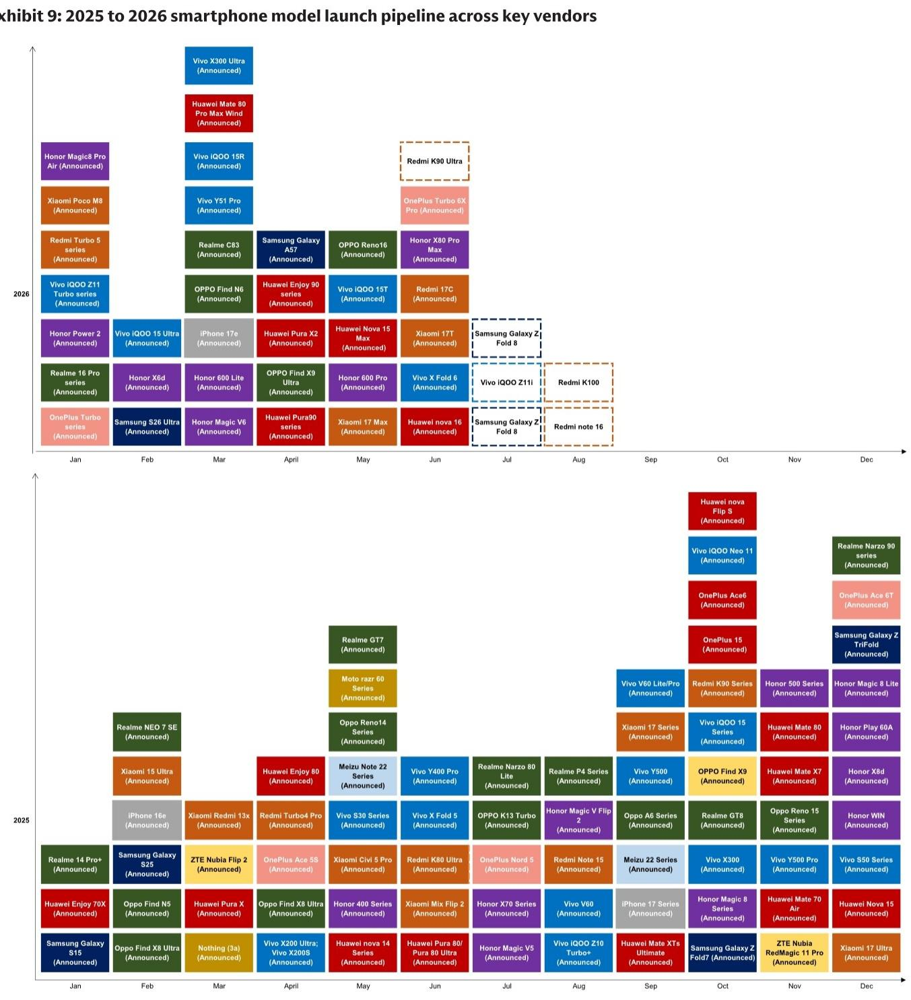
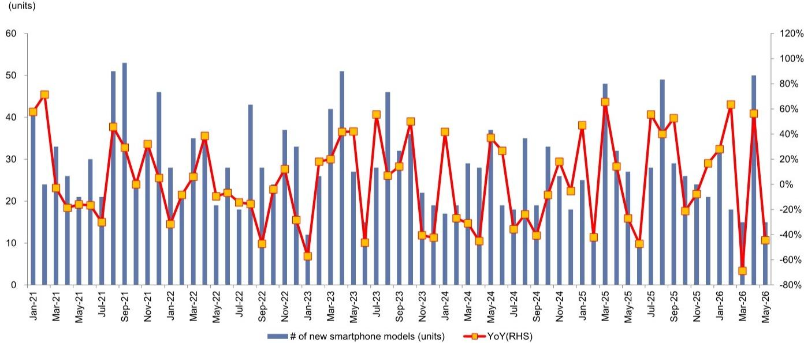
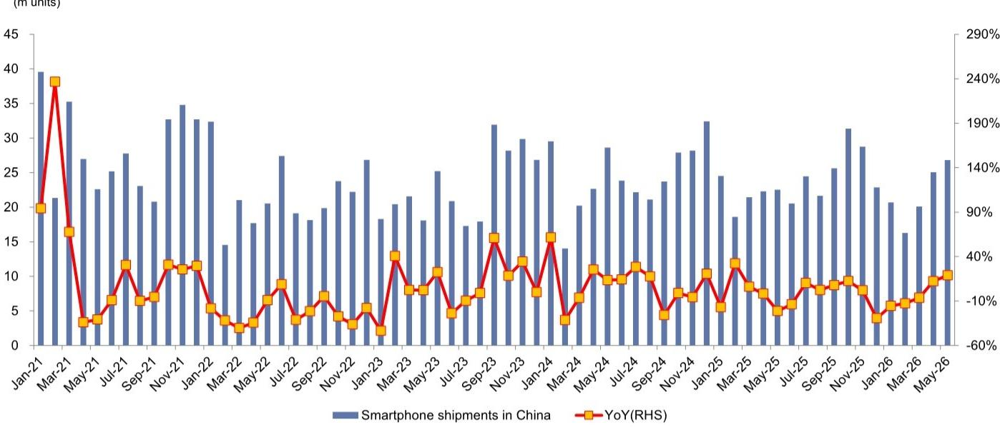

# GS：中国手机出货量回暖，但真正的结构性机会在摄像头升级

中国智能手机市场在2026年5月交出了一份亮眼的月度数据——出货量同比增长19%至2700万部，环比也实现了7%的增长。这组数字很容易让人产生“市场全面复苏”的错觉。但GS这份最新研报揭示的图景远比表面复杂：出货量的反弹背后，是内存成本高企对需求的持续压制，以及摄像头规格升级这一不可逆的结构性趋势。换句话说，行业正在经历一场“量价分化”——出货量波动回升，但真正的价值增量正从“卖更多手机”转向“卖更贵的镜头模组”。

这份报告最值得关注的核心判断是：中国智能手机市场的竞争焦点，已经从“多摄像头堆砌”转向“高像素单摄升级”。这一转变将重塑整个供应链的价值分配，而大多数投资者可能仍停留在旧框架中。

---

## 1. 五月出货量反弹背后，内存成本仍是悬在需求头上的达摩克利斯之剑

五月出货量同比增长19%，环比增长7%，延续了四月环比增长25%的势头。从数字上看，这似乎是市场加速复苏的信号。但GS在报告中明确预警：**预计二季度整体出货量将同比下降14%**。这个看似矛盾的预测，恰恰揭示了当前市场复苏的脆弱性。

出货量的月度波动，很大程度上受到新机型发布节奏的影响。四月新机型发布数量同比大增56%至50款，五月则骤降至15款，同比下滑44%。这种脉冲式的新品发布，使得单月出货数据容易失真。真正需要关注的是内存成本这一持续变量。

> **KC评论：** 内存成本上升正在抑制中低端机型的需求弹性。当一部手机的BOM中内存占比从15%攀升至20%以上时，厂商要么压缩利润，要么提价转嫁成本。GS预期二季度出货量下降14%，意味着这种压力尚未完全释放。报告中对内存成本如何具体影响不同价位段机型的拆解，值得完整阅读。

## 2. 摄像头数量见顶已是既定事实，2022年就是分水岭

GS追踪了荣耀、小米、OPPO、vivo、传音五大品牌自2020年以来的机型数据，揭示了一个清晰的趋势：**单机摄像头数量在2022年达到3.8颗的峰值后，持续下滑至2026年上半年的3.0颗**。

这个数字意味着什么？2022年以前，厂商的竞争逻辑是“多就是好”——后置四摄、五摄甚至六摄成为旗舰机标配。但消费者逐渐发现，200万像素的微距镜头和景深镜头更多是营销噱头，实际使用频率极低。从2023年开始，行业进入“减量提质”阶段。

这一趋势并非周期性波动，而是产品成熟后的必然收敛。当智能手机进入存量换机市场，用户对摄像头的需求从“有没有”转向“好不好”。厂商的竞争焦点也随之转移。

## 3. 高像素渗透率加速提升，20MP以上镜头成为绝对主力

与摄像头数量下滑形成鲜明对比的是，**20MP以上高像素镜头的渗透率正在加速攀升**。2026年上半年，这一比例已升至65%，而2024年全年仅为52%，2023年更是只有39%。两年时间，高像素镜头占比提升了26个百分点。

GS在报告中进一步拆解了各品牌的表现：华为的高像素镜头占比最低（18%仍使用低像素镜头），OPPO和vivo紧随其后（均为22%），而传音仍有33%的镜头为低像素规格。这种差异反映了不同品牌的产品定位和目标客群——华为和OPPO、vivo更专注于中高端市场，而传音在海外低端市场仍有大量出货。

> **KC评论：** 摄像头数量见顶+高像素渗透率提升，这两个趋势叠加意味着：单机摄像头价值量正在重构。过去厂商靠增加镜头数量来提升BOM成本，现在则靠提升单颗镜头的像素和规格。这对镜头模组厂商、CIS芯片厂商和算法供应商的竞争格局影响深远。报告中对各品牌的具体机型拆解和像素分布，提供了更精细的产业洞察。

## 4. 供应链受益者正在切换：从“数量扩张”到“规格升级”的赢家逻辑

基于上述趋势，GS给出了明确的投资方向：看好鸿海、瑞声科技、领益智造、大立光、中光电、Fositek和台积电等标的。这份名单背后，暗含的是供应链价值分配的逻辑变化。

当行业从“多摄堆叠”转向“高像素单摄升级”，受益方从低端镜头供应商转向高端镜头和精密制造厂商。大立光作为全球手机镜头龙头，在高像素镜头领域的份额和议价能力将进一步提升。瑞声科技和领益智造则受益于声学、光学和精密结构件的规格升级。鸿海和台积电则代表了整体代工和芯片制造环节的价值锚定。

但需要指出的是，这份受益名单并非一成不变。GS报告中没有完全展开的一个关键问题是：**高像素镜头的产能扩张速度是否会快于需求增长，从而导致价格竞争？** 如果所有厂商都押注高像素升级，供给端的过剩可能压缩利润率。

## 5. 报告尚未完全回答的关键问题：折叠屏能否成为下一个增量引擎？

GS在报告中提供了折叠屏手机的定价和发布计划数据，但并未将其作为核心分析重点。这恰恰是当前市场最不确定的方向之一。

折叠屏手机的平均售价仍在6000元以上，远高于普通旗舰机型。如果折叠屏能够实现从“小众尝鲜”到“大众换机”的跨越，它将成为摄像头升级之外的第二个结构性增量。但问题是：折叠屏的铰链和屏幕成本何时能降至与直板机相当？目前尚未看到明确的时间表。

这也意味着，对于投资者而言，当前最确定的逻辑仍是摄像头规格升级。折叠屏的贡献需要更长时间验证。

## 6. 投资者的观察框架：从“量”到“质”的三个维度

基于GS的这份研报，我们建议投资者从以下三个维度重新审视中国手机供应链的投资逻辑：

**第一，出货量数据要看趋势，不要看单月。** 内存成本的影响具有滞后性，二季度数据可能才是真正的“压力测试”。关注7-8月出货数据能否延续增长，将验证需求是否真的在回暖。

**第二，摄像头规格升级的节奏比绝对值更重要。** 65%的高像素渗透率意味着还有35%的存量空间可以替换。但关键不是最终能达到多少，而是升级的速度。如果2026年下半年渗透率突破70%，将验证这一趋势的确定性。

**第三，关注品牌之间的分化。** 传音仍有33%的低像素镜头，说明海外低端市场的高像素渗透才刚刚开始。对于有海外布局的供应链厂商，这是一个额外的增量市场。

---

这些判断和维度，只是GS这份研报的冰山一角。报告中还有更多精细的数据拆解——各品牌每款机型的摄像头像素分布、月度出货量的详细拆分、折叠屏定价策略对比——这些图表和数据背后的二阶效应，无法在一篇导读中穷尽。

我们每天会由AI agent加人工review，生成国际投行中文摘要与KC评论，daily更新约10-40页，并整理当天最新数据图表合集，方便喂给AI，也方便人工快速把握market dynamics。欢迎来星球微信群里继续讨论。

Personal reading notes and learning share only. Not investment advice.

