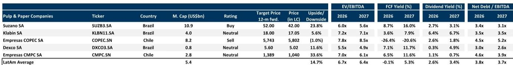
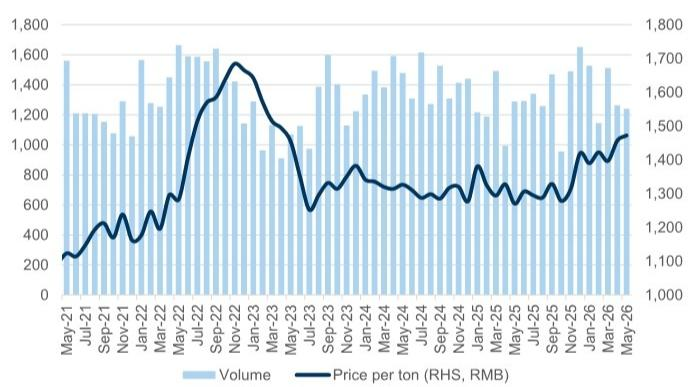
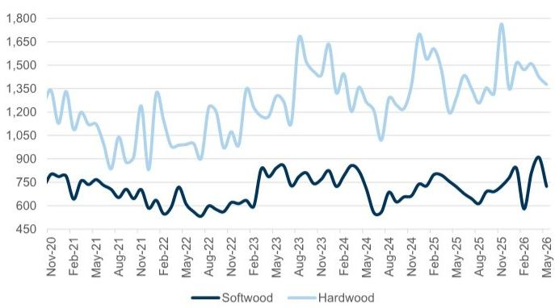

# China Hardwood Pulp Is Repeating a Cycle That Has Already Broken Integrated Producers Before

The hardwood pulp market in China is not experiencing a novel disruption. It is replaying a structural pattern that global pulp markets have witnessed multiple times, and the implications extend far beyond a single quarter of inventory build. The current price plateau near $600 per tonne is behaving exactly as historical cycles would predict: integrated paper producers gain competitive advantage, non-integrated buyers withdraw, and sellers are left holding inventory they cannot move at prevailing prices.

What makes this moment strategically important is not the price level itself, but the convergence of three forces that have historically marked the beginning of sustained price declines. First, domestic resale prices in China have already fallen to the equivalent of $549-556 per tonne for hardwood, creating a $50-60 discount to imported benchmark prices. Second, sellers are reporting that volumes sold in April and May fell below 50 percent of normal monthly volumes, even as producers had limited availability due to planned downtime. Third, global hardwood seller inventories have risen to 43 days of supply, up three days month-over-month, while year-to-date global shipments are down 2.5 percent.

The pattern is clear, and it is not new. The question for investors is whether this cycle will follow the same trajectory as previous bear markets, or whether structural changes in Chinese demand and new capacity additions will amplify the downturn beyond historical precedents.

## The $600 Threshold Is a Structural Ceiling, Not a Floor, Because Integrated Economics Change the Game

The central insight that drives this entire analysis is deceptively simple. At hardwood prices around $600 per tonne, China's integrated paper producers become more competitive than non-integrated buyers. This is not a temporary trading phenomenon. It is a structural cost advantage that shifts market share and reduces demand for market pulp.

Integrated producers control their own fiber supply. When market pulp prices rise, their internal cost base remains relatively stable, meaning their paper-making margins expand. Non-integrated producers, by contrast, must purchase pulp at market prices, so their margins compress as input costs rise. The result is a self-correcting mechanism. At elevated pulp prices, integrated producers gain share, total market pulp demand falls, and sellers lose pricing power.

This mechanism is precisely what is playing out today. Domestic resale prices for hardwood pulp have already dropped to $549-556 per tonne, well below the imported benchmark of $605. That discount tells us that domestic buyers are already pricing in a lower equilibrium. The fact that imported prices have not yet fully adjusted reflects the lag in benchmark pricing, not the underlying demand reality.

The $600 level has functioned as a ceiling in prior cycles for exactly this reason. Every time prices approach or exceed that threshold, the integrated advantage kicks in, demand softens, and prices revert. The current cycle is following the same script, but with an important twist: new capacity is coming online in China and Indonesia by year-end, which will add further downward pressure.

## Sales Volumes Are Telling a More Important Story Than Price Levels, and That Story Is Bearish

Price data alone can be misleading in commodity markets, because transactions can occur at quoted benchmarks even when volume is thin. The more revealing signal is what sellers are reporting about their actual sales volumes. According to channel checks, volumes sold in April and May were below 50 percent of normal monthly volumes. This is not a demand shock. It is a buyer strike.

Buyers are not rushing to place orders, even though they know the end of the quarter is approaching and sellers will face increasing pressure to move inventory. This behavior is rational. When buyers believe prices will fall further, they delay purchases, which in turn forces sellers to cut prices to clear inventory. The dynamic is self-reinforcing, and it is precisely what happens in every bear cycle.

The recent $20 per tonne cuts announced by major producers, bringing offers to around $580 per tonne, have not been sufficient to attract significant buying. That tells us the market is pricing in further declines. If $580 is not enough to clear volumes, then the equilibrium price must be lower.

This is not a prediction of a crash. It is a recognition that the current price level is not supported by actual demand. Sellers have a choice: they can hold back volumes to limit price declines in China and preserve benchmark prices in other regions, or they can accept lower prices to move inventory. Historically, they have chosen the former, but only temporarily. Eventually, the inventory build forces their hand.

## The Price Disparity Between China and the Rest of the World Is Unsustainable and Will Eventually Collapse

One of the most important structural features of the current market is the price gap between China and other major regions. Current net prices outside China are at least $50 per tonne higher than inside China. This disparity cannot persist.

The logic is straightforward. If China prices continue to fall while other regions hold steady, the arbitrage opportunity becomes irresistible. Traders will redirect volumes to higher-priced markets, or Chinese buyers will increase imports of finished paper products rather than pulp. Either way, the price differential will compress.

More importantly, the global pulp market is not segmented. A price decline in China eventually transmits to Europe and the United States because the same producers sell into all regions. When Chinese demand weakens, producers have two options: divert volumes to other regions and accept lower prices there, or reduce production. The first option is easier and more common, which is why Chinese price weakness has historically preceded price declines in other regions.

European data already shows signs of stress. While pulp prices have edged modestly higher, European producer price data points to manufacturer-level price declines in April and May, and Nielsen data suggests shelf-price deflation is persisting. This is consistent with the lagged transmission mechanism. Lower oil prices have alleviated some cost pressure for tissue producers like Essity, but the report notes that consensus still underappreciates the risk of mounting gross margin headwinds later in the year.

The implication is clear. The Chinese price decline is not an isolated event. It is the leading edge of a broader cyclical downturn that will eventually affect global pulp pricing.

## New Capacity Will Push Prices Toward Marginal Cost Before the Cycle Finds a Floor

The supply side of the equation is about to become significantly more challenging. New pulp capacity is scheduled to come online in China and Indonesia by year-end. This is not a marginal addition. It represents a structural increase in global supply that will need to be absorbed by demand that is already softening.

The report's framework suggests that prices will likely trend toward marginal cost before significant buying or production slowdowns stabilize supply and demand. This is a critical distinction. In many commodity cycles, the floor is set by the marginal cost of production, not by arbitrary support levels. When prices fall below marginal cost, high-cost producers shut down, supply contracts, and the market rebalances.

But the path to that equilibrium is not smooth. Between now and then, prices will likely overshoot on the downside, as they always do in commodity cycles. The risk is that the combination of weak demand and new capacity creates a period of sustained price weakness that challenges the balance sheets of highly leveraged producers.

The report's coverage of Latin American producers provides useful context. Suzano, the Brazilian pulp giant, trades at 6.0x forward EV/EBITDA with a Buy rating and 23.8 percent upside to target. But net debt to EBITDA stands at 3.4x. Klabin and CMPC carry similar leverage ratios. In a prolonged downturn, these balance sheets would face meaningful stress.

The question that the report does not fully answer is whether the marginal cost floor in this cycle will be higher or lower than in previous cycles. Higher energy costs, inflation in chemical inputs, and higher labor costs all suggest that the floor could be higher. But the scale of new capacity additions and the structural shift in Chinese demand could push the floor lower. The resolution of this tension will determine the depth and duration of the downturn.

## What the Report Leaves Open: The Interaction Between Chinese Demand Structure and Global Capacity Adds

The report provides a clear cyclical framework, but it leaves several important questions unanswered. The most critical is how the structural evolution of Chinese demand will interact with the new capacity wave.

China's pulp imports in May decreased 10 percent month-over-month but increased 4 percent year-over-year. Year-to-date imports are up 2 percent. These numbers suggest that Chinese demand is not collapsing, but it is decelerating. The question is whether this deceleration is cyclical or structural.

If Chinese economic growth continues to moderate and the property sector remains weak, demand for paper and packaging could see a structural slowdown. That would mean the current downturn is not just a cyclical correction but a secular shift in the demand curve. The report hints at this possibility but does not develop it fully.

Similarly, the report notes that China's woodchip imports decreased 2 percent month-over-month and 4 percent year-over-year in May, with year-to-date imports still up 8 percent. The decline is attributed to rising domestic wood prices and competition with Chinese domestic wood, which reached the highest level since 2023. But with China wood supply increasing and prices falling, coupled with lower oil and freight rates, imported chip prices are expected to follow a negative trend.

The interplay between domestic wood supply, imported chips, and pulp production is complex. If China can increase its domestic fiber supply, it reduces its dependence on imported pulp, which further weakens demand for market pulp. This is a structural bearish factor that the report identifies but does not quantify.

## A Decision Framework for Investors: Three Signals to Watch Before Positioning for a Turn

For investors trying to navigate this cycle, the report provides the raw material for a decision framework, but it does not synthesize it into actionable signals. Here is how to think about the key indicators.

The first signal is inventory days. Global hardwood seller inventories are currently at 43 days, up from 40 days the previous month. Historically, a level above 45 days has been associated with sustained price weakness. Watch for whether inventories continue to build or stabilize. A peak above 50 days would be a strong bearish signal.

The second signal is the discount between domestic resale prices and imported benchmark prices. Currently, that discount is approximately $50-60 per tonne. If it widens further, it indicates that domestic buyers are pricing in even lower equilibrium levels. If it narrows, it suggests that buyers believe the floor is near.

The third signal is capacity utilization announcements from major producers. In previous bear cycles, producers have announced downtime to support prices. The report notes that sellers usually decide to hold back volumes to temporarily limit price declines in China. Watch for whether these efforts are coordinated and credible, or whether producers continue to run at high utilization despite weak demand.

The most important unanswered question is timing. The report suggests that prices need to fall further for buying to resume at levels that can allocate full volumes. But it does not specify how much further. The $580 per tonne level has already been tested and found insufficient. The next test will likely be in the $540-560 range, which corresponds to the current domestic resale level.

For investors with exposure to pulp producers, the implications are clear. The current cycle is following a well-established pattern, and the weight of evidence suggests that prices will continue to decline. The only debate is about the depth and duration of the downturn. The report provides the framework for that debate, but the final answer will depend on how the three signals evolve in the coming months.

Join the community to read the full report and review the original charts.

*This article is for learning and discussion only and does not constitute investment advice.*

Personal reading notes and learning share only. Not investment advice.

