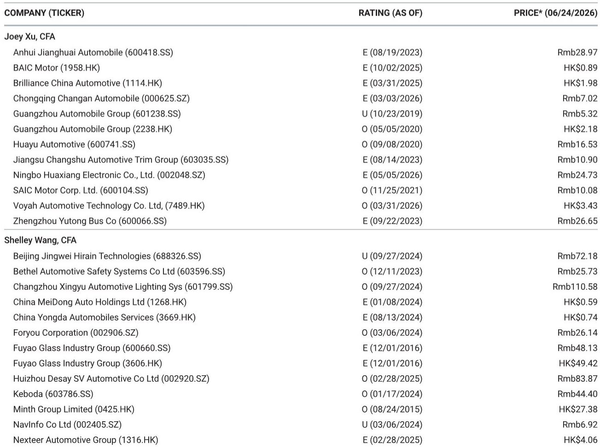
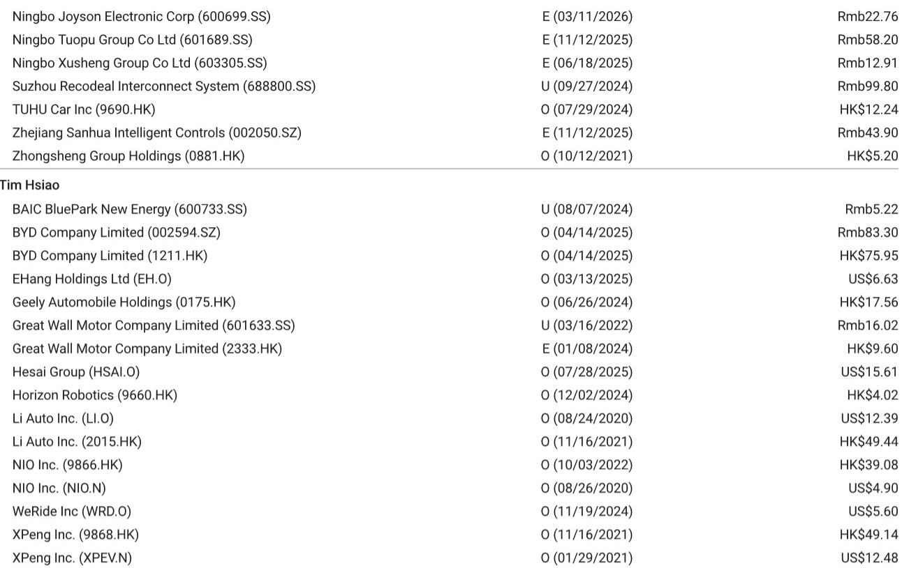
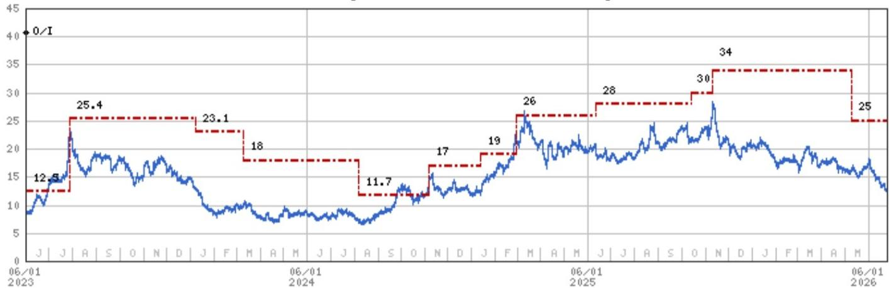

# China’s Auto Market Has Hit a Demand Floor, But the Rebound Requires More Than Just Time

The narrative surrounding China’s automotive sector has become deeply pessimistic, with investor sentiment falling far below the underlying reality of the market. After a challenging second quarter, the consensus view is that demand remains conspicuously weak, growth concerns are persistent, and the sector has been systematically drained of liquidity by the relentless rotation into AI and tech plays. However, this very pessimism is creating the conditions for a significant trading opportunity in the second half of the year. The market has priced in a downturn that is already occurring, but it has not yet priced in the convergence of catalysts that are set to arrive in the August-September window. The demand floor is now in place. The question is not whether a rebound will come, but whether investors will be positioned for it when the narrative shifts from macro despair to micro catalysts.

The current market dynamic reflects a binary divide between AI and everything else, with autos firmly in the latter category. This has distorted sector discussions, keeping them at a high level rather than focusing on company fundamentals. Yet beneath this surface-level pessimism, the data tells a more nuanced story. June sales are likely to be stronger than headline figures suggest, supported by extended 618 promotions, stacked subsidies, license-plate exemptions in select cities, and temporarily lower fuel prices. Wholesale volumes are expected to rise by low-teens month-over-month, led by BEVs and PHEVs. The second quarter wholesale volumes are estimated at 6.7 to 6.9 million units, representing a year-over-year decline of only 3 to 5 percent, a meaningful improvement from the 8 percent decline in the first quarter. The gap is narrowing, and the second half should see further normalization.

The critical insight here is that the market is suffering from a timing mismatch. The catalysts for a rebound are real, but they are not yet visible in the rearview mirror. The July seasonal lull will likely test investor patience, but the August-September window offers a convergence of low base effects, above-seasonal demand supported by solid order books, policy-driven consumption support, and an early ramp in new model launches. Some investors may begin to pull forward valuation frameworks to 2027, which would provide a significant boost to stock prices before the fundamental improvement is fully realized. The market may start to price this in ahead of realization, creating a window for those who act before the crowd.

## The Consumer Decision Cycle Is Lengthening, But Structurally This Favors Incumbents With Scale

The most concerning trend in the current market is the lengthening consumer decision cycle. Rapid EV iteration, frequent model refreshes, fast-paced specification upgrades, and ongoing price cuts are all causing consumers to delay purchases. They are waiting for the next better, cheaper, or more advanced model. This is a rational response to an industry that is innovating at an unprecedented pace, but it creates a self-reinforcing cycle of weak demand that further intensifies competition.

This dynamic, however, is not uniformly negative. It creates a structural advantage for incumbents with scale, manufacturing efficiency, and the ability to refresh their lineups rapidly. The mass-market segment, roughly the 150,000 RMB price point, is expected to regain traction in the second half, supported by new offerings from BYD and Geely that fill the gap left by ICE displacement. These launches appear largely incremental rather than cannibalistic, meaning they are expanding the addressable market rather than just stealing share from existing models. This is a critical distinction. In a market where total demand is constrained, incremental volume from new segments is far more valuable than share shifts within existing segments.

The ICE segment, by contrast, is structurally challenged. Discounting is no longer effectively converting traffic, and ICE vehicles face widening disadvantages in AD and AI capabilities as well as resale values. The consumer decision cycle is lengthening for ICE vehicles in particular, as buyers recognize that the technology is becoming obsolete. This creates a tailwind for EV adoption that is independent of macroeconomic conditions. The floor under EV demand is therefore more solid than the headline numbers suggest, because it is being driven by a structural shift that will continue regardless of the quarterly economic data.

## The Premium Segment Is the Last Line of Defense, But It Is Under Structural Siege

While the mass market is showing signs of stabilization, the premium and luxury segment is facing intensifying competitive pressures. The recent guidance cut from a major global OEM is not a company-specific issue; it reflects structural challenges that affect the entire segment. The 300,000 to 400,000 RMB price point increasingly looks like the last line of defense for traditional premium brands, but it remains under pressure from multiple directions.

Industry feedback suggests that a credible response from global OEMs now requires three things: native EV platforms, advanced ADAS capabilities, and residual value guarantees. This is a high bar. Most traditional premium brands are still in the early stages of transitioning to dedicated EV architectures, and their ADAS capabilities lag behind Chinese competitors. The residual value issue is particularly acute, as rapid depreciation of premium EVs is eroding the brand equity that these companies have spent decades building.

The risk here is that brand erosion in this segment is unlikely to be linear. It could accelerate as more consumers experience the superior technology and user experience offered by Chinese EV brands. The premium segment has been the profit engine for global automakers for years, and its erosion would have significant implications for their overall profitability. For investors, this means that the premium segment is not a safe haven. The structural dynamics favor the Chinese incumbents that are already dominant in the mass market and are moving up the price curve.

## Policy Is in Stabilization Mode, Not Stimulus Mode, and That Is Actually a Positive Signal

The policy environment is supportive but is unlikely to be a major catalyst this year. The 2026 trade-in subsidy pool, estimated at around 125 billion RMB, is being deployed more gradually than last year. Daily applications are running at 20,000 to 30,000 units, representing over 50 percent of monthly sales, with potential upside in the August-September window. Recent policy measures targeting auto circulation and after-sales ecosystems are constructive but should have limited near-term demand impact.

The key insight here is that policy is in stabilization mode rather than stimulus mode. This is actually a positive signal. It suggests that policymakers believe the market can find its own footing without massive intervention. The gradual deployment of the subsidy pool is designed to smooth demand over the year rather than create a spike that would be followed by a cliff. This approach is more sustainable and reduces the risk of a post-stimulus hangover.

For investors, the implication is that the policy tailwind is real but modest. It will provide a floor under demand, but it will not be the primary driver of a rebound. The primary drivers will be the new model cycle, the seasonal recovery, and the eventual normalization of consumer sentiment. The policy backdrop simply ensures that these factors are not fighting against a headwind from the government.

## The HIMA Ecosystem Is Expanding, But Internal Cannibalization Is a Growing Risk

The Huawei-led HIMA ecosystem continues to expand, but with a rising risk of internal competition. Huawei’s strategy of partnering with large state-owned OEMs to deploy HarmonyOS across multiple segments is effectively a broad-based market capture approach. However, with five brands spanning different price tiers and a consistent rollout of lower-priced follow-on models, pricing is increasingly used as a share gain lever rather than a margin driver.

This creates a paradox. The HIMA ecosystem is gaining market share rapidly, but it is doing so at the expense of its own profitability. The internal cannibalization risk is real and growing. When multiple brands under the same ecosystem are competing for the same customers with similar technology and different price points, the natural outcome is downward pressure on margins. This is not a sustainable long-term strategy, but it is effective for gaining share in the short term.

For the broader market, the HIMA expansion is a double-edged sword. It accelerates the adoption of advanced technology and puts pressure on traditional brands, but it also creates a pricing dynamic that makes it difficult for any player to earn healthy margins. The winners in this environment will be the companies that can combine scale with cost leadership, such as BYD, rather than those that rely on brand premium or technology differentiation alone.

## What the Report Does Not Fully Answer: The Sustainability of the Rebound and the Role of Export Markets

The report provides a clear framework for the second-half rebound, but it leaves several important questions unanswered. First, how sustainable is the rebound beyond the August-September window? The convergence of catalysts is real, but it is largely driven by timing factors such as new model launches and seasonal patterns. Once these factors fade, the underlying demand environment will reassert itself. The report does not provide a clear view on whether the structural demand growth is accelerating or merely stabilizing.

Second, the role of export markets is acknowledged but not deeply explored. The report mentions risks related to rising protectionism and slower-than-expected overseas expansion, but it does not quantify the potential impact on individual companies. For BYD and Geely, which are both investing heavily in overseas capacity, the export market could be a significant swing factor. If protectionism intensifies, it could offset the domestic rebound. If overseas expansion accelerates, it could provide an additional catalyst. The report leaves this as an open question.

Third, the competitive dynamics in the premium segment are described as intensifying, but the report does not fully address the second-order implications for the mass market. If premium brands are forced to cut prices to defend market share, they will inevitably put pressure on the mass-market segment from above. This could compress margins across the entire industry, even as volumes recover. The report acknowledges this risk but does not provide a framework for quantifying it.

## A Decision Framework for Investors: How to Position for the Second-Half Rebound

For investors looking to act on the insights in this report, the following framework can guide decision-making. The first question is time horizon. If you are trading for the August-September window, the focus should be on companies with the most direct exposure to the new model cycle and the strongest order books. BYD and Geely are well-positioned here, as their upcoming launches are expected to be incremental rather than cannibalistic. XPeng remains an event-driven story, with the Mona L03 as a potential catalyst, but the debate around its execution is unresolved.

The second question is risk tolerance. The premium segment is under structural siege, and the report is cautious on this segment for good reason. If you are looking for a defensive position, the mass-market leaders are a better choice than the premium players. The structural challenges in the premium segment are unlikely to resolve quickly, and the risk of further brand erosion is real.

The third question is exposure to the export market. Companies with significant overseas expansion plans face a different set of risks and opportunities than those focused on the domestic market. If you believe that protectionism will intensify, you may want to favor companies with more domestic exposure. If you believe that overseas expansion will accelerate, the opposite is true.

The fourth question is the role of the HIMA ecosystem. The expansion of the ecosystem is a positive for the overall adoption of EVs, but it creates a pricing dynamic that is negative for margins. Investors should be cautious about companies that are directly competing with HIMA on price, as the margin pressure is likely to persist.

Finally, the most important question is whether you believe the market will price in the rebound before it occurs. The report suggests that this is likely, as some investors begin to pull forward valuation frameworks to 2027. If you agree, the time to act is before the August-September window, not during it. The July seasonal lull may be the best entry point for those who have conviction in the second-half recovery.

Join the community to read the full report and review the original charts.

*This article is for learning and discussion only and does not constitute investment advice.*

Personal reading notes and learning share only. Not investment advice.

