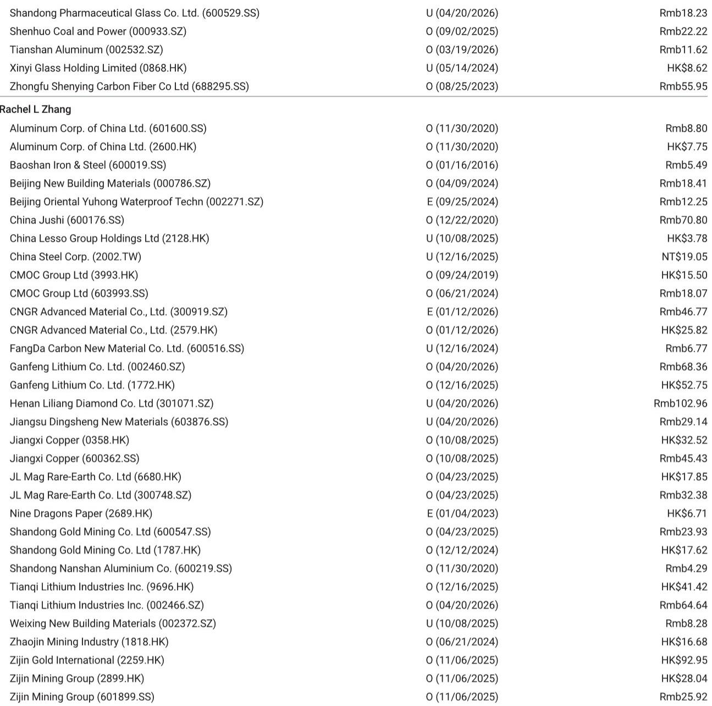
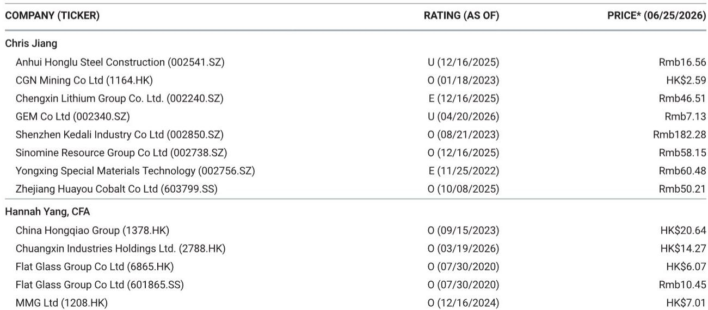
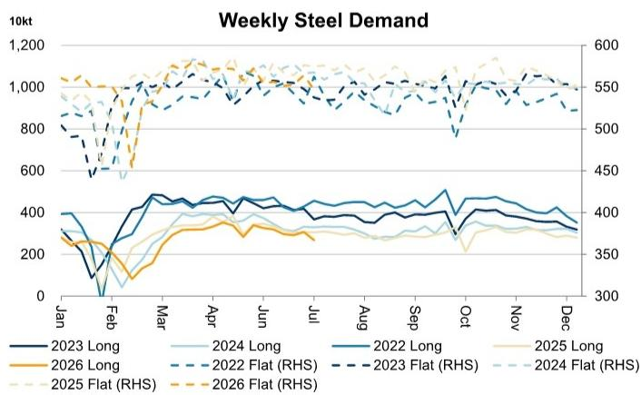

# 摩根斯坦利：MS：中国钢铁需求正在“长弱板稳”中筑底，但库存压力才是真正的考验

中国钢铁市场正在经历一轮微妙的分化。MS最新发布的《中国钢铁和铁矿石周报》显示，长材的表观消费量环比下降了12.7%，而扁平材的降幅仅为3.1%。这不是一个简单的需求疲软信号，而是一个清晰的“长弱板稳”结构正在形成。对于产业决策者和投资者而言，真正需要关注的不是总量下滑，而是这种分化背后暴露出的库存积累和利润挤压风险。

这份报告的核心判断是：中国钢铁需求正在经历一个结构性筑底过程，但库存的被动积累正在成为价格和利润的核心压制因素。市场情绪的低迷可能已经过度反映在价格中，但基本面改善仍需等待更明确的去库存信号。

## 1. 长材需求骤降12.7%背后，是房地产的“最后一跌”还是基建的“青黄不接”

MS的数据显示，长材周度表观消费量仅为268.1万吨，环比下降12.7%，同比下降12.2%。这是整个报告中最刺眼的数据。长材主要用于建筑领域，其需求的急剧收缩直接指向房地产和基建两大终端。

从逻辑上推理，长材消费的加速下滑可能来自两个叠加效应：一是房地产新开工面积仍然处于深度负增长区间，存量项目对建材的拉动效应正在递减；二是地方专项债发行节奏在6月出现阶段性放缓，导致基建项目的实物工作量未能如期释放。MS报告没有展开讨论具体的原因，但数据本身已经给出了清晰的指向。

> **KC评论：** 长材消费的12.7%周环比降幅不是一个小波动。它意味着建筑工地的实际用钢量正在以超出季节性的速度收缩。如果这种趋势持续，三季度螺纹钢价格可能面临更大的下行压力。完整的周报中包含了分品种的库存和产量数据，这些数据能帮助判断这种收缩是暂时的还是趋势性的。

## 2. 扁平材需求相对韧性，但“板强长弱”格局能持续多久

与长材形成对比的是，扁平材的表观消费量虽然也环比下降了3.1%，但绝对水平仍维持在546.9万吨。扁平材主要用于制造业，包括汽车、家电、机械和造船等领域。这个3.1%的降幅更接近季节性规律，而非结构性崩塌。

这指向一个重要的结构性判断：中国制造业的用钢需求韧性仍在，尤其是出口导向型的机械和汽车零部件领域。但问题在于，扁平材的供给端同样没有显著收缩——周度产量仅下降0.5%，导致库存也在累积。MS的数据显示，贸易商库存总量达到1144.9万吨，同比增长26.3%。这意味着，即使需求端相对稳定，高库存也在侵蚀价格弹性。

> **KC评论：** “板强长弱”听起来像是一个结构性利好，但实际含义是：制造业需求还能撑住，但钢铁行业整体的利润修复不能只靠一个板块。报告中的分品种库存和开工率图表能更清晰地展示这种分化是否可持续，以及何时可能发生切换。

## 3. 铁矿石库存向钢厂转移，成本端压力正在从矿山向冶炼端传导

MS的报告揭示了一个值得关注的细节：铁矿石的港口库存周环比仅微降0.2%，但钢厂端的铁矿石库存却环比增长了5.6%。同时，钢厂的高炉开工率小幅回升至63.1%，日均产量环比增加0.4%。

这个组合数据意味着什么？铁矿石正在从港口向钢厂转移，但钢厂并没有在积极补库，而是在被动接货。一方面，澳大利亚的铁矿石发运量环比增加了86万吨，供给端持续宽松；另一方面，巴西的发运量下降了118万吨，结构性扰动仍在。但整体来看，铁矿石的供需格局正在从偏紧转向平衡，甚至阶段性宽松。

对于钢铁企业而言，这意味着成本端的支撑正在减弱。如果钢价继续承压而铁矿石价格维持相对高位，钢厂的利润空间将进一步收窄。MS报告没有直接给出利润预测，但数据本身已经指向了这个方向。

## 4. 电炉开工率同比提升10个百分点，是供给出清还是产能置换的滞后效应

报告中的一个反常数据是电炉（EAF）的开工率同比提升了10个百分点，达到64.5%，而周环比仅微增0.1个百分点。在需求整体偏弱的背景下，电炉开工率的大幅同比提升值得追问。

这可能有两个解释。第一，去年同期的低基数效应——2025年6月电炉企业可能因为亏损而大面积停产。第二，部分电炉产能正在通过废钢替代铁水的经济性获得边际利润，尤其是在废钢价格相对承压的背景下。但无论如何，电炉开工率的提升意味着供给端并没有出现市场预期的快速出清。

> **KC评论：** 电炉开工率的同比大幅提升是这份报告中最容易被忽视的信号。它意味着即使长材需求大幅下滑，供给端的调节机制并没有完全启动。完整的报告中有分区域的电炉开工率数据，能帮助判断哪些地区的产能仍在扩张，哪些已经在被动减产。

## 5. 报告尚未完全回答的关键问题：库存拐点何时到来

MS的周报提供了详实的高频数据，但有一个关键问题没有给出明确答案：库存拐点何时出现？目前，贸易商库存同比增长26.3%，钢厂库存同比增长5.2%，两者都在累积。库存的持续增长意味着供需失衡仍在加剧。

从历史经验看，库存拐点的出现需要满足两个条件之一：需求端出现实质性回暖，或者供给端出现主动减产。目前，需求端的长材和扁平材都在走弱，而供给端的247家钢厂产能利用率仍维持在90.8%的高位。这意味着短期内库存继续累积的概率大于去库存的概率。

报告没有讨论政策干预的可能性，但这一点恰恰是未来市场走势的最大变量。如果粗钢产量调控政策在下半年加码，或者房地产政策出现超预期放松，库存拐点可能提前到来。反之，市场可能需要在更长时间内消化过剩库存。

## 6. 对决策者的观察框架：盯住库存、盯住电炉、盯住政策节奏

基于MS的这份周报，我们可以提炼出一个三层次的观察框架：

第一层，库存。贸易商库存的周度变化是最直接的供需指标。如果库存出现连续两周的环比下降，且降幅超过1%，可能意味着需求边际改善或供给主动收缩。

第二层，电炉开工率。电炉是钢铁供给中最灵活的调节器。如果电炉开工率出现明显下降，尤其是长材电炉的开工率下降，将是供给出清的有效信号。

第三层，政策节奏。粗钢产量调控、房地产融资、专项债发行，这三个政策变量的变化将决定需求端能否企稳。报告没有展开讨论政策，但数据本身已经为政策效果提供了验证窗口。

对于投资者而言，当前阶段最重要的是区分“周期性底部”和“结构性底部”。长材的深度下滑可能更多是周期性的，因为房地产终将见底；但扁平材的库存积累可能更具结构性特征，因为制造业的产能扩张正在改变供需平衡。MS的这份周报提供了判断这两个底部所需的高频数据，但最终的结论需要结合更长周期的报告和更细分的产业链数据才能得出。

每天，我们的AI agent会结合人工review，从MS、GS、JPM等国际投行的最新报告中提取中文摘要和关键数据图表，形成约10-40页的daily更新。这些内容既方便直接喂给AI进行深度分析，也方便人工快速把握全球市场的动态变化。如果你对这份周报背后的完整数据图表、分品种的库存和产量拆解，以及MS对中国钢铁行业的长期判断感兴趣，欢迎加入我们的知识星球和微信群，与我们一起持续跟踪和讨论。

Personal reading notes and learning share only. Not investment advice.

