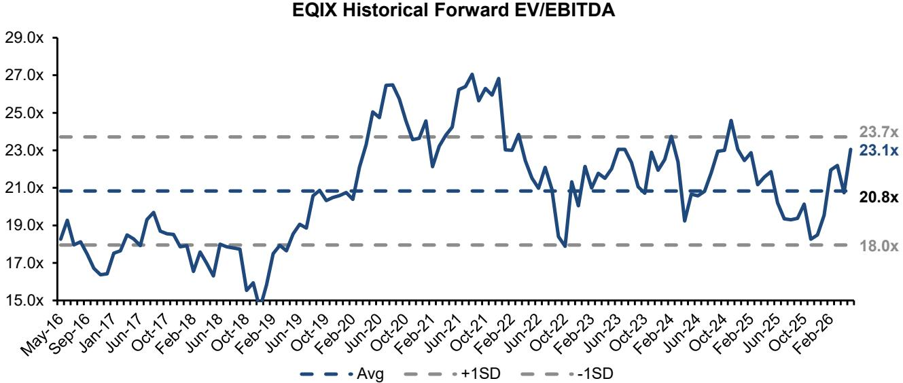
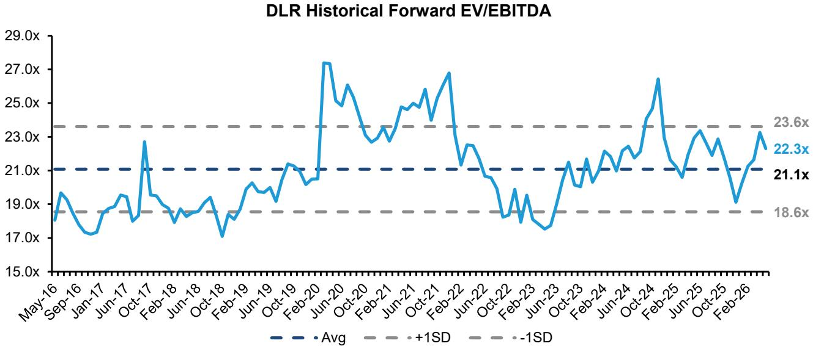
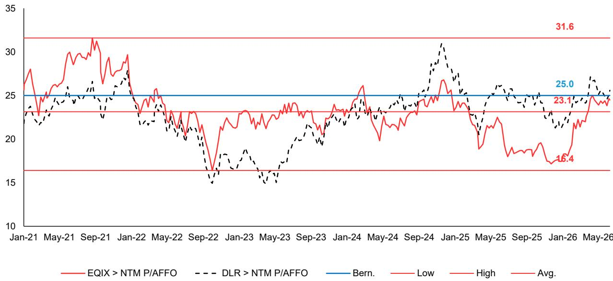

# Data Center REITs Are Not Priced for Perfection — They Are Priced for a Long-Duration Reinvestment Machine That Most Investors Still Misunderstand

The AI boom has pulled a new class of capital into data center REITs, but many of these investors are using the wrong analytical toolkit. They look at return on assets, see single-digit numbers, and conclude the business is capital-destroying. They look at EV/EBITDA multiples above 22x, compare them to software companies, and assume the valuation is a speculative premium with no fundamental anchor. Both conclusions are wrong.

The mistake is not in the math. It is in the time horizon embedded in the metric. Data centers are not 3-to-5-year assets. They are 30-to-50-year infrastructure. Applying short-duration financial ratios to multi-decade cash-flow streams systematically understates economic value. The correct question is not whether these companies earn a high accounting return today. It is whether they can deploy capital at attractive yields, recycle that capital, and compound distributable cash flow over decades. The evidence suggests they can.

A global investment bank report on Digital Realty and Equinix makes this case with unusual clarity. It does not defend high multiples by appealing to narrative or momentum. It builds a bridge from asset-level returns to equity-level returns, showing that a mid-single-digit starting EBITDA yield can support a low-teens equity IRR when combined with sustained reinvestment at 11% to 26% yields on cost. That math is not promotional. It is structural. And it has implications for how any serious investor should evaluate this sector going forward.

## Traditional REIT Metrics Systematically Understate the Economic Returns of Data Center Assets

When a non-REIT investor opens a data center REIT's financial statements, the first thing they notice is the heavy depreciation charge. Digital Realty depreciates buildings over 5 to 39 years. Equinix uses 12 to 60 years. These schedules are not neutral accounting choices. They directly depress GAAP net income and any return metric that uses it as a numerator. A 30-year asset depreciated on a 15-year schedule will show a lower ROA than an identical asset depreciated on a 40-year schedule, even if the cash flows are identical.

This is not a minor technical point. It is the primary reason why data center REITs screen poorly on conventional profitability measures. The report demonstrates this by comparing two approaches: ROA measured on gross PP&E versus yield on cost measured on net PP&E. The ROA measure, which is more sensitive to depreciation methodology, shows more volatility and less consistency across companies. The yield on cost measure, which strips out accounting distortions and focuses on stabilized net income relative to original investment, shows a much clearer and more stable picture of asset-level productivity.

The implication is direct. Investors who rely on ROA or P/E to evaluate data center REITs are not being conservative. They are being misled by the very structure of the accounting model. The correct metric is Adjusted Funds From Operations, which approximates distributable cash flow, or better yet, yield on cost, which captures the return on the capital actually deployed.

## Equinix's Higher Asset Returns Are Driven by Pricing Model and Revenue Mix, Not Accounting Arbitrage

The report shows that Equinix generates a stabilized yield on cost of approximately 26%, compared to roughly 11% for Digital Realty. This gap is large and persistent. The temptation is to attribute it to accounting differences or definitional quirks. The report investigates both possibilities and concludes that while they play a role, the primary drivers are structural.

Equinix is disproportionately weighted toward retail colocation, which involves smaller deployments, higher unit pricing, and structurally higher margins. Digital Realty is more exposed to wholesale colocation and powered shell offerings, which involve larger-scale deployments at lower unit margins but with longer contract durations. These are fundamentally different business models. The retail model generates higher returns on each dollar of invested capital. The wholesale model generates more predictable, lower-volatility cash flows.

Beyond pricing model, there is a material difference in revenue composition. Equinix derives approximately 24% of its revenue from interconnection and managed infrastructure services, which carry software-like margins. Digital Realty derives only about 8% of revenue from interconnection and often relies on third-party partners for managed services, limiting its ability to capture the full margin. This difference compounds over time, because interconnection revenue scales with network density, not just with square footage. The more customers Equinix adds, the more valuable its interconnection fabric becomes, creating a virtuous cycle that wholesale models cannot replicate.

The strategic implication is that Equinix's higher multiple is not a valuation anomaly. It is a direct reflection of a superior asset-level return profile. Investors who treat both companies as interchangeable data center plays are missing the most important distinction in the sector.

## A Mid-Single-Digit EBITDA Yield Can Support a Low-Teens Equity IRR When the Reinvestment Engine Is Real

This is the most important analytical insight in the report, and it deserves careful attention. At current prices, Digital Realty trades at roughly 22.3x forward EV/EBITDA and Equinix at 23.1x. These correspond to pre-CapEx EBITDA yields of approximately 4.5% and 4.3%, respectively. On the surface, that looks like a low-return proposition. If the business stops growing, equity holders earn a mid-single-digit return at best.

But the business does not stop growing. The report shows that these companies can deploy capital into new development projects at yields on cost of 11% for Digital Realty and 26% for Equinix. If management can reinvest a significant portion of cash flow into new capacity at those returns, the compounding effect transforms the equity return profile. The math works like this: a 4.5% starting EBITDA yield combined with high-single-digit to low-teens sustainable earnings growth produces a total equity IRR in the 11% to 13% range. That is not a speculative projection. It is a mechanical consequence of the reinvestment rate and the spread between development yields and the cost of capital.

The report also provides supporting evidence. In 2025, Digital Realty grew AFFO per share by 7.1% and Equinix by 9.3%. The report's forecasts project even higher growth: an 11.3% CAGR for Digital Realty and 12.1% for Equinix over the next three years. These numbers are consistent with the reinvestment framework. They are not outliers.

This framework also explains why Equinix trades at a higher multiple than Digital Realty. Its higher yield on cost implies a wider spread over its cost of capital, which in turn supports a higher sustainable growth rate. The market is not overpaying for Equinix. It is underwriting a longer and more profitable reinvestment runway.

## Capital Allocation Strategy Is the Unseen Differentiator That Determines Whether High Yields on Cost Convert into Shareholder Returns

The report flags an important but underappreciated dimension: how these companies manage their balance sheets to sustain reinvestment without destroying equity value. Digital Realty has been particularly sophisticated. It uses joint venture structures, a closed-end fund, and most recently an open-end strategy through its acquisition of Columbia Capital to monetize stabilized assets and recycle capital into higher-yield development projects. This approach allows it to capture the development spread multiple times on the same dollar of equity.

Equinix takes a different path. Its higher-margin retail and interconnection model generates a repeatable value-creation cycle that does not require as much external capital recycling. But it has also raised a $15 billion joint venture-backed development fund with GIC and CPP to support over 1.5 gigawatts of xScale capacity. This structure preserves Equinix's balance sheet for higher-return retail deployments while still capturing the growth in wholesale demand.

The common thread is that both companies have found ways to extend their effective capital base without diluting existing shareholders. This is not a trivial achievement. In a capital-intensive industry where the best development opportunities require billions of dollars upfront, the ability to access off-balance-sheet capital is a competitive advantage that does not show up in traditional valuation metrics.

The open question for investors is whether these capital allocation strategies are sustainable. Joint venture structures work well when asset values are rising. They become more complicated in a downturn. The report does not fully explore the downside scenarios, but the implication is clear: the reinvestment thesis depends not just on development yields, but on the continued availability of external capital on favorable terms.

## The Report Leaves an Important Analytical Gap: How to Stress-Test the Reinvestment Thesis in a Rising Interest Rate Environment

The entire equity return framework described above depends on a stable spread between development yields and the cost of capital. If interest rates rise significantly, or if the cost of joint venture capital increases, the spread narrows. At some point, the math breaks. The report acknowledges this implicitly by using current yields on cost and current cost of capital assumptions, but it does not provide a sensitivity analysis.

This is not a criticism. It is an invitation for investors to do their own work. What happens to the equity IRR if development yields compress by 200 basis points? What happens if the cost of joint venture capital rises by 150 basis points? At what point does the reinvestment thesis become a value-destroying trap?

These questions are especially relevant for Equinix, whose higher multiple embeds an assumption of continued superior returns. If the retail colocation market becomes more competitive, or if interconnection pricing comes under pressure, the yield on cost could decline. The report shows that Equinix's returns are structurally higher, but structural advantages can erode over time, especially in an industry that is attracting massive amounts of new capital.

For Digital Realty, the risk is different. Its lower returns and higher reliance on wholesale and powered shell models mean it has less margin for error. If development yields fall, the reinvestment spread narrows faster. The report's price target implies confidence in the current trajectory, but the margin of safety is thinner.

## A Decision Framework for Evaluating Data Center REITs

For investors who want to apply this analysis to their own portfolios, the following framework emerges from the report's logic. First, do not use P/E or ROA as primary screening tools. Use AFFO yield and yield on cost. These metrics capture the underlying economics. Second, distinguish between pricing models. Retail colocation with interconnection is a different business from wholesale powered shell. Treat them as separate asset classes with different risk-return profiles. Third, evaluate capital allocation strategy. Companies that can recycle capital through joint ventures or funds will compound faster than those that rely solely on retained cash flow. Fourth, stress-test the reinvestment spread. The equity return thesis depends on the gap between development yields and the cost of capital. If that gap narrows, the multiple should narrow with it.

This framework does not provide a binary buy or sell signal. It provides a structured way to evaluate the key variables that drive long-term returns. The report's Outperform ratings on both Digital Realty and Equinix are based on the belief that these variables are currently favorable. The burden of proof is on the bear case to show that they will deteriorate.

## The Full Report Contains the Charts and Data That Make This Case Concrete

The analysis above is based on the logic and data from a detailed institutional research report. But the numbers alone do not tell the full story. The original report includes exhibits that show the historical trajectory of ROA and yield on cost for both companies, the evolution of forward EV/EBITDA multiples, and the specific case study of 350 Cermak, a 27-year-old data center that continues to generate substantial returns. These charts are essential for understanding the persistence and reliability of the return patterns described here.

Join the community to read the full report and review the original charts.

*This article is for learning and discussion only and does not constitute investment advice.*

Personal reading notes and learning share only. Not investment advice.

