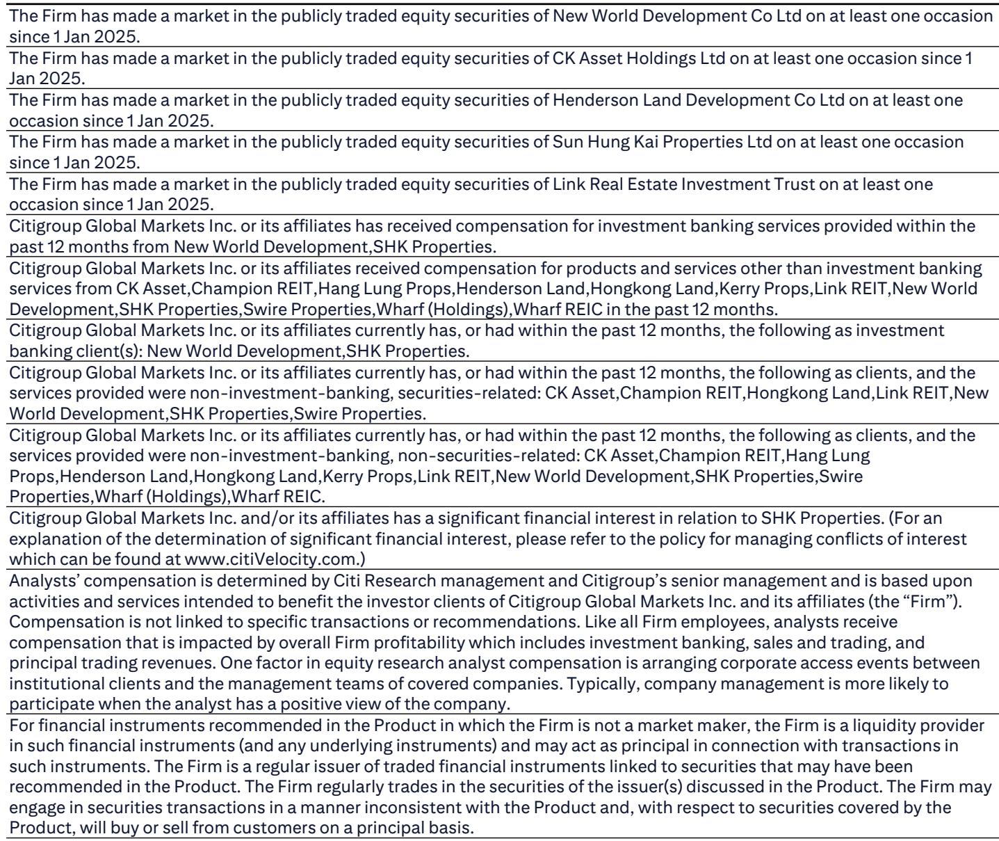
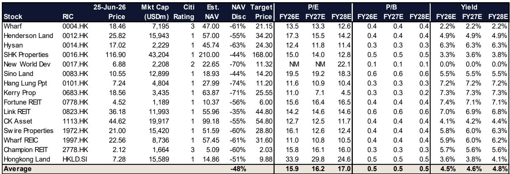
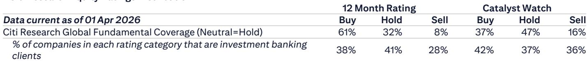

# Citi：香港地产的真正催化剂不在6月，而在8月

市场对香港地产的担忧集中在短期情绪和资金管制上，但Citi最新研报给出了一个反直觉的判断：这些短期扰动不会改变中期上行周期。6-7月股价可能继续波动，但真正的催化来自8月公布的强劲1H26业绩。

这份研报基于Citi近期举办的Property & Financials Conference，覆盖14家地产公司和全球投资者。其核心结论是：发展商利润率已明确触底，写字楼租金在核心区出现上涨动力，而零售租户销售正在改善。市场目前对政策执行和利率预期的担忧，恰恰可能为中期布局提供了窗口。

## 1. 内地资金管制的影响被市场高估，香港物业仍是CRS之外的资产配置选项

Citi在会议中与14家地产公司逐一确认后发现，内地ODI新规对香港住宅和写字楼市场“没有可衡量的实际影响”。过去一个月内仅有1-2例取消或延迟成交的个案，且与政策无关，属于正常波动。

更值得关注的是开发商提供的数据：非香港身份证买家占比始终低于10%。即使在启德这类内地买家集中的区域，非香港身份证持有者比例也仅约15%，尽管77%的买家姓名为内地姓氏。这意味着市场担忧的“资金断流”场景并未出现。

> **KC评论：** Citi指出一个常被忽视的关键点——香港物业不在中国CRS税务信息交换范围之内。这意味着对于部分高净值内地投资者，香港物业不仅是居住需求或租金回报的配置，更是一种资产保护和隐私安排。这个维度在公开讨论中很少被充分展开，完整报告中有更详细的分析框架。

## 2. 短期成交量波动是多重因素叠加，而非趋势逆转

Citi预计1H26E一手住宅登记量约12,500套，可能创21年新高；二手成交量同比增幅达35%。但仅6月单月，交易活动明显转淡。原因是五重压力同时出现：港股近期回调、买家因消息面波动而观望、恶劣天气、发展商放慢推盘节奏、以及价格回升后二手议价空间收窄。

然而Citi认为，这些周期性逆风“不太可能改变中期住宅价格上行周期”，因为根本支撑是2026-2028E的结构性供应短缺——每年完工量仅15,000-18,000套，远低于历史平均水平。这不是一个需求驱动的故事，而是一个供给约束的故事。

## 3. 发展商利润率已触底，1H业绩将是关键验证点

Citi判断，发展商利润率的明确触底将在1H26业绩中得到验证。背后的逻辑是高价库存的逐步出售——以启德为例，年初至今价格已上涨10-15%，项目经营利润率可达中双位数。

销售策略也在调整：发展商通过高端单位追求利润，同时保持大众项目的去化速度。强劲的销售回款正在降低负债率。Citi估计，新鸿基地产FY26E香港销售额可达370亿港元（目标300亿港元），恒基地产1H26E销售额170亿港元（对比FY25全年190亿港元）。

> **KC评论：** 利润率触底是整份报告最重要但最容易被忽视的判断。如果1H业绩确实验证了这一趋势，那么当前NAV折价44-74%的估值水平就可能被重新定价。完整报告中有每家公司的具体利润率拆解和土地储备分析。

## 4. 中环写字楼租金正在上涨，非核心区仍在消化供应

Citi观察到中环超甲级写字楼的即期租金正在逐步上升，背后是零新增供应和租户回流中环的趋势。这明显增强了业主的议价能力。其他区域仍在消化新增供应，竞争激烈，但金钟（受益于中环溢出需求）和西九龙（凭借高质量新供应抢占市场份额）表现较好。

租金续租负增长正在收窄。香港置地2026E续租租金估计为-5%，2027E将持平。重点项目方面：The Henderson已出租95%；Central Yards因收到强烈兴趣而获得了从容挑选租户的主动权，Citi预计2027年1Q前可全部租出；ICC凭借交通优势和全港最大楼层面积（78,000平方英尺），预计2027年前可实现合理的高承诺入住率；CKC II已接近50%承诺。

## 5. 零售租户销售正在改善，但租金反转仍需时间

Citi将零售租户销售增长排序为：内地奢侈品 > 香港奢侈品（同比增长10%以上） > 香港非必需消费品（同比增长0%以上）。虽然奢侈品零售在2H将面临基数效应消退，但Citi认为主要业主的租赁alpha能力应继续驱动相对市场的超额表现——例如太古地产北京三里屯和上海兴业太古汇资产重组后的上行空间，以及香港置地中环置地广场的品牌重开。

租金方面，部分奢侈品业主2026E仍面临负续租租金（如海港城），尽管租户销售良好，原因是到期租金基数较高；预计2027E才转为正增长。典型非奢侈品商场负续租幅度较小。社区商场即期租金已趋稳，但续租租金在2026E全年可能仍维持高单位数负增长。

## 6. 报告尚未完全回答的关键问题

Citi这份研报框架清晰，但有几个问题值得进一步推敲。

第一，中期供应短缺的假设是否足够稳健？2026-2028E每年15,000-18,000套的完工量如果因政府加快土地供应或私人发展商加速补库存而上调，上行周期的逻辑基础就会削弱。

第二，中环写字楼租金上涨能否持续？目前的故事依赖于零新增供应和回流趋势，但如果远程办公结构性压低需求，或非核心区优质供应分流租户，租金上行的幅度和持续性就需要重新评估。

第三，零售租金反转的时间点存在不确定性。Citi判断2027E才可能转正，但租户销售增长与租金之间的传导时滞有多长？如果消费信心进一步走弱，反转可能进一步推迟。

> **KC评论：** 这些未解问题恰好是完整报告的价值所在。Citi在报告中对每家公司的具体数据、假设和情景分析都有详细展开，包括估值表、NAV折让、股息率等关键指标。对于希望深入理解香港地产板块的投资者，这些细节才是决策的基础。

---

香港地产板块当前面临的情绪逆风是真实的，但Citi的框架提醒我们：区分短期噪音和中期结构。6-7月股价可能继续波动，但8月的业绩季将是下一个重要催化剂。对于那些愿意在不确定性中布局的投资者，当前NAV折价44-74%的估值水平，至少值得认真审视。

每天，我们的AI agent和人工团队会整理国际投行的中文摘要与KC评论，日更约10-40页，并附带当天最新数据图表合集。这些内容既方便喂给AI进行二次分析，也方便人工快速把握全球市场动态。欢迎来我们的星球微信群继续讨论——尤其是关于Citi这份报告中每家公司的具体拆解和估值假设，以及如何将其纳入你的观察框架。

Personal reading notes and learning share only. Not investment advice.

