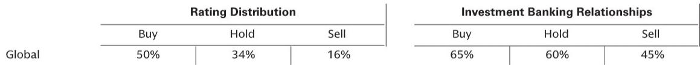

# The CPU Server Market Is About to Be Resurrected by Agentic AI, Not Just a Refresh Cycle

The conventional narrative in enterprise hardware has been simple: the data center is being rebuilt around the GPU. Nvidia’s dominance in AI training has made the CPU server seem like legacy infrastructure, a shrinking piece of the IT budget as organizations pour capital into accelerated computing. That story is incomplete, and it may soon reverse. According to analysis from a global investment bank’s expert network series, the CPU server market is poised for a structural re-rating driven by two forces that are far more consequential than a typical upgrade cycle: the emergence of agentic AI workloads and a massive, overdue refresh of an aging installed base. The opportunity is not marginal. The report suggests agentic AI alone could drive a 5x to 6x uplift in CPU server demand, fundamentally altering the ratio of CPU to GPU spend in enterprise data centers.

This is not a forecast about incremental growth. It is an argument that the CPU, long considered the commodity workhorse of the data center, is about to regain strategic importance. The implications extend across the hardware supply chain, from original equipment manufacturers like Dell and HPE to memory suppliers and cloud service providers. But the opportunity is constrained by a bottleneck that few investors are tracking closely: the global supply of DRAM. Understanding how these forces interact—demand acceleration, supply constraints, and a changing workload profile—is essential for anyone positioning in enterprise technology over the next 18 to 24 months.

## The Shift from Training to Inference and Agentic Workloads Will Reshape the CPU-to-GPU Spending Ratio

The most powerful insight in the report is not about absolute server volumes but about the changing composition of compute demand. For the past two years, the narrative has been dominated by AI training, a workload that is inherently parallel and therefore optimized for GPUs. The report estimates that in current AI training clusters, the ratio of CPUs to GPUs is roughly 1:4, but the spending ratio is far more skewed: for every dollar spent on CPUs, organizations spend between 50 and 80 dollars on GPUs. This reflects the enormous capital intensity of GPU-based training infrastructure.

Agentic AI changes this calculus fundamentally. Unlike training, which involves processing massive datasets in parallel, agentic AI workloads are characterized by sequential task execution, heterogeneous processing, and orchestration. These are tasks for which CPUs are inherently better suited. CPUs have direct access to DRAM, making them more efficient at feeding data into AI systems. They excel at the branching logic and decision-making that agents require. As enterprises move from building models to deploying autonomous agents that interact with systems, query databases, and execute workflows, the compute profile shifts.

The report projects that over time, the CPU-to-GPU ratio in these environments could move toward 1:1, with the spending ratio compressing to roughly one dollar of CPU spend for every six to ten dollars of GPU spend. That represents a five-to-sixfold increase in CPU server demand relative to the current baseline. This is not a forecast that the GPU market shrinks; it is a forecast that the CPU market grows substantially as a complementary, not substitute, compute layer. The strategic implication is clear: hardware vendors with deep enterprise relationships and broad general compute portfolios are better positioned to capture this wave than those focused solely on accelerated computing.

## The Installed Base of Traditional Servers Is Six Years Old, Creating a Compelling Refresh Cycle with a Two-to-Three-Year Payback

The second driver of CPU server demand is more traditional but no less powerful: the aging of the installed base. The report notes that the average age of traditional servers in enterprise data centers is approximately six years, compared to a historical average lifecycle of three to four years. This aging is not accidental. Organizations have systematically deferred general-purpose server upgrades over the past two to three years, redirecting IT budgets toward GPU infrastructure and AI training capacity.

The result is a pent-up refresh cycle that is now economically unavoidable. The report provides an illustrative example that makes the case concretely: an enterprise could replace 1,000 older servers with approximately 350 current-generation servers, a densification ratio of roughly three to one. This consolidation is driven by a fourfold increase in core counts and a twofold increase in memory density per core in the latest generation of CPU servers. The operational savings are substantial. The report estimates that such a refresh could reduce power spend by approximately one million dollars per year. At current server pricing, this implies a payback period of two to three years.

For cloud service providers, the densification argument is even more urgent. Power constraints are becoming a limiting factor for compute growth across the industry. Replacing older, less efficient servers with denser, more power-efficient ones is not just a cost-saving measure; it is a capacity-enabling one. For enterprise customers, the refresh is also a prerequisite for running agentic AI workloads. The report makes a subtle but important point: running AI agents 24/7 will accelerate the mean time to failure for servers. An already aging installed base will become increasingly unreliable under continuous agentic workloads. The refresh cycle is therefore not optional; it is a precondition for the AI strategy many enterprises are already pursuing.

## Only Half of Enterprise Server Demand Is Being Fulfilled, and the DRAM Bottleneck Will Persist for at Least 18 Months

This is where the bullish thesis meets a hard constraint. The report estimates that only approximately 50 percent of enterprise server demand at major OEMs like Dell and HPE is currently being fulfilled. The root cause is not a shortage of CPUs or server chassis; it is a shortage of DRAM. The hyperscalers and AI model builders have been consuming enormous quantities of high-bandwidth memory for GPU clusters, squeezing the DRAM supply chain. Memory manufacturers have prioritized their largest and most strategic customers, leaving enterprise server OEMs with insufficient allocations.

This supply constraint has two immediate effects. First, it has created significant backlog expansion at Dell and HPE, providing visibility into future revenue that is not yet reflected in current shipments. Second, it means that the demand signal is being masked. Reported server shipments understate true demand, and the gap will persist until more memory capacity comes online. The report suggests that it will take at least another 18 months for a larger share of this demand to be met, roughly aligned with the timeline for additional DRAM production capacity to ramp.

The pricing implications are also important. The report argues that even when supply constraints ease, server prices are likely to remain elevated. CPU and memory suppliers have learned to prioritize their largest customers and are unlikely to revert to a commodity pricing model. The long tail of smaller server vendors and manufacturers will continue to face allocation challenges, further concentrating market share among the largest OEMs. For investors, this means that revenue growth at Dell and HPE may be more durable and higher-margin than current Street estimates assume, and that the backlog represents a multi-year demand tailwind rather than a temporary spike.

## What the Report Does Not Fully Answer: The Elasticity of Enterprise AI Demand and the Risk of Over-Investment

For all its structural insight, the report leaves several critical questions open. The most important is the elasticity of enterprise demand for agentic AI. The 5x to 6x uplift in CPU server demand is predicated on a specific assumption about the adoption rate of agentic workloads. But agentic AI is still in its early stages. Many enterprises are experimenting with proof-of-concept deployments, not full-scale production rollouts. The report does not address what happens if the adoption curve is slower than expected, or if enterprises find that they can run agentic workloads on existing infrastructure with software optimization rather than new hardware.

A second open question is the potential for substitution. The report assumes that CPUs are structurally better suited for agentic tasks, but GPU architectures are evolving rapidly. Nvidia and others are adding CPU-like capabilities to their accelerators, and the line between general-purpose and specialized compute is blurring. If GPU vendors successfully capture some of the agentic workload, the CPU uplift could be smaller than projected.

Finally, the report does not fully explore the risk of over-investment. The current supply constraints are creating a backlog, but they are also encouraging OEMs and their customers to double-order and inflate demand signals. When memory supply eventually normalizes, there is a risk of an inventory correction that could temporarily depress shipments. Investors should watch for signs of channel inventory buildup as a leading indicator of a demand normalization cycle.

## A Decision Framework for Positioning in the CPU Server Opportunity

For readers trying to translate this analysis into actionable decisions, a structured framework is useful. The opportunity can be assessed along three dimensions: exposure to the enterprise refresh cycle, exposure to the agentic AI CPU uplift, and exposure to the supply constraint dynamics.

First, the enterprise refresh cycle is the most predictable and near-term driver. Companies with large installed bases of aging servers, particularly in industries like financial services, healthcare, and manufacturing, will need to upgrade regardless of AI adoption. The economic payback is compelling on its own terms. The key question for investors is which OEMs and component suppliers have the most leverage in this segment. Dell and HPE are the obvious beneficiaries, but memory suppliers like Micron and SK Hynix also stand to gain from the DRAM demand recovery.

Second, the agentic AI uplift is the higher-risk, higher-reward component. It depends on adoption rates that are difficult to forecast with precision. Investors should focus on companies that have both general compute and AI capabilities, as they are best positioned to capture the convergence of workloads. The report suggests that CPU-centric vendors with deep enterprise relationships may be undervalued relative to pure-play GPU names.

Third, the supply constraint creates a timing opportunity. The 18-month horizon for memory normalization means that the current backlog is likely to persist through 2026. Companies with strong supply chain relationships and allocation priority will benefit disproportionately. The long tail of smaller vendors will continue to struggle, potentially creating consolidation opportunities.

The most important unresolved question is whether the CPU server uplift is a one-time cycle or a structural shift. If agentic AI becomes the dominant compute paradigm for enterprise workloads, the CPU could regain its position as the central processor in the data center, with GPUs relegated to specialized training clusters. That outcome would have profound implications for the entire hardware ecosystem, from server architecture to software stack design. The report provides compelling evidence that this scenario is plausible, but it is not yet certain.

## Join the Community to Read the Full Report and Review the Original Charts

The analysis above draws on the key insights from a detailed expert network session hosted by a global investment bank. The original report contains the full interview transcript, detailed projections on server pricing and memory allocation, and proprietary charts on the CPU-to-GPU spending ratio and server age distribution. For investors, enterprise technology strategists, and supply chain analysts who want to understand the full picture including the granular data and the expert's complete reasoning, the report is essential reading.

Join the community to read the full report and review the original charts.

*This article is for learning and discussion only and does not constitute investment advice.*

Personal reading notes and learning share only. Not investment advice.

