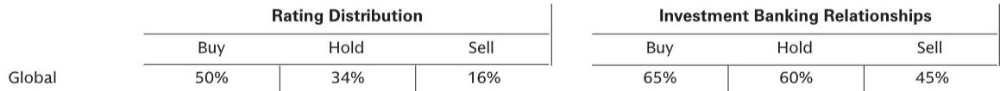

# GS：AI已在广告业全面部署，但真正的赢家不是科技公司

戛纳国际创意节刚刚落幕。GS分析师团队在四天内与超过20家广告主、广告集团、独立代理机构和广告技术公司进行了密集交流。得出的结论值得每一位关注AI商业落地的读者认真审视。

这份报告最核心的判断是：AI正在从根本上改变广告业的成本结构和竞争逻辑，但最大的受益者可能不是人们以为的科技公司，而是那些能够把技术转化为服务溢价的传统广告集团。

当市场还在争论AI会不会取代人类创意时，广告业已经悄悄完成了从“要不要用AI”到“怎么用好AI”的转变。GS团队发现，AI已经几乎被部署在所有广告活动中——不是试点，不是测试，而是全面铺开。

这背后隐藏着一个更重要的信号：广告支出与GDP的相关性正在被打破。

## 1. 2026年广告支出与GDP脱钩，AI玩家的增量资金正在改写行业周期

长期以来，广告行业被视为经济的滞后指标——企业只有在经济向好时才会增加营销预算。但这个规律正在被打破。

GS团队在戛纳获得的关键反馈是：2026年广告支出预期上调，增量资金主要来自AI企业。这些新玩家为了抢占市场份额，正在大规模投入品牌建设和效果广告。即使中东地缘冲突持续，也未能阻挡这一趋势。

但这并不意味着行业已经进入新周期。报告同时指出，2027年将面临更严峻的挑战——届时大型体育赛事和政治广告等一次性刺激因素将不再存在，行业需要靠内生增长来维持当前增速。

> **KC评论：** 这意味着2026年可能是一个特殊的“政策窗口”。AI企业的广告投放带有强烈的“占位”性质，一旦市场份额稳定，这部分增量可能快速消退。对于广告集团而言，2026年的营收增长不能简单线性外推。

## 2. 大语言模型在广告变现上面临结构性天花板，搜索广告仍是最大战场

市场普遍认为，大语言模型公司（如OpenAI、Google DeepMind等）将凭借技术优势快速抢占广告市场。但GS的调研给出了不同的信号。

报告指出，大语言模型公司要规模化广告收入，可能需要外部帮助。它们虽然可以进入搜索、品牌和效果广告预算池，但真正的问题在于：生成式搜索作为一个广告品类，其规模增长将是指数级的，但变现效率能否同步提升仍是未知数。

这意味着，大语言模型公司面临一个两难选择：要么自己搭建广告系统，投入巨大且与核心研发能力不匹配；要么与现有广告平台合作，但可能失去对用户数据和广告定价的控制权。

> **KC评论：** 这里的关键变量是“服务”。GS团队发现，广告主需要的不仅是技术工具，而是围绕技术的全套服务——策略制定、效果优化、合规审核。这正是传统广告集团的核心能力，也是大语言模型公司短期内难以复制的护城河。

## 3. AI全面部署但没有带来裁员，广告集团的生产收入正在增长

这是整份报告中最反直觉的发现之一。

在所有20多场会议中，GS团队没有听到任何一家大型广告集团讨论裁员。相反，AI的部署正在推动广告集团的生产收入增长——因为客户需要更多与AI相关的创意制作、数据整合和效果分析服务。

这打破了两个常见假设：第一，AI会取代创意人员；第二，技术工具会压缩服务商的利润空间。现实恰恰相反，AI的普及创造了对“技术服务”的新需求，而拥有规模优势和客户关系的广告集团正在从中受益。

戛纳创意节的参会人数远超往年，也从侧面印证了行业的乐观情绪。广告主、技术平台和服务商都在积极寻找新的合作模式。

## 4. 广告主组织变革面临“CMO任期陷阱”，这为广告集团创造了战略窗口

报告揭示了一个被多数投资者忽视的结构性问题：广告主自身的营销组织架构可能需要进行根本性调整，以适应AI时代的决策逻辑。但改变极其困难且耗时。

核心障碍在于CMO（首席营销官）的任期普遍较短。GS团队在调研中发现，CMO往往只有两到三年的任期窗口，而组织架构调整至少需要一至两年才能看到效果。在这种时间错配下，CMO更倾向于选择“见效快”的战术性举措，而非战略性重构。

这为广告集团创造了独特的价值定位：它们可以充当广告主的“外部营销能力平台”，在不触动内部组织架构的前提下，提供AI驱动的营销解决方案。广告主不需要自己搭建AI团队，只需要购买服务。

## 5. 媒体代理机构有望成为大语言模型token的“批发商”，但管理层是否愿意行动？

GS团队提出了一个极具前瞻性的判断：媒体代理机构可能成为大语言模型API token的聚合采购方。

逻辑很简单：当越来越多的广告活动需要调用大语言模型的能力时，单个广告主的采购量有限，议价能力弱。而大型媒体代理机构可以集中采购数亿甚至数十亿token，获得更优惠的定价，然后将其整合到自己的广告投放平台中。

但报告也提出了一个尖锐的问题：管理层真的会抓住这个机会吗？历史上，广告集团在技术转型中往往行动迟缓，更多是被动应对而非主动布局。这次是否会例外，将决定下一轮竞争格局。

## 6. LLM可能让DSP界面商品化，但“购买代理”真的比DSP更高级吗？

需求方平台（DSP）是程序化广告的核心基础设施。GS团队指出，大语言模型可能让DSP的用户界面变得不再重要——当广告主可以直接用自然语言描述目标人群和预算约束时，复杂的DSP操作界面将失去价值。

更进一步，代理型AI（Agentic AI）理论上可以完全取代DSP，让机器自动完成广告竞价和投放。

但报告没有回避一个根本性问题：购买代理和DSP真的有本质区别吗？如果只是把DSP的操作界面换成聊天机器人，那不过是技术层面的迭代，而非商业模式的颠覆。真正的变革在于，谁能够把AI能力转化为可持续的差异化服务。

## 7. LiveRamp的护城河比想象中更宽，但竞争对手正在追赶

数据互联平台LiveRamp在广告技术生态中扮演着关键角色。GS调研显示，行业普遍认为LiveRamp的服务难以复制——尽管Omnicom宣称已经成功替代，Dentsu也在自建替代方案。

报告特别指出，LiveRamp被Publicis收购后，将帮助后者实现其既定的战略目标。这意味着数据能力正在成为广告集团核心竞争力的关键拼图，而拥有独立数据平台的公司将在竞争中占据更有利的位置。

## 报告尚未完全回答的关键问题

GS这份报告的价值在于提出了正确的问题，但有些答案仍待时间验证。

第一，AI带来的生产收入增长是可持续的结构性提升，还是客户尝鲜带来的短期脉冲？报告的调研时间点恰逢AI热潮高峰，不排除存在“霍桑效应”——客户因为新鲜感而增加投入。

第二，广告集团能否真正实现从“服务商”到“平台商”的跃迁？报告指出了机会，但没有给出明确的路径判断。这需要观察管理层在资本配置、技术投入和人才结构上的具体动作。

第三，大语言模型公司的广告变现策略将在多大程度上改变行业格局？报告认为它们需要帮助，但以这些公司的技术实力和资金储备，不排除在短期内推出颠覆性的广告产品。

---

这些未解问题，恰恰是理解未来18个月广告行业投资逻辑的关键。GS的完整报告提供了更详细的财务模型和公司层面分析，包括每家主要广告集团的AI收入占比、成本结构变化以及估值框架。

我们每天由AI agent和人工review生成国际投行中文摘要与KC评论，daily更新约10-40页，并整理当天最新数据图表合集，方便喂给AI，也方便人工快速把握market dynamics。欢迎来星球微信群里继续讨论，一起跟踪这些关键变量的演变。

Personal reading notes and learning share only. Not investment advice.

