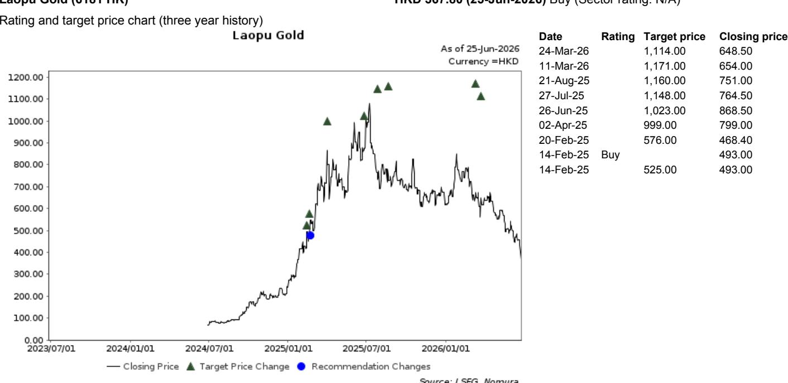
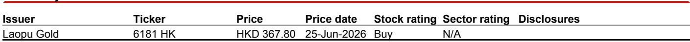

# China’s Luxury Consumer Is Not Recovering — It Is Recalibrating, and the Divergence Between Brands Is the Only Signal That Matters

The most important takeaway from a recent channel check on a leading luxury shopping mall in Nanjing is not that foot traffic is up 10% year-on-year in the second quarter of 2026. It is that total sales value grew by only a mid-single-digit percentage, even as foot traffic expanded at a much faster rate. That gap is the single most revealing data point in the entire report. It tells us that Chinese consumers are visiting malls more often but spending less per visit, and that the composition of that spending is shifting in ways that will determine which luxury brands survive the next two years and which ones do not.

This is not a cyclical slowdown that will reverse when consumer confidence returns. It is a structural recalibration. The Nanjing mall data, gathered from an expert with deep knowledge of high-end consumption trends, shows that consumers are rotating their wallets away from discretionary luxury goods and toward experience-driven purchases and carefully selected premium items. The mall itself has leaned into this shift, using promotional windows such as the Labor Day holiday, the "520" celebration, and its own 20th anniversary to stimulate experience-focused spending. That strategy has worked for foot traffic but has not translated into proportional revenue growth.

The divergence between brands within the same mall is even more instructive. Global jewelry leader Van Cleef & Arpels posted double-digit same-store sales growth in the second quarter. Cartier, also owned by Richemont, saw its year-on-year decline narrow. Meanwhile, domestic premium jewelry brand Laopu Gold, which had been growing at over 70% year-on-year in the first quarter, moderated to 40–50% growth in the second quarter. The expert attributes this slowdown to two factors: intensifying competition as more gold jewelry brands entered the mall, and weakening consumer sentiment driven by falling gold prices. These are not isolated dynamics. They are early signals of a market that is fragmenting along lines of brand equity, product category, and pricing power.

The luxury brand segment tells a similar story. Dior showed clear signs of recovery. Hermès, Louis Vuitton, and Chanel held steady. But other luxury brands continued to see downward sales trends. The market is not moving as a bloc. It is splitting into winners and losers based on factors that are only partially understood by most investors.

This article will unpack what the Nanjing mall data really means, why the divergence between brands is the only signal that matters, and what strategic questions remain unanswered. It will also provide a decision framework for investors who need to navigate this increasingly complex landscape.

## The Gap Between Foot Traffic and Spending Is the Real Story, and It Signals a Structural Shift in Consumer Behavior

When foot traffic grows at 10% year-on-year but total sales value grows at only a mid-single-digit rate, something fundamental has changed in how consumers behave inside the mall. The obvious explanation is that consumers are buying less per trip. But the more important interpretation is that they are buying differently.

The expert's observation that consumers are more focused on experience-related consumption is not a throwaway comment. It is the strategic center of gravity for the entire report. Experience spending — dining, entertainment, services — tends to have lower average transaction values than luxury goods. When a mall fills its promotional calendar with events designed to drive foot traffic for experiences, it is effectively trading higher-margin luxury sales for higher-volume foot traffic. That trade works for the mall's occupancy and tenant mix, but it does not translate into proportional revenue growth for luxury brands.

This is a structural shift because it reflects a change in consumer priorities, not just a temporary belt-tightening. Chinese consumers are signaling that they value experiences over objects, and that they are willing to spend time in luxury environments without spending money on luxury goods. For luxury brands, this means that foot traffic is no longer a reliable leading indicator of sales. Brands that rely on mall traffic to convert window shoppers into buyers will find that conversion rates are structurally lower than they were two years ago.

The implication is stark: brands must either increase their conversion rates through superior product desirability or accept that their revenue growth will lag foot traffic growth indefinitely. The data from the Nanjing mall suggests that most brands have not yet solved this equation.

## The Divergence Between Jewelry Brands Reveals That Pricing Power and Brand Heritage Are the Only Defensible Moats

The contrast between Van Cleef & Arpels and Laopu Gold is the most analytically useful data point in the entire report. Van Cleef, a global heritage brand with decades of brand equity, continues to grow at double-digit rates. Laopu Gold, a domestic premium brand that had been growing at over 70% year-on-year, has decelerated sharply to 40–50% growth.

The expert's explanation — intensifying competition and falling gold prices — is correct as far as it goes, but it misses the deeper strategic implication. Laopu Gold's growth moderation is not just a function of competition and gold price volatility. It is a sign that its competitive advantage was partially dependent on a favorable tailwind that is now fading. When gold prices fall, consumers who were buying gold jewelry as a store of value may delay purchases or switch to other asset classes. When more gold jewelry brands enter the same mall, Laopu Gold's differentiation erodes.

Van Cleef, by contrast, competes on design, brand heritage, and exclusivity — factors that are largely independent of gold prices and competitive density. Its customers are not buying gold. They are buying Van Cleef. That distinction is the difference between a brand that can sustain growth through a downturn and one that cannot.

The same logic applies to luxury brands. Dior's recovery and Hermès's stability suggest that brands with strong identity and pricing power are weathering the recalibration better than brands that rely on broad appeal or discounting. The luxury brands that are still declining are likely those that lack the brand equity to command full-price sales in a market where consumers are more discerning and less willing to spend impulsively.

The strategic lesson is clear: in a market where foot traffic is decoupling from sales, brand moats matter more than ever. Brands that compete on price, product availability, or category tailwinds will face margin compression and growth deceleration. Brands that compete on identity, heritage, and desirability will maintain their pricing power and their growth trajectory.

## The Report Does Not Fully Answer Whether This Recalibration Is Urban-Tier Specific or National

One of the most important unanswered questions in the report is whether the Nanjing mall data is representative of China as a whole or specific to first-tier and second-tier cities. Nanjing is a major city in Jiangsu Province, a wealthy region with a high concentration of luxury consumers. The behavior of shoppers in Nanjing may not reflect the behavior of shoppers in lower-tier cities where luxury penetration is lower and consumer preferences are different.

If the recalibration is concentrated in top-tier cities, then luxury brands with exposure to lower-tier markets may be insulated from the trend. But if the recalibration is national, then the divergence between brands will widen further as weaker brands lose share in all markets.

The report also does not address the role of online luxury sales in the recalibration. If consumers are shifting their luxury spending from physical malls to digital channels, then the foot traffic data from a single mall may overstate the weakness in overall luxury demand. The expert's observations are limited to a single physical location, and the report does not provide data on online sales or omnichannel behavior.

These gaps are not criticisms of the report. They are the natural limitations of a channel check based on a single expert and a single mall. But they are gaps that investors must fill with their own analysis. Without understanding the geographic and channel dimensions of the recalibration, it is impossible to know whether the Nanjing data is a leading indicator or an outlier.

## A Decision Framework for Investors: Three Questions to Determine Which Brands Will Win and Which Will Lose

Investors cannot rely on aggregate luxury market data to make stock selection decisions in this environment. The divergence between brands is too wide, and the structural shift is too recent. Instead, investors need a framework that isolates the factors that determine a brand's ability to maintain pricing power and growth through the recalibration.

The first question: Does the brand compete on identity or on category? Brands that compete on identity — Van Cleef, Hermès, Dior — have moats that protect them from competition and price volatility. Brands that compete on category — gold jewelry, basic luxury accessories — are vulnerable to competitive entry and input cost changes. Investors should favor identity-led brands and avoid category-led brands unless they have clear evidence of superior execution.

The second question: Does the brand have pricing power independent of the macro environment? Brands that can raise prices without losing customers are brands that have earned consumer trust and desire. Brands that rely on promotional activity or discounting to drive sales will see their margins compress as consumers become more price-sensitive. The Nanjing data suggests that pricing power is the single best predictor of which brands are maintaining growth.

The third question: Is the brand's growth dependent on a single channel or a single market? Brands that are over-indexed to physical malls in top-tier cities are more exposed to the recalibration than brands with diversified channel and geographic exposure. The Nanjing mall data is a warning for brands that have not invested in omnichannel capabilities or lower-tier city expansion.

These three questions will not produce a perfect answer for every brand, but they will separate the brands that are structurally positioned for the next phase of Chinese luxury consumption from those that are riding tailwinds that are about to fade.

## The Full Report Contains the Charts and Data That Make This Analysis Actionable

The analysis in this article is based on a single channel check from a single mall, interpreted through a strategic lens. But the full report contains the original data, the expert's verbatim observations, and the charts that show the year-on-year trends for each brand and category. Without that data, investors are making decisions based on interpretation rather than evidence.

The report also includes the analyst's valuation methodology and target price for Laopu Gold, which provides a concrete example of how the analyst applies the framework to a specific stock. That kind of detail is invaluable for investors who want to see how the analysis translates into investment decisions.

Join the community to read the full report and review the original charts.

*This article is for learning and discussion only and does not constitute investment advice.*

Personal reading notes and learning share only. Not investment advice.

