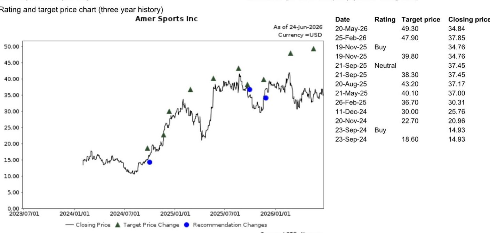
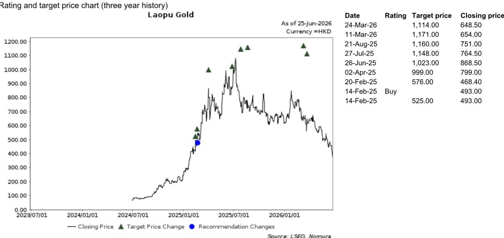
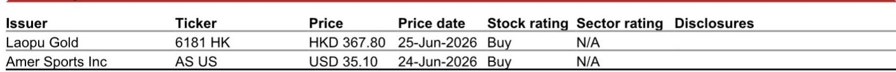

# NOM：高端mall的韧性，藏在K型分化的裂缝里

当市场对中国消费的普遍叙事停留在“降级”与“收缩”时，一份来自NOM的渠道调研给出了截然不同的截面。这份报告的核心判断是：中国高端消费并未崩塌，而是在经历一场剧烈的K型分化。头部高端购物中心的销售额在2026年第二季度虽然边际放缓，但整体仍保持正增长，且NOM专家对下半年持乐观态度。这并非盲目的乐观，而是基于一个清晰的逻辑：财富效应正在从股市和一线城市楼市传导至特定人群，而高端mall正是这一效应的直接受益者。这份报告的价值，不在于它给出了一个简单的“好”或“坏”的结论，而在于它拆解了“谁在增长、谁在承压、背后的驱动力是什么”。

> **KC评论：** 这份报告最值得关注的信号是“K型复苏”在中国消费领域的具象化。它意味着，用宏观消费数据一刀切地判断所有消费类资产，可能会犯下严重的错误。对于投资者而言，真正的功课不是判断消费整体是冷是热，而是识别出哪些细分赛道和商业模式正在享受K型曲线的上半段。

以下，我们将基于NOM这份最新的渠道调研纪要，拆解其核心洞察，并探讨这些信号对投资决策的含义。

## 1. 二季度销售边际放缓，但“韧性”才是关键词，而非“衰退”

NOM专家调研的这家拥有超过100个中高端购物中心的头部运营商，其同店销售（SSS）在4月录得中单位数同比增长，5月回升至高单位数增长，6月至今又回落至中单位数。从月度波动看，确实出现了边际放缓，尤其是对比3月份低双位数（luxury brands）的增速。但需要强调的是，整体依然处于正增长区间，且客流同样保持正向增长。

这组数据最核心的启示是：高端消费的基本盘并未动摇。市场此前对消费的悲观预期，可能过度定价了“断崖式下跌”的风险。实际上，高端mall的客流和销售额仍在增长，只是增速从“高景气”回到了“稳健”区间。对于依赖高端消费场景的运营商和品牌而言，这并非利空，而是一个正常的节奏调整。

> **KC评论：** 我们建议读者关注报告中没有直接展开的细节：5月增速的跳升是“营销活动”驱动的。这意味着，高端mall的销售对运营方的主动管理能力高度敏感。在整体消费情绪偏谨慎的环境下，能够通过精准营销、品牌调整和活动策划来撬动消费的运营商，将获得明显的超额收益。完整报告中，专家对这家具体运营商在2H26的营销策略和租户调整有更详细的拆解，这是判断其下半年业绩能否超预期的关键变量。

## 2. 奢侈品增速放缓，但“韧性”从何而来？答案藏在“K型”的财富效应里

报告明确指出，奢侈品整体SSG在二季度有所放缓，低于3月约10%的同比增长。这看似是负面信号，但NOM专家对下半年的乐观预期，恰恰建立在对这一放缓的解读之上。关键不在于奢侈品“放缓了”，而在于“谁在放缓”以及“谁还在买”。

专家的逻辑是：中国消费正在经历K型复苏。富裕消费者，作为股市上涨和一线城市（如上海、深圳）楼市企稳的直接受益者，其购买力并未受损，甚至有所增强。高端mall的奢侈品销售放缓，更多是基数效应和消费节奏的调整，而非需求端的根本性萎缩。真正承压的是大众消费和中低端mall，而高端mall恰恰服务的是K型曲线的上半段。

这一判断如果成立，那么对于持有高端消费资产（如高端mall运营商、顶级奢侈品牌、以及服务于高净值人群的黄金珠宝品牌）的投资者而言，下半年的市场情绪修复将带来显著的估值重估机会。市场可能低估了财富效应对高端消费的支撑力度。

## 3. 黄金珠宝内部分化：老铺黄金的“逆势”样本，揭示了品牌溢价的力量

在整体黄金珠宝SSG在4月和5月录得低双位数至中双位数同比下滑的背景下，老铺黄金（6181 HK，NOM给予买入评级）的表现堪称“异类”。报告显示，老铺黄金在4月的SSG同比增长约50%，5月更是加速至超过60%。

这组数据极具穿透力。它说明，在黄金珠宝这个看似同质化的赛道里，已经出现了显著的品牌分化。老铺黄金的成功，并非简单的“金价上涨”或“消费降级”可以解释。NOM专家指出，老铺黄金正通过战略性店铺调整和针对高端奢侈消费者的特殊营销活动，稳步向奢侈品牌定位迈进。这意味着，它成功地从“卖黄金”转向了“卖品牌、卖设计、卖文化”，从而锁定了K型曲线中上半段的高净值客群。

对于投资者而言，老铺黄金的案例提供了一个清晰的选股框架：在消费分化的时代，能够成功建立品牌护城河、脱离同质化竞争的公司，将获得远超行业平均的增长。这不仅适用于黄金珠宝，也适用于所有消费品类。报告中专家对老铺黄金如何具体执行其品牌升级策略有更深入的访谈内容，包括其店铺选址逻辑和与奢侈品牌的差异化竞争手段。

## 4. 户外赛道：高端运动品牌的“韧性”是结构性趋势，而非短期现象

与黄金珠宝的疲软形成鲜明对比，户外运动赛道展现出惊人的韧性。报告提到，以始祖鸟（Arc‘teryx）和萨洛蒙（Salomon）为代表的高端运动品牌，在二季度依然保持了超过20%的同店销售同比增长。

这进一步验证了户外运动是一个具有长期结构性红利的赛道。它同时满足了“健康生活方式”、“社交货币”和“功能性消费”三重需求，且核心客群与高端mall的消费者高度重合。对于这些品牌的所有者，如亚玛芬体育（AS US，NOM给予买入评级），其在中国市场的增长故事远未结束。

> **KC评论：** 这里有一个报告没有完全展开，但值得深思的追问：始祖鸟和萨洛蒙的高增长，在多大程度上是“品牌势能”的释放，又在多大程度上是“户外赛道整体渗透率提升”的结果？如果是前者，那么当品牌热度消退时，增速可能面临回落；如果是后者，则意味着整个户外产业链都将受益。完整报告中对亚玛芬体育各个板块的估值模型和增长驱动因素有更细致的拆解，这对于判断其当前估值是否合理至关重要。

## 5. 报告尚未完全回答的关键问题：K型复苏的可持续性取决于什么？

NOM专家的乐观预期，建立在一个关键假设之上：股市和一线城市楼市的财富效应能够持续。然而，这正是当前宏观环境下最大的不确定性。

报告指出了“K型复苏”的受益方，但并未深入讨论其可持续性。如果A股和港股的市场情绪再度转弱，或者一线城市房价出现二次探底，那么支撑高端消费的财富效应可能会迅速消退。届时，高端mall的销售韧性将面临真正的压力测试。

另一个悬而未决的问题是：高端mall运营商自身的商业模式能否抵御这种波动？它们能否通过灵活的租户组合调整（例如，增加餐饮和娱乐业态占比）来对冲奢侈品销售的周期性？这份报告提供了部分线索（餐饮和娱乐增速更快），但没有给出量化模型。

这些未解之谜，恰恰是深入阅读完整报告的价值所在。NOM的分析师在报告中提供了更详细的分品类数据、对运营商经营策略的访谈、以及对关键假设的压力测试情景。

## 6. 给读者的观察框架：如何追踪K型消费的下一步信号

基于以上分析，我们建议读者建立一个“三分法”观察框架，来持续追踪中国消费的K型分化：

第一，盯住“财富效应”的锚。持续关注中国股市的成交量、两融余额，以及一线城市（特别是上海、深圳）的二手房成交量和价格走势。这些是判断高端消费购买力是否稳固的最领先指标。

第二，区分“品牌势能”与“行业贝塔”。对于任何消费公司，都要问一个问题：它的增长，是来自于行业整体风口的推动，还是来自于自身品牌力的提升？老铺黄金和始祖鸟的案例说明，品牌势能是穿越周期的核心资产。

第三，关注“运营效率”的差异。在高端mall领域，运营商的主动管理能力（如招商、营销、活动策划）正在成为决定同店销售增速的关键变量。能够持续吸引客流、提升客单价、优化租户结构的运营商，将获得更高的估值溢价。

这份NOM报告的价值，正是在于它提供了一个从微观视角验证宏观判断的绝佳样本。它告诉我们，不要被宏大的叙事所迷惑，真正的机会和风险，往往藏在那些看似矛盾的数据细节里。

---

以上分析仅基于NOM报告的公开信息。要获取完整的原始图表、专家访谈全文、以及NOM对老铺黄金和亚玛芬体育的详细估值模型与目标价，欢迎加入我们的知识星球。我们每天由AI agent与人工review相结合，精选并翻译国际投行（GS、MS、NOM、UBS等）的中文摘要与KC评论，每日更新约10-40页，并整理当天最新数据图表合集，方便您喂给AI，也方便快速把握全球市场dynamics。在这里，您可以与数百位产业决策者和专业投资者一起，持续追踪这些关键的边际变化。

Personal reading notes and learning share only. Not investment advice.

