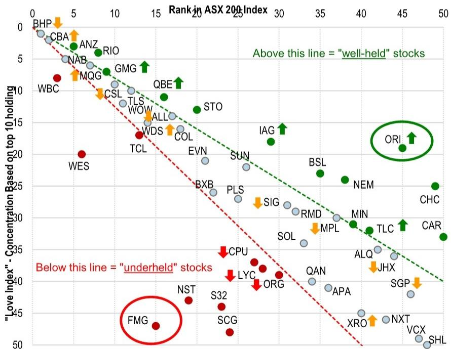
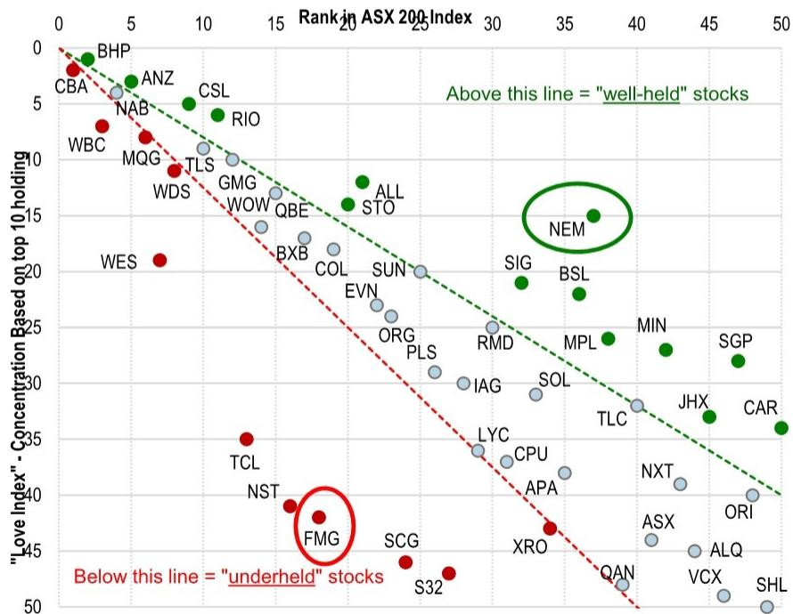
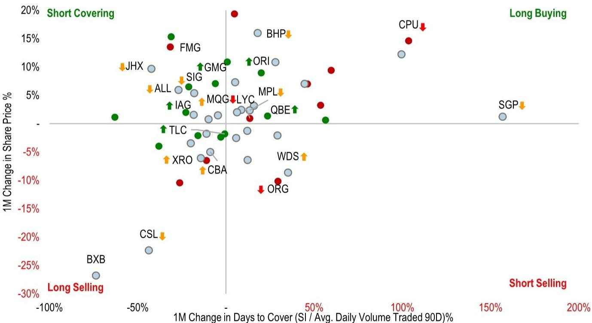

# The Great Rotation Has Begun: Why Australian Fund Managers Are Abandoning Defensives and What Comes Next

The most significant portfolio shift of the past several years is now visible in the data, and it is not a tactical adjustment. Australian equity fund managers executed a broad and coordinated retreat from defensive sectors in May, cutting combined active weight in Communications, Staples, and Healthcare by approximately 59 basis points. Nearly 70 percent of the managers tracked reduced their Communications and Healthcare positions simultaneously. This is not noise. This is the opening phase of a structural rotation.

For investors who have spent the last two years hiding in safe-haven names, the question is no longer whether to rotate, but how far the unwind will go. The data from May suggests this is a deliberate, conviction-driven shift, not a mechanical rebalance. Managers are not simply trimming positions that performed well; they are actively reducing exposure to a category that has dominated their portfolios for an extended period. The pattern is consistent across sub-sectors, and the speed of the move is notable.

The counterpoint to this defensive retreat is the surge in Materials, which added 230 basis points of index weight in a single month. Every single fund in the universe raised their Materials holdings. Yet the critical insight is that this was overwhelmingly a passive response to price appreciation, not a bold bet on the sector. Only 40 percent of managers increased their active weight, meaning the majority used the rally to quietly reduce relative exposure. This creates a fascinating tension: defensives are being sold with conviction, while cyclicals are being bought with reluctance.

Understanding the asymmetry in positioning, the divergence between active and passive flows, and the unresolved questions about conviction holders will determine whether this rotation delivers outsized returns or painful reversals. The report from which this analysis is drawn provides the granular data to navigate this transition. What follows is a strategic interpretation of what the numbers mean, what they do not yet tell us, and how to build a decision framework around them.

## The Defensive Unwind Is Broad, Deep, and Likely Structural, Not Tactical

When nearly 70 percent of fund managers cut positions in a sector simultaneously, the natural instinct is to ask whether this is a coordinated panic or a rational repricing. The data supports the latter. The defensive complex had been the most favoured positioning for an extended period, and the May move represents a deliberate scaling back rather than a forced liquidation.

Communications led the retreat with a 30 basis point reduction in active weight, followed by Staples at 13 basis points and Healthcare at 11 basis points. Critically, when stripping out the benchmark move, approximately 70 percent of managers actively cut their Communications weight. This is not a story of managers being carried out of positions by falling prices. This is active selling.

The z-score analysis reinforces the point. The scale back in Communications hit nearly two standard deviations relative to its seven-year average. Combined with downweighting in Staples, Healthcare, and Utilities, the overall defensive overweight narrowed by 1.8 standard deviations. These are not garden-variety portfolio adjustments. They are signals that a consensus view is breaking.

Why does this matter for strategic decision-making? When a consensus trade begins to unwind, the speed and magnitude of the move often surprise participants. The managers who held the largest defensive overweights face a binary choice: defend their conviction or capitulate to the broader flow. The data shows that positioning within Communications remains highly polarised, with the three largest active overweights averaging plus 7.9 percent against the three deepest underweights at minus 3.6 percent. That is an 11.5 percentage point chasm between the believers and the sceptics.

The risk is that the conviction holders eventually break. If the broader defensive unwind continues, the marginal seller becomes the fund manager who was previously the most committed buyer. That dynamic can accelerate price declines and create opportunities for nimble investors who position ahead of the capitulation.

## The Materials Rally Conceals a Reluctant Buyer Base, Creating a Fragile Leadership

On the surface, the Materials sector tells a simple story of momentum. The sector added 230 basis points of index weight in May, and every single fund in the universe raised their holdings. The narrative is compelling: Australia is becoming the primary proxy for the global AI build-out and electrification theme, with copper, aluminium, and lithium demand driving a commodity super-cycle within the broader technology investment wave.

But the active weight data tells a different and more nuanced story. Only 40 percent of managers increased their active weight in Materials. The remaining 60 percent used the rally to reduce their relative exposure. This is the classic behaviour of fund managers who are being dragged into a sector by price action rather than conviction. They buy because they must keep pace with the benchmark, but they do not add to their overweight.

The consequence is that the Materials leadership is built on a fragile foundation. The three largest active overweights in the sector average plus 11.8 percent, while the three deepest underweights average minus 20.6 percent. That is a 32 percentage point gap between the conviction bulls and the structural sceptics. With nearly half of the fund universe still underweight the sector, there is theoretically room for further catch-up buying. But catch-up buying driven by benchmark pressure is not the same as conviction buying driven by fundamental analysis.

The key question for investors is whether the AI-driven demand narrative for commodities is strong enough to convert the sceptics. The fund manager commentary in the report reveals that managers broadly frame the Resources rally as a proxy for the global AI build-out and electrification, rather than a traditional commodity-cycle move. This framing matters because it changes the valuation calculus. If Materials are being priced as technology-adjacent growth assets, the multiples may be harder to justify on traditional commodity cycle metrics.

The risk is that the reluctant buyers never become conviction holders. If the sector experiences a correction, the underweight managers who were forced to buy may be the first to sell, amplifying the downside. The current positioning creates an asymmetric risk profile for the sector: the upside from catch-up buying is real but capped by the lack of conviction, while the downside from forced selling could be sharp.

## The Love Index Reveals a Dramatic Reshuffling of Manager Conviction That Has Not Yet Been Priced

One of the most revealing tools in the report is the Love Index, which tracks the concentration of fund holdings relative to benchmark weights. The May data shows a dramatic reshuffling of which stocks managers truly believe in, as opposed to those they hold for benchmark reasons.

Orica (ORI) claimed the most loved crown for the first time, while Insurance Australia Group (IAG) and QBE moved into loved territory. MQ Group (MQG) climbed out of unloved into neutral. On the downside, seven stocks dropped out of loved territory entirely, including BHP, CSL, and several others. Three stocks fell into underheld: Computershare (CPU), Lynas Rare Earths (LYC), and Origin Energy (ORG).

The pattern is consistent with the broader rotation. Stocks that were previously considered safe havens are being downgraded, while cyclical and resource-exposed names are gaining favour. But the Love Index provides a more granular view of conviction than sector-level data alone. It identifies the specific names where managers are willing to make concentrated bets.

The performance data of the Love Index movers is instructive. Among the positive movers, ORI returned 8.2 percent relative to the ASX 200 in May, while Goodman Group (GMG) returned 6.3 percent. Among the negative movers, the performance was more extreme. CSL, which dropped out of loved, returned minus 23.1 percent relative to the benchmark. BHP, also falling out of loved, returned positive 15.2 percent, illustrating that a stock can perform well while losing its status as a manager favourite.

This divergence between price performance and manager conviction is exactly the kind of signal that active investors should monitor. When a stock falls out of favour with fund managers despite strong price performance, it suggests that the marginal buyer is exhausted. When a stock gains loved status despite modest price performance, it suggests that the smart money is accumulating.

The Love Index effectively identifies where the next wave of buying or selling pressure is likely to originate. Stocks that are moving into loved territory have a growing base of conviction holders who are likely to add on weakness. Stocks falling out of loved territory have a shrinking base of supporters who may sell on strength.

## What the Report Does Not Fully Answer: The Interaction Between Household Ownership and Institutional Flows

The report provides extensive data on institutional and pension fund ownership trends, as well as the composition of the ASX All Ordinaries by investor type. The March 2026 data shows that households, pension funds, and offshore investors each hold significant and distinct positions in the market. But the report does not fully explore the interaction between these ownership groups and the fund manager rotation that is now underway.

This is a critical gap for strategic analysis. Household ownership of Australian equities has been trending in a particular direction, and the composition of that ownership matters for how the defensive unwind will play out. If households are overweight defensives and are slow to react, the institutional rotation could create a two-tier market where institutions sell into a retail bid that eventually dries up.

Similarly, the pension fund data shows which stocks have the highest pension ownership. If pension funds are structurally overweight certain defensive names, the fund manager rotation could be constrained by the availability of willing buyers. The report does not model what happens when institutional sellers meet pension fund buyers at different price levels.

The second unresolved question is whether the rotation into cyclicals is sustainable without a corresponding shift in household and offshore investor behaviour. The report shows that offshore investors have a significant share of the ASX, and their positioning is not necessarily aligned with domestic fund managers. If offshore investors are net sellers of Australian cyclicals while domestic managers are rotating into them, the price impact could be muted.

For investors who want to build a complete picture, these ownership dynamics are the missing piece. The fund manager data tells us what the professional community is doing. But the market is larger than the fund manager universe. Understanding how other investor groups are positioned, and how they are likely to react to the same macroeconomic forces, would complete the strategic picture.

## A Decision Framework for Navigating the Rotation: Three Questions Every Investor Must Answer

Translating the report's data into actionable decisions requires a structured framework. Based on the patterns identified, every investor should ask three questions about their current portfolio.

First, what is your defensive exposure relative to the fund manager consensus? The data shows that the average manager cut defensive active weight by approximately 59 basis points in May. If your portfolio is still overweight defensives relative to this new baseline, you are implicitly taking the other side of the professional rotation. That may be a valid contrarian position, but it should be a conscious decision, not a default.

Second, are your cyclical holdings driven by conviction or by passive exposure? The Materials data shows that many managers are holding cyclicals because the benchmark forced them to, not because they believe in the thesis. If your cyclical positions are concentrated in the same names that fund managers are holding reluctantly, you are exposed to the risk of a sharp reversal when those managers decide to cut. The Love Index provides a useful screen: stocks that are moving into loved territory have genuine conviction behind them, while stocks that are merely held for benchmark reasons are more fragile.

Third, what is your exit trigger for the defensive unwind? The report provides strong evidence that the rotation is structural, but it does not provide a specific catalyst or timeline. The most dangerous position in a structural rotation is to assume it will reverse. If you are holding defensives because they have always been safe, you may be underestimating the persistence of the current flow. Define the conditions under which you would reduce defensive exposure, and be prepared to act when those conditions are met.

The framework is deliberately simple because the data supports clear directional conclusions. The fund manager community is rotating out of defensives with conviction and into cyclicals with reluctance. The asymmetry of that positioning creates opportunities for investors who are willing to be early, but it also creates risks for those who are late to recognise the shift.

## The Full Report Contains the Charts and Granular Data to Execute This Framework

The analysis presented here is based on the aggregated and interpreted data from a detailed monthly report on Australian equity fund manager positioning. The full report contains the charts that visualise the sector-level trends, the z-score deviations from historical averages, the Love Index rankings for the top 50 stocks, and the short interest monitor that tracks days-to-cover changes.

For investors who want to move from strategic insight to tactical execution, the original charts are essential. They show not just the direction of flows, but the magnitude, the dispersion, and the historical context. They identify which specific stocks are at the centre of the conviction battle, and which are merely along for the ride.

The report also contains the fund manager commentary that provides the qualitative context for the quantitative data. The quotes from managers about the Federal Budget changes to capital gains tax and negative gearing, and about the AI capex cycle and resources, reveal how the professional community is thinking about the structural forces driving the rotation.

This article is for learning and discussion only and does not constitute investment advice.

Join the community to read the full report and review the original charts.

Personal reading notes and learning share only. Not investment advice.

