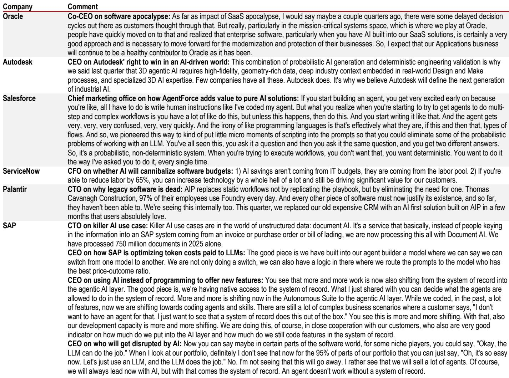
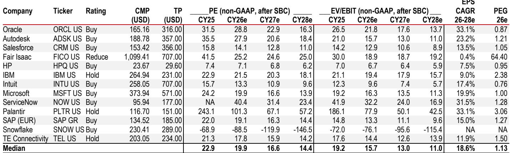
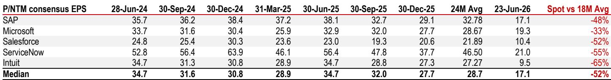

# The Software Apocalypse Is a Market Myth, Not a Business Reality

The market has priced enterprise software as if AI is about to render it obsolete. The data says otherwise. Over the past twelve months, major software stocks have de-rated to roughly 50% of their 24-month average price-to-next-twelve-months non-GAAP earnings multiples. Investors are fleeing a narrative that has almost no grounding in the actual operating performance of the companies involved. A global investment bank report that systematically reviewed the hard evidence of AI disruption in the software sector found no signs of material disruption whatsoever. Revenue growth remains strong, guidance remains confident, pricing power remains intact, and the companies themselves are buying back stock at levels not seen in years.

This gap between market fear and business reality is not a minor mispricing. It is a structural opportunity for investors who can separate technological hype from enterprise economics. The thesis that AI will replace software is intellectually seductive but empirically unsupported. The tools that have captured the public imagination -- vibe coding, AI-generated applications, autonomous agents -- are real, but their impact on the installed base of enterprise software is negligible. The productivity gains they deliver are modest, measured in basis points, not multiples. And the complexity of mission-critical enterprise systems is not something that a large language model can simply replicate with a prompt.

The market is making a category error. It is confusing the impressive capabilities of AI in narrow, well-defined tasks with the ability to displace decades of engineered systems that manage payroll, supply chains, customer relationships, and regulatory compliance. The two are not the same. And the companies that build and maintain those systems are not sitting still. They are embedding AI into their products, extending their moats, and telling the market directly that the apocalypse is not coming. The market is not listening. That is the opportunity.

## Enterprise Software Revenue Growth Has Accelerated, Not Collapsed, in 1Q26

The most direct way to test the AI disruption thesis is to look at what software companies actually earned in the most recent quarter. The data is unambiguous. Median constant-currency revenue growth for the sector was 12.7% year-over-year in 1Q26. That is not a sector in decline. It is not even a sector that is decelerating. It is a sector that is growing at double-digit rates, consistent with its performance over the previous several years.

The forward indicators are even more telling. Current remaining performance obligations, which represent contracted revenue that has not yet been recognized, grew at strong double-digit rates across the major platforms. Adobe reported 13.1% growth in cRPO. Salesforce reported 13.5%. ServiceNow reported 22.7%. SAP's current cloud backlog rose 25% year-over-year in constant currency. These are not the numbers of an industry about to be disrupted. They are the numbers of an industry whose customers are signing multi-year commitments at accelerating pace.

What makes this particularly significant is that several of these companies have issued multi-year guidance that extends through 2030. ServiceNow has guided to an 18.4% revenue compound annual growth rate through fiscal 2030. Salesforce has guided to roughly 11% CAGR through fiscal 2030. SAP has guided to revenue acceleration through 2027. These are public commitments made by management teams that have access to the same AI tools that the market is worried about. If they believed their own businesses were at risk, they would not be making these forecasts. They are making them because they see AI as an opportunity, not a threat.

## Pricing Power Remains Intact, and Margins Are Expanding, Not Compressing

A second key test of disruption is pricing. If AI were commoditizing software, we would expect to see pricing pressure, margin compression, and a race to the bottom. The data shows the opposite. Non-GAAP operating margins are expanding across the board. SAP's non-GAAP operating margin rose 276 basis points year-over-year in 1Q26. ServiceNow's expanded 94 basis points to 31.8%, despite a 75-basis-point headwind from an acquisition. Salesforce's rose 253 basis points to 34.8%. Even Microsoft and Oracle, which face mix pressure from the rapid growth of their lower-margin cloud infrastructure businesses, saw operating margin expansion.

This margin expansion is not accidental. It is the result of software companies using AI to improve their own cost structures while simultaneously raising the value of their products. The report estimates that AI-driven cost savings identified by software companies are in the range of 5% to 7.5% of their existing cost base. Those savings are flowing directly to the bottom line, not being competed away. The idea that AI is enabling cheap, vibe-coded alternatives to enterprise applications that will force incumbents to cut prices is simply not supported by the evidence.

The strategic implication is clear. Software companies are not being disrupted by AI. They are using AI to become more profitable. The margin expansion we are seeing today is likely the beginning of a multi-year trend, not a one-time event. As these companies continue to embed AI into their own operations and into their products, their competitive position relative to potential disruptors only strengthens.

## The Productivity Gains from AI Coding Tools Are Real but Modest, and They Favor Incumbents

The market's fear of AI disruption rests heavily on the idea that AI coding tools will enable startups to build enterprise-grade applications cheaply and quickly, bypassing the need for traditional software. This is the "vibe coding" thesis. It is compelling in theory but weak in practice.

The report estimates that AI coding tools have boosted productivity at IT services and software companies by 100 to 500 basis points at best. That is a meaningful improvement, but it is not transformative. It does not change the economics of building enterprise software. The reason is that enterprise software is not just code. It is data models, business logic, compliance frameworks, integration layers, security protocols, and decades of accumulated domain knowledge. A large language model can generate a simple application from a prompt, but it cannot replicate the depth and reliability of a system that has been refined over years of customer feedback and regulatory scrutiny.

The report's analysis of revenue per employee at major IT services companies is instructive. Over the 2023-2024 period, before AI coding tools became widespread, revenue per employee at major IT services firms rose by approximately 2% per year. In 1Q26 and 2Q26, it rose by approximately 5% year-over-year. That is an acceleration, but it is barely above inflation. The number of employees is not declining. Utilization rates are not spiking. The data does not show a dramatic productivity revolution. It shows a modest improvement that is consistent with AI being a useful tool, not a replacement for human expertise.

This has a crucial second-order implication. If AI coding tools are only modestly improving productivity, then the threat they pose to incumbents is also modest. The barrier to entry in enterprise software is not the cost of writing code. It is the cost of building trust, reliability, and integration. Those barriers are not being lowered by AI. They may, in fact, be rising, as incumbents use AI to deepen their moats.

## Software Companies Are Voting with Their Balance Sheets, and the Signal Is Clear

Actions speak louder than words, and software companies are putting their money where their mouths are. Share buybacks by major software companies are up more than threefold since the 2023-2024 period, excluding outliers. Salesforce alone bought back $27 billion worth of its own shares in the most recent quarter. This is not the behavior of management teams that believe their businesses are about to be disrupted. It is the behavior of management teams that believe their shares are undervalued.

The buyback data is particularly powerful because it is a revealed preference. Management teams have access to far more information than outside investors. They see their own customer conversations, their own pipeline data, their own competitive dynamics. When they choose to allocate billions of dollars to buying back their own stock, they are signaling that they believe the market's fears are overblown. The fact that buybacks have accelerated precisely as the market has become more fearful is a powerful contrarian indicator.

It is worth noting that the companies that have increased buybacks the most are the ones that are most exposed to the AI disruption narrative. Salesforce, ServiceNow, Adobe, Intuit, and SAP are all buying back stock aggressively. The companies that have not increased buybacks -- Oracle and Microsoft -- are the ones that are spending heavily on cloud infrastructure capex. That is a capital allocation choice, not a signal of concern. The capital that would have gone to buybacks is going to build the infrastructure that AI depends on.

## What the Report Does Not Fully Answer: The Timing and Magnitude of Second-Order Effects

The report makes a strong case that AI is not currently disrupting enterprise software. But it leaves several important questions unanswered. The first is about timing. The report's evidence is based on 1Q26 data and current guidance. It does not fully address the possibility that disruption could accelerate in the next two to three years as AI capabilities continue to improve. The productivity gains from AI coding tools are modest today, but they could become more significant as models improve and as developers learn to use them more effectively.

The second open question is about the distribution of disruption. The report focuses on the largest enterprise software companies, which have the strongest moats. It does not fully explore the possibility that AI could disrupt smaller, less entrenched software vendors. If AI makes it easier to build simple applications, the companies that sell simple applications may be at risk. The incumbents with complex, mission-critical systems may be safe, but the long tail of the software industry could face real pressure.

The third question is about the nature of competition. The report argues that AI is unlikely to replace software, but it does not fully address the possibility that AI could change the competitive dynamics within the software industry. If AI makes it easier to build applications, the number of competitors could increase, even if no single competitor becomes dominant. That could compress margins over time, even if it does not lead to outright disruption. The margin expansion we are seeing today could be a temporary phenomenon that reverses as the competitive landscape shifts.

These are not weaknesses in the report. They are the natural boundaries of any analysis that is based on current data. The report's contribution is to show that the market's current fears are not supported by the evidence. The next step is to monitor the trajectory of AI capabilities and the competitive response of software companies. That is where the real analytical work begins.

## A Decision Framework for Investors: How to Evaluate AI Risk in Software

For investors trying to navigate this environment, the report provides a useful framework. The key is to stop asking whether AI will disrupt software in the abstract and start asking which software companies are most and least vulnerable.

The first filter is complexity. The more complex a software product, the harder it is to replicate with AI. Mission-critical systems that manage payroll, supply chains, regulatory compliance, and enterprise resource planning are deeply embedded in their customers' operations. They are not easy to replace. Companies that sell these kinds of systems have the strongest moats.

The second filter is data. Software companies that have proprietary data sets that are used to train and improve their AI models have a structural advantage. Their products get better as they are used, creating a virtuous cycle that is difficult for new entrants to replicate. Companies that sit on large, unique data sets are likely to be the biggest beneficiaries of AI, not its victims.

The third filter is pricing power. Companies that have demonstrated the ability to raise prices and expand margins are signaling that their products are differentiated. If a company's margins are expanding even as AI becomes more capable, that is a strong signal that its customers value its products for reasons that go beyond the cost of writing code.

The fourth filter is management behavior. Companies that are buying back stock, issuing multi-year guidance, and investing in AI capabilities are signaling confidence. Companies that are cutting costs, reducing guidance, and selling assets are signaling the opposite. The report's data suggests that the largest software companies are in the first category.

The final filter is valuation. Even if the AI disruption thesis is wrong, software stocks may still be unattractive if they are priced for perfection. The good news is that they are not. The report shows that major software stocks are trading at roughly 50% of their 24-month average multiples. That is a significant discount, and it creates a margin of safety for investors who are willing to bet against the consensus.

## Join the Community to Read the Full Report and Review the Original Charts

The data and analysis presented here are drawn from a detailed research report that includes original charts, company-by-company commentary, and a rigorous discussion of the assumptions underlying the AI disruption thesis. The full report provides a deeper dive into the productivity estimates, the buyback analysis, and the specific comments from software company management teams that are too detailed to include in a summary. For investors who want to make their own assessment of the evidence, the original charts are essential. They show the revenue growth trends, the margin expansion trajectories, and the buyback patterns in a way that text alone cannot capture. Join the community to read the full report and review the original charts.

*This article is for learning and discussion only and does not constitute investment advice.*

Personal reading notes and learning share only. Not investment advice.

