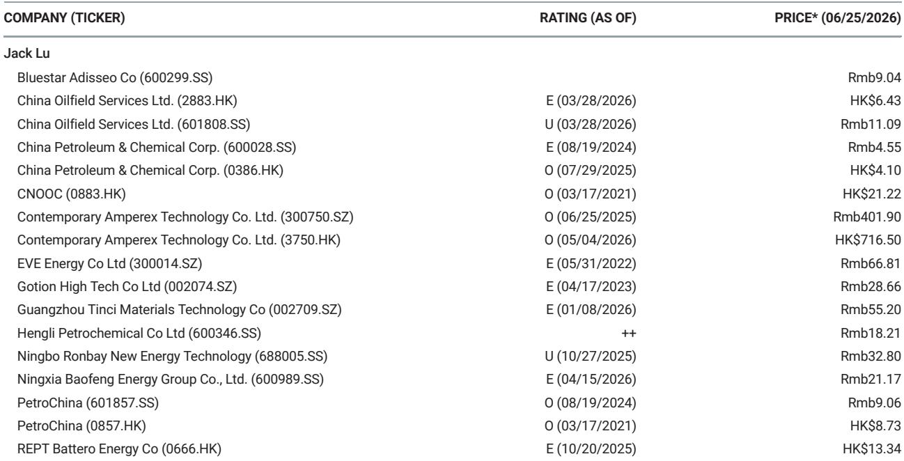
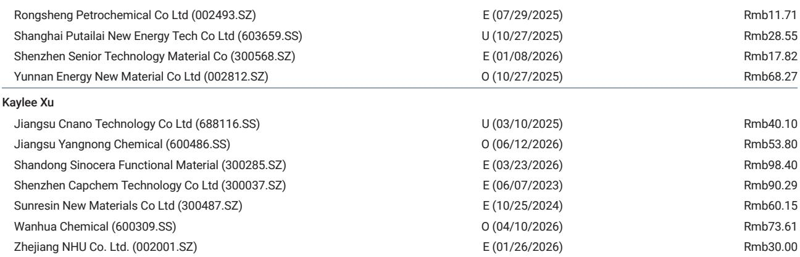
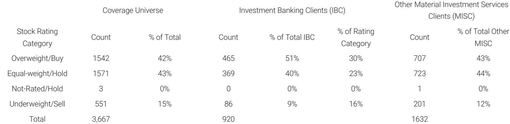

# Sodium-Ion Batteries Are Not Just a Cheaper Alternative—They Are a Higher-Barrier Technology That Will Reshape the Energy Storage Competitive Landscape

The battery industry is approaching a structural inflection point, and most investors are looking at it through the wrong lens. For years, the narrative around sodium-ion technology has been framed as a cost-down story: abundant raw materials, no lithium or cobalt dependence, and a natural hedge against supply chain volatility. That framing is not wrong, but it is dangerously incomplete. The real strategic significance of sodium-ion lies elsewhere—in its fundamentally different technical profile, which creates higher barriers to entry, opens new application domains that lithium iron phosphate (LFP) cannot serve optimally, and concentrates competitive advantage among a small group of incumbents.

The recent launch of the TENER Sodium ESS by CATL, the world's first field-validated sodium-ion energy storage system, provides the evidence needed to shift the debate. This is not a laboratory prototype or a pilot project. It is a commercial product with a committed shipment target of 1 GWh by end-2026 and global deliveries beginning in June 2027. More than 10 GWh of material supply has already been secured. The technology, manufacturing capability, and supply chain have reached commercial readiness. Investors who continue to treat sodium-ion as a speculative, long-dated option risk underestimating how quickly the competitive dynamics of energy storage are about to change.

The implications extend far beyond the battery sector itself. If sodium-ion becomes the preferred chemistry for key high-growth applications such as AI data center (AIDC) storage—where its superior rate capability and low-temperature performance create a genuine competitive advantage over LFP—then the addressable market for sodium-ion is larger and more valuable than most models currently assume. And if the technology carries higher technical barriers to entry than LFP, as the evidence increasingly suggests, then the market structure will be more concentrated, pricing power will be stronger for incumbents, and the window for new entrants will be narrow. This is a thesis that demands careful examination, not casual dismissal.

## CATL's TENER Sodium Launch Marks the Transition from Technology Demonstration to Commercial Scalability, and the Supply Chain Validation Is Already Underway

The most important signal from the TENER Sodium launch is not the product itself, but what it reveals about CATL's confidence in its supply chain. Management disclosed that the company has already secured tens of thousands of tonnes of sodium-ion cathode and anode material supply, sufficient to support more than 10 GWh of production. This is not a speculative forward commitment. It is a concrete, de-risked procurement position that allows CATL to begin manufacturing at scale immediately.

The significance of this cannot be overstated. One of the primary investor concerns about sodium-ion has been the lack of supply chain maturity. Unlike LFP, which benefits from a decade of scaling and commoditization, sodium-ion requires entirely new material ecosystems: layered oxides, Prussian blue analogs, or polyanion cathodes; hard carbon anodes with specific pore structures and surface chemistry; and customized electrolyte formulations. Each of these components has its own manufacturing challenges, yield management issues, and quality control requirements. The fact that CATL has already secured material supply for 10 GWh suggests that these challenges are being solved at an industrial scale, not just in the lab.

Furthermore, CATL has stated a target to build 40 GWh of sodium-ion manufacturing capacity by the end of this year. If achieved, this would represent a dramatic scaling of production capacity in a very short time frame. The ability to secure upstream materials at scale will become a key competitive differentiator. Early movers with integrated R&D, supplier relationships, and manufacturing scale will enjoy significant advantages over latecomers who must build supply chains from scratch. This is not a commodity market. It is a technology platform where proprietary know-how and supply chain control matter enormously.

The investor takeaway is clear: the supply chain risk for sodium-ion is rapidly diminishing. The question is no longer whether the technology can be produced at scale, but how quickly the cost curve will decline and which players will capture the value.

## Sodium-Ion Chemistry Creates Higher Technical Barriers to Entry Than LFP, Leading to a More Concentrated Market Structure with Stronger Pricing Power for Incumbents

This is perhaps the most underappreciated aspect of the sodium-ion thesis. Conventional wisdom holds that sodium-ion is easier to manufacture than lithium-ion because it uses more abundant materials and can leverage existing lithium-ion production lines. That is true at the high level of process equipment, but it obscures the critical point: the materials science challenges of sodium-ion are substantially more demanding than those of LFP.

Consider the cathode. Sodium-ion cathodes suffer from greater structural instability than LFP, requiring sophisticated materials engineering, surface coating, and elemental doping to simultaneously improve energy density, cycle life, and safety. There are multiple competing cathode pathways—layered oxides, Prussian blue, polyanion systems—each with unique trade-offs. Choosing the right pathway, optimizing the composition, and achieving consistent manufacturing quality requires deep expertise that is not widely distributed.

Now consider the anode. Unlike lithium batteries, which use mature graphite anodes, sodium-ion batteries rely predominantly on hard carbon. Achieving high initial Coulombic efficiency, low irreversible capacity loss, and consistent pore structure is a major technical hurdle. CATL has also developed an anode-free sodium-ion battery architecture for EV applications, which significantly improves energy density and narrows the gap versus LFP. This is technologically significant because anode-free designs require sophisticated control of sodium plating/stripping behavior, electrolyte stability, interface engineering, and cycle-life management. These are not capabilities that can be quickly replicated.

The electrolyte and solid-electrolyte interphase (SEI) engineering further compounds the difficulty. Sodium-ion batteries require highly customized electrolyte formulations to stabilize the SEI, improve cycle life, and support wide-temperature operation. This remains a key area of proprietary differentiation among leading players.

The result of these technical challenges is a market structure that is fundamentally different from LFP. The LFP supply chain has become largely mature and commoditized after a decade of industry scaling. Any well-capitalized manufacturer can produce LFP cells with reasonable quality. Sodium-ion, by contrast, remains in an earlier stage where performance differentiation depends heavily on proprietary materials and manufacturing know-how. This has resulted in a more concentrated industry structure, with CATL and a small number of leading players holding meaningful technology, capacity, and supply-chain advantages. As commercialization accelerates, the sodium-ion market is likely to remain more consolidated than the LFP market, supporting stronger pricing power for incumbents and higher barriers to entry for newcomers.

## Sodium-Ion Batteries Are Better Positioned Than LFP for AI Data Center Storage, Creating a Natural Early-Adoption Segment That Accelerates Commercialization

The conventional framing of sodium-ion as a lower-cost, lower-energy-density alternative to LFP misses a critical point: for certain high-value applications, sodium-ion's technical characteristics are actually superior. This is particularly true for AIDC storage.

AIDCs require rapid response, high peak power output, and repeated cycling. The power demands of AI training and inference workloads are highly variable, with frequent acceleration, braking, and power-demand fluctuations. Sodium-ion chemistry exhibits faster ion transport kinetics, lower polarization under high-current operation, and better power retention at low temperatures compared to conventional LFP. These characteristics enable stronger charge/discharge performance during the kinds of rapid load changes that are common in AIDC environments.

Energy density, while somewhat lower than LFP, is less critical in stationary storage applications where footprint is not the primary constraint. What matters more is rate capability, cycle life, and total cost of ownership. Sodium-ion appears to offer a more compelling balance of these factors for AIDC use cases.

The strategic implication is significant. AIDC storage is one of the fastest-growing segments of the energy storage market, driven by the exponential growth in AI compute demand. If sodium-ion becomes the preferred chemistry for this segment, it will create a large, high-value early-adoption market that accelerates the technology's cost curve and validates its reliability at scale. This is not a niche application. It is a growth engine that could pull the entire sodium-ion ecosystem forward.

The question for investors is whether the market has fully priced in this demand driver. Most energy storage models treat sodium-ion as a generic alternative to LFP, with a cost advantage that narrows over time. If sodium-ion actually commands a performance premium in AIDC applications, the revenue potential and margin structure could be substantially better than current estimates suggest.

## The Report Raises Important Open Questions About Cost Trajectory, Second-Mover Viability, and the Pace of EV Adoption That Require Further Analysis

No single report can answer every question, and this one leaves several critical issues unresolved. First, the cost trajectory of sodium-ion relative to LFP remains uncertain. While sodium-ion benefits from cheaper raw materials, the manufacturing complexity and lower energy density may offset some of the cost advantage. The report provides useful data points on supply chain validation but does not offer a detailed cost model that projects when sodium-ion will reach parity with LFP on a levelized cost of storage basis. This is essential for assessing the size of the addressable market.

Second, the report identifies high barriers to entry but does not fully analyze the second-mover dynamics. If CATL and a few other incumbents consolidate their positions, what happens to the many startups and regional players that are also developing sodium-ion technology? Will they be forced into niche applications, acquired by larger players, or able to compete through specialization? The answer has major implications for the investment landscape.

Third, the report focuses on stationary storage and AIDC applications but provides limited analysis of the EV adoption timeline. CATL's anode-free architecture suggests that sodium-ion could eventually compete with LFP in passenger vehicles, but the timeline remains unclear. When will energy density reach high-end LFP levels? How quickly can manufacturing scale to meet automotive demand? These questions are critical for assessing the total addressable market over the next five to ten years.

Investors who want to build a robust investment thesis around sodium-ion will need to develop their own views on these questions. The report provides an excellent foundation, but the most important insights are likely to come from deeper analysis of cost curves, competitive dynamics, and application-specific demand drivers.

## A Decision Framework for Investors: Assess Sodium-Ion Exposure Across Three Dimensions—Technology Capability, Supply Chain Position, and Application Focus

For investors looking to position for the sodium-ion opportunity, a structured framework can help identify the most attractive exposures. The framework should evaluate companies and technologies across three dimensions:

**Technology capability**: Does the company have proprietary materials science expertise in cathode chemistry, hard carbon anodes, electrolyte formulation, or cell architecture? Can it demonstrate consistent manufacturing quality at scale? Companies with deep R&D capabilities and a track record of innovation are likely to maintain their competitive advantage as the market grows.

**Supply chain position**: Has the company secured upstream material supply at scale? Does it have supplier relationships that provide cost advantages or quality control? The ability to control the supply chain is a key differentiator in a market where material availability and consistency are critical.

**Application focus**: Which end markets is the company targeting? AIDC storage, utility-scale ESS, and EV applications each have different performance requirements, competitive dynamics, and growth trajectories. Companies that focus on the highest-value, fastest-growing applications are likely to capture disproportionate value.

Using this framework, investors can identify which companies are best positioned to benefit from the sodium-ion transition and which are likely to face headwinds. The framework also helps identify gaps in the current market understanding, such as the potential for sodium-ion to disrupt LFP in segments beyond AIDC storage.

## The Sodium-Ion Thesis Is Still Forming, and the Most Important Insights Will Come from Detailed Analysis of Cost Curves, Competitive Dynamics, and Application-Specific Demand Drivers

The TENER Sodium launch is a milestone, but it is not the end of the story. The sodium-ion market is still in its early stages, and the most important investment insights will emerge from careful analysis of the factors that will determine which companies succeed and which fall behind.

The full report from which this article is derived contains detailed analysis of the supply chain validation, technical barriers, and competitive landscape that we have discussed here. It also includes original charts and data that provide a more granular view of the market dynamics. For investors who want to build a comprehensive understanding of the sodium-ion opportunity, the full report is an essential resource.

Join the community to read the full report and review the original charts.

*This article is for learning and discussion only and does not constitute investment advice.*

Personal reading notes and learning share only. Not investment advice.

