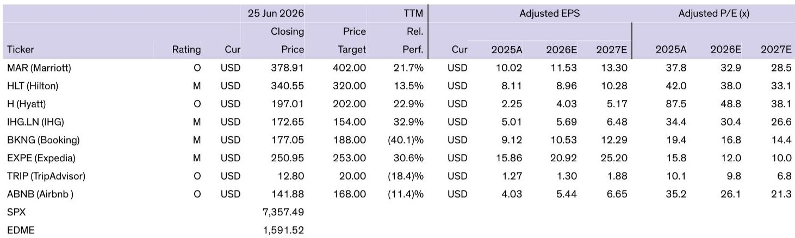
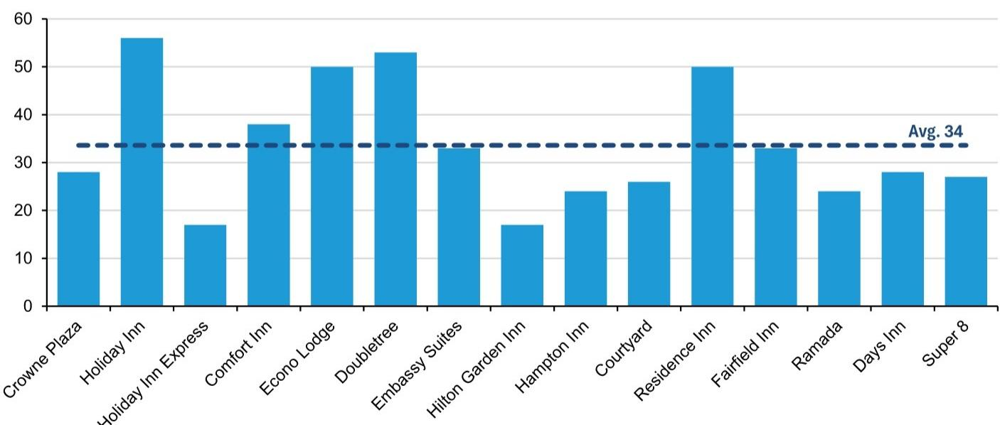
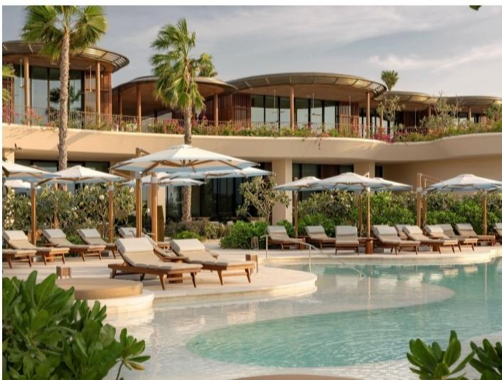

# Bernstein：酒店品牌的生命周期只有30年，豪华是唯一的例外

当你下一次计划出差或家庭旅行，打开预订APP浏览酒店品牌时，或许从未想过一个问题：那些你信赖的连锁品牌，正在不可逆转地老去。

Bernstein一份名为《Whatever happened to Howard Johnson? The lifecycle of a hotel brand》的研报，给出了一个令人意外的判断：绝大多数主流酒店品牌，从诞生到巅峰的生命周期只有大约30年。Howard Johnson从1950年代超过1500家门店的辉煌，萎缩到今天仅有约120家，不是偶然，而是行业规律。

这个判断之所以重要，不仅因为它解释了为什么万豪、希尔顿、洲际这些酒店集团旗下品牌数量越来越多，更因为它直接指向一个投资逻辑：那些拥有最年轻品牌组合的酒店集团，比如希尔顿和凯悦，在未来的增长竞赛中可能天然占据优势。而那些品牌组合老化、未能及时补充新鲜血液的公司，将面临系统性增长减速。

这份研报没有停留在简单的历史回顾，而是系统性地拆解了品牌为什么在30年左右触顶、哪些因素可以打破这一规律、以及这对酒店股意味着什么。以下是核心洞察。

## 1. 品牌老化不是管理问题，是结构性宿命

Bernstein的分析覆盖了美国主流酒店品牌的历史数据，结论非常清晰：无论是Holiday Inn、Crowne Plaza还是Comfort Inn，其客房数量和管道项目数量，都在品牌创立后的25至35年间达到峰值，随后进入不可逆的萎缩阶段。

以Crowne Plaza为例。该品牌1983年作为Holiday Inn Crowne Plaza推出，1994年独立更名。其美国管道项目在2008年达到43家酒店的峰值，总酒店数在2010年左右达到210家的顶点。即便考虑金融危机前后的周期性因素，这种“管道峰值在25-30年，客房峰值在30-35年”的模式，在美国主流品牌中几乎一致。

为什么会出现这种规律？研报给出了四个结构性原因。

第一，客人偏爱新酒店。在主流和中端市场，酒店年龄与客人评分呈显著负相关。随着品牌变老，旗下酒店不可避免出现设施老化，如果业主不持续投入翻新，老酒店就会拖累整个品牌的评分和RevPAR，让新开发商转向其他品牌。

第二，消费者偏好会变，品牌标准却相对固化。例如，消费者已经从“全服务”酒店（配备餐厅、会议室、前台）转向“有限服务”模式。Holiday Inn这类全服务品牌，因为提供客人不再愿意付费的设施，运营成本更高，反而成了竞争劣势。

第三，品牌会“跑完空白市场”。在需求集中的区域，品牌所有者不会允许同一品牌过度聚集，以保护现有业主利益。结果就是，品牌最终会耗尽可以新增酒店的地理空间。

第四，加盟合同期限天然形成保护期。多数加盟合同长达10至20年，这意味着品牌在前20年几乎不可能出现大规模流失。但20年后，合同到期叠加以上三个因素，下滑就变得难以避免。

> **KC评论：** 这个发现其实挑战了一个常见的投资叙事——很多人认为酒店集团只要做好品牌管理和加盟商关系，就能持续增长。Bernstein的数据表明，品牌老化更像一种“生物钟”，管理层的努力只能延缓，很难逆转。这意味着，评估一家酒店集团时，不能只看它现在的品牌阵容有多强，更要看这些品牌分别处于生命周期的哪个阶段。完整报告中有非常详细的图表，展示了每个主要品牌从创立至今的客房数量曲线，值得仔细对比。

## 2. 三个例外：国际扩张、自持物业与豪华

既然30年触顶是普遍规律，自然会有投资者追问：有没有品牌成功打破了这一规律？Bernstein识别出三种例外，但每一种都有明显的边界条件。

第一种是国际扩张。当一个品牌在本土市场面临老酒店拖累、消费者偏好变化和空白市场枯竭时，进入新的国际市场相当于获得一块“空白画布”。品牌可以在新市场调整定位和格式，避开本土老酒店的负面影响。从全球范围看，Bernstein发现，酒店品牌并没有呈现美国市场那种30年峰值模式。

第二种是业主自营模式。当品牌所有者同时拥有酒店物业时（而不是轻资产加盟模式），它可以更严格地维护品牌标准，防止老酒店拉低品牌感知。英国Whitbread旗下的Premier Inn品牌接近40年仍在增长，虽然增速已放缓，但确实突破了30年大关。不过，这种模式的问题是，业主难以像轻资产公司那样快速切换品牌格式来适应消费者变化。

第三种是豪华品牌。豪华酒店与主流酒店的逻辑完全不同。在豪华领域，品牌年龄与客人评分之间没有负相关性，甚至略有正相关——老牌豪华酒店往往更受追捧。洲际酒店集团的InterContinental品牌今年将迎来80岁生日，但在2010至2025年间依然实现了客房增长。丽思卡尔顿、瑞吉、四季等经典豪华品牌同样如此。

> **KC评论：** 这三个例外中，对投资者最有意义的可能是豪华品牌。因为它意味着，酒店集团如果希望拥有“永续增长”的品牌资产，最可靠的路径是向上走——打造或收购豪华品牌。但问题在于，豪华品牌的市场容量远小于中端和高端，且新建周期更长、投资门槛更高。完整报告中有几张关键图表，展示了不同档次品牌的ROI与管道规模的关系，可以帮助理解为什么豪华品牌很难成为集团增长的主引擎。

## 3. 希尔顿与凯悦的“年龄优势”意味着什么

将上述生命周期框架应用到主要酒店集团的品牌组合上，Bernstein得出了一个清晰的排名：希尔顿和凯悦拥有最年轻的品牌组合，这意味着它们在未来一段时间内，天然享有更长的“增长窗口”。

具体来看，希尔顿旗下品牌中，仅有约30%的美国酒店位于创立超过30年的品牌中；凯悦这一比例更低，约64%的品牌尚未达到30年峰值。作为对比，万豪和洲际的比例更高，它们旗下有更多成熟甚至老化的品牌需要管理。

这个“年龄优势”直接体现在净单位增长（NUG）上。Bernstein指出，希尔顿和凯悦在行业内的NUG表现领先，而品牌年龄结构正是支撑这一优势的重要基础。在轻资产加盟模式下，品牌年龄越年轻，意味着管道项目中的新酒店越少受到老酒店拖累，开发商也更愿意为这些品牌投资。

但这里有一个需要谨慎对待的细节。品牌组合的年轻化并不完全等同于管理能力更强。希尔顿近年来成功推出了Tru、Spark等新品牌，凯悦通过收购和自创品牌也在不断丰富组合。然而，新品牌本身的成功概率并不一致。Bernstein对比了希尔顿的Tru和洲际的Avid，这两个定位相似的品牌，在创立后前3年的增长路径就出现了明显分化——Tru的增速远超Avid。这说明，品牌年轻只是必要条件，能否把新品牌做成“爆款”，才是真正的管理能力考验。

> **KC评论：** 对于投资者来说，品牌年龄结构是一个值得跟踪的前瞻指标，但它不是唯一指标。更关键的问题是：那些已经超过30年峰值的品牌，集团打算怎么处理？是放任自流、慢慢萎缩，还是主动进行品牌翻新、重新定位，甚至果断淘汰？完整报告中有关于Comfort Inn和Holiday Inn在峰值后稳定规模的对比，以及不同集团品牌组合的详细年龄分布图，这些信息对于判断具体公司的长期增长潜力至关重要。

## 4. 报告尚未完全回答的关键问题：品牌组合的“新陈代谢”速度

Bernstein的框架逻辑清晰，但它也承认，这份研报更像是一个“消费者洞察”而非严谨的学术研究。有几个关键问题，报告没有完全展开，但恰恰是投资者最关心的。

第一，品牌组合的“新陈代谢”速度如何量化？一个集团每年需要推出多少新品牌，才能抵消老品牌的自然萎缩？报告提到了“那些在正确时间重塑品牌组合的集团，长期表现会更优”，但没有给出具体的量化模型。如果希尔顿每年推出一个新品牌，而万豪每三年推出一个，这个差距在10年后会如何体现在增长曲线上？

第二，品牌翻新和重新定位能否重置生命周期？报告提到Quality Inn在1990年代通过品牌分拆和重新焕发活力，实现了超越30年的增长，但明确表示这是“少数成功案例”。那么，对于Crowne Plaza这类正在被洲际重点改造的品牌，成功的概率有多大？报告没有给出明确的判断框架。

第三，豪华品牌虽然不受30年规律约束，但它的市场容量天花板在哪里？当越来越多的集团涌入豪华赛道，品牌稀缺性是否会下降？报告提到了“豪华品牌可以依靠品牌价值实现溢价定价”，但没有讨论竞争加剧对ROI的影响。

这些未解问题，恰恰是深入阅读完整报告的价值所在。Bernstein在报告中提供了大量原始图表和细分数据，包括不同品牌在各个年份的管道、客房数量、ROI对比，以及按品牌年龄分组的增长趋势。这些数据本身可以支撑更细致的分析。

每天，我们的社群会由AI agent加人工review，生成国际投行中文摘要与KC评论，日更约10至40页，包含当天最新数据图表合集。这些内容既方便喂给AI做进一步分析，也方便人工快速把握市场动态。如果你对酒店品牌的生命周期、或者对如何用类似框架分析其他消费行业（比如餐饮、零售）感兴趣，欢迎来星球微信群里继续讨论。我们会在群里分享这份Bernstein报告的完整中文摘要和原始图表，也会持续跟踪主要酒店集团的品牌组合变化。

Personal reading notes and learning share only. Not investment advice.

