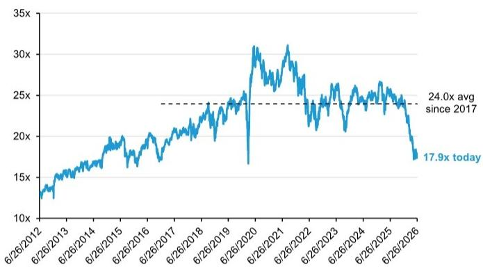
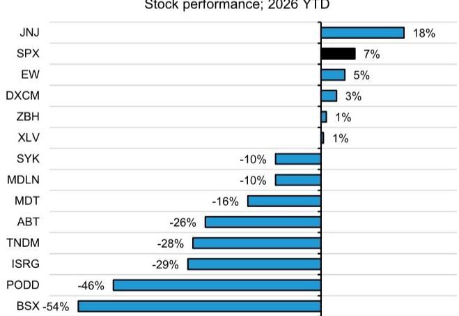

# Weekend Healthcare Pulse: Deadtech forever? Can Medtech recover?

Lee Hambright +1 917 344 8429 lee.hambright@bernsteinsg.com

Courtney Breen +1 917 344 8407 courtney.breen@bernsteinsg.com

Nandan Kulkarni +91 22 6842 1436 nandan.kulkarni@bernsteinsg.com

Delphine Le Louet +33 1 42 13 92 93 delphine.le-louet@bernsteinsg.com

Rebecca Liang, Ph.D. +852 2123 2656 rebecca.liang@bernsteinsg.com

Susannah Ludwig +41 582 723 127 susannah.ludwig@bernsteinsg.com

William Pickering, MD +1 917 344 8340 william.pickering@bernsteinsg.com

Justin Smith +44 20 7762 5899 justin.smith@bernsteinsg.com

Miki Sogi, Ph.D. +81 3 6777 6991 miki.sogi@bernsteinsg.com

Lance Wilkes +1 917 344 8501 lance.wilkes@bernsteinsg.com

Jeffrey Walch, MD, Ph.D. +1 917 344 8613 jeffrey.walch@bernsteinsg.com

## Specialist Sales

Christian Moore +1 917 344 8555 christian.moore@bernsteinsg.com

U.S. Medtech stock performance has been abysmal. Our coverage has underperformed the S&P by 4600bps over the past year (Exhibit 1), and the medtech sector multiple has compressed by $30\%$ since November (Exhibit 2). While investors worry about several macro factors (slowing utilization, margin pressure, GLP-1 impact), we believe medtech weakness is more about single-stock stories that have gotten more complicated. In today's note, we reflect on some of the complications that have crept into medtech stock stories. Medtech fundamentals remain solid, in our view, and per Exhibit 4, valuations have come in dramatically for most of our coverage. For investors who are willing to live with stories that have a bit of hair on them, we see very attractive risk/reward for many quality medtech names across our coverage.

\- By Lee Hambright and Adam Chow

EXHIBIT 1: Over the last 12 months, U.S. Medtech has underperformed the S&P (by 4600bps!) and has lagged all other healthcare subsectors  
US Healthcare Stock Performance  
  
Equal weight based on Bernstein large-cap US coverage by sector; US Medtech includes ABT, BSX, DXCM, EW, ISRG, MDT, PODD, SYK, ZBH Source: Bloomberg; Bernstein analysis (25-Jun-2026 close)

U.S. Medtech stock performance has been horrendous. Over the last year, U.S. Medtech has underperformed the S&P 500 by just under 5000 bps (see Exhibit 1), making it the worst subsector within healthcare by a wide margin. The P/E multiple for the sector has been slashed by 30% over the last \~6 months (see Exhibit 2). Within our coverage, most stocks are down significantly year to date, with BSX and PODD as the most notable underperformers (Exhibit 3).

EXHIBIT 2: U.S. Medtech P/E multiples are down $30\%$ since November 2025. We haven't seen these levels sustainably since before 2017  
U.S. Medtech (S5HCEP\*) Price/Earnings Ratio (1BF)  
  
Source: Bloomberg (S&P 500 Health Care Equipment Index; cap-weighted average of ABT, BAX, BDX, BSX, DXCM, EW, GEHC, IDXX, ISRG, MDT, PODD, RMD, STE, SYK, ZBH)

EXHIBIT 3: Year to date, BSX and PODD have been the worst performers in our coverage  
U.S. Medical Devices Stock performance; 2026 YTD  
  
Source: Bloomberg; Bernstein analysis (25-Jun-2026 close)

## HOW DID WE GET HERE?

What's driving this weakness for medtech stocks? What has changed? As medtech multiples plunge to 10-year lows, investors have been questioning whether something is fundamentally wrong with the sector. Could procedure growth be slowing down? Will inflation (e.g., oil, resins, memory/semiconductors) put pressure on margins? Could GLP-1 growth disrupt medtech markets?

These are all red herrings, in our view. We see nothing wrong with medtech fundamentals. The problem for medtech, in our view, is more about stories. As investors remain captivated by AI-related stories, the stories for historically strong medtech stocks have gotten increasingly complicated. And in a world where a narrow set of AI winners are driving incredibly strong returns, investors have very little patience for complicated medtech stories.

## INCREASINGLY COMPLICATED STORIES

Stories have become increasingly complicated for many medtech stocks. Boston Scientific (BSX) has had a particularly dramatic fall from grace, and we attribute a fair amount of sector weakness to BSX's collapse. But sadly, BSX is not alone. Below, we summarize several medtech stock stories that have grown increasingly complicated over the past year.

Boston Scientific (BSX). BSX's P/E multiple has been slashed from a high of over 36x in early 2025 to 12.5x today. After establishing itself as a reliable high-single-digit grower, BSX's organic growth shot up to 16% (!) in both 2024 and 2025, driven primarily by two key franchises: Farapulse (PFA) and Watchman (LAAC). Watchman revenue doubled from \~\$1bn in 2022 to \~\$2bn in 2025, and Farapulse drove BSX's EP business to quadruple from \$800mn in 2023 to \$3.3bn in 2025. After CMS reimbursement coding for concomitant Farapulse+Watchman procedures went live Oct 2024, concomitant procedures drove Watchman organic growth from 18% in 3Q24 to a peak of 35% in 3Q25. Investor concerns about PFA competition started to percolate during the course of 2025 as BSX EP growth began to decelerate. Then in 4Q25, BSX U.S. EP sales missed consensus by 6%, and Watchman organic growth inflected from its peak of 35% to 29%. Both franchises continued to decelerate in 1Q26 and Urology growth was weak on Axonics integration hiccups, leading to a dramatic guidance cut after Q1, where FY26 organic growth was cut from 10%-11% to 6.5%-8.0% (see our 1Q26 recap). It was a gutsy move for management to cut the FY26 guide after one quarter of a new 12-quarter long-range plan (for 10%+ organic growth) issued in Sep 2025. Just 5 weeks after the 1Q26 call, BSX lowered Watchman expectations again at our Bernstein Strategic Decisions Conference (see our BSX SDC recap). Additional complications to the story include a couple of controversial deals: the \$14.5bn Penumbra acquisition in January (larger than the typical tuck-in deals to which investors have become accustomed) and the \$1.5bn MiRus investment in May (which triggered investor skepticism given BSX's two previous high-profile failures in TAVR).

Abbott (ABT). In 4Q25, sales growth slowed to $3.0\%$ organic (a $3\%$ miss), driven largely by an unexpected $9\%$ decline in ABT's Nutrition business (missed by $12\%$ ) (see our 4Q25 recap). The decline was driven by price cuts (primarily in the Adult segment) and infant formula market share losses stemming from the loss of a large WIC contract in 3Q25. Abbott had been raising Nutrition prices since 2022 in an attempt to offset higher manufacturing costs, but those increases began to weigh on volume. Management took price down in the quarter to address this and guided the Nutrition business to a challenged 1H26 with a return to growth in 2H26. The story did not get any cleaner in 1Q26, as sales ex-Exact acquisition and other adjustments continued growing slowly at \~3.0% organic. ABT's continuous glucose monitor (CGM) sales continued to decelerate (on market weakness + ABT recall in 4Q25) and the company's Structural Heart division lost market share (see our 1Q26 recap). ABT has dropped \~26% YTD.

Stryker (SYK) suffered a cyberattack on March 11 which disrupted global operations. Although the company primed investors for disappointing Q1 results through a series of 8-Ks, the disruption impacted Q1 sales more heavily than expected. Organic growth landed at 2.4% in 1Q26, 5% short of consensus, as the cyberattack delayed revenue recognition and disrupted manufacturing and supply chain operations. Management reiterated FY26 guidance on revenue-recognition tailwinds and backlog recovery on capital equipment. However, some investors remained concerned that the severity of the disruption could make guidance difficult to achieve, particularly now that 2H26 expectations call for 11% organic growth (see our 1Q26 recap). SYK has dropped \~10% YTD.

Insulet (PODD) has been a popular short since the company's November 2025 investor day, as investors worry about competitive patch pumps and potential price pressure in the pharmacy channel. PODD shares came under more pressure when the company announced a voluntary medical device correction on March 12 (see 8-K), identifying a manufacturing issue whereby certain pods from specific lots may have a small tear in the internal tubing that delivers insulin. The issue can lead to insulin leaking inside the pod rather than being fully infused in the body. At the time, Insulet had received 18 reports of serious adverse events associated with high blood glucose levels, including hospitalization and diabetic ketoacidosis (DKA), and no deaths had been reported. The company informed users about affected lots (pods involved amounted to \~1.5% of annual Omnipod 5 production globally) and offered replacement pods at no cost to users. On April 10, PODD confirmed 11 additional adverse events (bringing the total to 29) and no deaths associated with the manufacturing issue. On April 29, the FDA mischaracterized the manufacturing issue as having resulted in "476 serious injuries and no deaths," further hitting the stock by -12.5% on the day (see our thoughts on the March 12 recall and follow-ups). On May 26, the company announced a separate voluntary medical device correction, identifying a manufacturing issue that resulted in 24 reports of serious adverse events (no deaths) and affected \~8.5% of 2025 Omnipod 5 production. PODD has fallen \~46% YTD.

Medline (MDLN) reported strong revenue growth results in their first full quarter after their IPO, but adj EBITDA of \$776mn missed consensus (\$784mn) by 1% (see our 1Q26 recap). Management explained that the team had decided to accelerate investments in the business given strong revenue performance, but the small

EBITDA miss carried outsize weight given market expectations that companies should execute cleanly in their first full quarter as a public company, and MDLN shares plunged by 12% before settling at -7.3% on the day. An FDA recall on April 17, FDA warning letter on May 28, news of a fire destroying a California distribution center on June 12, and general concerns about oil prices and sponsors selling down their positions have also put pressure on the name. MDLN has dropped \~10% YTD.

Medtronic (MDT) was the top-performer in medtech in 2025, but the story has become a bit more complicated this year. Disappointing long-term data released in February was a setback for MDT's TAVR business, and the March IPO of MiniMed (MMED, not covered) fell short of the company's expectations. FY27 is a high-stakes year for MDT, as the company needs to capitalize on several high-profile launches including Affera, RDN, Altaviva, and Hugo. After weaker EPS growth over the past 4 years (-5%, -2%, +6%, +1%), MDT needs to pull it all together in FY27 and deliver real EPS growth. MDT has fallen \~16% YTD.

Intuitive Surgical (ISRG) continues to deliver strong financial performance, with 1Q26 sales growth of 23% and EPS growth of 38%, both strong beats vs. consensus (see our 1Q26 recap). Forward estimates continue to move up, but the multiple has been dragged down by weakness across the medtech sector. When BSX was trading at a 35x P/E multiple, investors didn't mind paying 70x or more for ISRG. But with BSX at 12.5x, some investors worry that ISRG looks expensive at 36x. Fundamentals have been strong, but as the share price has struggled, investors ponder questions about the durability of procedure growth, remanufactured instruments, Chinese competitors, and new systems from MDT and JNJ. ISRG is down \~29% YTD.

## IS THERE SOMETHING WRONG WITH MEDTECH FUNDAMENTALS?

With such notable, sustained weakness across the majority of stocks in the medtech sector, investors have understandably wondered whether there's something fundamentally wrong with the space. Several thematic factors have been teed up as possible explanations for sector weakness. As we noted above, we believe these are all red herrings. We believe the problem is more about single stock stories getting more complicated across the group. We discuss a few of these thematic factors below.

Slowing utilization growth. Hospital utilization has been strong for some time, and investors worry utilization growth could slow at some point, perhaps driven in part by some people getting kicked off insurance (ACA exchanges and Medicaid) and losing access to certain procedures. Some large hospital systems have speculated that utilization growth may begin to decelerate in 2H26. Medtech companies have told a different story, with teams fairly unanimously reporting continued strength in underlying procedure growth despite some mostly immaterial weather-related impact in 1Q26:

"What I will say in terms of the underlying market is that it's solid and underlying demand is what we expected. Now we did see some procedural softness early in the quarter, but nothing that we would define really as material. While certain regions, particularly here in the U.S., you will recall we experienced some periods of severe weather in late January and early February, that was largely consistent with normal seasonal patterns" - JNJ 1Q26 call

"Turning to the environment, underlying demand across our businesses remained healthy in Q1, even as the cyber incident created operational disruption. Procedural volumes were solid, supported by favorable demographics and the continued adoption of robotic assisted surgery. The hospital CapEx environment also remains steady, and our capital order book remains elevated as we enter the remainder of the year." - SYK 1Q26 call

Hospitals and MCOs saw a bit of softness in 1Q26 due to a mild flu season and weather-related disruptions, but most are calling for stable growth in utilization overall:

"As we monitor underlying utilization trends, they remain consistent with the high levels we saw in the prior year. At this distance, we anticipate trend to remain at the anticipated levels for 2026." - UNH 1Q26 call

Margin pressures. The Iran conflict led to a period of higher freight costs and created supply chain issues and gross margin concerns (e.g., higher resin prices). Higher input costs for semiconductors and memory has raised concerns as well. Investors remember that medtech stocks did not fare well during inflation concerns in 2022, and they worry inflation could continue to cause problems for the group. So far, medtech companies appear unfazed by these margin pressures:

"As it relates to oil costs, I mean I think that's an impact that it's too early to tell. We're not seeing any of that in our cost right now. We're not seeing freight rates increase from our suppliers right now." - ABT 1Q26 call

"Today, we have seen no material supply disruptions, a minor freight cost increase in the quarter that we're able to absorb. From a supply standpoint, most of our key products are dual-source, if not three sources. We got at least one year of pulling, so this is not something that we're concerned about. So, we're not seeing any distribution challenges there. So, again, so far, life is good." -ZBH 1Q26 call

GLP-1 impact. Growing access to weight loss medications has raised questions about impact on medical device businesses, particularly in certain end markets (e.g., bariatric surgery, diabetes, OSA). We all remember the impact on medtech stocks in 2H23, and though most medtech stocks recovered and have appeared to shrug off GLP-1-related fears, growing access to oral weight loss

drugs could revive concerns.

## WHAT CAN GET MEDTECH GOING AGAIN?

As we explain above, we see nothing wrong with medtech fundamentals. These are quality companies operating in attractive oligopoly markets, medtech innovation continues at a rapid pace, and there are plenty of secular tailwinds that will continue to drive growth. The problem for medtech, in our view, is more about single stock stories that have gotten a bit more complicated over the past year. As long as captivating AI-related stories continue to drive outperformance for a narrow basket of names, it's difficult to get investors interested in medtech stories that have some hair on them. So, where do we go from here? What can get medtech going again?

First off, it certainly wouldn't hurt if a bit of air came out of the AI balloon. Our macro team believes breadth is the story and forecasts a period of rotation/dispersion. We're seeing a bit of that today, and we'd certainly welcome a bit more.

More broadly, we forecast progressive recovery for idiosyncratic risks are retired one by one. Perhaps Stryker can deliver a big Q2 beat and restore confidence that the business will continue strong execution despite the cyberattack-related hiccup. If Abbott can show recovery in Nutrition and stabilization in Structural Heart, investors might start to get excited about broadening access for CGM and the growth opportunity in EP. Perhaps Intuitive Surgical's portfolio of launches (dV5, Ion, SP, XiR, AI) can continue to drive strong quarterly financial performance, and maybe investors will find it harder to ignore ISRG as estimates continue to march higher.

Recovery for Boston Scientific would go a long way to restoring confidence in the group. Questions continue to swirl about decelerating growth for Watchman and EP. As we get clarity on when and where growth rates will bottom out for these key franchises, and as reset LRP expectations begin to come into focus, we see the potential for dramatic recovery over the next 12-24 months.

Per Exhibit 4, valuations have come in dramatically for most of our coverage. For investors who are willing to live with stories that have a bit of hair on them, we see very attractive risk/reward for many quality medtech names across our coverage.

EXHIBIT 4: For most of our coverage, multiples have been slashed by $25\% -60\%$ over the last 18 months U.S. Medtech Valuation History - Absolute P/E and P/S Multiples

<table><tr><td>Ticker:</td><td>SPX</td><td>JNJ</td><td>EW</td><td>ZBH</td><td>MDT</td><td>SYK</td><td>DXCM</td><td>TNDM</td><td>ABT</td><td>ISRG</td><td>BSX</td><td>PODD</td></tr><tr><td>Metric:</td><td>P/E</td><td>P/E</td><td>P/E</td><td>P/E</td><td>P/E</td><td>P/E</td><td>P/S</td><td>P/S</td><td>P/E</td><td>P/E</td><td>P/E</td><td>P/S</td></tr><tr><td>Avg last 10yrs</td><td>19.1x</td><td>16.2x</td><td>32.7x</td><td>15.1x</td><td>17.2x</td><td>24.0x</td><td>10.3x</td><td>5.0x</td><td>22.5x</td><td>48.9x</td><td>24.3x</td><td>9.6x</td></tr><tr><td>Avg last 5yrs</td><td>20.0x</td><td>15.9x</td><td>32.2x</td><td>14.5x</td><td>16.2x</td><td>25.5x</td><td>10.0x</td><td>3.4x</td><td>23.2x</td><td>55.0x</td><td>26.2x</td><td>9.4x</td></tr><tr><td>12/31/2024</td><td>21.5x</td><td>13.9x</td><td>28.4x</td><td>11.1x</td><td>15.3x</td><td>26.6x</td><td>6.4x</td><td>1.3x</td><td>24.5x</td><td>61.0x</td><td>32.7x</td><td>7.8x</td></tr><tr><td>TODAY</td><td>20.0x</td><td>20.2x</td><td>28.1x</td><td>10.4x</td><td>13.4x</td><td>20.0x</td><td>4.8x</td><td>0.9x</td><td>16.2x</td><td>36.3x</td><td>12.5x</td><td>2.9x</td></tr><tr><td>vs Avg last 10yrs</td><td>4%</td><td>25%</td><td>-14%</td><td>-31%</td><td>-22%</td><td>-17%</td><td>-54%</td><td>-81%</td><td>-28%</td><td>-26%</td><td>-49%</td><td>-69%</td></tr><tr><td>vs Avg last 5yrs</td><td>0%</td><td>27%</td><td>-13%</td><td>-28%</td><td>-17%</td><td>-22%</td><td>-52%</td><td>-72%</td><td>-30%</td><td>-34%</td><td>-52%</td><td>-69%</td></tr><tr><td>vs 12/31/2024</td><td>-7%</td><td>45%</td><td>-1%</td><td>-6%</td><td>-13%</td><td>-25%</td><td>-25%</td><td>-26%</td><td>-34%</td><td>-41%</td><td>-62%</td><td>-62%</td></tr></table>

Source: Bloomberg; Bernstein analysis (25-Jun-2026 close)

## BERNSTEIN TICKER TABLE

<table><tr><td colspan="3"></td><td>25 Jun 2026</td><td></td><td>TTM</td><td colspan="4">Adjusted EPS</td><td colspan="3">Adjusted P/E (x)</td></tr><tr><td>Ticker</td><td>Rating</td><td>Cur</td><td>Closing Price</td><td>Price Target</td><td>Rel. Perf.</td><td>Cur</td><td>2025A</td><td>2026E</td><td>2027E</td><td>2025A</td><td>2026E</td><td>2027E</td></tr><tr><td>ABT (Abbott)</td><td>O</td><td>USD</td><td>93.24</td><td>110.00</td><td>(49.9)%</td><td>USD</td><td>5.14</td><td>5.48</td><td>5.95</td><td>18.1</td><td>17.0</td><td>15.7</td></tr><tr><td>BSX (Boston Scientific)</td><td>O</td><td>USD</td><td>44.20</td><td>76.00</td><td>(77.9)%</td><td>USD</td><td>3.06</td><td>3.35</td><td>3.70</td><td>14.4</td><td>13.2</td><td>11.9</td></tr><tr><td>DXCM (DexCom)</td><td>O</td><td>USD</td><td>68.65</td><td>77.00</td><td>(38.9)%</td><td>USD</td><td>2.09</td><td>2.56</td><td>3.13</td><td>32.8</td><td>26.8</td><td>21.9</td></tr><tr><td>EW (Edwards)</td><td>M</td><td>USD</td><td>89.72</td><td>96.00</td><td>(2.1)%</td><td>USD</td><td>2.56</td><td>3.00</td><td>3.32</td><td>35.1</td><td>29.9</td><td>27.0</td></tr><tr><td>PODD (Insulet)</td><td>O</td><td>USD</td><td>153.82</td><td>200.00</td><td>(69.2)%</td><td>USD</td><td>4.97</td><td>6.59</td><td>8.28</td><td>30.9</td><td>23.3</td><td>18.6</td></tr><tr><td>ISRG (Intuitive Surgical)</td><td>O</td><td>USD</td><td>399.69</td><td>750.00</td><td>(44.8)%</td><td>USD</td><td>8.93</td><td>10.54</td><td>12.23</td><td>44.7</td><td>37.9</td><td>32.7</td></tr><tr><td>JNJ (J&amp;J)</td><td>M</td><td>USD</td><td>244.88</td><td>251.00</td><td>45.8%</td><td>USD</td><td>10.75</td><td>11.54</td><td>12.62</td><td>22.8</td><td>21.2</td><td>19.4</td></tr><tr><td>MDLN (Medline)</td><td>O</td><td>USD</td><td>37.77</td><td>54.00</td><td>NA</td><td>USD</td><td>0.01</td><td>1.50</td><td>1.68</td><td>N/M</td><td>25.2</td><td>22.5</td></tr><tr><td>MDT (Medtronic)</td><td>O</td><td>USD</td><td>80.52</td><td>97.00</td><td>(26.2)%</td><td>USD</td><td>5.53</td><td>5.97</td><td></td><td>14.6</td><td>13.5</td><td>12.5</td></tr><tr><td>SYK (Stryker)</td><td>O</td><td>USD</td><td>316.11</td><td>410.00</td><td>(36.1)%</td><td>USD</td><td>13.66</td><td>14.98</td><td>16.72</td><td>23.1</td><td>21.1</td><td>18.9</td></tr><tr><td>TNDM (Tandem)</td><td>M</td><td>USD</td><td>15.76</td><td>25.00</td><td>(36.1)%</td><td>USD</td><td>(1.91)</td><td>(2.50)</td><td>(0.99)</td><td>(8.2)</td><td>(6.3)</td><td>(16.0)</td></tr><tr><td>ZBH (Zimmer Biomet)</td><td>M</td><td>USD</td><td>90.96</td><td>91.00</td><td>(19.6)%</td><td>USD</td><td>8.22</td><td>8.50</td><td>8.95</td><td>11.1</td><td>10.7</td><td>10.2</td></tr><tr><td>SPX</td><td></td><td></td><td>7,357.49</td><td></td><td></td><td></td><td></td><td></td><td></td><td></td><td></td><td></td></tr></table>

O - Outperform, M - Market-Perform, U - Underperform, NR - Not Rated, CS - Coverage Suspended

MDT base year is 2026; TNDM base year is 2024;

Source: Bloomberg, Bernstein estimates and analysis.

## I. REQUIRED DISCLOSURES

References to "Bernstein" or the "Firm" in these disclosures relate to the following entities: Bernstein Institutional Services LLC (April 1, 2024 onwards), Bernstein & Co., LLC (pre April 1, 2024), Bernstein Autonomous LLP, BSG France S.A. (April 1, 2024 onwards), Bernstein (Hong Kong) Limited 盛博香港有限公司, Bernstein (Canada) Limited, Bernstein (India) Private Limited (SEBI registration no. INH000006378), Bernstein (Singapore) Private Limited, Bernstein Japan KK (サンフォード・C・バーンスタイン株式会社) and analysts employed by SG Africa Technologies & Services to produce Bernstein under a Global Services Agreement in place between Bernstein and SG.

Bernstein is part of a joint venture between SG (SG) and AllianceBernstein, L.P. (AB). Unless specifically noted otherwise, for purposes of these disclosures, references to Bernstein's “affiliates” relate to both SG and AB and their respective affiliates.

## VALUATION METHODOLOGY

This research publication covers six or more companies. For valuation methodology and other company disclosures: Please visit: https://bernstein-autonomous.bluematrix.com/sellside/Disclosures.action.

Or, you can also write to the Director of Compliance, Bernstein Institutional Services LLC, 245 Park Avenue, New York, NY 10167.

## RISKS

This research publication covers six or more companies. For risks and other company disclosures: Please visit: https://bernstein-autonomous.bluematrix.com/sellside/Disclosures.action. Or, you can also write to the Director of Compliance, Bernstein Institutional Services LLC, 245 Park Avenue, New York, NY 10167.

## RATINGS DEFINITIONS, BENCHMARKS AND DISTRIBUTION

## EQUITY RATINGS DEFINITIONS

## Bernstein brand

The Bernstein brand rates stocks based on forecasts of relative performance for the next 12 months versus the S&P 500 for stocks listed on the U.S. and Canadian exchanges, versus the Bloomberg Europe Developed Markets Large and Mid Cap Price Return Index EUR (EDME) for stocks listed on the European exchanges and emerging markets exchanges outside of the Asia Pacific region, versus the Bloomberg Japan Large and Mid Cap Price Return Index USD (JPL) for stocks listed on the Japanese exchanges, and versus the Bloomberg Asia ex-Japan Large and Mid Cap Price Return Index (ASIAX) for stocks listed on the Asian (ex-Japan) exchanges -unless otherwise specified.

The Bernstein brand has three categories of ratings:

\- Outperform: Stock will outpace the market index by more than 15 pp

• Market-Perform: Stock will perform in line with the market index to within +/-15 pp

\- Underperform: Stock will trail the performance of the market index by more than 15 pp

Coverage Suspended: Coverage of a company under the Bernstein brand has been suspended. Ratings and price targets are suspended temporarily, are no longer current, and should therefore not be relied upon.

Not Rated: A rating assigned when the stock cannot be accurately valued, or the performance of the company accurately predicted, at the present time. The covering analyst may continue to publish research reports on the company to update investors on events and developments.

Not Covered (NC) denotes companies that are not under coverage.

Bernstein brand stock ratings are based on a 12-month time horizon.

## Autonomous brand – common stocks

The Autonomous brand rates common stocks as indicated below. As our benchmarks we use the Bloomberg Europe 500 Banks And Financial Services Index (BEBANKS) and Bloomberg Europe Dev Mkt Financials Large and Mid Cap Price Ret Index EUR (EDMFI) index for developed European banks and Payments, the Bloomberg Europe 500 Insurance Index (BEINSUR) for European insurers, the S&P 500 and S&P Financials for US banks and Payments coverage, S5LIFE for US Insurance, the S&P Insurance Select Industry (SPSIINS) for US Non-Life Insurers coverage, and the Bloomberg Emerging Markets Financials Large, Mid and Small Cap Price Return Index (EMLSF) for emerging market banks and insurers and Payments. Ratings are stated relative to the sector (not the market).

The Autonomous brand has three categories of common stock ratings:

\- Outperform (OP): Stock will outpace the relevant index by more than 10 pp

\- Neutral (N): Stock will perform in line with the market index to within $+/-10$ pp

• Underperform (UP): Stock will trail the performance of the relevant index by more than 10 pp

Coverage Suspended: Coverage of a company under the Autonomous research brand has been suspended. Ratings and price targets are suspended temporarily, are no longer current, and should therefore not be relied upon.

Not Rated: A rating assigned when the stock cannot be accurately valued, or the performance of the company accurately predicted, at the present time. The covering analyst may continue to publish research reports on the company to update investors on events and developments.

Those denoted as 'Feature' (e.g., Feature Outperform FOP, Feature Under Outperform FUP) are our core ideas.

Not Covered (NC) denotes companies that are not under coverage.

Autonomous brand common stock ratings are based on a 12-month time horizon.

## Autonomous brand – preferred stocks

The Autonomous brand has three categories of preferred stock ratings:

\- Outperform (OP): The total return of the preferred instrument is expected to outperform preferred securities of other issuers operating in similar sectors or rating categories over the next six months.

\- Neutral (N): The total return of the preferred instrument is expected to perform in line with preferred securities of other issuers operating in similar sectors or rating categories over the next six months.

\- Underperform (UP): The total return of the preferred instrument is expected to underperform preferred securities of other issuers operating in similar sectors or rating categories over the next six months.

Autonomous preferred stock ratings are based on a 6-month time horizon.

## AUTONOMOUS CREDIT RESEARCH

Where this report contains investment recommendations for credit instruments, as defined in article 3(1)(35) of the Market Abuse Regulation, the information below is presented to comply with its disclosure requirements.

The report may also include reference(s) to published opinions by other Autonomous or Bernstein analysts covering the equity securities of the issuer(s) referenced herein. Please note an investment recommendation for credit instruments published by the author(s) of this report may differ from the published view of the analyst covering equity securities for the issuer(s) contained in this report and vice versa.

## CREDIT RATINGS DEFINITIONS

The Autonomous brand has three categories of credit ratings:

\- Credit Outperform (C-OP): The total return of the Reference Credit Instrument is expected to outperform the credit spread of bonds of other issuers operating in similar sectors or rating categories over the next six months.

\- Credit Neutral (C-N): The total return of the Reference Credit Instrument is expected to perform in line with the credit spread of bonds of other issuers operating in similar sectors or rating categories over the next six months.

\- Credit Underperform (C-UP): The total return of the Reference Credit Instrument is expected to underperform the credit spread of bonds of other issuers operating in similar sectors or rating categories over the next six months.

Autonomous credit ratings are based on a 6-month time horizon.

A list of all investment recommendations produced by the author(s) of this report alongside credit ratings history are available upon request.

It is at the sole discretion of the Firm as to when to initiate, update and cease research coverage. The Firm has established, maintains and relies on information barriers to control the flow of information contained in one or more areas (i.e. the private side) within the Firm, and into other areas, units, groups or affiliates (i.e. public side) of the Firm

DISTRIBUTION OF EQUITY RATINGS/INVESTMENT BANKING SERVICES

<table><tr><td>Equity Rating</td><td>Market Abuse Regulation (MAR) and FINRA Rating Category</td><td>Global Rating Distribution</td><td>Investment Banking Relationships*</td></tr><tr><td>Outperform</td><td>BUY</td><td>51.1%</td><td>16.5%</td></tr><tr><td>Market-Perform (Bernstein Brand) Neutral (Autonomous Brand)</td><td>HOLD</td><td>36.3%</td><td>17.8%</td></tr><tr><td>Underperform</td><td>SELL</td><td>12.6%</td><td>14.9%</td></tr></table>

\* These figures represent the percentage of companies within each equity rating category for which affiliates of Bernstein have provided investment banking services within the previous 12 months.  
As of March 31, 2026. All figures are updated quarterly.

Prior to April 1, 2024, Bernstein & Co., LLC. issued the ratings and price target information in the graph(s) below for the following companies: Abbott Laboratories, Boston Scientific Corp, DexCom Inc, Edwards Lifesciences Corp, Intuitive Surgical Inc, Johnson & Johnson, Medtronic PLC, Stryker Corp and Zimmer Biomet Holdings Inc.

## PRICE CHARTS/ RATINGS AND PRICE TARGET HISTORY

This research publication covers six or more companies. For price chart and other company disclosures, please visit https://bernstein-autonomous.bluematrix.com/sellside/Disclosures.action or you can write to the Director of Compliance, Bernstein Institutional Services LLC, 245 Park Avenue, New York, NY 10167.

## CONFLICTS OF INTEREST

Bernstein Autonomous LLP or BSG France SA, beneficially, has either a net long or short position of 0.5% or more of the total issued share capital of a class of common equity securities of the following MiFID eligible securities: DexCom Inc, Edwards Lifesciences Corp, Intuitive Surgical Inc, Medtronic PLC and Stryker Corp.

AB and/or its affiliates beneficially own 1% or more of a class of common equity securities of the following companies: DexCom Inc, Edwards Lifesciences Corp, Intuitive Surgical Inc and Stryker Corp.

SG and/or its affiliates beneficially own 0.5% or more of [the total issued share capital/any class of common equity securities] with a net [long/short] position of: DexCom Inc.

Bernstein and/or affiliates have received compensation for investment banking services in the past twelve months from Abbott Laboratories, Boston Scientific Corp and Medline Inc..

An affiliate of Bernstein has received compensation for non-investment banking securities-related products or services in the previous twelve months from the following clients: Abbott Laboratories and Medline Inc..

Bernstein and/or affiliates have received compensation for non-investment banking securities-related products or services in the previous twelve months from the following clients: Abbott Laboratories, Boston Scientific Corp and Stryker Corp.

Bernstein has received compensation for non-investment banking securities-related products or services in the previous twelve months from the following clients: Medline Inc..

Bernstein and/or affiliates expect to receive or intend to seek compensation for investment banking services in the next three months from Abbott Laboratories, Boston Scientific Corp and Medline Inc..

Affiliates of Bernstein managed or co-managed in the past twelve months a public offering of securities of Abbott Laboratories and Medline Inc..

Certain affiliates of Bernstein act as market maker or liquidity provider in the debt securities of: Abbott Laboratories, Boston Scientific Corp, Johnson & Johnson, Medtronic PLC, Stryker Corp and Zimmer Biomet Holdings Inc.

Bernstein and/or affiliates had an investment banking client relationship during the past twelve months with Abbott Laboratories, Boston Scientific Corp and Medline Inc..

Certain affiliates of Bernstein act as market maker or liquidity provider in the equities securities of: Abbott Laboratories, DexCom Inc, Edwards Lifesciences Corp, Insulet Corporation, Intuitive Surgical Inc, Johnson & Johnson, Medtronic PLC, Stryker Corp, Tandem Diabetes Care, Inc and Zimmer Biomet Holdings Inc.

## OTHER MATTERS

The legal entity(ies) employing the analyst(s) listed in this report, and their location, can be determined by the country code of their phone number, as follows:

+1 Bernstein Institutional Services LLC; New York, New York, USA

+44 Bernstein Autonomous LLP; London UK

+212 SG Africa Technologies & Services; Casablanca, Morocco

+33 BSG France S.A.; Paris, France

+34 BSG France S.A.; Madrid, Spain

+41 Bernstein Autonomous LLP; Geneva, Switzerland

+49 BSG France S.A.; Frankfurt, Germany

+91 Bernstein (India) Private Limited; Mumbai, India

+852 Bernstein (Hong Kong) Limited 盛博香港有限公司; Hong Kong, China

+65 Bernstein (Singapore) Private Limited; Singapore

## +81 Bernstein Japan KK; Tokyo, Japan

Where this report has been prepared by research analyst(s) employed by a non-US affiliate, such analyst(s), is/are (unless otherwise expressly noted below) not registered as associated persons of Bernstein Institutional Services LLC or any other SEC-registered broker-dealer and are not licensed or qualified as research analysts with FINRA. Accordingly, such analyst(s) may not be subject to FINRA's restrictions regarding (among other things) communications by research analysts with a subject company, interactions between research analysts and investment banking personnel, participation by research analysts in solicitation and marketing activities relating to investment banking transactions, public appearances by research analysts, and trading securities held by a research analyst account.

Where this report has been prepared by research analyst(s) employed by SG Africa Technologies & Services (part of the SG group of companies), it has been prepared on behalf of a Bernstein company under a Global Services Agreement in place between Bernstein and SG.

## CERTIFICATION

Each research analyst listed in this report, who is primarily responsible for the preparation of the content of this report, certifies that all of the views expressed in this publication accurately reflect that analyst's personal views about any and all of the subject securities or issuers and that no part of that analyst's compensation was, is, or will be, directly or indirectly, related to the specific recommendations or views in this publication.

## II. ADDITIONAL GLOBAL CONFLICT DISCLOSURES

It is at the sole discretion of the Firm as to when to initiate, update and cease research coverage. The Firm has established, maintains and relies on information barriers to control the flow of information contained in one or more areas (i.e., the private side) within the Firm, and into other areas, units, groups or affiliates (i.e., public side) of the Firm.

## III. OTHER IMPORTANT INFORMATION AND DISCLOSURES

Separate branding is maintained for "Bernstein" and "Autonomous" research products.

\- Bernstein produces a number of different types of research products including, among others, fundamental analysis and quantitative analysis under both the “Autonomous” and “Bernstein” brands. Recommendations contained within one type of research product may differ from recommendations contained within other types of research products, whether as a result of differing time horizons, methodologies or otherwise. Furthermore, views or recommendations within a research product issued under one brand may differ from views or recommendations under the same type of research product issued under the other brand. The Research Ratings System for the two brands and other information related to those Rating Systems are included in the previous section.

\- Autonomous operates as a separate business unit within the following entities: Bernstein Institutional Services LLC, Bernstein Autonomous LLP, Bernstein (Hong Kong) Limited 盛博香港有限公司 and Bernstein (India) Private Limited. For information relating to “Autonomous” branded products (including certain Sales materials) please visit: www.autonomous.com. For information relating to Bernstein branded products please visit: www.bernsteinresearch.com.

Analysts are compensated based on aggregate contributions to the research franchise as measured by account penetration, productivity and proactivity of investment ideas. No analysts are compensated based on performance in, or contributions to, generating investment banking revenues.

This report has been produced by an independent analyst as defined in Article 3 (1)(34)(i) of EU 596/2014 Market Abuse Regulation (“MAR”) and the same article of MAR as it forms part of United Kingdom domestic law by virtue of the European Union (Withdrawal) Act 2018.

To our readers in the United States: Bernstein Institutional Services LLC, a broker-dealer registered with the U.S. Securities and Exchange Commission ("SEC") and a member of the U.S. Financial Industry Regulatory Authority, Inc. ("FINRA") is distributing this publication in the United States and accepts responsibility for its contents. Where this material contains an analysis of debt product(s), such material is intended only for institutional investors and is not subject to the US independence and disclosure standards applicable to debt research prepared for retail investors.

Bernstein Institutional Services LLC may act as principal for its own account or as agent for another person (including an affiliate) in sales or purchases of any security which is a subject of this report. This report does not purport to meet the objectives or needs of any specific individuals, entities or accounts.

To our readers in Canada: If this publication pertains to a Canadian domiciled company, it is being distributed in Canada by Bernstein (Canada) Limited, which is licensed and regulated by the Canadian Investment Regulatory Organization. If the publication pertains to a non-Canadian domiciled company, it is being distributed by Bernstein Institutional Services LLC, which is licensed and regulated by both the SEC and FINRA, into Canada under the International Dealers Exemption.

This document may not be passed onto any person in Canada unless that person qualifies as "permitted client" as defined in Section 1.1 of NI 31-103.

To our readers in Brazil: This report has been prepared by Bernstein Institutional Services LLC, and Banco BTG Pactual S.A. ("BTG") is responsible for the distribution of this report in Brazil.

To readers in the United Kingdom: This publication has been issued or approved for issue in the United Kingdom by Bernstein Autonomous LLP, authorised and regulated by the Financial Conduct Authority and located at 60 London Wall, London EC2M 5SH, +44 (0)20-7170-5000. Registered in England & Wales No OC343985.

This document is for distribution only to persons who (i) have professional experience in matters relating to investments falling within Article 19(5) of the Financial Services and Markets Act 2000 (Financial Promotion) Order 2005 (as amended, the “Financial Promotion Order”), (ii) are persons falling within Article 49(2)(a) to (d) (“high net worth companies, unincorporated associations, etc.”) of the Financial Promotion Order, (iii) are outside the United Kingdom, or (iv) are persons to whom an invitation or inducement to engage in investment activity (within the meaning of section 21 of the FSMA) in connection with the issue or sale of any securities may otherwise lawfully be communicated or caused to be communicated (all such persons together being referred to as “relevant persons”). This document is directed only at relevant persons and must not be acted on or relied on by persons who are not relevant persons. Any investment or investment activity to which this document relates is available only to relevant persons and will be engaged in only with relevant persons.

To our readers in the member states of the EEA: This publication is being distributed by BSG France SA, which is authorised and regulated by the Autorité de Contrôle Prudentiel et de Résolution (ACPR) and Autorité des Marchés Financiers (AMF).

To our readers in Hong Kong: This publication is being distributed in Hong Kong by Bernstein (Hong Kong) Limited 盛博香港有限公司, which is licensed and regulated by the Hong Kong Securities and Futures Commission (Central Entity No. AXC846) to carry out Type 4 (Advising on Securities) regulated activities and subject to the licensing conditions mentioned in the SFC Public Register (https://www.sfc.hk/publicregWeb/corp/AXC846/details)). This publication is solely for professional investors, as defined in the Securities and Futures Ordinance (Cap. 571). The purpose of this report is solely to provide an analysis of the issuers referred to in this report and is not intended for any purpose contrary to the laws of Hong Kong.

To our readers in Singapore: This publication is being distributed in Singapore by Bernstein (Singapore) Private Limited, only to accredited investors or institutional investors, as defined in the Securities and Futures Act 2001 of Singapore ("SFA"). Recipients in Singapore should contact Bernstein (Singapore) Private Limited in respect of matters arising from, or in connection with, this publication. Bernstein (Singapore) Private Limited is regulated by the Monetary Authority of Singapore and licensed under the SFA as a capital markets services licence holder for dealing in capital markets products that are securities and collective investment schemes and an exempt financial adviser for advising on, issuing and promulgating analyses and reports on securities. Bernstein (Singapore) Private Limited is registered in Singapore with Company Registration No. 20213710W and located at 8 Marina Boulevard, #12-01, Marina Bay Financial Centre, Singapore 018981, +65-6326-7000.

To our readers in the People's Republic of China: The securities referred to in this document are not being offered or sold and may not be offered or sold, directly or indirectly, in the People's Republic of China (for such purposes, not including the Hong Kong and Macau Special Administrative Regions or Taiwan, the "PRC") in contravention of any applicable laws of the PRC.

This document does not constitute an offer to sell or the solicitation of an offer to buy any securities in the PRC to any person to whom it is unlawful to make the offer or solicitation in the PRC.

We do not represent that this document may be lawfully distributed, or that any securities may be lawfully offered, in compliance with any applicable registration or other requirements in the PRC, or pursuant to an exemption available thereunder, or assume any responsibility for facilitating any such distribution or offering. In particular, no action has been taken by us which would permit a public offering of any securities or distribution of this document in the PRC. Accordingly, the securities are not being offered or sold within the PRC by means of this document or any other document. Neither this document nor any advertisement or other offering material may be distributed or published in the PRC, except under circumstances that will result in compliance with any applicable laws and regulations.

To our readers in Japan: This publication is being distributed in Japan by Bernstein Japan KK (サンフォード・C・バーンスタイン株式会社), which is registered in Japan as a Financial Instruments Business Operator with the Kanto Local Finance Bureau (registration number: The Director-General of Kanto Local Finance Bureau (FIBO) No.3387) and regulated by the Financial Services Agency. It is also a member of Investment Management Association of Japan. This publication is solely for qualified institutional investors in Japan only, as defined in Article 2, paragraph (3), items (i) of the Financial Instruments and Exchange Act.

For the institutional client readers in Japan who have been granted access to the Bernstein website by Daiwa Group Inc. ("Daiwa"), your access to this document should not be construed as meaning that Bernstein is providing you with investment advice for any purposes. Whilst Bernstein has prepared this document, your relationship is, and will remain with, Daiwa, and Bernstein has neither any contractual relationship with you nor any obligations towards you.

To our readers in Australia: Bernstein (Hong Kong) Limited 盛博香港有限公司 is responsible for distributing research in Australia. It is regulated by the Securities and Exchange Commission under U.S. laws, by the Financial Conduct Authority under U.K. laws, which differs from Australian laws. Bernstein (Hong Kong) Limited 盛博香港有限公司 is exempt from the requirement to hold an Australian financial services license under the Corporations Act 2001 in respect of the provision of the following financial services to wholesale clients:

• providing financial product advice;

• dealing in a financial product;

\- making a market for a financial product; and

• providing a custodial or depository service.

To our readers in India: This publication is being distributed in India by Bernstein (India) Private Limited (SCB India) which is licensed and regulated by Securities and Exchange Board of India ("SEBI") as a research analyst entity under the SEBI (Research Analyst) Regulations, 2014, having registration no. INH000006378 and as a stock broker having registration no. INZ000213537. SCB India is currently engaged in the business of providing research and stock broking services. Please refer to www.bernsteinresearch.in for more information.

\- SCB India is a Private limited company incorporated under the Companies Act, 2013, on April 12, 2017 bearing corporate identification number U65999MH2017FTC293762, and registered office at Level 3A, 4th Floor, First International Financial Centre, Plot Nos C-54 and C-55, G Block, Near CBI Office, Bandra Kurla Complex, Bandra (East), Mumbai 400098, Maharashtra, India (Phone No: +91-22-68421401).

\- For details of Associates (i.e., affiliates/group companies) of SCB India, kindly email MUM-BERNSTEIN-InCompliance@bernsteinsg.com.

• SCB India does not have any disciplinary history as on the date of this report.

\- Except as noted above, SCB India and/or its Associates (i.e., affiliates/group companies), the Research Analysts authoring this report, and their relatives

• do not have any financial interest in the subject company

\- do not have actual/beneficial ownership of one percent or more in securities of the subject company;

\- is not engaged in any investment banking activities for Indian companies, as such;

• have not managed or co-managed a public offering in the past twelve months for any Indian companies;

\- have not received any compensation for investment banking services or merchant banking services from the subject company in the past 12 months;

• have not received compensation for brokerage services from the subject company in the past twelve months;

\- have not received any compensation or other benefits from the subject company or third party related to the specific recommendations or views in this report; and

\- do not currently, but may in the future, act as a market maker in the financial instruments of the companies covered in the report.

\- do not have any conflict of interest in the subject company as of the date of this report.

\- Except as noted above, the subject company has not been a client of SCB India during twelve months preceding the date of distribution of this research report. Neither SCB India nor its Associates (i.e., affiliates/group companies) have received compensation for products or services other than investment banking, merchant banking or brokerage services from the subject company in the past twelve months.

\- The principal research analyst(s) who prepared this report, members of the analysts' team, and members of their households are not an officer, director, employee or advisory board member of the companies covered in the report.

\- Our Compliance officer / Grievance officer is Ms. Rupal Talati, who can be reached at +91-22-68421451, or MUM-BERNSTEIN-InCompliance@bernsteinsg.com / Scbin-investorgrievance@bernsteinsg.com

\- The Research investor charter and Terms & Conditions of SCB India are available on its website and may be accessed at Bernstein (India) Private Limited (https://bernsteinresearch.in/) for your reference.

\- Disclaimer: Registration granted by SEBI, and certification from NISM, is in no way a guarantee of performance of the intermediary or provide any assurance of returns to investors. Investments in securities market are subject to market risks. Read all the related documents carefully before investing.

To our readers in Switzerland: This document is provided in Switzerland by or through Bernstein Autonomous LLP, and is provided only to qualified investors as defined in article 10 of the Swiss Collective Investment Scheme Act (“CISA”) and related provisions of the Collective Investment Scheme Ordinance and in strict compliance with applicable Swiss law and regulations. The products mentioned in this document may not be suitable for all types of investors. This document is based on the Directives on the Independence of Financial Research issued by the Swiss Bankers Association (SBA) in January 2008.

To our readers in the Middle East: Bernstein Autonomous LLP, DIFC branch has its principal office at Gate Village 06, DIFC, Dubai, UAE. Bernstein Autonomous LLP, DIFC branch is regulated by the Dubai Financial Services Authority (DFSA) with the registration number CL10040 and is provisioned for Arranging Deals in Investments and Advising on Financial Products. All communications and services are directed at Professional Clients and Market Counterparties only (as defined in the DFSA rulebook). Persons other than Professional Clients and Market Counterparties, such as Retail Clients, are not the intended recipients of our communications or services.

## LEGAL

All research publications are disseminated to our clients through posting on the firm's password protected websites, bernsteinresearch.com and autonomous.com. Certain, but not all, research publications are also made available to clients through third-party vendors or redistributed to clients through alternate electronic means as a convenience.

This publication has been published and distributed in accordance with the Firm's policy for management of conflicts of interest in investment research, a copy of which is available from Bernstein Institutional Services LLC, Director of Compliance, 245 Park Avenue, New York, NY 10167. Additional disclosures and information regarding Bernstein's business are available on our website www.bernsteinresearch.com.

The securities described herein may not be eligible for sale in all jurisdictions or to certain categories of investors where that permission profile is not consistent with the licenses held by the entities noted herein. This document is for distribution only as may be permitted by law. This publication is not directed to, or intended for distribution to or use by, any person or entity who is a citizen or resident of, or located in any locality, state, country or other jurisdiction where such distribution, publication, availability or use would be contrary to law or regulation or which would subject any of the entities referenced herein or any of their subsidiaries or affiliates to any registration or licensing requirement within such jurisdiction. This publication is based upon public sources we believe to be reliable, but no representation is made by us that the publication is accurate or complete. We do not undertake to advise you of any change in the reported information or in the opinions herein. This publication was prepared and issued by entity referred to herein for distribution to eligible counterparties or professional clients. This publication is not an offer to buy or sell any security, and it does not constitute investment, legal or tax advice. The investments referred to herein may not be suitable for you. Investors must make their own investment decisions in consultation with their professional advisors in light of their specific circumstances. The value of investments may fluctuate, and investments that are denominated in foreign currencies may fluctuate in value as a result of exposure to exchange rate movements. Information about past performance of an investment is not necessarily a guide to, indicator of, or assurance of, future performance.

This report is directed to and intended only for our clients who are “eligible counterparties”, “professional clients”, “institutional investors” and/or “professional investors” as defined by the aforementioned regulators, and must not be redistributed to retail clients as defined by the aforementioned regulators. Retail clients who receive this report should note that the services of the entities noted herein are not available to them and should not rely on the material herein to make an investment decision. The result of such act will not hold the entities noted herein liable for any loss thus incurred as the entities noted herein are not registered/authorised/licensed to deal with retail clients and will not enter into any contractual agreement/arrangement with retail clients. This report is provided subject to the terms and conditions of any agreement that the clients may have entered into with the entities noted herein. All research reports are disseminated on a simultaneous basis to eligible clients through electronic publication to our client portal.

The information in this report was prepared by Bernstein solely for the internal business use of our clients. Clients may store, display, analyze, reformat and print the information in this report for this limited use only. Clients may not copy, alter, create derivative works, resell, reverse engineer, commercially exploit, share or distribute any part of the information contained herein for any purpose without Bernstein's express written consent. These restrictions include extracting data or using the content to develop indices or other products. Further, you may not use this report, or any portion of this report, to train or finetune any third-party machine learning or artificial intelligence system, or as a prompt or input into any such system. You also may not, without Bernstein's express written consent, do any of the foregoing in connection with your own internal machine learning or artificial intelligence system.

Bernstein may use artificial intelligence tools in the preparation of its materials. Any such materials are reviewed by Bernstein's research analysts prior to publication.

This report has been prepared for information purposes only and is based on current public information that we consider reliable, but the entities noted herein do not warrant or represent (express or implied) as to the sources of information or data contained herein are accurate, complete, not misleading or as to its fitness for the purpose intended even though the entities noted herein rely on reputable or trustworthy data providers, it should not be relied upon as such. Opinions expressed are the author(s)' current opinions as of the date appearing on the material only and we do not undertake to advise you of any change in the reported information or in the opinions herein.

Any references to SG herein are purely factual, based upon publicly available information, and included for comparative purposes only. They do not constitute an opinion or recommendation with respect to the securities of SG.

This publication was prepared and issued by the entity referred to herein for distribution to eligible counterparties or professional clients. The information in this report is intended for general circulation and does not constitute an offer to buy or sell any security, investment, legal or tax advice nor a personal recommendation, as defined by any of the aforementioned regulators. It does not take into account the particular investment objectives, financial situations, or needs of individual investors. The report has not been reviewed by any of the aforementioned regulators and does not represent any official recommendation from the aforementioned regulators. The investments referred to herein may not be suitable for you. Investors must make their own investment decisions in consultation with advice sought from a financial adviser regarding the suitability of the investment product, taking into account the specific investment objectives, financial situation or particular needs of any recipient of the recommendation, before the recipient makes a commitment to purchase the investment product.

The analysis contained herein is based on numerous assumptions. Different assumptions could result in materially different results. The information in this report does not constitute, or form part of, any offer to sell or issue, or any offer to purchase or subscribe for shares, or to induce engagement in any other investment activity. The value of any securities or financial instruments mentioned in this report may fluctuate subject to market conditions. Information about past performance of an investment is not necessarily a guide to, indicative of, or assurance of future performance. Estimates of future performance mentioned by the research analyst in this report are based on assumptions that may not be realized due to unforeseen factors like market volatility/fluctuation. In relation to securities or financial instruments denominated in a foreign currency other than the clients' home currency, movements in exchange rates will have an effect on the value, either favorable or unfavorable. Before acting on any recommendations in this report, recipients should consider the appropriateness of investing in the subject securities or financial instruments mentioned in this report and, if necessary, seek independent professional advice.

The securities described herein may not be eligible for sale in all jurisdictions or to certain categories of investors where that permission profile is not consistent with the licenses held by the entities noted herein. This document is for distribution only as may be permitted by law. It is not directed to, or intended for distribution to or use by, any person or entity who is a citizen or resident of or located in any locality, state, country or other jurisdiction where such distribution, publication, availability or use would be contrary to law or regulation or would subject the entities noted herein to any regulation or licensing requirement within such jurisdiction.

Source: Bloomberg Index Services Limited. BLOOMBERG® is a trademark and service mark of Bloomberg Finance L.P. and its affiliates (collectively "Bloomberg"). Bloomberg or Bloomberg's licensors own all proprietary rights in the Bloomberg Indices. Neither Bloomberg nor Bloomberg's licensors approves or endorses this material, or guarantees the accuracy or completeness of any information herein, or makes any warranty, express or implied, as to the results to be obtained therefrom and, to the maximum extent allowed by law, neither shall have any liability or responsibility for injury or damages arising in connection therewith.

No part of this material may be reproduced, distributed or transmitted or otherwise made available without prior consent of the entities noted herein. Copyright Bernstein Institutional Services LLC Bernstein Autonomous LLP, BSG France S.A., Bernstein (Hong Kong) Limited 盛博香港有限公司, Bernstein (Canada) Limited, Bernstein (India) Private Limited (SEBI registration no. INH000006378), Bernstein (Singapore) Private Limited and Bernstein Japan KK (サンフォード・C・バーンスタイン株式会社). All rights reserved. The trademarks and service marks contained herein are the property of their respective owners. Any unauthorized use or disclosure is strictly prohibited. The entities noted herein may pursue legal action if the unauthorized use results in any defamation and/or reputational risk to the entities noted herein and research published under the Bernstein and Autonomous brands.