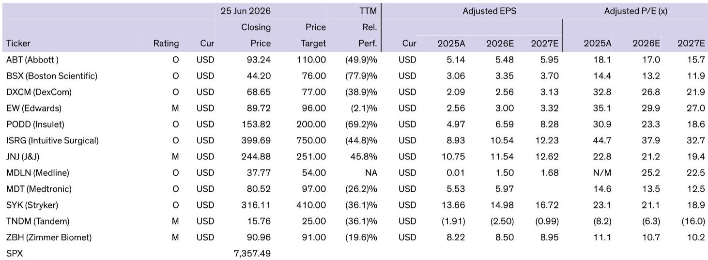
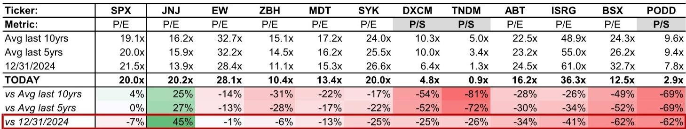
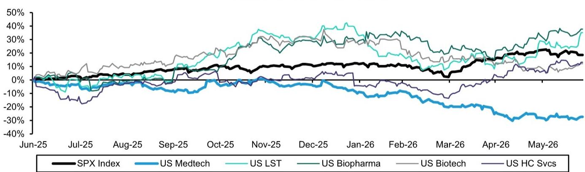

# Bernstein：医疗器械不是基本面崩了，是故事变复杂了

过去一年，美国医疗器械板块跑输标普500指数4600个基点。这不是一个温和的调整——它是全医疗健康板块中最差的细分领域，幅度远超生物科技、生命科学工具甚至管理式医疗。市盈率从去年11月至今被砍掉了30%，回到2017年之前的水平。

如果你只看这些数字，很容易得出一个结论：医疗器械的基本面出了大问题。

但Bernstein这份由九位分析师联合署名的周末深度报告，给出了一个反直觉的判断：基本面没有问题。问题出在“故事”上。

这份报告的核心主张是：医疗器械公司的基本面依然扎实，但每一家公司的“故事”都变得比一年前复杂得多。在一个AI主题吸走几乎所有注意力的市场里，投资者对“有瑕疵的故事”几乎没有耐心。于是，整个板块被集体抛售，不分好坏。

这不是一个行业危机，这是一个叙事危机。

## 1. 波士顿科学的坠落是理解整个板块的关键

要理解医疗器械板块的溃败，必须先理解波士顿科学（BSX）发生了什么。这家公司曾是板块中最闪耀的明星，市盈率在2025年初一度超过36倍。如今，这个数字跌到了12.5倍。

发生了什么？两个核心产品线出了问题。

Farapulse（脉冲场消融）和Watchman（左心耳封堵器）是BSX过去两年增长的双引擎。2024和2025年，公司有机增长率冲到16%，这是医疗设备公司罕见的增速。Farapulse让BSX的电生理业务从2023年的8亿美元暴涨到2025年的33亿美元；Watchman的收入则在三年内从10亿美元翻倍到20亿美元。

转折点出现在2025年下半年。随着PFA领域的竞争加剧，BSX的电生理增长开始减速。2025年第四季度，美国电生理销售低于预期6%，Watchman的有机增长率从35%的峰值回落到29%。2026年第一季度，两个产品线继续减速，泌尿业务又因Axonics整合问题表现疲弱。公司不得不将全年有机增长指引从10%-11%大幅下调至6.5%-8.0%。

更让投资者不安的是，BSX在发布这个指引时，距离其刚刚公布的12个季度长期计划（承诺10%以上有机增长）只有5周时间。紧接着，公司又在5月宣布以14.5亿美元收购Penumbra，这是一笔远超市场预期的交易规模，并投资1.5亿美元于MiRus——而BSX之前在TAVR领域有过两次高调失败。

> **KC评论：** BSX的故事不是“公司做错了什么”，而是“从完美变得不完美”。当一个市场宠儿从增长16%变成增长6%-8%，市场不会温和地重新定价——它会用脚投票。而BSX的坠落拖累了整个板块的估值锚。当最优秀的公司都只能拿到12.5倍PE，其他公司凭什么还能享受溢价？这是板块性估值压缩的真正传播机制。

## 2. 雅培、史赛克、Insulet：各有各的“一根刺”

报告逐一拆解了板块中主要公司的“故事复杂化”过程，每一家都有自己的特定问题。

雅培（ABT）的问题出在最意想不到的地方：营养品业务。2025年第四季度，营养品销售意外下滑9%，原因是价格下调（主要在成人营养品）以及婴儿配方奶粉因失去一个大型WIC合同而丢失市场份额。雅培自2022年以来一直在提高营养品价格以对冲制造成本上升，但涨价最终压低了销量。管理层在当季降价应对，并指引营养品业务在2026年上半年承压、下半年恢复增长。与此同时，雅培的连续血糖监测（CGM）销售持续减速，结构性心脏部门丢失市场份额。ABT年内已下跌约26%。

史赛克（SYK）遭遇了网络攻击。3月11日的攻击扰乱了全球运营，导致第一季度有机增长仅2.4%，低于预期5个百分点。虽然管理层重申了全年指引，理由是收入确认的顺风以及资本设备的积压订单恢复，但投资者担心下半年需要实现11%的有机增长才能达标。SYK年内下跌约10%。

Insulet（PODD）的故事最为戏剧化。自2025年11月的投资者日开始，这家胰岛素泵制造商就成为热门做空标的。3月12日，公司宣布自愿性医疗器械修正，识别出一个制造问题——部分批次的管路可能有微小撕裂，导致胰岛素泄漏而非完全输注体内。当时报告了18起严重不良事件（包括住院和糖尿病酮症酸中毒），无死亡。4月10日，不良事件增至29起。4月29日，FDA错误地将这个制造问题描述为“导致476起严重伤害，无死亡”，当天股价暴跌12.5%。5月26日，公司又宣布了另一起自愿性医疗器械修正。PODD年内已下跌约46%。

> **KC评论：** 这些故事有一个共同模式——没有一家公司是因为“行业基本面崩塌”而下跌。每一家都有自己独特的、可识别的、通常可逆的问题。但市场不关心“可逆”与否，它只关心“现在是不是有别的更好的故事可以买”。在一个AI主题年，医疗设备公司的每一根“刺”都被放大了。

## 3. 市场担心的三个宏观因素，都是“红鲱鱼”

报告用了一个非常直白的词：red herrings（红鲱鱼，即误导性线索）。投资者担心的三个宏观因素——手术量增长放缓、利润率压力、GLP-1的影响——都被Bernstein认为是“看起来像问题，实际上不是”。

关于手术量增长放缓，报告引用了强生和史赛克在季报电话会上的原话。强生说“基础市场是稳固的，潜在需求符合预期”；史赛克说“潜在需求保持健康，手术量稳固”。联合健康也在季报中表示“利用率趋势与上年高水平一致”。医院和保险公司都没有看到手术量放缓的迹象。

关于利润率压力（油价、树脂价格、半导体成本上升），雅培和Zimmer Biomet在季报中表示“尚未看到任何实质性的供应中断”和“目前没有看到任何分销挑战”。这些公司对成本压力的回应是“不担心”。

关于GLP-1的影响，报告承认这可能会在口服减肥药普及后重新引发担忧，但目前来看，大多数医疗器械公司已经摆脱了2023年下半年那种恐慌。

> **KC评论：** 这就是报告最有价值的部分之一——它区分了“市场担心的东西”和“实际发生的东西”。很多时候，市场下跌不是因为坏消息，而是因为“投资者没有耐心去验证这些担心是否成立”。如果你仔细读这份报告里的季报原话，会发现公司管理层和投资者之间存在着显著的认知分歧。

## 4. 什么能让医疗器械重新站起来？

Bernstein给出的答案不是某个单一催化剂，而是一个渐进式的恢复路径。

首先，如果AI主题出现一定程度的降温，资金轮动回传统行业，医疗器械会是受益者之一。Bernstein的宏观团队认为“宽度是故事”，预测会出现轮动和分散化。

其次，也是更重要的，是个股层面风险的逐一解除。如果史赛克能交出一个强劲的第二季度业绩，恢复市场对其执行力的信心；如果雅培能展示营养品业务复苏和结构性心脏的稳定；如果直觉外科（ISRG）能继续用强劲的季度业绩让投资者难以忽视——这些都会逐步修复市场信心。

但最关键的一步是波士顿科学的复苏。报告明确写道：“波士顿科学的复苏将极大地帮助恢复整个板块的信心。”当市场对Watchman和电生理业务的增长底部有了清晰认知，当新的长期计划预期开始聚焦，Bernstein认为未来12-24个月存在“戏剧性复苏”的潜力。

报告还提供了一个关键数据点：过去18个月，大多数覆盖标的的估值倍数被砍掉了25%-60%。对于愿意接受“有点瑕疵的故事”的投资者，Bernstein认为许多优质医疗器械公司已经提供了非常有吸引力的风险回报比。

## 5. 报告没有完全回答的问题

这份报告在诊断问题方面做得极为出色，但在回答“何时”和“如何”触发复苏方面，留下了几个关键的未解问题。

第一个问题是：AI主题的轮动何时发生？Bernstein的宏观团队“预测”轮动，但这不是一个时间表。如果AI主题持续吸引资金，医疗器械板块可能会继续被忽视，无论基本面多好。

第二个问题是：波士顿科学的增长底部在哪里？报告指出Watchman和电生理业务的增速正在减速，但没有给出明确的“底部水平”假设。如果这两个核心产品的增长最终稳定在5%而不是10%，那么当前12.5倍的PE可能还不是底。

第三个问题是：Insulet的制造问题会否引发更广泛的监管关注？FDA已经错误地将问题描述为“476起严重伤害”，这可能会引发更严格的审查。如果监管环境收紧，整个糖尿病器械领域都可能受到波及。

第四个问题是：GLP-1口服药的影响到底有多大？报告承认这是“可能重新引发担忧”的因素，但没有深入分析。如果口服减肥药在2027年获得更广泛的保险覆盖，对CGM、胰岛素泵甚至某些手术器械的需求可能产生实质性影响。

这些未解问题，正是完整报告中最值得继续深挖的部分。Bernstein的分析师在报告中提供了大量图表和细分数据——包括每家公司的估值历史曲线、产品线增长拆解、以及竞争格局变化的时间线——这些细节在摘要中无法完全展开，但恰恰是判断“底部是否已到”的关键输入。

每天，我们会由AI agent配合人工审核，生成国际投行中文摘要与KC评论，日均更新约10-40页。同时整理当天最新数据图表合集，既方便喂给AI做进一步分析，也方便人工快速把握市场动态。欢迎来星球和微信群中继续讨论这些未解问题——尤其是波士顿科学的增长底部测算和GLP-1口服药的二阶影响，这些是决定你是否应该在这个估值水平出手的关键变量。

Personal reading notes and learning share only. Not investment advice.

