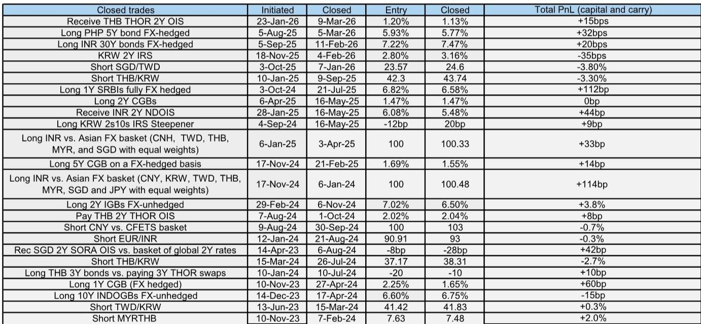
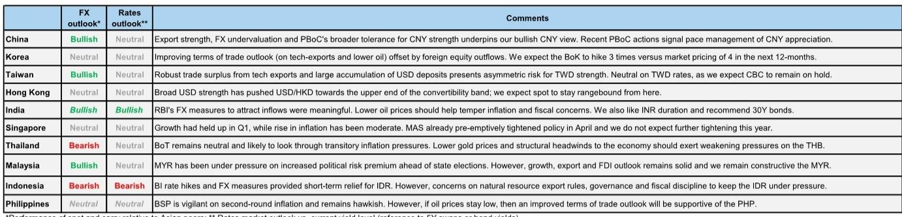
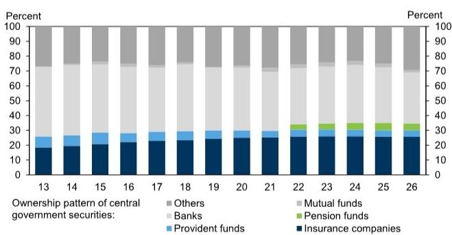

# GS：印度30年国债的买入窗口已经打开

印度国债市场正在经历一个罕见的“三重共振”：宏观基本面改善、央行政策转向友好、全球指数纳入预期升温。GS最新发布的亚洲汇率与利率策略报告明确建议做多印度30年期国债，目标收益率从当前的7.34%下行至6.90%。这一判断并非孤立的交易建议，而是对印度主权债市场结构性重估的押注——其背后的逻辑链条，值得所有关注新兴市场资产配置的决策者认真审视。

这份报告的发布时点耐人寻味。就在几周前，印度央行与财政部联合推出了一系列资本流入便利化措施，包括取消外国机构投资者买卖政府债券的利息和资本利得税、扩大完全可进入路径债券的发行范围至30年和40年期。市场对此已有初步反应，但GS认为，真正的结构性利好尚未被充分定价。

**KC评论：** GS的这个推荐不是短线交易，而是基于印度债券市场“可投资性”的系统性提升。如果你只看收益率数字，可能觉得44个基点的下行空间并不惊人。但关键是，这个判断背后隐含的是印度国债从“边缘资产”向“核心配置”的跃迁——这才是真正的alpha来源。

## 1. 宏观叙事已经转向：通胀和财政的双重压力正在消退

今年一季度，印度国债收益率曾大幅上行50-70个基点，市场对能源和化肥价格上涨的担忧是主要推手。但GS指出，实际冲击远小于最初的恐慌预期。一季度实际GDP同比增长7.8%，比GS自己的预测还高出约50个基点，投资和服务业活动是主要支撑。

更关键的是，随着美伊临时协议的达成，全球油价预期显著下修。GS据此将印度2026日历年的实际GDP预测上调0.3个百分点至6.8%，2027财年预测上调0.4个百分点至6.5%。油价下跌不仅直接改善贸易条件，还降低了政府上调零售燃料价格的压力——尽管此前泵价上调的滞后效应仍会在未来几个月推高通胀，但方向已经明确。

GS将2026日历年的核心通胀预测下调0.1个百分点至4.2%，2027年下调0.2个百分点至4.0%。与此同时，全球化肥价格的急剧回落也将限制政府化肥补贴账单的增长，近期进口招标的成交价格已远低于中东冲突高峰期的水平。

**KC评论：** 通胀和财政是压制印度国债的两座大山。现在这两座大山都在松动，但市场对此的定价仍然不充分。GS的核心逻辑是：如果宏观背景持续改善，印度国债的“风险溢价”应该系统性压缩。报告中有详细的通胀预测路径和财政数据拆解，这些图表是理解这个判断的关键。

## 2. 央行的政策转向不是战术性的，是战略性的

6月5日，印度央行和财政部联合宣布了一系列资本流入措施，包括：为新的外币非居民3-5年期存款提供全额外汇对冲支持；为准主权公司以优惠掉期利率筹集美元资金；提高个人对国内股票的投资限额。

但对债券市场而言，最重要的两项措施是：第一，取消外国机构投资者在政府债券上的利息和资本利得税——这消除了一个重要的操作摩擦，此前外国投资者需要聘请本地税务顾问，增加了隐性成本。第二，将完全可进入路径债券的发行范围扩大至所有新发行的15年、30年和40年期政府债券——这直接提升了主权收益率曲线各期限的可投资性。

GS认为，这些措施不仅是为了短期吸引流入，更是在为印度纳入彭博全球综合指数铺路。2025年1月，彭博指数将印度纳入决定推迟至2026年中，理由是操作和市场基础设施需要进一步审查。但GS指出，印度已于2025年3月被完全纳入JPMGBI-EM全球多元化指数，并已达到9%的权重上限——这说明市场准入已经实质性改善。

**KC评论：** 很多人低估了“取消FIIs利息和资本利得税”这个措施的意义。这不是一个普通的政策微调，而是印度政府对外国投资者释放的明确信号：我们想要你的长期资金。报告中有完全可进入路径债券的完整清单和规模数据，你可以自己算一算，如果全部被纳入全球指数，被动流入的规模会是多少。

## 3. 全球指数纳入：已经不是“是否”的问题，而是“何时”的问题

GS在报告中给出了一个关键判断：印度纳入彭博全球综合指数越来越像是时间问题，而非方向问题，预计2026年中会有正式宣布。如果纳入，基于当前完全可进入路径债券的存量规模，印度的指数权重约为0.7%，这将在分阶段实施期间带来约150亿美元的被动流入。

这个数字看似不大，但需要放在印度国债市场的流动性结构中来理解。150亿美元的被动资金流入，对于30年期这种流动性相对较差的超长端品种，价格冲击效应会非常显著。这也是GS推荐做多30年期而非10年期或5年期的重要原因之一。

**KC评论：** 150亿美元被动流入本身可能不足以驱动一个超级牛市，但它是一个“信号放大器”。一旦全球投资者开始系统性配置印度国债，主动资金的流入规模往往会数倍于被动资金。报告中对印度在彭博指数中的权重估算和流入节奏有详细拆解，这是理解整个交易逻辑的核心。

## 4. 为什么是超长端？储蓄结构变化提供了结构性支撑

GS选择30年期而非短端或中端，并非偶然。报告明确指出，当前前端收益率已经在油价下跌和印度央行加息预期消退的双重推动下大幅下行，进一步压缩的空间有限。真正的机会在超长端。

支撑这一判断的，除了前面提到的宏观和指数因素，还有一个更根本的结构性变化：印度家庭储蓄的“金融化”趋势。GS在之前的研究报告中曾提出“印度储蓄过剩”的概念，核心观察是，家庭储蓄正在从银行存款向退休储蓄（包括养老基金、公共公积金和保险公司）转移。这种资金流向的变化，将逐步增加对超长端债券的结构性需求。

从报告中的图表（Exhibit 2）可以清楚看到，保险公司、养老基金和公积金等长期投资者近年来在印度政府债券中的持有比例持续上升。这不是一个短期交易行为，而是资产配置的长期迁移。

**KC评论：** “储蓄金融化”这个趋势可能被很多海外投资者忽视。印度的养老金和保险资金是天然的“超长端买家”，而且他们的需求是刚性的、与利率水平无关的。这意味着即使全球利率环境出现波动，印度30年期国债的本地需求基础也在不断加固。报告中的Exhibit 2是理解这个结构性变化的关键图表。

## 5. 报告没有完全回答的问题：全球利率环境的不确定性

GS坦率地指出了这个交易的主要风险：如果全球出现大规模久期抛售（例如美联储转向更鹰派），新兴市场债券收益率将被整体拉高，印度也难以幸免。此外，如果国内通胀或财政风险重新抬头，也会破坏当前的基本面叙事。

但这里有一个值得追问的问题：印度国债的“本地需求驱动”特性，能在多大程度上免疫于全球利率波动？如果全球债券收益率因美联储加息而大幅上行，印度30年期国债的收益率是否会同步上行？还是说，本地养老金和保险资金的刚性需求可以形成缓冲？

报告没有给出明确的量化答案。这是一个需要投资者自己判断的问题，也是GS这个推荐中最值得深入探讨的假设。

## 6. 一个观察框架：如何跟踪这个交易的演进

对于关注印度债券市场的读者，以下几个信号值得持续跟踪：

第一，印度央行的外汇储备和汇率管理。报告提到印度央行近期推出了一系列外汇措施来吸引流入，但卢比汇率的表现将直接影响外资的实际回报。如果卢比贬值过快，即使债券收益率下行，外资的美元计价回报也可能被侵蚀。

第二，完全可进入路径债券的发行节奏和规模。6月5日宣布的扩容措施后，新发行的30年期和40年期完全可进入路径债券的规模和定价，将是市场情绪的试金石。

第三，彭博指数的时间表。如果2026年中如期宣布纳入，那么从现在到宣布日的这段时间，恰恰是提前布局的窗口期。

第四，印度家庭储蓄数据的季度变化。储蓄金融化的趋势需要持续的数据验证，如果出现逆转，超长端的需求基础将受到挑战。

**KC评论：** GS这个报告最有价值的部分，可能不是具体的交易建议，而是它提供了一个分析印度债券市场的完整框架——宏观、政策、指数、储蓄结构，四个维度相互印证。但报告中的很多细节（比如指数权重计算的具体假设、储蓄迁移的量化数据、不同情景下的收益率路径模拟）都没有在摘要中展开。这些恰恰是判断这个交易“值不值得做”的关键。

---

以上是对GS这份亚洲汇率与利率策略报告的解读。报告中还有更多关于印度国债市场流动性结构、不同期限品种的相对价值分析、以及全球指数纳入的技术细节，都因篇幅所限无法一一展开。

我们每天由AI agent加人工review生成国际投行中文摘要与KC评论，daily更新约10-40页，并整理当天最新数据图表合集，方便喂给AI，也方便人工快速把握market dynamics。欢迎来星球微信群里继续讨论。

Personal reading notes and learning share only. Not investment advice.

