## The data road map to rate hikes

Incoming data since the June FOMC meeting make us marginally more comfortable in our outlook for a Fed that stays on hold this year. That said, data has to cooperate and we lay out our views about what inflation and labor market data may change our thinking.

## Key Takeaways

<table><tr><td colspan="2">MS &amp; CO. LLC</td></tr><tr><td colspan="2">Michael T Gapen</td></tr><tr><td colspan="2">Chief US Economist</td></tr><tr><td>Michael.Gapen@morganstanley.com</td><td>+1 212 761-0571</td></tr><tr><td colspan="2">Sam D Coffin</td></tr><tr><td colspan="2">Economist</td></tr><tr><td>Sam.Coffin@morganstanley.com</td><td>+1 212 761-4630</td></tr><tr><td colspan="2">Diego Anzoategui</td></tr><tr><td colspan="2">Economist</td></tr><tr><td>Diego.Anzoategui@morganstanley.com</td><td>+1 212 761-8573</td></tr><tr><td colspan="2">Arunima Sinha</td></tr><tr><td colspan="2">Global Economist</td></tr><tr><td>Arunima.Sinha@morganstanley.com</td><td>+1 212 761-4125</td></tr><tr><td colspan="2">Heather Berger</td></tr><tr><td colspan="2">Economist</td></tr><tr><td>Heather.Berger@morganstanley.com</td><td>+1 212 761-2296</td></tr><tr><td colspan="2">Lingdi Xu</td></tr><tr><td colspan="2">Economist</td></tr><tr><td>Lingdi.Xu@morganstanley.com</td><td>+1 212 761-2957</td></tr></table>

Our outlook for inflation is more sanguine than the average Fed participant; we suspect the Fed's forecasts were formed before oil prices fell sharply.

We expect m/m rates of core PCE and CPI inflation of 0.2% or below in the coming months.

If monthly rates of core inflation remain at 0.3% m/m or higher, or if the conflict in the Middle East resumes, then our thinking could change.

\- Our outlook also calls for a moderation in employment growth.

If the unemployment rate falls below 4.0%, the Fed may see risks of an overheating labor market as justifying rate hikes.

Exhibit 1: We expect deceleration in both headline and core PCE inflation...  
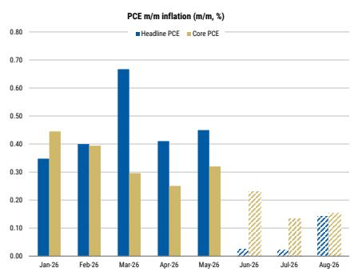  
Source: BEA, MS forecasts. Note: MS forecasts in dashed bars.

Exhibit 2: ...and forecast payroll growth slows this summer  
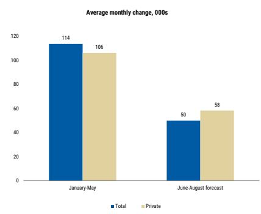  
Source: BLS, MS

## The Data Road Map to Rate Hikes

## We expect a Fed-on-hold through year-end

Following the June FOMC meeting, we retained our outlook for a Fed on hold in 2026 despite 9 FOMC participants who submitted a projection with at least one rate hike this year. We retained our baseline outlook for no rate hikes for several reasons. First, our forecast for inflation is more sanguine. We believe tariff pass through is ending, paving the way for substantial disinflation in core goods over the next year, and the recently signed MOU between the US and Iran has helped push oil prices back toward pre-conflict levels. In addition, we look for further moderation in shelter inflation and some payback from residual seasonality into year end. On net, and following the release of May PCE inflation, our forecast of 4Q/4Q headline and core PCE inflation of 3.2% and 3.0% this year is substantially below the median FOMC participant.

Second, we suspect that FOMC participants' projections may be overstating inflation pressures. In March, FOMC participants had to form their inflation projections shortly after the conflict began. Without knowing the duration of the conflict, participants likely underestimated how much inflation would firm in subsequent months. In June, we think the Fed may be overstating inflation pressures since forecasts were likely formed before the MOU took hold. Nine FOMC participants submitted forecasts of 4Q/4Q headline inflation at 3.5-3.6%, while 8 participants submitted forecasts between 3.7-4.2%. This suggests the average inflation forecast lies above the median forecast. We think these are too high in light of the subsequent decline in energy prices.

Third, we believe most of the 9 dots projecting rate hikes this year are Reserve Bank presidents that may not be voters; we think it is likely that the majority of voters on the committee prefer the status quo policy setting despite the evolution of the outlook. These voters are likely more comfortable with this outlook in light of incoming data since the conclusion of the June meeting.

Finally, consumer spending has softened, in both as-reported and revised data, and we view recent payroll gains as outsized due, in part, to a catch-up effect in hiring following the implementation of protectionist trade policies last year. If the Fed is patient, we expect FOMC voters to prefer the current policy stance over a more restrictive one.

Exhibit 3: Oil prices came down since mid-June  
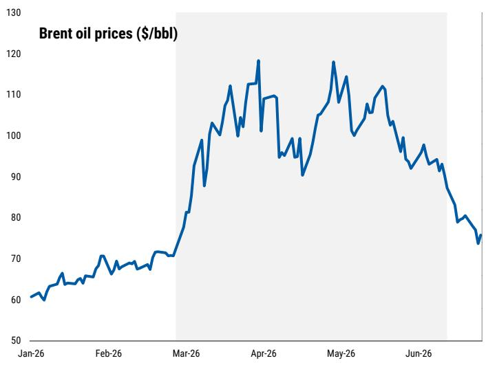  
Source: Bloomberg, MS.

Exhibit 4: FOMC participants' projections may be overstating inflation pressures  
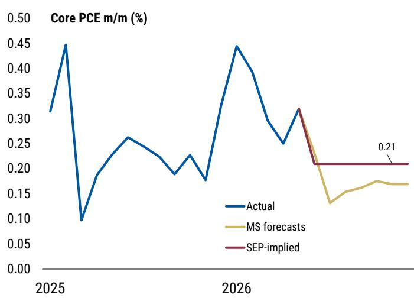  
Source: BEA, Federal Reserve, MS forecasts.

## The Road Map to Rate Hikes

That said, our outlook for monetary policy in 2026 is depending on several conditioning assumptions which may not hold and we detail how data could evolve in a way that leads us to change our outlook in favor of rate hikes. We focus most of our attention on our outlook for the data flow in June through August given that the Fed will see this data before it meets in September. If the Fed wants to raise rates in July, then it seems unlikely that any data between now and then will sway the Fed's thinking. Hence, we frame the data road map in terms of what may kick the Fed into action in September, or keep it on hold longer.

On the inflation front, the Fed's projections assume monthly run rates that persisted from April through December of 2025, which could result from core goods inflation closer to 0.2% m/m on account of elongated tariff pass through or more robust second-round effects from higher energy prices. This would mean m/m rates of core inflation of around 0.3%. In our forecast, core CPI and PCE inflation run slightly below 0.2% m/m, on average, in the three releases between June and August. Hence, upside surprises to core could lead us to change our thinking.

In addition, oil futures prices point to substantial payback in energy prices in June and July, with energy prices in PCE inflation set to fall by about 5.0% and 2.6%, respectively. Should the MOU between the US and Iran not hold and subsequent hostilities re-close the strait, then our forecast for monthly declines in headline CPI inflation (-0.16% and -0.04% m/m in June and July) and roughly flat readings on headline PCE inflation (0.02% m/m on average) may not materialize. This would represent a higher probability of our oil risk premium scenario, where headline inflation remains firm and second round effects on core materialize.

In the labor market, we expect recent payroll gains (114k per month from January to May and 188k over the past three months) to moderate. We project increases of 50-60k per month on average over the summer (total nonfarm and private), which should keep the unemployment rate roughly steady near current levels. Should payroll gains outperform our expectations and push the unemployment rate below the median FOMC participants' estimate of the longer run neutral rate (4.2%), then the Fed may decide a more restrictive stance is needed to prevent labor market overheating. We think a move below 4.0% on the unemployment rate by September would increase cause for concern that the labor market is much stronger than thought.

Finally, we also acknowledge that data may not be the deciding factor for some participants. A year ago, the Fed viewed its policy stance as inappropriate in light of their view that downside risk to employment outweighed upside risk to inflation. Some of the nine projections for rate hikes may reflect a reversal in this risk management approach; they may see the distribution of risks as skewed sufficiently in the direction of firmer inflation and view the current policy stance as inappropriate. In other words, subjective assessments about the distribution of outcomes around the modal path may be enough for hikes, diminishing the influence of incoming data.

For now, we retain our outlook for no rate hikes from the Fed this year. While incoming data since the June FOMC have made us marginally more comfortable in this view, we remain attentive to the data and will adjust our views accordingly as the economy evolves.

Average monthly change, 000s  
Exhibit 5: We forecast deceleration in both headline and core PCE inflation  
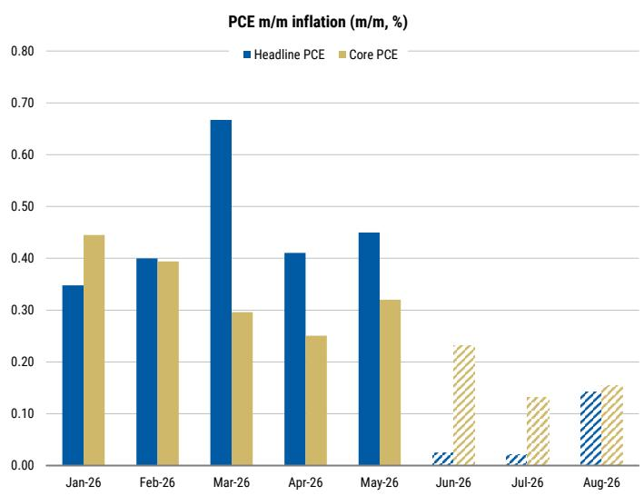  
Source: BEA, MS forecasts. Note: MS forecasts in dashed bars.

Exhibit 6: We forecast slower payroll growth  
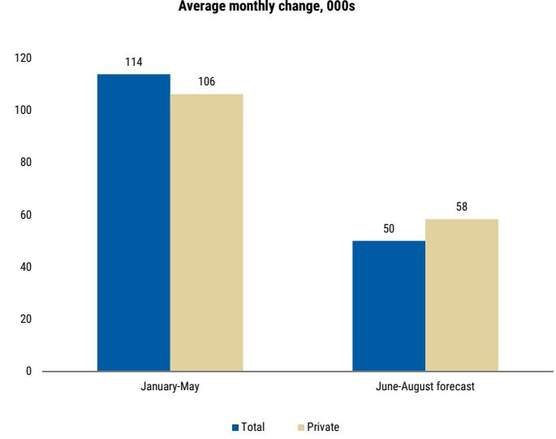  
Source: BLS, MS

# Oil Tracker: US ending stocks of crude oil edge lower amid increased exports and unchanged production

We continue to track the evolution of petroleum-product inventory and production. US stocks of crude oil and petroleum products, which represent the EIA's estimate of how many barrels of oil and petroleum products are physically sitting in US storage at period end, continue to move lower. Inclusive of the SPR, inventory is falling by about 2mn barrels a day. The spot price of oil for immediate purchase and delivery in the physical market remains high despite futures prices declining since the MOU between the US and Iran.

US domestic crude production has edged modestly higher in recent weeks, but it remains about in line with pre-conflict production. Net imports of oil (imports - exports) are declining because of increased oil exports.

Exhibit 7: US ending stocks of crude oil continue to move lower  
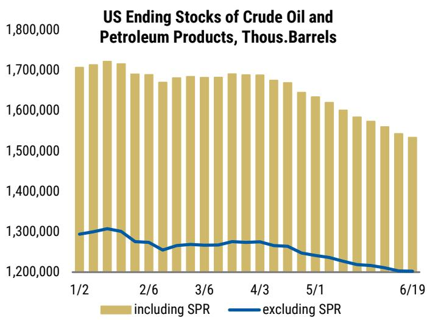  
Source: Energy Information Administration, Haver Analytics, MS

Exhibit 8: Prices of oil in the physical market have eased but remain higher than before the Iran conflict  
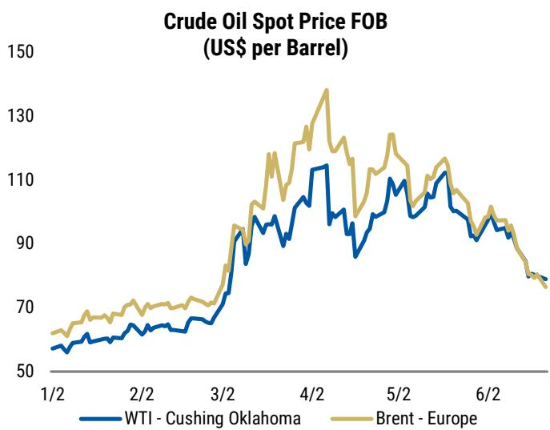  
Source: Energy Information Administration, Haver Analytics, MS

Exhibit 9: Including the SPR, US oil stocks are falling about 2mn barrels per day  
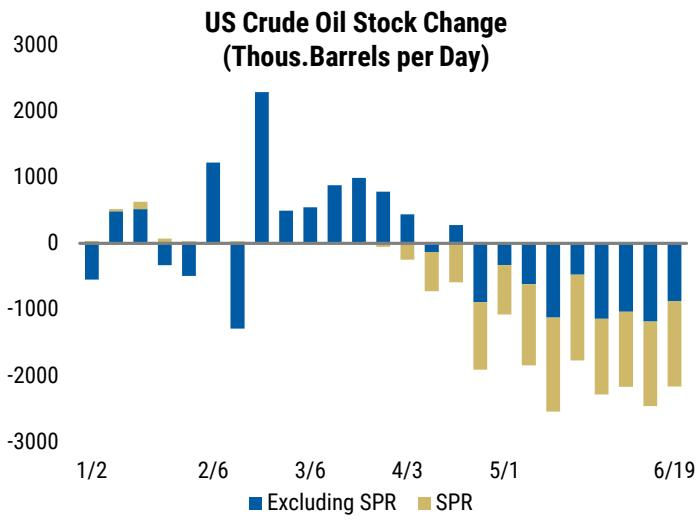  
Source: Energy Information Administration, Haver Analytics, MS  
Exhibit 10: US domestic oil production remains broadly unchanged

Exhibit 11: US exports of oil and petroleum products have risen, pushing down net imports of these energy goods  
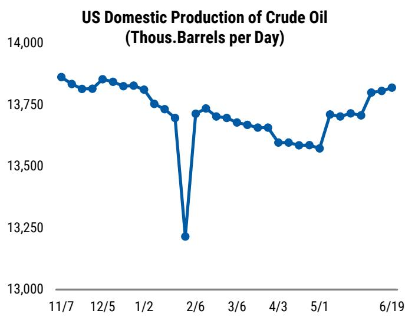  
Source: Energy Information Administration, Haver Analytics, MS

US Net Imports of Crude Oil and Petroleum Products (Thous.Barrels per Day)  
Exhibit 12: US imports of oil have decelerated a little while exports have picked up  
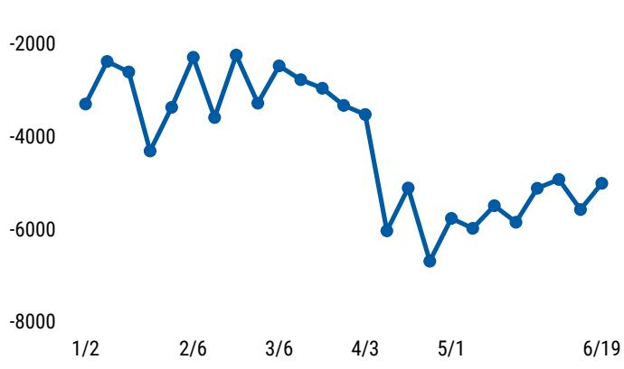  
Source: Energy Information Administration, Haver Analytics, MS

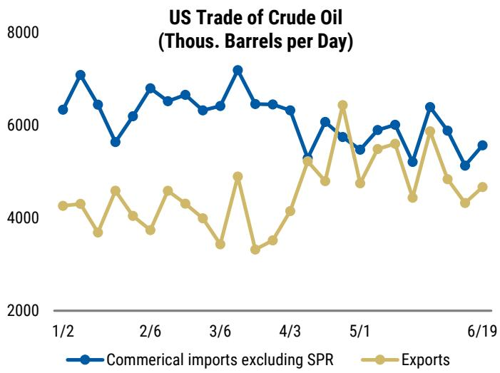  
Source: Energy Information Administration, Haver Analytics, MS

# Financial Conditions: A near-reversal following the April 7 ceasefire

Following the conflict in the Middle East and the uncertainty it brings to the next steps for monetary policy, we include the evolution of our FRB/US-based model of financial conditions, which aims to capture how changes in asset prices weigh on future economic activity. The index includes five daily variables: the 10-year Treasury yield, S&P 500 returns, the corporate BBB credit spread, the valuation of the U.S. dollar, and the price of oil. These are aggregated based on their estimated growth elasticities relative to the federal funds rate, using the Federal Reserve's FRB/US model. As a result, the index can be interpreted as the equivalent change in the federal funds rate, expressed in basis points, required to generate a similar effect on economic activity.

Since hostilities in the Middle East began on February 28, the tightening in financial conditions is equivalent to about a 40bp rise in the federal funds rate. The tightening reversed all of the easing seen earlier this year, most of which occurred between the December and January FOMC meetings and was primarily driven by a weaker U.S. dollar. The net tightening since February 28 has been driven mainly by a weaker U.S. dollar, with higher 10-year U.S. Treasury yields playing a secondary role. Buoyant equity markets have offset some of the tightening. Since the hawkish June FOMC meeting, financial conditions have tightened by 22 bp, primarily driven by U.S. dollar depreciation and weaker stock market returns.

Exhibit 13: Financial conditions have tightened following the conflict in the Middle East

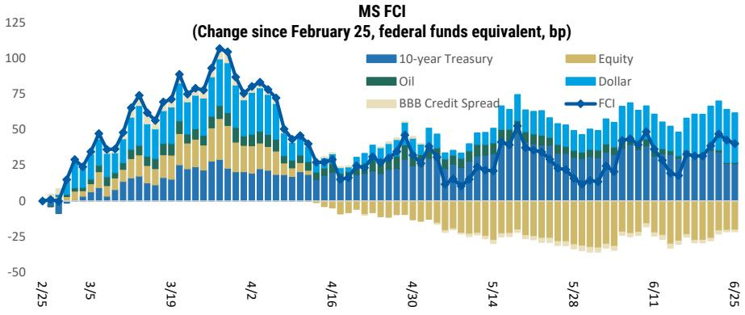  
Source: Bloomberg, MS

# The effective tariff rate, tariff receipts and refunds

## The tariff rate on US imports has fallen to 8.3% in 1Q26 data

On February 20, 2026, the Supreme Court struck down the President's authority to impose tariffs under IEEPA. Section 122 tariffs will replace IEEPA tariffs in the short term, though uncertainty rises after the 150-day period when Congress would need to extend those tariffs. Replacing IEEPA with Section 122 tariffs of 15% and considering composition effects of US imports, we estimate baseline tariffs near 11%. Our estimate of "core" tariffs (ex fuels, gold and AI-related imports) remains closer to 13-14%. In our view, near-term tariffs are likely capped below 'Liberation Day' levels, at least until Section 232 and 301 investigations are complete. In the April 2026 data, the effective tariff rate is estimated at \~6.9%, and the 1Q26 tariff rate averages to 8.3%.

Exhibit 14: US effective tariff rate  
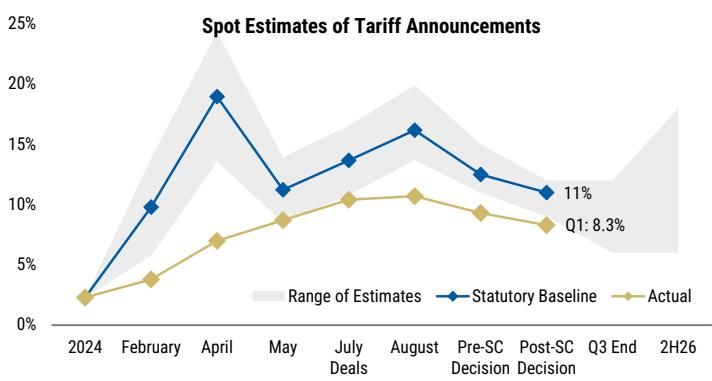  
Source: US Census, US HTS, USITC, MS

Exhibit 16: Cash withdrawals from the DHS - CBP, as a proxy for tariff refunds  
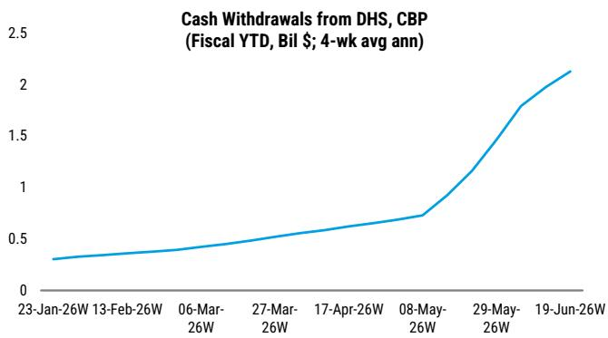  
Source: US Treasury, Haver Analytics, MS

Exhibit 15: US Treasury: Customs and excise deposits from tariffs  
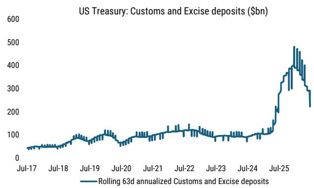  
Source: US Treasury, Bloomberg, MS

Tariff refunds represent cash returned to importers when customs duties were previously overpaid or later determined to be refundable, for different reasons including a tariff exclusion or court-ordered refund, or a drawback claim tied to goods that are exported or destroyed. The process generally runs through CBP, where importers or brokers submit the relevant claim and supporting documentation; CBP then reviews eligibility, confirms the entry and status, and certifies approved refunds for payment. In Treasury cash-flow data, we monitor these payments at high frequency through CBP-related withdrawals in the Daily Treasury Statement. We interpret this as a tariff-refund proxy.

## 2Q GDP tracking trimmed $\frac{1}{2}$ point to 2.5%

1Q GDP revisions and April-May consumer spending data showed much softer consumer spending growth than we had known. 1Q consumption was cut to 0.5% from 1.4% because of services, which are now reported at 0.5% growth instead of 1.8%. (The BEA sharply reduced its estimates of consumption growth in financial services—not the most reliable series—and international travel.) Add to that a downward revision to April goods spending, and we are now tracking 2Q consumption at 1.9% instead of 2.9%.

Year-to-date, the implication is a sharper slowing in consumer spending growth—a 1.2% rate of growth in H1 2026. Residual seasonality and higher tariffs appear to have weighed on consumption. Before today's revisions, we had been surprised at the resilience in spending; now, we are instead surprised at the softness reported in 2Q services. We are also alert to the fragility of that estimate. It is so far based on very little input data: underlying services spending measures from the Quarterly Services Survey will not be available until about a month and a half from now. Before then, the services estimates are more judgmental.

In our 2Q tracking, we are building in 2.7% goods spending and 1.6% services spending, with the apprehension that the services could be heavily revised once the services company revenues are finally pulled into 2Q GDP in about two months.

The result is 2Q GDP tracking at a 2.5% q/q annual rate rather than the 3.0% we expected a week ago. The May and June trade data and June retail sales could still alter our forecast materially. Also, we have held off on estimating the impact of the falling SPR, which won't affect headline GDP but will shift spending away from government consumption and toward private inventory investment.

Following the 2.1% real GDP growth in 1Q, the 2.5% growth in 2Q puts the recent run rate at slightly above last year's 2.1% 4Q/4Q real GDP growth.

The Atlanta Fed tracking for 2Q also fell to a 2.5% q/q annual rate from 3.0%. However, their forecasts include more strength in business investment and show a drag from trade rather than the boost we have. The New York Fed 2Q GDP Nowcast was about unchanged at 2.7%.

Exhibit 17: The effect of incoming data on our US GDP tracking estimate

<table><tr><td colspan="14">Details of Q2 2026 US GDP tracking (% q/q saar unless indicated)</td></tr><tr><td rowspan="2">Date</td><td rowspan="2">Data release</td><td rowspan="2"></td><td colspan="9">Final</td><td>NX (level)</td><td rowspan="2">CPI (level)</td></tr><tr><td>GDP</td><td>sales</td><td>PCE</td><td>Res</td><td>Equip</td><td>Struct</td><td>IPP</td><td>Gov</td><td>X</td><td>M</td></tr><tr><td>12-May</td><td>Baseline</td><td></td><td>2.3</td><td>2.3</td><td>1.7</td><td>1.0</td><td>8.0</td><td>-3.0</td><td>8.0</td><td>1.4</td><td>0.0</td><td>-0.1</td><td>-1067</td></tr><tr><td rowspan="2">14-May</td><td>Retail sales</td><td>Apr</td><td>2.4</td><td>2.4</td><td>1.8</td><td>1.0</td><td>8.0</td><td>-3.0</td><td>8.0</td><td>1.4</td><td>0.0</td><td>-0.1</td><td>-1067</td></tr><tr><td>Adjustments</td><td></td><td>2.6</td><td>2.8</td><td>2.5</td><td>1.0</td><td>8.0</td><td>-3.0</td><td>8.0</td><td>1.4</td><td>0.0</td><td>-0.1</td><td>-1067</td></tr><tr><td>21-May</td><td>Quarterly Services Survey</td><td>1Q</td><td>2.4</td><td>2.6</td><td>2.2</td><td>1.0</td><td>8.0</td><td>-3.0</td><td>8.0</td><td>1.4</td><td>0.0</td><td>-0.1</td><td>-1067</td></tr><tr><td>28-May</td><td>Post GDP revision</td><td>1Q</td><td>2.4</td><td>2.6</td><td>2.2</td><td>1.0</td><td>8.0</td><td>-3.0</td><td>8.0</td><td>1.4</td><td>0.0</td><td>-0.1</td><td>-1063</td></tr><tr><td>29-May</td><td>Trade &amp; trade effects on business investment</td><td>Apr</td><td>2.7</td><td>3.0</td><td>2.2</td><td>1.0</td><td>8.0</td><td>-3.0</td><td>8.0</td><td>1.4</td><td>13.0</td><td>7.5</td><td>-1048</td></tr><tr><td>4-June</td><td>Motor vehicle sales, PCE price estimates</td><td>May</td><td>2.7</td><td>3.0</td><td>2.2</td><td>1.0</td><td>8.0</td><td>-3.0</td><td>8.0</td><td>1.4</td><td>13.0</td><td>7.5</td><td>-1048</td></tr><tr><td>9-June</td><td>Trade &amp; trade effects on business investment</td><td>Apr</td><td>2.8</td><td>3.1</td><td>2.2</td><td>1.0</td><td>8.0</td><td>-3.0</td><td>8.0</td><td>1.4</td><td>13.0</td><td>6.5</td><td>-1039</td></tr><tr><td>16-June</td><td>Housing starts and permits</td><td>May</td><td>2.8</td><td>3.1</td><td>2.2</td><td>0.5</td><td>8.0</td><td>-3.0</td><td>8.0</td><td>1.4</td><td>13.0</td><td>6.5</td><td>-1039</td></tr><tr><td>17-June</td><td>Retail sales</td><td>May</td><td>3.0</td><td>3.4</td><td>2.9</td><td>0.5</td><td>8.0</td><td>-3.0</td><td>8.0</td><td>1.4</td><td>13.0</td><td>7.5</td><td>-1048</td></tr><tr><td>24-June</td><td>New home sales</td><td>May</td><td>3.0</td><td>3.4</td><td>2.9</td><td>-0.2</td><td>8.0</td><td>-3.0</td><td>8.0</td><td>1.4</td><td>13.0</td><td>7.5</td><td>-1048</td></tr><tr><td>25-June</td><td>GDP, income, prices, durables</td><td></td><td>2.5</td><td>2.9</td><td>1.9</td><td>-0.2</td><td>8.0</td><td>-3.0</td><td>8.0</td><td>1.4</td><td>13.0</td><td>6.5</td><td>-976</td></tr><tr><td rowspan="3"></td><td>GDP tracking</td><td></td><td>2.5</td><td>2.9</td><td>1.9</td><td>-0.2</td><td>8.0</td><td>-3.0</td><td>8.0</td><td>1.4</td><td>13.0</td><td>6.5</td><td>-976</td></tr><tr><td>Contribution to GDP growth (pp)</td><td></td><td></td><td>2.9</td><td>1.3</td><td>0.0</td><td>0.4</td><td>-0.1</td><td>0.5</td><td>0.2</td><td>1.4</td><td>-0.9</td><td>0.5</td></tr><tr><td>MS official forecast</td><td></td><td>2.3</td><td>2.3</td><td>1.7</td><td>1.0</td><td>8.0</td><td>-3.0</td><td>8.0</td><td>1.4</td><td>0.0</td><td>-0.1</td><td>-1067</td></tr></table>

Note: Our GDP tracking estimate is distinct from our official published GDP forecast. It reflects the mechanical aggregation of monthly activity data that feed directly into the BEA's calculation. Where data releases have implications for the tracking components, cells have been bolded. Final sales is GDP less inventories. Source: MS

Exhibit 18: GDP nowcasts
Real GDP tracking, Q/Q % change, a.r.  
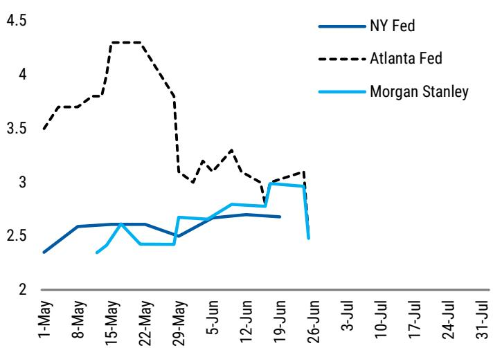  
Source: Federal Reserve Banks of New York and Atlanta, MS

Exhibit 19: Our tracking vs. the Atlanta Fed tracking

<table><tr><td rowspan="2"></td><td colspan="2">MS</td><td colspan="2">Atlanta Fed</td><td rowspan="2">Difference contrib, pts</td></tr><tr><td>q/q%, ar</td><td>contrib</td><td>q/q%, ar</td><td>contrib</td></tr><tr><td>GDP</td><td>2.5</td><td></td><td>2.5</td><td></td><td>0.0</td></tr><tr><td>Final sales</td><td>2.9</td><td>2.9</td><td>2.3</td><td>2.3</td><td>0.6</td></tr><tr><td>Final sales to dom. purchasers</td><td>2.3</td><td>2.4</td><td>2.8</td><td>2.9</td><td>-0.5</td></tr><tr><td>Private</td><td>2.5</td><td>2.1</td><td>3.0</td><td>2.6</td><td>-0.4</td></tr><tr><td>Consumption</td><td>1.9</td><td>1.3</td><td>2.0</td><td>1.4</td><td>0.0</td></tr><tr><td>Goods</td><td>2.7</td><td>0.6</td><td>3.3</td><td>0.7</td><td>-0.1</td></tr><tr><td>Services</td><td>1.6</td><td>0.8</td><td>1.4</td><td>0.7</td><td>0.1</td></tr><tr><td>Residential investment</td><td>-0.2</td><td>0.0</td><td>2.7</td><td>0.1</td><td>-0.1</td></tr><tr><td>Equipment investment</td><td>8.0</td><td>0.4</td><td>14.4</td><td>0.8</td><td>-0.3</td></tr><tr><td>Nonres structures</td><td>-3.0</td><td>-0.1</td><td>-0.9</td><td>0.0</td><td>-0.1</td></tr><tr><td>Intel. Property</td><td>8.0</td><td>0.5</td><td>6.2</td><td>0.4</td><td>0.1</td></tr><tr><td>Government</td><td>1.4</td><td>0.2</td><td>1.7</td><td>0.3</td><td>-0.1</td></tr><tr><td>Exports</td><td>13.0</td><td>1.4</td><td>8.2</td><td>0.9</td><td>0.5</td></tr><tr><td>Imports</td><td>6.5</td><td>-0.9</td><td>11.2</td><td>-1.5</td><td>0.6</td></tr><tr><td>Net exports</td><td></td><td>0.5</td><td></td><td>-0.6</td><td>1.1</td></tr><tr><td>Inventories</td><td></td><td>-0.4</td><td></td><td>0.3</td><td>-0.7</td></tr></table>

Source: Federal Reserve Bank of New York, MS

## Data review & preview

Review of past week's data  
Exhibit 20:

<table><tr><td>Monday 22 June</td><td>Data</td><td>Period</td><td>Forecast</td><td>Consensus</td><td>Prev</td><td>Actual</td></tr><tr><td colspan="7">No scheduled data or Fedspeak</td></tr><tr><td>Tuesday 23 June</td><td>Data</td><td>Period</td><td>Forecast</td><td>Consensus</td><td>Prev</td><td>Actual</td></tr><tr><td>8:15 AM</td><td>ADP Weekly Employment Change</td><td>6-Jun</td><td></td><td></td><td>25.5</td><td>30.8</td></tr><tr><td>8:30 AM</td><td>Philadelphia Fed Non-Manufacturing Activity</td><td>Jun</td><td></td><td>-16.0</td><td>-24</td><td>-25.8</td></tr><tr><td>9:45 AM</td><td>S&amp;P US Manufacturing PMI</td><td>Jun P</td><td></td><td>54.6</td><td>55</td><td>55.7</td></tr><tr><td>10:00 AM</td><td>Richmond Fed Manufact. Index</td><td>Jun</td><td></td><td>8.0</td><td>13.0</td><td>4.0</td></tr><tr><td>10:00 AM</td><td>Richmond Fed Business Conditions</td><td>Jun</td><td></td><td>1.5</td><td>0</td><td>-9.0</td></tr><tr><td>Wednesday 24 June</td><td>Data</td><td>Period</td><td>Forecast</td><td>Consensus</td><td>Prev</td><td>Actual</td></tr><tr><td>7:00 AM</td><td>MBA Mortgage Applications</td><td>19-Jun</td><td></td><td></td><td></td><td>1.0</td></tr><tr><td>8:30 AM</td><td>Current Account Balance</td><td>1Q</td><td>-220</td><td>-209</td><td>-191</td><td>-227</td></tr><tr><td>10:00 AM</td><td>New Home Sales</td><td>May</td><td>630</td><td>640</td><td>622</td><td>580.0</td></tr><tr><td>10:00 AM</td><td>New Home Sales m/m</td><td>May</td><td>1.3</td><td>3.2</td><td>-6.2</td><td>-7.3</td></tr><tr><td>Thursday 25 June</td><td>Data</td><td>Period</td><td>Forecast</td><td>Consensus</td><td>Prev</td><td>Actual</td></tr><tr><td>8:30 AM</td><td>Chicago Fed Nat Activity Index</td><td>May</td><td></td><td>0.1</td><td>0.1</td><td>-0.1</td></tr><tr><td>8:30 AM</td><td>Personal Income</td><td>May</td><td>0.4</td><td>0.4</td><td>0.0</td><td>0.7</td></tr><tr><td>8:30 AM</td><td>Personal Spending</td><td>May</td><td>0.8</td><td>0.6</td><td>0.5</td><td>0.7</td></tr><tr><td>8:30 AM</td><td>Real Personal Spending</td><td>May</td><td>0.3</td><td>0.2</td><td>0.1</td><td>0.3</td></tr><tr><td>8:30 AM</td><td>PCE Price Index m/m</td><td>May</td><td>0.48</td><td>0.5</td><td>0.4</td><td>0.4</td></tr><tr><td>8:30 AM</td><td>PCE Price Index y/y</td><td>May</td><td>4.10</td><td>4.1</td><td>3.8</td><td>4.1</td></tr><tr><td>8:30 AM</td><td>Core PCE Price Index m/m</td><td>May</td><td>0.36</td><td>0.3</td><td>0.2</td><td>0.3</td></tr><tr><td>8:30 AM</td><td>Core PCE Price Index y/y</td><td>May</td><td>3.44</td><td>3.4</td><td>3.3</td><td>3.4</td></tr><tr><td>8:30 AM</td><td>GDP Annualized q/q</td><td>1Q T</td><td>1.6</td><td>1.6</td><td>1.6</td><td>2.1</td></tr><tr><td>8:30 AM</td><td>Personal Consumption</td><td>1Q T</td><td>1.3</td><td>1.4</td><td>1.4</td><td>0.5</td></tr><tr><td>8:30 AM</td><td>GDP Price Index</td><td>1Q T</td><td>3.5</td><td>3.5</td><td>3.5</td><td>3.6</td></tr><tr><td>8:30 AM</td><td>Core PCE Price Index q/q</td><td>1Q T</td><td>4.5</td><td>4.4</td><td>4.4</td><td>4.4</td></tr><tr><td>8:30 AM</td><td>Initial Jobless Claims</td><td>20-Jun</td><td>225k</td><td>225</td><td>226k</td><td>215.0</td></tr><tr><td>8:30 AM</td><td>Continuing Claims</td><td>13-Jun</td><td>1800k</td><td>1802</td><td>1810k</td><td>1821.0</td></tr><tr><td>8:30 AM</td><td>Durable Goods Orders</td><td>May P</td><td>-7.0</td><td>-5.0</td><td>8.0</td><td>-4.5</td></tr><tr><td>8:30 AM</td><td>Durables Ex Transportation</td><td>May P</td><td>0.6</td><td>0.6</td><td>1.1</td><td>1.3</td></tr><tr><td>8:30 AM</td><td>Initial Claims 4-Wk Moving Avg</td><td>20-Jun</td><td></td><td></td><td>0.0</td><td>224.3</td></tr><tr><td>8:30 AM</td><td>Cap Goods Orders Nondef Ex Air</td><td>May P</td><td>0.6</td><td>0.6</td><td>-1.0</td><td>1.6</td></tr><tr><td>8:30 AM</td><td>Cap Goods Ship Nondef Ex Air</td><td>May P</td><td>0.6</td><td>0.5</td><td>0.4</td><td>0.3</td></tr><tr><td>11:00 AM</td><td>Kansas City Fed Manf. Activity</td><td>Jun</td><td></td><td>6.0</td><td>8.0</td><td>11.0</td></tr><tr><td>3:40 PM</td><td>Fed&#x27;s Williams Gives Keynote Remarks</td><td></td><td></td><td></td><td></td><td></td></tr><tr><td>4:30 PM</td><td>Fed balance sheet (H.4.1)</td><td></td><td></td><td></td><td></td><td></td></tr><tr><td>6:30 PM</td><td>Fed&#x27;s Goolsbee in Moderated Discussion</td><td></td><td></td><td></td><td></td><td></td></tr><tr><td>Friday 26 June</td><td>Data</td><td>Period</td><td>Forecast</td><td>Consensus</td><td>Prev</td><td>Actual</td></tr><tr><td>8:30 AM</td><td>Advance Goods Trade Balance</td><td>May</td><td>-85.0</td><td>-85.0</td><td>-82.4</td><td></td></tr><tr><td>8:30 AM</td><td>Retail Inventories m/m</td><td>May</td><td></td><td>0.5</td><td>0.7</td><td></td></tr><tr><td>8:30 AM</td><td>Wholesale Inventories m/m</td><td>May P</td><td></td><td>0.4</td><td>0.6</td><td></td></tr><tr><td>10:00 AM</td><td>U. of Mich. Sentiment</td><td>Jun F</td><td></td><td>50.0</td><td>48.9</td><td></td></tr><tr><td>10:00 AM</td><td>U. of Mich. 5-10 Yr Inflation</td><td>Jun F</td><td></td><td>3.3</td><td>3.4</td><td></td></tr><tr><td>11:00 AM</td><td>Kansas City Fed Services Activity</td><td>Jun</td><td></td><td></td><td>10.0</td><td></td></tr><tr><td>11:30 AM</td><td>Fed&#x27;s Kashakri in Aspen Ideas Panel</td><td>0-Jan</td><td></td><td></td><td></td><td></td></tr><tr><td>4:15 PM</td><td>Commercial bank balance sheets (H.8)</td><td></td><td></td><td></td><td></td><td></td></tr></table>

Source: Bloomberg, MS forecasts

Preview of upcoming data

Fed Chairman Warsh speaks at Sintra on Wednesday

Exhibit 21: Monday

<table><tr><td>Monday 29 June</td><td>Data</td><td>Period</td><td>Forecast</td><td>Consensus</td><td>Prev</td></tr><tr><td>10:30 AM</td><td>Dallas Fed Manf. Activity</td><td>Jun</td><td></td><td></td><td>0.4</td></tr></table>

Source: Bloomberg, MS forecasts

We will finalize our forecast for the manufacturing ISM index after the Dallas Fed factory survey is reported.

Exhibit 22: Tuesday

<table><tr><td>Tuesday 30 June</td><td>Data</td><td>Period</td><td>Forecast</td><td>Consensus</td><td>Prev</td></tr><tr><td>9:00 AM</td><td>FHFA House Price Index m/m</td><td>Apr</td><td></td><td></td><td>0.1</td></tr><tr><td>9:00 AM</td><td>S&amp;P Cotality CS 20-City m/m SA</td><td>Apr</td><td></td><td></td><td>-0.2</td></tr><tr><td>9:45 AM</td><td>MNI Chicago PMI</td><td>Jun</td><td></td><td></td><td>63</td></tr><tr><td>10:00 AM</td><td>Conf. Board Consumer Confidence</td><td>Jun</td><td></td><td>94.6</td><td>93.1</td></tr><tr><td>10:00 AM</td><td>JOLTS Job Openings</td><td>May</td><td></td><td>7360</td><td>7618</td></tr><tr><td>10:30 AM</td><td>Dallas Fed Services Activity</td><td>Jun</td><td></td><td></td><td>-8</td></tr></table>

Source: Bloomberg, MS forecasts

Job openings and labor turnover. Noisy labor data in February-March gave the impression of a sharp slowdown in the labor market and then a steep rebound. JOLTS data showed the same zig-zag and, like the payrolls report, it extended the rebound into April. There's no sign in the JOLTS data of sudden disruption to the labor market following the Middle East conflict. And smoothing through the volatility, there's not too much change since a year ago in hiring or firing rates, although job openings surged in April.

In April, job openings jumped to their highest in 2 years. 90% of the rise reflected 1 industry (professional and business services), which lessens the credibility of the increase. There was no subsequent hiring spree in May in professional and business services.

Conference Board consumer confidence survey. Labor market assessments improved in the past two months. The net percentage of people seeing more job availability rose from a recent low of 5.7% in February to 6.1%, 7.5%, and 6.9% in March, April, and May.

Exhibit 23: Wednesday

<table><tr><td>Wednesday 01 July</td><td>Data</td><td>Period</td><td>Forecast</td><td>Consensus</td><td>Prev</td></tr><tr><td>12:00 AM</td><td>Vehicle Sales</td><td>Jun</td><td>16.2</td><td>16.0</td><td>16.1</td></tr><tr><td>5:30 AM</td><td>Challenger Job Cuts y/y</td><td>Jun</td><td></td><td></td><td>3.4</td></tr><tr><td>7:00 AM</td><td>MBA Mortgage Applications</td><td>26-Jun</td><td></td><td></td><td>1.0</td></tr><tr><td>8:15 AM</td><td>ADP Employment Change</td><td>Jun</td><td></td><td>110</td><td>122</td></tr><tr><td>9:00 AM</td><td>Fed&#x27;s Warsh Appears on Panel at ECB Forum</td><td></td><td></td><td></td><td></td></tr><tr><td>9:45 AM</td><td>S&amp;P US Manufacturing PMI</td><td>Jun F</td><td>55.7</td><td></td><td>55.7</td></tr><tr><td>10:00 AM</td><td>ISM Manufacturing</td><td>Jun</td><td>54.0</td><td>53.6</td><td>54.0</td></tr><tr><td>10:00 AM</td><td>Construction Spending m/m</td><td>May</td><td>-0.1</td><td></td><td>0.4</td></tr></table>

Source: Bloomberg, MS forecasts

## Fed Chair Warsh speaks at 9am.

Manufacturing ISM. Regional manufacturing surveys and the national S&P PMI point to continued strong demand and production, soft labor demand in the manufacturing sector, and some signs of deceleration in both input and output price inflation. We are currently tracking the June ISM Manufacturing PMI at 54.0, unchanged from a month earlier, and will finalize our forecast after the release of the Dallas Fed Manufacturing Survey.

Construction spending. The 11.6%m/m decline in single-family housing starts in April probably pass through into a decline in construction spending in May. We forecast headline construction spending fell 0.1%, including continued declines in private spending (residential -0.3%, business -0.2%) and a continued rise in public sector spending (+0.3%).

Vehicle sales. We forecast another solid month of vehicle sales, a 16.2 million unit annual rate, a reacceleration to the 2025 pace from 1Q's 15.4 million unit average.

Exhibit 24: Thursday

<table><tr><td>Thursday 02 July</td><td>Data</td><td>Period</td><td>Forecast</td><td>Consensus</td><td>Prev</td></tr><tr><td>8:30 AM</td><td>Change in Nonfarm Payrolls</td><td>Jun</td><td>90</td><td>135</td><td>172</td></tr><tr><td>8:30 AM</td><td>Change in Private Payrolls</td><td>Jun</td><td>95</td><td>123</td><td>120</td></tr><tr><td>8:30 AM</td><td>Average Hourly Earnings m/m</td><td>Jun</td><td>0.2</td><td>0.3</td><td>0.3</td></tr><tr><td>8:30 AM</td><td>Average Hourly Earnings y/y</td><td>Jun</td><td>3.4</td><td>3.5</td><td>3.4</td></tr><tr><td>8:30 AM</td><td>Average Weekly Hours All Employees</td><td>Jun</td><td>34.3</td><td>34.3</td><td>34.3</td></tr><tr><td>8:30 AM</td><td>Unemployment Rate</td><td>Jun</td><td>4.3</td><td>4.3</td><td>4.3</td></tr><tr><td>8:30 AM</td><td>Labor Force Participation Rate</td><td>Jun</td><td>61.8</td><td>61.8</td><td>61.8</td></tr><tr><td>8:30 AM</td><td>Initial Jobless Claims</td><td>27-Jun</td><td>215</td><td></td><td>215</td></tr><tr><td>8:30 AM</td><td>Continuing Claims</td><td>20-Jun</td><td>1800</td><td></td><td>1821</td></tr><tr><td>10:00 AM</td><td>Factory Orders</td><td>May</td><td></td><td></td><td>4.8</td></tr></table>

Source: Bloomberg, MS

Employment report. We forecast payroll growth slows in June to 90k in total and 95k for private payrolls. In May, leisure and hospitality payrolls surged. Although the pickup came a month sooner than we thought, we assume it was caused by the soccer world cup, and that these payrolls remain high for another month. State government payrolls also surged, which looks to us like poor seasonal adjustment, as happened last year around this time; last year, it took several months for the seasonal factor to realign, so we do not forecast immediate reversal in these payrolls either.

The unemployment rate is probably unchanged at 4.3%. Our payroll forecast would tend to push it down to a 'low' 4.3%—4.27%. But we also see some temporary upward bias on the June unemployment rate, amounting to a couple of basis points, from high schoolers' unemployment.

Average hourly earnings are probably held back slightly to a 0.2% m/m rise and hold at 3.4% y/y.

Jobless claims. We forecast no change in new claims after last week's decline. The four week average, at 222k, would still be above its levels one month earlier (215k) and two months earlier (203k), although new claims have retreated from their recent highs.

Source: Bloomberg, MS

Exhibit 25: Friday

<table><tr><td>Friday 03 July</td><td>Data</td><td>Period</td><td>Forecast</td><td>Consensus</td><td>Prev</td></tr><tr><td></td><td>No scheduled data or Fedspeak</td><td></td><td></td><td></td><td></td></tr></table>

## Data calendar

Exhibit 26: June 29 - July 10

<table><tr><td>Monday</td><td>TUESDAY</td><td>WEDNESDAY</td><td>THURSDAY</td><td>FRIDAY</td></tr><tr><td>29</td><td>30</td><td>1</td><td>2</td><td>3</td></tr><tr><td>Dallas Fed Manf. Activity (Jun, 10:30 AM)</td><td>House Price Indexes (Apr, 9 AM)MNI Chicago PMI (Jun, 9:45 AM)Conf. Board Cosumer Confidence (Jun, 10 AM)JOLTS (May, 10 AM)Dallas Fed Services Activity (Jun, 10:30 AM)</td><td>Challenger Job Cuts (Jun, 5:30 AM)MBA Mortgage Applications (Wk of 6/26, 7 AM)ADP Employment Change (Jun, 8:15 AM)Fed&#x27;s Warsh Speaks (9 AM)S&amp;P Manufacturing PMI (Jun F, 9:45 AM)ISM Manufacturing (Jun, 10 AM)Construction Spending (May, 10 AM)Omdia Total Vehicle Sales (Jun)</td><td>Employment Report (Jun, 8:30 AM)Jobless Claims (Wk of 6/27, 8:30 AM)Factory Orders (May, 10 AM)Durable Orders (May F, 10 AM)</td><td>Independence Day (observed)</td></tr><tr><td>6</td><td>7</td><td>8</td><td>9</td><td>10</td></tr><tr><td>S&amp;P Services PMI (Jun F, 9:45 AM)ISM Services (Jun, 10 AM)</td><td>ADP Weekly Employment Change (Wk of 6/20, 8:15 AM)Trade Balance (May, 8:30 AM)3-Year Notes Auction (1 PM)</td><td>MBA Mortgage Applications (Wk of 7/3, 7 AM)Wholesale Trade and Inventories (May, 10 AM)10-Year Notes Auction (1 PM)FOMC Meeting Minutes (2 PM)Consumer Credit (May, 3 PM)Manheim Used Vehicle (Jul, 9 AM)</td><td>Jobless Claims (Wk of 7/4, 8:30 AM)Existing Home Sales (Jun, 10 AM)30-Year Bond Auction (1 PM)</td><td></td></tr></table>

Note: For updates post-publication of the Treasury Auction Schedule, see here. Source: Bloomberg, MS

## US economic outlook

Exhibit 27: MS forecasts

<table><tr><td rowspan="2"></td><td colspan="3">4Q/4Q % change</td><td colspan="10">Quarterly % change, annual rate (unless otherwise noted)</td></tr><tr><td>2025A</td><td>2026E</td><td>2027E</td><td>3Q25A</td><td>4Q25A</td><td>1Q26A</td><td>2Q26E</td><td>3Q26E</td><td>4Q26E</td><td>1Q27E</td><td>2Q27E</td><td>3Q27E</td><td>4Q27E</td></tr><tr><td>Real GDP</td><td>2.0</td><td>2.3</td><td>2.6</td><td>4.4</td><td>0.5</td><td>2.1</td><td>2.3</td><td>2.3</td><td>2.5</td><td>2.4</td><td>2.6</td><td>2.6</td><td>2.6</td></tr><tr><td>Final Sales1</td><td>2.2</td><td>2.2</td><td>2.3</td><td>4.5</td><td>0.3</td><td>1.9</td><td>2.3</td><td>2.2</td><td>2.4</td><td>2.1</td><td>2.4</td><td>2.4</td><td>2.4</td></tr><tr><td>Final Domestic Demand2</td><td>1.8</td><td>2.3</td><td>2.8</td><td>2.8</td><td>0.6</td><td>2.2</td><td>2.2</td><td>2.3</td><td>2.3</td><td>2.6</td><td>2.8</td><td>2.8</td><td>2.9</td></tr><tr><td>Final Private Domestic Demand3</td><td>2.4</td><td>2.3</td><td>3.1</td><td>2.9</td><td>1.8</td><td>1.7</td><td>2.4</td><td>2.5</td><td>2.5</td><td>2.8</td><td>3.1</td><td>3.1</td><td>3.2</td></tr><tr><td>Personal Consumption Expenditures</td><td>2.1</td><td>1.5</td><td>2.1</td><td>3.5</td><td>1.9</td><td>0.5</td><td>1.7</td><td>1.9</td><td>1.9</td><td>1.8</td><td>2.2</td><td>2.2</td><td>2.2</td></tr><tr><td>- Goods</td><td>1.4</td><td>0.8</td><td>1.6</td><td>3.0</td><td>0.3</td><td>0.5</td><td>0.5</td><td>1.0</td><td>1.0</td><td>1.2</td><td>1.7</td><td>1.7</td><td>1.7</td></tr><tr><td>- Services</td><td>2.4</td><td>1.9</td><td>2.3</td><td>3.6</td><td>2.7</td><td>0.5</td><td>2.3</td><td>2.3</td><td>2.3</td><td>2.1</td><td>2.4</td><td>2.4</td><td>2.4</td></tr><tr><td>Nonresidential Fixed Investment</td><td>5.6</td><td>7.0</td><td>7.9</td><td>3.2</td><td>2.4</td><td>10.6</td><td>5.8</td><td>5.9</td><td>5.9</td><td>7.9</td><td>7.9</td><td>8.0</td><td>8.0</td></tr><tr><td>- Structures</td><td>-5.5</td><td>-3.4</td><td>2.0</td><td>-5.0</td><td>-6.5</td><td>-4.7</td><td>-3.0</td><td>-3.0</td><td>-3.0</td><td>2.0</td><td>2.0</td><td>2.0</td><td>2.0</td></tr><tr><td>- Equipment</td><td>9.6</td><td>9.9</td><td>10.5</td><td>5.2</td><td>4.3</td><td>15.8</td><td>8.0</td><td>8.0</td><td>8.0</td><td>10.5</td><td>10.5</td><td>10.5</td><td>10.5</td></tr><tr><td>- IPP</td><td>8.0</td><td>9.4</td><td>8.0</td><td>5.6</td><td>5.4</td><td>13.8</td><td>8.0</td><td>8.0</td><td>8.0</td><td>8.0</td><td>8.0</td><td>8.0</td><td>8.0</td></tr><tr><td>Residential Investment</td><td>-3.8</td><td>-1.3</td><td>1.5</td><td>-7.1</td><td>-1.7</td><td>-7.8</td><td>1.0</td><td>1.0</td><td>1.0</td><td>1.5</td><td>1.5</td><td>1.5</td><td>1.5</td></tr><tr><td>Exports</td><td>1.1</td><td>3.6</td><td>1.8</td><td>9.6</td><td>-3.2</td><td>10.9</td><td>0.0</td><td>1.0</td><td>2.5</td><td>1.8</td><td>1.8</td><td>1.8</td><td>1.8</td></tr><tr><td>Imports</td><td>-1.9</td><td>3.9</td><td>5.0</td><td>-4.4</td><td>-1.0</td><td>11.8</td><td>-0.1</td><td>2.0</td><td>2.0</td><td>5.0</td><td>5.0</td><td>5.0</td><td>5.0</td></tr><tr><td>Government</td><td>-1.2</td><td>2.2</td><td>1.3</td><td>2.2</td><td>-5.6</td><td>4.4</td><td>1.4</td><td>1.4</td><td>1.4</td><td>1.3</td><td>1.3</td><td>1.3</td><td>1.3</td></tr><tr><td>Inventory contribution (pct pts, a.r.)</td><td>-0.2</td><td>0.1</td><td>0.2</td><td>-0.1</td><td>0.1</td><td>0.2</td><td>0.0</td><td>0.0</td><td>0.0</td><td>0.2</td><td>0.2</td><td>0.2</td><td>0.2</td></tr><tr><td>Trade contribution (pct pts, a.r.)</td><td>0.4</td><td>-0.1</td><td>-0.4</td><td>1.6</td><td>-0.2</td><td>-0.4</td><td>0.0</td><td>-0.2</td><td>0.0</td><td>-0.5</td><td>-0.5</td><td>-0.5</td><td>0.0</td></tr><tr><td>Nominal GDP (Current $)</td><td>5.4</td><td>5.4</td><td>4.8</td><td>8.3</td><td>4.2</td><td>5.8</td><td>7.7</td><td>3.8</td><td>4.3</td><td>4.9</td><td>4.6</td><td>4.7</td><td>4.9</td></tr><tr><td>Nominal Consumption</td><td>5.0</td><td>4.7</td><td>4.3</td><td>6.3</td><td>4.9</td><td>5.2</td><td>7.2</td><td>3.1</td><td>3.5</td><td>4.5</td><td>4.0</td><td>4.1</td><td>4.5</td></tr><tr><td colspan="4">Employment &amp; Personal Income</td><td colspan="10"></td></tr><tr><td>Civilian Unemployment Rate (%)</td><td>4.5</td><td>4.3</td><td>4.1</td><td>4.3</td><td>4.5</td><td>4.3</td><td>4.3</td><td>4.3</td><td>4.3</td><td>4.2</td><td>4.2</td><td>4.1</td><td>4.1</td></tr><tr><td>Civilian Labor Force Participation Rate (%)</td><td>62.5</td><td>61.8</td><td>61.6</td><td>62.3</td><td>62.5</td><td>62.0</td><td>61.8</td><td>61.8</td><td>61.8</td><td>61.7</td><td>61.7</td><td>61.6</td><td>61.6</td></tr><tr><td>Employment to Population Ratio (%)</td><td>59.7</td><td>59.1</td><td>59.1</td><td>59.6</td><td>59.7</td><td>59.3</td><td>59.2</td><td>59.2</td><td>59.1</td><td>59.1</td><td>59.1</td><td>59.1</td><td>59.1</td></tr><tr><td>Average Monthly Change in Nonfarm Payrolls (Thous.)</td><td>10</td><td>70</td><td>60</td><td>23</td><td>-39</td><td>73</td><td>147</td><td>30</td><td>30</td><td>60</td><td>60</td><td>60</td><td>60</td></tr><tr><td>Real DPI</td><td>1.0</td><td>0.8</td><td>1.7</td><td>1.0</td><td>-0.9</td><td>0.8</td><td>-2.0</td><td>2.2</td><td>2.3</td><td>1.3</td><td>1.1</td><td>2.5</td><td>2.0</td></tr><tr><td>Saving rate (%)</td><td>3.8</td><td>2.9</td><td>2.6</td><td>4.4</td><td>3.8</td><td>3.7</td><td>2.8</td><td>2.8</td><td>2.9</td><td>2.8</td><td>2.5</td><td>2.6</td><td>2.6</td></tr><tr><td colspan="14">Business Indicators</td></tr><tr><td>Industrial Production</td><td>1.5</td><td>1.9</td><td>2.5</td><td>2.1</td><td>-2.0</td><td>5.4</td><td>0.3</td><td>0.9</td><td>1.1</td><td>2.4</td><td>2.5</td><td>2.5</td><td>2.5</td></tr><tr><td>Productivity</td><td>2.5</td><td>1.6</td><td>2.1</td><td>5.2</td><td>1.6</td><td>1.7</td><td>1.4</td><td>1.5</td><td>1.9</td><td>1.9</td><td>2.2</td><td>2.2</td><td>2.2</td></tr><tr><td colspan="4">Inflation (quarterly % change, a.r.)</td><td colspan="10"></td></tr><tr><td>Consumer Price Index</td><td></td><td></td><td></td><td>3.1</td><td>2.5</td><td>3.6</td><td>6.5</td><td>0.5</td><td>1.5</td><td>2.6</td><td>1.7</td><td>1.9</td><td>2.5</td></tr><tr><td>CPI ex Food &amp; Energy</td><td></td><td></td><td></td><td>3.2</td><td>2.0</td><td>2.8</td><td>3.2</td><td>2.3</td><td>2.4</td><td>3.1</td><td>1.9</td><td>2.3</td><td>2.8</td></tr><tr><td>PCE Price Index</td><td></td><td></td><td></td><td>2.8</td><td>2.9</td><td>4.6</td><td>5.3</td><td>1.2</td><td>1.5</td><td>2.7</td><td>1.8</td><td>1.9</td><td>2.2</td></tr><tr><td>PCE ex Food &amp; Energy</td><td></td><td></td><td></td><td>2.9</td><td>2.7</td><td>4.4</td><td>3.5</td><td>2.2</td><td>2.0</td><td>3.0</td><td>1.9</td><td>2.1</td><td>2.4</td></tr><tr><td colspan="4">Inflation (4-quarter % change)</td><td colspan="10"></td></tr><tr><td>Consumer Price Index</td><td>2.7</td><td>3.0</td><td>2.2</td><td>2.9</td><td>2.7</td><td>2.7</td><td>3.9</td><td>3.2</td><td>3.0</td><td>2.7</td><td>1.6</td><td>1.9</td><td>2.2</td></tr><tr><td>CPI ex Food &amp; Energy</td><td>2.7</td><td>2.7</td><td>2.5</td><td>3.1</td><td>2.7</td><td>2.5</td><td>2.8</td><td>2.6</td><td>2.7</td><td>2.7</td><td>2.4</td><td>2.4</td><td>2.5</td></tr><tr><td>PCE Price Index</td><td>2.8</td><td>3.2</td><td>2.2</td><td>2.7</td><td>2.8</td><td>3.1</td><td>3.9</td><td>3.5</td><td>3.2</td><td>2.7</td><td>1.8</td><td>2.0</td><td>2.2</td></tr><tr><td>PCE ex Food &amp; Energy</td><td>2.9</td><td>3.0</td><td>2.4</td><td>2.9</td><td>2.9</td><td>3.1</td><td>3.4</td><td>3.2</td><td>3.0</td><td>2.7</td><td>2.3</td><td>2.3</td><td>2.4</td></tr><tr><td colspan="4">Monetary Policy</td><td colspan="10"></td></tr><tr><td>Fed Funds Target (%, midpoint of target range)</td><td>3.625</td><td>3.625</td><td>3.125</td><td>4.125</td><td>3.625</td><td>3.625</td><td>3.625</td><td>3.625</td><td>3.625</td><td>3.375</td><td>3.125</td><td>3.125</td><td>3.125</td></tr><tr><td colspan="4">Fiscal Policy</td><td colspan="10"></td></tr><tr><td>Federal Budget balance (% of GDP)</td><td>-5.4</td><td>-6.3</td><td>-6.1</td><td></td><td></td><td></td><td></td><td></td><td></td><td></td><td></td><td></td><td></td></tr></table>

1) GDP less contribution from inventory investment  
2) GDP less contributions from inventory investment and trade  
3) GDP less contributions from inventory investment, trade, and the government sector. (Private final consumption plus investment.)  
Source: Bureau of Economic Analysis, Bureau of Labor Statistics, Federal Reserve, Census Bureau, Treasury Dep't, MS forecasts

Exhibit 28: Monthly inflation forecasts

<table><tr><td rowspan="2"></td><td colspan="4">% Change - Year-over-Year</td><td colspan="5">% Change - Month-over-Month</td><td>Headline CPI</td></tr><tr><td>Headline PCE</td><td>Core PCE</td><td>Headline CPI</td><td>Core CPI</td><td></td><td>Headline PCE</td><td>Core PCE</td><td>Headline CPI</td><td>Core CPI</td><td>NSA Index</td></tr><tr><td>Jan-25</td><td>2.6</td><td>2.8</td><td>3.0</td><td>3.3</td><td>Jan-25</td><td>0.37</td><td>0.31</td><td>0.43</td><td>0.43</td><td>317.671</td></tr><tr><td>Feb-25</td><td>2.7</td><td>3.0</td><td>2.8</td><td>3.1</td><td>Feb-25</td><td>0.40</td><td>0.45</td><td>0.23</td><td>0.25</td><td>319.082</td></tr><tr><td>Mar-25</td><td>2.4</td><td>2.7</td><td>2.4</td><td>2.8</td><td>Mar-25</td><td>0.02</td><td>0.10</td><td>0.03</td><td>0.07</td><td>319.799</td></tr><tr><td>Apr-25</td><td>2.3</td><td>2.6</td><td>2.3</td><td>2.8</td><td>Apr-25</td><td>0.17</td><td>0.19</td><td>0.16</td><td>0.24</td><td>320.795</td></tr><tr><td>May-25</td><td>2.5</td><td>2.8</td><td>2.4</td><td>2.8</td><td>May-25</td><td>0.18</td><td>0.23</td><td>0.10</td><td>0.13</td><td>321.465</td></tr><tr><td>Jun-25</td><td>2.6</td><td>2.8</td><td>2.7</td><td>2.9</td><td>Jun-25</td><td>0.29</td><td>0.26</td><td>0.25</td><td>0.23</td><td>322.561</td></tr><tr><td>Jul-25</td><td>2.6</td><td>2.9</td><td>2.7</td><td>3.1</td><td>Jul-25</td><td>0.17</td><td>0.25</td><td>0.23</td><td>0.31</td><td>323.048</td></tr><tr><td>Aug-25</td><td>2.7</td><td>2.9</td><td>2.9</td><td>3.1</td><td>Aug-25</td><td>0.26</td><td>0.22</td><td>0.35</td><td>0.31</td><td>323.976</td></tr><tr><td>Sep-25</td><td>2.8</td><td>2.8</td><td>3.0</td><td>3.0</td><td>Sep-25</td><td>0.26</td><td>0.19</td><td>0.30</td><td>0.22</td><td>324.800</td></tr><tr><td>Oct-25</td><td>2.7</td><td>2.8</td><td>2.9</td><td>2.8</td><td>Oct-25</td><td>0.19</td><td>0.23</td><td>0.13</td><td>0.09</td><td>#N/A</td></tr><tr><td>Nov-25</td><td>2.8</td><td>2.8</td><td>2.7</td><td>2.6</td><td>Nov-25</td><td>0.22</td><td>0.18</td><td>0.13</td><td>0.09</td><td>324.122</td></tr><tr><td>Dec-25</td><td>2.9</td><td>3.0</td><td>2.7</td><td>2.6</td><td>Dec-25</td><td>0.33</td><td>0.33</td><td>0.30</td><td>0.23</td><td>324.054</td></tr><tr><td>Jan-26</td><td>2.9</td><td>3.1</td><td>2.4</td><td>2.5</td><td>Jan-26</td><td>0.35</td><td>0.44</td><td>0.17</td><td>0.30</td><td>325.252</td></tr><tr><td>Feb-26</td><td>2.9</td><td>3.0</td><td>2.4</td><td>2.5</td><td>Feb-26</td><td>0.40</td><td>0.39</td><td>0.27</td><td>0.22</td><td>326.785</td></tr><tr><td>Mar-26</td><td>3.5</td><td>3.3</td><td>3.3</td><td>2.6</td><td>Mar-26</td><td>0.67</td><td>0.30</td><td>0.87</td><td>0.20</td><td>330.213</td></tr><tr><td>Apr-26</td><td>3.8</td><td>3.3</td><td>3.8</td><td>2.7</td><td>Apr-26</td><td>0.41</td><td>0.25</td><td>0.64</td><td>0.38</td><td>333.020</td></tr><tr><td>May-26</td><td>4.1</td><td>3.4</td><td>4.2</td><td>2.8</td><td>May-26</td><td>0.45</td><td>0.32</td><td>0.47</td><td>0.21</td><td>335.123</td></tr><tr><td>Jun-26</td><td>3.8</td><td>3.4</td><td>3.7</td><td>2.8</td><td>Jun-26</td><td>0.02</td><td>0.23</td><td>-0.16</td><td>0.21</td><td>334.876</td></tr><tr><td>Jul-26</td><td>3.6</td><td>3.3</td><td>3.5</td><td>2.6</td><td>Jul-26</td><td>0.02</td><td>0.13</td><td>-0.04</td><td>0.17</td><td>334.494</td></tr><tr><td>Aug-26</td><td>3.5</td><td>3.2</td><td>3.3</td><td>2.5</td><td>Aug-26</td><td>0.14</td><td>0.15</td><td>0.16</td><td>0.19</td><td>334.837</td></tr><tr><td>Sep-26</td><td>3.4</td><td>3.2</td><td>3.2</td><td>2.5</td><td>Sep-26</td><td>0.16</td><td>0.16</td><td>0.19</td><td>0.20</td><td>335.350</td></tr><tr><td>Oct-26</td><td>3.3</td><td>3.1</td><td>3.0</td><td>2.6</td><td>Oct-26</td><td>0.05</td><td>0.18</td><td>-0.02</td><td>0.21</td><td>334.729</td></tr><tr><td>Nov-26</td><td>3.2</td><td>3.1</td><td>3.0</td><td>2.7</td><td>Nov-26</td><td>0.14</td><td>0.17</td><td>0.14</td><td>0.20</td><td>334.184</td></tr><tr><td>Dec-26</td><td>3.1</td><td>2.9</td><td>3.0</td><td>2.7</td><td>Dec-26</td><td>0.20</td><td>0.17</td><td>0.26</td><td>0.20</td><td>333.994</td></tr><tr><td>Jan-27</td><td>3.0</td><td>2.9</td><td>3.0</td><td>2.7</td><td>Jan-27</td><td>0.29</td><td>0.37</td><td>0.23</td><td>0.35</td><td>335.413</td></tr><tr><td>Feb-27</td><td>2.7</td><td>2.7</td><td>2.9</td><td>2.8</td><td>Feb-27</td><td>0.16</td><td>0.21</td><td>0.13</td><td>0.23</td><td>336.546</td></tr><tr><td>Mar-27</td><td>2.3</td><td>2.5</td><td>2.3</td><td>2.7</td><td>Mar-27</td><td>0.21</td><td>0.16</td><td>0.25</td><td>0.15</td><td>338.014</td></tr><tr><td>Apr-27</td><td>2.0</td><td>2.4</td><td>1.7</td><td>2.5</td><td>Apr-27</td><td>0.13</td><td>0.16</td><td>0.11</td><td>0.15</td><td>339.087</td></tr><tr><td>May-27</td><td>1.7</td><td>2.3</td><td>1.4</td><td>2.4</td><td>May-27</td><td>0.12</td><td>0.15</td><td>0.09</td><td>0.14</td><td>339.935</td></tr><tr><td>Jun-27</td><td>1.8</td><td>2.2</td><td>1.6</td><td>2.3</td><td>Jun-27</td><td>0.13</td><td>0.15</td><td>0.11</td><td>0.13</td><td>340.601</td></tr><tr><td>Jul-27</td><td>1.9</td><td>2.2</td><td>1.7</td><td>2.4</td><td>Jul-27</td><td>0.11</td><td>0.18</td><td>0.07</td><td>0.20</td><td>340.561</td></tr><tr><td>Aug-27</td><td>1.9</td><td>2.3</td><td>1.8</td><td>2.4</td><td>Aug-27</td><td>0.20</td><td>0.20</td><td>0.24</td><td>0.23</td><td>341.174</td></tr><tr><td>Sep-27</td><td>2.0</td><td>2.3</td><td>1.9</td><td>2.4</td><td>Sep-27</td><td>0.22</td><td>0.20</td><td>0.28</td><td>0.23</td><td>341.998</td></tr><tr><td>Oct-27</td><td>2.1</td><td>2.3</td><td>2.0</td><td>2.5</td><td>Oct-27</td><td>0.13</td><td>0.20</td><td>0.10</td><td>0.23</td><td>341.802</td></tr><tr><td>Nov-27</td><td>2.1</td><td>2.4</td><td>2.1</td><td>2.5</td><td>Nov-27</td><td>0.20</td><td>0.20</td><td>0.24</td><td>0.23</td><td>341.587</td></tr><tr><td>Dec-27</td><td>2.2</td><td>2.4</td><td>2.2</td><td>2.5</td><td>Dec-27</td><td>0.27</td><td>0.20</td><td>0.36</td><td>0.23</td><td>341.736</td></tr></table>

Source: BLS, BEA, MS forecasts

## US Outlook Scenarios

Exhibit 29: MS US Economics baseline and alternative outlooks for the US Economy: 2026, and 2027

<table><tr><td rowspan="2"></td><td rowspan="2">Aggregate Demand Shock: Animal Spirits (20%)</td><td rowspan="2">AI Productivity Boost with Labor Displacement (10%)</td><td>De-escalation: Mild Energy Headwind (45%)</td><td>Permanent Oil Premium Regime (15%)</td><td>Global Oil-Led Recession (10%)</td></tr><tr><td colspan="3">Key Forecasts</td></tr><tr><td>GDP growth</td><td>The oil shock abates. Elevated wealth supports consumption and &quot;animal spirits&quot; keep business spending elevated. GDP grows 2.9% in 2026 and 3.1% in 2027, 0.5-1.0pp faster than the baseline.</td><td>GDP growth is steady, rising 2.2% 4Q/4Q in 2026 and 2.1% in 2027. Strong business spending is offset somewhat by weaker labor markets and low consumer confidence. Despite softer inflation in 2027, consumer spending stays sluggish as labor displacement mounts.</td><td>High oil prices act as a tax on consumption, neutralizing stimulus from higher tax refunds in the OBBBA. AI capex spending remains robust. Real growth held back to 2.3% (4Q/4Q) in 2026 before rebounding to 2.6% in 2027.</td><td>Oil prices average $120/bbl in 2026 and $100/bbl in 2027. Strategic stockpiling occurs amid a repricing of geopolitical risk in oil logistics. Mild demand destruction occurs. Real GDP grows in 3Q and 4Q 2026. Real GDP rises 2.0% in 2026 (4Q/4Q) before a 2.4% rebound in 2027.</td><td>Oil prices average $140-160/bbl through 3Q and end the year at $100/bbl. Supply shortages ensue, and demand destruction occurs. The result: mild recession with two quarters of negative GDP growth in 3Q and 4Q 2026. Real GDP rises only 0.1% in 2026 (4Q/4Q) before a 2.5% rebound in 2027.</td></tr><tr><td>Labor markets</td><td>Stronger demand results in tighter labor markets. The unemployment rate falls to 3.9% in 2026 and 3.5% in 2027.</td><td>The economy experiences a prolonged period of net zero job creation. The separation rate edges higher, but widespread layoffs are avoided. The unemployment rate creeps higher, rising to 4.8% in 2027, 0.8pp above our baseline outlook.</td><td>The &quot;curious balance&quot; continues. Average monthly payroll gains slow to 43k this year and firm modestly to 60k next year. Labor demand remains soft on geopolitical uncertainty. Less immigration means a lower breakeven rate of hiring. The unemployment rate finishes 2026 at 4.3% and 2027 at 4.1%.</td><td>The &quot;curious balance&quot; continues. Average monthly payroll gains slow to 30k this year and firm modestly to 50k next year. Labor demand remains soft on geopolitical uncertainty. Less immigration means a lower breakeven rate of hiring. The unemployment rate finishes 2026 at 4.3% and 2027 at 4.2%.</td><td>Payrolls fall an average of 30k per month in 2026 with declines near 200k in Q4. In 2027, payrolls rebound, but bring the unemployment rate down slowly. The unemployment rate rises to 5.5% this year and 5.3% next year.</td></tr><tr><td>Inflation</td><td>Even with the oil shock dissipating, inflation pressures step-up. Headline inflation is 3.7% in 2026 and 2.7% in 2027. Core PCE inflation firms through Q1 27, prompting Fed hikes, which subsequently slow inflation.</td><td>Inflation rises on account of higher energy prices, but weak labor markets and slow wage growth provide offset. Headline inflation peaks at 3.8% y/y in 2Q 2026 - similar to the baseline - and finishes the year at 3.3%. Inflation falls back to the 2.0% target in 2027.</td><td>High inflation in 2026 dissipates in 2027. Energy prices push headline PCE inflation to 3.2% 4Q/4Q in 2026. Headline and core PCE decelerate to 2.0% and 2.3% 4Q/4Q in 2027 as the oil shock fades. Energy is a headline story with no second-round effects on core.</td><td>Two more years of above-target inflation. Energy prices push headline PCE inflation to 3.8% 4Q/4Q in 2026, while core moves sideways at 3.1% on tariff push and second round effects from the oil shock. Headline and core PCE decelerate to 2.2% and 2.8% 4Q/4Q in 2027 as the oil shock fades.</td><td>Headline inflation surges to 5.1% y/y in 3Q 2026 and 4.5% at year-end on elevated oil prices. On weaker demand, inflation decelerates to 1.1% in 2027.</td></tr><tr><td>Federal reserve policy</td><td>Hikes to counter inflation. The Fed raises rates by 100bp beginning in 4Q 2026 to 4.50-4.75%, more than reversing the 75bp in preemptive cuts to support the labor market in 2025.</td><td>Labor displacement leads to cuts. Above-target inflation keeps the Fed on the sidelines in 2026, but a rising unemployment rate leads the Fed to cut by 75bp in 2027 to a target range of 2.75-3.0%.</td><td>Normalization continues in 2027. Above-target inflation keeps the Fed on the sidelines in 2026, but falling y/y rates of inflation toward 2.0% leads the Fed to cut by 50bp in 2027 to a target range of 3.0-3.25%.</td><td>A prolonged pause. Inflation persistence means a high bar for cuts. Tariff effects must prove transitory, and energy-driven inflation must show a clear reversal before cuts are considered. The Fed maintains the target range of 3.50-3.75% through the end of 2027.</td><td>The Fed shifts to cuts as downside risks to growth mount. 200bp in 2026 and a terminal of 1.50-1.75%. 100bp of hikes in 2027 for a target range of 2.50-2.75% in 4Q 2027. No QE.</td></tr><tr><td></td><td></td><td></td><td colspan="3">Key Forecasts</td></tr><tr><td>Consumer spending</td><td>Better than expected equity market returns and a rebound in labor markets boost consumption to around 3.0% in 2026 and back to near 2.0% in 2027. Upper-income consumers drive much of the spending, but nominal wage growth supports low- and middle-income spending.</td><td>Consumption rises 1.6% in 2026 and 1.5% in 2026. High gas prices weaken goods consumption in 2026. Soft labor market conditions and fears of AI displacement make consumers turn cautious in 2027 despite improving real spending power from decelerating inflation.</td><td>Consumption slows to 1.8% in 2026 as high gasoline prices weigh on goods spending. A resilient economy supports wealth effects from upper income consumers. In 2027, consumption rebounds to 2.1% 4Q/4Q as inflation decelerates.</td><td>Consumption slows to 1.4% in 2026 as high gasoline prices weigh on goods spending. In 2027, consumption rebounds to 2.2% 4Q/4Q as inflation decelerates and a recession is avoided.</td><td>Consumption falls from 3Q 2026 to 4Q 2026 before a gradual reacceleration. Households cut back on durable goods spending. Negative wealth effects lead upper-income consumers to pull back, with spillover into broader spending.</td></tr><tr><td>Nonresidential fixed investment</td><td>Business spending broadens out beyond AI, due to animal spirits and fiscal support.</td><td>Similar to the baseline. AI-related spending remains robust, leading nonresidential fixed investment to rise 7.0% in 2026 and 8.0% in 2027. AI adoption rates rise and firms realize productivity gains</td><td>AI-related spending remains robust, leading nonresidential fixed investment to rise 7.0% in 2026 and 8.0% in 2027. Sentiment around AI capex is not dented by geopolitical concerns.</td><td>AI-related spending remains strong, leading nonresidential fixed investment to rise 6.0% in 2026 and 7.0% in 2027. Sentiment is somewhat dented by geopolitical concerns and elevated energy costs.</td><td>A retrenching business sector cuts employment and capex. Investment declines throughout 2H and into Q1 2027, followed by recovery.</td></tr><tr><td>Residential investment</td><td>Stronger growth is balanced by higher rates in 2026, resulting in still limited housing activity over the forecast horizon.</td><td>Housing activity remains sluggish in both 2026 and 2027, despite lower interest rates. Improved affordability is offset by softening labor market conditions.</td><td>Housing remains &quot;stuck&quot; due to low affordability and limited inventory. Residential investment falls 1.3% in 2026 and rises 1.5% in 2027.</td><td>Housing remains &quot;stuck&quot; due to low affordability and limited inventory. High inflation and no Fed cuts mean higher mortgage rates. Residential investment falls 1.8% in 2026 and is flat in 2027.</td><td>Housing activity is weak in 2026 on the back of slower growth and weak labor markets. Activity picks up in 2027 as growth recovers and low rates spur demand.</td></tr><tr><td>Net trade</td><td>Imports are strong with strong demand, resulting in a larger drag on GDP and a wider trade deficit.</td><td>Relative to the baseline, imports are softer. AI-related imports are robust, but imports of consumer goods are more muted on the back of softer household spending. Net trade subtracts 0.2pp from growth in 2026 and 2027.</td><td>Imports are strong with strong demand, thus a larger drag on GDP. Imports rise 6.3% in 2026 and 5.0% in 2027. Exports rise 4.1% and 1.8%. After adding 0.4pp to growth in 2025, net trade subtracts 0.4pp from growth in 2026 and 2027.</td><td>Imports rise 5.3% in 2026 and 4.0% in 2027. Exports rise 3.0% and 1.0%. Net trade subtracts 0.4pp from growth in 2026 and 2027.</td><td>Imports and exports both fall over the next few quarters as demand falls and slow global growth limits export demand. Net trade contributes positively to growth in 2026.</td></tr><tr><td>Fiscal policy</td><td>Fiscal multipliers are higher than in the baseline, resulting in higher contribution to growth. With stronger growth, fiscal deficits decline. The deficit as a percent of GDP is 5.7% in 2026 and 5.6% in 2027.</td><td>Similar to the baseline. A softer labor market means slightly less revenue growth and more automatic stabilizers. The deficit is 6.3% of GDP in 2026 and 2027.</td><td>The fiscal impulse in the OBBBA is neutralized by higher gasoline prices. The midterm elections bring divided government, leading to budget gridlock and large deficits at about 6.0% of GDP</td><td>Higher gas prices more than offset the growth effects of the OBBBA. The midterm elections bring divided government, leading to budget gridlock and large deficits at about 6.3% of GDP</td><td>Deficits rise further as tax receipts decelerate and automatic stabilizers boost transfer payments. Defense spending picks up. The deficit as a percent of GDP is 6.9% in 2026 and 6.7% in 2027</td></tr><tr><td>Credit conditions</td><td>Credit conditions loosen somewhat on the heels of stronger growth and animal spirits. Bank lending accelerates.</td><td>Credit conditions bifurcate, with willingness to lend to consumers worsening amid solid growth in C&amp;I lending.</td><td>The pace of tightening in lending standards has slowed. Geopolitical uncertainty keeps conditions tighter over the course of the year, though we see modest easing over the forecast horizon.</td><td>Geopolitical uncertainty keeps conditions modestly tighter over the forecast horizon.</td><td>Credit conditions tighten further as the economy contracts. By late this year, the Fed has eased policy enough to encourage some new credit supply but demand remains weak.</td></tr><tr><td>Productivity growth</td><td>Similar productivity growth as the baseline, even with stronger employment growth.</td><td>Similar productivity growth as the baseline, only with greater labor displacement.</td><td>Productivity rises 2.1% in 2027. AI capex keeps output per hour elevated in high-tech industries. Productivity gains are from higher output, not less employment.</td><td>Productivity rises 1.7% in 2027. Less robust AI-related spending limits productivity growth in the short-run.</td><td>With rapid declines in output, productivity falls over the next few quarters. Productivity then begins to recover in 2027.</td></tr><tr><td>Consumer and business confidence</td><td>Confidence rebounds across the course of the year, and further in 2027.</td><td>Labor displacement pushes consumer confidence down further, testing new lows. Business optimism remains elevated.</td><td>Confidence of households and business remains near 2022-2023 lows on account of low labor demand, high inflation, and elevated uncertainty.</td><td>Confidence of households and business remains near 2022-2023 lows on account of low labor demand, high inflation, and elevated uncertainty.</td><td>Recession pushes confidence down further, testing new lows.</td></tr></table>

Source: MS forecasts

## Disclosure Section

The information and opinions in MS were prepared by MS & Co. LLC, and/or MS C.T.V.M. S.A., and/or MS Mexico, Casa de Bolsa, S.A. de C.V., and/or MS Canada Limited. As used in this disclosure section, "MS" includes MS & Co. LLC, MS C.T.V.M. S.A., MS Mexico, Casa de Bolsa, S.A. de C.V., MS Canada Limited and their affiliates as necessary.

For important disclosures, stock price charts and equity rating histories regarding companies that are the subject of this report, please see the MS Disclosure Website at www.morganstanley.com/eqr/disclosures/webapp/generalresearch, or contact your investment representative or MS at 1585 Broadway, (Attention: Research Management), New York, NY, 10036 USA.

For valuation methodology and risks associated with any recommendation, rating or price target referenced in this research report, please contact the Client Support Team as follows: US/Canada +1 800 303-2495; Hong Kong +852 2848-5999; Latin America +1 718 754-5444 (U.S.); London +44 (0)20-7425-8169; Singapore +65 6834-6860; Sydney +61 (0)2-9770-1505; Tokyo +81 (0)3-6836-9000. Alternatively you may contact your investment representative or MS at 1585 Broadway, (Attention: Research Management), New York, NY 10036 USA.

## Global Research Conflict Management Policy

MS has been published in accordance with our conflict management policy, which is available at www.morganstanley.com/institutional/research/conflictpolicies. A Portuguese version of the policy can be found at www.morganstanley.com.br

## Important Disclosures

MS is not acting as a municipal advisor and the opinions or views contained herein are not intended to be, and do not constitute, advice within the meaning of Section 975 of the Dodd-Frank Wall Street Reform and Consumer Protection Act.

MS does not provide individually tailored investment advice. MS has been prepared without regard to the circumstances and objectives of those who receive it. MS recommends that investors independently evaluate particular investments and strategies, and encourages investors to seek the advice of a financial adviser. The appropriateness of an investment or strategy will depend on an investor's circumstances and objectives. The securities, instruments, or strategies discussed in MS may not be suitable for all investors, and certain investors may not be eligible to purchase or participate in some or all of them. MS is not an offer to buy or sell or the solicitation of an offer to buy or sell any security/instrument or to participate in any particular trading strategy. The value of and income from your investments may vary because of changes in interest rates, foreign exchange rates, default rates, prepayment rates, securities/instruments prices, market indexes, operational or financial conditions of companies or other factors. There may be time limitations on the exercise of options or other rights in securities/instruments transactions. Past performance is not necessarily a guide to future performance. Estimates of future performance are based on assumptions that may not be realized. If provided, and unless otherwise stated, the closing price on the cover page is that of the primary exchange for the subject company's securities/instruments.

The fixed income research analysts, strategists or economists principally responsible for the preparation of MS have received compensation based upon various factors, including quality, accuracy and value of research, firm profitability or revenues (which include fixed income trading and capital markets profitability or revenues), client feedback and competitive factors. Fixed Income Research analysts', strategists' or economists' compensation is not linked to investment banking or capital markets transactions performed by MS or the profitability or revenues of particular trading desks.

With the exception of information regarding MS, MS is based on public information. MS makes every effort to use reliable, comprehensive information, but we make no representation that it is accurate or complete. We have no obligation to tell you when opinions or information in MS change apart from when we intend to discontinue equity research coverage of a subject company. Facts and views presented in MS have not been reviewed by, and may not reflect information known to, professionals in other MS business areas, including investment banking personnel.

MS may make investment decisions that are inconsistent with the recommendations or views in this report.

To our readers based in Taiwan or trading in Taiwan securities/instruments: Information on securities/instruments that trade in Taiwan is distributed by MS Taiwan Limited ("MSTL"). Such information is for your reference only. The reader should independently evaluate the investment risks and is solely responsible for their investment decisions. MS may not be distributed to the public media or quoted or used by the public media without the express written consent of MS. Any non-customer reader within the scope of Article 7-1 of the Taiwan Stock Exchange Recommendation Regulations accessing and/or receiving MS is not permitted to provide MS to any third party (including but not limited to related parties, affiliated companies and any other third parties) or engage in any activities regarding MS which may create or give the appearance of creating a conflict of interest. Information on securities/instruments that do not trade in Taiwan is for informational purposes only and is not to be construed as a recommendation or a solicitation to trade in such securities/instruments. MSTL may not execute transactions for clients in these securities/instruments.

MS is not incorporated under PRC law and the research in relation to this report is conducted outside the PRC. MS does not constitute an offer to sell or the solicitation of an offer to buy any securities in the PRC. PRC investors shall have the relevant qualifications to invest in such securities and shall be responsible for obtaining all relevant approvals, licenses, verifications and/or registrations from the relevant governmental authorities themselves. Neither this report nor any part of it is intended as, or shall constitute, provision of any consultancy or advisory service of securities investment as defined under PRC law. Such information is provided for your reference only.

MS is disseminated in Brazil by MS C.T.V.M. S.A. located at Av. Brigadeiro Faria Lima, 3600, 6th floor, São Paulo - SP, Brazil; and is regulated by the Comissão de Valores Mobiliários; in Mexico by MS México, Casa de Bolsa, S.A. de C.V which is regulated by Comision Nacional Bancaria y de Valores. Paseo de los Tamarindos 90, Torre 1, Col. Bosques de las Lomas Floor 29, 05120 Mexico City; in Japan by MS MUFG Securities Co., Ltd. and, for Commodities related research reports only, MS Capital Group Japan Co., Ltd; in Hong Kong by MS Asia Limited (which accepts responsibility for its contents) and by MS Bank Asia Limited; in Singapore by MS Asia (Singapore) Pte. (Registration number 199206298Z) and/or MS Asia (Singapore) Securities Pte Ltd (Registration number 200008434H), regulated by the Monetary Authority of Singapore (which accepts legal responsibility for its contents and should be contacted with respect to any matters arising from, or in connection with, MS) and by MS Bank Asia Limited, Singapore Branch (Registration number T14FC0118); in Australia to "wholesale clients" within the meaning of the Australian Corporations Act by MS Australia Limited A.B.N. 67 003 734 576, holder of Australian financial services license No. 233742, which accepts responsibility for its contents; in Australia to "wholesale clients" and "retail clients" within the meaning of the Australian Corporations Act by MS Wealth Management Australia Pty Ltd (A.B.N. 19 009 145 555, holder of Australian financial services license No. 240813, which accepts responsibility for its contents; in Korea by MS & Co International plc, Seoul Branch; in India by MS India Company Private Limited having Corporate Identification No (CIN) U22990MH1998PTC115305, regulated by the Securities and Exchange Board of India ("SEBI") and holder of licenses as a Research Analyst (SEBI Registration No. INH000001105); Stock Broker (SEBI Stock Broker Registration No. INZ000244438), Merchant Banker (SEBI Registration No. INM000011203), and depository participant with National Securities Depository Limited (SEBI Registration No. IN-DP-NSDL-567-2021) having registered office at Altimus, Level 39 & 40, Pandurang Budhkar Marg, Worli, Mumbai 400018, India; Telephone no. +91-22-61181000; Compliance Officer Details: Mr. Tejarshi Hardas, Tel. No.: +91-22-61181000 or Email: tejarshi.hardas@morganstanley.com; Grievance officer details: Mr. Tejarshi

Hardas, Tel. No.: +91-22-61181000 or Email: msic-compliance@morganstanley.com. MS India Company Private Limited (MSICPL) may use AI tools in providing research services. All recommendations contained herein are made by the duly qualified research analysts; in Canada by MS Canada Limited; in Germany and the European Economic Area where required by MS Europe S.E., regulated by Bundesanstalt fuer Finanzdienstleistungsaufsicht (BaFin) under the reference number 149169; in the United States by MS & Co. LLC, which accepts responsibility for its contents. MS & Co. International plc, authorized by the Prudential Regulation Authority and regulated by the Financial Conduct Authority and the Prudential Regulation Authority, disseminates in the UK research that it has prepared, and research which has been prepared by any of its affiliates, only to persons who (i) are investment professionals falling within Article 19(5) of the Financial Services and Markets Act 2000 (Financial Promotion) Order 2005 (as amended, the "Order"); (ii) are persons who are high net worth entities falling within Article 49(2)(a) to (d) of the Order; or (iii) are persons to whom an invitation or inducement to engage in investment activity (within the meaning of section 21 of the Financial Services and Markets Act 2000, as amended) may otherwise lawfully be communicated or caused to be communicated. RMB MS Proprietary Limited is a member of the JSE Limited and A2X (Pty) Ltd. RMB MS Proprietary Limited is a joint venture owned equally by MS International Holdings Inc. and RMB Investment Advisory (Proprietary) Limited, which is wholly owned by FirstRand Limited. The information in MS is being disseminated by MS Saudi Arabia, regulated by the Capital Market Authority in the Kingdom of Saudi Arabia, and is directed at Sophisticated investors only.

The trademarks and service marks contained in MS are the property of their respective owners. Third-party data providers make no warranties or representations relating to the accuracy, completeness, or timeliness of the data they provide and shall not have liability for any damages relating to such data. The Global Industry Classification Standard (GICS) was developed by and is the exclusive property of MSCI and S&P.

MS, or any portion thereof may not be reprinted, sold or redistributed without the written consent of MS.

Indicators and trackers referenced in MS may not be used as, or treated as, a benchmark under Regulation EU 2016/1011, or any other similar framework.

The information in MS is being communicated by MS & Co. International plc (DIFC Branch), regulated by the Dubai Financial Services Authority (the DFSA) or by MS & Co. International plc (ADGM Branch), regulated by the Financial Services Regulatory Authority Abu Dhabi (the FSRA), and is directed at Professional Clients only, as defined by the DFSA or the FSRA, respectively. The financial products or financial services to which this research relates will only be made available to a customer who we are satisfied meets the regulatory criteria of a Professional Client. A distribution of the different MS Research ratings or recommendations, in percentage terms for Investments in each sector covered, is available upon request from your sales representative.

The information in MS is being communicated by MS & Co. International plc (QFC Branch), regulated by the Qatar Financial Centre Regulatory Authority (the QFCRA), and is directed at business customers and market counterparties only and is not intended for Retail Customers as defined by the QFCRA.

As required by the Capital Markets Board of Turkey, investment information, comments and recommendations stated here, are not within the scope of investment advisory activity. Investment advisory service is provided exclusively to persons based on their risk and income preferences by the authorized firms. Comments and recommendations stated here are general in nature. These opinions may not fit to your financial status, risk and return preferences. For this reason, to make an investment decision by relying solely to this information stated here may not bring about outcomes that fit your expectations.

Registration granted by SEBI and certification from the National Institute of Securities Markets (NISM) in no way guarantee performance of the intermediary or provide any assurance of returns to investors. Investment in securities market are subject to market risks. Read all the related documents carefully before investing.

## © 2026 MS