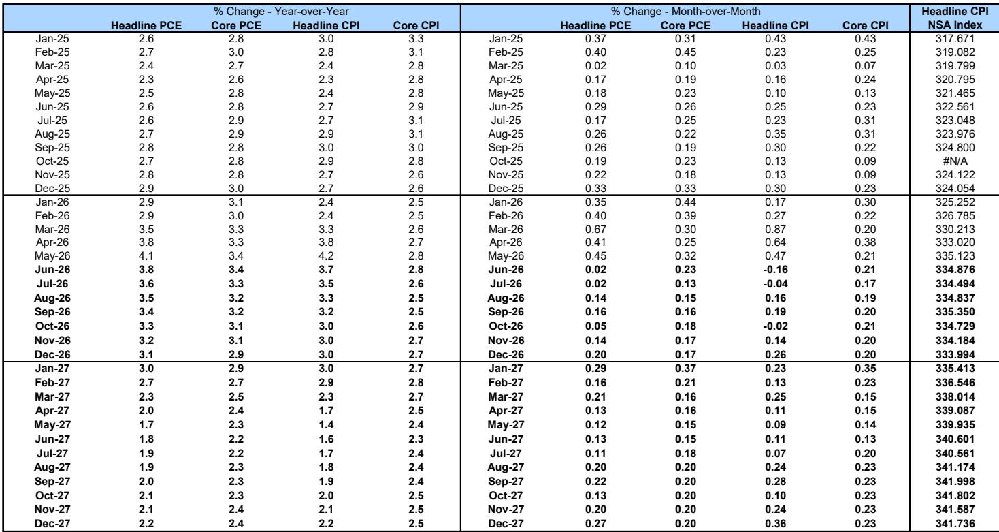
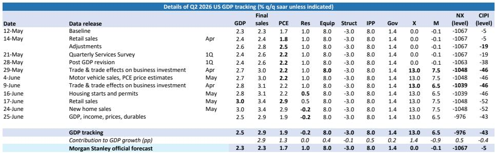

# 摩根斯坦利：MS：美联储今年加息的“数据路线图”已经画好

这份报告最值得看的判断，并非美联储今年加不加息，而是MS首席美国经济学家Michael Gapen团队为“加息”画出了一条清晰的数据触发路径。在多数市场参与者仍在争论通胀是否见顶时，这家华尔街顶级投行已经提前设定了“如果数据这样走，我们就改变观点”的具体条件。这不是一份预测报告，而是一份决策地图。

为什么现在重要？因为6月美联储会议后，有9位FOMC参与者提交了至少一次加息的预测，而市场对“暂停”的定价可能过度乐观。MS虽然维持“全年按兵不动”的基准判断，但坦承这一判断高度依赖几项正在快速变化的假设。换句话说，当前市场的平静，可能只是数据尚未触发警报。

报告的核心逻辑是：通胀和就业数据在未来三个月的走向，将决定美联储9月会议是“继续观望”还是“重新扣动扳机”。这份报告的价值不在于结论，而在于它给出了一个可验证、可跟踪的观察框架。

> **KC评论：** 这份报告最值得细读的不是结论，而是MS设定的“触发条件”。它就像一张地图，标出了哪些数据点位会让美联储从“按兵不动”转向“加息”。对于关注利率敏感资产的读者，理解这些条件比猜测加息概率更有用。完整报告中包含了每个触发条件的量化阈值和对应的资产价格影响测算。

## 1. 通胀的“0.2%分水岭”决定了美联储的耐心能持续多久

MS的核心通胀预测比FOMC中位数更为乐观。他们预计核心PCE和核心CPI的月度环比增速将维持在0.2%或以下。这一判断建立在三个关键假设上：关税传导效应正在结束、美伊谅解备忘录推动油价回落、以及住房通胀将继续放缓。

但如果月度核心通胀持续保持在0.3%或更高，MS就会改变看法。0.3%这个数字不是随意设定的——它对应的是FOMC参与者预测中隐含的月度跑速。报告指出，如果核心商品通胀因关税传导延长或能源价格二阶效应而维持在0.2%附近，那么月度核心通胀就会落在0.3%左右。

这意味着，未来三次CPI和PCE数据（6-8月）将是决定性的。如果数据显示通胀回落速度慢于MS的乐观预期，美联储的加息概率将显著上升。

## 2. 油价是最大的不确定性变量，美伊谅解备忘录的脆弱性被低估

报告对油价的判断值得特别关注。MS认为，FOMC参与者的通胀预测可能“高估了通胀压力”，一个重要原因就是这些预测是在美伊谅解备忘录生效前形成的。6月FOMC会议后油价大幅回落，但这份报告明确指出，石油期货价格显示6月和7月能源价格将出现“大幅回调”——PCE中的能源价格预计分别下降5.0%和2.6%。

但报告同时给出了反向情景：如果美伊谅解备忘录未能维持，冲突重新关闭海峡，那么MS对6月和7月CPI环比负增长（-0.16%和-0.04%）以及PCE近乎持平的预测将无法实现。届时，他们设定的“油价风险溢价情景”概率将上升，即整体通胀保持坚挺，且二阶效应对核心通胀产生影响。

> **KC评论：** 很多投资者关注的是“油价涨不涨”，但这份报告提醒我们更关键的问题是“油价会不会跌到让美联储安心的程度”。MS对油价回落的预测相当具体，但也在报告中坦承这一预测高度依赖地缘政治假设。完整报告中对不同油价情景下的通胀路径做了详细测算，这是普通市场分析中很难看到的深度。

## 3. 就业市场的“4.0%红线”比通胀数字更值得警惕

虽然通胀是市场关注的焦点，但MS在就业市场设定的触发条件可能更具警示意义。报告指出，如果失业率跌破4.0%，美联储可能认为劳动力市场过热风险足以支撑加息。

这一判断的背景是：FOMC参与者对长期中性失业率的估计中位数为4.2%。MS预计夏季月均新增就业将放缓至5-6万人，使失业率保持稳定。但如果就业增长超出预期，推动失业率降至4.0%以下，美联储可能认为当前政策立场“不够限制性”。

值得注意的是，报告提到过去三个月的月均新增就业为18.8万人，远高于MS对夏季的预测。这意味着就业数据需要显著放缓才能符合他们的基准情景。如果就业数据保持强劲，美联储加息的概率将快速上升。

## 4. 消费数据正在“意外走软”，这可能是美联储最想要的信号

报告中最新的数据更新显示，MS已将二季度GDP跟踪预测从3.0%下调至2.5%，主要原因是一季度消费数据被大幅下修。一季度消费增速从1.4%被砍至0.5%，二季度消费跟踪也从2.9%降至1.9%。

报告坦承，上半年消费增速仅为1.2%，这个数字“令人意外”——不是意外的强劲，而是意外的疲软。季节性残留效应和更高关税似乎对消费产生了压制。更关键的是，二季度服务消费的估计目前基于非常有限的输入数据，季度服务调查数据要等到一个半月后才能获得，这意味着当前的服务消费估计“高度主观”。

对于美联储来说，消费走软可能是他们最希望看到的信号——它意味着经济正在自然降温，不需要政策进一步收紧。但如果消费数据在未来几个月出现反弹，美联储的加息理由将更加充分。

> **KC评论：** 消费数据的下修是一个重要信号，但报告也提醒我们这些数据可能被后续修正。MS在报告中详细展示了他们如何通过零售销售、贸易数据等高频指标逐周调整GDP跟踪预测，这种动态跟踪框架对于理解经济数据的“信号与噪音”非常有价值。完整报告中包含了完整的跟踪表格和每个数据发布对预测的影响分解。

## 5. 报告尚未完全回答的关键问题：美联储的“风险管理”逻辑可能让数据变得不重要

这是报告中最值得深思的一个判断。MS指出，对于某些FOMC参与者来说，数据可能不是决定性因素。一年前，美联储认为政策立场“不合适”，因为就业下行风险超过通胀上行风险。现在，一些参与者可能认为风险分布已经足够偏向通胀上行，以至于仅凭主观判断就足以支持加息，而不需要等待数据确认。

这意味着，即使通胀和就业数据都符合MS的基准预测，部分FOMC参与者仍可能投票支持加息。报告提到，9个加息预测点中多数来自可能没有投票权的地区联储主席，但这一判断本身存在不确定性——如果这些非投票者的观点反映了委员会内部更广泛的情绪变化，那么即使数据不走坏，加息风险也不能被完全排除。

## 6. 一个更值得关注的框架：金融条件的“自我实现”效应

报告最后一部分讨论了金融条件指数，这是一个常常被市场忽视但极其重要的指标。MS使用FRB/US模型构建的金融条件指数显示，自中东冲突爆发以来，金融条件收紧的幅度相当于联邦基金利率上调约40个基点。

这一收紧主要来自美元贬值和10年期美债收益率上升，而股市上涨部分抵消了收紧效果。6月FOMC会议后，金融条件进一步收紧约22个基点，主要受美元贬值和股市走弱驱动。

这个框架的意义在于：金融条件的收紧本身就在发挥类似加息的效果。如果金融条件进一步收紧，美联储可能不需要实际加息就能达到紧缩目的。反之，如果金融条件因为市场对“暂停加息”的乐观预期而放松，美联储可能被迫用实际加息来抵消这种放松。

---

以上是这份MS研报的核心洞察。但报告的价值远不止于此——它包含了完整的油价追踪框架、关税退税高频监测、以及详细的GDP跟踪模型。这些工具对于理解美国经济当前的真实状态至关重要。我们每天会由AI agent加人工review生成国际投行中文摘要与KC评论，daily更新约10-40页，并整理当天最新数据图表合集，方便喂给AI，也方便人工快速把握market dynamics。欢迎来星球微信群里继续讨论。

Personal reading notes and learning share only. Not investment advice.

