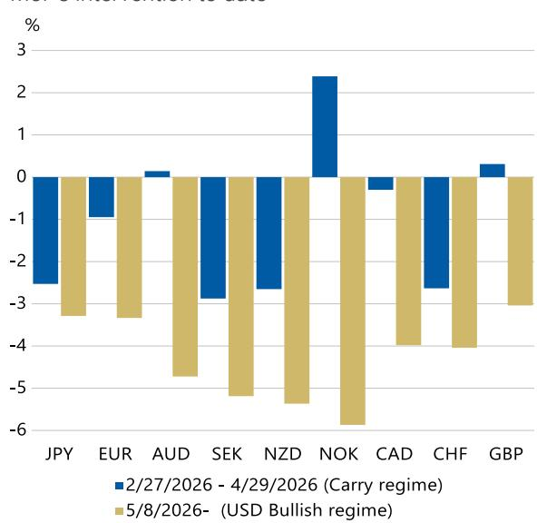
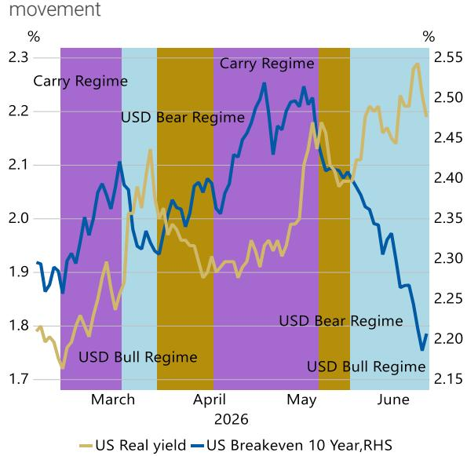
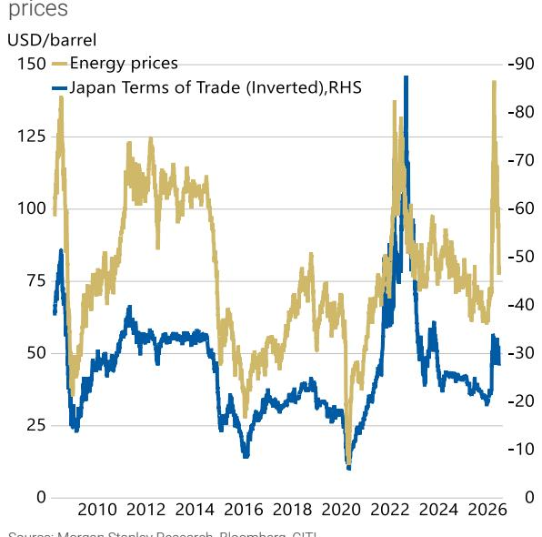
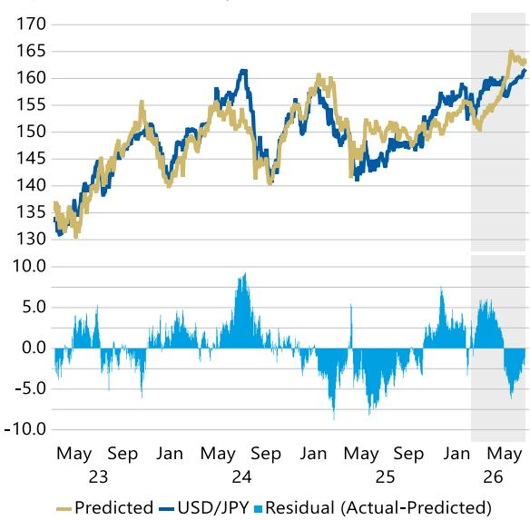
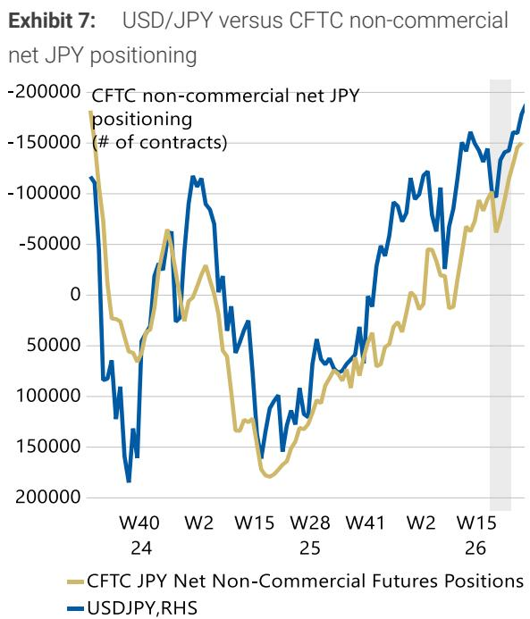
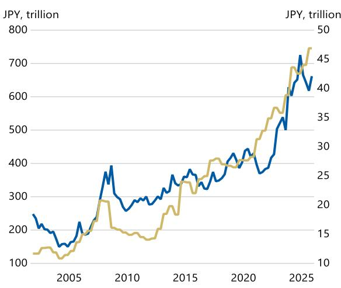

# Waiting for a Dip-Buying Opportunity

USD/JPY is again approaching the July 2024 high, but the rally has been driven more by broad USD strength rather than broad JPY weakness, suggesting that MoF's intervention may not be imminent. We see USD/JPY as close to fair value. We remain neutral on USD/JPY and await a clearer entry point for dip-buying.

## Key Takeaways

The USD/JPY rally has shifted from yen weakness to broad USD strength. This distinction matters for intervention risk, as authorities are typically more sensitive to speculative yen selling than to generalized USD appreciation.

Intervention risk has increased, but imminent action does not yet appear likely. The MoF has stepped up verbal warnings, but has not yet characterized recent FX moves as clearly “speculative.”

USD/JPY looks close to fair value on our three-factor framework. The key inputs remain US terminal-rate pricing, global risk sentiment, and Japan's terms of trade.

■ Lower oil prices and weak global risk sentiment are supportive for the yen outside USD crosses.

We remain neutral on JPY given the concern for the potential intervention and await a clearer dip-buying opportunity.

Koichi Sugisaki
Strategist
Koichi.Sugisaki@morganstanleymufg.com +81 3 6836-8428

MS & CO. INTERNATIONAL PLC+

David S. Adams, CFA
Strategist
David.S.Adams@morganstanley.com +44 20 7425-3518

MS & CO. LLC

Andrew M Watrous
Strategist
Andrew.Watrous@morganstanley.com +1 212 761-5287

Molly Nickolin
Strategist
Molly.Nickolin@morganstanley.com +1 212 761-3592

MS MUFG SECURITIES CO., LTD.+

Hiromu Uezato
Strategist
Hiromu.Uezato@morganstanleymufg.com +81 3 6836-8431

## Currency & Foreign Exchange

## Japan | Waiting for a dip-buying opportunity

MS MUFG SECURITIES CO., LTD.

Koichi Sugisaki
Koichi.Sugisaki@morganstanleymufg.com +81 3 6836-8428

MS & CO. INTERNATIONAL PLC

David S. Adams, CFA
David.S.Adams@morganstanley.com +44 20 7425-3518

MS & CO. LLC

Andrew.Watrous@morganstanley.com +1 212 761-5287

Molly Nickolin
molly.nickolin@morganstanley.com +1 212 761-3592

MS MUFG SECURITIES CO., LTD.

Hiromu Uezato
hiromu.uezato@morganstanleymufg.com
+81 3 6836-8431

## Still range-bound market

Following the MoF's FX intervention from late April to early May, USD/JPY briefly declined to the 155 area. Since then, however, the pair has gradually retraced the decline and is now approaching the 161.95 high reached on July 3, 2024.

That said, the dynamics behind USD/JPY appear to have shifted. From late February, when Middle East tensions began to intensify, until the MoF intervention, the USD/JPY rally was driven mainly by yen weakness. Post-intervention, the rally has instead been led more by broad USD strength (see Exhibit 1).

As shown in "What could change the weaker JPY trend?", the period into May was largely characterized by what our USD framework defines as a "Carry Regime", in which US real rates and breakevens rise simultaneously (see Exhibit 2).

Even after the temporary ceasefire in early April, inflation concerns remained elevated amid ongoing disruption to the Strait of Hormuz. At the same time, US economic data continued to look resilient despite Middle East tensions, while financial conditions stayed supportive.

Since mid-May, the regime appears to have broadly shifted to a "USD Bullish Regime", where US real rates rise, but breakeven fall. As the Middle East situation moved toward an agreement, oil prices declined and inflation concerns eased. At the same time, a more hawkish FOMC stance and weakness in AI-related equities weighed on risk sentiment.

Exhibit 1: G10 FX spot performance: From Middle East tension to MoF's intervention versus after MoF's intervention to date  
  
Source: MS, Bloomberg

Exhibit 2: US breakeven versus real yield  
  
Source: MS, Bloomberg

In the former regime, JPY tends to underperform the most, given its role as a funding currency. In the latter regime, JPY tends to underperform USD but is more likely to outperform risk-sensitive currencies (see Prepare for the Defense Regime). Recent JPY performance has broadly been consistent with this regime framework.

As discussed in "What could change the weaker JPY trend?", recent USD/JPY moves can be largely explained by three factors: 1) market pricing of the US terminal rate; 2) global risk sentiment, as proxied by the relative performance of equities and bonds; and 3) Japan's terms of trade.

At the current juncture, the US and Iran have agreed on a memorandum of understanding toward a long-term ceasefire, and the Strait of Hormuz appears to be moving toward reopening, albeit potentially on a time-limited basis. The resulting decline in oil prices has supported an improvement in Japan's terms of trade (see Exhibit 3).

As our economists have also noted, moreover, compared with 2022, the pass-through of AI-related component export prices has been smoother. As a result, Japan's terms of trade have not deteriorated as much as they did during the previous commodity shock.

We think these factors help explain why the JPY has recently shown relatively resilient performance against currencies other than the USD.

That said, following the hawkish FOMC outcome, markets have started to price not only a Fed hold but even the possibility of renewed rate hikes. Against this backdrop, the current level of USD/JPY looks close to the fair value implied by these three factors (see Exhibit 4).

Exhibit 3: Japan's terms of trade versus energy prices  
  
Source: MS, Bloomberg, CITI

Exhibit 4: USD/JPY versus its fair value (US terminal rate pricing, global risk sentiment, and Japan's terms of trade)  
  
Source: MS, Bloomberg Note: \*Global Risk Demand Index is a proprietary index of risk appetite. US Pat. No. 7,617,143.

As discussed below, the MoF has strengthened its verbal warnings in response to the recent USD/JPY rally. In particular, as Japan's MoF emphasizes policy coordination with the US, the risk of coordinated intervention is likely to remain in investors' minds. This may limit the extent to which USD/JPY can move materially above fair value, in our view.

At the same time, we do not expect a large downward revision to USD/JPY fair value either. For fair value to move materially lower, two conditions would likely need to occur simultaneously: 1) markets would need to price aggressive Fed cuts; and 2) global risk sentiment would need to deteriorate significantly, with bonds sharply outperforming equities.

Such a combination would be consistent with the "Defense Regime" in our USD framework, characterized by simultaneous declines in US real rates and breakevens. More generally, it is a regime in which a sharp slowdown in US demand brings disinflation into focus and leads markets to price substantial Fed easing.

At present, US growth and labor-market data remain resilient. Middle East tensions are also easing following the US-Iran MOU aimed at a long-term ceasefire. Our US economists expect the decline in oil-price risk and the lower probability of a near-term energy-driven inflation shock to limit second-round effects and support real income.

In this environment, a near-term US recession appears unlikely. A more plausible downside scenario would involve emerging profitability concerns around the AI sector, leading to a sharp slowdown in AI-related capex – an important driver of growth – and exerting downward pressure on risk markets.

For these reasons, we maintain a neutral stance on USD/JPY and await a clearer dip-buying opportunity, particularly in the event of a potential MoF intervention.

## Possibility of FX intervention

As noted above, USD/JPY has moved closer to the 161.95 high reached in 2024, and investor questions about another round of FX intervention have started to increase again.

From the perspective of the FX level alone, intervention at any time would not be surprising. However, based on recent comments from senior MoF officials, actual intervention still appears some distance away.

Finance Minister Katayama has stated that the authorities stand ready to take decisive action at any time if necessary. However, recent remarks have not included language that clearly defines current FX moves as “speculative.”

Historically, FX intervention has tended to be implemented after authorities confirm that positions are significantly skewed in one direction and deemed speculative, in order to maximize the effect of intervention (see Exhibit 5 and Exhibit 6).

Exhibit 5: History of recent FX intervention

<table><tr><td>Period</td><td>Actual Intervention</td><td>Messages from officials immediately before the intervention</td></tr><tr><td>March 17–18, 2011</td><td>Yen-selling intervention through G7 coordination in response to the yen&#x27;s sharp appreciation after the Great East Japan Earthquake.</td><td rowspan="3">The G7 statement explicitly stated that, in response to movements in the yen exchange rate associated with the events in Japan, coordinated intervention would be conducted on March 18 at Japan&#x27;s request. It also stated that &quot;excess volatility and disorderly movements in exchange rates have adverse implications for economic and financial stability.&quot;After the yen hit a record high against the dollar, Finance Minister Azumi said he would take &quot;decisive action&quot; againstspeculative moves. On October 24, he also said that the authorities would respond decisively to excessive and speculative FX moves, and that the yen&#x27;s strength did not reflect fundamentals.On September 14, it was reported that the authorities conducted a rate check in response to the yen&#x27;s depreciation. Finance Minister Suzuki described recent moves as &quot;rapid and one-sided,&quot;including speculative activity, and stated that authorities would respond &quot;without ruling out any options&quot; if such moves continued.</td></tr><tr><td>31 October 2011</td><td>Yen-selling intervention</td></tr><tr><td>September 14–22, 2022</td><td>Yen-buying intervention (JPY 2.8382 trillion)</td></tr><tr><td>October 20–24, 2022</td><td>Yen-buying intervention JPY 5.6202 trillion on October 21, and JPY 729.6 billion on October 24.</td><td>On October 20, after the yen broke through 150 against the dollar, Vice Finance Minister for International Affairs Kanda stated that excessive volatility was becoming increasingly unacceptable and that authorities stood ready to act. Finance Minister Suzuki also describedspeculative-drivenmovesas &quot;unacceptable&quot; and reiterated that authorities would take &quot;decisive action&quot; if necessary.</td></tr></table>

Source: Japan MoF, Various Media article, MS

Exhibit 6: History of recent FX intervention

<table><tr><td>Period</td><td>Actual Intervention</td><td>Messages from officials immediately before the intervention</td></tr><tr><td>March 27-April 29, 2024</td><td>Yen-buying intervention JPY 5.9185 trillion on April 29, and JPY 3.87 trillion on May 1st.</td><td>Immediately before the April 29, 2024 intervention, Kanda described market moves as “speculative, rapid, and abnormal,” and stated that they could not be overlooked.</td></tr><tr><td>Late June-July 12, 2024</td><td>Yen-buying intervention JPY 3.1678 trillion on July 11, and JPY 2.367 trillion on July 12.</td><td>On June 26, Vice Finance Minister Kanda said that he was “seriously concerned” about the yen’s sharp decline and was monitoring developments with a “high sense of urgency.” On July 12, he reiterated that the authorities would act in the FX market as needed, while Chief Cabinet Secretary Hayashi also stated that the government was prepared to take “all possible measures” on FX.</td></tr><tr><td>Around April 30, 2026</td><td>Total intervention amounted to JPY 11.7349 trillion between April 28 and May 27</td><td>On April 30, Finance Minister Katayama said that the time for “decisive action” was approaching. Vice Finance Minister for International Affairs Mimura reportedly described the message to speculators as a “final warning to get out.”</td></tr></table>

Source: Japan MoF, Various Media article, MS

CFTC data suggest that speculative JPY short positions have continued to build after the previous intervention (see Exhibit 7). In the spot market, overseas non-residents also appear to maintain strong demand for yen funding through FX swaps and related channels (see Exhibit 8).

Even so, since the late-April intervention, the rise in USD/JPY has been driven mainly by broad USD strength (see Exhibit 1). The JPY has, in fact, outperformed other G10 currencies excluding the USD. This price action may indicate that the authorities are not yet fully convinced that speculative JPY shorts have become excessive.

If USD/JPY were to rise sharply from here on the back of renewed JPY weakness, we think the MoF may be more likely to characterize the move as “speculative.” In that case, the likelihood of FX intervention could rise.

  
Source: CFTC, MS

Exhibit 8: Funding needs for JPY via offshore non-bank financial sectors  
  
- Fx swap/forward notional amount (JPY, with non-Bank sector)
- JPY loan to overseas non-Bank sector,RHS  
Source: BIS, MS

Important note regarding economic sanctions. This report references jurisdictions which may be the subject of economic sanctions. Readers are solely responsible for ensuring that their investment activities are carried out in compliance with applicable laws.

## Global Macro Strategy Team

<table><tr><td>MS &amp; CO. LLC</td><td>Matthew Hornbach, CMT Matthew.Hornbach@morganstanley.com</td><td>Global Head of Macro Strategy</td><td>+1 212 761-1837</td></tr><tr><td></td><td>Martin Tobias, CFA, CMT</td><td>US Rates Strategist</td><td>+1 212 761-6076</td></tr><tr><td></td><td>Shaun Zhou</td><td>US Rates Strategist</td><td>+1 212 761-3348</td></tr><tr><td></td><td>Aryaman Singh</td><td>US Rates Strategist</td><td>+1 212 761-1993</td></tr><tr><td></td><td>Eli Carter</td><td>US Rates Strategist</td><td>+1 212 761-4703</td></tr><tr><td>MS &amp; CO. LLC</td><td>Andrew Watrous</td><td>G10 FX Strategist</td><td>+1 212 761-5287</td></tr><tr><td></td><td>Molly Nickolin</td><td>G10 FX Strategist</td><td>+1 212 761-3592</td></tr><tr><td></td><td>Simon Waever Simon.Waever@morganstanley.com</td><td>Head of EM Sovereign Credit and Latin America Fixed Income Strategy</td><td>+1 212 296-8101</td></tr><tr><td></td><td>Ioana Zamfir</td><td>Latin America Macro Strategist</td><td>+1 212 761-4012</td></tr><tr><td></td><td>Emma Cerda</td><td>Latin America Sovereign Credit</td><td>+1 212 761-2344</td></tr><tr><td></td><td>Sofia Palacios</td><td>Latin America Sovereign Credit</td><td>+1 212 761-0428</td></tr><tr><td>MS &amp; CO. INTERNATIONAL PLC</td><td>James K. Lord James.Lord@morganstanley.com</td><td>Global Head of FXEM Strategy</td><td>+44 20 7677-3254</td></tr><tr><td></td><td>Gianluca Salford Luca.Salford@morganstanley.com</td><td>Head of European Rates Strategy</td><td>+44 20 7677-1337</td></tr><tr><td></td><td>Fabio Bassanin, CFA</td><td>UK Rates Strategist</td><td>+44 20 7425-1869</td></tr><tr><td></td><td>Maria Chiara Russo</td><td>Euro Area Rates Strategist</td><td>+44 20 7677-3499</td></tr><tr><td></td><td>David S. Adams, CFA David.S.Adams@morganstanley.com</td><td>Head of G10 FX Strategy</td><td>+44 20 7425-3518</td></tr><tr><td></td><td>Neville Mandimika</td><td>CEEMEA Sovereign Credit Strategist</td><td>+44 20 7425-2509</td></tr><tr><td></td><td>Arnav Gupta</td><td>CEEMEA Rates Strategist</td><td>+44 20 7677-0382</td></tr><tr><td>MS ASIA LIMITED+</td><td>Gek Teng Khoo</td><td>AXJ Macro Strategist</td><td>+852 3963-0303</td></tr><tr><td>MS INDIA COMPANY PRIVATE LIMITED</td><td>Nimish Prabhune</td><td>AXJ Macro Strategist</td><td>+91 22 6996-1862</td></tr><tr><td>MS MUFG SECURITIES CO., LTD.</td><td>Koichi Sugisaki Koichi.Sugisaki@morganstanleymufg.com</td><td>Head of Japan Macro Strategy</td><td>+81 3 6836-8428</td></tr><tr><td></td><td>Hiromu Uezato</td><td>Japan Macro Strategist</td><td>+81 3 6836-8431</td></tr></table>

## Disclosure Section

The information and opinions in MS were prepared by MS MUFG Securities Co., Ltd. and its affiliates (collectively, "MS").

For important disclosures, stock price charts and equity rating histories regarding companies that are the subject of this report, please see the MS Disclosure Website at www.morganstanley.com/eqr/disclosures/webapp/generalresearch, or contact your investment representative or MS at 1585 Broadway, (Attention: Research Management), New York, NY, 10036 USA.

For valuation methodology and risks associated with any recommendation, rating or price target referenced in this research report, please contact the Client Support Team as follows: US/Canada +1 800 303-2495; Hong Kong +852 2848-5999; Latin America +1 718 754-5444 (U.S.); London +44 (0)20-7425-8169; Singapore +65 6834-6860; Sydney +61 (0)2-9770-1505; Tokyo +81 (0)3-6836-9000. Alternatively you may contact your investment representative or MS at 1585 Broadway, (Attention: Research Management), New York, NY 10036 USA.

## Analyst Certification

The following analysts hereby certify that their views about the companies and their securities discussed in this report are accurately expressed and that they have not received and will not receive direct or indirect compensation in exchange for expressing specific recommendations or views in this report: David S. Adams, CFA; Molly Nickolin; Koichi Sugisaki; Hiromu Uezato; Andrew M Watrous.

## Global Research Conflict Management Policy

MS has been published in accordance with our conflict management policy, which is available at www.morganstanley.com/institutional/research/conflictpolicies. A Portuguese version of the policy can be found at www.morganstanley.com.br

## Important Regulatory Disclosures on Subject Companies

The equity research analysts or strategists principally responsible for the preparation of MS have received compensation based upon various factors, including quality of research, investor client feedback, stock picking, competitive factors, firm revenues and overall investment banking revenues. Equity Research analysts' or strategists' compensation is not linked to investment banking or capital markets transactions performed by MS or the profitability or revenues of particular trading desks.

MS and its affiliates do business that relates to companies/instruments covered in MS, including market making, providing liquidity, fund management, commercial banking, extension of credit, investment services and investment banking. MS sells to and buys from customers the securities/instruments of companies covered in MS on a principal basis. MS may have a position in the debt of the Company or instruments discussed in this report. MS trades or may trade as principal in the debt securities (or in related derivatives) that are the subject of the debt research report.
Certain disclosures listed above are also for compliance with applicable regulations in non-US jurisdictions.

## STOCK RATINGS

MS uses a relative rating system using terms such as Overweight, Equal-weight, Not-Rated or Underweight (see definitions below). MS does not assign ratings of Buy, Hold or Sell to the stocks we cover. Overweight, Equal-weight, Not-Rated and Underweight are not the equivalent of buy, hold and sell. Investors should carefully read the definitions of all ratings used in MS. In addition, since MS contains more complete information concerning the analyst's views, investors should carefully read MS, in its entirety, and not infer the contents from the rating alone. In any case, ratings (or research) should not be used or relied upon as investment advice. An investor's decision to buy or sell a stock should depend on individual circumstances (such as the investor's existing holdings) and other considerations.

## Global Stock Ratings Distribution

(as of May 31, 2026)

The Stock Ratings described below apply to MS's Fundamental Equity Research and do not apply to Debt Research produced by the Firm.

For disclosure purposes only (in accordance with FINRA requirements), we include the category headings of Buy, Hold, and Sell alongside our ratings of Overweight, Equal-weight, Not-Rated and Underweight. MS does not assign ratings of Buy, Hold or Sell to the stocks we cover. Overweight, Equal-weight, Not-Rated and Underweight are not the equivalent of buy, hold, and sell but represent recommended relative weightings (see definitions below). To satisfy regulatory requirements, we correspond Overweight, our most positive stock rating, with a buy recommendation; we correspond Equal-weight and Not-Rated to hold and Underweight to sell recommendations, respectively.

<table><tr><td></td><td colspan="2">Coverage Universe</td><td colspan="3">Investment Banking Clients (IBC)</td><td colspan="2">Other Material Investment ServicesClients (MISC)</td></tr><tr><td>Stock RatingCategory</td><td>Count</td><td>% of Total</td><td>Count</td><td>% of Total IBC</td><td>% of RatingCategory</td><td>Count</td><td>% of Total OtherMISC</td></tr><tr><td>Overweight/Buy</td><td>1542</td><td>42%</td><td>465</td><td>51%</td><td>30%</td><td>707</td><td>43%</td></tr><tr><td>Equal-weight/Hold</td><td>1571</td><td>43%</td><td>369</td><td>40%</td><td>23%</td><td>723</td><td>44%</td></tr><tr><td>Not-Rated/Hold</td><td>3</td><td>0%</td><td>0</td><td>0%</td><td>0%</td><td>1</td><td>0%</td></tr><tr><td>Underweight/Sell</td><td>551</td><td>15%</td><td>86</td><td>9%</td><td>16%</td><td>201</td><td>12%</td></tr><tr><td>Total</td><td>3,667</td><td></td><td>920</td><td></td><td></td><td>1632</td><td></td></tr></table>

Data include common stock and ADRs currently assigned ratings. Investment Banking Clients are companies from whom MS received investment banking compensation in the last 12 months. Due to rounding off of decimals, the percentages provided in the "% of total" column may not add up to exactly 100 percent.

## Analyst Stock Ratings

Overweight (O). The stock's total return is expected to exceed the average total return of the analyst's industry (or industry team's) coverage universe, on a risk-adjusted basis, over the next 12-18 months.

Equal-weight (E). The stock's total return is expected to be in line with the average total return of the analyst's industry (or industry team's) coverage universe, on a risk-adjusted basis, over the next 12-18 months.

Not-Rated (NR). Currently the analyst does not have adequate conviction about the stock's total return relative to the average total return of the analyst's industry (or industry team's) coverage universe, on a risk-adjusted basis, over the next 12-18 months.

Underweight (U). The stock's total return is expected to be below the average total return of the analyst's industry (or industry team's) coverage universe, on a risk-adjusted basis, over the next 12-18 months.

Unless otherwise specified, the time frame for price targets included in MS is 12 to 18 months.

## Analyst Industry Views

Attractive (A): The analyst expects the performance of his or her industry coverage universe over the next 12-18 months to be attractive vs. the relevant broad market benchmark, as indicated below.

In-Line (I): The analyst expects the performance of his or her industry coverage universe over the next 12-18 months to be in line with the relevant broad market benchmark, as indicated below. Cautious (C): The analyst views the performance of his or her industry coverage universe over the next 12-18 months with caution vs. the relevant broad market benchmark, as indicated below. Benchmarks for each region are as follows: North America - S&P 500; Latin America - relevant MSCI country index or MSCI Latin America Index; Europe - MSCI Europe; Japan - TOPIX; Asia - relevant MSCI country index or MSCI sub-regional index or MSCI AC Asia Pacific ex Japan Index.

## Important Disclosures for MS Smith Barney LLC Customers

Important disclosures regarding any material conflict of interest that can reasonably be expected to have influenced MS Smith Barney LLC's choice of a third-party research provider or the subject company of a third-party research report, are available on the MS Wealth Management disclosure website at www.morganstanley.com/online/researchdisclosures. For MS specific disclosures, you may refer to https://www.morganstanley.com/eqr/disclosures/webapp/generalresearch.

Each MS report is reviewed and approved on behalf of MS Smith Barney LLC. This review and approval is conducted by the same person who reviews the research report on behalf of MS. This could create a conflict of interest.

## Other Important Disclosures

MS policy is to update research reports as and when the Research Analyst and Research Management deem appropriate, based on developments with the issuer, the sector, or the market that may have a material impact on the research views or opinions stated therein. In addition, certain Research publications are intended to be updated on a regular periodic basis (weekly/monthly/quarterly/annual) and will ordinarily be updated with that frequency, unless the Research Analyst and Research Management determine that a different publication schedule is appropriate based on current conditions.

MS is not acting as a municipal advisor and the opinions or views contained herein are not intended to be, and do not constitute, advice within the meaning of Section 975 of the Dodd-Frank Wall Street Reform and Consumer Protection Act.

MS produces an equity research product called a "Tactical Idea." Views contained in a "Tactical Idea" on a particular stock may be contrary to the recommendations or views expressed in research on the same stock. This may be the result of differing time horizons, methodologies, market events, or other factors. For all research available on a particular stock, please contact your sales representative or go to Matrix at http://www.morganstanley.com/matrix.

MS is provided to our clients through our proprietary research portal on Matrix and also distributed electronically by MS to clients. Certain, but not all, MS products are also made available to clients through third-party vendors or redistributed to clients through alternate electronic means as a convenience. For access to all available MS, please contact your sales representative or go to Matrix at http://www.morganstanley.com/matrix.

Any access and/or use of MS is subject to MS's Terms of Use (http://www.morganstanley.com/terms.html). By accessing and/or using MS, you are indicating that you have read and agree to be bound by our Terms of Use (http://www.morganstanley.com/terms.html). In addition you consent to MS processing your personal data and using cookies in accordance with our Privacy Policy and our Global Cookies Policy (http://www.morganstanley.com/privacy\_pledge.html), including for the purposes of setting your preferences and to collect readership data so that we can deliver better and more personalized service and products to you. To find out more information about how MS processes personal data, how we use cookies and how to reject cookies see our Privacy Policy and our Global Cookies Policy (http://www.morganstanley.com/privacy\_pledge.html). Please use the provided link to review the Terms and Conditions and Most Important Terms and Conditions for MS India Company Private Limited (https://www.morganstanley.com/assets/pdfs/about-us-global-offices/india/Terms\_and\_conditions.pdf) and the following link to review the audit report (https://ny.matrix.ms.com/eqr/research/webapp/researchdocs/MSICPL\_Morgan\_Stanley\_Research\_Audit\_Report.pdf).

If you do not agree to our Terms of Use and/or if you do not wish to provide your consent to MS processing your personal data or using cookies please do not access our research. MS does not provide individually tailored investment advice. MS has been prepared without regard to the circumstances and objectives of those who receive it. MS recommends that investors independently evaluate particular investments and strategies, and encourages investors to seek the advice of a financial adviser. The appropriateness of an investment or strategy will depend on an investor's circumstances and objectives. The securities, instruments, or strategies discussed in MS may not be suitable for all investors, and certain investors may not be eligible to purchase or participate in some or all of them. MS is not an offer to buy or sell or the solicitation of an offer to buy or sell any security/instrument or to participate in any particular trading strategy. The value of and income from your investments may vary because of changes in interest rates, foreign exchange rates, default rates, prepayment rates, securities/instruments prices, market indexes, operational or financial conditions of companies or other factors. There may be time limitations on the exercise of options or other rights in securities/instruments transactions. Past performance is not necessarily a guide to future performance. Estimates of future performance are based on assumptions that may not be realized. If provided, and unless otherwise stated, the closing price on the cover page is that of the primary exchange for the subject company's securities/instruments.

The fixed income research analysts, strategists or economists principally responsible for the preparation of MS have received compensation based upon various factors, including quality, accuracy and value of research, firm profitability or revenues (which include fixed income trading and capital markets profitability or revenues), client feedback and competitive factors. Fixed Income Research analysts', strategists' or economists' compensation is not linked to investment banking or capital markets transactions performed by MS or the profitability or revenues of particular trading desks.

The "Important Regulatory Disclosures on Subject Companies" section in MS lists all companies mentioned where MS owns 1% or more of a class of common equity securities of the companies. For all other companies mentioned in MS, MS may have an investment of less than 1% in securities/instruments or derivatives of securities/instruments of companies and may trade them in ways different from those discussed in MS. Employees of MS not involved in the preparation of MS may have investments in securities/instruments or derivatives of securities/instruments of companies mentioned and may trade them in ways different from those discussed in MS. Derivatives may be issued by MS or associated persons.

With the exception of information regarding MS, MS is based on public information. MS makes every effort to use reliable, comprehensive information, but we make no representation that it is accurate or complete. We have no obligation to tell you when opinions or information in MS change apart from when we intend to discontinue equity research coverage of a subject company. Facts and views presented in MS have not been reviewed by, and may not reflect information known to, professionals in other MS business areas, including investment banking personnel.

MS personnel may participate in company events such as site visits and are generally prohibited from accepting payment by the company of associated expenses unless pre-approved by authorized members of Research management.

MS may make investment decisions that are inconsistent with the recommendations or views in this report.

To our readers based in Taiwan or trading in Taiwan securities/instruments: Information on securities/instruments that trade in Taiwan is distributed by MS Taiwan Limited ("MSTL"). Such information is for your reference only. The reader should independently evaluate the investment risks and is solely responsible for their investment decisions. MS may not be distributed to the public media or quoted or used by the public media without the express written consent of MS. Any non-customer reader within the scope of Article 7-1 of the Taiwan Stock Exchange Recommendation Regulations accessing and/or receiving MS is not permitted to provide MS to any third party (including but not limited to related parties, affiliated companies and any other third parties) or engage in any activities regarding MS which may create or give the appearance of creating a conflict of interest. Information on securities/instruments that do not trade in Taiwan is for informational purposes only and is not to be construed as a recommendation or a solicitation to trade in such securities/instruments. MSTL may not execute transactions for clients in these securities/instruments.

MS is not incorporated under PRC law and the research in relation to this report is conducted outside the PRC. MS does not constitute an offer to sell or the solicitation of an offer to buy any securities in the PRC. PRC investors shall have the relevant qualifications to invest in such securities and shall be responsible for obtaining all relevant approvals, licenses, verifications and/or registrations from the relevant governmental authorities themselves. Neither this report nor any part of it is intended as, or shall constitute, provision of any consultancy or advisory service of securities investment as defined under PRC law. Such information is provided for your reference only.

MS is disseminated in Brazil by MS C.T.V.M. S.A. located at Av. Brigadeiro Faria Lima, 3600, 6th floor, São Paulo - SP, Brazil; and is regulated by the Comissão de Valores Mobiliários; in Mexico by MS México, Casa de Bolsa, S.A. de C.V which is regulated by Comision Nacional Bancaria y de Valores. Paseo de los Tamarindos 90, Torre 1, Col. Bosques de las Lomas Floor 29, 05120 Mexico City; in Japan by MS MUFG Securities Co., Ltd. and, for Commodities related research reports only, MS Capital Group Japan Co., Ltd; in Hong Kong by MS Asia Limited (which accepts responsibility for its contents) and by MS Bank Asia Limited; in Singapore by MS Asia (Singapore) Pte. (Registration number 199206298Z) and/or MS Asia (Singapore) Securities Pte Ltd (Registration number 200008434H), regulated by the Monetary Authority of Singapore (which accepts legal responsibility for its contents and should be contacted with respect to any matters arising from, or in connection with, MS) and by MS Bank Asia Limited, Singapore Branch (Registration number T14FC0118); in Australia to "wholesale clients" within the meaning of the Australian Corporations Act by MS Australia Limited A.B.N. 67 003 734 576, holder of Australian financial services license No. 233742, which accepts responsibility for its contents; in Australia to "wholesale clients" and "retail clients" within the meaning of the Australian Corporations Act by MS Wealth Management Australia Pty Ltd (A.B.N. 19 009 145 555, holder of Australian financial services license No. 240813, which accepts responsibility for its contents; in Korea by MS & Co International plc, Seoul Branch; in India by MS India Company Private Limited having Corporate Identification No (CIN) U22990MH1998PTC115305, regulated by the Securities and Exchange Board of India ("SEBI") and holder of licenses as a Research Analyst (SEBI Registration No. INH000001105); Stock Broker (SEBI Stock Broker Registration No. INZ000244438), Merchant Banker (SEBI Registration No. INM000011203), and depository participant with National Securities Depository Limited (SEBI Registration No. IN-DP-NSDL-567-2021) having registered office at Altimus, Level 39 & 40, Pandurang Budhkar Marg, Worli, Mumbai 400018, India; Telephone no. +91-22-61181000; Compliance Officer Details: Mr. Tejarshi Hardas, Tel. No.: +91-22-61181000 or Email: tejarshi.hardas@morganstanley.com; Grievance officer details: Mr. Tejarshi Hardas, Tel. No.: +91-22-61181000 or Email: msic-compliance@morganstanley.com. MS India Company Private Limited (MSICPL) may use AI tools in providing research services. All recommendations contained herein are made by the duly qualified research analysts; in Canada by MS Canada Limited; in Germany and the European Economic Area where required by MS Europe S.E., authorised and regulated by Bundesanstalt fuer Finanzdienstleistungsaufsicht (BaFin) under the reference number 149169; in the US by MS & Co. LLC, which accepts responsibility for its contents. MS & Co. International plc, authorized by the Prudential Regulation Authority and regulated by the Financial Conduct Authority and the Prudential Regulation Authority, disseminates in the UK research that it has prepared, and research which has been prepared by any of its affiliates, only to persons who (i) are investment professionals falling within Article 19(5) of the Financial Services and Markets Act 2000 (Financial Promotion) Order 2005 (as amended, the "Order"); (ii) are persons who are high net worth entities falling within Article 49(2)(a) to (d) of the Order; or (iii) are persons to whom an invitation or inducement to engage in investment activity (within the meaning of section 21 of the Financial Services and Markets Act 2000, as amended) may otherwise lawfully be communicated or caused to be communicated. RMB MS Proprietary Limited is a member of the JSE Limited and A2X (Pty) Ltd. RMB MS Proprietary Limited is a joint venture owned equally by MS International Holdings Inc. and RMB Investment Advisory (Proprietary) Limited, which is wholly owned by FirstRand Limited. The information in MS is being disseminated by MS Saudi Arabia, regulated by the Capital Market Authority in the Kingdom of Saudi Arabia, and is directed at Sophisticated investors only.

The information in MS is being communicated by MS & Co. International plc (DIFC Branch), regulated by the Dubai Financial Services Authority (the DFSA) or by MS & Co. International plc (ADGM Branch), regulated by the Financial Services Regulatory Authority Abu Dhabi (the FSRA), and is directed at Professional Clients only, as defined by the DFSA or the FSRA, respectively. The financial products or financial services to which this research relates will only be made available to a customer who we are satisfied meets the regulatory criteria of a Professional Client. A distribution of the different MS Research ratings or recommendations, in percentage terms for Investments in each sector covered, is available upon request from your sales representative.

The information in MS is being communicated by MS & Co. International plc (QFC Branch), regulated by the Qatar Financial Centre Regulatory Authority (the QFCRA), and is directed at business customers and market counterparties only and is not intended for Retail Customers as defined by the QFCRA.

As required by the Capital Markets Board of Turkey, investment information, comments and recommendations stated here, are not within the scope of investment advisory activity. Investment advisory service is provided exclusively to persons based on their risk and income preferences by the authorized firms. Comments and recommendations stated here are general in nature. These opinions may not fit to your financial status, risk and return preferences. For this reason, to make an investment decision by relying solely to this information stated here may not bring about outcomes that fit your expectations.

The trademarks and service marks contained in MS are the property of their respective owners. Third-party data providers make no warranties or representations relating to the accuracy, completeness, or timeliness of the data they provide and shall not have liability for any damages relating to such data. The Global Industry Classification Standard (GICS) was developed by and is the exclusive property of MSCI and S&P.

MS, or any portion thereof may not be reprinted, sold or redistributed without the written consent of MS.

Indicators and trackers referenced in MS may not be used as, or treated as, a benchmark under Regulation EU 2016/1011, or any other similar framework.

The issuers and/or fixed income products recommended or discussed in certain fixed income research reports may not be continuously followed. Accordingly, investors should regard those fixed income research reports as providing stand-alone analysis and should not expect continuing analysis or additional reports relating to such issuers and/or individual fixed income products. MS may hold, from time to time, material financial and commercial interests regarding the company subject to the Research report.

Registration granted by SEBI and certification from the National Institute of Securities Markets (NISM) in no way guarantee performance of the intermediary or provide any assurance of returns to investors. Investment in securities market are subject to market risks. Read all the related documents carefully before investing.
The following authors are Fixed Income Research Analysts/Strategists and are not opining on or expressing recommendations on equity securities: Molly Nickolin; David S. Adams, CFA; Andrew M Watrous; Koichi Sugisaki; Hiromu Uezato.

© 2026 MS