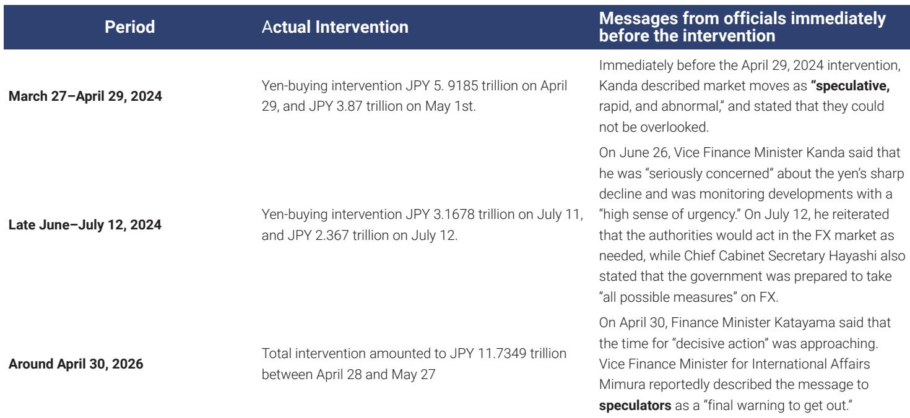

# The Yen Is Not the Problem: Why the Next USD/JPY Trade Demands Patience, Not Conviction

The most important question for any currency strategist today is not whether USD/JPY will break its July 2024 high. It is whether the market is correctly interpreting what is driving the pair. The answer, according to a detailed analysis by a global investment bank's FX strategy team, is that the rally has fundamentally changed character. It is no longer a story of yen weakness. It is now a story of broad dollar strength. This distinction is not academic. It determines everything about intervention risk, fair value, and the right entry point for positioning.

For much of 2024, the narrative was straightforward: the yen was the weakest link in the G10 complex, a funding currency under relentless pressure from carry trades and structural capital outflows. That story has shifted. Since mid-May, the dynamics have reversed. The yen has actually outperformed most other G10 currencies against the dollar. The problem for USD/JPY longs is that the dollar itself has become the dominant driver, rising on hawkish Federal Reserve repricing and deteriorating global risk sentiment. This means that anyone waiting for a repeat of the April-May intervention playbook may be waiting for a trade that no longer fits the current regime.

The implication is uncomfortable for those who want a clear directional bet. The pair is now close to fair value, and the factors that could push it significantly lower are not yet in place. The strategic conclusion is not to chase the move, but to wait for a genuine dip-buying opportunity. That opportunity is most likely to emerge from a catalyst that the market is currently underestimating: a shift in the intervention calculus that would require the yen, not the dollar, to become the problem again.

## The Rally Has Changed Regimes, and That Rewrites the Intervention Playbook

The most analytically useful framework for understanding USD/JPY is not a single narrative about yen weakness. It is a regime-based model that distinguishes between a "Carry Regime" and a "USD Bullish Regime." From late February through early May, the market was in a Carry Regime. US real rates and breakeven inflation expectations rose together, a combination that systematically punishes funding currencies like the yen. The Ministry of Finance intervened in late April and early May precisely because speculative yen selling had become excessive and one-sided.

Since mid-May, the regime has shifted. US real rates have continued to rise, but breakeven inflation expectations have fallen. This is the signature of a USD Bullish Regime. The catalyst was a combination of easing Middle East tensions, declining oil prices, and a hawkish FOMC that forced markets to price not just a hold but the possibility of renewed rate hikes. In this regime, the yen underperforms the dollar but outperforms risk-sensitive currencies like the Australian and New Zealand dollars. That is exactly what has happened.

This regime shift is critical for understanding intervention risk. The MoF has historically acted when it concludes that speculative yen shorts have become excessive and disorderly. In the Carry Regime, that condition was clearly met. In the current regime, it is not. The yen is not collapsing against the dollar because of speculative positioning; it is declining because the dollar is strong across the board. The MoF's recent verbal warnings have been notable for what they omit: the word "speculative." Until that language changes, the bar for actual intervention remains high.

The strategic takeaway is that intervention risk is real but conditional. It is not a function of the USD/JPY level alone. It is a function of the driver. If the pair were to spike sharply higher on renewed yen weakness, the probability of intervention would rise quickly. But a gradual grind higher driven by dollar strength is unlikely to trigger the same response.

## Fair Value Is a Ceiling, Not a Floor, and It Depends on Two Conditions That Are Not Yet Met

The bank's three-factor fair value model for USD/JPY incorporates US terminal rate pricing, global risk sentiment, and Japan's terms of trade. At current levels, the pair is close to fair value. This is not a neutral statement. It implies that the upside is limited without a material shift in one of these inputs, but it also implies that a large downside move requires a specific and unlikely combination of events.

For fair value to move materially lower, two conditions would need to occur simultaneously. First, markets would need to price aggressive Federal Reserve cuts. Second, global risk sentiment would need to deteriorate significantly, with bonds sharply outperforming equities. This combination is what the bank's framework calls a "Defense Regime," characterized by simultaneous declines in US real rates and breakevens. It is the kind of environment that would emerge from a sharp US demand slowdown that brings disinflation back into focus.

That scenario is not the base case. US growth and labor market data remain resilient. Middle East tensions are easing, not escalating. Oil prices are declining, which supports Japan's terms of trade and limits the risk of an energy-driven inflation shock. A near-term US recession appears unlikely. The more plausible downside scenario would involve a shock to the AI sector, where emerging profitability concerns could trigger a sharp slowdown in AI-related capital expenditure, a key driver of growth, and spill over into risk markets. That is a tail risk, not a central forecast.

The implication for positioning is clear. There is no compelling reason to be short USD/JPY at current levels, because the conditions for a large downward revision to fair value are not present. But there is also no compelling reason to be aggressively long, because the upside is capped by fair value and the risk of intervention. The optimal stance is neutral, with a bias to buy on dips that are triggered by a genuine catalyst, not by chasing the trend.

## The MoF's Historical Playbook Reveals a Clear Trigger That Has Not Yet Flipped

A detailed review of past intervention episodes reveals a consistent pattern. The MoF does not intervene simply because the yen reaches a certain level. It intervenes after it has confirmed that speculative positioning is significantly skewed in one direction and after it has characterized the moves as "speculative" in official communications. In 2022, intervention followed explicit warnings about "rapid and one-sided" moves driven by speculative activity. In April 2024, the trigger was a description of market moves as "speculative, rapid, and abnormal."

The current environment does not meet that threshold. CFTC data show that speculative JPY short positions have continued to build after the April-May intervention, but the price action has been driven by dollar strength, not yen weakness. The yen has actually outperformed other G10 currencies ex-dollar. This makes it difficult for the MoF to argue that the move is speculative yen selling. The authorities are likely waiting for a clearer signal that speculative activity has become excessive again.

What would that signal look like? A sharp rise in USD/JPY driven by yen weakness, not dollar strength. If the pair were to break above the July 2024 high on the back of renewed selling pressure on the yen, the MoF would be more likely to escalate its language and eventually intervene. Until then, the risk of intervention is a constraint on upside, but not an imminent threat.

The practical takeaway for investors is that the MoF's playbook creates a natural volatility asymmetry. The downside is protected by the possibility of intervention, but the upside is also constrained because the pair is near fair value and the dollar is strong. This is a market that rewards patience and punishes aggression.

## What the Report Does Not Fully Answer: The Role of AI Capex as a Tipping Point

The report identifies a plausible downside scenario involving a sharp slowdown in AI-related capital expenditure, but it does not fully develop the mechanism or the timing. This is the most important open question for anyone trying to position ahead of the next major move.

AI-related capex has become a significant driver of US growth and, by extension, global risk sentiment. If profitability concerns in the AI sector were to emerge, the impact on equity markets could be severe. The bank notes that this scenario would be consistent with a Defense Regime, where bonds outperform equities and markets price aggressive Fed cuts. In that environment, the yen could strengthen significantly, not just against the dollar but across the board.

The question that remains unanswered is what would trigger such a shift. Is it a specific earnings miss from a major AI player? A regulatory crackdown? A technological disappointment? The report does not specify, and that uncertainty is itself a strategic insight. It means that the downside scenario is real but unforecastable. Investors cannot position for it with high conviction, but they must be aware that it is the most plausible path to a large yen rally.

This creates a dilemma. The base case supports a neutral stance on USD/JPY. The tail risk supports a long yen position. The optimal solution is to wait for a dip-buying opportunity that offers a favorable risk-reward, rather than trying to predict the timing of the next shock.

## A Decision Framework for the Neutral-to-Bullish Yen Investor

For investors who agree that the yen is undervalued on a long-term basis but recognize that the near-term dynamics are driven by dollar strength, the following framework can guide positioning decisions.

First, assess the regime. If US real rates are rising and breakevens are falling, the market is in a USD Bullish Regime. In this regime, the yen will underperform the dollar but outperform risk-sensitive currencies. The appropriate response is to avoid aggressive short yen positions and to focus on cross trades, such as long yen against the Australian or New Zealand dollars, rather than against the dollar.

Second, monitor the MoF's language. The key variable is not the level of USD/JPY but whether official statements include the word "speculative." If the language escalates, the probability of intervention rises. If it remains general, the bar for action is high.

Third, watch the AI sector. The most plausible catalyst for a shift to a Defense Regime is a profitability shock in AI-related capex. This is a tail risk, not a base case, but it is the scenario that would justify a large yen position. Until that catalyst emerges, patience is the right strategy.

Fourth, define the entry point. A dip-buying opportunity would be triggered by a genuine catalyst, such as a MoF intervention that pushes USD/JPY below fair value, or a sharp deterioration in risk sentiment that creates a temporary overshoot. The key is to wait for the catalyst, not to anticipate it.

This framework does not offer a high-conviction directional trade. It offers a disciplined approach to a market that is currently balanced between competing forces. The strategic insight is that the best trade is often the one you do not make.

## Why the Next Move Requires Reading the Full Analysis

The argument presented here is based on a single report from a global investment bank's FX strategy team, but the full analysis contains data and charts that are essential for understanding the nuances. The regime framework, the fair value model, and the intervention history are all supported by proprietary exhibits that cannot be fully reproduced in a summary.

The most valuable insight from the full report is the distinction between the Carry Regime and the USD Bullish Regime. This framework allows investors to distinguish between noise and signal. It explains why the yen has been resilient against most currencies even as it has weakened against the dollar. And it provides a clear set of conditions for when that resilience might break.

For serious investors who want to position for the next major move in USD/JPY, the full report is not optional reading. It is the analytical foundation for any informed decision. The charts on fair value, speculative positioning, and intervention history are the tools that transform a vague view on the yen into a disciplined trading strategy.

Join the community to read the full report and review the original charts.

*This article is for learning and discussion only and does not constitute investment advice.*

Personal reading notes and learning share only. Not investment advice.

