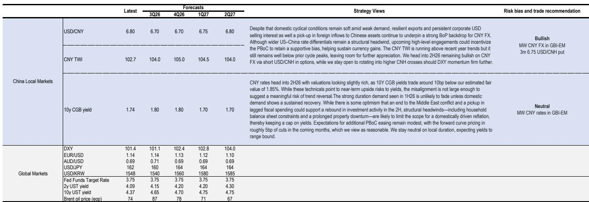
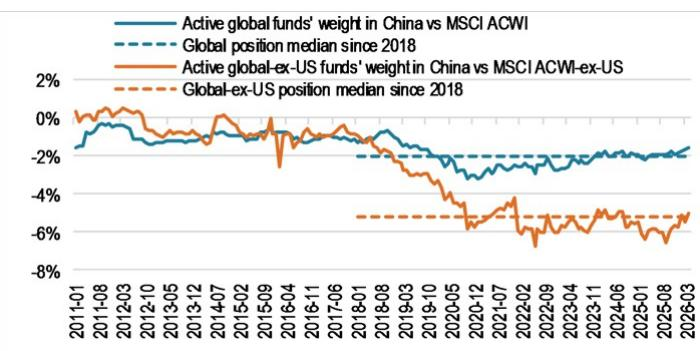
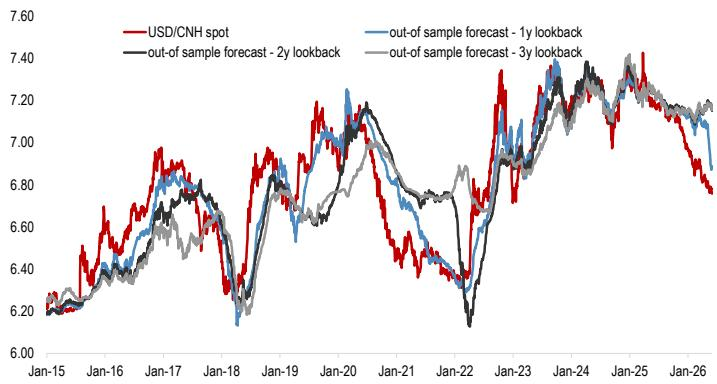

# China’s Local Markets Are No Longer Just a Defensive Trade — They Are Becoming a Structural Safe Harbor

The first half of 2026 has rewritten a narrative that many global investors took as settled wisdom. Against a backdrop of elevated global volatility, a shifting dollar cycle, and a global rates sell-off that punished most fixed-income markets, China’s local currency and bond markets did not just hold their ground — they delivered. The renminbi appreciated by a further 2.4% against the dollar in a smoother-than-expected glide, while Chinese government bonds (CGBs) kept yields lower across the curve, insulated from the global repricing. Combined, CGBs delivered a total return of roughly 5% year-to-date. Modest by the standards of emerging-market high-yielders, but remarkable for a low-yielding market that many had written off as a structural underperformer.

This is not a story of luck or temporary tailwinds. It is the product of a deeper structural shift in China’s balance of payments, policy architecture, and market dynamics. The question for the second half of 2026 is not whether this resilience can persist — but whether it can deepen, and under what conditions it might break.

The thesis is straightforward: China’s local markets are transitioning from a defensive, low-correlation diversifier into a structural safe harbor for global portfolios. The drivers are not cyclical but secular — a trade-led current account surplus that continues to surprise, a policy framework that has learned to manage the currency glide with precision, and a bond market that offers genuine diversification value at a time when global correlations are rising. Yet the path forward is not without tension. The renminbi’s strength is increasingly disconnected from rate fundamentals and domestic cyclical conditions, raising questions about sustainability. And the bond market is pricing in a benign outlook that leaves little room for error.

The argument we make is this: the safe-harbor status is real, but it is conditional. It depends on the continued alignment of three forces — a supportive policy stance from the People’s Bank of China, sustained export pricing power, and a measured recovery in foreign inflows. If any one of these falters, the calm waters of the first half could give way to choppier seas.

## The Renminbi’s Strength Is Real, But Increasingly Decoupled from Fundamentals — and That Is Not a Warning Sign

The first half of 2026 has been a textbook case of a currency appreciating for reasons that go beyond the usual rate differentials and macro data. The USD/CNH decline of 2.4% has occurred even as US-China yield differentials have re-widened, leaving the renminbi’s recent acceleration increasingly disconnected from rate fundamentals. At the same time, domestic data surprises turned sharply negative in the second quarter, with broad-based weakness in investment and demand. Yet the currency barely flinched.

For many investors, this kind of disconnect triggers alarm bells. It should not — at least not yet. History shows that the renminbi can decouple from rate fundamentals for extended periods without near-term mean reversion. The 2018-2022 period is a clear example. The reason lies in China’s unique structural features: a trade-led balance of payments, a tightly managed capital account, and still-limited foreign participation. These dampen the transmission from macro weakness into capital outflows, so long as domestic weakness does not escalate into a full confidence shock.

What is driving the renminbi instead is the structural support from China’s trade surplus. Export performance has consistently surprised to the upside in recent years, supported by high-tech exports and emerging champions such as solar, EVs, and batteries. Crucially, Chinese tech exporters appear to have been raising export prices amid the global AI cycle, lifting nominal export growth beyond what volume measures alone would suggest. Export growth surprises have closely tracked movements in export prices, underscoring the importance of pricing power in shaping China’s external performance.

But export strength only translates into currency strength if exporters are actively converting their dollar income into renminbi. And that is exactly what has been happening. Chinese corporates have turned into net dollar sellers since the second quarter of 2025, with the 12-month run rate of net dollar selling even outpacing the 2021 cycle. Yet this headline figure needs context. China’s monthly trade surplus runs at nearly $100 billion. Once flows are adjusted, it appears that corporates are only converting part of their incremental trade income, while the excess dollar savings accumulated since 2022 — estimated at $550 billion to $915 billion — remain largely untouched. Even partial conversion of this stock could exert significant appreciation pressure, leaving this a persistent source of structural support.

## The Balance of Payments Is Improving Broader Than the Trade Surplus Alone — Services and Capital Flows Are Adding to the Tailwind

The widening goods trade surplus and increased FX conversion have drawn the most attention, but the improvement in China’s balance of payments extends well beyond that. Two less-discussed trends are reinforcing the renminbi’s strength.

First, China’s services deficit has narrowed visibly since 2025, moving back toward the COVID-era lows after widening post-reopening. The driver is a surprisingly strong rebound in inbound tourism, which has now exceeded pre-COVID levels. The expansion of transit visa and visa-free schemes since 2024 — now covering residents from 55 countries for stays of up to 240 hours — has boosted tourism inflows while outbound tourism has plateaued. On net, this is narrowing China’s services deficit by an estimated $50 billion to $60 billion per year.

Second, foreign portfolio inflows have strengthened, particularly in equities. Foreign buying of onshore Chinese stocks is running at the fastest pace in recent years. The synchronized strength in the renminbi and domestic equities over the past year has created return synergies that are attracting inflows. While regional funds have added exposure since 2025, global active funds remain structurally underweight, leaving scope for further inflows as positions normalize. China’s positioning as a credible AI alternative play is supporting this reallocation.

On the bond side, the picture is more tentative but still encouraging. The low yield profile of Chinese bonds remains a relative drawback, but there have been signs of a pickup in foreign inflows in recent months. The resilience of both the renminbi and the bond market during recent global rates sell-offs reinforces their safe-haven characteristics, while low correlation with global rates enhances their appeal as a diversification asset. Looking ahead, the expected rollout of bond futures in Hong Kong and the PBoC’s FIMA repo facility could provide incremental support for foreign demand.

## The Bond Market Is Priced for a Goldilocks Scenario — But the Risks Are Skewed to the Upside in Yields

China’s bond market has been a standout performer in the first half of 2026, with 10-year CGB yields trading around 1.74%, well below the estimated fair value of 1.85%. This outperformance has been driven by strong duration demand, which has remained resilient despite the global rates sell-off. The question is whether this can continue.

The answer depends on domestic demand. The strong duration demand seen in the first half is unlikely to fade meaningfully unless domestic demand shows a sustained recovery. While there is some optimism that an end to the Middle East conflict and a pickup in lagged fiscal spending could support a rebound in investment activity in the second half, structural headwinds — including household balance sheet constraints and a prolonged property downturn — are likely to limit the scope for a domestically driven reflation. This keeps a cap on yields.

Expectations for additional PBoC easing remain modest, with the forward curve pricing in roughly 5 basis points of cuts in the coming months. This is reasonable. The central bank has shown a preference for measured, incremental easing rather than aggressive stimulus. The risk is that if domestic demand disappoints further, the market may begin to price in more aggressive easing, which would push yields lower. Conversely, if a sustained recovery does materialize, yields could rise more sharply than the market currently expects.

The bottom line is that the bond market is priced for a Goldilocks scenario — modest easing, stable growth, and no shocks. The risks are skewed to the upside in yields, but the misalignment is not large enough to suggest a meaningful risk of trend reversal.

## What the Report Does Not Fully Answer — And Why That Matters

The analysis in the underlying report is comprehensive, but it leaves several important questions open. First, how sustainable is the renminbi’s disconnect from rate fundamentals? The report notes that history shows extended decoupling is possible, but it does not fully address the conditions under which that decoupling might end. If global rates continue to rise and the dollar strengthens further, at what point does the carry disadvantage become too large to ignore?

Second, the role of the PBoC’s policy stance is well documented, but the report does not fully explore the political economy of currency management. Upcoming high-level engagements between the US and China could incentivize a supportive PBoC stance, but they could also create pressure for a more flexible exchange rate. The balance between maintaining currency stability and allowing market forces to play a greater role remains unresolved.

Third, the stock of excess dollar savings held by Chinese corporates is estimated at $550 billion to $915 billion, but the report does not model the pace at which these holdings might be converted. Partial conversion could exert significant appreciation pressure, but a rapid conversion could also create volatility. The conditions under which corporates might accelerate or delay conversion are not fully explored.

These open questions are not weaknesses in the analysis. They are the natural boundaries of any forward-looking assessment. But they matter because they define the scenarios under which the safe-harbor narrative could break.

## A Decision Framework for the Second Half of 2026

For investors looking to position for the remainder of 2026, the key is to distinguish between structural support and cyclical vulnerability. The following framework can help guide that assessment.

First, assess the balance of payments trajectory. The structural support from the trade surplus, narrowing services deficit, and foreign inflows is likely to persist. The risk is not a sudden reversal but a gradual erosion if export pricing power fades or inbound tourism growth plateaus. Monitor export price data and tourism inflow numbers as leading indicators.

Second, evaluate the policy stance. The PBoC has shown a well-calibrated approach to managing the currency glide. The risk is that if domestic weakness deepens, the central bank may face pressure to allow more depreciation to support exports. Conversely, if the currency appreciates too quickly, the PBoC may intervene to slow the pace. The key is to watch the daily fixing and any changes in reserve requirement ratios or other macroprudential tools.

Third, consider the global backdrop. The renminbi’s safe-haven characteristics are most valuable when global volatility is elevated. If global risk appetite improves and the dollar stabilizes, the renminbi may lose some of its relative appeal. The report’s forecasts for DXY suggest a mild strengthening in the second half, which would test the renminbi’s resilience.

Fourth, assess the bond market valuation. With 10-year CGB yields trading below fair value, the risk-reward for adding duration is skewed to the downside. A neutral stance on local duration, as the report recommends, is appropriate. The opportunity lies in the carry and diversification benefits rather than capital appreciation.

Finally, consider the optionality from the stock of excess dollar savings. Even partial conversion could provide a powerful tailwind for the renminbi. The key is to monitor corporate FX settlement data for signs of acceleration.

## Join the Community to Read the Full Report and Review the Original Charts

The analysis above draws on a detailed global investment bank report that includes proprietary models, historical comparisons, and forward-looking forecasts that cannot be fully captured in a single article. The original charts — including the decomposition of USD/CNH drivers, the tracking of corporate FX settlement, and the fair value estimates for CGB yields — provide the empirical foundation for the arguments made here. For investors who want to dig deeper into the data and explore the scenarios that could challenge the safe-harbor narrative, the full report is essential reading.

Join the community to read the full report and review the original charts.

*This article is for learning and discussion only and does not constitute investment advice.*

Personal reading notes and learning share only. Not investment advice.

