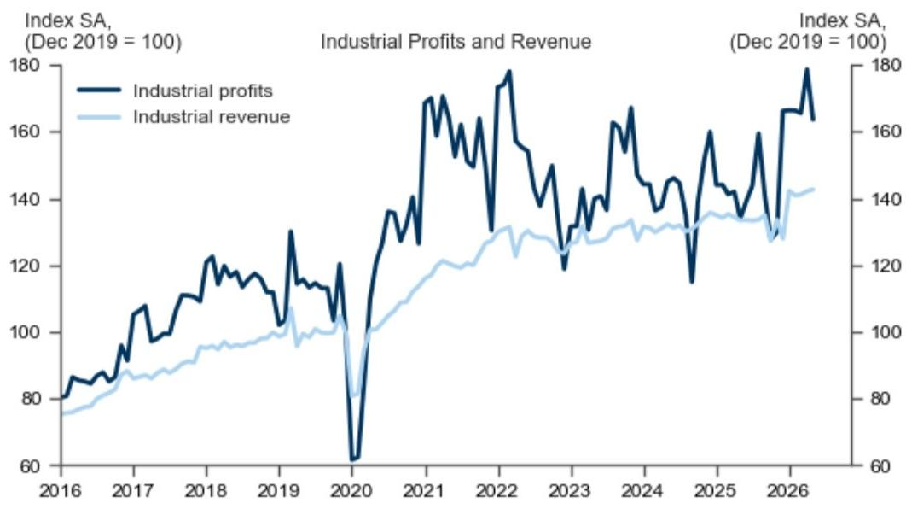
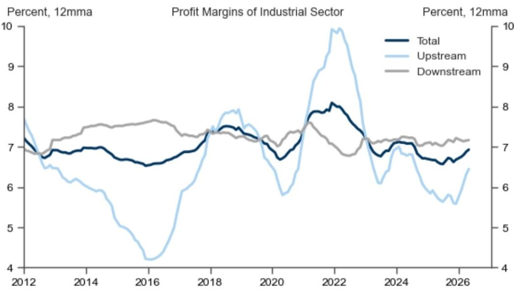

# China’s Industrial Profit Momentum Is Fraying, and the Divergence Between Upstream and Downstream Is the Real Story

The headline numbers from China’s May industrial profits data appear, at first glance, to be a continuation of a strong recovery. Year-over-year growth came in at 21.0%, and revenue rose 6.7%. But these annual comparisons are deceptive. They are inflated by the low base from last year’s pandemic lockdowns. The real signal lies in the sequential, seasonally adjusted figures, and that signal is unmistakably one of deceleration. Industrial profits fell 8.4% month-over-month in May, a sharp reversal from the 7.9% gain in April. Revenue growth also softened, rising just 0.4% sequentially compared to 0.7% in the prior month.

This is not merely a pause in a cyclical upswing. It is a warning that the composition of China’s industrial recovery is becoming dangerously imbalanced. The profit growth that remains is concentrated in upstream sectors—chemicals, coal, and non-ferrous metals—while downstream industries are struggling to maintain even modest gains. The global AI boom has provided a temporary lift to electronics and related metals like aluminum and copper, but this is a narrow tailwind, not a broad-based demand recovery. For investors and corporate strategists, the key question is not whether China’s industrial sector is growing, but whether the current profit structure is sustainable. The evidence suggests it is not.

The sequential decline in profits is the most important data point in this report. It strips away the base effect and reveals the underlying fragility. When you combine this with the fact that the 12-month average profit margin is rising only because of upstream strength, the picture becomes clear: the industrial sector is generating more profit per unit of revenue, but that profit is flowing to a shrinking share of the economy. The risk is that upstream margin expansion will eventually choke downstream activity, creating a self-limiting cycle that caps the overall recovery.

## The Sequential Profit Decline Reveals a Fragile Recovery Beneath the Headline Growth

The most analytically useful way to read the May data is to ignore the year-over-year comparisons entirely. They are backward-looking and distorted. The sequential, seasonally adjusted figures tell the real story. Industrial profits fell 8.4% month-over-month in May, the largest sequential decline in recent months. This is not a statistical blip. It follows a 7.9% gain in April, meaning the entire April improvement was reversed in a single month.

Why does this matter? Because sequential data captures the current momentum of the economy, not the memory of last year’s weakness. A sequential decline of this magnitude suggests that demand is softening in real time. Revenue growth, while still positive at 0.4% sequentially, also lost momentum from April’s 0.7% pace. The combination of falling profits and slower revenue growth points to a classic margin squeeze: companies are selling more, but they are earning less on each sale.

This interpretation is consistent with the broader narrative of China’s post-reopening slowdown. The initial burst of pent-up demand has faded, and the economy is now facing headwinds from a weakened property sector, subdued consumer confidence, and cautious corporate spending. The industrial profit data is simply the latest confirmation that the recovery is losing steam. For investors, this means that the easy gains from China’s reopening trade are behind us. The next phase will require identifying sectors and companies that can sustain margins even as aggregate demand softens.

## Upstream Profit Growth Is Diverging Sharply from Downstream, and That Divergence Is Unsustainable

The most striking feature of the May data is the widening gap between upstream and downstream profit performance. Upstream profits surged 58.3% year-over-year, driven by chemical materials, coal mining, and non-ferrous metals. Downstream profits, by contrast, grew only 10.2% year-over-year. While 10.2% is not a bad number in absolute terms, it is a fraction of upstream growth and masks significant variation within the downstream category.

The National Bureau of Statistics provided a useful decomposition: raw materials manufacturing contributed 10.2 percentage points to the 18.8% industrial profit growth in the January-to-May period, followed by high-tech manufacturing at 8.0 points and equipment manufacturing at 5.2 points. This breakdown confirms that the profit recovery is being carried by the raw materials sector. High-tech manufacturing, which includes electronics, is benefiting from the global AI boom, but this is a narrow and potentially cyclical driver. Equipment manufacturing, which is more closely tied to domestic capital expenditure, is lagging.

The divergence matters because upstream profit growth at this pace is not a sign of health; it is a symptom of supply constraints and pricing power concentrated in commodity-producing industries. When upstream sectors capture an outsized share of total profits, they effectively tax downstream industries, which must absorb higher input costs. Over time, this dynamic depresses downstream investment and consumption, ultimately dragging down the entire industrial sector. The sequential profit decline in May may already be reflecting this mechanism in action.

## The Global AI Boom Is a Real but Narrow Tailwind That Cannot Mask Broader Weakness

The report notes that the global AI boom supported profit growth in the electronics industry, as well as in non-ferrous metals like aluminum and copper. This is a genuine and important trend. AI-related demand for semiconductors, data center equipment, and advanced manufacturing is creating a pocket of strength in China’s industrial landscape. The electronics supply chain, in particular, is benefiting from both domestic policy support and global demand for AI hardware.

However, it is a mistake to extrapolate from this narrow tailwind to a broad-based industrial recovery. The AI boom is highly concentrated in specific sub-sectors and is subject to its own cyclical dynamics. The current wave of AI investment is driven by a handful of large technology firms and government initiatives. It is not yet generating the kind of widespread capital expenditure that would lift equipment manufacturing or downstream consumer industries. Moreover, the AI-driven demand for non-ferrous metals is a double-edged sword: it boosts upstream profits in the short term, but it also raises input costs for downstream manufacturers that use these metals.

For investors, the implication is clear: do not confuse sector-specific strength with a general improvement in China’s industrial fundamentals. The AI boom is real, but it is not a tide that lifts all boats. The sectors that are not directly tied to AI—such as traditional manufacturing, consumer goods, and construction materials—are facing a much more challenging environment. Diversification across sectors is not just prudent; it is essential.

## The Report Leaves Unanswered Questions About the Transmission Mechanism from Upstream Margins to Downstream Activity

A careful reading of the report reveals an important analytical gap. The data shows that upstream profit margins are rising and that total profit margins are edging up on a 12-month average basis. But the report does not fully explore the transmission mechanism: how do rising upstream margins affect downstream behavior? Do higher input costs lead to inventory destocking? Are downstream firms passing on costs to consumers, or are they absorbing them and accepting lower margins? The sequential profit decline in May suggests that some form of margin compression is already underway, but the data does not tell us whether this is a temporary adjustment or the beginning of a more prolonged squeeze.

This is a critical question for forward-looking analysis. If downstream firms are absorbing cost increases, their profit margins will continue to erode, leading to reduced investment and hiring. If they are passing on costs, consumer inflation may pick up, which would complicate the policy environment. Either scenario has significant implications for the trajectory of China’s industrial profits in the second half of the year. The report provides the raw data, but it leaves the interpretation to the reader. A full analysis would require modeling the pass-through rates from upstream to downstream prices and assessing the elasticity of demand in key downstream sectors.

## A Decision Framework for Investors: How to Position for the Divergence

For investors and corporate strategists, the May industrial profit data provides a clear framework for decision-making. The first step is to recognize that the aggregate numbers are misleading. The year-over-year growth rates are backward-looking and inflated by base effects. The sequential data is the only reliable guide to current momentum, and it points to softening.

The second step is to segment the industrial sector into three categories: upstream commodity producers, downstream manufacturers with pricing power, and downstream manufacturers without pricing power. Upstream producers are currently enjoying high margins, but these are vulnerable to a demand slowdown. The key risk is that a decline in global commodity prices or a further weakening of Chinese demand could compress upstream margins quickly. Downstream manufacturers with pricing power—such as those in AI-related electronics or specialized equipment—are better positioned to maintain margins even as input costs rise. Downstream manufacturers without pricing power, particularly those in competitive, low-margin industries, are the most exposed. They face a double squeeze: rising input costs and softening demand.

The third step is to assess the policy response. The Chinese government has tools to support industrial demand, including fiscal stimulus, infrastructure spending, and targeted tax cuts. However, the effectiveness of these tools depends on the specific sector. Infrastructure spending would benefit upstream sectors and construction-related downstream industries, but it would do little for consumer-facing manufacturing. AI-related policies are already in place, but their impact is concentrated. Investors should watch for signs that the government is shifting its focus from supply-side support to demand-side stimulus, as this would change the relative attractiveness of different sectors.

The final step is to monitor the sequential data closely. The May decline in profits is a warning, but it is not a definitive trend. One month does not make a recession. If June shows a stabilization or recovery in sequential profits, the May data may be revised as a temporary correction. If the decline continues, it would confirm that the industrial recovery is losing traction. The next two months of data will be decisive.

## Join the Community to Read the Full Report and Review the Original Charts

The analysis above draws on the detailed data and exhibits provided in the original research report, including the sequential profit and revenue trends and the breakdown of profit margins by sector. These charts reveal patterns that are difficult to capture in text alone, particularly the divergence between upstream and downstream margins and the evolution of sequential growth rates over time. To fully understand the implications of the May data and to track how these trends develop in the months ahead, we encourage you to access the full report and its accompanying visualizations. Join the community to read the full report and review the original charts.

*This article is for learning and discussion only and does not constitute investment advice.*

Personal reading notes and learning share only. Not investment advice.

