Energy | North America

# Refreshing the Price Deck

WTI has fallen to \~\$72, oil E&Ps back at pre-conflict levels, and Majors -9% below it. We refresh our estimates for the latest prices. FCF yields are still strong, with '27 median of 12% for oil E&Ps, while intrinsic valuations only reflect \~\$64 WTI. Risk-rewards screen better post the pullback.

## Key Takeaways

WTI oil has fallen another $\sim 15\%$ since the MoU, now back to $\sim$ 72/bbl. Alongside softer crude, energy stocks have also moved lower

We update our price deck to 6/19 strip, WTI assumption falls 12% in '26 while '27 stays at \$70. Our EBITDA ests are -7% vs consensus for FY26 and -6% for '27

For 2Q, our EBITDA ests are in-line with consensus for oil producers and 8% below for gas. We also forecast above consensus 2Q EPS for XOM

At \$70, our oil coverage offers median '27 FCF yield of 10% (12% US E&Ps, 9% Majors, 10% Canada). Valuations reflect \~\$64 WTI. '27 FCF yields of 9% for gas

We retain our preference for Majors and E&Ps with positive rate of change (DVN, PR & CVE). LNG producers VG and Cheniere also screen attractive.

Have stocks corrected too much? Since the US and Iran announced a memorandum of understanding (MoU) on June 14, oil prices have declined another \~15%. WTI now sits at \~\$72, only slightly above pre-conflict levels. Alongside softer crude, energy stocks have also moved lower. Notably, oil E&Ps are now trading back at pre-conflict levels and US Majors -9%. While uncertainty persists around the macro picture, we do think the risk-reward has improved post the pullback. FCF yields are strong, with a 2027 median of \~10% at prices near strip, and stocks intrinsically reflect \~\$64 WTI - below futures and our long-run \$70/bbl price expectation. We view the recent pullback as an opportunity to add exposure to Majors and high-quality E&Ps.

\- Crude Oil. Flows through the Strait of Hormuz have risen sharply over the last few weeks as oil tankers that were previously trapped behind the waterway make their way to market. Vortexa shows oil exports from countries behind the Strait exceeding 10 mb/d over the last week, approaching $\frac{2}{3}$ of pre-conflict levels. This includes a surge in Iranian flows, which have also benefited from eased sanctions and the lifting of the US blockade. Globally, US exports remain historically high and Chinese imports low, both continuing to serve as important buffers for the seaborne oil market. Still, global inventories have already drawn substantially. Fully restoring regional production and refilling storage will take time. See the latest from MS Strategist Martijn Rats here: 'Let the Oil Flow'.

\- Global Gas & LNG. JKM (Asia LNG) prices have fallen back toward \$15/ mmbtu, well off the highs but still up >50% YTD. Recent statements from QatarEnergy point to \~50% recovery in export volumes in about one month

## MS & CO. LLC

<table><tr><td colspan="2">Devin McDermott</td></tr><tr><td colspan="2">Equity Analyst and Commodities Strategist</td></tr><tr><td>Devin.McDermott@morganstanley.com</td><td>+1 212 761-1125</td></tr><tr><td colspan="2">Joe Laetsch, CFA</td></tr><tr><td colspan="2">Equity Analyst</td></tr><tr><td>Joe.Laetsch@morganstanley.com</td><td>+1 212 761-8804</td></tr><tr><td colspan="2">Helen Lin</td></tr><tr><td colspan="2">Research Associate</td></tr><tr><td>Helen.Lin@morganstanley.com</td><td>+1 212 761-0766</td></tr><tr><td colspan="2">Svetlana Do</td></tr><tr><td colspan="2">Research Associate</td></tr><tr><td>Svetlana.DO@morganstanley.com</td><td>+1 212 761-2409</td></tr><tr><td colspan="2">Justin W Latran, CFA</td></tr><tr><td colspan="2">Research Associate</td></tr><tr><td>Justin.Latran@morganstanley.com</td><td>+1 212 761-2869</td></tr><tr><td colspan="2">Jacqueline M Kenny</td></tr><tr><td colspan="2">Research Associate</td></tr><tr><td>Jacqueline.Kenny@morganstanley.com</td><td>+1 212 761-2253</td></tr><tr><td colspan="2">Zackary C Warden</td></tr><tr><td colspan="2">Research Associate</td></tr><tr><td>Zackary.Warden@morganstanley.com</td><td>+1 212 761-4164</td></tr></table>

## EXPLORATION & PRODUCTION

<table><tr><td>North AmericaIndustry View</td><td>In-Line</td></tr><tr><td colspan="2">INTEGRATED OIL</td></tr><tr><td>North AmericaIndustry View</td><td>Attractive</td></tr></table>

See our price target changes in Exhibit 33

MS does and seeks to do business with companies covered in MS. As a result, investors should be aware that the firm may have a conflict of interest that could affect the objectivity of MS. Investors should consider MS as only a single factor in making their investment decision.

For analyst certification and other important disclosures, refer to the Disclosure Section, located at the end of this report.

and 80% after two months - a recovery of everything except the damaged trains. This still leaves a very short window to normalize inventories before next winter. Over the last month, global consumption has started to inflect higher again alongside summer weather & storage refill needs. We see some upside to 2H26 post the pullback, followed by a more balanced 2027. See more here and here.

\- US Natural Gas. Prompt Henry Hub prices have been range-bound in the low-to-mid \$3s for most of June. We still do expect a modest improvement in 3Q, supported by higher LNG flows & power burn. LNG exports in June so far are running \~0.3 bcf/d above the May average, with feedgas deliveries to Golden Pass reaching \~600 mmcf/d this week. That said, the outlook softens again into 2027 - reflecting associated gas growth & still-elevated Haynesville activity. That said, the silver lining of lower oil prices is that it could moderate associated gas risks. See more here.

Softer prices, but valuations still attractive. We refresh our price deck and estimates using strip as of 6/19 (see Exhibit 12), lowering our FY26 WTI assumption to \~\$78/bbl (from \~\$88/bbl) with \$73 WTI for the back half of the year, while 2027 is unchanged at \~\$70. For integrated companies, US Gulf Coast refining margin assumptions are moving 22% higher in 2026. Our Henry Hub moves -8% lower for 2027. Overall, price targets move lower by -5% for oil E&Ps and -8% for gas names, but still imply 25% average upside. At prices near strip (\~\$70 WTI), we estimate a median 2027 FCF yield of 10% across our oil coverage (12% for oil E&Ps, 9% for US majors, and 10% for Canada). Intrinsically, oil E&Ps reflect long-run WTI of\~\$64/bbl, \~6% below 12-month strip.

Preliminary 2Q outlook. Incorporating actual 2Q oil & gas prices and downstream margins, our quarterly EBITDA estimates are in-line with consensus for oil producers and 8% below for gas. We also forecast above consensus EPS for XOM.

Exhibit 1: MS Price Deck (Based on 6/19/2026 Strip)

<table><tr><td>MS Model Assumptions</td><td>2Q26E</td><td>3Q26E</td><td>4Q26E</td><td>2026E</td><td>2027E</td><td>2028E+</td></tr><tr><td>Brent ($/Bbl)</td><td>103.54</td><td>77.80</td><td>76.72</td><td>84.75</td><td>74.52</td><td>75.00</td></tr><tr><td>WTI ($/Bbl)</td><td>93.00</td><td>74.00</td><td>72.00</td><td>77.92</td><td>70.00</td><td>70.00</td></tr><tr><td>Henry Hub ($/MMBtu)</td><td>2.90</td><td>3.20</td><td>3.50</td><td>3.66</td><td>3.50</td><td>3.75</td></tr><tr><td>Mont Belvieu NGL ($/Bbl)</td><td>31.05</td><td>25.02</td><td>24.78</td><td>26.86</td><td>25.49</td><td>25.58</td></tr><tr><td>GC 321 Brent ($/Bbl)</td><td>29.93</td><td>31.22</td><td>25.87</td><td>25.83</td><td>24.05</td><td>14.20</td></tr></table>

<table><tr><td>Prior MS Assumptions</td><td>2Q26E</td><td>3Q26E</td><td>4Q26E</td><td>2026E</td><td>2027E</td><td>2028E+</td></tr><tr><td>Brent ($/Bbl)</td><td>112.00</td><td>103.12</td><td>92.71</td><td>97.26</td><td>76.05</td><td>75.00</td></tr><tr><td>WTI ($/Bbl)</td><td>100.00</td><td>95.00</td><td>85.00</td><td>88.24</td><td>70.00</td><td>70.00</td></tr><tr><td>Henry Hub ($/MMBtu)</td><td>2.85</td><td>3.20</td><td>3.60</td><td>3.67</td><td>3.80</td><td>3.75</td></tr><tr><td>Mont Belvieu NGL ($/Bbl)</td><td>33.56</td><td>33.70</td><td>32.62</td><td>31.65</td><td>28.26</td><td>28.04</td></tr><tr><td>GC 321 Brent ($/Bbl)</td><td>24.66</td><td>23.20</td><td>20.59</td><td>21.19</td><td>14.20</td><td>14.20</td></tr></table>

<table><tr><td>% Change</td><td>2Q26E</td><td>3Q26E</td><td>4Q26E</td><td>2026E</td><td>2027E</td><td>2028E+</td></tr><tr><td>Brent ($/Bbl)</td><td>-8%</td><td>-25%</td><td>-17%</td><td>-13%</td><td>-2%</td><td>0%</td></tr><tr><td>WTI ($/Bbl)</td><td>-7%</td><td>-22%</td><td>-15%</td><td>-12%</td><td>0%</td><td>0%</td></tr><tr><td>Henry Hub ($/MMBtu)</td><td>2%</td><td>0%</td><td>-3%</td><td>0%</td><td>-8%</td><td>0%</td></tr><tr><td>Mont Belvieu NGL ($/Bbl)</td><td>-7%</td><td>-26%</td><td>-24%</td><td>-15%</td><td>-10%</td><td>-9%</td></tr><tr><td>GC 321 Brent ($/Bbl)</td><td>21%</td><td>35%</td><td>26%</td><td>22%</td><td>69%</td><td>0%</td></tr></table>

Source: Bloomberg, FactSet, MS estimates. Note: GC 321 Brent crack spread is unadjusted for RINs.

## Key Charts

Exhibit 2: Oil E&Ps are now back to pre-conflict levels (including gas, the E&P sector is -5% below). The group has underperformed the broader market by \~12% over the same period.  
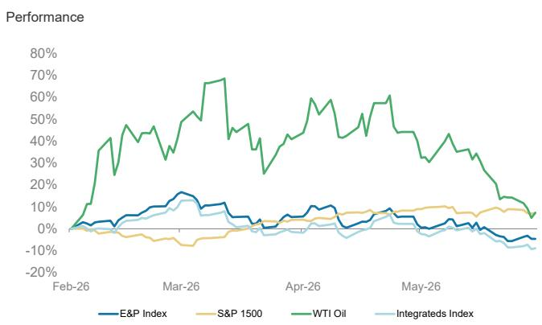  
Source: Bloomberg, FactSet, MS

Exhibit 3: We estimate consensus is currently pricing in \~\$73 WTI based on 2027 EBITDAX forecasts, higher than the full-year 2027 strip price of \~\$67.  
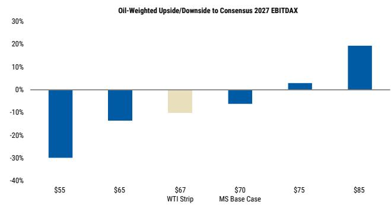  
Source: FactSet, MS estimates

Exhibit 4: The median 2027 FCF yield for our oil coverage is 10% near strip (\~\$70 WTI), 12% looking just at oil E&Ps. This would move by \~3% for every \$10 change in oil.  
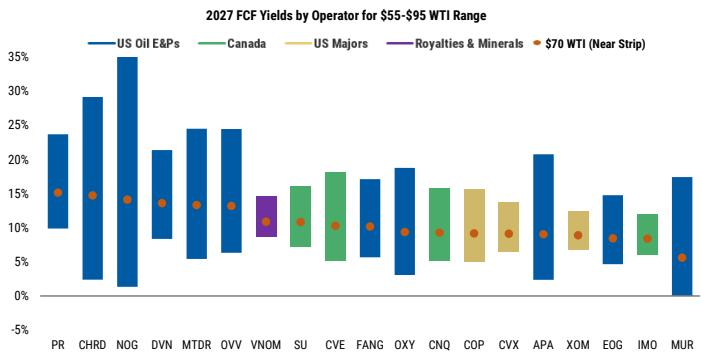  
Source: FactSet, MS estimates.

Exhibit 5: At \$70 WTI, near strip, our oil coverage has 5% downside vs consensus estimates (7% downside for just oil E&Ps).  
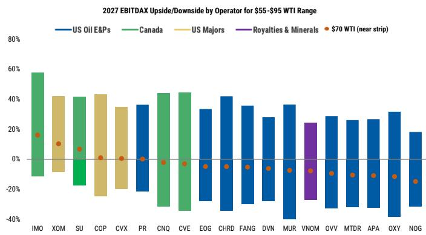  
Source: MS estimates.

Exhibit 6: Our 2027 FCF estimates are \~11% below consensus...  
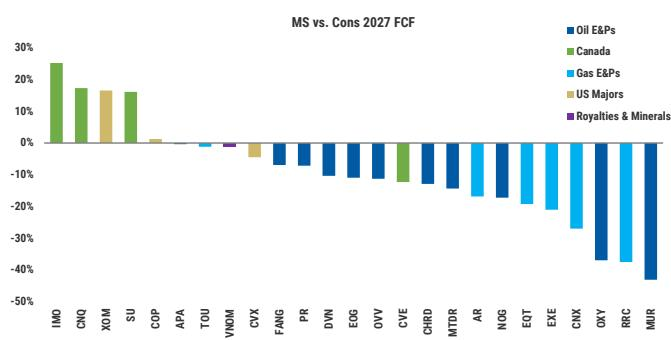  
Source: FactSet, MS estimates. Note: Axis cut at 30%

Exhibit 7: ...with 2027 EBITDA 6% below consensus.  
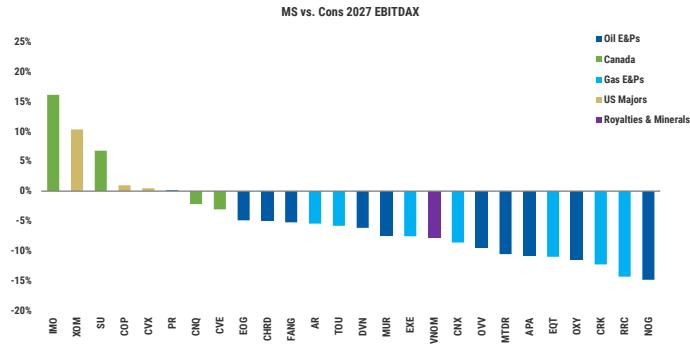  
Source: FactSet, MS estimates. Note: Axis cut at 2%

Exhibit 8: Our oil coverage has hedged $\sim 5\%$ of 2027 production on average...  
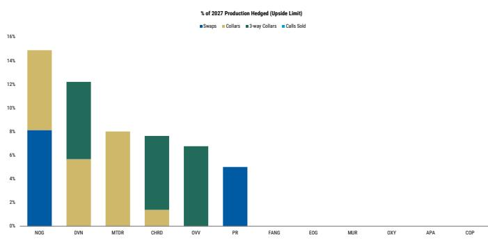  
Source: Company Data, MS estimates

Exhibit 9: ...and \~30% for gas E&Ps  
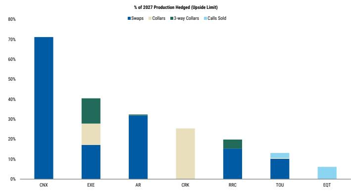  
Source: Company Data, MS estimates

Exhibit 10: Our oil coverage is pricing an average WTI price of \~\$64, \~6% below 12-month strip.  
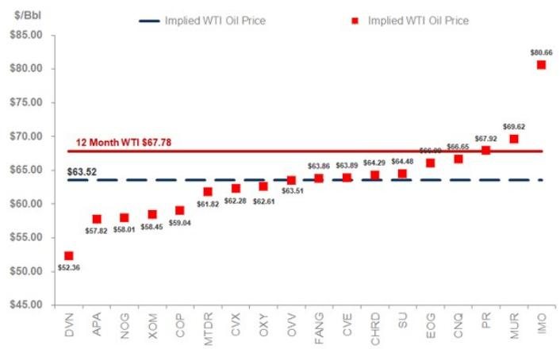  
Source: Bloomberg, MS. Note: close prices of 6.24.26.

Exhibit 11: Gas E&Ps reflect an average Henry Hub price of \~\$3.50, at the 12 month strip.  
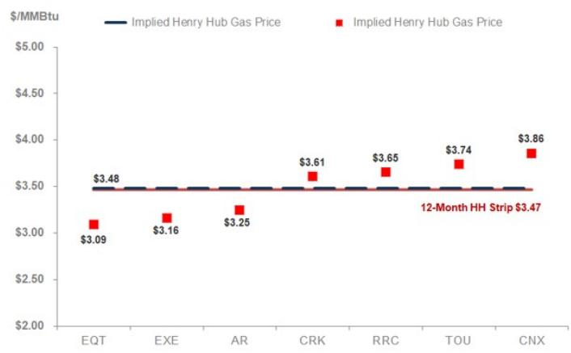  
Source: Bloomberg, MS. Note: close prices of 6.24.26

## Price Target Changes

Exhibit 12: MS Price Deck (Based on 6/19/2026 Strip)

<table><tr><td>MS Model Assumptions</td><td>2Q26E</td><td>3Q26E</td><td>4Q26E</td><td>2026E</td><td>2027E</td><td>2028E+</td></tr><tr><td>Brent ($/Bbl)</td><td>103.54</td><td>77.80</td><td>76.72</td><td>84.75</td><td>74.52</td><td>75.00</td></tr><tr><td>WTI ($/Bbl)</td><td>93.00</td><td>74.00</td><td>72.00</td><td>77.92</td><td>70.00</td><td>70.00</td></tr><tr><td>Henry Hub ($/MMBtu)</td><td>2.90</td><td>3.20</td><td>3.50</td><td>3.66</td><td>3.50</td><td>3.75</td></tr><tr><td>Mont Belvieu NGL ($/Bbl)</td><td>31.05</td><td>25.02</td><td>24.78</td><td>26.86</td><td>25.49</td><td>25.58</td></tr><tr><td>GC 321 Brent ($/Bbl)</td><td>29.93</td><td>31.22</td><td>25.87</td><td>25.83</td><td>24.05</td><td>14.20</td></tr></table>

<table><tr><td>Prior MS Assumptions</td><td>2Q26E</td><td>3Q26E</td><td>4Q26E</td><td>2026E</td><td>2027E</td><td>2028E+</td></tr><tr><td>Brent ($/Bbl)</td><td>112.00</td><td>103.12</td><td>92.71</td><td>97.26</td><td>76.05</td><td>75.00</td></tr><tr><td>WTI ($/Bbl)</td><td>100.00</td><td>95.00</td><td>85.00</td><td>88.24</td><td>70.00</td><td>70.00</td></tr><tr><td>Henry Hub ($/MMBtu)</td><td>2.85</td><td>3.20</td><td>3.60</td><td>3.67</td><td>3.80</td><td>3.75</td></tr><tr><td>Mont Belvieu NGL ($/Bbl)</td><td>33.56</td><td>33.70</td><td>32.62</td><td>31.65</td><td>28.26</td><td>28.04</td></tr><tr><td>GC 321 Brent ($/Bbl)</td><td>24.66</td><td>23.20</td><td>20.59</td><td>21.19</td><td>14.20</td><td>14.20</td></tr></table>

<table><tr><td>% Change</td><td>2Q26E</td><td>3Q26E</td><td>4Q26E</td><td>2026E</td><td>2027E</td><td>2028E+</td></tr><tr><td>Brent ($/Bbl)</td><td>-8%</td><td>-25%</td><td>-17%</td><td>-13%</td><td>-2%</td><td>0%</td></tr><tr><td>WTI ($/Bbl)</td><td>-7%</td><td>-22%</td><td>-15%</td><td>-12%</td><td>0%</td><td>0%</td></tr><tr><td>Henry Hub ($/MMBtu)</td><td>2%</td><td>0%</td><td>-3%</td><td>0%</td><td>-8%</td><td>0%</td></tr><tr><td>Mont Belvieu NGL ($/Bbl)</td><td>-7%</td><td>-26%</td><td>-24%</td><td>-15%</td><td>-10%</td><td>-9%</td></tr><tr><td>GC 321 Brent ($/Bbl)</td><td>21%</td><td>35%</td><td>26%</td><td>22%</td><td>69%</td><td>0%</td></tr></table>

Source: Bloomberg, FactSet, MS estimates. Note: GC 321 Brent crack spread is unadjusted for RINs.

Exhibit 13: Price Target Changes

<table><tr><td>Company</td><td>Ticker</td><td>New PT</td><td>Old PT</td><td> $\Delta (\%)$ </td><td>New Rating</td><td>Old Rating</td><td>PT% Upside</td></tr><tr><td colspan="8">US Majors</td></tr><tr><td>Chevron Corp.</td><td>CVX</td><td>210</td><td>214</td><td>(2%)</td><td>OW</td><td>OW</td><td>22%</td></tr><tr><td>Exxon Mobil Corporation</td><td>XOM</td><td>168</td><td>171</td><td>(2%)</td><td>OW</td><td>OW</td><td>22%</td></tr><tr><td>Integrateds Median</td><td></td><td></td><td></td><td>(2%)</td><td></td><td></td><td>22%</td></tr><tr><td colspan="8">Canadian Integrateds (CAD unless noted)</td></tr><tr><td>Canadian Natural Resources Ltd</td><td>CNQ</td><td>67</td><td>67</td><td>0%</td><td>EW</td><td>EW</td><td>19%</td></tr><tr><td>Cenovus Energy Inc</td><td>CVE</td><td>43</td><td>43</td><td>0%</td><td>OW</td><td>OW</td><td>23%</td></tr><tr><td>Imperial Oil Ltd</td><td>IMO</td><td>138</td><td>141</td><td>(2%)</td><td>EW</td><td>EW</td><td>(14%)</td></tr><tr><td>Suncor Energy Inc</td><td>SU</td><td>92</td><td>93</td><td>(1%)</td><td>EW</td><td>EW</td><td>19%</td></tr><tr><td>Canadian Integrateds Median</td><td></td><td></td><td></td><td>(1%)</td><td></td><td></td><td>19%</td></tr><tr><td colspan="8">Oil E&amp;Ps</td></tr><tr><td>APA Corp.</td><td>APA</td><td>41</td><td>44</td><td>(7%)</td><td>UW</td><td>UW</td><td>23%</td></tr><tr><td>Chord Energy Corp.</td><td>CHRD</td><td>169</td><td>175</td><td>(3%)</td><td>OW</td><td>OW</td><td>41%</td></tr><tr><td>ConocoPhillips</td><td>COP</td><td>146</td><td>153</td><td>(5%)</td><td>OW</td><td>OW</td><td>37%</td></tr><tr><td>Devon Energy Corp.</td><td>DVN</td><td>63</td><td>66</td><td>(5%)</td><td>OW</td><td>OW</td><td>48%</td></tr><tr><td>Diamondback Energy, Inc.</td><td>FANG</td><td>216</td><td>229</td><td>(6%)</td><td>OW</td><td>OW</td><td>18%</td></tr><tr><td>EOG Resources Inc.</td><td>EOG</td><td>156</td><td>160</td><td>(3%)</td><td>EW</td><td>EW</td><td>17%</td></tr><tr><td>Matador Resources Co.</td><td>MTDR</td><td>66</td><td>75</td><td>(12%)</td><td>EW</td><td>EW</td><td>32%</td></tr><tr><td>Murphy Oil Corp.</td><td>MUR</td><td>35</td><td>37</td><td>(5%)</td><td>UW</td><td>UW</td><td>(1%)</td></tr><tr><td>Northern Oil and Gas, Inc.</td><td>NOG</td><td>25</td><td>29</td><td>(14%)</td><td>UW</td><td>UW</td><td>27%</td></tr><tr><td>Occidental Petroleum Corp.</td><td>OXY</td><td>68</td><td>74</td><td>(8%)</td><td>EW</td><td>EW</td><td>33%</td></tr><tr><td>Ovintiv Inc.</td><td>OVV</td><td>65</td><td>68</td><td>(4%)</td><td>EW</td><td>EW</td><td>21%</td></tr><tr><td>Permian Resources Corp.</td><td>PR</td><td>24</td><td>25</td><td>(4%)</td><td>OW</td><td>OW</td><td>27%</td></tr><tr><td>Oil E&amp;Ps Median</td><td></td><td></td><td></td><td>(5%)</td><td></td><td></td><td>27%</td></tr><tr><td colspan="8">Gas E&amp;Ps</td></tr><tr><td>Antero Resources Corp.</td><td>AR</td><td>48</td><td>56</td><td>(14%)</td><td>OW</td><td>OW</td><td>39%</td></tr><tr><td>CNX Resources Corp.</td><td>CNX</td><td>32</td><td>34</td><td>(6%)</td><td>UW</td><td>UW</td><td>(5%)</td></tr><tr><td>Comstock Resources Inc.</td><td>CRK</td><td>16</td><td>18</td><td>(11%)</td><td>EW</td><td>EW</td><td>15%</td></tr><tr><td>EQT Corp.</td><td>EQT</td><td>68</td><td>74</td><td>(8%)</td><td>OW</td><td>OW</td><td>32%</td></tr><tr><td>Expand Energy Corp.</td><td>EXE</td><td>131</td><td>139</td><td>(6%)</td><td>OW</td><td>OW</td><td>48%</td></tr><tr><td>Range Resources Corp.</td><td>RRC</td><td>44</td><td>50</td><td>(12%)</td><td>EW</td><td>EW</td><td>21%</td></tr><tr><td>Tourmaline Oil Corp.</td><td>TOU</td><td>65</td><td>70</td><td>(7%)</td><td>EW</td><td>EW</td><td>8%</td></tr><tr><td>Gas E&amp;Ps Median</td><td></td><td></td><td></td><td>(8%)</td><td></td><td></td><td>21%</td></tr><tr><td colspan="8">Royalties &amp; Minerals</td></tr><tr><td>Viper Energy, Inc.</td><td>VNOM</td><td>46</td><td>49</td><td>(6%)</td><td>OW</td><td>OW</td><td>6%</td></tr><tr><td>Total Coverage Median</td><td></td><td></td><td></td><td>(6%)</td><td></td><td></td><td>22%</td></tr></table>

Source: FactSet, MS estimates

Exhibit 14: Bear/Bull Cases  
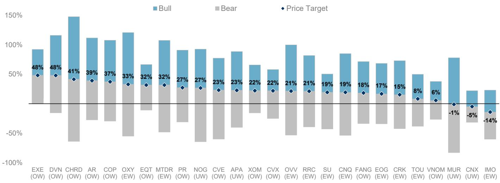  
Source: FactSet, MS estimates

## Performance & Key Industry Metrics

Exhibit 15: WoW Energy Sub-sector Performance

WoW Performance

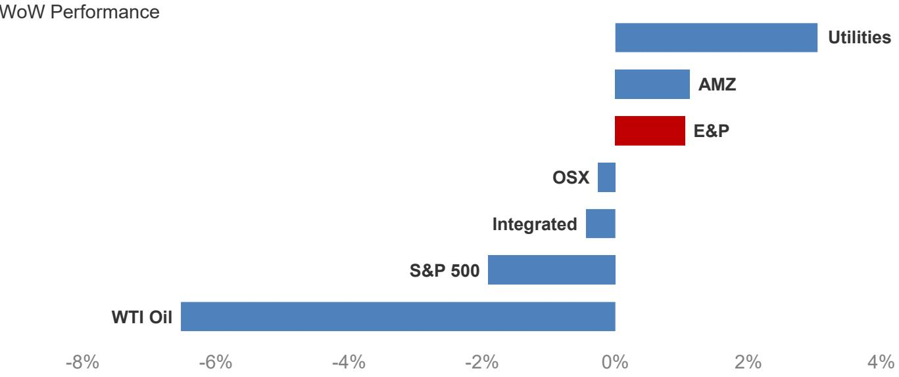  
Source: Bloomberg, FactSet, MS. Note: prices as of 6.25.26 close.

Exhibit 16: YTD Energy Sub-sector Performance  
YTD Performance  
  
Source: Bloomberg, FactSet, MS. Note: prices as of 6.25.26 close.

Exhibit 17: Top E&P WoW Performance  
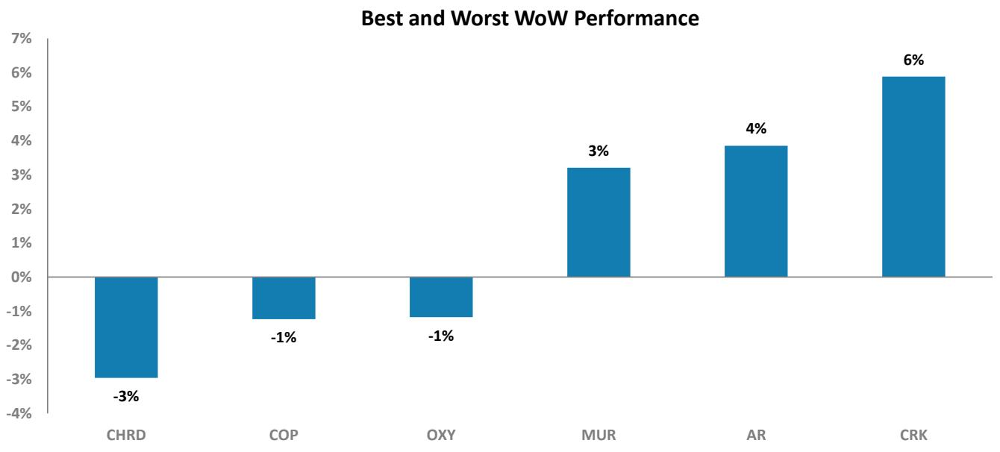  
Source: FactSet, MS

Exhibit 18: WoW Performance by E&P Subsector  
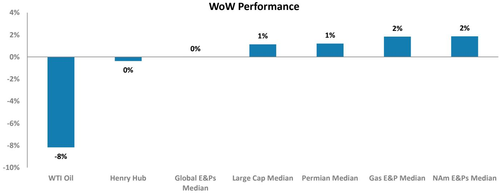  
Source: FactSet, MS.

Exhibit 19: NAV implied oil prices discount vs strip prices has narrowed in recent weeks driven by geopolitical risk.

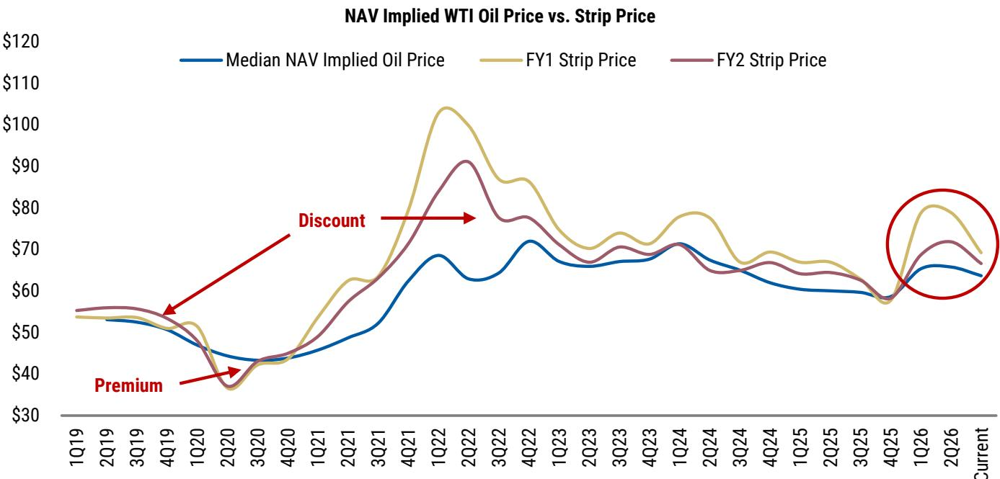  
Source: Company reports, MS estimates

Exhibit 20: At our price deck of \~\$70 WTI in 2027, we forecast a median realized price of \~\$69/bbl for our oil coverage. APA, MUR, and EOG have the highest realized prices due to limited hedges and/or geographic mix.

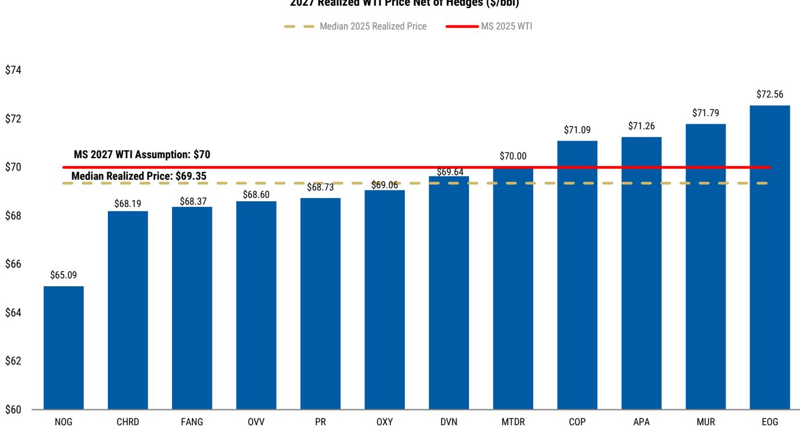  
Source: Company reports, MS estimates

## Comps

Exhibit 21: Comp Sheet

<table><tr><td colspan="4">Commodity Benchmark Prices</td></tr><tr><td></td><td>2026E</td><td>2027E</td><td>2028E</td></tr><tr><td>WTI Cushing Oil ($/Bbl)</td><td>77.94</td><td>70.00</td><td>70.00</td></tr><tr><td>WCS ($/Bbl)</td><td>62.54</td><td>56.58</td><td>55.00</td></tr><tr><td>Brent Oil ($/Bbl)</td><td>84.75</td><td>74.52</td><td>75.00</td></tr><tr><td>US Henry Hub ($/MMBtu)</td><td>3.66</td><td>3.50</td><td>3.75</td></tr><tr><td>Mont Belvieu NGL ($/Bbl)</td><td>26.86</td><td>25.49</td><td>25.58</td></tr><tr><td>GC 321 Brent ($/Bbl)</td><td>25.83</td><td>24.05</td><td>14.20</td></tr></table>

<table><tr><td rowspan="2">Company</td><td rowspan="2">Ticker</td><td rowspan="2">Rating</td><td rowspan="2">Price 6/25/26</td><td rowspan="2">Market Cap ($MM)</td><td rowspan="2">Price Target</td><td rowspan="2">PT Upside</td><td colspan="3">EV/EBITDAX</td><td colspan="3">EV/ Debt-Adjusted Cash Flow</td><td colspan="3">FCF yield (Pre-Div)</td><td colspan="3">Total Yield (Dividends + Buybacks)</td><td colspan="3">Net Debt/ EBITDAX</td><td colspan="3">Prod Growth YoY</td></tr><tr><td>2026E</td><td>2027E</td><td>2028E</td><td>2026E</td><td>2027E</td><td>2028E</td><td>2026E</td><td>2027E</td><td>2028E</td><td>2026E</td><td>2027E</td><td>2028E</td><td>2026E</td><td>2027E</td><td>2028E</td><td>2026E</td><td>2027E</td><td>2028E</td></tr><tr><td colspan="25">US Majors</td></tr><tr><td>Chevron Corp.</td><td>CVX</td><td>OW</td><td>$172.24</td><td>335,185</td><td>$210</td><td>22%</td><td>6.2x</td><td>6.2x</td><td>6.2x</td><td>7.5x</td><td>7.3x</td><td>7.2x</td><td>10%</td><td>9%</td><td>9%</td><td>7%</td><td>9%</td><td>9%</td><td>0.5x</td><td>0.5x</td><td>0.5x</td><td>8%</td><td>3%</td><td>-0%</td></tr><tr><td>Exxon Mobil Corporation</td><td>XOM</td><td>OW</td><td>$137.55</td><td>589,402</td><td>$168</td><td>22%</td><td>6.4x</td><td>5.8x</td><td>5.1x</td><td>7.7x</td><td>6.9x</td><td>6.1x</td><td>8%</td><td>9%</td><td>9%</td><td>6%</td><td>6%</td><td>6%</td><td>0.2x</td><td>0.0x</td><td>-0.2x</td><td>-2%</td><td>8%</td><td>3%</td></tr><tr><td>US Majors Median</td><td></td><td></td><td></td><td></td><td></td><td>22%</td><td>6.3x</td><td>6.0x</td><td>5.6x</td><td>7.6x</td><td>7.1x</td><td>6.7x</td><td>9%</td><td>9%</td><td>9%</td><td>7%</td><td>8%</td><td>8%</td><td>0.3x</td><td>0.3x</td><td>0.2x</td><td>3%</td><td>5%</td><td>1%</td></tr><tr><td colspan="25">Canada</td></tr><tr><td>Canadian Natural Resources Ltd</td><td>CNQ</td><td>EW</td><td>C$56.19</td><td>C$117,661</td><td>C$67</td><td>19%</td><td>6.0x</td><td>5.9x</td><td>5.7x</td><td>6.6x</td><td>6.8x</td><td>6.6x</td><td>10%</td><td>9%</td><td>9%</td><td>8%</td><td>8%</td><td>9%</td><td>0.7x</td><td>0.6x</td><td>0.6x</td><td>5%</td><td>2%</td><td>-1%</td></tr><tr><td>Cenovus Energy Inc</td><td>CVE</td><td>OW</td><td>C$34.96</td><td>C$67,706</td><td>C$43</td><td>23%</td><td>4.5x</td><td>4.6x</td><td>4.2x</td><td>5.2x</td><td>5.4x</td><td>4.8x</td><td>12%</td><td>10%</td><td>11%</td><td>6%</td><td>8%</td><td>11%</td><td>0.3x</td><td>0.3x</td><td>0.3x</td><td>17%</td><td>5%</td><td>5%</td></tr><tr><td>Imperial Oil Ltd</td><td>IMO</td><td>EW</td><td>C$160.92</td><td>C$81,281</td><td>C$138</td><td>-14%</td><td>6.3x</td><td>6.8x</td><td>7.3x</td><td>7.8x</td><td>8.3x</td><td>8.9x</td><td>10%</td><td>8%</td><td>7%</td><td>7%</td><td>7%</td><td>6%</td><td>0.0x</td><td>-0.1x</td><td>-0.2x</td><td>2%</td><td>4%</td><td>1%</td></tr><tr><td>Suncor Energy Inc</td><td>SU</td><td>EW</td><td>C$77.10</td><td>C$93,445</td><td>C$92</td><td>19%</td><td>4.2x</td><td>4.5x</td><td>4.4x</td><td>5.0x</td><td>5.3x</td><td>5.2x</td><td>13%</td><td>11%</td><td>10%</td><td>7%</td><td>11%</td><td>10%</td><td>0.1x</td><td>0.1x</td><td>0.1x</td><td>0%</td><td>6%</td><td>6%</td></tr><tr><td>Canada Median</td><td></td><td></td><td></td><td></td><td></td><td>19%</td><td>5.2x</td><td>5.3x</td><td>5.0x</td><td>5.9x</td><td>6.1x</td><td>5.9x</td><td>11%</td><td>10%</td><td>10%</td><td>7%</td><td>8%</td><td>10%</td><td>0.2x</td><td>0.2x</td><td>0.2x</td><td>3%</td><td>5%</td><td>3%</td></tr><tr><td colspan="25">Oil E&amp;Ps</td></tr><tr><td>APA Corp.</td><td>APA</td><td>UW</td><td>$33.42</td><td>11,831</td><td>$41</td><td>23%</td><td>2.6x</td><td>3.1x</td><td>2.9x</td><td>3.2x</td><td>3.6x</td><td>3.3x</td><td>16%</td><td>9%</td><td>11%</td><td>4%</td><td>5%</td><td>7%</td><td>0.5x</td><td>0.5x</td><td>0.3x</td><td>-7%</td><td>1%</td><td>4%</td></tr><tr><td>Chord Energy Corp.</td><td>CHRD</td><td>OW</td><td>$119.48</td><td>6,783</td><td>$169</td><td>41%</td><td>2.4x</td><td>2.4x</td><td>2.2x</td><td>2.5x</td><td>2.6x</td><td>2.4x</td><td>21%</td><td>15%</td><td>16%</td><td>14%</td><td>10%</td><td>12%</td><td>0.2x</td><td>0.1x</td><td>0.0x</td><td>0%</td><td>-1%</td><td>0%</td></tr><tr><td>ConocoPhillips</td><td>COP</td><td>OW</td><td>$106.41</td><td>130,348</td><td>$146</td><td>37%</td><td>4.7x</td><td>4.6x</td><td>4.1x</td><td>5.7x</td><td>5.5x</td><td>4.9x</td><td>9%</td><td>9%</td><td>10%</td><td>9%</td><td>8%</td><td>8%</td><td>0.5x</td><td>0.5x</td><td>0.4x</td><td>-3%</td><td>4%</td><td>2%</td></tr><tr><td>Devon Energy Corp.</td><td>DVN</td><td>OW</td><td>$42.60</td><td>49,033</td><td>$63</td><td>48%</td><td>4.2x</td><td>3.6x</td><td>3.0x</td><td>4.8x</td><td>4.0x</td><td>3.4x</td><td>12%</td><td>14%</td><td>15%</td><td>4%</td><td>7%</td><td>9%</td><td>0.5x</td><td>0.2x</td><td>0.0x</td><td>63%</td><td>22%</td><td>0%</td></tr><tr><td>Diamondback Energy, Inc.</td><td>FANG</td><td>OW</td><td>$182.55</td><td>51,624</td><td>$216</td><td>18%</td><td>5.3x</td><td>5.5x</td><td>4.9x</td><td>6.0x</td><td>6.2x</td><td>5.6x</td><td>12%</td><td>10%</td><td>11%</td><td>4%</td><td>6%</td><td>6%</td><td>0.8x</td><td>0.7x</td><td>0.5x</td><td>6%</td><td>1%</td><td>1%</td></tr><tr><td>EOG Resources Inc.</td><td>EOG</td><td>EW</td><td>$133.59</td><td>71,471</td><td>$156</td><td>17%</td><td>4.5x</td><td>4.9x</td><td>4.8x</td><td>5.2x</td><td>5.6x</td><td>5.5x</td><td>10%</td><td>8%</td><td>8%</td><td>7%</td><td>8%</td><td>8%</td><td>0.2x</td><td>0.2x</td><td>0.1x</td><td>14%</td><td>3%</td><td>3%</td></tr><tr><td>Matador Resources Co.</td><td>MTDR</td><td>EW</td><td>$50.16</td><td>6,233</td><td>$66</td><td>32%</td><td>3.8x</td><td>3.5x</td><td>3.5x</td><td>4.3x</td><td>4.0x</td><td>3.8x</td><td>13%</td><td>13%</td><td>15%</td><td>3%</td><td>3%</td><td>4%</td><td>1.2x</td><td>0.9x</td><td>0.9x</td><td>4%</td><td>2%</td><td>2%</td></tr><tr><td>Murphy Oil Corp.</td><td>MUR</td><td>UW</td><td>$35.39</td><td>5,110</td><td>$35</td><td>-1%</td><td>3.4x</td><td>3.5x</td><td>3.3x</td><td>3.7x</td><td>3.6x</td><td>3.6x</td><td>5%</td><td>6%</td><td>7%</td><td>7%</td><td>5%</td><td>6%</td><td>0.6x</td><td>0.6x</td><td>0.6x</td><td>-5%</td><td>7%</td><td>3%</td></tr><tr><td>Northern Oil and Gas, Inc</td><td>NOG</td><td>UW</td><td>$19.74</td><td>2,124</td><td>$25</td><td>27%</td><td>3.2x</td><td>3.3x</td><td>3.0x</td><td>4.0x</td><td>4.1x</td><td>3.7x</td><td>20%</td><td>13%</td><td>17%</td><td>9%</td><td>9%</td><td>9%</td><td>1.8x</td><td>1.7x</td><td>1.6x</td><td>8%</td><td>1%</td><td>0%</td></tr><tr><td>Occidental Petroleum Corp.</td><td>OXY</td><td>EW</td><td>$51.21</td><td>51,563</td><td>$68</td><td>33%</td><td>4.5x</td><td>4.9x</td><td>4.2x</td><td>4.6x</td><td>5.5x</td><td>4.8x</td><td>15%</td><td>9%</td><td>11%</td><td>2%</td><td>2%</td><td>2%</td><td>1.0x</td><td>0.8x</td><td>0.4x</td><td>0%</td><td>1%</td><td>3%</td></tr><tr><td>Ovintiv Inc</td><td>OVV</td><td>EW</td><td>$53.55</td><td>14,362</td><td>$65</td><td>21%</td><td>3.7x</td><td>3.9x</td><td>3.6x</td><td>3.9x</td><td>3.9x</td><td>4.0x</td><td>14%</td><td>13%</td><td>12%</td><td>9%</td><td>9%</td><td>8%</td><td>0.7x</td><td>0.8x</td><td>0.8x</td><td>2%</td><td>-2%</td><td>0%</td></tr><tr><td>Permian Resources Corp.</td><td>PR</td><td>OW</td><td>$18.86</td><td>16,074</td><td>$24</td><td>27%</td><td>3.9x</td><td>3.4x</td><td>3.1x</td><td>4.5x</td><td>3.9x</td><td>3.8x</td><td>14%</td><td>15%</td><td>13%</td><td>3%</td><td>4%</td><td>4%</td><td>0.4x</td><td>0.0x</td><td>-0.3x</td><td>5%</td><td>1%</td><td>1%</td></tr><tr><td>Oil E&amp;Ps Median</td><td></td><td></td><td></td><td></td><td></td><td>27%</td><td>3.9x</td><td>3.6x</td><td>3.4x</td><td>4.4x</td><td>4.0x</td><td>3.8x</td><td>14%</td><td>12%</td><td>11%</td><td>5%</td><td>6%</td><td>7%</td><td>0.6x</td><td>0.6x</td><td>0.4x</td><td>3%</td><td>1%</td><td>1%</td></tr><tr><td colspan="25">Gas E&amp;Ps</td></tr><tr><td>Antero Resources Corp.</td><td>AR</td><td>OW</td><td>$34.50</td><td>10,744</td><td>$48</td><td>39%</td><td>5.3x</td><td>4.3x</td><td>3.2x</td><td>5.7x</td><td>4.9x</td><td>4.2x</td><td>11%</td><td>13%</td><td>13%</td><td>1%</td><td>6%</td><td>5%</td><td>0.9x</td><td>0.5x</td><td>0.2x</td><td>19%</td><td>9%</td><td>5%</td></tr><tr><td>CNX Resources Corp.</td><td>CNX</td><td>UW</td><td>$33.61</td><td>5,387</td><td>$32</td><td>-5%</td><td>6.0x</td><td>5.1x</td><td>4.5x</td><td>8.4x</td><td>6.2x</td><td>6.1x</td><td>5%</td><td>10%</td><td>10%</td><td>5%</td><td>6%</td><td>4%</td><td>1.3x</td><td>1.1x</td><td>1.0x</td><td>-3%</td><td>0%</td><td>0%</td></tr><tr><td>Comstock Resources Inc.</td><td>CRK</td><td>EW</td><td>$13.87</td><td>4,041</td><td>$16</td><td>15%</td><td>7.1x</td><td>5.8x</td><td>4.8x</td><td>8.1x</td><td>6.6x</td><td>5.6x</td><td>-13%</td><td>-6%</td><td>-3%</td><td>0%</td><td>0%</td><td>1%</td><td>3.1x</td><td>2.6x</td><td>2.2x</td><td>5%</td><td>21%</td><td>13%</td></tr><tr><td>EQT Corp.</td><td>EQT</td><td>OW</td><td>$51.65</td><td>32,499</td><td>$68</td><td>32%</td><td>6.3x</td><td>6.2x</td><td>4.6x</td><td>6.4x</td><td>6.9x</td><td>5.1x</td><td>11%</td><td>9%</td><td>14%</td><td>1%</td><td>3%</td><td>3%</td><td>0.7x</td><td>0.5x</td><td>0.0x</td><td>-0%</td><td>1%</td><td>5%</td></tr><tr><td>Expand Energy Corp.</td><td>EXE</td><td>OW</td><td>$88.44</td><td>21,293</td><td>$131</td><td>48%</td><td>3.8x</td><td>3.8x</td><td>3.2x</td><td>3.9x</td><td>4.0x</td><td>3.4x</td><td>13%</td><td>11%</td><td>12%</td><td>4%</td><td>4%</td><td>8%</td><td>0.3x</td><td>0.1x</td><td>-0.1x</td><td>5%</td><td>2%</td><td>1%</td></tr><tr><td>Range Resources Corp.</td><td>RRC</td><td>EW</td><td>$36.31</td><td>8,584</td><td>$44</td><td>21%</td><td>5.8x</td><td>5.4x</td><td>4.8x</td><td>6.2x</td><td>6.1x</td><td>5.8x</td><td>9%</td><td>8%</td><td>8%</td><td>2%</td><td>3%</td><td>6%</td><td>0.4x</td><td>0.1x</td><td>0.0x</td><td>6%</td><td>9%</td><td>2%</td></tr><tr><td>Tourmaline Oil Corp.</td><td>TOU</td><td>EW</td><td>C$60.02</td><td>C$24,070</td><td>C$65</td><td>8%</td><td>6.3x</td><td>5.5x</td><td>4.7x</td><td>6.4x</td><td>5.7x</td><td>4.9x</td><td>4%</td><td>5%</td><td>8%</td><td>5%</td><td>6%</td><td>6%</td><td>0.3x</td><td>0.3x</td><td>0.2x</td><td>-2%</td><td>7%</td><td>6%</td></tr><tr><td>Gas E&amp;Ps Median</td><td></td><td></td><td></td><td></td><td></td><td>21%</td><td>6.0x</td><td>5.4x</td><td>4.6x</td><td>6.4x</td><td>6.1x</td><td>5.1x</td><td>9%</td><td>9%</td><td>10%</td><td>2%</td><td>4%</td><td>5%</td><td>0.7x</td><td>0.5x</td><td>0.2x</td><td>5%</td><td>7%</td><td>5%</td></tr><tr><td colspan="25">Royalties &amp; Minerals</td></tr><tr><td>Viper Energy, Inc.</td><td>VNOM</td><td>OW</td><td>$43.55</td><td>15,441</td><td>$46</td><td>6%</td><td>11.0x</td><td>10.9x</td><td>9.6x</td><td>12.1x</td><td>12.1x</td><td>10.6x</td><td>11%</td><td>11%</td><td>12%</td><td>8%</td><td>11%</td><td>11%</td><td>0.7x</td><td>0.8x</td><td>0.7x</td><td>36%</td><td>4%</td><td>6%</td></tr><tr><td>Total Coverage Median</td><td></td><td></td><td></td><td></td><td></td><td>22%</td><td>4.6x</td><td>4.7x</td><td>4.3x</td><td>5.5x</td><td>5.5x</td><td>4.9x</td><td>11%</td><td>10%</td><td>11%</td><td>6%</td><td>6%</td><td>6%</td><td>0.5x</td><td>0.5x</td><td>0.3x</td><td>4%</td><td>3%</td><td>2%</td></tr></table>

Source: FactSet, MS estimates ++ Stock Rating, Price Target, or Estimates for this company have been removed from consideration in this report because, under applicable law and/or MS policy, MS may be precluded from issuing such information with respect to this company at this time.

## Sensitivity Summary

Exhibit 22: FCF yield sensitivities

<table><tr><td colspan="7">2027E FCF/Equity yield (Pre-Div)</td></tr><tr><td>Company</td><td>Ticker</td><td>$55 WTI</td><td>$65 WTI</td><td>$75 WTI</td><td>$85 WTI</td><td>$95 WTI</td></tr><tr><td colspan="7">US Majors</td></tr><tr><td>Chevron Corp.</td><td>CVX</td><td>6%</td><td>8%</td><td>10%</td><td>12%</td><td>14%</td></tr><tr><td>Exxon Mobil Corporation</td><td>XOM</td><td>7%</td><td>8%</td><td>10%</td><td>11%</td><td>12%</td></tr><tr><td>US Majors Median</td><td></td><td>7%</td><td>8%</td><td>10%</td><td>11%</td><td>13%</td></tr><tr><td colspan="7">Canada</td></tr><tr><td>Canadian Natural Resources Ltd</td><td>CNQ</td><td>5%</td><td>8%</td><td>11%</td><td>13%</td><td>16%</td></tr><tr><td>Cenovus Energy Inc</td><td>CVE</td><td>5%</td><td>9%</td><td>12%</td><td>15%</td><td>18%</td></tr><tr><td>Imperial Oil Ltd</td><td>IMO</td><td>6%</td><td>8%</td><td>9%</td><td>11%</td><td>12%</td></tr><tr><td>Suncor Energy Inc</td><td>SU</td><td>7%</td><td>10%</td><td>12%</td><td>14%</td><td>16%</td></tr><tr><td>Canada Median</td><td></td><td>6%</td><td>8%</td><td>11%</td><td>14%</td><td>16%</td></tr><tr><td colspan="7">Oil E&amp;Ps</td></tr><tr><td>APA Corp.</td><td>APA</td><td>2%</td><td>7%</td><td>12%</td><td>16%</td><td>21%</td></tr><tr><td>Chord Energy Corp.</td><td>CHRD</td><td>2%</td><td>10%</td><td>18%</td><td>24%</td><td>29%</td></tr><tr><td>ConocoPhillips</td><td>COP</td><td>5%</td><td>8%</td><td>11%</td><td>13%</td><td>16%</td></tr><tr><td>Devon Energy Corp.</td><td>DVN</td><td>8%</td><td>12%</td><td>15%</td><td>18%</td><td>21%</td></tr><tr><td>Diamondback Energy, Inc.</td><td>FANG</td><td>6%</td><td>9%</td><td>12%</td><td>14%</td><td>17%</td></tr><tr><td>EOG Resources Inc.</td><td>EOG</td><td>5%</td><td>7%</td><td>10%</td><td>12%</td><td>15%</td></tr><tr><td>Matador Resources Co.</td><td>MTDR</td><td>5%</td><td>10%</td><td>15%</td><td>20%</td><td>25%</td></tr><tr><td>Murphy Oil Corp.</td><td>MUR</td><td>0%</td><td>4%</td><td>8%</td><td>13%</td><td>17%</td></tr><tr><td>Northern Oil and Gas, Inc</td><td>NOG</td><td>1%</td><td>11%</td><td>20%</td><td>30%</td><td>40%</td></tr><tr><td>Occidental Petroleum Corp.</td><td>OXY</td><td>3%</td><td>7%</td><td>11%</td><td>15%</td><td>19%</td></tr><tr><td>Ovintiv Inc</td><td>OVV</td><td>6%</td><td>11%</td><td>16%</td><td>20%</td><td>24%</td></tr><tr><td>Permian Resources Corp.</td><td>PR</td><td>10%</td><td>13%</td><td>17%</td><td>20%</td><td>24%</td></tr><tr><td>Oil E&amp;Ps Median</td><td></td><td>5%</td><td>9%</td><td>13%</td><td>17%</td><td>21%</td></tr><tr><td colspan="7">Royalties &amp; Minerals</td></tr><tr><td>Viper Energy, Inc.</td><td>VNOM</td><td>9%</td><td>10%</td><td>12%</td><td>13%</td><td>15%</td></tr></table>

Source: FactSet, MS estimates.

Exhibit 23: MSe EBITDAX vs consensus

<table><tr><td colspan="7">2027E EBITDAX vs consensus</td></tr><tr><td>Company</td><td>Ticker</td><td>$55 WTI</td><td>$65 WTI</td><td>$75 WTI</td><td>$85 WTI</td><td>$95 WTI</td></tr><tr><td colspan="7">US Majors</td></tr><tr><td>Chevron Corp.</td><td>CVX</td><td>-20%</td><td>-6%</td><td>7%</td><td>21%</td><td>35%</td></tr><tr><td>Exxon Mobil Corporation</td><td>XOM</td><td>-8%</td><td>4%</td><td>17%</td><td>29%</td><td>42%</td></tr><tr><td>US Majors Median</td><td></td><td>-14%</td><td>-1%</td><td>12%</td><td>25%</td><td>38%</td></tr><tr><td colspan="7">Canada</td></tr><tr><td>Canadian Natural Resources Ltd</td><td>CNQ</td><td>-32%</td><td>-12%</td><td>7%</td><td>26%</td><td>44%</td></tr><tr><td>Cenovus Energy Inc</td><td>CVE</td><td>-34%</td><td>-14%</td><td>7%</td><td>26%</td><td>44%</td></tr><tr><td>Imperial Oil Ltd</td><td>IMO</td><td>-11%</td><td>7%</td><td>25%</td><td>41%</td><td>58%</td></tr><tr><td>Suncor Energy Inc</td><td>SU</td><td>-17%</td><td>-2%</td><td>14%</td><td>28%</td><td>42%</td></tr><tr><td>Canada Median</td><td></td><td>-24%</td><td>-7%</td><td>11%</td><td>27%</td><td>44%</td></tr><tr><td colspan="7">Oil E&amp;Ps</td></tr><tr><td>APA Corp.</td><td>APA</td><td>-33%</td><td>-18%</td><td>-3%</td><td>12%</td><td>27%</td></tr><tr><td>Chord Energy Corp.</td><td>CHRD</td><td>-34%</td><td>-15%</td><td>5%</td><td>23%</td><td>42%</td></tr><tr><td>ConocoPhillips</td><td>COP</td><td>-25%</td><td>-8%</td><td>9%</td><td>26%</td><td>43%</td></tr><tr><td>Devon Energy Corp.</td><td>DVN</td><td>-28%</td><td>-13%</td><td>1%</td><td>14%</td><td>28%</td></tr><tr><td>Diamondback Energy, Inc.</td><td>FANG</td><td>-30%</td><td>-13%</td><td>3%</td><td>19%</td><td>36%</td></tr><tr><td>EOG Resources Inc.</td><td>EOG</td><td>-28%</td><td>-13%</td><td>3%</td><td>18%</td><td>33%</td></tr><tr><td>Matador Resources Co.</td><td>MTDR</td><td>-32%</td><td>-17%</td><td>-2%</td><td>12%</td><td>26%</td></tr><tr><td>Murphy Oil Corp.</td><td>MUR</td><td>-40%</td><td>-19%</td><td>1%</td><td>19%</td><td>36%</td></tr><tr><td>Northern Oil and Gas, Inc</td><td>NOG</td><td>-32%</td><td>-20%</td><td>-8%</td><td>5%</td><td>18%</td></tr><tr><td>Occidental Petroleum Corp.</td><td>OXY</td><td>-39%</td><td>-21%</td><td>-3%</td><td>14%</td><td>32%</td></tr><tr><td>Ovintiv Inc</td><td>OVV</td><td>-33%</td><td>-17%</td><td>-2%</td><td>14%</td><td>29%</td></tr><tr><td>Permian Resources Corp.</td><td>PR</td><td>-22%</td><td>-7%</td><td>7%</td><td>22%</td><td>36%</td></tr><tr><td>Oil E&amp;Ps Median</td><td></td><td>-32%</td><td>-16%</td><td>1%</td><td>16%</td><td>33%</td></tr><tr><td colspan="7">Royalties &amp; Minerals</td></tr><tr><td>Viper Energy, Inc.</td><td>VNOM</td><td>-27%</td><td>-14%</td><td>-1%</td><td>12%</td><td>24%</td></tr></table>

Source: FactSet, MS estimates.

## EPS

Exhibit 24: EPS Estimates

<table><tr><td rowspan="3">Company</td><td rowspan="3">Ticker</td><td rowspan="3">Rating</td><td colspan="9">EPS</td></tr><tr><td colspan="3">MS</td><td colspan="3">Consensus</td><td colspan="3">MS vs. Street</td></tr><tr><td>2026E</td><td>2027E</td><td>2028E</td><td>2026E</td><td>2027E</td><td>2028E</td><td>2026E</td><td>2027E</td><td>2028E</td></tr><tr><td colspan="12">US Majors</td></tr><tr><td>Chevron Corp.</td><td>CVX</td><td>OW</td><td>12.95</td><td>12.67</td><td>12.49</td><td>14.29</td><td>12.31</td><td>12.53</td><td>-9%</td><td>3%</td><td>-0%</td></tr><tr><td>Exxon Mobil Corporation</td><td>XOM</td><td>OW</td><td>11.31</td><td>12.34</td><td>14.08</td><td>11.01</td><td>10.48</td><td>10.93</td><td>3%</td><td>18%</td><td>29%</td></tr><tr><td>US Majors Median</td><td></td><td></td><td>12.13</td><td>12.50</td><td>13.29</td><td>12.65</td><td>11.39</td><td>11.73</td><td>-3%</td><td>10%</td><td>14%</td></tr><tr><td colspan="12">Canada</td></tr><tr><td>Canadian Natural Resources Ltd</td><td>CNQ</td><td>EW</td><td>4.78</td><td>4.75</td><td>4.92</td><td>6.06</td><td>4.95</td><td>4.88</td><td>-21%</td><td>-4%</td><td>1%</td></tr><tr><td>Cenovus Energy Inc</td><td>CVE</td><td>OW</td><td>3.73</td><td>3.22</td><td>3.60</td><td>4.51</td><td>3.53</td><td>4.01</td><td>-17%</td><td>-9%</td><td>-10%</td></tr><tr><td>Imperial Oil Ltd</td><td>IMO</td><td>EW</td><td>15.97</td><td>13.90</td><td>12.04</td><td>12.77</td><td>11.08</td><td>10.95</td><td>25%</td><td>25%</td><td>10%</td></tr><tr><td>Suncor Energy Inc</td><td>SU</td><td>EW</td><td>8.96</td><td>7.86</td><td>7.40</td><td>9.09</td><td>7.30</td><td>8.14</td><td>-1%</td><td>8%</td><td>-9%</td></tr><tr><td>Canada Median</td><td></td><td></td><td>6.87</td><td>6.31</td><td>6.16</td><td>7.57</td><td>6.12</td><td>6.51</td><td>-9%</td><td>2%</td><td>-4%</td></tr><tr><td colspan="12">Oil E&amp;Ps</td></tr><tr><td>APA Corp.</td><td>APA</td><td>UW</td><td>5.08</td><td>3.01</td><td>3.52</td><td>6.52</td><td>4.28</td><td>4.66</td><td>-22%</td><td>-30%</td><td>-25%</td></tr><tr><td>Chord Energy Corp.</td><td>CHRD</td><td>OW</td><td>19.95</td><td>16.29</td><td>18.13</td><td>21.63</td><td>16.38</td><td>16.50</td><td>-8%</td><td>-1%</td><td>10%</td></tr><tr><td>ConocoPhillips</td><td>COP</td><td>OW</td><td>9.47</td><td>9.16</td><td>10.50</td><td>10.19</td><td>9.02</td><td>9.18</td><td>-7%</td><td>2%</td><td>14%</td></tr><tr><td>Devon Energy Corp.</td><td>DVN</td><td>OW</td><td>4.63</td><td>4.52</td><td>5.17</td><td>5.50</td><td>5.51</td><td>6.20</td><td>-16%</td><td>-18%</td><td>-17%</td></tr><tr><td>Diamondback Energy, Inc.</td><td>FANG</td><td>OW</td><td>17.47</td><td>15.11</td><td>16.30</td><td>20.47</td><td>17.43</td><td>17.51</td><td>-15%</td><td>-13%</td><td>-7%</td></tr><tr><td>EOG Resources Inc.</td><td>EOG</td><td>EW</td><td>15.63</td><td>12.95</td><td>13.01</td><td>17.33</td><td>14.83</td><td>14.83</td><td>-10%</td><td>-13%</td><td>-12%</td></tr><tr><td>Matador Resources Co.</td><td>MTDR</td><td>EW</td><td>6.90</td><td>6.96</td><td>7.39</td><td>7.75</td><td>8.68</td><td>8.70</td><td>-11%</td><td>-20%</td><td>-15%</td></tr><tr><td>Murphy Oil Corp.</td><td>MUR</td><td>UW</td><td>2.23</td><td>2.72</td><td>3.06</td><td>3.90</td><td>3.42</td><td>3.74</td><td>-43%</td><td>-20%</td><td>-18%</td></tr><tr><td>Northern Oil and Gas, Inc</td><td>NOG</td><td>UW</td><td>3.33</td><td>3.07</td><td>3.45</td><td>3.96</td><td>4.16</td><td>4.37</td><td>-16%</td><td>-26%</td><td>-21%</td></tr><tr><td>Occidental Petroleum Corp.</td><td>OXY</td><td>EW</td><td>5.21</td><td>2.98</td><td>3.49</td><td>5.55</td><td>3.92</td><td>3.76</td><td>-6%</td><td>-24%</td><td>-7%</td></tr><tr><td>Ovintiv Inc</td><td>OVV</td><td>EW</td><td>6.89</td><td>6.53</td><td>7.53</td><td>7.86</td><td>7.75</td><td>8.40</td><td>-12%</td><td>-16%</td><td>-10%</td></tr><tr><td>Permian Resources Corp.</td><td>PR</td><td>OW</td><td>1.47</td><td>1.96</td><td>2.03</td><td>1.66</td><td>2.10</td><td>2.13</td><td>-12%</td><td>-7%</td><td>-5%</td></tr><tr><td>Oil E&amp;Ps Median</td><td></td><td></td><td>6.05</td><td>5.52</td><td>6.28</td><td>7.14</td><td>6.63</td><td>7.30</td><td>-12%</td><td>-17%</td><td>-11%</td></tr><tr><td colspan="12">Gas E&amp;Ps</td></tr><tr><td>Antero Resources Corp.</td><td>AR</td><td>OW</td><td>3.37</td><td>3.96</td><td>5.29</td><td>4.46</td><td>4.60</td><td>5.24</td><td>-24%</td><td>-14%</td><td>1%</td></tr><tr><td>CNX Resources Corp.</td><td>CNX</td><td>UW</td><td>1.77</td><td>2.58</td><td>3.25</td><td>3.13</td><td>4.17</td><td>4.61</td><td>-44%</td><td>-38%</td><td>-30%</td></tr><tr><td>Comstock Resources Inc.</td><td>CRK</td><td>EW</td><td>0.50</td><td>0.95</td><td>1.56</td><td>0.54</td><td>1.06</td><td>1.56</td><td>-7%</td><td>-10%</td><td>0%</td></tr><tr><td>EQT Corp.</td><td>EQT</td><td>OW</td><td>3.97</td><td>3.73</td><td>5.47</td><td>4.71</td><td>4.60</td><td>5.51</td><td>-16%</td><td>-19%</td><td>-1%</td></tr><tr><td>Expand Energy Corp.</td><td>EXE</td><td>OW</td><td>8.80</td><td>7.42</td><td>9.14</td><td>8.91</td><td>9.14</td><td>9.71</td><td>-1%</td><td>-19%</td><td>-6%</td></tr><tr><td>Range Resources Corp.</td><td>RRC</td><td>EW</td><td>3.44</td><td>3.10</td><td>3.32</td><td>4.29</td><td>4.54</td><td>4.84</td><td>-20%</td><td>-32%</td><td>-32%</td></tr><tr><td>Tourmaline Oil Corp.</td><td>TOU</td><td>EW</td><td>5.20</td><td>4.54</td><td>5.87</td><td>5.19</td><td>5.41</td><td>5.24</td><td>0%</td><td>-16%</td><td>12%</td></tr><tr><td>Gas E&amp;Ps Median</td><td></td><td></td><td>3.44</td><td>3.73</td><td>5.29</td><td>4.46</td><td>4.60</td><td>5.24</td><td>-16%</td><td>-19%</td><td>-1%</td></tr><tr><td colspan="12">Royalties &amp; Minerals</td></tr><tr><td>Viper Energy, Inc.</td><td>VNOM</td><td>OW</td><td>2.17</td><td>1.94</td><td>2.15</td><td>2.63</td><td>2.36</td><td>2.37</td><td>-17%</td><td>-18%</td><td>-10%</td></tr><tr><td>Total Coverage Median</td><td></td><td></td><td>5.14</td><td>4.53</td><td>5.38</td><td>5.81</td><td>5.18</td><td>5.38</td><td>-12%</td><td>-15%</td><td>-7%</td></tr></table>

Source: FactSet, MS estimates

## Risk Reward – APA Corp (APA.O)

Reflects discovered Suriname value, but more exploration is needed.

## PRICE TARGET \$41.00

Base case of \$41 is based on a target multiple of 3.0x EV/EBITDAX $34$ and NAV of \$48.

Consensus Price Target Distribution

Source: Refinitiv, MS

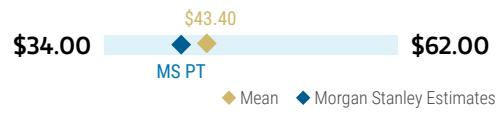

## RISK REWARD CHART AND OPTIONS IMPLIED PROBABILITIES (12M)

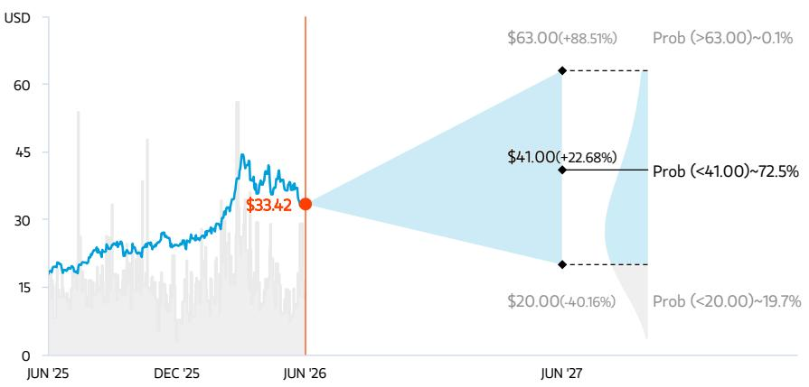  
Key: — Historical Stock Performance ● Current Stock Price ◆ Price Target

Source: Refinitiv, MS, MS Institutional Equities Division. The probabilities of our Bull, Base, and Bear case scenarios playing out were estimated with implied volatility data from the options market as of 25 Jun 2026. All figures are approximate risk-neutral probabilities of the stock reaching beyond the scenario price in either three-months' or one-years' time. View explanation of Options Probabilities methodology here

## UNDERWEIGHT THESIS

■ Further upside hinges upon successful de-risking of future Suriname developments. While Suriname reached its first FID, we believe more extensive exploration and appraisal work is required to de-risk future potential phases.

■ Challenges in operational assets. APA plans to cease operations in the North Sea (due to unfavorable regulatory regime & high taxes) well ahead of the original timeline. In addition, we continue to see a challenged long-term outlook for gas-rich Alpine High.

■ Targeting \$450 MM in annual cost savings by YE26 in capital, LOE, and overhead. While this is a positive development, investors need to see clear progress toward these goals before giving credit to stronger FCF

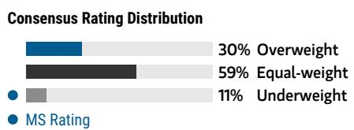  
Source: Refinitiv, MS

## BULL CASE

## \$63.00 BASE CASE

## 3.7x 2027e EV/EBITDAX of \$6.4 B

Long term (2028+) bull case price deck: WTI \$90, HH \$4.25. Price target is 50/50 2027e E&P target multiple of 3.0x EV/EBITDAX (\$54) and NAV of \$72.

## 3.6x 2027e E&P EV/EBITDAX of \$4.8 B

Long-term (2028+) base case price deck: WTI \$70, HH \$3.75. Price target is 50/50 2027e E&P target multiple of 3.0x EV/EBITDAX (\$34) and NAV of \$48.

## \$41.00 BEAR CASE

\$20.00

## 3.5x 2027e EV/EBITDAX of \$3.1 B

Long term (2028+) bear case price deck: WTI \$50, HH \$3.25. Price target is 50/50 2027e E&P target multiple of 3.0x EV/EBITDAX (\$16) and NAV of \$24.

## Risk Reward – APA Corp (APA.O)

## KEY EARNINGS INPUTS

<table><tr><td>Drivers</td><td>Dec 2025</td><td>Dec 2026e</td><td>Dec 2027e</td><td>Dec 2028e</td></tr><tr><td>Oil Production (Mbbl/d)</td><td>237</td><td>219</td><td>210</td><td>220</td></tr><tr><td>Total Production (Mboe/d)</td><td>464</td><td>430</td><td>433</td><td>449</td></tr><tr><td>Realized Oil Price ($)</td><td>66.89</td><td>79.93</td><td>71.26</td><td>69.01</td></tr><tr><td>Realized Gas Price ($)</td><td>2.35</td><td>2.17</td><td>3.22</td><td>3.38</td></tr><tr><td>EBITDA Margin per Boe ($)</td><td>30.30</td><td>38.02</td><td>30.15</td><td>29.07</td></tr></table>

## INVESTMENT DRIVERS

\- Commodity prices.

\- Suriname exploration well results.

\- Capital efficiency.

## GLOBAL REVENUE EXPOSURE

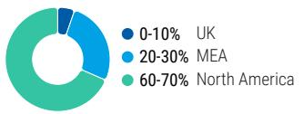  
Source: MS Estimate View explanation of regional hierarchies here

## MS ALPHA MODELS

<table><tr><td>1/5BEST</td><td>24 MonthHorizon</td><td>1/5MOST</td><td>3 MonthHorizon</td></tr></table>

Source: Refinitiv, FactSet, MS; 1 is the highest favored Quintile and 5 is the least favored Quintile

## RISKS TO PT/RATING

## RISKS TO UPSIDE

• Higher commodity prices.

\- De-risking of offshore Suriname resource through successful exploration.

• Service cost deflation.

## RISKS TO DOWNSIDE

\- Lower commodity prices.

\- Suriname exploration well results: dry holes or low value gas resource.

• Service cost inflation.

## OWNERSHIP POSITIONING

<table><tr><td>Inst. Owners, % Active</td><td>45.6%</td></tr><tr><td>HF Sector Long/Short Ratio</td><td>1.7x</td></tr><tr><td>HF Sector Net Exposure</td><td>4.7%</td></tr></table>

Refinitiv; MSPB Content. Includes certain hedge fund exposures held with MSPB. Information may be inconsistent with or may not reflect broader market trends. Long/Short Ratio = Long Exposure / Short exposure. Sector % of Total Net Exposure = (For a particular sector: Long Exposure - Short Exposure) / (Across all sectors: Long Exposure – Short Exposure).

MS ESTIMATES VS. CONSENSUS  
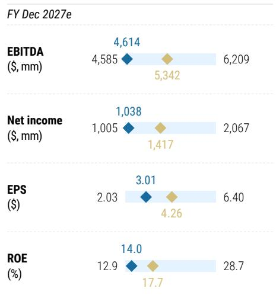  
Mean MS Estimates Source: Refinitiv, MS

## Risk Reward – Antero Resources Corp (AR.N)

Peer-leading FCF with LNG buildout exposure.

## PRICE TARGET \$48.00

Base case of \$48/sh, which is a 50/50 blend of (1) 5.0x 2027e E&P EV/EBITDA of \$46/sh, and (2) NAV of \$50/sh (10.1% discount rate).

Consensus Price Target Distribution

Source: Refinitiv, MS

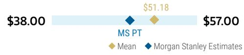

## RISK REWARD CHART AND OPTIONS IMPLIED PROBABILITIES (12M)

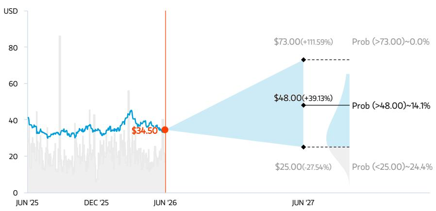

## OVERWEIGHT THESIS

■ Exposure to LNG fairway. AR sells the majority of its production out of basin, including \~2.1 bcf/d of transport to premium Gulf Coast LNG pricing.

■ Capital efficiency. AR's increased capital efficiency allows for maintenance production levels at \~25% lower y/y spend which it expects to largely maintain on a run-rate basis.

■ FCF growth. After lagging peers over the last year, AR offers the highest '26 FCF yield within our gas coverage, supported by the HG Energy transaction which is accretive to FCF, net asset value, and extends inventory life by \~5 years.

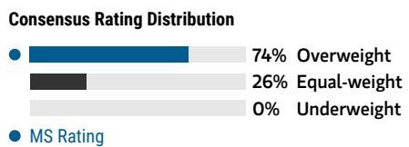  
Source: Refinitiv, MS  
Key: — Historical Stock Performance ● Current Stock Price ◆ Price Target

Source: Refinitiv, MS, MS Institutional Equities Division. The probabilities of our Bull, Base, and Bear case scenarios playing out were estimated with implied volatility data from the options market as of 25 Jun 2026. All figures are approximate risk-neutral probabilities of the stock reaching beyond the scenario price in either three-months' or one-years' time. View explanation of Options Probabilities methodology here

## BULL CASE

## 6.1x 2027e EBITDA

## \$73.00 BASE CASE

Long-term (2028+) bull case price deck: WTI \$90, HH \$4.25. Bull case of \$73/share is a 50/50 blend of 1) 4.75x 2027e E&P EV/EBITDA of \$66/sh and 2) net asset value (NAV) of \$81/sh.

## 5.9x 2027e EBITDA

Long-term (2028+) base case price deck: WTI \$70, HH \$3.75. Base case of \$48/sh, which is a 50/50 blend of (1) 5.0x 2027e E&P EV/EBITDA of \$46/sh, and (2) NAV of \$50/sh (10.1% discount rate).

## \$48.00 BEAR CASE

## \$25.00

## 5.5x 2027e EBITDA

Long-term (2028+) bear case price deck: WTI \$50, HH \$3.25. Bear case of \$25/share is a 50/50 blend of 1) 5.25x 2027e E&P EV/EBITDA of \$30/sh and 2) net asset value (NAV) of \$19/sh.

## Risk Reward – Antero Resources Corp (AR.N)

## KEY EARNINGS INPUTS

<table><tr><td>Drivers</td><td>Dec 2025</td><td>Dec 2026e</td><td>Dec 2027e</td><td>Dec 2028e</td></tr><tr><td>Oil Production (Mbbl/d)</td><td>8</td><td>11</td><td>14</td><td>16</td></tr><tr><td>Total Production (Mboe/d)</td><td>574</td><td>685</td><td>749</td><td>785</td></tr><tr><td>Realized Oil Price ($)</td><td>51.76</td><td>62.76</td><td>55.29</td><td>55.29</td></tr><tr><td>Realized Gas Price ($)</td><td>3.53</td><td>3.69</td><td>3.67</td><td>3.78</td></tr><tr><td>EBITDAX Margin per Boe ($)</td><td>8</td><td>10</td><td>10</td><td>11</td></tr></table>

## INVESTMENT DRIVERS

\- Commodity prices

• Capex & Capital efficiency

\- Ability to execute on cost saving targets

\- AM share price

## GLOBAL REVENUE EXPOSURE

Source: MS Estimate View explanation of regional hierarchies here

## MS ALPHA MODELS

<table><tr><td>1/5BEST</td><td>24 MonthHorizon</td><td>1/5MOST</td><td>3 MonthHorizon</td></tr></table>

Source: Refinitiv, FactSet, MS; 1 is the highest favored Quintile and 5 is the least favored Quintile

## RISKS TO PT/RATING

RISKS TO UPSIDE

• Higher commodity prices and differentials.

\- Improved well performance.

\- Execution on further asset sales and improved capital efficiency.

## RISKS TO DOWNSIDE

\- Downside to production outlook.

\- Inflation.

## OWNERSHIP POSITIONING

<table><tr><td>Inst. Owners, % Active</td><td>57.4%</td><td></td><td></td><td></td></tr><tr><td>HF Sector Long/Short Ratio</td><td>1.7x</td><td></td><td></td><td></td></tr><tr><td>HF Sector Net Exposure</td><td>4.7%</td><td></td><td></td><td></td></tr></table>

Refinitiv; MSPB Content. Includes certain hedge fund exposures held with MSPB. Information may be inconsistent with or may not reflect broader market trends. Long/Short Ratio = Long Exposure / Short exposure. Sector % of Total Net Exposure = (For a particular sector: Long Exposure - Short Exposure) / (Across all sectors: Long Exposure – Short Exposure).

MS ESTIMATES VS. CONSENSUS  
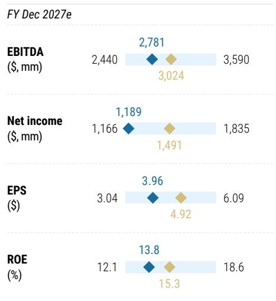  
Mean MS Estimates Source: Refinitiv, MS

## Risk Reward – Chevron Corporation (CVX.N)

Strong acquisition in HES with attractive rate of change into 2026.

## PRICE TARGET \$210.00

Base case of \$210/share which is a 50/50 blend of 1) a target multiple of 8.5x 2027e EV/DACF (\$220/share) and 2) our discounted cash flow value of \$199/share (with a WACC of 8.1% and terminal EV/EBITDA multiple of 6.2x).

Consensus Price Target Distribution

Source: Refinitiv, MS

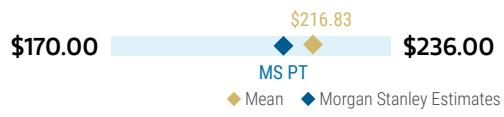

## RISK REWARD CHART AND OPTIONS IMPLIED PROBABILITIES (12M)

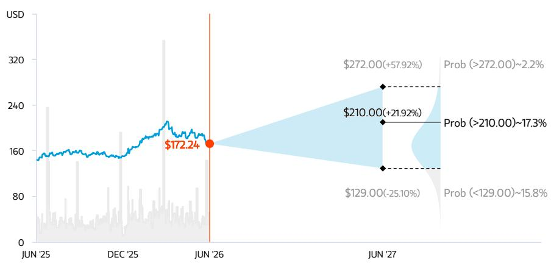  
Key: — Historical Stock Performance ● Current Stock Price ◆ Price Target  
Source: Refinitiv, MS, MS Institutional Equities Division. The probabilities of our Bull, Base, and Bear case scenarios playing out were estimated with implied volatility data from the options market as of 25 Jun 2026. All figures are approximate risk-neutral probabilities of the stock reaching beyond the scenario price in either three-months' or one-years' time. View explanation of Options Probabilities methodology here

## OVERWEIGHT THESIS

■ HES strengthens outlook. Through its acquisition of HES, CVX gains exposure to rising high margin volumes in Guyana, driving a 1.5% bump in the company's oil production CAGR for the remainder of the decade.

■ Strong rate of change into 2026. By 2026, CVX expects \$12.5 B of FCF uplift from TCO, GoA, Permian, cost cutting initiatives, and HES. This leads to a FCF yield of 10% in '26 (at \$78 WTI).

■ Durable FCF growth. With its '25 Investor Day, CVX highlighted a >10% FCF CAGR through 2030 underpinned by a low-risk, high-confidence set of investment opportunities.

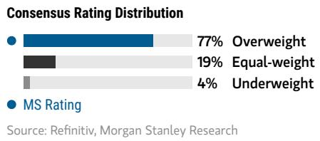  
Source: Refinitiv, MS

## Risk Reward Themes

Self-help: Positive
View descriptions of Risk Rewards Themes here

## BULL CASE

\$272.00

## 9.5x 2027e EV/DACF of \$60.5 B

Bull case of \$272 is based on a 50/50 blend of 1) a target multiple of 8.5x 2026e EV/DACF (\$276/share) and 2) our discounted cash flow value of \$269/share. Scenario assumes \$90.00 WTI, \$95 Brent, \$4.25 Henry Hub, and refining margins increase \~10%.

## BASE CASE

## 8.7x 2027e EV/DACF.

Base case of \$210/sh which is a 50/50 blend of 1) a target multiple of 8.5x 2027e EV/DACF (\$220/share) and 2) our discounted cash flow value of \$199/share (with a WACC of 8.1% and terminal EV/EBITDA multiple of 6.2x). Scenario assumes long-term (2028+) \$70.00 WTI, \$75 Brent, \$3.75 Henry Hub.

## \$210.00 BEAR CASE

\$129.00

## 8.1x 2027e EV/DACF of \$35.6 B

Bear case of \$129 is based on a 50/50 blend of 1) a target multiple of 8.5x 2027e EV/DACF (\$135/share) and 2) our discounted cash flow value of \$123/share. Scenario assumes \$50.00 WTI, \$55 Brent, \$3.25 Henry Hub, and refining margins decline \~10%.

## Risk Reward – Chevron Corporation (CVX.N)

## KEY EARNINGS INPUTS

<table><tr><td>Drivers</td><td>Dec 2025</td><td>Dec 2026e</td><td>Dec 2027e</td><td>Dec 2028e</td></tr><tr><td>Oil Production (Mbbl/d)</td><td>1,827</td><td>2,013</td><td>2,097</td><td>2,094</td></tr><tr><td>Total Production (Mboe/d)</td><td>3,722</td><td>4,008</td><td>4,108</td><td>4,096</td></tr><tr><td>Realized Oil Price ($)</td><td>62.68</td><td>75.19</td><td>66.47</td><td>66.64</td></tr><tr><td>Realized Gas Price ($)</td><td>5.22</td><td>5.67</td><td>5.42</td><td>5.61</td></tr><tr><td>EBITDA Margin per Boe ($)</td><td>30.48</td><td>41.04</td><td>38.59</td><td>37.20</td></tr></table>

## INVESTMENT DRIVERS

\- Return of cash

\- Capex

\- Capital efficiency

\- Commodity prices including oil & gas, LNG, crack spreads, and chemicals margins

\- Major capital projects including Tengiz and unconventionals in the Permian, Canada, and Argentina

## GLOBAL REVENUE EXPOSURE

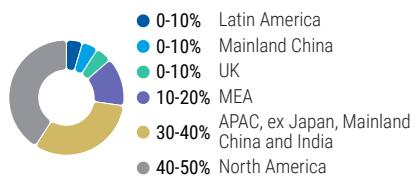  
Source: MS Estimate View explanation of regional hierarchies here

## MS ALPHA MODELS

<table><tr><td>1/5BEST</td><td>24 MonthHorizon</td><td>1/5MOST</td><td>3 MonthHorizon</td></tr></table>

Source: Refinitiv, FactSet, MS; 1 is the highest favored Quintile and 5 is the least favored Quintile

## RISKS TO PT/RATING

## RISKS TO UPSIDE

\- Higher commodity prices, including liquefied natural gas (LNG)

• Outperformance of Guyana development

\- Addressing long term growth questions through M&A or exploration program

\- Permian well performance improvements

## RISKS TO DOWNSIDE

\- Lower commodity prices

\- TCO concession agreement is not renewed early next decade

\- Long-term upstream growth lags peers

\- Geopolitical risk

## OWNERSHIP POSITIONING

<table><tr><td>Inst. Owners, % Active</td><td>45.4%</td></tr><tr><td>HF Sector Long/Short Ratio</td><td>1.7x</td></tr><tr><td>HF Sector Net Exposure</td><td>4.7%</td></tr></table>

Refinitiv; MSPB Content. Includes certain hedge fund exposures held with MSPB. Information may be inconsistent with or may not reflect broader market trends. Long/Short Ratio = Long Exposure / Short exposure. Sector % of Total Net Exposure = (For a particular sector: Long Exposure - Short Exposure) / (Across all sectors: Long Exposure – Short Exposure).

MS ESTIMATES VS. CONSENSUS

<table><tr><td colspan="3">FY Dec 2027e</td></tr><tr><td rowspan="2">EBITDA ($, mm)</td><td rowspan="2">44,522</td><td>57,865</td></tr><tr><td>58,462</td></tr><tr><td rowspan="2">Net income ($, mm)</td><td rowspan="2">15,558</td><td>24,164</td></tr><tr><td>23,611</td></tr><tr><td rowspan="2">EPS ($)</td><td rowspan="2">8.29</td><td>12.67</td></tr><tr><td>12.39</td></tr><tr><td rowspan="2">ROE (%)</td><td rowspan="2">10.1</td><td>12.9</td></tr><tr><td>12.3</td></tr></table>

Source: Refinitiv, MS

## Risk Reward – Chord Energy Corporation (CHRD.O)

Durable FCF generation and outsized shareholder returns at discount vs peers

## PRICE TARGET \$169.00

Base case of \$169/sh, which is a 50/50 blend of 1) a target multiple of 3.5x 2027e EV/EBITDA (\$176/sh) and 2) our NAV of \$161/sh.

Consensus Price Target Distribution

Source: Refinitiv, MS

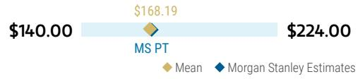

## RISK REWARD CHART

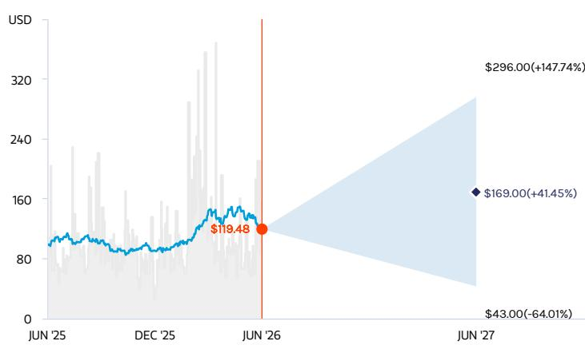  
Key: — Historical Stock Performance ● Current Stock Price ◆ Price Target  
Source: Refinitiv, MS

## OVERWEIGHT THESIS

■ Enhanced scale in the Bakken at attractive valuation. We estimate CHRD trades at a discount to its peers on '26 EV/EBITDAX.
■ CHRD offers strong FCF generation across a range of oil prices and at \$70 WTI in 2027, we see a 15% FCF yield (oil E&P average of 12%) and 10% shareholder return yield (peer average of 6%).

We expect CHRD to continue realizing capital efficiency gains and see a positive rate-of-change on its longer lateral program. For 2026, CHRD expects 80% of its planned wells to be 3- to 4-mile laterals (vs. \~45% last year).

  
Source: Refinitiv, MS

## BULL CASE

## 4.5x 2027e EV/EBITDAX

## \$296.00 BASE CASE

Long-term (2028+) Bull Price Deck: WTI \$90, HH \$4.25 Bull case of \$296/sh is a 50/50 blend of 1) a target multiple of 3.5x 2027e EV/EBITDAX (\$284/sh) and 2) our NAV of \$308/sh.

## 3.8x 2027e EV/EBITDAX

Long-term (2028+) Base Price Deck: WTI \$70, HH \$3.75. Base case of \$169/sh, which is a 50/50 blend of 1) a target multiple of 3.5x 2027e EV/EBITDA (\$176/sh) and 2) our NAV of \$161/sh.

## \$169.00 BEAR CASE

\$43.00

## 2.5x 2027e EV/EBITDAX

Long-term (2028+) Bear Price Deck: WTI \$50, HH \$3.25. Bear case of \$43/sh is a 50/50 blend of 1) a target multiple of 3.5x 2027e EV/EBITDAX (\$72/sh) and 2) our NAV of \$12/sh.

## Risk Reward – Chord Energy Corporation (CHRD.O)

## KEY EARNINGS INPUTS

<table><tr><td>Drivers</td><td>Dec 2025</td><td>Dec 2026e</td><td>Dec 2027e</td><td>Dec 2028e</td></tr><tr><td>Oil Production (Mbbl/d)</td><td>155</td><td>162</td><td>162</td><td>162</td></tr><tr><td>Total Production (Mboe/d)</td><td>277</td><td>278</td><td>276</td><td>277</td></tr><tr><td>Realized Oil Price ($)</td><td>63.62</td><td>76.64</td><td>68.19</td><td>68.25</td></tr><tr><td>Realized Gas Price ($)</td><td>1.51</td><td>1.57</td><td>1.76</td><td>1.96</td></tr><tr><td>EBITDA Margin per Boe ($)</td><td>16.43</td><td>30.07</td><td>25.86</td><td>26.27</td></tr></table>

## INVESTMENT DRIVERS

\- Commodity prices

• Capex & Capital efficiency

• Incremental well cost savings - Three-mile lateral inventory expansion from \~40% currently

## GLOBAL REVENUE EXPOSURE

View explanation of regional hierarchies here

## MS ALPHA MODELS

<table><tr><td>1/5BEST</td><td>24 MonthHorizon</td><td>1/5MOST</td><td>3 MonthHorizon</td></tr></table>

Source: Refinitiv, FactSet, MS; 1 is the highest favored Quintile and 5 is the least favored Quintile

## RISKS TO PT/RATING

## RISKS TO UPSIDE

\- Higher commodity prices and improved differentials.

\- Improved well performance.

\- Higher than expected % of the three-mile lateral inventory in the Bakken

\- Better than expected well results and economics of the 4-mile laterals

## RISKS TO DOWNSIDE

\- Lower commodity prices and wider differentials.

\- Worse than expected well performance.

\- Increased leverage

## OWNERSHIP POSITIONING

<table><tr><td>Inst. Owners, % Active</td><td>53.5%</td></tr><tr><td>HF Sector Long/Short Ratio</td><td>1.7x</td></tr><tr><td>HF Sector Net Exposure</td><td>4.7%</td></tr></table>

Refinitiv; MSPB Content. Includes certain hedge fund exposures held with MSPB. Information may be inconsistent with or may not reflect broader market trends. Long/Short Ratio = Long Exposure / Short exposure. Sector % of Total Net Exposure = (For a particular sector: Long Exposure - Short Exposure) / (Across all sectors: Long Exposure – Short Exposure).

MS ESTIMATES VS. CONSENSUS

<table><tr><td colspan="3">FY Dec 2027e</td></tr><tr><td rowspan="2">EBITDA ($, mm)</td><td rowspan="2">2,286</td><td>2,602</td></tr><tr><td>2,766</td></tr><tr><td rowspan="2">Net income ($, mm)</td><td rowspan="2">428</td><td>821</td></tr><tr><td>824</td></tr><tr><td rowspan="2">EPS ($)</td><td rowspan="2">9.29</td><td>16.29</td></tr><tr><td>15.21</td></tr><tr><td rowspan="2">ROE (%)</td><td rowspan="2">8.6</td><td>9.7</td></tr><tr><td>10.1</td></tr></table>

Source: Refinitiv, MS

Source: Refinitiv, MS

## Risk Reward – ConocoPhillips (COP.N)

High quality, low cost portfolio underpins attractive FCF and return of cash

## PRICE TARGET \$146.00

Base case of \$146/share, which is a 50/50 blend of 1) a target multiple of 6.0x 2027e EV/EBITDA (\$143/share) and 2) our NAV of \$150/share (with a WACC of 8.7%).

Consensus Price Target Distribution

Source: Refinitiv, MS

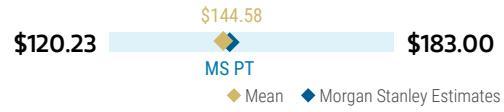

## RISK REWARD CHART AND OPTIONS IMPLIED PROBABILITIES (12M)

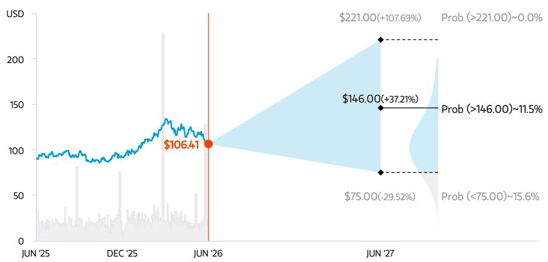  
Key: — Historical Stock Performance ● Current Stock Price ◆ Price Target

Source: Refinitiv, MS, MS Institutional Equities Division. The probabilities of our Bull, Base, and Bear case scenarios playing out were estimated with implied volatility data from the options market as of 25 Jun 2026. All figures are approximate risk-neutral probabilities of the stock reaching beyond the scenario price in either three-months' or one-years' time. View explanation of Options Probabilities methodology here

## OVERWEIGHT THESIS

## ■ COP checks all the boxes for sustained

outperformance: excellent management, disciplined investment, and consistent return of cash coupled with a high quality, low cost portfolio that can deliver an attractive combination of FCF and shareholder returns.

■ Strong growth ahead. Delivery of long term projects (Alaska, Qatar, and Port Arthur LNG) underpin an impressive FCF CAGR of 14% through the rest of the decade.

■ Resilient to lower commodity prices. COP's strong cash balance provides financial flexibility and resiliency to lower prices while its unhedged exposure allows for upside participation.

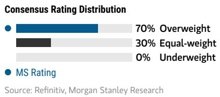

## Risk Reward Themes

Self-help: Positive
View descriptions of Risk Rewards Themes here

## BULL CASE

## 7.3x 2027e EV/EBITDA of \$40 B

## \$221.00 BASE CASE

Bull Price deck: WTI \$90.00, Brent \$95.00, HH \$4.25. Bull case of \$221/share, which is a 50/50 blend of 1) a target multiple of 6.0x 2027e EV/EBITDA (\$216/share) and 2) our NAV of \$226/share.

## 6.8x 2027e EV/EBITDA of \$30 B

## \$146.00 BEAR CASE

Long-term (2028+) Base Price deck: WTI \$70.00, Brent \$75.00, HH \$3.75. Base case of \$146/share, which is a 50/50 blend of 1) a target multiple of 6.0x 2027e EV/EBITDA (\$143/share) and 2) our NAV of \$150/share (with a WACC of 8.7%).

\$75.00

## 5.5x 2027e EV/EBITDA of \$20 B

Bear Price deck: WTI \$50.00, Brent \$55.00, HH \$3.25. Bear case of \$75/share, which is a 50/50 blend of 1) a target multiple of 6.0x 2027e EV/EBITDA (\$86/share) and 2) our NAV of \$63/share.

◆ Mean ◆ MS Estimates
Source: Refinitiv, MS

## Risk Reward – ConocoPhillips (COP.N)

## KEY EARNINGS INPUTS

<table><tr><td>Drivers</td><td>Dec 2025</td><td>Dec 2026e</td><td>Dec 2027e</td><td>Dec 2028e</td></tr><tr><td>Oil Production (Mbbl/d)</td><td>1,279</td><td>1,223</td><td>1,264</td><td>1,282</td></tr><tr><td>Total Production (Mboe/d)</td><td>2,375</td><td>2,302</td><td>2,394</td><td>2,431</td></tr><tr><td>Realized Oil Price ($)</td><td>65.73</td><td>79.30</td><td>71.09</td><td>71.26</td></tr><tr><td>Realized Gas Price ($)</td><td>4.33</td><td>4.54</td><td>4.69</td><td>5.07</td></tr><tr><td>EBITDA Margin per Boe ($)</td><td>29.34</td><td>36.20</td><td>33.43</td><td>34.25</td></tr></table>

## INVESTMENT DRIVERS

\- Commodity prices

\- Capex

\- Capital efficiency

\- Return of cash

• Major capital project execution including Alaska and North America unconventionals

## GLOBAL REVENUE EXPOSURE

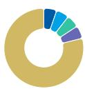

0-10% APAC, ex Japan, Mainland China and India

0-10% Europe ex UK

0-10% MEA

0-10% Mainland China

70-80% North America

Source: MS Estimate View explanation of regional hierarchies here

## MS ALPHA MODELS

<table><tr><td>1/5BEST</td><td>24 MonthHorizon</td><td>1/5MOST</td><td>3 MonthHorizon</td></tr></table>

Source: Refinitiv, FactSet, MS; 1 is the highest favored Quintile and 5 is the least favored Quintile

## RISKS TO PT/RATING

RISKS TO UPSIDE

• Higher commodity prices

• Upside to Alaska resource discovery

• Better well performance in Lower 48

## RISKS TO DOWNSIDE

\- Lower commodity prices

\- Cost inflation

\- Alaska discovery has less potential resources than expected

• Federal acreage exposure in Alaska

\- Worse than expected well results in the Eagle Ford, Permian, and Bakken

## OWNERSHIP POSITIONING

<table><tr><td>Inst. Owners, % Active</td><td>55.1%</td></tr><tr><td>HF Sector Long/Short Ratio</td><td>1.7x</td></tr><tr><td>HF Sector Net Exposure</td><td>4.7%</td></tr></table>

Refinitiv; MSPB Content. Includes certain hedge fund exposures held with MSPB. Information may be inconsistent with or may not reflect broader market trends. Long/Short Ratio = Long Exposure / Short exposure. Sector % of Total Net Exposure = (For a particular sector: Long Exposure - Short Exposure) / (Across all sectors: Long Exposure – Short Exposure).

MS ESTIMATES VS. CONSENSUS

<table><tr><td colspan="3">FY Dec 2027e</td></tr><tr><td rowspan="2">EBITDA ($, mm)</td><td rowspan="2">25,700</td><td>28,827</td></tr><tr><td>29,831</td></tr><tr><td rowspan="2">Net income ($, mm)</td><td rowspan="2">6,766</td><td>10,385</td></tr><tr><td>10,518</td></tr><tr><td rowspan="2">EPS ($)</td><td rowspan="2">6.65</td><td>9.16</td></tr><tr><td>9.12</td></tr><tr><td rowspan="2">ROE (%)</td><td rowspan="2">9.1</td><td>16.1</td></tr><tr><td>14.2</td></tr></table>

## Risk Reward – Comstock Resources Inc. (CRK.N)

Exposure to LNG fairway but Western Haynesville economics still unclear

## PRICE TARGET \$16.00

Long-term (2028+) base case price deck: WTI \$65, HH \$3.75. Base case of \$16/share is a 50/50 blend of 1) 6.0x 2027e E&P EV/EBITDA of \$16/sh and 2) net asset value (NAV) of \$16/sh (10.2% discount rate).

## Consensus Price Target Distribution

Source: Refinitiv, MS

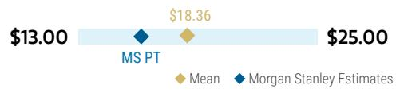

## RISK REWARD CHART

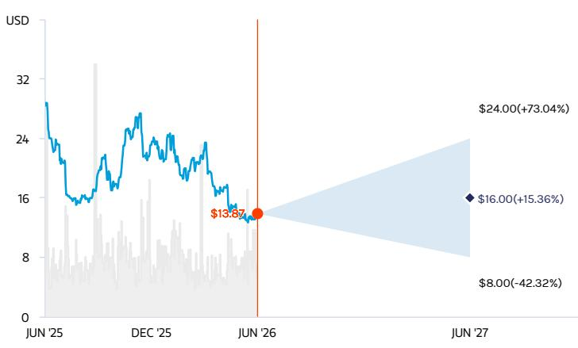  
Key: — Historical Stock Performance ● Current Stock Price ◆ Price Target  
Source: Refinitiv, MS

## EQUAL-WEIGHT THESIS

\- Exposure to Haynesville and Bossier shale regions in LA and TX provide access to growing LNG fairway.
- Exploratory Western Haynesville opportunity offers long-term growth, but economics and productivity remain unclear.
- Jerry Jones, owner of the Dallas Cowboys Football Team, holds majority stake in CRK (71%).
- While FCF/equity improves from -5% in '26 to -1% in '28, CRK lags peers.

## Consensus Rating Distribution

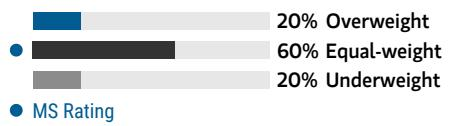  
Source: Refinitiv, MS

## BULL CASE

## 2.4x 2027e EBITDA

## \$24.00 BASE CASE

Long-term (2027+) bull case price deck: WTI \$90, HH \$4.25. Bull case of \$24/share is a 50/50 blend of 1) 6.0x 2027e E&P EV/EBITDA of \$22/sh and 2) net asset value (NAV) of \$26/sh.

## 0.8x 2027e EBITDAX

Long-term (2028+) base case price deck: WTI \$65, HH \$3.75. Base case of \$16/share is a 50/50 blend of 1) 6.0x 2027e E&P EV/EBITDA of \$16/sh and 2) net asset value (NAV) of \$16/sh (10.2% discount rate).

## \$16.00 BEAR CASE

\$8.00

## -1.4x 2027e EBITDA

Long-term (2028+) bear case price deck: WTI \$50, HH \$3.25. Bear case of \$8/share is a 50/50 blend of 1) 6.0x 2027e E&P EV/EBITDA of \$10/sh and 2) net asset value (NAV) of \$5/sh.

## Risk Reward – Comstock Resources Inc. (CRK.N)

## KEY EARNINGS INPUTS

<table><tr><td>Drivers</td><td>Dec 2025</td><td>Dec 2026e</td><td>Dec 2027e</td><td>Dec 2028e</td></tr><tr><td>Gas Production (MMcf/d)</td><td>1,234</td><td>1,300</td><td>1,572</td><td>1,771</td></tr><tr><td>Total Production (Mboe/d)</td><td>206</td><td>217</td><td>262</td><td>295</td></tr><tr><td>Realized Oil Price ($)</td><td>61.92</td><td>68.91</td><td>60.99</td><td>60.99</td></tr><tr><td>Realized Gas Price ($)</td><td>3.21</td><td>3.16</td><td>3.23</td><td>3.45</td></tr><tr><td>EBITDAX Margin per Boe ($, mm)</td><td>20.10</td><td>16.62</td><td>14.42</td><td>15.75</td></tr></table>

## INVESTMENT DRIVERS

\- Commodity prices

\- Capex & capital efficiency

• Western Haynesville performance

## GLOBAL REVENUE EXPOSURE

  
Source: MS Estimate View explanation of regional hierarchies here

## MS ALPHA MODELS

<table><tr><td>4/5BEST</td><td>24 MonthHorizon</td><td>3/5MOST</td><td>3 MonthHorizon</td></tr></table>

Source: Refinitiv, FactSet, MS; 1 is the highest favored Quintile and 5 is the least favored Quintile

## RISKS TO PT/RATING

RISKS TO UPSIDE

• Higher commodity prices - Execution on Western Haynesville exploratory play

\- Capex and production efficiencies

• Service cost deflation

## RISKS TO DOWNSIDE

• Lower commodity prices

\- Declining productivity

\- Western Haynesville does not materialize as planned

## OWNERSHIP POSITIONING

<table><tr><td>Inst. Owners, % Active</td><td>30.5%</td><td></td><td></td><td></td></tr><tr><td>HF Sector Long/Short Ratio</td><td>1.7x</td><td></td><td></td><td></td></tr><tr><td>HF Sector Net Exposure</td><td>4.7%</td><td></td><td></td><td></td></tr></table>

Refinitiv; MSPB Content. Includes certain hedge fund exposures held with MSPB. Information may be inconsistent with or may not reflect broader market trends. Long/Short Ratio = Long Exposure / Short exposure. Sector % of Total Net Exposure = (For a particular sector: Long Exposure - Short Exposure) / (Across all sectors: Long Exposure – Short Exposure).

MS ESTIMATES VS. CONSENSUS  
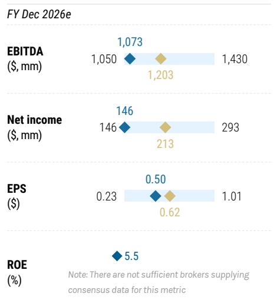  
◆ Mean ◆ MS Estimates
Source: Refinitiv, MS

## Risk Reward – CNX Resources Corp (CNX.N)

Appalachian E&P with FCF below peers

## PRICE TARGET \$32.00

Long-term (2028+) base case price deck: WTI \$70, HH \$3.75. Base case of \$32/share is a 50/50 blend of 1) 5.0x 2027e E&P EV/EBITDA of \$33/sh and 2) net asset value (NAV) of \$31/sh (9.2% discount rate).

Consensus Price Target Distribution Source: Refinitiv, MS

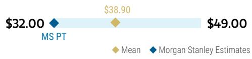

## RISK REWARD CHART AND OPTIONS IMPLIED PROBABILITIES (12M)

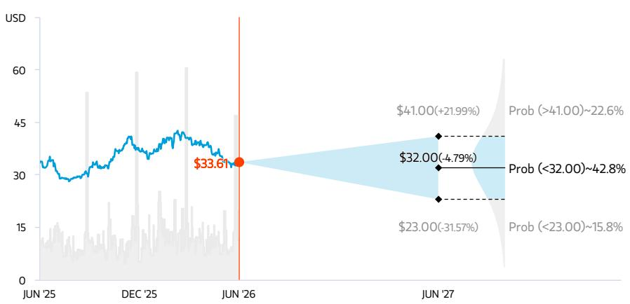

## UNDERWEIGHT THESIS

\- Appalachia-focused production profile with emerging New Technologies business unit. \~70% of production is sold into Appalachian pricepoints.
- Hedge profile limits potential price-related upside, with \~80% of 2026 production hedged -- above gassy E&P peer median of 50%.
- Lower FCF/equity vs. peers near the current strip.

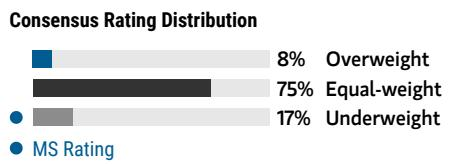  
Source: Refinitiv, MS  
Key: — Historical Stock Performance ● Current Stock Price ◆ Price Target

Source: Refinitiv, MS, MS Institutional Equities Division. The probabilities of our Bull, Base, and Bear case scenarios playing out were estimated with implied volatility data from the options market as of 25 Jun 2026. All figures are approximate risk-neutral probabilities of the stock reaching beyond the scenario price in either three-months' or one-years' time. View explanation of Options Probabilities methodology here

## BULL CASE

\$41.00

## 3.2x 2027e EBITDAX

## BASE CASE

Long-term (2027+) bull case price deck: WTI \$90, HH \$4.25. Bull case of \$45/share is a 50/50 blend of 1) 4.0x 2027e E&P EV/EBITDA of \$37/sh and 2) net asset value (NAV) of \$54/sh.

## 2.5x 2027e EBITDAX

Long-term (2028+) base case price deck: WTI \$70, HH \$3.75. Base case of \$32/share is a 50/50 blend of 1) 5.0x 2027e E&P EV/EBITDA of \$33/sh and 2) net asset value (NAV) of \$31/sh (9.2% discount rate).

## \$32.00 BEAR CASE

\$23.00

## 1.6x 2027e EBITDAX

Long-term (2028+) bear case price deck: WTI \$50, HH \$3.25. Bear case of \$23/share is a 50/50 blend of 1) 5.0x 2027e E&P EV/EBITDA of \$29/sh and 2) net asset value (NAV) of \$17/sh.

## Risk Reward – CNX Resources Corp (CNX.N)

## KEY EARNINGS INPUTS

<table><tr><td>Drivers</td><td>Dec 2025</td><td>Dec 2026e</td><td>Dec 2027e</td><td>Dec 2028e</td></tr><tr><td>Gas Production (MMcf/d)</td><td>1,487</td><td>1,434</td><td>1,456</td><td>1,472</td></tr><tr><td>Total Production (Mboe/d)</td><td>287</td><td>279</td><td>280</td><td>280</td></tr><tr><td>Realized Oil Price ($)</td><td>55.22</td><td>64.17</td><td>56.25</td><td>56.25</td></tr><tr><td>Realized Gas Price ($)</td><td>2.68</td><td>2.47</td><td>2.95</td><td>3.13</td></tr><tr><td>EBITDAX Margin per Boe ($, mm)</td><td>14.86</td><td>13.63</td><td>13.45</td><td>14.42</td></tr></table>

## INVESTMENT DRIVERS

\- Commodity prices

• Capex and capital efficiency

• Execution on New Technologies growth projects

• Appalachian gas demand (in-basin)

## GLOBAL REVENUE EXPOSURE

Source: MS Estimate View explanation of regional hierarchies here

## MS ALPHA MODELS

<table><tr><td>1/5BEST</td><td>24 MonthHorizon</td><td>1/5MOST</td><td>3 MonthHorizon</td></tr></table>

Source: Refinitiv, FactSet, MS; 1 is the highest favored Quintile and 5 is the least favored Quintile

## RISKS TO PT/RATING

RISKS TO UPSIDE

• Higher long-term commodity prices

\- Improved well performance

• Service cost deflation

• Realization of New Technology upside

## RISKS TO DOWNSIDE

• Lower long-term commodity prices

• Service cost inflation

## OWNERSHIP POSITIONING

<table><tr><td>Inst. Owners, % Active</td><td>44%</td><td></td><td></td><td></td></tr><tr><td>HF Sector Long/Short Ratio</td><td>1.7x</td><td></td><td></td><td></td></tr><tr><td>HF Sector Net Exposure</td><td>4.7%</td><td></td><td></td><td></td></tr></table>

Refinitiv; MSPB Content. Includes certain hedge fund exposures held with MSPB. Information may be inconsistent with or may not reflect broader market trends. Long/Short Ratio = Long Exposure / Short exposure. Sector % of Total Net Exposure = (For a particular sector: Long Exposure - Short Exposure) / (Across all sectors: Long Exposure – Short Exposure).

## MS ESTIMATES VS. CONSENSUS

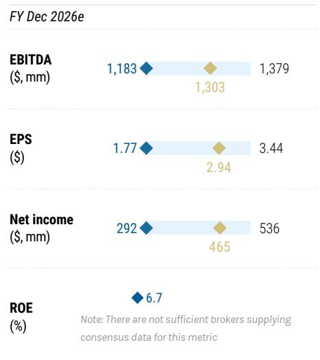  
◆ Mean ◆ MS Estimates
Source: Refinitiv, MS

## Risk Reward – Devon Energy Corp (DVN.N)

Path to re-rating tied to integration and synergy delivery

## PRICE TARGET \$63.00

Price target is a 50/50 blend of 1) a target multiple of 5x 2027e EV/EBITDAX (\$60/sh) and 2) our NAV of \$66/sh.

Consensus Price Target Distribution

Source: Refinitiv, MS

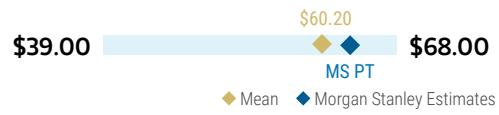

## RISK REWARD CHART AND OPTIONS IMPLIED PROBABILITIES (12M)

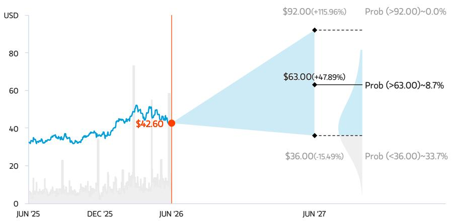  
Key: — Historical Stock Performance ● Current Stock Price ◆ Price Target

Source: Refinitiv, MS, MS Institutional Equities Division. The probabilities of our Bull, Base, and Bear case scenarios playing out were estimated with implied volatility data from the options market as of 25 Jun 2026. All figures are approximate risk-neutral probabilities of the stock reaching beyond the scenario price in either three-months' or one-years' time. View explanation of Options Probabilities methodology here

## OVERWEIGHT THESIS

\- Merger with CTRA nearly doubled production, making DVN the second largest US independent E&P. The combined company now has more than a decade of inventory runway in the Delaware Basin.
- DVN expects >\$1 B of deal synergies by YE27, in addition to DVN's existing \$1 B business optimization initiative.
Management views this target as the floor.
- Shares trade at a \~1.5x discount to peers on '27 EV/EBITDAX while offering 50% higher FCF yield at \$75 WTI. We see a path to re-rating tied to integration and synergy delivery.

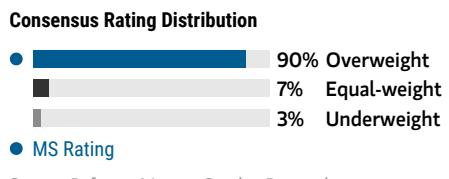  
Source: Refinitiv, MS

## Risk Reward Themes

Self-help: Positive
View descriptions of Risk Rewards Themes here

## BULL CASE

## 5.4x 2027e EV/EBITDAX of \$18.3 B

## \$92.00 BASE CASE

Long-term (2028+) Bull Price Deck: WTI \$90, HH \$4.25. Bull case is a 50/50 blend of 1) a target multiple of 5x 2027e EV/EBITDAX (\$85/sh) and 2) our NAV of \$98/sh.

## 5.2x 2027e EV/EBITDAX of \$13.9 B

Long-term (2028+) Base Price Deck: WTI \$70, HH \$3.75. Base case is a 50/50 blend of 1) a target multiple of 5x 2027e EV/EBITDAX (\$60/sh) and 2) our NAV of \$66/sh.

## \$63.00 BEAR CASE

## \$36.00

## 4.9x 2027e EV/EBITDAX of \$9.5 B

Long-term (2028+) Bear Price Deck: WTI \$50, HH \$3.25. Bear case is a 50/50 blend of 1) a target multiple of 5x 2027e EV/EBITDAX (\$36/sh) and 2) our NAV of \$36/sh.

## Risk Reward – Devon Energy Corp (DVN.N)

## KEY EARNINGS INPUTS

<table><tr><td>Drivers</td><td>Dec 2025</td><td>Dec 2026e</td><td>Dec 2027e</td><td>Dec 2028e</td></tr><tr><td>Oil Production (Mbbl/d)</td><td>389</td><td>501</td><td>573</td><td>582</td></tr><tr><td>Total Production (Mboe/d)</td><td>840</td><td>1,370</td><td>1,674</td><td>1,680</td></tr><tr><td>Realized Oil Price ($)</td><td>63.91</td><td>74.71</td><td>69.64</td><td>69.65</td></tr><tr><td>Realized Gas Price ($)</td><td>1.79</td><td>2.02</td><td>2.11</td><td>2.20</td></tr><tr><td>EBITDAX Margin per Boe ($)</td><td>24.50</td><td>25.70</td><td>22.74</td><td>23.54</td></tr></table>

## INVESTMENT DRIVERS

\- Commodity prices

\- Capex and capital efficiency

• Delaware Basin oil production

\- Return of cash

## GLOBAL REVENUE EXPOSURE

Source: MS Estimate View explanation of regional hierarchies here

## MS ALPHA MODELS

<table><tr><td>1/5BEST</td><td>24 MonthHorizon</td><td>1/5MOST</td><td>3 MonthHorizon</td></tr></table>

Source: Refinitiv, FactSet, MS; 1 is the highest favored Quintile and 5 is the least favored Quintile

## RISKS TO PT/RATING

## RISKS TO UPSIDE

\- Raise \$1 B merger synergies target or pull forward timeline

\- Progress on asset sales and a clearer strategy on portfolio composition

• Better than expected well results

• Higher commodity prices

• Service cost deflation

## RISKS TO DOWNSIDE

\- Not delivering the \$1 B merger synergies target by YE27

\- Weak execution on integration

\- Worse than expected well results

• Lower commodity prices

• Service cost inflation

## OWNERSHIP POSITIONING

<table><tr><td>Inst. Owners, % Active</td><td>43.7%</td></tr><tr><td>HF Sector Long/Short Ratio</td><td>1.7x</td></tr><tr><td>HF Sector Net Exposure</td><td>4.7%</td></tr></table>

Refinitiv; MSPB Content. Includes certain hedge fund exposures held with MSPB. Information may be inconsistent with or may not reflect broader market trends. Long/Short Ratio = Long Exposure / Short exposure. Sector % of Total Net Exposure = (For a particular sector: Long Exposure - Short Exposure) / (Across all sectors: Long Exposure – Short Exposure).

MS ESTIMATES VS. CONSENSUS

<table><tr><td colspan="3">FY Dec 2027e</td></tr><tr><td rowspan="2">EBITDA ($, mm)</td><td rowspan="2">6,472</td><td>13,838</td></tr><tr><td>14,620</td></tr><tr><td rowspan="2">Net income ($, mm)</td><td rowspan="2">1,461</td><td>5,013</td></tr><tr><td>5,916</td></tr><tr><td rowspan="2">EPS ($)</td><td rowspan="2">2.50</td><td>4.52</td></tr><tr><td>5.43</td></tr><tr><td rowspan="2">ROE (%)</td><td rowspan="2">8.5</td><td>12.3</td></tr><tr><td>18.5</td></tr></table>

Mean MS Estimates Source: Refinitiv, MS

## Risk Reward – Diamondback Energy Inc (FANG.O)

Low cost of supply supporting high FCF yield and deleveraging

## PRICE TARGET \$216.00

Base case of \$216/share, which is a 50/50 blend of 1) a target multiple of 6.0x consolidated 2027e EV/EBITDA (\$214/share) and 2) our NAV of \$218/share.

Consensus Price Target Distribution

Source: Refinitiv, MS

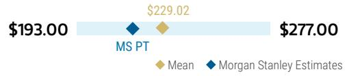

## RISK REWARD CHART AND OPTIONS IMPLIED PROBABILITIES (12M)

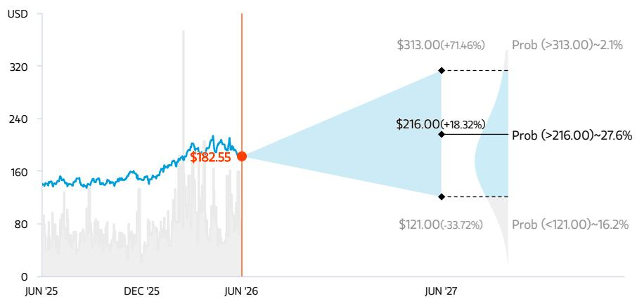

## OVERWEIGHT THESIS

\- Low cost of supply relative to peers. FANG's 2026 FCF breakeven price of \~\$39 (post-base dividend), one of the lowest in our coverage, fortifying FANG as one of the lowest-cost producers in the Permian.
- Strong FCF generation through the cycle. We estimate FANG's FCF yield above peers' median, driven by strong capital efficiency gains, Endeavor synergies trending ahead of plan, and FCF accretion from the Double Eagle acquisition.
- Focus on lower leverage and strong shareholder returns. While FANG's consolidated net debt is expected to increase post the Double Eagle deal and VNOM/Sitio merger, we expect net debt to fall <\$10 B by YE26 at prices near strip.

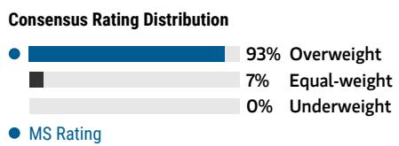  
Source: Refinitiv, MS  
Key: — Historical Stock Performance ● Current Stock Price ◆ Price Target

Source: Refinitiv, MS, MS Institutional Equities Division. The probabilities of our Bull, Base, and Bear case scenarios playing out were estimated with implied volatility data from the options market as of 25 Jun 2026. All figures are approximate risk-neutral probabilities of the stock reaching beyond the scenario price in either three-months' or one-years' time. View explanation of Options Probabilities methodology here

## BULL CASE

## 6.8x 2027 EV/EBITDA

## \$313.00 BASE CASE

Long-term (2027+) Bull Price deck: WTI \$90, HH \$4.25. Bull case of \$313/share, which is a 50/50 blend of 1) a target multiple of 6.0x consolidated 2027e EV/EBITDA (\$324/share) and 2) our NAV of \$302/share. This blended \$313/share bull case equates to 6.8x 2027 EV/EBITDAX.

## 7.2x 2027 EV/EBITDA

Long-term (2027+) Base Price deck: WTI \$70, HH \$3.75. Base case of \$216/share, which is a 50/50 blend of 1) a target multiple of 6.0x consolidated 2027e EV/EBITDA (\$214/share) and 2) our NAV of \$218/share. This blended \$216/share base case equates to 7.2x 2027 EV/EBITDAX.

## \$216.00 BEAR CASE

## \$121.00

## 5.9x 2027 EV/EBITDA

Long-term (2027+) Bear Price deck: WTI \$50, HH \$3.25. Bear case of \$121/share, which is a 50/50 blend of 1) a target multiple of 6.0x consolidated 2027e EV/EBITDA (\$108/share) and 2) our NAV of \$134/share. This blended \$121/share bear case equates to 5.9x 2027 EV/EBITDAX.

## Risk Reward – Diamondback Energy Inc (FANG.O)

## KEY EARNINGS INPUTS

<table><tr><td>Drivers</td><td>Dec 2025</td><td>Dec 2026e</td><td>Dec 2027e</td><td>Dec 2028e</td></tr><tr><td>Oil Production (MBbl/d)</td><td>497</td><td>525</td><td>535</td><td>541</td></tr><tr><td>Total Production (MBoe/d)</td><td>921</td><td>980</td><td>990</td><td>1,000</td></tr><tr><td>Realized Oil Price ($/Bbl)</td><td>63.14</td><td>77.45</td><td>68.37</td><td>68.73</td></tr><tr><td>Realized Gas Price ($/Mcf)</td><td>1.84</td><td>0.77</td><td>2.12</td><td>2.30</td></tr><tr><td>EBITDAX Margin ($/Boe)</td><td>30.56</td><td>35.22</td><td>32.01</td><td>32.53</td></tr></table>

## INVESTMENT DRIVERS

\- Cost efficiencies in drilling & completing wells

\- Increasing return of cash to shareholders

• Capital discipline in higher oil price scenarios

## GLOBAL REVENUE EXPOSURE

  
Source: MS Estimate View explanation of regional hierarchies here

## MS ALPHA MODELS

<table><tr><td>1/5BEST</td><td>24 MonthHorizon</td><td>1/5MOST</td><td>3 MonthHorizon</td></tr></table>

Source: Refinitiv, FactSet, MS; 1 is the highest favored Quintile and 5 is the least favored Quintile

## RISKS TO PT/RATING

## RISKS TO UPSIDE

\- Reduction of operating and development costs
- Improvements to well productivity

## RISKS TO DOWNSIDE

\- Increased leverage

\- Poor execution

## OWNERSHIP POSITIONING

<table><tr><td>Inst. Owners, % Active</td><td>50.7%</td></tr><tr><td>HF Sector Long/Short Ratio</td><td>1.7x</td></tr><tr><td>HF Sector Net Exposure</td><td>4.7%</td></tr></table>

Refinitiv; MSPB Content. Includes certain hedge fund exposures held with MSPB. Information may be inconsistent with or may not reflect broader market trends. Long/Short Ratio = Long Exposure / Short exposure. Sector % of Total Net Exposure = (For a particular sector: Long Exposure - Short Exposure) / (Across all sectors: Long Exposure – Short Exposure).

MS ESTIMATES VS. CONSENSUS  
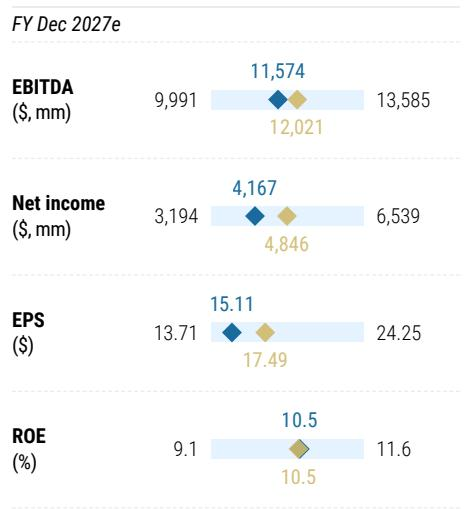  
Mean MS Estimates Source: Refinitiv, MS

## Risk Reward – EOG Resources Inc (EOG.N)

Capital efficiency supports resilient through-the-cycle free cash flow

## PRICE TARGET \$156.00

Base case of \$156/share, which is a 50/50 blend of 1) a target multiple of 6.0x 2027e EV/EBITDA (\$163/sh) and 2) our NAV of \$148/sh.

Consensus Price Target Distribution

Source: Refinitiv, MS

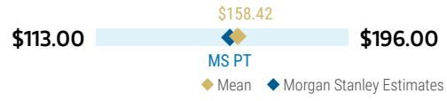

## RISK REWARD CHART AND OPTIONS IMPLIED PROBABILITIES (12M)

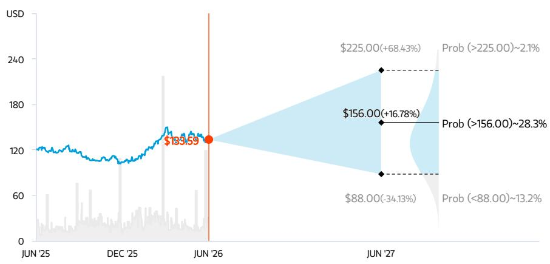  
Key: — Historical Stock Performance ● Current Stock Price ◆ Price Target

## EQUAL-WEIGHT THESIS

\- We believe more execution and data is still needed to prove that the Utica can stand alongside other "foundational" plays like the Eagle Ford & Delaware.
- In the current uncertain market backdrop, we expect the company to remain a defensive staple within the sector due to its scale, strong balance sheet, and higher gas exposure relative to large cap peers.

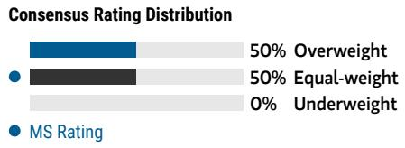  
Source: Refinitiv, MS

Source: Refinitiv, MS, MS Institutional Equities Division. The probabilities of our Bull, Base, and Bear case scenarios playing out were estimated with implied volatility data from the options market as of 25 Jun 2026. All figures are approximate risk-neutral probabilities of the stock reaching beyond the scenario price in either three-months' or one-years' time. View explanation of Options Probabilities methodology here

## BULL CASE

## 6.3 2027e EV/EBITDA

## \$225.00 BASE CASE

Long-term (2027+) Bull Price Deck: WTI: \$90, HH \$4.25. Bull case of \$225/sh, which is a 50/50 blend of 1) a target multiple of 6.0x 2027e EV/EBITDA (\$227/sh) and 2) our NAV of \$222/sh. This blended \$225/sh bull case equates to 6.3x 2027e EV/EBITDA.

## 5.9x 2027e EV/EBITDA

Long-term (2027+) Base Price Deck: WTI: \$70, HH \$3.75. Base case of \$156/sh, which is a 50/50 blend of 1) a target multiple of 6.0x 2027e EV/EBITDA (\$163/sh) and 2) our NAV of \$148/sh. This blended \$156/sh base case equates to 5.9x 2027e EV/EBITDA.

## \$156.00 BEAR CASE

## \$88.00

## 5.3x 2027e EV/EBITDA

Long-term (2027+) Bear Price Deck: WTI: \$50, HH \$3.25. Bear case of \$88/sh, which is a 50/50 blend of 1) a target multiple of 6.0x 2027e EV/EBITDA (\$102/sh) and 2) our NAV of \$75/sh. This blended \$88/sh bear case equates to 5.3x 2027e EV/EBITDA.

## Risk Reward – EOG Resources Inc (EOG.N)

## KEY EARNINGS INPUTS

<table><tr><td>Drivers</td><td>Dec 2025</td><td>Dec 2026e</td><td>Dec 2027e</td><td>Dec 2028e</td></tr><tr><td>Oil Production (MBbl/d)</td><td>522</td><td>549</td><td>553</td><td>561</td></tr><tr><td>Total Production (MBoe/d)</td><td>1,232</td><td>1,399</td><td>1,445</td><td>1,491</td></tr><tr><td>Realized Oil Price ($/Bbl)</td><td>65.62</td><td>81.28</td><td>72.56</td><td>71.50</td></tr><tr><td>Realized Gas Price ($/Mcf)</td><td>3.02</td><td>3.46</td><td>3.43</td><td>3.33</td></tr><tr><td>EBITDAX Margin ($/Boe)</td><td>26.67</td><td>31.97</td><td>27.62</td><td>26.75</td></tr></table>

## INVESTMENT DRIVERS

\- Commodity prices

\- Pace of additions to premium inventory count

\- "Premium" drilling program with wells generating $>30\%$ returns at \$40 WTI

## GLOBAL REVENUE EXPOSURE

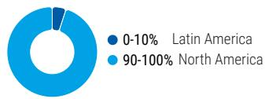  
Source: MS Estimate View explanation of regional hierarchies here

## MS ALPHA MODELS

<table><tr><td>2/5BEST</td><td>24 MonthHorizon</td><td>1/5MOST</td><td>3 MonthHorizon</td></tr></table>

Source: Refinitiv, FactSet, MS; 1 is the highest favored Quintile and 5 is the least favored Quintile

## RISKS TO PT/RATING

## RISKS TO UPSIDE

\- Faster than anticipated reductions in well costs

\- Announcement of new premium play

\- Announcement of accelerated dividend growth or stock repurchase program

## RISKS TO DOWNSIDE

\- Fewer than expected additions to premium inventory

\- Premium locations do not perform as expected

\- Restrictions to operating on Federal acreage

## OWNERSHIP POSITIONING

<table><tr><td>Inst. Owners, % Active</td><td>55.5%</td><td></td><td></td><td></td></tr><tr><td>HF Sector Long/Short Ratio</td><td>1.7x</td><td></td><td></td><td></td></tr><tr><td>HF Sector Net Exposure</td><td>4.7%</td><td></td><td></td><td></td></tr></table>

Refinitiv; MSPB Content. Includes certain hedge fund exposures held with MSPB. Information may be inconsistent with or may not reflect broader market trends. Long/Short Ratio = Long Exposure / Short exposure. Sector % of Total Net Exposure = (For a particular sector: Long Exposure - Short Exposure) / (Across all sectors: Long Exposure – Short Exposure).

MS ESTIMATES VS. CONSENSUS  
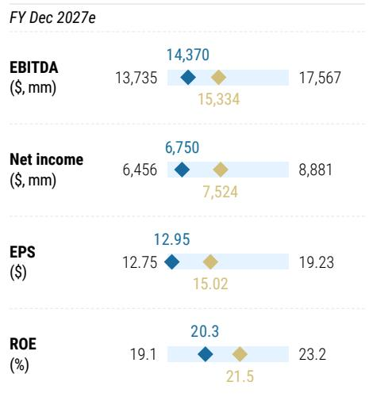  
Mean MS Estimates Source: Refinitiv, MS

## Risk Reward – EQT Corp. (EQT.N)

Resilient FCF with further upside ahead

## PRICE TARGET \$68.00

Long-term (2028+) base case price deck: WTI \$70, HH \$3.75. Base case of \$68/share is a 50/50 blend of 1) 7.0x 2027e E&P EV/EBITDA of \$65/sh and 2) net asset value (NAV) of \$71/sh (10% discount rate).

Consensus Price Target Distribution

Source: Refinitiv, MS

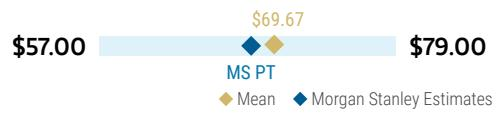

## RISK REWARD CHART AND OPTIONS IMPLIED PROBABILITIES (12M)

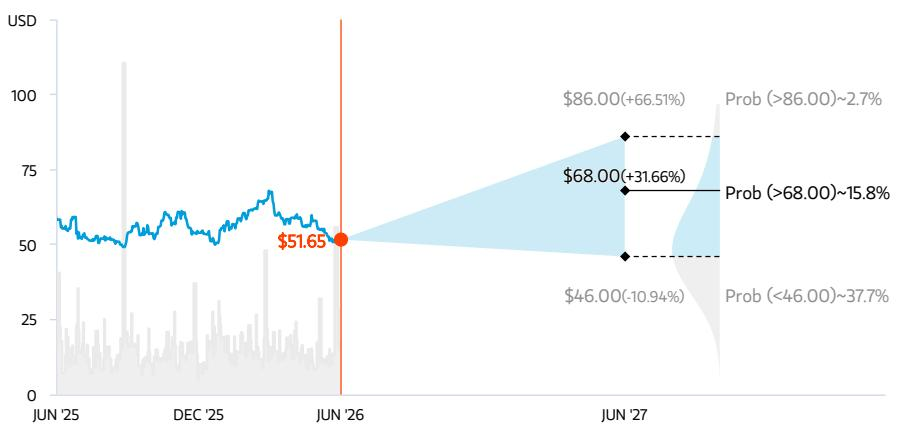  
Key: — Historical Stock Performance ● Current Stock Price ◆ Price Target  
Source: Refinitiv, MS, MS Institutional Equities Division. The probabilities of our Bull, Base, and Bear case scenarios playing out were estimated with implied volatility data from the options market as of 25 Jun 2026. All figures are approximate risk-neutral probabilities of the stock reaching beyond the scenario price in either three-months' or one-years' time. View explanation of Options Probabilities methodology here

## OVERWEIGHT THESIS

\- EQT's peer leading cost structure (\$2.00 breakeven, falling to \$1.80-1.90 over time) and vertical integration are key differentiators vs peers
- We expect shares to continue to re-rate as management executes on further deleveraging, delivery of "upside" synergies, and strategic growth (including potential midstream & power opportunities)
- Differentiated exposure to rising demand from LNG and Power, with a track record of premium-priced gas sales to utilities for power generation needs

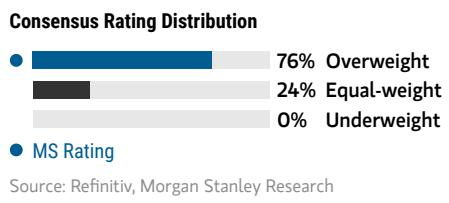

## Risk Reward Themes

Secular Growth: Positive  
Self-help: Positive  
View descriptions of Risk Rewards Themes here

## BULL CASE

## 7.0x 2027e EBITDA

\$86.00

Long-term (2028+) bull case price deck: WTI \$90, HH \$4.25. Bull case of \$86/share is a 50/50 blend of 1) 7.0x 2027e E&P EV/EBITDA of \$83/sh and 2) net asset value (NAV) of \$89/sh.

## BASE CASE

## 6.4x 2027e EBITDAX

Long-term (2028+) base case price deck: WTI \$70, HH \$3.75. Base case of \$68/share is a 50/50 blend of 1) 7.0x 2027e E&P EV/EBITDA of \$65/sh and 2) net asset value (NAV) of \$71/sh (10% discount rate).

## \$68.00 BEAR CASE

\$46.00

## 5.1x 2027e EBITDA

Long-term (2028+) bear case price deck: WTI \$50, HH \$3.25. Bear case of \$46/share is a 50/50 blend of 1) 6.0x 2027e E&P EV/EBITDA of \$40/sh and 2) net asset value (NAV) of \$53/sh.

## Risk Reward – EQT Corp. (EQT.N)

## KEY EARNINGS INPUTS

<table><tr><td>Drivers</td><td>Dec 2025</td><td>Dec 2026e</td><td>Dec 2027e</td><td>Dec 2028e</td></tr><tr><td>Gas Production (MMcf/d)</td><td>6,133</td><td>6,111</td><td>6,145</td><td>6,429</td></tr><tr><td>Total Production (Mboe/d)</td><td>1,088</td><td>1,085</td><td>1,094</td><td>1,146</td></tr><tr><td>Realized Oil Price ($)</td><td>49.09</td><td>64.76</td><td>56.83</td><td>56.83</td></tr><tr><td>Realized Gas Price ($)</td><td>3.08</td><td>3.42</td><td>3.36</td><td>3.78</td></tr><tr><td>EBITDAX Margin per Boe ($, mm)</td><td>15.06</td><td>16.17</td><td>15.42</td><td>17.90</td></tr></table>

## INVESTMENT DRIVERS

\- Commodity prices

\- Capex & Capital efficiency

\- Firm takeaway optimization

## GLOBAL REVENUE EXPOSURE

  
Source: MS Estimate View explanation of regional hierarchies here

## MS ALPHA MODELS

<table><tr><td>1/5BEST</td><td>24 MonthHorizon</td><td>3/5MOST</td><td>3 MonthHorizon</td></tr></table>

Source: Refinitiv, FactSet, MS; 1 is the highest favored Quintile and 5 is the least favored Quintile

## RISKS TO PT/RATING

RISKS TO UPSIDE

• Higher commodity prices

\- Improved well performance

• Service cost deflation

\- Optimization of firm takeaway

## RISKS TO DOWNSIDE

\- Lower commodity prices

• Service cost inflation

## OWNERSHIP POSITIONING

<table><tr><td>Inst. Owners, % Active</td><td>54.9%</td></tr><tr><td>HF Sector Long/Short Ratio</td><td>1.7x</td></tr><tr><td>HF Sector Net Exposure</td><td>4.7%</td></tr></table>

Refinitiv; MSPB Content. Includes certain hedge fund exposures held with MSPB. Information may be inconsistent with or may not reflect broader market trends. Long/Short Ratio = Long Exposure / Short exposure. Sector % of Total Net Exposure = (For a particular sector: Long Exposure - Short Exposure) / (Across all sectors: Long Exposure – Short Exposure).

## MS ESTIMATES VS. CONSENSUS

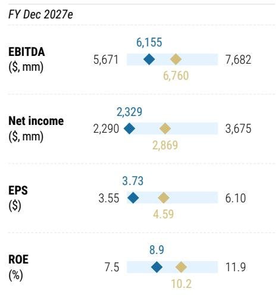  
Mean MS Estimates Source: Refinitiv, MS

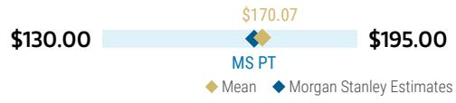

## Risk Reward – Exxon Mobil Corporation (XOM.N)

Pipeline of attractive projects combined with cost cuts drives cash flow growth.

## PRICE TARGET \$168.00

Base case of \$168/share which is a 50/50 blend of 1) a target multiple of 9.0x 2027e EV/DACF (\$168/share) and 2) our discounted cash flow value of \$167/share (with a WACC of 8.0% and terminal EV/EBITDA multiple of 6.6x).

Consensus Price Target Distribution

Source: Refinitiv, MS

## RISK REWARD CHART AND OPTIONS IMPLIED PROBABILITIES (12M)

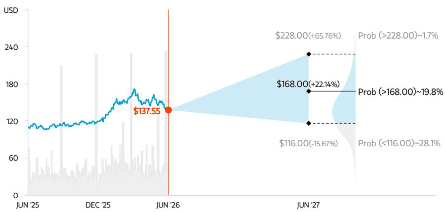  
Key: — Historical Stock Performance ● Current Stock Price ◆ Price Target

Source: Refinitiv, MS, MS Institutional Equities Division. The probabilities of our Bull, Base, and Bear case scenarios playing out were estimated with implied volatility data from the options market as of 25 Jun 2026. All figures are approximate risk-neutral probabilities of the stock reaching beyond the scenario price in either three-months' or one-years' time. View explanation of Options Probabilities methodology here

## OVERWEIGHT THESIS

\- Attractive growth. Earnings should rise by >\$25 B over 2024-2030 (at \$65/bbl Brent), driving a compelling CAGR of \~13%, while CFO would grow at \~10% annually. This is supported by advantaged upstream volume expansion, delivery of high-value projects in Product Solutions, and >\$5 B of additional structural cost savings.

\- Compelling valuation. XOM trades at a 9% FCF 2027 yield at \$70/bbl WTI, \~2x the broader market despite offering comparable growth to large cap stocks in the S&P 500.
- Resiliency to lower prices. XOM's large global integrated operations and strong balance sheet (0.0x 2027 net leverage) make it a clear defensive play in an uncertain macro backdrop

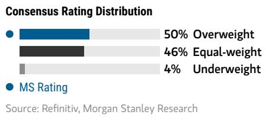  
Source: Refinitiv, MS

## Risk Reward Themes

Renewable Energy: Positive

View descriptions of Risk Rewards Themes here

## BULL CASE

\$228.00

## 10.3x 2027e EV/DACF of \$96 B

Bull case of \$228/sh is based on a 50/50 blend of 1) a target multiple of 9.0x 2027e EV/DACF (\$230/share) and 2) our discounted cash flow value of \$188/share. Scenario assumes \$90.00 WTI, \$95.00 Brent, \$4.25 Henry Hub, and refining, specialty, & chemicals margins increase \~10%.

## BASE CASE

## 8.8x 2027e EV/DACF of \$84.2 B

Base case of \$168/share which is a 50/50 blend of 1) a target multiple of 8.0x 2027e EV/DACF (\$168/share) and 2) our discounted cash flow value of \$167/share (with a WACC of 8.0% and terminal EV/EBITDA multiple of 6.6x). Scenario assumes long-term (2028+) \$70.00 WTI, \$75.00 Brent, \$3.75 Henry Hub.

## \$168.00 BEAR CASE

\$116.00

## 9.1x 2027e EV/DACF of \$57 B

Bear case of \$116/sh is based on a 50/50 blend of 1) a target multiple of 9.0x 2027e EV/DACF (\$124/share) and 2) our discounted cash flow value of \$108/share. Scenario assumes \$50.00 WTI, \$55.00 Brent, \$3.25 Henry Hub, and and refining, specialty, & chemicals margins decline \~10%.

## Risk Reward – Exxon Mobil Corporation (XOM.N)

## KEY EARNINGS INPUTS

<table><tr><td>Drivers</td><td>Dec 2025</td><td>Dec 2026e</td><td>Dec 2027e</td><td>Dec 2028e</td></tr><tr><td>Oil Production (Mbbl/d)</td><td>2,716</td><td>2,793</td><td>3,091</td><td>3,198</td></tr><tr><td>Total Production (Mboe/d)</td><td>4,735</td><td>4,657</td><td>5,051</td><td>5,207</td></tr><tr><td>Realized Oil Price ($)</td><td>60.39</td><td>75.73</td><td>67.44</td><td>67.59</td></tr><tr><td>Realized Gas Price ($)</td><td>6.38</td><td>5.62</td><td>5.24</td><td>4.83</td></tr><tr><td>EBITDA Margin per Boe ($)</td><td>39.49</td><td>55.62</td><td>53.07</td><td>54.34</td></tr></table>

## INVESTMENT DRIVERS

\- Capex

\- Capital efficiency

\- Commodity prices including oil & gas, LNG, crack spreads, and chemicals margins

• Major capital projects including Guyana, Permian, Brazil, Papua New Guinea LNG, Mozambique

## GLOBAL REVENUE EXPOSURE

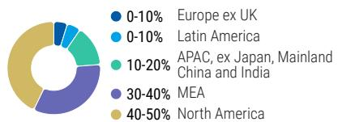  
Source: MS Estimate View explanation of regional hierarchies here

## MS ALPHA MODELS

<table><tr><td>1/5BEST</td><td>24 MonthHorizon</td><td>1/5MOST</td><td>3 MonthHorizon</td></tr></table>

Source: Refinitiv, FactSet, MS; 1 is the highest favored Quintile and 5 is the least favored Quintile

## RISKS TO PT/RATING

## RISKS TO UPSIDE

\- Higher commodity prices, including liquefied natural gas (LNG)

\- Successful execution of major capital projects

\- Permian well performance improvements

• Additional cost cuts

## RISKS TO DOWNSIDE

• Lower commodity prices

\- Cost overruns on major capital projects

\- Service cost inflation in the Permian erodes returns

\- Geopolitical risk could impact production volumes and/or returns; Guyana is a particular focus now.

## OWNERSHIP POSITIONING

<table><tr><td>Inst. Owners, % Active</td><td>46.8%</td><td></td><td></td><td></td></tr><tr><td>HF Sector Long/Short Ratio</td><td>1.7x</td><td></td><td></td><td></td></tr><tr><td>HF Sector Net Exposure</td><td>4.7%</td><td></td><td></td><td></td></tr></table>

Refinitiv; MSPB Content. Includes certain hedge fund exposures held with MSPB. Information may be inconsistent with or may not reflect broader market trends. Long/Short Ratio = Long Exposure / Short exposure. Sector % of Total Net Exposure = (For a particular sector: Long Exposure - Short Exposure) / (Across all sectors: Long Exposure – Short Exposure).

MS ESTIMATES VS. CONSENSUS  
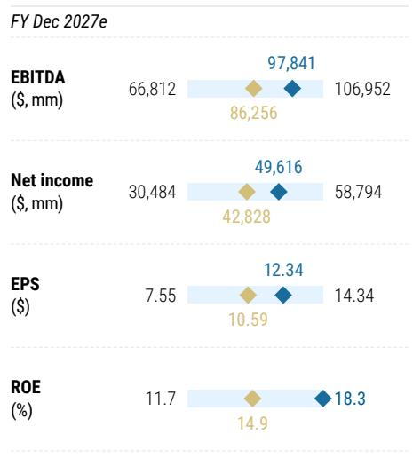  
Source: Refinitiv, MS

## Risk Reward – Imperial Oil Ltd (IMO.TO)

Competitive downstream but premium valuation priced in

## PRICE TARGET C\$138.00

Base case of C\$138/share which is a 50/50 blend of 1) a target multiple of 7.5x 2027e EV/DACF (C\$146/share) and 2) our discounted cash flow value of C\$130/share (with a WACC of 8.5% and terminal EV/EBITDA multiple of 6.8x).

Consensus Price Target Distribution Source: Refinitiv, MS

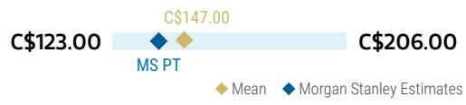

## RISK REWARD CHART AND OPTIONS IMPLIED PROBABILITIES (12M)

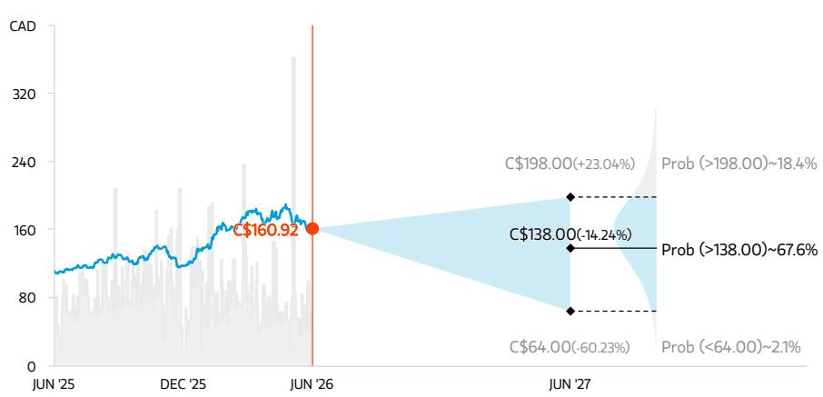  
Key: — Historical Stock Performance ● Current Stock Price ◆ Price Target  
Source: Refinitiv, MS, MS Institutional Equities Division. The probabilities of our Bull, Base, and Bear case scenarios playing out were estimated with implied volatility data from the options market as of 25 Jun 2026. All figures are approximate risk-neutral probabilities of the stock reaching beyond the scenario price in either three-months' or one-years' time. View explanation of Options Probabilities methodology here

## EQUAL-WEIGHT THESIS

\- A peer-leading balance sheet and strong downstream assets (3 refineries spanning eastern and western Canada) should allow the company to continue its strong cash flow generation. However, we note high capex in 2026-29 (\~C\$1.9 B) limits FCF upside. Additionally, the stock trades at a premium vs Canadian peers, which we think fairly prices in the advantaged balance sheet and downstream assets on a relative basis.
- IMO is still in the early stages of its new energies investment, but we note the renewable diesel facility at Strathcona (20 Mbbl/d capacity) provides leverage to the upside.

■ IMO trades at a 2027 EV/DACF of 6.8X, well above the peer average of 5.8X.

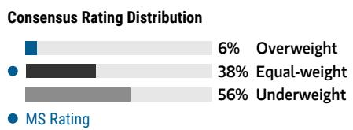  
Source: Refinitiv, MS

## BULL CASE

C\$198.00

## 9.8x 2027e DACF of C\$10.2 B

Bull case of C\$198/sh which is a 50/50 blend of 1) a target multiple of 8.5x 2027e EV/DACF (C\$198/share) and 2) our discounted cash flow value of C\$197/share (with a WACC of 8.5% and terminal EV/EBITDA multiple of 7.3x). Assumes long-term (2027+) prices of US\$95 Brent, US\$4.25 HH, refining cracks increase \~10%, carbon prices flat from 2024-2030.

## BASE CASE

## 8.0x 2027e DACF

Base case of C\$138/share which is a 50/50 blend of 1) a target multiple of 7.5x 2027e EV/DACF (C\$146/share) and 2) our discounted cash flow value of C\$130 share (with a WACC of 8.5% and terminal EV/EBITDA multiple of 6.8x). Assumes long-term (2028+) prices of US\$75.00 Brent, US\$3.75 HH, WTI-WCS of US\$15, carbon prices increase C\$15/tonne per year through 2030.

## C\$138.00 BEAR CASE

C\$64.00

## 7.6x 2027e DACF of C\$4.5 B

Bear case of C\$64/sh which is a 50/50 blend of 1) a target multiple of 8.5x 2027e EV/DACF (C\$71/share) and 2) our discounted cash flow value of C\$57/share (with a WACC of 8.5% and terminal EV/EBITDA multiple of 5.0x). Assumes long-term (2027+) prices of US\$55 Brent, US\$3.25 HH, refining cracks decline \~10%, carbon price increases by C\$30/tonne per year through 2030.

## Risk Reward – Imperial Oil Ltd (IMO.TO)

## KEY EARNINGS INPUTS

<table><tr><td>Drivers</td><td>Dec 2025</td><td>Dec 2026e</td><td>Dec 2027e</td><td>Dec 2028e</td></tr><tr><td>Total Production (Mboe/d)</td><td>438</td><td>444</td><td>463</td><td>468</td></tr><tr><td>Downstream Throughput (Mbbl/d)</td><td>402</td><td>394</td><td>401</td><td>401</td></tr><tr><td>Total Capex (C$MM) (C$)</td><td>2,027</td><td>2,078</td><td>1,812</td><td>1,839</td></tr></table>

## INVESTMENT DRIVERS

\- Integrated model

• Strong balance sheet - Commitment to cost reduction via reliability enhancements

## GLOBAL REVENUE EXPOSURE

  
Source: MS Estimate View explanation of regional hierarchies here

## MS ALPHA MODELS

4/5 MOST 3 Month Horizon

Source: Refinitiv, FactSet, MS; 1 is the highest favored Quintile and 5 is the least favored Quintile

## RISKS TO PT/RATING

## RISKS TO UPSIDE

• Crude prices are higher than expected

• Stronger than expected downstream margins

• NCIB acceleration and potential SIB

## RISKS TO DOWNSIDE

• Commodity prices decline materially

• Material widening of WTI-WCS differentials

• Outspending capex guidance

## OWNERSHIP POSITIONING

<table><tr><td>Inst. Owners, % Active</td><td>77.4%</td><td></td></tr><tr><td>HF Sector Long/Short Ratio</td><td>1.7x</td><td></td></tr><tr><td>HF Sector Net Exposure</td><td>4.7%</td><td></td></tr></table>

Refinitiv; MSPB Content. Includes certain hedge fund exposures held with MSPB. Information may be inconsistent with or may not reflect broader market trends. Long/Short Ratio = Long Exposure / Short exposure. Sector % of Total Net Exposure = (For a particular sector: Long Exposure - Short Exposure) / (Across all sectors: Long Exposure – Short Exposure).

MS ESTIMATES VS. CONSENSUS  
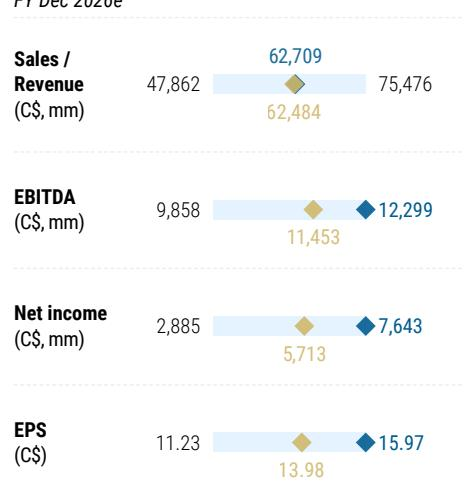  
Mean MS Estimates Source: Refinitiv, MS

## Risk Reward – Occidental Petroleum Corp (OXY.N)

In-line valuation but leverage is above peers

## PRICE TARGET \$68.00

Long-term (2028+) base case price deck: WTI \$70, HH \$3.25. Base case is a 50/50 blend of (1) target multiple of 5.5x EV/EBTIDA (\$71/sh) and (2) net asset value (NAV) of \$65/sh.

Consensus Price Target Distribution

Source: Refinitiv, MS

Consensus Rating Distribution  
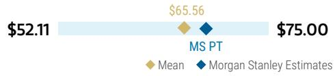

## RISK REWARD CHART AND OPTIONS IMPLIED PROBABILITIES (12M)

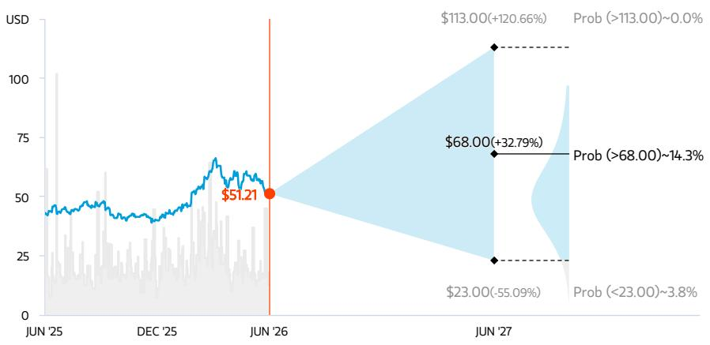  
Key: — Historical Stock Performance ● Current Stock Price ◆ Price Target

Source: Refinitiv, MS, MS Institutional Equities Division. The probabilities of our Bull, Base, and Bear case scenarios playing out were estimated with implied volatility data from the options market as of 25 Jun 2026. All figures are approximate risk-neutral probabilities of the stock reaching beyond the scenario price in either three-months' or one-years' time. View explanation of Options Probabilities methodology here

## EQUAL-WEIGHT THESIS

\- OXY is differentiated by its high quality assets and LT growth potential through Low Carbon Ventures. That said, FCF/Equity is modestly below oil E&P average.
- OxyChem sale supports balance sheet, but reduces FCF. The transaction is dilutive to our 2026-27 FCF/sh estimates, but accelerates debt reduction (0.5x lower pro-forma leverage) and pulls forward shareholder returns.

■ Free option on low carbon growth. OXY a leader in Direct Air Capture and has been active in helping hyperscalers decarbonize, including a recent 500,000 tonne deal with Microsoft. The stock reflects zero value for its low carbon business.

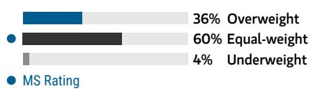  
Source: Refinitiv, MS

## Risk Reward Themes

Self-help: Positive
Technology Diffusion: Positive

View descriptions of Risk Rewards Themes here

## BULL CASE

## \$113.00

## 5.7x 2027e EBITDAX of \$19.4 B (incl. WES dists.)

Long-term (2028+) bull case price deck: WTI \$90, HH \$4.25. Price target is a 50/50 blend of (1) target multiple of 5.5x EV/EBTIDA (\$101/sh) and (2) net asset value (NAV) of \$125/sh.

## BASE CASE

## 5.1x 2027e EBITDAX of \$13.9 B (incl. WES dists.)

Long-term (2028+) base case price deck: WTI \$70, HH \$3.25. Price target is a 50/50 blend of (1) target multiple of 5.5x EV/EBTIDA (\$65/sh) and (2) net asset value (NAV) of \$71/sh.

## \$68.00 BEAR CASE

## \$23.00

4x 2027e EBITDAX of \$8.2 B (incl. WES dists.)

Long-term (2028+) bear case price deck: WTI \$50, HH \$3.25. Price target is a 50/50 blend of (1) target multiple of 5.5x EV/EBTIDA (\$27/sh) and (2) net asset value (NAV) of \$19/sh.

## Risk Reward – Occidental Petroleum Corp (OXY.N)

## KEY EARNINGS INPUTS

<table><tr><td>Drivers</td><td>Dec 2025</td><td>Dec 2026e</td><td>Dec 2027e</td><td>Dec 2028e</td></tr><tr><td>Oil Production (Mbbl/d)</td><td>729</td><td>729</td><td>746</td><td>782</td></tr><tr><td>Total Production (Mboe/d)</td><td>1,435</td><td>1,441</td><td>1,456</td><td>1,496</td></tr><tr><td>Realized Oil Price ($)</td><td>64.59</td><td>75.31</td><td>69.06</td><td>69.11</td></tr><tr><td>Realized Gas Price ($)</td><td>1.65</td><td>1.49</td><td>1.86</td><td>2.01</td></tr><tr><td>EBITDA Margin per Boe ($)</td><td>21.97</td><td>28.17</td><td>24.60</td><td>25.67</td></tr></table>

## INVESTMENT DRIVERS

\- Commodity prices.

\- Asst sale proceeds to reduce leverage.

\- Capital efficiency.

## GLOBAL REVENUE EXPOSURE

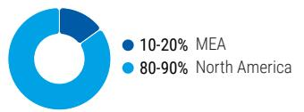  
Source: MS Estimate View explanation of regional hierarchies here

## MS ALPHA MODELS

<table><tr><td>1/5BEST</td><td>24 MonthHorizon</td><td>2/5MOST</td><td>3 MonthHorizon</td></tr></table>

Source: Refinitiv, FactSet, MS; 1 is the highest favored Quintile and 5 is the least favored Quintile

## RISKS TO PT/RATING

RISKS TO UPSIDE

• Higher commodity prices.

• Service cost deflation.

\- Redeems preferred equity

\- Resumes share repurchase program

## RISKS TO DOWNSIDE

\- Lower commodity prices.

• Service cost inflation.

• Regulatory risk in Colorado and global geopolitical risk.

## OWNERSHIP POSITIONING

<table><tr><td>Inst. Owners, % Active</td><td>46.1%</td><td></td><td></td><td></td><td></td></tr><tr><td>HF Sector Long/Short Ratio</td><td>1.7x</td><td></td><td></td><td></td><td></td></tr><tr><td>HF Sector Net Exposure</td><td>4.7%</td><td></td><td></td><td></td><td></td></tr></table>

Refinitiv; MSPB Content. Includes certain hedge fund exposures held with MSPB. Information may be inconsistent with or may not reflect broader market trends. Long/Short Ratio = Long Exposure / Short exposure. Sector % of Total Net Exposure = (For a particular sector: Long Exposure - Short Exposure) / (Across all sectors: Long Exposure – Short Exposure).

## MS ESTIMATES VS. CONSENSUS

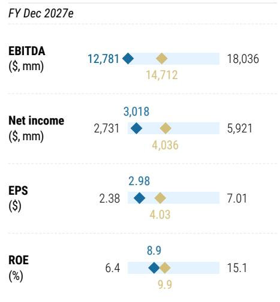  
Mean MS Estimates Source: Refinitiv, MS

## Risk Reward – Range Resources Corp. (RRC.N)

In-line valuation and capital efficient growth

## PRICE TARGET \$44.00

Price target is a 50/50 blend of 1) a target multiple of 7x 2027e EV/EBITDA (\$47/sh) and 2) our NAV of \$41/sh.

Consensus Price Target Distribution

Source: Refinitiv, MS

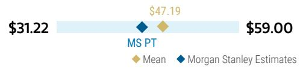

## RISK REWARD CHART AND OPTIONS IMPLIED PROBABILITIES (12M)

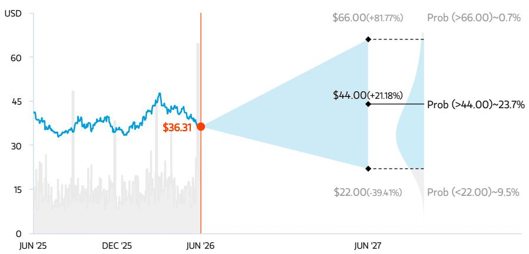

## EQUAL-WEIGHT THESIS

\- In-line valuation and capital efficient growth. RRC offers a 2026 FCF yield of 9%, in line with the peer median, with above-average growth over the next few years.
- Access to export markets supports premium NGL realizations. The company has realized a >\$1.50/bbl premium to Mont Belvieu over the last few years, a trend we expect to continue.

■ Shareholder returns near peers. RRC offers a total return yield of \~2%, near the peer median. The company has an opportunistic approach to share buybacks and has low leverage.

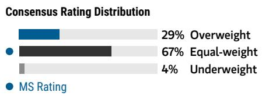  
Source: Refinitiv, MS  
Key: — Historical Stock Performance ● Current Stock Price ◆ Price Target

Source: Refinitiv, MS, MS Institutional Equities Division. The probabilities of our Bull, Base, and Bear case scenarios playing out were estimated with implied volatility data from the options market as of 25 Jun 2026. All figures are approximate risk-neutral probabilities of the stock reaching beyond the scenario price in either three-months' or one-years' time. View explanation of Options Probabilities methodology here

## BULL CASE

\$66.00

## 6.49 2027e EV/EBITDAX of \$2.1 B

## BASE CASE

Long term (2028+) Bull Price Deck: WTI \$90, HH \$4.25. Price target is a 50/50 blend of 1) a target multiple of 7x 2027e EV/EBITDA (\$67/sh) and 2) our NAV of \$65/sh.

## 6.5x 2027e EV/EBITDAX of \$1.6 B

## \$44.00 BEAR CASE

Long term (2028+) Base Price Deck: WTI \$70, HH \$3.75. Price target is a 50/50 blend of 1) a target multiple of 7x 2027e EV/EBITDA (\$47/sh) and 2) our NAV of \$41/sh.

## \$22.00

## 5.8x 2027e EV/EBITDAX of \$1 B

Long term (2028+) Bear Price Deck: WTI \$50, HH \$3.25. Price target is a 50/50 blend of 1) a target multiple of 7x 2027e EV/EBITDA (\$27/sh) and 2) our NAV of \$16/sh.

## Risk Reward – Range Resources Corp. (RRC.N)

## KEY EARNINGS INPUTS

<table><tr><td>Drivers</td><td>Dec 2025</td><td>Dec 2026e</td><td>Dec 2027e</td><td>Dec 2028e</td></tr><tr><td>Gas Production (MMcf/d)</td><td>1,537</td><td>1,598</td><td>1,763</td><td>1,774</td></tr><tr><td>Total Production (MMcfe/d)</td><td>2,236</td><td>2,372</td><td>2,597</td><td>2,648</td></tr><tr><td>Realized Gas Price ($)</td><td>3.29</td><td>3.36</td><td>3.24</td><td>3.37</td></tr><tr><td>EBITDAX Margin per Bcfe ($)</td><td>1.76</td><td>1.83</td><td>1.66</td><td>1.75</td></tr></table>

## INVESTMENT DRIVERS

\- Commodity prices

\- Capital efficiency

\- Liquids production

## GLOBAL REVENUE EXPOSURE

  
Source: MS Estimate View explanation of regional hierarchies here

## MS ALPHA MODELS

<table><tr><td>3/5BEST</td><td>24 MonthHorizon</td><td>1/5MOST</td><td>3 MonthHorizon</td></tr></table>

Source: Refinitiv, FactSet, MS; 1 is the highest favored Quintile and 5 is the least favored Quintile

## RISKS TO PT/RATING

## RISKS TO UPSIDE

• Higher commodity prices

• Service cost deflation

\- Better than expected appraisal well results and well costs

## RISKS TO DOWNSIDE

\- Lower commodity prices

• Service cost inflation

## OWNERSHIP POSITIONING

<table><tr><td>Inst. Owners, % Active</td><td>58.8%</td></tr><tr><td>HF Sector Long/Short Ratio</td><td>1.7x</td></tr><tr><td>HF Sector Net Exposure</td><td>4.7%</td></tr></table>

Refinitiv; MSPB Content. Includes certain hedge fund exposures held with MSPB. Information may be inconsistent with or may not reflect broader market trends. Long/Short Ratio = Long Exposure / Short exposure. Sector % of Total Net Exposure = (For a particular sector: Long Exposure - Short Exposure) / (Across all sectors: Long Exposure – Short Exposure).

MS ESTIMATES VS. CONSENSUS  
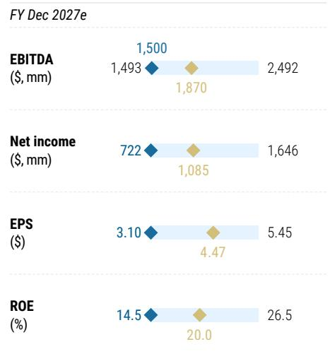  
Mean MS Estimates Source: Refinitiv, MS

## Risk Reward – Northern Oil & Gas Inc. (NOG.N)

Acquisition-driven growth with less operational clarity vs peers

## PRICE TARGET \$25.00

Long-term (2028+) base case price deck: WTI \$70, HH \$3.75. Base case of \$25/sh is a 50/50 blend of 1) 3.25x 2027e EV/EBITDA of \$18/sh and 2) net asset value of \$32 (7.3% discount rate).

<table><tr><td colspan="2">Consensus Price Target Distribution</td></tr><tr><td></td><td>$25.00 MS PT</td></tr><tr><td></td><td>$33.75 $38.00</td></tr><tr><td colspan="2">Source: Refinitiv, MS</td></tr></table>

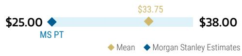

## RISK REWARD CHART

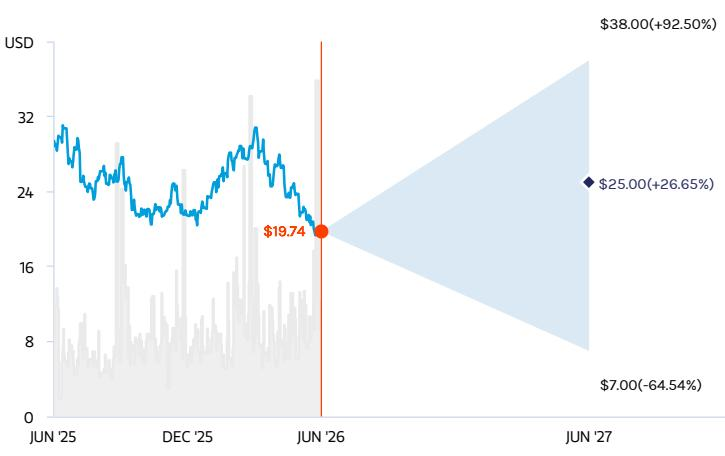  
Key: — Historical Stock Performance ● Current Stock Price ◆ Price Target  
Source: Refinitiv, MS

## UNDERWEIGHT THESIS

\- Unique business model of non-operated oil & gas positions differs vs peers as NOG has interests in the Permian, Williston, Appalachian, and Uinta regions.
- Consistently raised dividends under a program initiated in 2021 and increased authorization in early 2025, but moderated growth expected.
- We see risk of further non-operated activity reductions in the event oil prices move lower.
- NOG has a lower FCF yield than peers in 2026 with higher leverage (1.6x vs oil median of 0.4x).

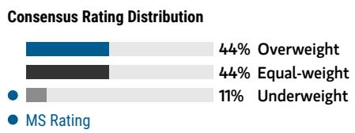  
Source: Refinitiv, MS

## BULL CASE

## 1.0x 2027e EBITDA

## \$38.00 BASE CASE

Long-term (2028+) bull case price deck: WTI \$90, HH \$4.25. Bull case is a 50/50 blend of 1) 2.0x 2027e EV/EBITDA of \$19/sh and 2) net asset value of \$57 (7.3% discount rate).

## 0.1x 2027e EBITDA

Long-term (2028+) base case price deck: WTI \$70, HH \$3.75. Base case of \$25/sh is a 50/50 blend of 1) 3.25x 2027e EV/EBITDA of \$18/sh and 2) net asset value of \$32 (7.3% discount rate).

## \$25.00 BEAR CASE

\$7.00

## -2.5x 2027e EBITDA

Long-term (2028+) bear case price deck: WTI \$50, HH \$3.25. Bear case of \$7/sh is a 50/50 blend of 1) 4.0x 2027e EV/EBITDA of \$7/sh and 2) net asset value of \$6 (7.3% discount rate).

## Risk Reward – Northern Oil & Gas Inc. (NOG.N)

## KEY EARNINGS INPUTS

<table><tr><td>Drivers</td><td>Dec 2025</td><td>Dec 2026e</td><td>Dec 2027e</td><td>Dec 2028e</td></tr><tr><td>Gas Production (MMcf/d)</td><td>356</td><td>444</td><td>437</td><td>437</td></tr><tr><td>Total Production (Mboe/d)</td><td>135</td><td>146</td><td>147</td><td>147</td></tr><tr><td>Realized Oil Price ($)</td><td>64.79</td><td>66.86</td><td>64.74</td><td>64.77</td></tr><tr><td>Realized Gas Price ($)</td><td>3.33</td><td>2.46</td><td>2.47</td><td>2.82</td></tr><tr><td>EBITDAX Margin per Boe ($, mm)</td><td>21.52</td><td>11.78</td><td>26.15</td><td>27.16</td></tr></table>

## INVESTMENT DRIVERS

\- Commodity prices

\- Capex, capital efficiency, and production activity of operating partners

\- Ability to execute on accretive M&A deals in key basins

## GLOBAL REVENUE EXPOSURE

  
Source: MS Estimate View explanation of regional hierarchies here

## MS ALPHA MODELS

<table><tr><td>1/5BEST</td><td>24 MonthHorizon</td><td>1/5MOST</td><td>3 MonthHorizon</td></tr></table>

Source: Refinitiv, FactSet, MS; 1 is the highest favored Quintile and 5 is the least favored Quintile

## RISKS TO PT/RATING

## RISKS TO UPSIDE

• Higher commodity prices

\- Heighted M&A activity accretive to key financial metrics

\- Operator service cost deflation (via AFEs)

## RISKS TO DOWNSIDE

• Lower commodity prices

\- Operator service cost inflation (via AFEs)

• Production and M&A activity slows

• Production shifts by operational partners

## OWNERSHIP POSITIONING

<table><tr><td>Inst. Owners, % Active</td><td>49.5%</td><td></td><td></td><td></td></tr><tr><td>HF Sector Long/Short Ratio</td><td>1.7x</td><td></td><td></td><td></td></tr><tr><td>HF Sector Net Exposure</td><td>4.7%</td><td></td><td></td><td></td></tr></table>

Refinitiv; MSPB Content. Includes certain hedge fund exposures held with MSPB. Information may be inconsistent with or may not reflect broader market trends. Long/Short Ratio = Long Exposure / Short exposure. Sector % of Total Net Exposure = (For a particular sector: Long Exposure - Short Exposure) / (Across all sectors: Long Exposure – Short Exposure).

MS ESTIMATES VS. CONSENSUS  
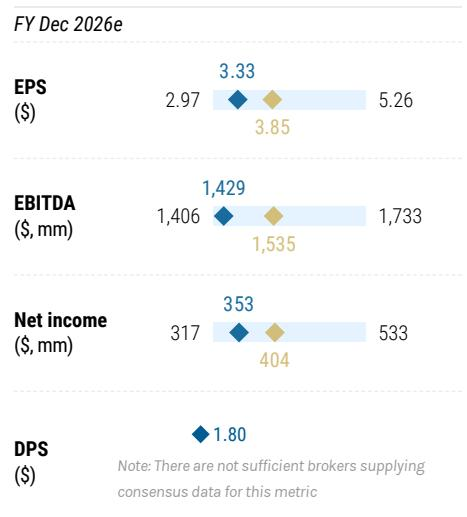  
◆ Mean ◆ MS Estimates
Source: Refinitiv, MS

## Risk Reward – Matador Resources Co (MTDR.N)

Focused Delaware growth supports strong FCF with modest shareholder returns

## PRICE TARGET \$66.00

Price target is a 50/50 blend of 1) a target multiple of 4.0x 2027e EV/EBITDAX (\$66/sh) and 2) our NAV of \$69/sh.

Consensus Price Target Distribution

Source: Refinitiv, MS

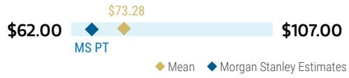

## RISK REWARD CHART AND OPTIONS IMPLIED PROBABILITIES (12M)

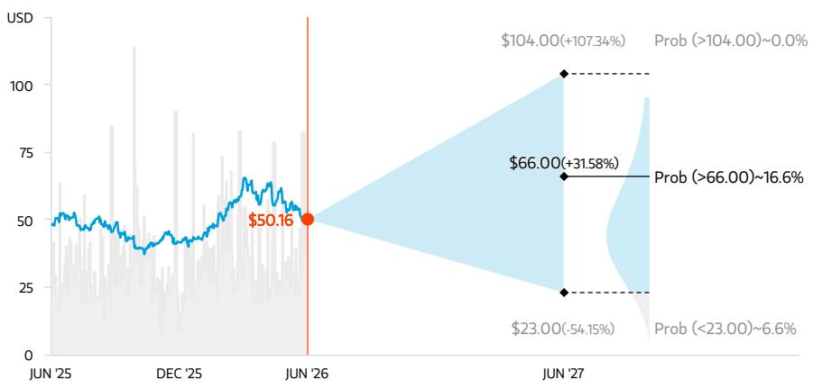  
Key: — Historical Stock Performance ● Current Stock Price ◆ Price Target

## EQUAL-WEIGHT THESIS

\- Integrated midstream operations provide a competitive advantage. Besides providing MTDR with flow assurance, San Mateo Midstream JV (MTDR 51% stake) services third-party customers and generates positive cash flow. We estimate San Mateo to add \~\$10/sh of value to MTDR's NAV.
- Modest shareholder returns at in-line valuation. We estimate MTDR to trade in-line w/ peers on '26 EV/EBITDAX and offer a \~3% return yield in '26 vs 6% for peers.

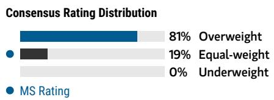  
Source: Refinitiv, MS

Source: Refinitiv, MS, MS Institutional Equities Division. The probabilities of our Bull, Base, and Bear case scenarios playing out were estimated with implied volatility data from the options market as of 25 Jun 2026. All figures are approximate risk-neutral probabilities of the stock reaching beyond the scenario price in either three-months' or one-years' time. View explanation of Options Probabilities methodology here

## BULL CASE

## \$104.00 BASE CASE

## 4.4x 2027e EV/EBITDAX

Long-term (2028+) Bull Price Deck: WTI \$90, HH \$4.25. Price target is a 50/50 blend of 1) a target multiple of 4.0x 2027e EV/EBITDAX (\$92/sh) and 2) our NAV of \$16/sh.

## 4.1x 2027e EV/EBITDAX

Long-term (2028+) Base Price Deck: WTI \$70, HH \$3.75. Price target is a 50/50 blend of 1) a target multiple of 4.0x 2027e EV/EBITDAX (\$64/sh) and 2) our NAV of \$69/sh.

## \$66.00 BEAR CASE

## \$23.00

## 3.7x 2027e EV/EBITDAX

Long-term (2028+) Bear Price Deck: WTI \$50, HH \$3.25. Price target is a 50/50 blend of 1) a target multiple of 4.0x 2027e EV/EBITDAX (\$27/sh) and 2) our NAV of \$20/sh.

## Risk Reward – Matador Resources Co (MTDR.N)

## KEY EARNINGS INPUTS

<table><tr><td>Drivers</td><td>Dec 2025</td><td>Dec 2026e</td><td>Dec 2027e</td><td>Dec 2028e</td></tr><tr><td>Oil Production (MBbl/d)</td><td>120</td><td>125</td><td>125</td><td>126</td></tr><tr><td>Total Production (MBoe/d)</td><td>207</td><td>215</td><td>219</td><td>222</td></tr><tr><td>Realized Oil Price ($/Bbl)</td><td>65.00</td><td>73.33</td><td>70.00</td><td>70.00</td></tr><tr><td>Realized Gas Price ($/Mcf)</td><td>2.20</td><td>1.52</td><td>2.90</td><td>3.12</td></tr><tr><td>EBITDAX Margin ($/Boe)</td><td>30.36</td><td>32.51</td><td>32.38</td><td>32.71</td></tr></table>

## INVESTMENT DRIVERS

\- Commodity prices

\- Capex

\- Capital efficiency

\- Return of cash

\- Well performance

• Midstream assets performance

## GLOBAL REVENUE EXPOSURE

  
Source: MS Estimate View explanation of regional hierarchies here

## MS ALPHA MODELS

<table><tr><td>3/5BEST</td><td>24 MonthHorizon</td><td>1/5MOST</td><td>3 MonthHorizon</td></tr></table>

Source: Refinitiv, FactSet, MS; 1 is the highest favored Quintile and 5 is the least favored Quintile

## RISKS TO PT/RATING

RISKS TO UPSIDE

• Higher commodity prices

• Better well performance

• Service cost deflation

• M&A activity accretive to key financial metrics

• Accelerated return of cash through buybacks

## RISKS TO DOWNSIDE

\- Poor execution

• Lower commodity prices

• Service cost inflation

\- Declining well performance

## OWNERSHIP POSITIONING

<table><tr><td>Inst. Owners, % Active</td><td>50.8%</td></tr><tr><td>HF Sector Long/Short Ratio</td><td>1.7x</td></tr><tr><td>HF Sector Net Exposure</td><td>4.7%</td></tr></table>

Refinitiv; MSPB Content. Includes certain hedge fund exposures held with MSPB. Information may be inconsistent with or may not reflect broader market trends. Long/Short Ratio = Long Exposure / Short exposure. Sector % of Total Net Exposure = (For a particular sector: Long Exposure - Short Exposure) / (Across all sectors: Long Exposure – Short Exposure).

MS ESTIMATES VS. CONSENSUS  
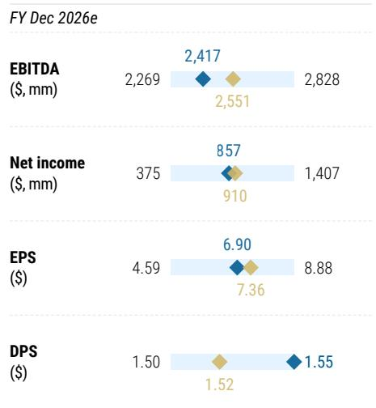  
Mean MS Estimates Source: Refinitiv, MS

## Risk Reward – Murphy Oil Corporation (MUR.N)

High exploration capex limits free cash flow in the near term

## PRICE TARGET \$35.00

Base case of \$35/share which is a 50/50 blend of 1) a target multiple of 3.25x 2027e EV/EBITDA (\$33/share) and 2) our NAV of \$36/share (with a WACC of 12.1%).

Source: Refinitiv, MS

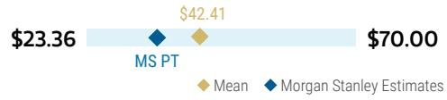

## RISK REWARD CHART

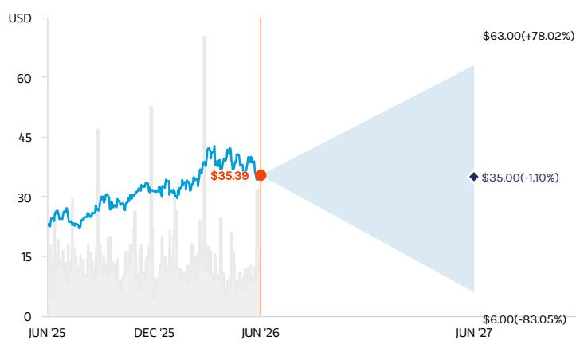  
Key: — Historical Stock Performance ● Current Stock Price ◆ Price Target

## UNDERWEIGHT THESIS

\- Diversified portfolio, with large offshore position. MUR's portfolio mix of short (Eagle Ford, Montney) and long cycle opportunities (GoM, Canada) offers attractive investment opportunities but higher capex.
- High capex limits near-term FCF. While MUR's recent exploration success in Vietnam offers a source of longer-term upside, near-term FCF is limited by spending on longer-cycle projects and further exploration. We estimate 2026 FCF yield of $12\%$ at $\$88/$ bbl WTI vs $15\%$ for oil E&Ps.

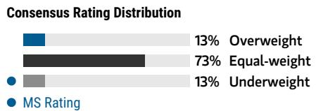  
Source: Refinitiv, MS  
Source: Refinitiv, MS

## BULL CASE

## 3.8x 2027e EV/EBITDA

## \$63.00 BASE CASE

Bull 2027+ price deck: WTI \$90, Brent \$95, HH \$4.25. Bull case of \$70/share, which is a 50/50 blend of 1) a target multiple of 3.25x 2027e EV/EBITDA (\$58/share) and 2) our NAV of \$69/share (with a WACC of 12.1%).

## 3.4x 2027e EV/EBITDA

Long-term (2027+) Base Price deck: WTI \$70, Brent \$75, HH \$3.75. Base case of \$35/share which is a 50/50 blend of 1) a target multiple of 3.25x 2027e EV/EBITDA (\$33/share) and 2) our NAV of \$36/share (with a WACC of 12.1%).

## \$35.00 BEAR CASE

## \$6.00

## 2.8x 2027e EV/EBITDA

Bear 2027+ Price deck: WTI \$50, Brent \$55, HH \$3.25. Bear case of \$6/share, which is a 50/50 blend of 1) a target multiple of 3.25x 2027e EV/EBITDA (\$9/share) and 2) our NAV of \$3/share (with a WACC of 12.1%).

## Risk Reward – Murphy Oil Corporation (MUR.N)

## KEY EARNINGS INPUTS

<table><tr><td>Drivers</td><td>Dec 2025</td><td>Dec 2026e</td><td>Dec 2027e</td><td>Dec 2028e</td></tr><tr><td>Oil Production (Mbbl/d)</td><td>87</td><td>87</td><td>93</td><td>93</td></tr><tr><td>Total Production (Mboe/d)</td><td>182</td><td>173</td><td>185</td><td>190</td></tr><tr><td>Realized Oil Price ($)</td><td>70.45</td><td>80.14</td><td>71.79</td><td>71.24</td></tr><tr><td>Realized Gas Price ($)</td><td>2.07</td><td>2.41</td><td>2.59</td><td>2.85</td></tr><tr><td>EBITDA Margin per Boe ($)</td><td>20.95</td><td>26.13</td><td>24.98</td><td>25.01</td></tr></table>

## INVESTMENT DRIVERS

\- Commodity prices

\- Capex

\- Capital efficiency

\- Return of cash

• Major capital project execution including Gulf of Mexico and Eagle Ford

\- Exploration results

## GLOBAL REVENUE EXPOSURE

  
Source: MS Estimate View explanation of regional hierarchies here

## MS ALPHA MODELS

<table><tr><td>2/5BEST</td><td>24 MonthHorizon</td><td>3/5MOST</td><td>3 MonthHorizon</td></tr></table>

Source: Refinitiv, FactSet, MS; 1 is the highest favored Quintile and 5 is the least favored Quintile

## RISKS TO PT/RATING

RISKS TO UPSIDE

• Higher commodity prices

• Better well performance in the Eagle Ford

• Exploration success in Brazil, Gulf of Mexico, and Vietnam

## RISKS TO DOWNSIDE

\- Lower commodity prices

\- Cost inflation

\- Capex overruns at major GoM projects

\- Operational issues associated with Eagle Ford activity ramp

## OWNERSHIP POSITIONING

<table><tr><td>Inst. Owners, % Active</td><td>40.3%</td><td></td></tr><tr><td>HF Sector Long/Short Ratio</td><td>1.7x</td><td></td></tr><tr><td>HF Sector Net Exposure</td><td>4.7%</td><td></td></tr></table>

Refinitiv; MSPB Content. Includes certain hedge fund exposures held with MSPB. Information may be inconsistent with or may not reflect broader market trends. Long/Short Ratio = Long Exposure / Short exposure. Sector % of Total Net Exposure = (For a particular sector: Long Exposure - Short Exposure) / (Across all sectors: Long Exposure – Short Exposure).

MS ESTIMATES VS. CONSENSUS  
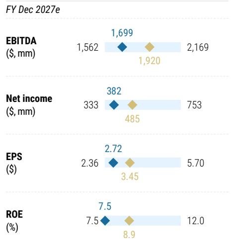  
Mean MS Estimates Source: Refinitiv, MS

## Risk Reward – Ovintiv Inc (OVV.N)

Capital efficient operator, in-line valuation

## PRICE TARGET \$65.00

Price target is a 50/50 blend of 1) A multiple of 4.5x 2027e EV/EBITDA (\$65/sh) and 2) our NAV of \$65/sh.

Consensus Price Target Distribution

Source: Refinitiv, MS

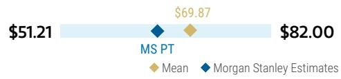

## RISK REWARD CHART AND OPTIONS IMPLIED PROBABILITIES (12M)

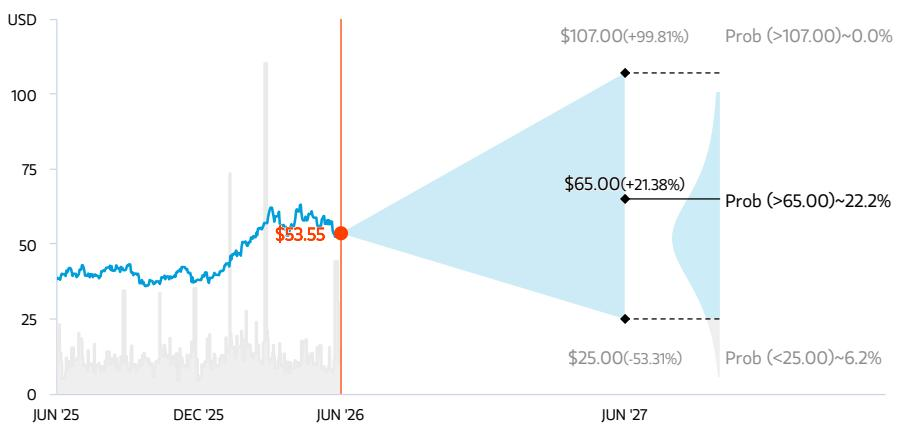  
Key: — Historical Stock Performance ● Current Stock Price ◆ Price Target

## EQUAL-WEIGHT THESIS

■ OVV has outperformed oil E&P peers YTD on strategic portfolio transformation, solid execution and enhanced shareholder return framework.

In-line valuation. The company trades at a 2026 EV/EBITDA of 3.8x and FCF yield of 14%, near the oil E&P median of 14% and 3.8x.

\- Leverage improved to near peers. Pro forma for the Anadarko divestiture, we estimate OVV's 2026E net debt/EBITDAX would fall from above-average to 0.7x, in line with peer median.

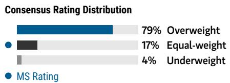  
Source: Refinitiv, MS

Source: Refinitiv, MS, MS Institutional Equities Division. The probabilities of our Bull, Base, and Bear case scenarios playing out were estimated with implied volatility data from the options market as of 25 Jun 2026. All figures are approximate risk-neutral probabilities of the stock reaching beyond the scenario price in either three-months' or one-years' time. View explanation of Options Probabilities methodology here

## BULL CASE

## \$107.00

## 4.6x 2027e EV/EBITDAX of \$6.3 B

## BASE CASE

Long term (2028+) Bull Price Deck: WTI \$90, and HH \$4.25. Bull case is a 50/50 blend of 1) a target multiple of 4.5x 2027e EV/EBITDA (\$105/sh) and 2) our NAV of \$110/sh.

## 4.5x 2027e EV/EBITDAX of \$4.5 B

Long term (2028+) Base Price Deck: WTI \$70, HH \$3.75. Price target is a 50/50 blend of 1) A multiple of 4.5x 2027e EV/EBITDA (\$65/sh) and 2) our NAV of \$65/sh.

## \$65.00 BEAR CASE

## \$25.00

## 4.2x 2027e EV/EBITDA of \$2.7 B

Long term (2028+) Bear Price Deck: WTI \$50, and HH \$3.25. Bear case is a 50/50 blend of 1) a multiple of 4.5x 2027 EV/EBITDA (\$29/sh) and 2) our NAV of \$22/sh.

## Risk Reward – Ovintiv Inc (OVV.N)

KEY EARNINGS INPUTS

<table><tr><td>Drivers</td><td>Dec 2025</td><td>Dec 2026e</td><td>Dec 2027e</td><td>Dec 2028e</td></tr><tr><td>Oil Production (MBbl/d)</td><td>143</td><td>119</td><td>109</td><td>110</td></tr><tr><td>Total Production (MBoe/d)</td><td>614</td><td>628</td><td>614</td><td>615</td></tr><tr><td>Realized Oil Price ($/Bbl)</td><td>66.42</td><td>74.59</td><td>68.60</td><td>68.60</td></tr><tr><td>Realized Gas Price ($/Mcf)</td><td>2.54</td><td>2.50</td><td>2.63</td><td>2.84</td></tr><tr><td>EBITDAX Margin ($/Boe)</td><td>17.56</td><td>20.38</td><td>20.69</td><td>20.87</td></tr></table>

## INVESTMENT DRIVERS

\- STACK Cube results

• NFX acquisition synergies

\- US domicile

## GLOBAL REVENUE EXPOSURE

  
Source: MS Estimate View explanation of regional hierarchies here

## MS ALPHA MODELS

<table><tr><td>2/5BEST</td><td>24 MonthHorizon</td><td>2/5MOST</td><td>3 MonthHorizon</td></tr></table>

Source: Refinitiv, FactSet, MS; 1 is the highest favored Quintile and 5 is the least favored Quintile

## RISKS TO PT/RATING

RISKS TO UPSIDE

• Higher commodity prices

\- Service deflation

• Better than expected well performance

\- Sustainable cost and operational efficiencies

## RISKS TO DOWNSIDE

\- Lower commodity prices

\- Service inflation

\- Worse than expected well performance

• Corporate production declines are higher than guided

## OWNERSHIP POSITIONING

<table><tr><td>Inst. Owners, % Active</td><td>54.6%</td><td></td></tr><tr><td>HF Sector Long/Short Ratio</td><td>1.7x</td><td></td></tr><tr><td>HF Sector Net Exposure</td><td>4.7%</td><td></td></tr></table>

Refinitiv; MSPB Content. Includes certain hedge fund exposures held with MSPB. Information may be inconsistent with or may not reflect broader market trends. Long/Short Ratio = Long Exposure / Short exposure. Sector % of Total Net Exposure = (For a particular sector: Long Exposure - Short Exposure) / (Across all sectors: Long Exposure – Short Exposure).

MS ESTIMATES VS. CONSENSUS  
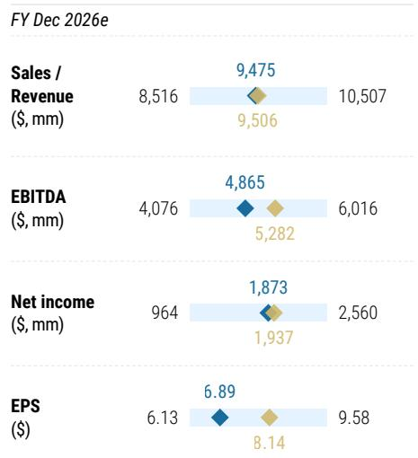  
Mean MS Estimates Source: Refinitiv, MS

## Risk Reward – Expand Energy Corp (EXE.O)

Attractive FCF growth from rising prices and efficiency gains in 2026

## PRICE TARGET \$131.00

Price target is a 50/50 blend of 1) a target multiple of 5.5x 2027e EV/EBITDA (\$133/sh) and 2) our NAV of \$129/sh.

## Consensus Price Target Distribution

Source: Refinitiv, MS

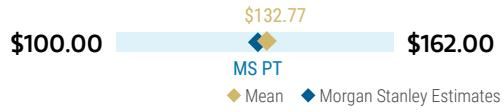

## RISK REWARD CHART

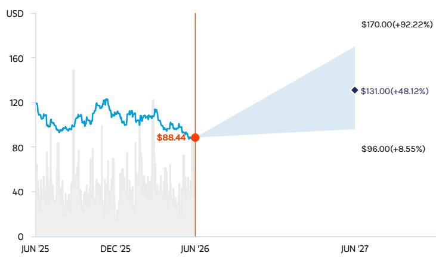  
Key: — Historical Stock Performance ● Current Stock Price ◆ Price Target  
Source: Refinitiv, MS

## OVERWEIGHT THESIS

■ EXE is the largest independent natural gas producer in the US, well positioned to answer the call on the next growth cycle of gas supported by a diverse transportation portfolio and direct access to the Gulf Coast LNG corridor. Marketing & commercial segment could drive incremental value longer term.

■ Rate of change from synergies realization. EXE offers attractive FCF growth from rising prices and volumes in 2026. We estimate a 12% FCF yield in 2026, above peer median of 9%.

■ Capital returns framework designed to return cash and reduce net debt. We estimate a total return yield of 6% in 2026, above the gas E&P median of 4%.

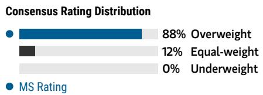  
Source: Refinitiv, MS

## BULL CASE

\$170.00

## 5.8x 2027e EV/EBITDA of \$6.7 B

Long term (2028+) Bull Price Deck: WTI \$90, HH \$4.25. Price target is a 50/50 blend of 1) a target multiple of 5.5x 2027e EV/EBITDA (\$161/sh) and 2) our NAV of \$154/sh.

## BASE CASE

## 5.6x 2027e EV/EBITDA of \$5.6 B

Long term (2028+) Base Price Deck: WTI \$70, HH \$3.75. Price target is a 50/50 blend of 1) a target multiple of 5.5x 2027e EV/EBITDA (\$129/sh) and 2) our NAV of \$133/sh.

## \$131.00 BEAR CASE

\$96.00

## 5.2x 2027e EV/EBITDA of \$4.6 B

Long term (2028+) Base Price Deck: WTI \$50, HH \$3.75. Price target is a 50/50 blend of 1) a target multiple of 5.5x 2027e EV/EBITDA (\$101/sh) and 2) our NAV of \$91/sh.

## Risk Reward – Expand Energy Corp (EXE.O)

## KEY EARNINGS INPUTS

<table><tr><td>Drivers</td><td>Dec 2025</td><td>Dec 2026e</td><td>Dec 2027e</td><td>Dec 2028e</td></tr><tr><td>Oil Production (Mbbl/d)</td><td>13</td><td>18</td><td>16</td><td>15</td></tr><tr><td>Total Production (Mboe/d)</td><td>1,189</td><td>1,251</td><td>1,272</td><td>1,291</td></tr><tr><td>Realized Oil Price ($)</td><td>55.63</td><td>67.92</td><td>60.00</td><td>60.00</td></tr><tr><td>Realized Gas Price ($)</td><td>3.16</td><td>3.38</td><td>3.26</td><td>3.41</td></tr><tr><td>EBITDA Margin per Boe ($)</td><td>11.52</td><td>12.97</td><td>11.93</td><td>12.76</td></tr></table>

## INVESTMENT DRIVERS

\- Commodity prices

• Production and capex

\- Return of cash

## GLOBAL REVENUE EXPOSURE

  
Source: MS Estimate View explanation of regional hierarchies here

## MS ALPHA MODELS

<table><tr><td>1/5BEST</td><td>24 MonthHorizon</td><td>2/5MOST</td><td>3 MonthHorizon</td></tr></table>

Source: Refinitiv, FactSet, MS; 1 is the highest favored Quintile and 5 is the least favored Quintile

## RISKS TO PT/RATING

RISKS TO UPSIDE

• Higher natural gas prices - Better than expected well costs and well performance

## RISKS TO DOWNSIDE

\- Lower natural gas prices

\- Worse than expected well costs and well performance

## OWNERSHIP POSITIONING

<table><tr><td>Inst. Owners, % Active</td><td>54%</td><td></td><td></td><td></td></tr><tr><td>HF Sector Long/Short Ratio</td><td>1.7x</td><td></td><td></td><td></td></tr><tr><td>HF Sector Net Exposure</td><td>4.7%</td><td></td><td></td><td></td></tr></table>

Refinitiv; MSPB Content. Includes certain hedge fund exposures held with MSPB. Information may be inconsistent with or may not reflect broader market trends. Long/Short Ratio = Long Exposure / Short exposure. Sector % of Total Net Exposure = (For a particular sector: Long Exposure - Short Exposure) / (Across all sectors: Long Exposure – Short Exposure).

MS ESTIMATES VS. CONSENSUS  
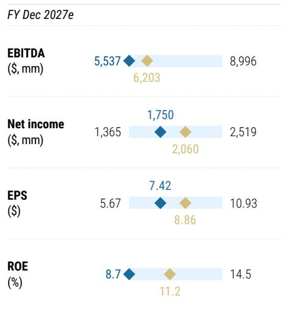  
Mean MS Estimates Source: Refinitiv, MS

## Risk Reward – Tourmaline Oil Corp. (TOU.TO)

Differentiated Growth + Income model, but has meaningful AECO exposure

## PRICE TARGET C\$65.00

Long term (2028+) Base Price Deck: WTI US\$70, AECO US\$2.50. Price target is a 50/50 blend of 1) A multiple of 6.5x 2027e EV/EBITDA (C\$67/sh) and 2) our NAV of C\$62/sh.

Source: Refinitiv, MS

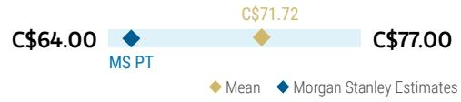

## RISK REWARD CHART

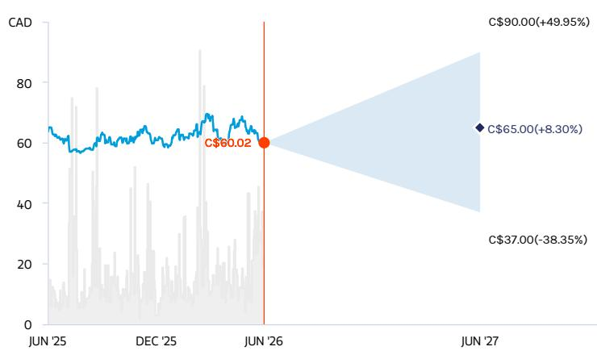  
Key: — Historical Stock Performance ● Current Stock Price ◆ Price Target

## EQUAL-WEIGHT THESIS

\- TOU is the largest natural gas producer in Canada with multiple decades of resource life and an active M&A strategy, driving a 5% production CAGR over the next five years.
- Valuation screens slightly more expensive at 5% FCF yield vs peer median of 9% in 2026. Excluding growth spending, which is more comparable with US peers, TOU would generate \~10% FCF yield in 2026.
- TOU has meaningful exposure to AECO pricing. The forward AECO differentials remain wide vs history, averaging \~US\$1.75/mmbtu over the next few years vs the 2014-24 average of \~\$1/mmbtu.

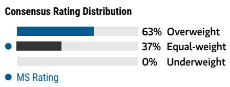  
Source: Refinitiv, MS  
Source: Refinitiv, MS

## BULL CASE

## 6.5x 2027e EV/EBITDAX

## C\$90.00 BASE CASE

Long term (2028+) Base Price Deck: WTI US\$90, AECO US\$3.00. Price target is a 50/50 blend of 1) A multiple of 6.5x 2027e EV/EBITDA (C\$91/sh) and 2) our NAV of C\$90/sh.

## 6.3x 2027e EV/EBITDAX

Long term (2028+) Base Price Deck: WTI US\$70, AECO US\$2.50. Price target is a 50/50 blend of 1) A multiple of 6.5x 2027e EV/EBITDA (C\$67/sh) and 2) our NAV of C\$62/sh.

## C\$65.00 BEAR CASE

C\$37.00

## 5.6x 2027e EV/EBITDAX

Long term (2028+) Base Price Deck: WTI US\$50, AECO US\$2.00. Price target is a 50/50 blend of 1) A multiple of 6.5x 2027e EV/EBITDA (C\$44/sh) and 2) our NAV of C\$30/sh.

## Risk Reward – Tourmaline Oil Corp. (TOU.TO)

## KEY EARNINGS INPUTS

<table><tr><td>Drivers</td><td>Dec 2025</td><td>Dec 2026e</td><td>Dec 2027e</td><td>Dec 2028e</td></tr><tr><td>Gas Production (MMcf/d)</td><td>2,946</td><td>3,030</td><td>3,221</td><td>3,373</td></tr><tr><td>Total Production (MMcfe/d)</td><td>3,829</td><td>3,771</td><td>4,043</td><td>4,274</td></tr><tr><td>Realized Gas Price (C$)</td><td>3.62</td><td>3.93</td><td>4.34</td><td>4.84</td></tr><tr><td>EBITDAX Margin per Bcfe (C$)</td><td>2.22</td><td>2.71</td><td>2.87</td><td>3.21</td></tr></table>

## INVESTMENT DRIVERS

\- Commodity prices

• Production and capex

\- Return of cash

## GLOBAL REVENUE EXPOSURE

  
Source: MS Estimate View explanation of regional hierarchies here

## MS ALPHA MODELS

1/5 MOST 3 Month Horizon

Source: Refinitiv, FactSet, MS; 1 is the highest favored Quintile and 5 is the least favored Quintile

## RISKS TO PT/RATING

## RISKS TO UPSIDE

• Higher commodity prices

• Better than expected well performance

• Execution on organic development projects

## RISKS TO DOWNSIDE

• Lower commodity prices

\- Worse than expected well performance

\- Poor execution

## OWNERSHIP POSITIONING

<table><tr><td>Inst. Owners, % Active</td><td>62.4%</td></tr><tr><td>HF Sector Long/Short Ratio</td><td>1.7x</td></tr><tr><td>HF Sector Net Exposure</td><td>4.7%</td></tr></table>

Refinitiv; MSPB Content. Includes certain hedge fund exposures held with MSPB. Information may be inconsistent with or may not reflect broader market trends. Long/Short Ratio = Long Exposure / Short exposure. Sector % of Total Net Exposure = (For a particular sector: Long Exposure - Short Exposure) / (Across all sectors: Long Exposure – Short Exposure).

MS ESTIMATES VS. CONSENSUS  
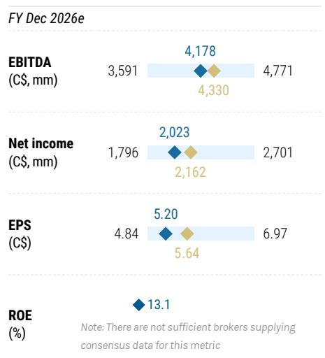  
Mean MS Estimates Source: Refinitiv, MS

## Risk Reward – Permian Resources Corp (PR.N)

Peer-leading well cost and attractive per-share growth

## PRICE TARGET \$24.00

Price target of \$24/sh is a 50/50 blend of 1) a target multiple of 5x 2027e EV/EBITDAX (\$28/sh) and 2) our NAV of \$20/sh.

## Consensus Price Target Distribution

Source: Refinitiv, MS

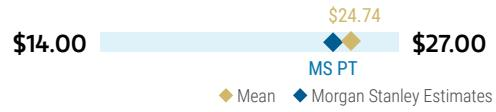

## RISK REWARD CHART

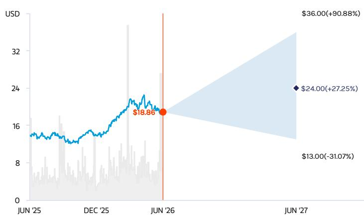  
Key: — Historical Stock Performance ● Current Stock Price ◆ Price Target  
Source: Refinitiv, MS

## OVERWEIGHT THESIS

■ Cost leadership. PR has a drilling & completion cost of \~\$675/ft, the lowest vs Delaware Basin peers. The company estimates \~\$40s post-dividend corporate breakeven in 2025 at a maintenance program.

■ Peer-leading base dividend. PR has one of the highest base dividend yield of >4% in our oil coverage.

As industry consolidation accelerated over the past couple of years, PR offers scarcity value as one of the few pure-play Permian E&Ps with scale and one of the few shale operators with a growth-oriented strategy.

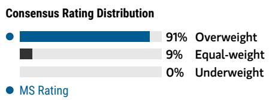  
Source: Refinitiv, MS

## BULL CASE

\$36.00

## 3.9x 2027e EV/EBITDAX of \$6.4 B

Long-term (2028+) Bull Price Deck: WTI \$90, HH \$4.25. Price target is a 50/50 blend of 1) a target multiple of 5x 2027e EV/EBITDAX (\$40/sh) and 2) our NAV of \$33/sh.

## BASE CASE

## \$24.00

## 4.3x 2027e EV/EBITDAX of \$4.9 B

Long-term (2028+) Base Price Deck: WTI \$70, HH \$3.75. Price target is a 50/50 blend of 1) a target multiple of 5x 2027e EV/EBITDAX (\$28/sh) and 2) our NAV of \$20/sh.

## BEAR CASE

\$13.00

## 3.7x 2027e EV/EBITDAX of \$3.5 B

Long-term (2028+) Bear Price Deck: WTI \$50, HH \$3.25. Price target is a 50/50 blend of 1) a target multiple of 5x 2027e EV/EBITDAX (\$18/sh) and 2) our NAV of \$7/sh.

## Risk Reward – Permian Resources Corp (PR.N)

## KEY EARNINGS INPUTS

<table><tr><td>Drivers</td><td>Dec 2025</td><td>Dec 2026e</td><td>Dec 2027e</td><td>Dec 2028e</td></tr><tr><td>Oil Production (MBbl/d)</td><td>182</td><td>195</td><td>200</td><td>202</td></tr><tr><td>Total Production (MBoe/d)</td><td>393</td><td>413</td><td>417</td><td>423</td></tr><tr><td>Realized Oil Price ($/Bbl)</td><td>66.29</td><td>72.05</td><td>68.73</td><td>68.60</td></tr><tr><td>Realized Gas Price ($/Mcf)</td><td>1.08</td><td>1.15</td><td>2.72</td><td>2.76</td></tr><tr><td>EBITDAX Margin ($/Boe)</td><td>27.26</td><td>30.90</td><td>32.00</td><td>32.00</td></tr></table>

## INVESTMENT DRIVERS

\- Commodity prices

• Production and capex

• Delaware Basin oil production

\- Return of cash

## GLOBAL REVENUE EXPOSURE

Source: MS Estimate View explanation of regional hierarchies here

## MS ALPHA MODELS

<table><tr><td>1/5BEST</td><td>24 MonthHorizon</td><td>1/5MOST</td><td>3 MonthHorizon</td></tr></table>

Source: Refinitiv, FactSet, MS; 1 is the highest favored Quintile and 5 is the least favored Quintile

## RISKS TO PT/RATING

RISKS TO UPSIDE

• Higher commodity prices

• Well cost reduction

• Well performance improvement

## RISKS TO DOWNSIDE

\- Lower commodity prices

\- Poor execution

## OWNERSHIP POSITIONING

<table><tr><td>Inst. Owners, % Active</td><td>62.1%</td><td></td><td></td><td></td></tr><tr><td>HF Sector Long/Short Ratio</td><td>1.7x</td><td></td><td></td><td></td></tr><tr><td>HF Sector Net Exposure</td><td>4.7%</td><td></td><td></td><td></td></tr></table>

Refinitiv; MSPB Content. Includes certain hedge fund exposures held with MSPB. Information may be inconsistent with or may not reflect broader market trends. Long/Short Ratio = Long Exposure / Short exposure. Sector % of Total Net Exposure = (For a particular sector: Long Exposure - Short Exposure) / (Across all sectors: Long Exposure – Short Exposure).

MS ESTIMATES VS. CONSENSUS  
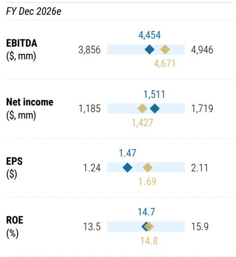  
Mean MS Estimates Source: Refinitiv, MS

## Risk Reward – Viper Energy Inc (VNOM.O)

Strong oil production growth with no drilling and completion capex risk.

## PRICE TARGET \$46.00

Base case of \$46/share which is a 50/50 blend of 1) a target multiple of 9.5x 2027e EV/EBITDA (\$47/share) and 2) our discounted cash flow value of \$46/share (with a WACC of 8.0% and terminal EV/EBITDA multiple of 5.7x).

<table><tr><td colspan="2">Consensus Price Target Distribution</td></tr><tr><td></td><td>$46.00 MS PT</td></tr><tr><td></td><td>$57.94</td></tr><tr><td></td><td>$65.00</td></tr><tr><td colspan="2">Source: Refinitiv, MS</td></tr></table>

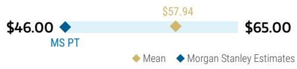

## RISK REWARD CHART

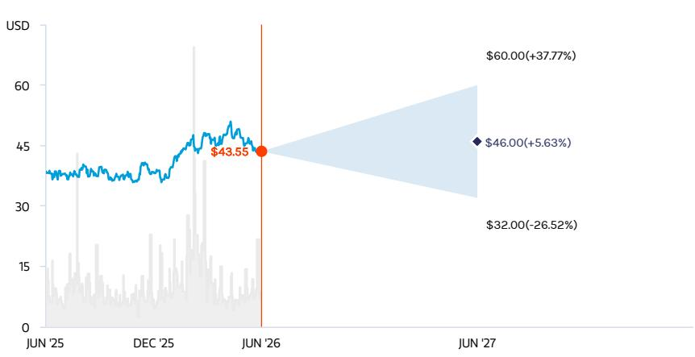  
Key: — Historical Stock Performance ● Current Stock Price ◆ Price Target

## OVERWEIGHT THESIS

■ We estimate VNOM to trade in-line with oil E&Ps on 2027 FCF yield and shareholder returns..

■ Above average multi-year growth outlook at no D&C capex risk. VNOM offers a superior oil production growth relative to oil E&Ps at zero drilling and completion (D&C) capital requirement.

■ Superior EBITDA margins. Viper generated one of the highest 2026 EBITDA margins among mineral peers due to its lower cost structure and oil-weighted production mix.

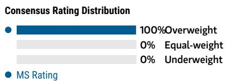  
Source: Refinitiv, MS  
Source: Refinitiv, MS

## BULL CASE

## 5.3x 2027e EV/EBITDA

## \$60.00 BASE CASE

Bull case of \$60 is based on a 50/50 blend of 1) a target multiple of 9.5x 2027e EV/EBITDA (\$61/share) and 2) our discounted cash flow value of \$59/share. Scenario assumes \$90.00 WTI, \$4.25 Henry Hub.

## 5.5x 2027e EV/EBITDA

Base case of \$46/share which is a 50/50 blend of 1) a target multiple of 9.5x 2027e EV/EBITDA (\$47/share) and 2) our discounted cash flow value of 46/share. Scenario assumes long-term (2027+) \$70.00 WTI, \$3.75 Henry Hub.

## \$46.00 BEAR CASE

## \$32.00

## 5.7x 2027e EV/EBITDA

Bear case of \$32 is based on a 50/50 blend of 1) a target multiple of 9.5x 2027e EV/EBITDA (\$32/share) and 2) our discounted cash flow value of \$33/share. Scenario assumes \$50.00 WTI, \$3.25 Henry Hub.

Mean MS Estimates Source: Refinitiv, MS

## Risk Reward – Viper Energy Inc (VNOM.O)

## KEY EARNINGS INPUTS

<table><tr><td>Drivers</td><td>Dec 2025</td><td>Dec 2026e</td><td>Dec 2027e</td><td>Dec 2028e</td></tr><tr><td>Total Production (Mboe/d) (mm)</td><td>95.1</td><td>129.8</td><td>135.2</td><td>143.1</td></tr><tr><td>Gas Production (MMcf/d) (mm)</td><td>142</td><td>192</td><td>194</td><td>205</td></tr><tr><td>Realized Oil Price ($)</td><td>63.27</td><td>77.81</td><td>69.67</td><td>69.67</td></tr><tr><td>Realized Gas Price ($)</td><td>1.92</td><td>1.03</td><td>1.58</td><td>2.00</td></tr><tr><td>EBITDAX Margin per Boe ($)</td><td>36.29</td><td>42.02</td><td>39.17</td><td>39.89</td></tr></table>

## INVESTMENT DRIVERS

\- Commodity prices

• Production growth

\- Return of capital

\- Deleveraging

## GLOBAL REVENUE EXPOSURE

  
Source: MS Estimate View explanation of regional hierarchies here

## MS ALPHA MODELS

<table><tr><td>1/5BEST</td><td>24 MonthHorizon</td><td>2/5MOST</td><td>3 MonthHorizon</td></tr></table>

Source: Refinitiv, FactSet, MS; 1 is the highest favored Quintile and 5 is the least favored Quintile

## RISKS TO PT/RATING

## RISKS TO UPSIDE

• Higher commodity prices - Increased operator drilling leading to higher production volumes

\- Heightened M&A activity accretive to key financial metrics

## RISKS TO DOWNSIDE

• Lower commodity prices

• Production and M&A activity slows

• Production shifts by operational partners

## OWNERSHIP POSITIONING

<table><tr><td>Inst. Owners, % Active</td><td>69.4%</td></tr><tr><td>HF Sector Long/Short Ratio</td><td>1.7x</td></tr><tr><td>HF Sector Net Exposure</td><td>4.7%</td></tr></table>

Refinitiv; MSPB Content. Includes certain hedge fund exposures held with MSPB. Information may be inconsistent with or may not reflect broader market trends. Long/Short Ratio = Long Exposure / Short exposure. Sector % of Total Net Exposure = (For a particular sector: Long Exposure - Short Exposure) / (Across all sectors: Long Exposure – Short Exposure).

## MS ESTIMATES VS. CONSENSUS

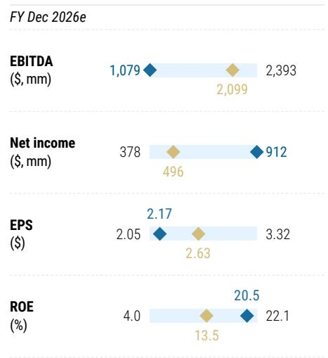

## Risk Reward – Suncor Energy Inc (SU.TO)

Solid FCF unlock and asset integration at fair valuation.

## PRICE TARGET C\$92.00

Base case of C\$92/share which is a 50/50 blend of 1) a target multiple of 6.5x 2027e EV/DACF (C\$95/share) and 2) our discounted cash flow value of C\$89/share (with a WACC of 8.8% and terminal EV/EBITDA multiple of 5.3x).

## Consensus Price Target Distribution

Source: Refinitiv, MS

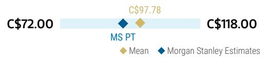

## RISK REWARD CHART AND OPTIONS IMPLIED PROBABILITIES (12M)

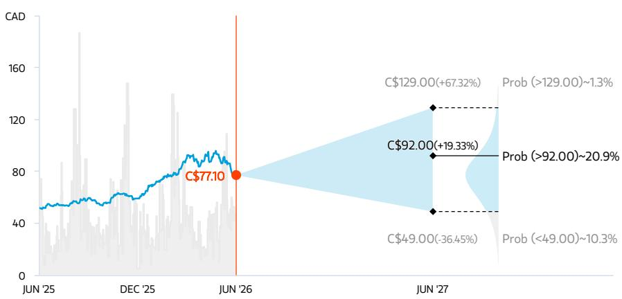  
Key: — Historical Stock Performance ● Current Stock Price ◆ Price Target

Source: Refinitiv, MS, MS Institutional Equities Division. The probabilities of our Bull, Base, and Bear case scenarios playing out were estimated with implied volatility data from the options market as of 25 Jun 2026. All figures are approximate risk-neutral probabilities of the stock reaching beyond the scenario price in either three-months' or one-years' time. View explanation of Options Probabilities methodology here

## EQUAL-WEIGHT THESIS

■ Valuation. Since the start of 2024, SU has outperformed Canadian peers \~16% on the back of a series of strong quarterly results, and higher shareholder returns. We now estimate '27 FCF yield of \~11%, in-line with the peer average.

■ More growth and visibility. The '26 investor day outlined C\$2 B of FFF growth (at \$65 WTI) through 2028 and a \$5 dollar reduction in WTI breakeven. SU also provided visibility to long term bitumen supply options into next decade.
■ Shareholder returns. SU trades at a 11% 2027E total shareholder return yield, higher than the peer average of 8%.

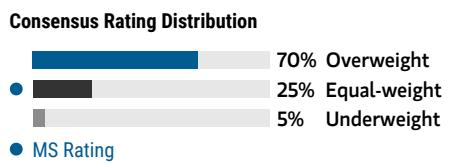  
Source: Refinitiv, MS

## Risk Reward Themes

Self-help: Positive
View descriptions of Risk Rewards Themes here

## BULL CASE

C\$129.00

## 8.9x 2027e DACF of C\$18.4 B

Bull case of C\$129/sh which is a 50/50 blend of 1) a target multiple of 7.5x 2027e EV/DACF (C\$135/share) and 2) our discounted cash flow value of C\$122/share (with a WACC of 8.8% and terminal EV/EBITDA multiple of 6.0x). Assumes long-term (2027+) prices of US\$95.0 Brent, US\$4.25 HH, refining cracks increase \~10%, carbon prices flat from 2022-2030.

## BASE CASE

## 7.2x 2027e DACF.

Base case of C\$92/share which is a 50/50 blend of 1) a target multiple of 7.5x 2027e EV/DACF (C\$95/share) and 2) our discounted cash flow value of C\$89/share (with a WACC of 8.8% and terminal EV/EBITDA multiple of 5.4x). Assumes long-term (2027+) prices of US\$75.00 Brent, US\$3.75 HH, WTI-WCS of US\$15, carbon prices increase C\$15/tonne per year through 2030.

## C\$92.00 BEAR CASE

C\$49.00

## 7.2x 2027e DACF of C\$9.6 B

Bear case of C\$49/sh which is a 50/50 blend of 1) a target multiple of 7.5x 2027e EV/DACF (C\$60/share) and 2) our discounted cash flow value of C\$37/share (with a WACC of 8.8% and terminal EV/EBITDA multiple of 3.6x). Assumes long-term (2027+) prices of US\$55.00 Brent, US\$3.25 HH, refining cracks decline \~10%, carbon price increases by C\$30/tonne per year through 2030.

FY Dec 2026e

## Risk Reward – Suncor Energy Inc (SU.TO)

## KEY EARNINGS INPUTS

<table><tr><td>Drivers</td><td>Dec 2025</td><td>Dec 2026e</td><td>Dec 2027e</td><td>Dec 2028e</td></tr><tr><td>Total Production (Mboe/d)</td><td>860</td><td>864</td><td>912</td><td>965</td></tr><tr><td>Downstream Throughput (Mbbl/d)</td><td>480</td><td>475</td><td>478</td><td>478</td></tr><tr><td>Total Capex (C$MM) (C$)</td><td>5,658</td><td>5,692</td><td>5,645</td><td>5,679</td></tr></table>

## INVESTMENT DRIVERS

\- Integrated model

• Well-developed cash return and capital allocation strategy

\- Peer-leading renewables expansion plan; allocating \~10% of annual budget on investments advancing low-carbon energy offerings

## GLOBAL REVENUE EXPOSURE

  
Source: MS Estimate View explanation of regional hierarchies here

## MS ALPHA MODELS

1/5 MOST 3 Month Horizon

Source: Refinitiv, FactSet, MS; 1 is the highest favored Quintile and 5 is the least favored Quintile

## RISKS TO PT/RATING

## RISKS TO UPSIDE

• Crude prices are higher than expected

\- Increasing cash returns

• Further expansion into renewables

\- Accelerated achievement of breakeven reduction

## RISKS TO DOWNSIDE

• Commodity prices decline materially

\- Downstream margins narrow

• Capital cost inflation, execution risk on renewables projects, and geopolitical risks

## OWNERSHIP POSITIONING

<table><tr><td>Inst. Owners, % Active</td><td>66.6%</td></tr><tr><td>HF Sector Long/Short Ratio</td><td>1.7x</td></tr><tr><td>HF Sector Net Exposure</td><td>4.7%</td></tr></table>

Refinitiv; MSPB Content. Includes certain hedge fund exposures held with MSPB. Information may be inconsistent with or may not reflect broader market trends. Long/Short Ratio = Long Exposure / Short exposure. Sector % of Total Net Exposure = (For a particular sector: Long Exposure - Short Exposure) / (Across all sectors: Long Exposure – Short Exposure).

MS ESTIMATES VS. CONSENSUS  
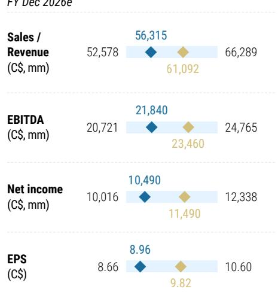  
Mean MS Estimates Source: Refinitiv, MS

## Risk Reward Reference links

1. View explanation of Options Probabilities methodology -

Options\_Probabilities\_Exhibit\_Link.pdf

2. View descriptions of Risk Rewards Themes - RR\_Themes\_Exhibit\_Link.pdf

3. View explanation of regional hierarchies - GEG\_Exhibit\_Link.pdf

4. View explanation of Theme/Exposure methodology -

ESG\_Sustainable\_Solutions\_External\_Link.pdf

5. View explanation of HERS methodology - ESG\_HERS\_External\_Link.pdf

## Disclosure Section

The information and opinions in MS were prepared by MS & Co. LLC, and/or MS C.T.V.M. S.A., and/or MS Mexico, Casa de Bolsa, S.A. de C.V., and/or MS Canada Limited. As used in this disclosure section, "MS" includes MS & Co. LLC, MS C.T.V.M. S.A., MS Mexico, Casa de Bolsa, S.A. de C.V., MS Canada Limited and their affiliates as necessary.

For important disclosures, stock price charts and equity rating histories regarding companies that are the subject of this report, please see the MS Disclosure Website at www.morganstanley.com/eqr/disclosures/webapp/generalresearch, or contact your investment representative or MS at 1585 Broadway, (Attention: Research Management), New York, NY, 10036 USA.

For valuation methodology and risks associated with any recommendation, rating or price target referenced in this research report, please contact the Client Support Team as follows: US/Canada +1 800 303-2495; Hong Kong +852 2848-5999; Latin America +1 718 754-5444 (U.S.); London +44 (0)20-7425-8169; Singapore +65 6834-6860; Sydney +61 (0)2-9770-1505; Tokyo +81 (0)3-6836-9000. Alternatively you may contact your investment representative or MS at 1585 Broadway, (Attention: Research Management), New York, NY 10036 USA.

## Analyst Certification

The following analysts hereby certify that their views about the companies and their securities discussed in this report are accurately expressed and that they have not received and will not receive direct or indirect compensation in exchange for expressing specific recommendations or views in this report: Jacqueline M Kenny; Joe Laetsch, CFA; Helen Lin; Devin McDermott.

## Global Research Conflict Management Policy

MS has been published in accordance with our conflict management policy, which is available at www.morganstanley.com/institutional/research/conflictpolicies. A Portuguese version of the policy can be found at www.morganstanley.com.br

## Important Regulatory Disclosures on Subject Companies

The analyst or strategist (or a household member) identified below owns the following securities (or related derivatives): Devin McDermott - Exxon Mobil Corporation(common or preferred stock).

As of May 29, 2026, MS beneficially owned 1% or more of a class of common equity securities of the following companies covered in MS: Antero Resources Corp, APA Corp, Cheniere Energy Inc, Chevron Corporation, Chord Energy Corporation, CNX Resources Corp, ConocoPhillips, Devon Energy Corp, Diamondback Energy Inc, EOG Resources Inc, EQT Corp., Expand Energy Corp, Exxon Mobil Corporation, Matador Resources Co, Murphy Oil Corporation, Northern Oil & Gas Inc., Occidental Petroleum Corp, Permian Resources Corp, Range Resources Corp., Tourmaline Oil Corp..

Within the last 12 months, MS managed or co-managed a public offering (or 144A offering) of securities of Cheniere Energy Inc, Chevron Corporation, CNX Resources Corp, Diamondback Energy Inc, EOG Resources Inc, Murphy Oil Corporation, Northern Oil & Gas Inc., Permian Resources Corp, Viper Energy Inc.

Within the last 12 months, MS has received compensation for investment banking services from Cheniere Energy Inc, Chevron Corporation, CNX Resources Corp, Devon Energy Corp, Diamondback Energy Inc, EOG Resources Inc, Expand Energy Corp, Murphy Oil Corporation, Northern Oil & Gas Inc., Permian Resources Corp, Viper Energy Inc.

In the next 3 months, MS expects to receive or intends to seek compensation for investment banking services from Antero Resources Corp, APA Corp, Cenovus Energy, Cheniere Energy Inc, Chevron Corporation, Chord Energy Corporation, CNX Resources Corp, Comstock Resources Inc., ConocoPhillips, Devon Energy Corp, Diamondback Energy Inc, EOG Resources Inc, EQT Corp., Expand Energy Corp, Exxon Mobil Corporation, Matador Resources Co, Murphy Oil Corporation, Northern Oil & Gas Inc., Occidental Petroleum Corp, Permian Resources Corp, Range Resources Corp., Suncor Energy Inc, Tourmaline Oil Corp., Venture Global Inc, Viper Energy Inc.

Within the last 12 months, MS has received compensation for products and services other than investment banking services from Antero Resources Corp, APA Corp, Cenovus Energy, Cheniere Energy Inc, Chevron Corporation, CNX Resources Corp, Comstock Resources Inc., ConocoPhillips, Devon Energy Corp, Diamondback Energy Inc, EOG Resources Inc, EQT Corp., Expand Energy Corp, Exxon Mobil Corporation, Northern Oil & Gas Inc., Occidental Petroleum Corp, Ovintiv Inc, Permian Resources Corp, Range Resources Corp., Suncor Energy Inc, Tourmaline Oil Corp., Venture Global Inc, Viper Energy Inc.

Within the last 12 months, MS has provided or is providing investment banking services to, or has an investment banking client relationship with, the following company: Antero Resources Corp, APA Corp, Cenovus Energy, Cheniere Energy Inc, Chevron Corporation, Chord Energy Corporation, CNX Resources Corp, Comstock Resources Inc., ConocoPhillips, Devon Energy Corp, Diamondback Energy Inc, EOG Resources Inc, EQT Corp., Expand Energy Corp, Exxon Mobil Corporation, Matador Resources Co, Murphy Oil Corporation, Northern Oil & Gas Inc., Occidental Petroleum Corp, Permian Resources Corp, Range Resources Corp., Suncor Energy Inc, Tourmaline Oil Corp., Venture Global Inc, Viper Energy Inc.

Within the last 12 months, MS has either provided or is providing non-investment banking, securities-related services to and/or in the past has entered into an agreement to provide services or has a client relationship with the following company: Antero Resources Corp, APA Corp, Canadian Natural Resources Ltd, Cenovus Energy, Cheniere Energy Inc, Chevron Corporation, Chord Energy Corporation, CNX Resources Corp, Comstock Resources Inc., ConocoPhillips, Devon Energy Corp, Diamondback Energy Inc, EOG Resources Inc, EQT Corp., Expand Energy Corp, Exxon Mobil Corporation, Northern Oil & Gas Inc., Occidental Petroleum Corp, Ovintiv Inc, Permian Resources Corp, Range Resources Corp., Suncor Energy Inc, Tourmaline Oil Corp., Venture Global Inc, Viper Energy Inc.

An employee, director or consultant of MS is a director of Occidental Petroleum Corp. This person is not a research analyst or a member of a research analyst's household.

MS & Co. LLC makes a market in the securities of Chord Energy Corporation, CNX Resources Corp, Comstock Resources Inc., Matador Resources Co, Murphy Oil Corporation. The equity research analysts or strategists principally responsible for the preparation of MS have received compensation based upon various factors, including quality of research, investor client feedback, stock picking, competitive factors, firm revenues and overall investment banking revenues. Equity Research analysts' or strategists' compensation is not linked to investment banking or capital markets transactions performed by MS or the profitability or revenues of particular trading desks.

MS and its affiliates do business that relates to companies/instruments covered in MS, including market making, providing liquidity, fund management, commercial banking, extension of credit, investment services and investment banking. MS sells to and buys from customers the securities/instruments of companies covered in MS on a principal basis. MS may have a position in the debt of the Company or instruments discussed in this report. MS trades or may trade as principal in the debt securities (or in related derivatives) that are the subject of the debt research report.

Certain disclosures listed above are also for compliance with applicable regulations in non-US jurisdictions.

## STOCK RATINGS

MS uses a relative rating system using terms such as Overweight, Equal-weight, Not-Rated or Underweight (see definitions below). MS does not assign ratings of Buy, Hold or Sell to the stocks we cover. Overweight, Equal-weight, Not-Rated and Underweight are not the equivalent of buy, hold and sell. Investors should carefully read the definitions of all ratings used in MS. In addition, since MS contains more complete information concerning the analyst's views, investors should carefully read MS, in its entirety, and not infer the contents from the rating alone. In any case, ratings (or research) should not be used or relied upon as investment advice. An investor's decision to buy or sell a stock should depend on individual circumstances (such as the investor's existing holdings) and other considerations.

## Global Stock Ratings Distribution

## (as of May 31, 2026)

The Stock Ratings described below apply to MS's Fundamental Equity Research and do not apply to Debt Research produced by the Firm.

For disclosure purposes only (in accordance with FINRA requirements), we include the category headings of Buy, Hold, and Sell alongside our ratings of Overweight, Equal-weight, Not-Rated and Underweight. MS does not assign ratings of Buy, Hold or Sell to the stocks we cover. Overweight, Equal-weight, Not-Rated and Underweight are not the equivalent of buy, hold, and sell but represent recommended relative weightings (see definitions below). To satisfy regulatory requirements, we correspond Overweight, our most positive stock rating, with a buy recommendation; we correspond Equal-weight and Not-Rated to hold and Underweight to sell recommendations, respectively.

<table><tr><td></td><td colspan="2">Coverage Universe</td><td colspan="3">Investment Banking Clients (IBC)</td><td colspan="2">Other Material Investment ServicesClients (MISC)</td></tr><tr><td>Stock RatingCategory</td><td>Count</td><td>% of Total</td><td>Count</td><td>% of Total IBC</td><td>% of RatingCategory</td><td>Count</td><td>% of Total OtherMISC</td></tr><tr><td>Overweight/Buy</td><td>1542</td><td>42%</td><td>465</td><td>51%</td><td>30%</td><td>707</td><td>43%</td></tr><tr><td>Equal-weight/Hold</td><td>1571</td><td>43%</td><td>369</td><td>40%</td><td>23%</td><td>723</td><td>44%</td></tr><tr><td>Not-Rated/Hold</td><td>3</td><td>0%</td><td>0</td><td>0%</td><td>0%</td><td>1</td><td>0%</td></tr><tr><td>Underweight/Sell</td><td>551</td><td>15%</td><td>86</td><td>9%</td><td>16%</td><td>201</td><td>12%</td></tr><tr><td>Total</td><td>3,667</td><td></td><td>920</td><td></td><td></td><td>1632</td><td></td></tr></table>

Data include common stock and ADRs currently assigned ratings. Investment Banking Clients are companies from whom MS received investment banking compensation in the last 12 months. Due to rounding off of decimals, the percentages provided in the "% of total" column may not add up to exactly 100 percent.

## Analyst Stock Ratings

Overweight (O). The stock's total return is expected to exceed the average total return of the analyst's industry (or industry team's) coverage universe, on a risk-adjusted basis, over the next 12-18 months.

Equal-weight (E). The stock's total return is expected to be in line with the average total return of the analyst's industry (or industry team's) coverage universe, on a risk-adjusted basis, over the next 12-18 months.

Not-Rated (NR). Currently the analyst does not have adequate conviction about the stock's total return relative to the average total return of the analyst's industry (or industry team's) coverage universe, on a risk-adjusted basis, over the next 12-18 months.

Underweight (U). The stock's total return is expected to be below the average total return of the analyst's industry (or industry team's) coverage universe, on a risk-adjusted basis, over the next 12-18 months.

Unless otherwise specified, the time frame for price targets included in MS is 12 to 18 months.

## Analyst Industry Views

Attractive (A): The analyst expects the performance of his or her industry coverage universe over the next 12-18 months to be attractive vs. the relevant broad market benchmark, as indicated below.

In-Line (I): The analyst expects the performance of his or her industry coverage universe over the next 12-18 months to be in line with the relevant broad market benchmark, as indicated below. Cautious (C): The analyst views the performance of his or her industry coverage universe over the next 12-18 months with caution vs. the relevant broad market benchmark, as indicated below. Benchmarks for each region are as follows: North America - S&P 500; Latin America - relevant MSCI country index or MSCI Latin America Index; Europe - MSCI Europe; Japan - TOPIX; Asia - relevant MSCI country index or MSCI sub-regional index or MSCI AC Asia Pacific ex Japan Index.

## Important Disclosures for MS Smith Barney LLC Customers

Important disclosures regarding any material conflict of interest that can reasonably be expected to have influenced MS Smith Barney LLC's choice of a third-party research provider or the subject company of a third-party research report, are available on the MS Wealth Management disclosure website at www.morganstanley.com/online/researchdisclosures. For MS specific disclosures, you may refer to https://www.morganstanley.com/eqr/disclosures/webapp/generalresearch.

Each MS report is reviewed and approved on behalf of MS Smith Barney LLC. This review and approval is conducted by the same person who reviews the research report on behalf of MS. This could create a conflict of interest.

## Other Important Disclosures

MS policy is to update research reports as and when the Research Analyst and Research Management deem appropriate, based on developments with the issuer, the sector, or the market that may have a material impact on the research views or opinions stated therein. In addition, certain Research publications are intended to be updated on a regular periodic basis (weekly/monthly/quarterly/annual) and will ordinarily be updated with that frequency, unless the Research Analyst and Research Management determine that a different publication schedule is appropriate based on current conditions.

MS is not acting as a municipal advisor and the opinions or views contained herein are not intended to be, and do not constitute, advice within the meaning of Section 975 of the Dodd-Frank Wall Street Reform and Consumer Protection Act.

MS produces an equity research product called a "Tactical Idea." Views contained in a "Tactical Idea" on a particular stock may be contrary to the recommendations or views expressed in research on the same stock. This may be the result of differing time horizons, methodologies, market events, or other factors. For all research available on a particular stock, please contact your sales representative or go to Matrix at http://www.morganstanley.com/matrix.

MS is provided to our clients through our proprietary research portal on Matrix and also distributed electronically by MS to clients. Certain, but not all, MS products are also made available to clients through third-party vendors or redistributed to clients through alternate electronic means as a convenience. For access to all available MS, please contact your sales representative or go to Matrix at http://www.morganstanley.com/matrix.

Any access and/or use of MS is subject to MS's Terms of Use (http://www.morganstanley.com/terms.html). By accessing and/or using MS, you are indicating that you have read and agree to be bound by our Terms of Use (http://www.morganstanley.com/terms.html). In addition you consent to MS processing your personal data and using cookies in accordance with our Privacy Policy and our Global Cookies Policy (http://www.morganstanley.com/privacy\_pledge.html), including for the purposes of setting your preferences and to collect readership data so that we can deliver better and more personalized service and products to you. To find out more information about how MS processes personal data, how we use cookies and how to reject cookies see our Privacy Policy and our Global Cookies Policy (http://www.morganstanley.com/privacy\_pledge.html). Please use the provided link to review the Terms and Conditions and Most Important Terms and Conditions for MS India Company Private Limited (https://www.morganstanley.com/assets/pdfs/about-us-global-offices/india/Terms\_and\_conditions.pdf) and the following link to review the audit report (https://ny.matrix.ms.com/eqr/research/webapp/researchdocs/MSICPL\_Morgan\_Stanley\_Research\_Audit\_Report.pdf).

If you do not agree to our Terms of Use and/or if you do not wish to provide your consent to MS processing your personal data or using cookies please do not access our research. MS does not provide individually tailored investment advice. MS has been prepared without regard to the circumstances and objectives of those who receive it. MS recommends that investors independently evaluate particular investments and strategies, and encourages investors to seek the advice of a financial adviser. The appropriateness of an investment or strategy will depend on an investor's circumstances and objectives. The securities, instruments, or strategies discussed in MS may not be suitable for all investors, and certain investors may not be eligible to purchase or participate in some or all of them. MS is not an offer to buy or sell or the solicitation of an offer to buy or sell any security/instrument or to participate in any particular trading strategy. The value of and income from your investments may vary because of changes in interest rates, foreign exchange rates, default rates, prepayment rates, securities/instruments prices, market indexes, operational or financial conditions of companies or other factors. There may be time limitations on the exercise of options or other rights in securities/instruments transactions. Past performance is not necessarily a guide to future performance. Estimates of future performance are based on assumptions that may not be realized. If provided, and unless otherwise stated, the closing price on the cover page is that of the primary exchange for the subject company's securities/instruments.

The fixed income research analysts, strategists or economists principally responsible for the preparation of MS have received compensation based upon various factors, including quality, accuracy and value of research, firm profitability or revenues (which include fixed income trading and capital markets profitability or revenues), client feedback and competitive factors. Fixed Income Research analysts', strategists' or economists' compensation is not linked to investment banking or capital markets transactions performed by MS or the profitability or revenues of particular trading desks.

The "Important Regulatory Disclosures on Subject Companies" section in MS lists all companies mentioned where MS owns 1% or more of a class of common equity securities of the companies. For all other companies mentioned in MS, MS may have an investment of less than 1% in securities/instruments or derivatives of securities/instruments of companies and may trade them in ways different from those discussed in MS. Employees of MS not involved in the preparation of MS may have investments in securities/instruments or derivatives of securities/instruments of companies mentioned and may trade them in ways different from those discussed in MS. Derivatives may be issued by MS or associated persons.

With the exception of information regarding MS, MS is based on public information. MS makes every effort to use reliable, comprehensive information, but we make no representation that it is accurate or complete. We have no obligation to tell you when opinions or information in MS change apart from when we intend to discontinue equity research coverage of a subject company. Facts and views presented in MS have not been reviewed by, and may not reflect information known to, professionals in other MS business areas, including investment banking personnel.

MS personnel may participate in company events such as site visits and are generally prohibited from accepting payment by the company of associated expenses unless pre-approved by authorized members of Research management.

MS may make investment decisions that are inconsistent with the recommendations or views in this report.

To our readers based in Taiwan or trading in Taiwan securities/instruments: Information on securities/instruments that trade in Taiwan is distributed by MS Taiwan Limited ("MSTL"). Such information is for your reference only. The reader should independently evaluate the investment risks and is solely responsible for their investment decisions. MS may not be distributed to the public media or quoted or used by the public media without the express written consent of MS. Any non-customer reader within the scope of Article 7-1 of the Taiwan Stock Exchange Recommendation Regulations accessing and/or receiving MS is not permitted to provide MS to any third party (including but not limited to related parties, affiliated companies and any other third parties) or engage in any activities regarding MS which may create or give the appearance of creating a conflict of interest. Information on securities/instruments that do not trade in Taiwan is for informational purposes only and is not to be construed as a recommendation or a solicitation to trade in such securities/instruments. MSTL may not execute transactions for clients in these securities/instruments.

MS is not incorporated under PRC law and the research in relation to this report is conducted outside the PRC. MS does not constitute an offer to sell or the solicitation of an offer to buy any securities in the PRC. PRC investors shall have the relevant qualifications to invest in such securities and shall be responsible for obtaining all relevant approvals, licenses, verifications and/or registrations from the relevant governmental authorities themselves. Neither this report nor any part of it is intended as, or shall constitute, provision of any consultancy or advisory service of securities investment as defined under PRC law. Such information is provided for your reference only.

MS is disseminated in Brazil by MS C.T.V.M. S.A. located at Av. Brigadeiro Faria Lima, 3600, 6th floor, São Paulo - SP, Brazil; and is regulated by the Comissão de Valores Mobiliários; in Mexico by MS México, Casa de Bolsa, S.A. de C.V which is regulated by Comision Nacional Bancaria y de Valores. Paseo de los Tamarindos 90, Torre 1, Col. Bosques de las Lomas Floor 29, 05120 Mexico City; in Japan by MS MUFG Securities Co., Ltd. and, for Commodities related research reports only, MS Capital Group Japan Co., Ltd; in Hong Kong by MS Asia Limited (which accepts responsibility for its contents) and by MS Bank Asia Limited; in Singapore by MS Asia (Singapore) Pte. (Registration number 199206298Z) and/or MS Asia (Singapore) Securities Pte Ltd (Registration number 200008434H), regulated by the Monetary Authority of Singapore (which accepts legal responsibility for its contents and should be contacted with respect to any matters arising from, or in connection with, MS) and by MS Bank Asia Limited, Singapore Branch (Registration number T14FC0118); in Australia to "wholesale clients" within the meaning of the Australian Corporations Act by MS Australia Limited A.B.N. 67 003 734 576, holder of Australian financial services license No. 233742, which accepts responsibility for its contents; in Australia to "wholesale clients" and "retail clients" within the meaning of the Australian Corporations Act by MS Wealth Management Australia Pty Ltd (A.B.N. 19 009 14-5 555, holder of Australian financial services license No. 240813, which accepts responsibility for its contents; in Korea by MS & Co International plc, Seoul Branch; in India by MS India Company Private Limited having Corporate Identification No (CIN) U22990MH1998PTC115305, regulated by the Securities and Exchange Board of India ("SEBI") and holder of licenses as a Research Analyst (SEBI Registration No. INH000001105); Stock Broker (SEBI Stock Broker Registration No. INZ000244438), Merchant Banker (SEBI Registration No. INM000011203), and depository participant with National Securities Depository Limited (SEBI Registration No. IN-DP-NSDL-567-2021) having registered office at Altimus, Level 39 & 40, Pandurang Budhkar Marg, Worli, Mumbai 400018, India;

Telephone no. +91-22-61181000; Compliance Officer Details: Mr. Tejarshi Hardas, Tel. No.: +91-22-61181000 or Email: tejarshi.hardas@morganstanley.com; Grievance officer details: Mr. Tejarshi Hardas, Tel. No.: +91-22-61181000 or Email: msic-compliance@morganstanley.com. MS India Company Private Limited (MSICPL) may use AI tools in providing research services. All recommendations contained herein are made by the duly qualified research analysts; in Canada by MS Canada Limited; in Germany and the European Economic Area where required by MS Europe S.E., authorised and regulated by Bundesanstalt fuer Finanzdienstleistungsaufsicht (BaFin) under the reference number 149169; in the US by MS & Co. LLC, which accepts responsibility for its contents. MS & Co. International plc, authorized by the Prudential Regulation Authority and regulated by the Financial Conduct Authority and the Prudential Regulation Authority, disseminates in the UK research that it has prepared, and research which has been prepared by any of its affiliates, only to persons who (i) are investment professionals falling within Article 19(5) of the Financial Services and Markets Act 2000 (Financial Promotion) Order 2005 (as amended, the "Order"); (ii) are persons who are high net worth entities falling within Article 49(2)(a) to (d) of the Order; or (iii) are persons to whom an invitation or inducement to engage in investment activity (within the meaning of section 21 of the Financial Services and Markets Act 2000, as amended) may otherwise lawfully be communicated or caused to be communicated. RMB MS Proprietary Limited is a member of the JSE Limited and A2X (Pty) Ltd. RMB MS Proprietary Limited is a joint venture owned equally by MS International Holdings Inc. and RMB Investment Advisory (Proprietary) Limited, which is wholly owned by FirstRand Limited. The information in MS is being disseminated by MS Saudi Arabia, regulated by the Capital Market Authority in the Kingdom of Saudi Arabia, and is directed at Sophisticated investors only.

The information in MS is being communicated by MS & Co. International plc (DIFC Branch), regulated by the Dubai Financial Services Authority (the DFSA) or by MS & Co. International plc (ADGM Branch), regulated by the Financial Services Regulatory Authority Abu Dhabi (the FSRA), and is directed at Professional Clients only, as defined by the DFSA or the FSRA, respectively. The financial products or financial services to which this research relates will only be made available to a customer who we are satisfied meets the regulatory criteria of a Professional Client. A distribution of the different MS Research ratings or recommendations, in percentage terms for Investments in each sector covered, is available upon request from your sales representative.

The information in MS is being communicated by MS & Co. International plc (QFC Branch), regulated by the Qatar Financial Centre Regulatory Authority (the QFCRA), and is directed at business customers and market counterparties only and is not intended for Retail Customers as defined by the QFCRA.

As required by the Capital Markets Board of Turkey, investment information, comments and recommendations stated here, are not within the scope of investment advisory activity. Investment advisory service is provided exclusively to persons based on their risk and income preferences by the authorized firms. Comments and recommendations stated here are general in nature. These opinions may not fit to your financial status, risk and return preferences. For this reason, to make an investment decision by relying solely to this information stated here may not bring about outcomes that fit your expectations.

The trademarks and service marks contained in MS are the property of their respective owners. Third-party data providers make no warranties or representations relating to the accuracy, completeness, or timeliness of the data they provide and shall not have liability for any damages relating to such data. The Global Industry Classification Standard (GICS) was developed by and is the exclusive property of MSCI and S&P.

MS, or any portion thereof may not be reprinted, sold or redistributed without the written consent of MS.

Indicators and trackers referenced in MS may not be used as, or treated as, a benchmark under Regulation EU 2016/1011, or any other similar framework.

The issuers and/or fixed income products recommended or discussed in certain fixed income research reports may not be continuously followed. Accordingly, investors should regard those fixed income research reports as providing stand-alone analysis and should not expect continuing analysis or additional reports relating to such issuers and/or individual fixed income products. MS may hold, from time to time, material financial and commercial interests regarding the company subject to the Research report.

Registration granted by SEBI and certification from the National Institute of Securities Markets (NISM) in no way guarantee performance of the intermediary or provide any assurance of returns to investors. Investment in securities market are subject to market risks. Read all the related documents carefully before investing.

INDUSTRY COVERAGE: Exploration & Production

<table><tr><td>COMPANY (TICKER)</td><td>RATING (AS OF)</td><td>PRICE* (06/25/2026)</td></tr><tr><td colspan="3">Devin McDermott</td></tr><tr><td>Antero Resources Corp (AR.N)</td><td>O (04/17/2024)</td><td>$34.50</td></tr><tr><td>APA Corp (APA.O)</td><td>U (04/15/2024)</td><td>$33.42</td></tr><tr><td>Chord Energy Corporation (CHRD.O)</td><td>O (03/27/2026)</td><td>$119.48</td></tr><tr><td>CNX Resources Corp (CNX.N)</td><td>U (01/10/2025)</td><td>$33.61</td></tr><tr><td>Comstock Resources Inc. (CRK.N)</td><td>E (01/10/2025)</td><td>$13.87</td></tr><tr><td>ConocoPhillips (COP.N)</td><td>O (12/16/2024)</td><td>$106.41</td></tr><tr><td>Devon Energy Corp (DVN.N)</td><td>O (12/11/2023)</td><td>$42.60</td></tr><tr><td>Diamondback Energy Inc (FANG.O)</td><td>O (12/11/2020)</td><td>$182.55</td></tr><tr><td>EOG Resources Inc (EOG.N)</td><td>E (12/11/2023)</td><td>$133.59</td></tr><tr><td>EQT Corp. (EQT.N)</td><td>O (11/18/2021)</td><td>$51.65</td></tr><tr><td>Expand Energy Corp (EXE.O)</td><td>O (01/10/2025)</td><td>$88.44</td></tr><tr><td>Matador Resources Co (MTDR.N)</td><td>E (01/10/2025)</td><td>$50.16</td></tr><tr><td>Murphy Oil Corporation (MUR.N)</td><td>U (01/22/2025)</td><td>$35.39</td></tr><tr><td>Northern Oil &amp; Gas Inc. (NOG.N)</td><td>U (08/18/2025)</td><td>$19.74</td></tr><tr><td>Occidental Petroleum Corp (OXY.N)</td><td>E (08/18/2025)</td><td>$51.21</td></tr><tr><td>Ovintiv Inc (OVV.N)</td><td>E (03/27/2026)</td><td>$53.55</td></tr><tr><td>Permian Resources Corp (PR.N)</td><td>O (01/10/2025)</td><td>$18.86</td></tr><tr><td>Range Resources Corp. (RRC.N)</td><td>E (03/26/2025)</td><td>$36.31</td></tr><tr><td>Tourmaline Oil Corp. (TOU.TO)</td><td>E (01/10/2025)</td><td>C$60.02</td></tr><tr><td>Viper Energy Inc (VNOM.O)</td><td>O (08/18/2025)</td><td>$43.55</td></tr></table>

Stock Ratings are subject to change. Please see latest research for each company.  
\* Historical prices are not split adjusted.

## INDUSTRY COVERAGE: Integrated Energy

<table><tr><td>COMPANY (TICKER)</td><td>RATING (AS OF)</td><td>PRICE* (06/25/2026)</td></tr><tr><td colspan="3">Devin McDermott</td></tr><tr><td>Canadian Natural Resources Ltd (CNQ.TO)</td><td>E (10/07/2021)</td><td>C$56.19</td></tr><tr><td>Cenovus Energy (CVE.TO)</td><td>O (10/07/2021)</td><td>C$34.96</td></tr><tr><td>Chevron Corporation (CVX.N)</td><td>O (08/04/2025)</td><td>$172.24</td></tr><tr><td>Exxon Mobil Corporation (XOM.N)</td><td>O (05/14/2024)</td><td>$137.55</td></tr><tr><td>Imperial Oil Ltd (IMO.TO)</td><td>E (10/07/2021)</td><td>C$160.92</td></tr><tr><td>Suncor Energy Inc (SU.TO)</td><td>E (12/16/2024)</td><td>C$77.10</td></tr></table>

Stock Ratings are subject to change. Please see latest research for each company.

\* Historical prices are not split adjusted.

## © 2026 MS