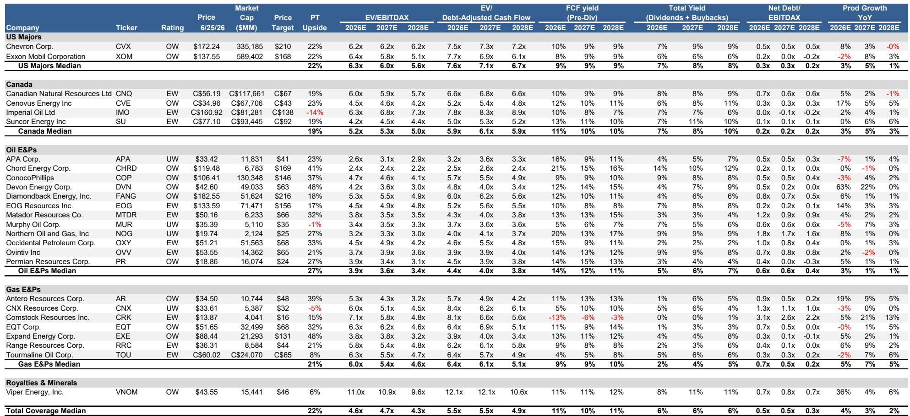
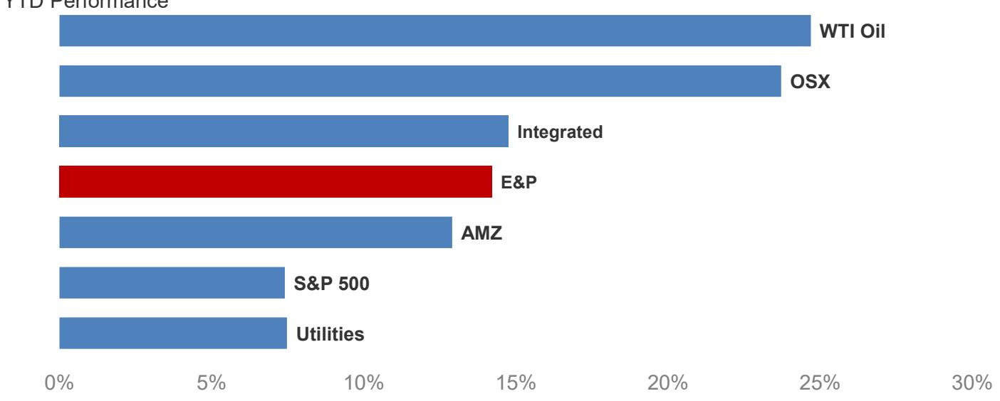

# Energy Stocks Have Corrected Too Far: The Market Is Pricing In a Recession That Hasn't Arrived

The energy sector has experienced a violent repricing since mid-June, and the magnitude of the selloff has disconnected stock prices from underlying fundamentals. WTI crude has fallen approximately 15% since the announcement of a memorandum of understanding between the US and Iran, bringing prices back to approximately $72 per barrel. Energy equities have followed suit, with oil exploration and production companies now trading at pre-conflict levels and major integrated firms sitting 9% below those same benchmarks. This correction is not merely a reflection of softer commodity prices. It represents a market that has begun pricing in a macroeconomic deterioration that current data does not support.

The central argument of this analysis is straightforward: the risk-reward profile for energy equities has improved meaningfully after this pullback, and investors who treat this as a structural deterioration rather than a tactical overreaction risk missing one of the more compelling entry points in the sector this year. At strip prices near $70 WTI, the median 2027 free cash flow yield across oil coverage stands at 10%, with US E&Ps delivering 12%. More strikingly, intrinsic valuations across the coverage universe reflect a long-run WTI price of approximately $64 per barrel. That is 6% below the 12-month strip and well below the $70 long-run price assumption that underpins the fundamental outlook. The market is effectively discounting a recession scenario that has not yet materialized.

The timing of this analysis matters because the second quarter earnings season is about to provide a critical reality check. Preliminary estimates for 2Q EBITDA are in line with consensus for oil producers, and the report forecasts above-consensus earnings per share for Exxon Mobil. If quarterly results confirm that operational performance has not deteriorated alongside the equity selloff, the disconnect between price and value will become even more pronounced.

## The Post-MoU Oil Price Decline Reflects Supply Restoration, Not Demand Destruction

The most immediate catalyst for the oil price decline has been the resumption of flows through the Strait of Hormuz following the US-Iran memorandum of understanding. Data shows oil exports from countries behind the strait have exceeded 10 million barrels per day over the past week, approaching two-thirds of pre-conflict levels. This includes a surge in Iranian flows, which have benefited from eased sanctions and the lifting of the US blockade. Simultaneously, US exports remain historically high, and Chinese imports continue to run low, both serving as important buffers for the seaborne oil market.

The critical analytical question is whether this supply restoration is a one-time adjustment or the beginning of a sustained surplus. The evidence points toward the former. Global inventories have already drawn substantially during the period of restricted flows, and fully restoring regional production and refilling storage will take time. The market is correctly pricing in the near-term relief from additional barrels, but it may be incorrectly extrapolating this into a permanent shift in the supply-demand balance. The medium-term fundamentals have not changed: structural underinvestment in upstream capacity, declining legacy production in key basins, and the growing difficulty of replacing reserves all remain intact.

This distinction matters for portfolio positioning. If the price decline is primarily a supply normalization event rather than a demand collapse signal, then the correction in equity prices should be shallower and shorter than the macro-driven selloffs that energy investors have experienced in prior cycles. The current valuation levels already embed a $64 WTI assumption, which is below the level required to incentivize meaningful new supply. That creates a floor that is not present in a pure demand-shock scenario.

## At $70 WTI, Free Cash Flow Yields Are Too Compelling to Ignore, and Consensus Is Still Too Optimistic

The updated price deck, based on the June 19 strip, lowers the 2026 WTI assumption to approximately $78 per barrel from $88, with the back half of 2026 averaging $73. The 2027 assumption remains unchanged at $70. For integrated companies, US Gulf Coast refining margin assumptions are moving 22% higher in 2026. Henry Hub moves 8% lower for 2027. Overall, price targets move lower by 5% for oil E&Ps and 8% for gas names, but still imply 25% average upside from current levels.

The free cash flow analysis is where the opportunity becomes visible. At prices near strip, the median 2027 FCF yield across oil coverage is 10%. For US E&Ps specifically, that figure rises to 12%. For US majors, it is 9%, and for Canadian coverage, 10%. For gas-focused names, the 2027 FCF yield stands at 9%. These are not distressed yields. They are yields that would be attractive in any sector, let alone one that has been sold off as if facing an existential threat.

The disconnect between the report's estimates and consensus is equally instructive. At $70 WTI, the report's oil coverage has 5% downside versus consensus estimates, with 7% downside for oil E&Ps specifically. The 2027 FCF estimates are approximately 11% below consensus, and 2027 EBITDA estimates are 6% below. This means that even the report's more conservative assumptions generate free cash flow yields that most sectors would envy. The market is not simply pricing in lower oil prices. It is pricing in a scenario where those lower prices persist indefinitely and where companies cannot sustain their cash generation. The data does not support that conclusion.

## The Natural Gas Outlook Is More Complex, But Lower Oil Prices May Be the Silver Lining for Associated Gas Risks

The natural gas picture requires a more nuanced assessment. Prompt Henry Hub prices have been range-bound in the low-to-mid $3 range for most of June. The report expects a modest improvement in the third quarter, supported by higher LNG flows and power burn. LNG exports in June are running approximately 0.3 billion cubic feet per day above the May average, with feedgas deliveries to Golden Pass reaching about 600 million cubic feet per day. However, the outlook softens again into 2027, reflecting associated gas growth and still-elevated Haynesville activity.

The counterintuitive insight here is that lower oil prices may actually improve the natural gas outlook. When oil prices fall, the economics of drilling in oil-prone basins deteriorate, which can reduce associated gas production. Associated gas has been a persistent source of supply growth that has kept a lid on Henry Hub prices, even as demand from LNG exports and power generation has increased. If lower oil prices lead to a moderation in oil-directed drilling activity, the associated gas overhang could begin to dissipate faster than current models project.

On the global LNG front, JKM prices have fallen back toward $15 per million British thermal units, well off the highs but still up more than 50% year-to-date. Recent statements from QatarEnergy point to approximately 50% recovery in export volumes in about one month and 80% after two months, representing a recovery of everything except the damaged trains. This still leaves a very short window to normalize inventories before next winter. Over the past month, global consumption has started to inflect higher again alongside summer weather and storage refill needs. The report sees some upside to the second half of 2026 after the pullback, followed by a more balanced 2027.

## What the Report Does Not Fully Answer: The Durability of the Iran Supply Restoration and the Demand Trajectory

Any honest assessment of this analysis must acknowledge what remains unresolved. The report does not fully answer how durable the Iran supply restoration will be. The memorandum of understanding represents a political agreement, and the history of such agreements in the region is not encouraging. Sanctions relief can be reversed. Blockades can be reimposed. The current surge in flows may prove to be a temporary window rather than a permanent shift. If political conditions change, the supply assumptions that underpin the current price deck could become obsolete very quickly.

The report also leaves open the question of demand trajectory. Global consumption has started to inflect higher alongside summer weather and storage refill needs, but the macro environment remains uncertain. Chinese imports are low, and the trajectory of Chinese economic activity will be a critical variable for oil demand in the second half of the year. If Chinese demand does not recover as expected, or if broader macroeconomic weakness emerges in developed markets, the demand side of the equation could deteriorate in ways that the current price deck does not fully capture.

Finally, the report does not resolve the question of how quickly the market will reprice these equities if the fundamental picture holds. The current valuation levels reflect a $64 WTI assumption, which is below the report's long-run $70 expectation. But the timing of any re-rating is inherently uncertain. Investors who enter this market must be prepared for the possibility that the disconnect between price and value persists for longer than the fundamental analysis would suggest.

## A Decision Framework for Energy Investors After the Pullback

For investors evaluating whether to increase energy exposure after this correction, the analytical framework should focus on three variables: the free cash flow yield at current prices, the implied commodity price embedded in current valuations, and the rate of change in company-level fundamentals.

The first variable is the most straightforward. At current prices, the median 2027 FCF yield for oil E&Ps is 12%. For majors, it is 9%. These yields are attractive in absolute terms and even more attractive relative to other sectors that have not experienced a similar correction. An investor who believes that the long-run oil price will average $70 or higher is being paid a double-digit free cash flow yield to hold these equities while waiting for that thesis to play out.

The second variable is the implied commodity price. The report estimates that current valuations reflect a $64 WTI assumption. This is below the 12-month strip and below the report's long-run assumption. The gap between implied and actual prices represents a margin of safety. If oil prices stabilize or recover, the equity prices should follow. If oil prices decline further, the margin of safety provides some cushion before valuations become truly distressed.

The third variable is the rate of change in fundamentals. The report identifies a preference for majors and E&Ps with positive rate of change, specifically naming Devon Energy, Permian Resources, and Cenovus Energy. LNG producers such as Venture Global and Cheniere also screen attractively. The key insight here is that not all energy equities are created equal. Companies with exposure to LNG, downstream margins, or improving operational metrics may offer better risk-reward profiles than names that are purely leveraged to spot oil prices.

## The Full Picture Requires Granular Data That This Analysis Cannot Fully Capture

The analysis presented here synthesizes the key arguments and data points from a comprehensive research report, but it necessarily omits the detailed exhibits, price target changes, and scenario analysis that support the conclusions. The full report includes 16 exhibits covering everything from weekly energy sub-sector performance to bear-bull case frameworks, hedge book analysis, and the specific price target changes for each covered company. These exhibits provide the granularity that institutional investors need to make portfolio decisions.

For example, the report includes detailed hedge book analysis showing that oil coverage has hedged approximately 5% of 2027 production on average, while gas E&Ps have hedged approximately 30%. This has direct implications for earnings visibility and downside protection. The report also includes the specific price target changes for each company, with the median price target change being negative 6% but still implying 22% average upside. These are the details that matter when constructing a portfolio, and they are available in the full report along with the original charts.

Join the community to read the full report and review the original charts.

*This article is for learning and discussion only and does not constitute investment advice.*

Personal reading notes and learning share only. Not investment advice.

