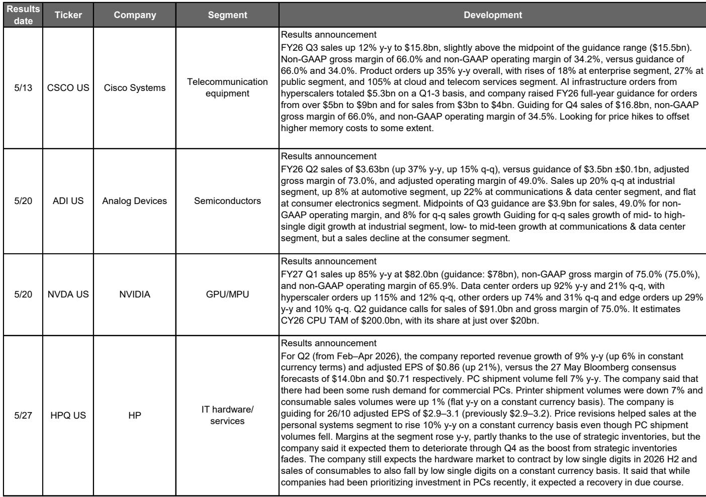
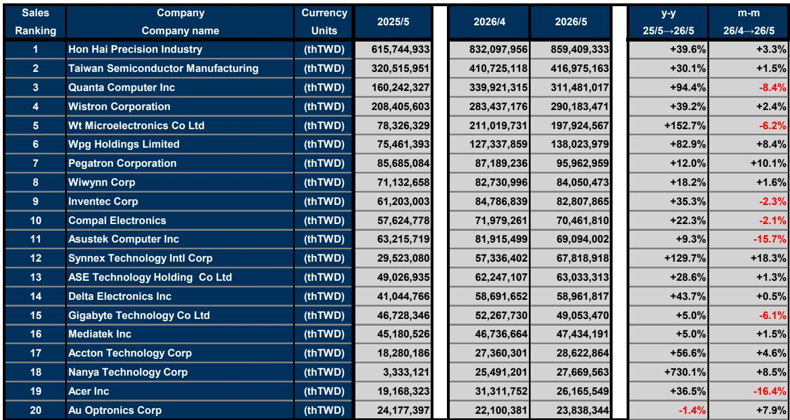
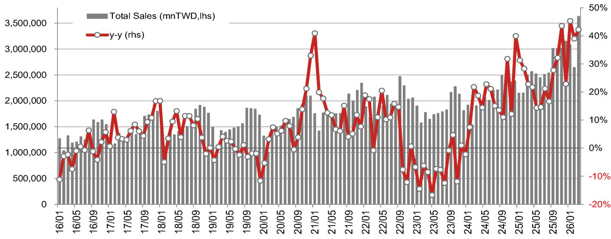

# The AI Agent Phase Is Reshaping the Entire Semiconductor Supply Chain, Not Just the GPU Market

The conventional narrative that artificial intelligence demand is a GPU story is now dangerously incomplete. A global investment bank report on Japan electronics reveals that the AI agent era has triggered a cascading tightening of supply-demand conditions across the entire semiconductor stack, from advanced logic to the most mundane analog components. The pattern is unmistakable: shortages began with GPUs and HBM during the AI learning phase, spread to ASICs and SSDs during the inference phase, and have now reached CPUs, analog semiconductors, and multilayer ceramic capacitors in the AI agent phase. This is not a temporary cyclical phenomenon. It represents a structural shift in how capital investment, component procurement, and engineering talent allocation are being reconfigured across the electronics ecosystem. For investors and corporate strategists, the critical question is no longer whether AI demand is real, but how the propagation of that demand through the supply chain will create winners and losers in ways that current market pricing does not yet fully reflect.

The timing of this shift matters because the gap between AI model advancement and system deployment remains wide, yet the response from major IT companies and private equity funds has been decisive. They are strengthening forward deployed engineering capabilities at an accelerating pace, embedding AI specialists directly at customer premises to oversee the deployment of proprietary AI agents. This is not incremental hiring. It is a strategic reorientation that signals a commitment to monetizing AI at scale, even if the deployment challenges are substantial. The implications for semiconductor demand are profound: every AI agent deployed in a B2B environment requires not just training and inference infrastructure, but a full complement of supporting electronics that had previously been taken for granted as commoditized supply.

## Demand for AI-Related Semiconductors Has Shifted from a Single-Product Story to a Multi-Component Scramble

The most visible evidence of this shift comes from the revenue trajectories of the largest semiconductor companies. Nvidia reported data center-related sales up 92 percent year-over-year in its February-April quarter, with a sharp 115 percent rise in sales to hyperscalers. Broadcom reported semiconductor sales of $10.8 billion, up 143 percent year-over-year. Marvell Technology has raised its full-year sales growth outlook three times in six months, from at least 25 percent to 50 percent, and then again to 55 percent for the following year. These numbers are extraordinary by any historical standard, but they tell only part of the story.

What makes the current environment structurally different is that demand is no longer concentrated in a handful of AI accelerator products. The report documents that lead times are lengthening even for analog products, components that had been considered mature and reliably available. This is because every AI server rack requires power management ICs, signal conditioning components, and passive devices. As hyperscalers and enterprise customers accelerate their AI infrastructure buildout, they are competing for the same analog and passive components used in conventional servers, automotive systems, and industrial equipment. The result is a tightening that cascades across the entire electronics supply chain, creating pricing power for suppliers who had long operated in a buyers market.

The strategic implication is straightforward but not yet fully priced into sector valuations. Companies that produce components previously considered low-growth or commoditized now face a demand environment where shortages are structural rather than cyclical. The report identifies specific beneficiaries: Murata Manufacturing for advanced compact, high-capacitance capacitors; TDK for battery backup units used in 400-volt and 800-volt data center architectures; and Hirose Electric for probe application products. These are not AI companies in the traditional sense, but they are becoming AI-enabling companies by necessity.

## Forward Deployed Engineering Represents a Structural Shift in How AI Value Is Captured and Distributed

The report's special feature on forward deployed engineering deserves careful attention because it identifies a mechanism that is likely to reshape competitive dynamics across the Japanese IT sector and beyond. Forward deployed engineers are not traditional field support staff. They are embedded at client companies, communicating directly about deployment challenges and moving swiftly to address them. The expertise gained is then integrated back into the AI company's products, enabling lateral expansion of service offerings.

This model has profound implications for how we should think about AI-related revenue growth. Traditional IT services companies generate revenue through project-based consulting or managed services. The forward deployed engineering model creates a feedback loop where deployment experience directly improves product capabilities, which in turn enables faster deployment at new clients. The report notes that Hitachi plans to bolster its Physical AI FDE Team to facilitate integration of its IT technology with operational technology, while Fujitsu similarly plans to expand its team of forward deployed engineers with specialist knowledge of its proprietary AI models and platforms.

The strategic insight here is that forward deployed engineering capabilities may become a durable competitive moat. Companies that can deploy engineers with deep domain expertise alongside AI agents will be able to solve problems that pure software approaches cannot. This is particularly relevant for Japanese IT majors, which have historically struggled to monetize their technology investments at the same rate as global peers. The report notes that Japanese IT majors are targeting profit growth of over 15 percent on a CAGR basis in their medium-term business plans, but sees prospects for faster profit growth via increased uptake of AI agents. The forward deployed engineering model may be the mechanism that closes the gap between aspiration and execution.

## The Tightening Supply-Demand Dynamic Has Created a New Investment Calculus That Favors Capacity Expansion Over Price Sensitivity

One of the most counterintuitive findings in the report is that price hikes in the AI server market are being actively accepted rather than resisted. In traditional electronics markets, tight supply-demand creates a trade-off where higher component costs suppress end-user demand through price elasticity. In the AI server market, the dynamic is inverted: customers accept price increases to secure greater procurement volumes, which in turn encourages more aggressive capital investment by suppliers.

This has two important consequences. First, it suggests that the current cycle of capacity expansion may persist longer than historical patterns would suggest. The report explicitly states that there is a possibility supply-demand conditions for various products will remain tight for longer than previously. Second, it creates a divergence between markets. While AI-related components enjoy pricing power, price-sensitive B2C markets such as PCs and smartphones may see demand shrink after preemptive buying, as price hikes suppress mass-market demand and CPU shortages constrain supply.

The report's analysis of the memory market illustrates this divergence clearly. Commodity DRAM prices were solid in May, with spot prices for DDR5 up 3.1 percent month-over-month. NAND prices have been rising faster than DRAM prices of late. Yet share prices of memory-related stocks have been negatively affected by news reports about a letter sent to the White House by memory customers and Nvidia's plan to halve LPDDR5X capacity per rack for its next-generation systems. The report argues that this share price correction represents a good entry point, citing ongoing structural supply shortages. The tension between negative headlines and underlying demand fundamentals is precisely the kind of analytical gap that creates investment opportunity.

## What the Report Does Not Fully Address: The Second-Order Risks of Geopolitical Fragmentation and the Timing of the B2C Recovery

For all its analytical rigor, the report leaves several meaningful questions unanswered. The most significant is how geopolitical risks will interact with the supply-demand dynamics it describes. The report acknowledges that the materialization of geopolitical risks has raised uncertainty over the macroeconomy, but concludes that there is little direct impact at industrial electronics majors and semiconductor producers thanks to business portfolio reforms. This assessment may prove too sanguine.

The report does not fully explore the possibility that the very tightness it describes could become a vector for geopolitical disruption. If AI-related components are in structural shortage, any supply chain interruption from geopolitical tensions would have amplified effects. The report's focus on Japanese companies is appropriate given its scope, but it does not address how the concentration of certain critical components in specific geographic regions creates single points of failure. The forward deployed engineering model, for all its benefits, also creates a dependency on the ability to station engineers at client premises across multiple jurisdictions, which could be complicated by export controls or visa restrictions.

Another unanswered question is the timing and shape of the B2C recovery. The report notes that price-sensitive consumer markets may see demand shrink, but it does not provide a framework for estimating when or how that recovery might occur. The report's recommendation of Sony Group, Fujifilm Holdings, and Canon is based on factors such as proactive cost pass-through and favorable currency effects, but these are largely company-specific factors rather than sector-wide catalysts. Investors need a clearer understanding of whether the B2C weakness is a temporary adjustment or a structural change in consumer behavior driven by higher component costs.

## A Decision Framework for Navigating the AI Agent Phase

For readers trying to translate this analysis into actionable investment or strategic decisions, the report suggests a framework organized around three dimensions: supply chain position, end-market exposure, and engineering capability.

First, assess supply chain position by identifying which components are in the tightening phase. The report provides a clear sequence: GPUs and HBM in the learning phase, ASICs and SSDs in the inference phase, and now CPUs, analog semiconductors, and MLCCs in the AI agent phase. Companies that produce components in the current tightening phase are likely to experience pricing power and margin expansion. Companies that produce components in earlier phases may face margin compression as capacity catches up with demand.

Second, evaluate end-market exposure. The critical distinction is between price-insensitive AI infrastructure markets and price-sensitive B2C markets. The report suggests that AI-related demand will remain robust regardless of macroeconomic conditions, while consumer electronics demand may be suppressed by price hikes and component shortages. Companies with high exposure to AI infrastructure are likely to outperform those dependent on consumer demand, at least until the supply-demand balance normalizes.

Third, examine engineering capability through the lens of forward deployed engineering. The report suggests that companies with strong FDE capabilities will be better positioned to capture value from AI agent deployment. This is not just about having engineers available; it is about having engineers with domain expertise who can translate AI capabilities into specific industry solutions. The report highlights Hitachi and Fujitsu as examples, but the framework applies broadly across the IT services and industrial electronics sectors.

The most important insight from this framework is that the current environment rewards companies that can simultaneously execute on three fronts: secure component supply through strategic procurement, maintain pricing discipline in markets with pricing power, and build the engineering capabilities to deploy AI solutions at customer premises. Companies that excel in only one or two of these dimensions may find themselves at a competitive disadvantage.

## Join the Community to Read the Full Report and Review the Original Charts

The report contains detailed analysis that cannot be fully captured in a single article. The original document includes comprehensive charts on global semiconductor shipment values, inventory ratios, relative market cap performance by subsector, and detailed developments at major overseas electronics companies. These visualizations provide context that is essential for understanding the magnitude of the shifts described here. The report also includes the complete research analyst team's contact information and the full disclaimer and risk disclosure language that governs how this analysis should be interpreted and used. For serious investors and corporate strategists who want to build their own analytical frameworks, access to the original data and charts is indispensable.

The questions that remain unanswered in this article are precisely the ones that the full report can help address. How do the supply-demand dynamics vary by specific component type and geography? What are the precise revenue growth trajectories for the companies identified as beneficiaries? How do the forward deployed engineering strategies of different Japanese IT majors compare in terms of scale and focus? The report provides the granularity that makes these questions answerable.

Join the community to read the full report and review the original charts.

*This article is for learning and discussion only and does not constitute investment advice.*

Personal reading notes and learning share only. Not investment advice.

