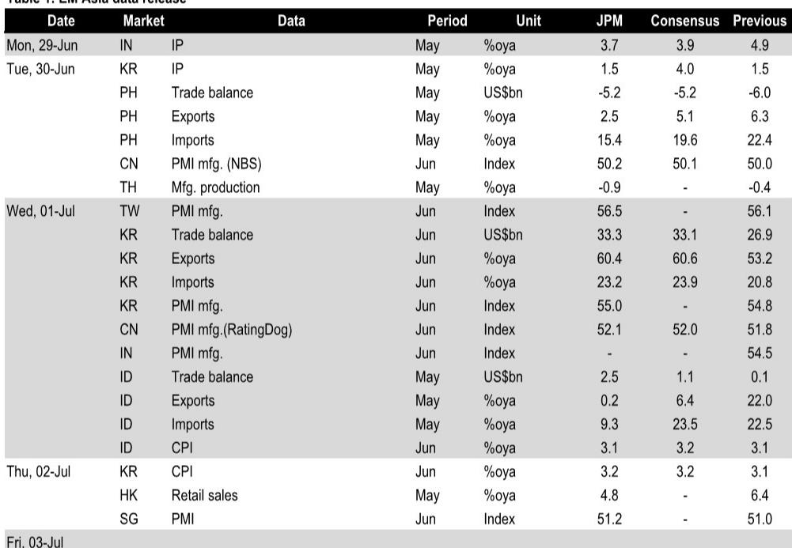
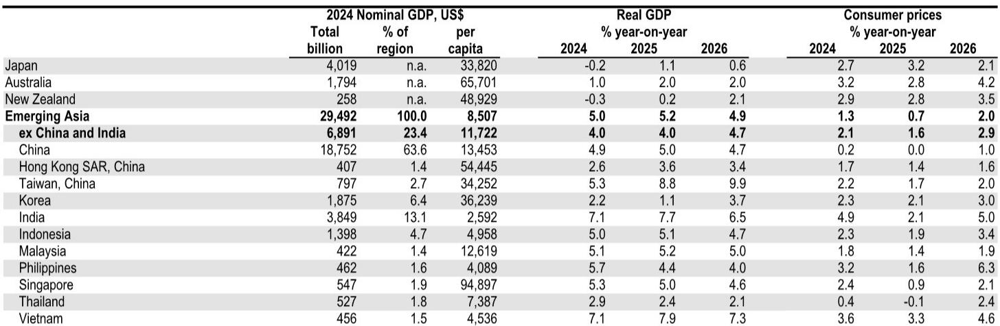
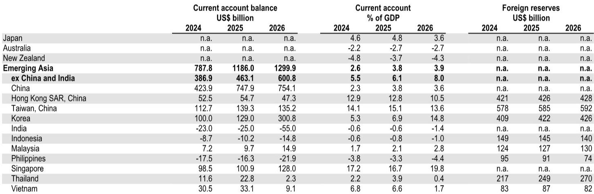

# The Energy-Tech Double Boost Reshapes Asia's Growth Outlook, But Central Banks Face a Dollar-Driven Divergence

The dominant narrative for Emerging Asia through the first half of the year has been one of resilience against formidable headwinds. A region heavily dependent on Middle Eastern energy imports faced a conflict-driven terms-of-trade shock, while simultaneously navigating a slowdown in its largest trading partner, China. Yet, the data tells a more nuanced story. Growth in the EMAX economies (Emerging Asia excluding China) has averaged over 6% quarter-on-quarter, seasonally adjusted annualized rate, for the past two quarters—nearly double the region's potential growth rate. This performance was not merely defensive; it was powered by a surging tech export cycle that proved strong enough to offset the energy drag. Now, with crude prices correcting sharply and the Middle East conflict de-escalating, the risk balance for second-half growth has shifted decisively to the upside. The immediate implication is clear: the combination of sustained tech momentum and falling energy input costs creates a powerful tailwind for household purchasing power, corporate margins, and overall economic activity that most consensus forecasts have not yet fully priced.

However, this improving growth picture is not a uniform blessing for policymakers. The same forces that are boosting domestic demand—lower energy prices and a robust tech cycle—are interacting with a strengthening US dollar, which complicates the monetary policy calculus across the region. The central bank landscape is about to bifurcate. For economies like the Philippines, India, Thailand, and Singapore, where domestic growth-inflation dynamics are the primary concern, falling energy prices provide welcome relief, reducing the need for aggressive tightening and potentially allowing rates to stay lower for longer. For others—notably Indonesia, Korea, and Taiwan—the stronger dollar and continued tech-fueled capital inflows create external pressures that may force their hands in the opposite direction. The second half of the year will not be about a uniform recovery; it will be about a strategic rotation in the pressures facing Asian central banks, with the dollar acting as the primary axis of divergence.

This shift in the policy landscape is occurring against a backdrop of a deliberately underperforming Chinese economy. May fiscal data from China revealed a contraction in infrastructure spending and a sharp decline in land-sale revenue, contributing to a second-quarter slowdown that is now tracking below trend. But this weakness is not a sign of systemic collapse; it is a delayed fiscal impulse. With fiscal deposits at their second-highest May level in a decade and special local government bond issuance rebounding in June, the Chinese authorities have ample dry powder. The question is not whether they will act, but when and how aggressively. The answer likely depends on the June activity data released in July, which will set the stage for the late-July Politburo meeting. For the rest of Asia, the implications of a Chinese slowdown are more nuanced than commonly assumed. Export exposure to China has diminished in recent years, and the impact is likely to be concentrated in Indonesia and the Philippines. The more significant risk lies in the potential for Chinese excess capacity to be dumped onto regional and global markets, a dynamic that could suppress pricing power in key manufacturing sectors even as volume growth remains robust.

## The Tech Cycle is Maturing, Not Peaking, and Its Composition is Shifting from Volume to Value

The first half of the year was defined by a blistering pace of tech production. Taiwan's May industrial production data showed tech momentum cooling from its scorching earlier pace, but it is still running at a very strong 30% quarter-on-quarter, seasonally adjusted annualized rate. Similarly, Korea's 20-day export data continues to point to robust momentum. The critical insight, however, is that the nature of this cycle is changing. Recent tech gains in Korea have become increasingly price-led rather than volume-driven. This shift has profound implications. A price-led cycle is typically more profitable for producers, as it reflects pricing power and favorable product mix rather than just unit volume expansion. It also suggests that the cycle may have greater durability, as price increases are less prone to the sudden inventory corrections that plague volume-driven booms. For policymakers, this changes the revenue and fiscal calculus. As the research notes highlight, Korea faces significant fiscal implications from this tech windfall, with potential for higher corporate tax receipts and a more favorable current account position. The so-what for investors is that the quality of the tech cycle is improving even as its pace moderates, which should support earnings revisions in the semiconductor and related supply chain sectors.

## The Dollar and Oil Price Divergence Creates a Three-Way Central Bank Dilemma

The interaction between falling energy prices and a rising dollar is not symmetrical across Asia. It creates three distinct monetary policy regimes. The first regime consists of economies that are primarily importers of both energy and capital. For the Philippines (BSP), the decline in crude prices directly reduces headline inflation and improves the terms of trade, reducing the need for the 6% terminal rate that is currently in the forecast. The odds of having to hike less have materially increased. For India (RBI), Thailand (BoT), and Singapore (MAS), the relief is similarly clear: falling energy prices reinforce the case for staying on hold, bucking market pricing that had anticipated multiple hikes. These central banks can afford to focus on domestic demand conditions. The second regime is for economies that are energy importers but have significant external financing needs or currency sensitivity. Bank Indonesia is the most vulnerable here. The rupiah faces direct pressure from a stronger dollar, and even with another 25 basis points of hikes already in the forecast, the risks of more tightening will increase if dollar strength persists. The third regime is for tech-heavy exporters. For the Bank of Korea, a stronger dollar combined with continued tech momentum increases the risks that the already-expected 100 basis points of hikes will need to be supplemented. For Taiwan's CBC, the same forces create pressure to hike towards the end of the year. The strategic implication is that investors cannot treat "Asia" as a monolithic block. The divergence in central bank trajectories will create relative value opportunities in fixed income and currency markets, with the most significant differentiation occurring between the domestic-demand-focused and the externally-vulnerable economies.

## China's Fiscal Underperformance is a Delayed Catalyst, Not a Structural Headwind

The May fiscal data from China was undeniably weak. Fiscal expenditure contracted for a second month, with infrastructure outlays down 12% year-on-year. Government-managed fund revenue and spending fell sharply as land sales weakened further. This explains why infrastructure support has been absent and why second-quarter GDP growth is forecast to slow to 3.3% quarter-on-quarter, seasonally adjusted annualized rate. However, interpreting this as a sign of deeper structural weakness would be a mistake. The fiscal undershoot has created a significant stock of unspent resources. Fiscal deposits rose to the second-highest May level in the past decade. Special local government bond issuance has already rebounded in June. This creates substantial room for faster policy execution in the second half. The authorities are deliberately choosing the timing of their stimulus, likely waiting for the July Politburo meeting to calibrate the response based on mid-year data. The forecast for full-year 2026 GDP growth at 4.7% year-on-year implies a second-half recovery, with 3.5% and 3.7% quarter-on-quarter, seasonally adjusted annualized rate in the third and fourth quarters respectively. The key transmission mechanism for the region is not direct Chinese demand, which has become less important over time, but rather the potential for Chinese excess capacity to be exported. If Chinese domestic demand disappoints further, the incentives for Chinese firms to dump excess production into regional markets will increase, potentially suppressing margins in sectors from steel to solar panels across Asia. This is the risk that is hardest to quantify and most likely to be overlooked in consensus forecasts.

## The Report's Unanswered Question: How Does the El Nino Risk Interact with the Energy Price Decline?

The analysis correctly identifies that falling energy prices will ease headline inflation across the region, providing relief to central banks and households. However, it also flags a critical risk that remains unresolved: a severe El Nino weather event. The report notes that this remains an inflation risk for the RBI, BoT, and MAS, even as it increases conviction that these central banks will stay on hold. The interaction between these two forces is not straightforward. Lower energy prices reduce the cost of food production and transportation, which would normally be disinflationary. But a severe El Nino could simultaneously destroy agricultural output, driving up food prices independently of energy costs. The net effect on headline inflation would depend on the relative magnitude of these two shocks. Furthermore, the central bank response function becomes ambiguous. If food price inflation spikes due to El Nino, but core inflation remains benign due to lower energy costs, do central banks tighten? The historical precedent in Asia suggests they often look through food price shocks, but the persistence of a severe El Nino could change that calculus. This is the most significant second-order risk that the report's framework does not fully resolve. Investors need to monitor monsoon forecasts and food price indices as closely as they track oil prices and tech exports. A bad El Nino season could invert the entire central bank divergence thesis, forcing even the domestic-demand-focused central banks to reconsider their dovish stances.

## A Decision Framework for the Second Half: Navigating the Three-Vector Trade

For investors and corporate strategists, the report's analysis can be distilled into a three-vector decision framework. The first vector is the tech cycle. Monitor the shift from volume-led to price-led growth in Korea and Taiwan. If price-led growth continues, it supports earnings and fiscal revenues, but it also increases the risk of earlier tightening from the Bank of Korea and CBC. The second vector is the energy-dollar nexus. Track the USD/IDR and USD/KRW as leading indicators of central bank pressure. A sustained dollar rally will force Bank Indonesia and Bank of Korea to act, creating potential opportunities in short-duration local currency bonds in those markets. The third vector is Chinese fiscal impulse. Watch the July Politburo meeting and the June activity data. If Chinese authorities deploy their fiscal dry powder aggressively, it will disproportionately benefit Indonesia and the Philippines through commodity demand, while creating headwinds for Taiwan and Korea through increased competition. The key strategic insight is that these three vectors are not independent. A strong dollar can depress commodity prices, which is good for energy importers but bad for Indonesia's fiscal position. A strong tech cycle can attract capital flows that offset dollar pressure, as seen in Taiwan. The optimal portfolio positioning requires understanding these interactions, not just the individual trends. The most actionable trade for the second half is likely to be long the currencies and short-dated bonds of the domestic-demand-focused economies (Philippines, India, Thailand) while hedging or underweighting the externally-vulnerable ones (Indonesia, Korea) until the dollar cycle turns.

Join the community to read the full report and review the original charts.

*This article is for learning and discussion only and does not constitute investment advice.*

Personal reading notes and learning share only. Not investment advice.

