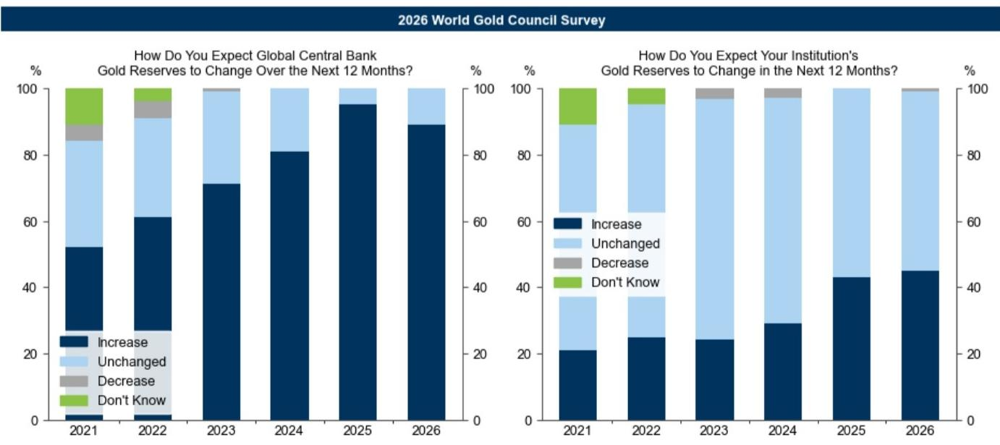
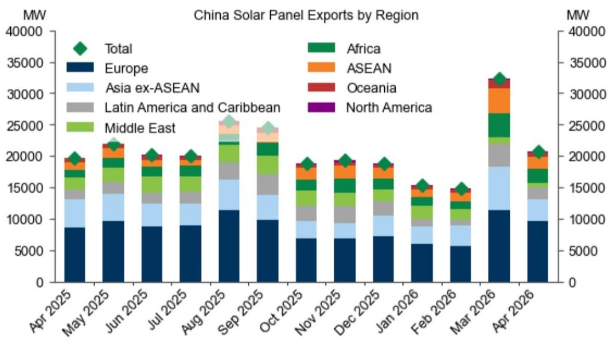
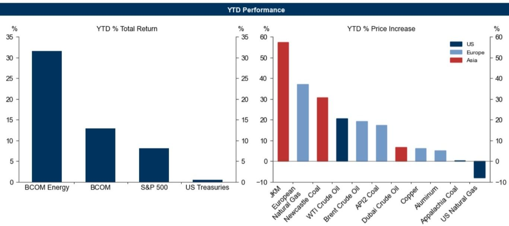

# Commodity Diversification Is No Longer Optional — It Is a Strategic Imperative for Portfolio Resilience

The conventional portfolio of equities and bonds is increasingly vulnerable to a trio of structural risks that no amount of static allocation can fully hedge. Commodities, once treated as a tactical inflation overlay, now serve a more fundamental role: they are the only asset class that can simultaneously protect against supply-driven inflation, capture long-term demand shifts from energy transition and reindustrialization, and hedge against institutional credibility risk. The recent Strait of Hormuz disruption — the second major energy supply shock in five years — is not an outlier but a harbinger. It exposed how quickly commodity exposure can differentiate portfolio outcomes, with year-to-date commodity returns outperforming equities and bonds by a wide margin, even as volatility spiked. The question is no longer whether to diversify into commodities, but which commodities, under which regimes, and with what strategic conviction.

The Iran conflict, while now moving toward resolution, has permanently altered the risk landscape. It did not merely disrupt oil and gas flows; it accelerated structural shifts in power demand, metals consumption, and geopolitical alignment that will shape commodity markets for the next decade. Investors who treat this as a temporary energy spike risk missing the deeper reconfiguration underway. The case for commodity diversification is not about forecasting the next shock — it is about building a portfolio that can absorb multiple, simultaneous regimes of stress without requiring constant rebalancing or market timing.

## The Hormuz Shock Revealed That Commodity Diversification Works Across Both Supply and Demand Regimes

The 16-week Strait of Hormuz disruption provided a real-time stress test of commodity portfolio theory. Crude oil and oil product prices rallied 43% and 63% respectively against pre-war levels, while European gas and Asian LNG surged 50% and 70%. Commodity indices delivered year-to-date returns well above those of equities and bonds, even as volatility rose. Critically, the outperformance was not driven solely by the energy spike — industrial metals and precious metals also contributed, albeit through different mechanisms. This is the defining insight: commodities do not all move together, but they can all move positively under different stress scenarios.

The episode also demonstrated a more subtle point. The upside to energy prices was capped by a surprisingly flexible global market, particularly as Chinese LNG and oil imports dropped sharply during the conflict. This flexibility limited the macroeconomic scarring effect — global GDP growth is now expected at 2.4% this year, only 0.4 percentage points below 2025. But had the conflict lasted longer, the negative impact could have been as large as 2 percentage points from pre-war expectations. This asymmetry — limited upside but catastrophic downside — is precisely why strategic commodity allocation matters. It is not about betting on a specific outcome; it is about insuring against the tail.

The takeaway for portfolio construction is clear. A broad commodity basket, excluding precious metals, proved the most effective hedge during a supply disruption regime. Gold, by contrast, sold off sharply, as markets priced in rate hikes and margin calls triggered liquidation of a liquid asset. This is not a failure of gold as an asset; it is a failure to match the hedge to the regime. Investors who held a diversified commodity allocation across energy, industrial metals, and precious metals saw their portfolio absorb the shock without requiring a tactical pivot. Those who relied solely on gold or energy alone experienced a more uneven outcome.

## The Structural Demand Case for Metals and Power Is Strengthening, Not Weakening, After the Conflict

The Iran conflict is accelerating the very trends that support long-term demand for copper, lithium, aluminum, and power infrastructure. Three mechanisms are at play. First, the disruption has boosted electric vehicle sales and renewable energy investment, as governments and consumers seek to reduce exposure to fossil fuel supply risk. Global EV sales have sharply accelerated during the conflict, and Chinese solar panel exports have surged. Second, the conflict has reinforced the strategic priority of grid investment, both for AI infrastructure and for energy security. Aging Western power grids are now seen as a national security vulnerability, not just an infrastructure backlog. Third, defense spending is rising across multiple regions, and defense supply chains are metals-intensive.

The demand implications are not speculative. Grid and power infrastructure are likely to drive over 60% of copper demand growth by 2030 relative to 2025. This is not cyclical demand tied to construction or consumer durables; it is structural demand tied to strategic priorities that are unlikely to reverse regardless of the economic cycle. Copper demand is becoming less sensitive to economic slowdowns and high prices than traditional sources. This is a fundamental shift in the commodity's demand profile.

On the supply side, the constraints are equally structural. Copper mines are getting deeper, grades are declining, and ore is becoming harder to process. Multiple recent mine incidents highlight growing operational challenges. Supply cannot respond quickly to price signals because new mine development takes a decade or more. The result is a persistent gap between demand growth and mined supply growth. Prices have to rise to close this gap — by incentivizing higher scrap collection, enabling substitution into aluminum, and supporting the development of new mines. The report forecasts that copper prices will need to reach $15,000 per tonne by 2035 to balance the market.

Policy shifts have already brought some of this tightness forward. Since US import tariffs on steel and aluminum were imposed last year, copper imports into the US have surged in anticipation of potential copper tariffs. This has tightened ex-US copper balances significantly, pushing prices to an all-time high of over $14,000 per tonne in May. The report recently raised its end-2026 and average 2027 copper forecasts to $13,735 and $13,800 respectively. The key insight is that policy risk is now a structural driver of metal prices, not just a cyclical one.

## Gold Remains Structurally Supported by Central Bank Diversification, but Its Cyclical Path Is More Complex

Gold has rallied 123% since 2022, yet the report sees further upside to $4,900 per troy ounce by end-2026. The structural anchor is central bank diversification, which accelerated after the freezing of Russia's reserves in 2022. While the pace of central bank purchases has moderated to around 50 tonnes per month on a moving average basis, the trend remains intact. A recent World Gold Council survey found that 45% of central banks expect to increase their own gold reserves over the next 12 months, and nearly 90% expect global reserves to rise.

The cyclical picture is more nuanced. Gold faces near-term headwinds from a hawkish Federal Reserve, which dampens the debasement theme and weighs on rate-sensitive ETF demand. Markets are pricing in Fed hikes this year amid inflation concerns. The report expects these headwinds to partly reverse over time, consistent with a delayed but ongoing easing cycle starting in the second half of 2027. ETF positioning is expected to gradually rise.

The larger question is whether gold's role in portfolios is shifting. The Iran episode, together with broader geopolitical developments, may accelerate private diversification into gold. Gold's share in private portfolios remains small, and concerns about Western fiscal sustainability are rising. If private investors begin to follow central banks into gold, the demand impulse could be far larger than current forecasts assume. The report flags that risks to its gold price forecast remain skewed to the upside on net, but does not quantify this private demand channel. This is one of the most important open questions for investors to explore further.

## What the Report Does Not Fully Answer: How to Size Commodity Allocation Across Regimes

The report provides a clear framework for matching commodity hedges to inflation regimes — cyclical commodities for late-cycle inflation, broad baskets for supply disruptions, and gold for institutional credibility risk. But it does not prescribe how to size these allocations within a strategic portfolio. This is a critical gap. An investor who knows they need a commodity hedge but does not know how much to allocate, or how to adjust across regimes, is still exposed to implementation risk.

Several questions remain unanswered. How much commodity exposure is needed to meaningfully offset a 2-percentage-point GDP shock from a prolonged supply disruption? Should the allocation be static or dynamic, and if dynamic, what triggers rebalancing? How should an investor weigh the competing demands of energy, metals, and gold within a single portfolio, given that they perform differently under different regimes? The report implies that a diversified commodity basket is the safest approach, but it does not provide a framework for determining the optimal mix.

These are not academic questions. A portfolio that is overweight energy and underweight metals may perform well during a supply shock but poorly during a late-cycle inflation regime. A portfolio that is overweight gold may underperform during supply disruptions. The report's regime framework is analytically powerful, but it requires investors to make judgment calls about which regime is most likely — and those calls are inherently uncertain. The next step for serious investors is to stress-test their commodity allocations across multiple regime scenarios, not just the one they expect.

## A Decision Framework for Investors: Three Questions to Define Your Commodity Strategy

Given the complexity of commodity markets and the multiplicity of regimes, investors need a structured approach to decision-making. Based on the report's analysis, three questions can guide the process.

First, what is your primary risk exposure? If your portfolio is most vulnerable to supply-driven inflation, your commodity allocation should emphasize a broad basket excluding precious metals, with energy and industrial metals as core holdings. If your portfolio is most exposed to institutional credibility risk — for example, if you hold significant sovereign bonds in fiscally stressed jurisdictions — then gold should be a larger component. If your portfolio is balanced, a diversified commodity index may be the most robust solution.

Second, what is your time horizon? Structural demand trends in metals and power play out over years, not months. A strategic allocation to copper, lithium, and aluminum requires patience and tolerance for near-term volatility. Gold, by contrast, can be more responsive to cyclical shifts in monetary policy and geopolitical risk. Energy commodities are the most regime-dependent and may require more active management.

Third, how do you measure success? Commodity allocations are often evaluated on a total return basis, but their primary value is as a hedge. An investor who sells commodities after a period of underperformance may miss the very regime shift that justifies the allocation. The report's framework suggests that the right metric is not absolute return but portfolio-level risk reduction across multiple stress scenarios.

## The Unresolved Analytical Tension: Will Metals Become the New Inflation Driver?

One of the report's most provocative arguments is that sharp price increases may start to appear more often across power and industrial and precious metals markets, even as oil and gas remain the traditional inflation drivers. The logic is compelling: metals refining is highly geographically concentrated, power infrastructure faces bottlenecks, and demand is structurally supported by energy transition, AI, and defense spending. Higher industrial metals prices and China's export controls on rare earths have already been flagged as drivers of the recent acceleration in US core producer price inflation.

But this argument raises a deeper question. If metals become a recurring source of inflation, how should portfolios be positioned differently? Traditional inflation hedges — energy commodities, TIPS, gold — may need to be supplemented or replaced by exposure to industrial metals and power infrastructure. The report hints at this shift but does not fully develop the portfolio implications. For investors, this is the most important area for further research. The commodity diversification thesis may need to evolve from "buy a basket" to "buy the right basket for the next decade."

Join the community to read the full report and review the original charts.

*This article is for learning and discussion only and does not constitute investment advice.*

Personal reading notes and learning share only. Not investment advice.

