June 27, 2026 12:29 AM GMT

US Rates Strategy | North America

# Equity Funding Implies a Tumultuous Quarter-End

Into quarter-end, one-way equity financing costs and restrictive balance sheet provision suggest the risk of a deleveraging event is rising. Should these micro pressures manifest and tighten macro financial conditions, markets will place less weight on hawkish Fed tail risks; hold Z6M7 flatteners.

## Key Takeaways

Conditions in equity funding have worsened after earnings in the semiconductor sector and suggest a tumultuous quarter-end, with more risk of deleveraging.

1m equity financing costs prior to a quarter-end rapidly nearing those hit ahead of year-end in December 2024 encapsulate current stresses in equity funding.

\- AXW futures are 2+ standard deviations above trailing 12m levels. Historically, these extremes were followed by mean reversion in S&P 500 performance.

In that outcome, we think investors would conceivably lose conviction in the economic overheating narrative, something 1Q consumption clearly contrasted.

We see two other paths to a flatter SOFR Z6M7 curve: 1) A Fed policy mistake; 2) Less risk of a permanent oil risk premium - maintain Z6M7 flatteners.

MS & CO. LLC

Martin W Tobias, CFA

Martin.Tobias@morganstanley.com +1 212 761-6076

Strategist
Matthew.Hornbach@morganstanley.com +1 212 761-1837

Strategist
Shaun.Zhou@morganstanley.com +1 212 761-3348

Aryaman@morganstanley.com +1 212 761-1993

Strategist
Eli.Carter@morganstanley.com +1 212 761-4703

## Short Duration Strategy

MS & CO. LLC

## United States | Equity funding implies a tumultuous quarter-end

<table><tr><td colspan="2">Martin Tobias, CFA, CMT</td></tr><tr><td>Martin.Tobias@morganstanley.com</td><td>+1 212 761-6076</td></tr><tr><td colspan="2">Matthew Hornbach, CMT</td></tr><tr><td>Matthew.Hornbach@morganstanley.com</td><td>+1 212 761-1863</td></tr><tr><td colspan="2">Shaun Zhou</td></tr><tr><td>Shaun.Zhou@morganstanley.com</td><td>+1 212 761-3348</td></tr><tr><td colspan="2">Aryaman Singh</td></tr><tr><td>Aryaman@morganstanley.com</td><td>+1 212 761-1993</td></tr><tr><td colspan="2">Eli Carter</td></tr><tr><td>Eli.Carter@morganstanley.com</td><td>+1 212 761-4703</td></tr></table>

## A tale of two very different quarter-ends

The dichotomy between conditions in Treasury vs. equity funding has continued into June quarter-end and remains a popular conversation point for market participants.

\- With overnight UST GC repo over the quarter-end turn quoted at 3.75/3.72, market pricing implies a fairly benign quarter-end for Treasury repo.

As shown in Exhibit 1, it suggests somewhat similar funding pressures in Treasury funding markets as experienced on June 2025 quarter-end and on the April tax date this year.

\- This suggests SOFR - while not explicitly targeted by the Federal Reserve - should remain within the target range and possibly 'well within' if the quarter-end turn implied funding contain an excessive premium, like it often does.

Exhibit 1: Bilateral DVP, SOFR, TGCR within the fed funds target range over the past year  
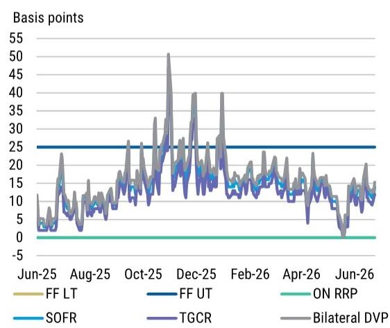  
Source: Federal Reserve Bank of New York, Bloomberg, MS

Exhibit 2: Reserves / Total Commercial Bank Assets and SOFR - IORB spread over different Fed balance sheet regimes  
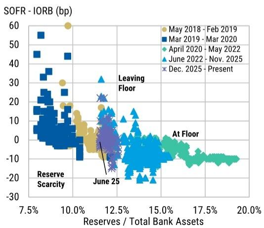  
Source: Federal Reserve Bank of New York, Bloomberg, MS

In Why So Soft, Repo?, we discussed the confluence of factors that drove such soft conditions in Treasury repo markets during late May.

\- As shown in Exhibit 2, this scatter plot helps contextualize current conditions in Treasury funding by comparing the SOFR – IORB spread in relation to levels of reserves as a % of total bank assets across different Fed balance sheet regimes.

Current conditions are consistent with prior periods of abundant reserves, with the start of Fed reserve management purchases in December 2025 dampening pressures in repo.

At the other end of the funding spectrum, pressures in equity funding are only percolating into quarter-end (for more on the specific drivers, see The Canary in the Coal Mine?).

AXW futures capture the spread between the implied equity financing rate for S&P 500 total return futures and a floating rate, such as SOFR or fed funds.

\- As shown in Exhibit 3, the 1-month AXW futures contract for July 2026 catapulted to +200bp on Friday, heading into the weekend before quarter-end on June 30.

The fact that 1-month equity financing rates prior to a quarter-end are rapidly nearing record highs hit ahead of a year-end in December 2024 - the previous equity funding squeeze episode - encapsulates the degree of equity funding stress (see Exhibit 4).

\- We show the 10-day moving average to help smooth the roll impact on the front-month futures contract.

Record equity financing costs, measured by AXW futures, reflect a growing imbalance between the demand for levered long equity exposure and dealer balance capacity.

Exhibit 3: July 2026 1-month AXW futures contract since February 23  
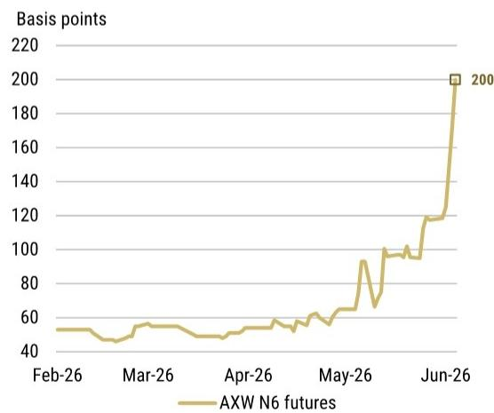  
Source: MS, Bloomberg

Exhibit 4: Generic front 1-month AXW futures contract since December 2020  
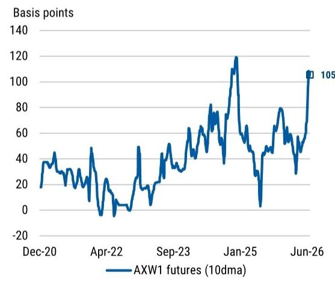  
Source: MS, Bloomberg

Several factors are likely also contributing to rich AXW levels, including issuance-related balance-sheet demand, leveraged ETF growth, and elevated futures positioning.

\- But persistence of elevated equity financing costs alongside record dealer equity repo exposure and narrow breadth suggests greater reliance on equity financing.

Parabolic advances in risky asset prices – particularly with narrow market breadth (Technology: Semis, Memory, and Global AI, especially in Korea) – have meant the size of dealer-intermediated exposures have expanded faster than capital allocation.

\- These larger, more concentrated exposures consume finite leverage capacity (due to onerous GSIB surcharges), regulatory capital, and internal risk budgets.

\- A large liquidity event two weeks ago only made the GSIB-related balance sheet management process into quarter-end more complex.

The result has been a higher shadow price of balance sheet. As dealer balance sheet resources become increasingly scarce relative to client demand for leverage, financing costs rise, increasing the hurdle rate for maintaining leveraged long positions.

If financing costs are too prohibitive, they may ultimately limit the ability of levered investors to further increase gross exposure. In that scenario, a market that has benefited from financing-supported demand could become more vulnerable to deleveraging.

Exhibit 5: Generic third 1-month AXW futures contract and the S&P 500 since December 2020  
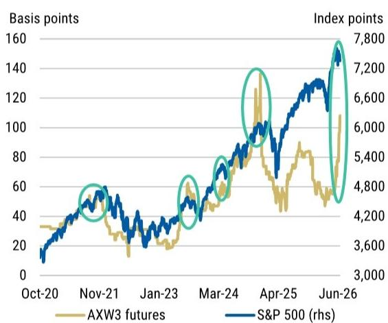  
Source: MS, Bloomberg

Exhibit 6: Generic third 1-month AXW futures contract and the S&P 500 since June 2022, rolling 252-day z-score  
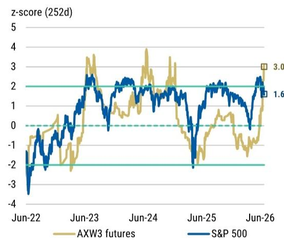  
Source: MS, Bloomberg

We think risk of a tumultuous quarter-end that produces a deleveraging event has risen, following the market reaction to earnings in the semiconductor sector this week.

\- This subsector of the market is one where hedge fund levered long equity exposure has become more and more concentrated over the past year.

Given close proximity to quarter-end, prime brokers may become increasingly conservative with balance sheet provision in order to avoid entering the next GSIB surcharge bucket.

\- For hedge funds, this means less financing availability and more prohibitive pricing.

As shown in Exhibit 5, more prohibitive equity financing costs tend to coincide with peaks in the S&P 500. For the broader market, its marginal buyer is no longer present.

The implication is financing costs for hedge funds to put on levered longs becomes so prohibitive it caps further increases in leverage, leading to position unwinds.

\- Accordingly, the same technical forces that amplified upside momentum in risky assets – through leverage expansion – could begin to cut in the other direction.

In Exhibit 6, we show that there is indeed a statistical relationship between equity funding costs and the S&P 500. When equity funding proxies reach local extremes (>2 z-scores), the S&P 500 moves lower back towards its more normal distribution.

\- Said another way, when the degree of equity financing stress reaches statistically unusual levels, subsequent equity returns have historically tended to normalize.

\- As AXW3 futures reach exceed 2 z-scores over a rolling 252-day time horizon, the S&P 500 falls below a z-score of 1, within the next three months:

• This implies downside in index level prices, relative to its recent highs.

Should equity funding costs in later-dated contracts (such as AXW3) not normalize on the other side of quarter-end on June 30, we think it signals that equity financing costs are going to remain high until a rather significant deleveraging event does occur.

Investors may then conceivably lose conviction in the consensus optimistic outlook for the US economy as well as their expectations for growth. That calls for a rethink of the skew of risks priced for Fed policy, with less weight assigned to scenarios where the Fed hikes.

\- As investors are forced rethink their priors on financial conditions in that environment, we think it lends to less weight placed on hawkish Fed tail risks.

Less insurance premium against the risk of hikes would allow for M7 outperformance against Z6, as the curve flattens closer to where its historical relationship with M7Z7 implies (see Exhibit 7 and Exhibit 8).

Exhibit 7: SFRZ6M7 and SFRM7Z7 futures contracts over the past five years  
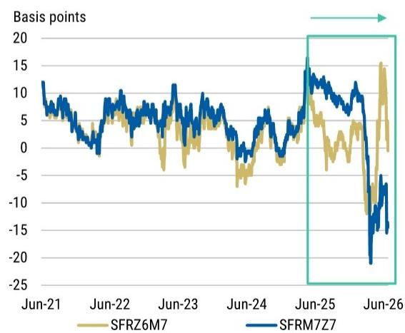  
Source: MS, Bloomberg

Exhibit 8: SFRZ6M7 and SFRM7Z7 futures contracts over the past year  
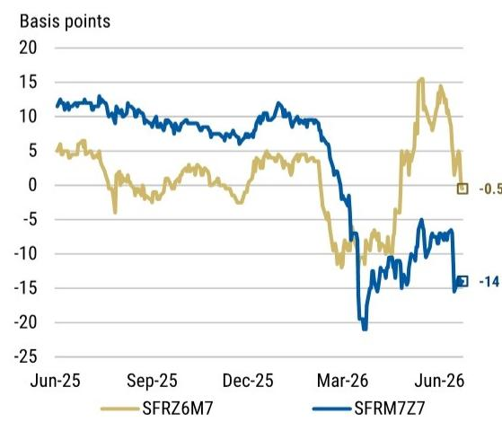  
Source: MS, Bloomberg

## Two paths to a flatter Z6M7 curve post-FOMC

## 1. Perception of a Fed policy mistake

The June FOMC meeting and subsequent press conference were hawkish on the surface, but we do not think they signaled a forthcoming structural reset in Fed policy setting.

\- The reason for that is the degree with which the Fed's reaction to the conflict in Iran has already effectively tightened monetary policy, via financial conditions.

In Exhibit 9, we show our MS proxy effective fed funds rate (MSUSPRXY Index on Bloomberg) and the actual effective fed fund rate since June 2006.

We use the same methodology published by the San Francisco Fed to create an index that incorporates a set of 12 financial variables, including Treasury rates, mortgage rates, and borrowing spreads to assess the broader stance of monetary policy on a daily basis.

\- The proxy rate can be interpreted as indicating what level of federal funds rate would typically be associated with prevailing financial market conditions.

Since the onset of the Iran conflict, financial conditions have effectively tightened in a manner that is consistent with nearly $4 \times 25\mathrm{bp}$ rate hikes (see Exhibit 10).

\- Effectively, the prevailing set of financial market conditions has the broader stance of monetary policy equivalent to 75bp tighter than just deemed appropriate by a 12 - 0 vote at the June 16-17 FOMC meeting, less than two weeks ago.

Exhibit 9: MS proxy effective fed funds rate and actual effective fed fund rate since June 2006  
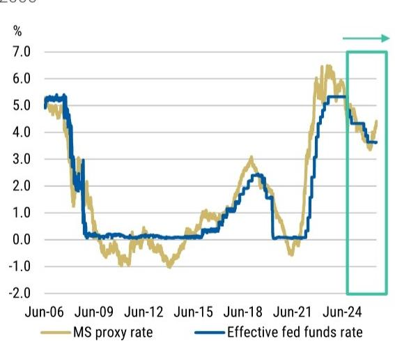  
Source: MS, Federal Reserve Bank of San Francisco, Bloomberg

Exhibit 10: MS proxy effective fed funds rate and actual effective fed fund rate since June 2024  
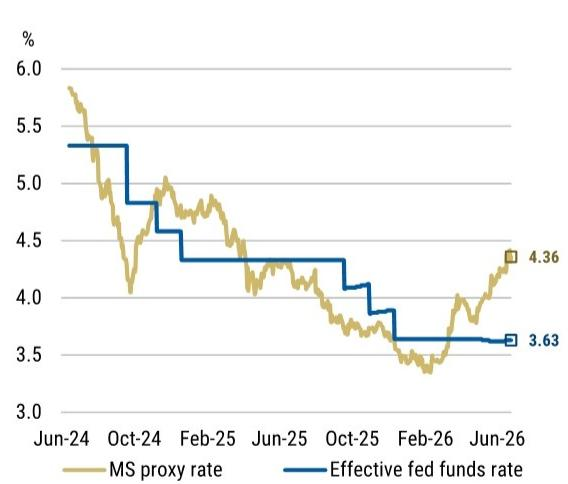  
Source: MS, Federal Reserve Bank of San Francisco, Bloomberg

In the press conference, Chairman Warsh noted there was only one proposal on the table for the meeting and there was no discussion of any other proposals.

\- That is consistent with how our economists, who expect the Fed remains on hold this year, view the appropriate reaction function as well.

The Fed need not deliver on the tightening in financial conditions in response to backward-looking data to retain credibility, it just needs to react to incoming information. Here's Chairman Warsh on the role of financial markets for the Federal Reserve:

"So I think financial markets perform best when they react to incoming data. I think the financial markets work less efficiently when they ask a question. How will the Federal Reserve react to that incoming information?"

The more that markets are paying attention to what's happening in the real economy, deciding what's good data and what's less good data, the more financial markets can price what they believe is the most likely and what are the tail risks.

Financial market prices are probably the most important source of information to guide central bankers. But when all the financial markets are doing is reflecting back what we've said, then we're taking the most important source of information and we're being blind to it."

In terms of the forward-looking set of inflation data, our economists forecast an average monthly pace of 0.17% m/m in core PCE for the remainder of the year.

\- That compares to the SEP-implied 0.21% pace which is just 2bp below the April–December 2025 run rate, when tariff pressures were pushing goods prices higher.

Despite foreshadowing of an end to the dot-plot, market participants still took meaning from the dot plot upon its release last Wednesday. As the saying goes: old habits die hard.

If the Fed were to follow the dots and deliver a rate hike this year, we think the market will eventually view this as a policy mistake for two reasons:

1. Forward-looking inflation is set to soften: Our economists' forecast suggests US core PCE inflation annualizes at $2.0\%$ over the last six months of this year.

2. Market-implied inflation measures are much lower: US CPI inflation swaps have rapidly repriced lower, with both 1y and 1y1y inflation swaps now below 2.5%.

Exhibit 11: 1-year forward 1-year USD CPI swap rate and 1-year USD CPI swap rate since June 2024  
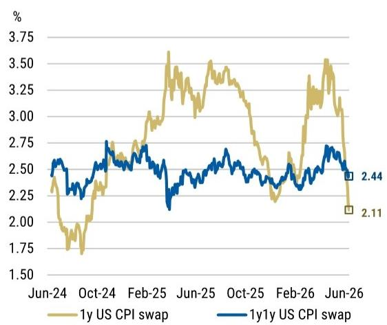  
Source: MS, Bloomberg

Exhibit 12: 1-year forward 1-year USD CPI swap rate and 1-year USD CPI swap rate since June 2024  
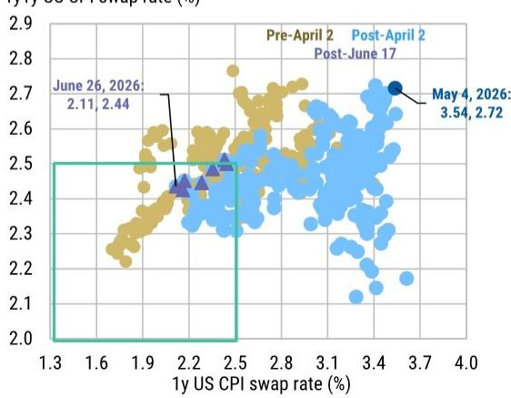  
Source: MS, Bloomberg

As shown in Exhibit 11, market participants have begun to assess fewer upside risks to inflation over the next year, with 1y US CPI inflation swaps almost back at 2.00%.

\- We think investors should also come around to the view that more FOMC participants will begin to see that upside inflation risks have diminished and thus see less need to raise rates, as indicated in the dot-plot (see Exhibit 12).

Here is Federal Reserve Bank of New York President Williams on why the current policy stance is well positioned to restore the 2% longer-run inflation goal on a sustained basis:

"In coming quarters, however, I expect inflation readings to edge down for several reasons. First, the direct effects of existing tariffs on prices appear to have mostly played out. Any new tariffs would replace those that were curtailed or will soon expire, implying that we should not see a significant additional impulse on prices."

Second, assuming the supply disruptions owing to the closure of the Strait of Hormuz are resolved relatively soon, energy and related goods prices should stabilize, then start to come down later this year.

Third, modest increases in market rents indicate that shelter inflation should continue to slow. And finally, we are not seeing evidence that the labor market is adding to inflationary pressures."

## 2. Less risk of a permanent oil risk premium

As it relates to the dot-plot, Warsh disclosed he declined to provide his economic projections and individual assumption of projected appropriate monetary policy (i.e., a dot) in the Summary of Economic Projections (SEP).

We think this likely foreshadowed the end of the dot-plot, pending task force review:

\- The dot-plot was introduced when rates were at the zero lower bound (ZLB) to anchor investor expectations – and avoid an undesired tightening in financial conditions – about when the Fed would eventually exit the ZLB.

Clearly, that form of forward guidance is less relevant with the current level of policy rates, but we highlight two implications for investors of less forward guidance:

1. Improved signaling qualities of markets: The more the Fed lets markets speak, the more clarity it may get when evaluating financial conditions.

2. More policy surprises and higher realized volatility: If Warsh follows the Greenspan toolkit, it could set up for the nosiest front-end in a generation. But with more volatility, therein lies more opportunity.

And despite foreshadowing of an end to the dot-plot, market participants continued to take meaning from the dot-plot upon its release last Wednesday.

With Warsh's lack of forward guidance - by design - in the press conference, market participants took his lack of pushback as a green light to align with the hawkish dots.

\- In actuality, there remain two camps of FOMC participants, only divided by where they put their longer-run dot. One camp thinks the higher neutral rate is higher and the other thinks the neutral rate is 3.0% or below, like our economists.

Accordingly, we interpret the sell-off in front-end US Treasuries in reaction to the hawkish distribution of dots as an overshoot for three reasons:

1. In the press conference, Warsh noted the committee wrote their submissions with "big erasers," which implies a lack of conviction.

2. Had Warsh submitted a projection, it could have meant the median dot remained at $3.625\%$ and therefore not showed one rate hike this year.

3. Participants did not feel bound by their dots, which implies flexibility. Brent crude oil prices have declined after the US-Iran MOU and this suggests downside risks to the inflation forecasts and policy rate projections submitted by some participants.

Our Global Commodities Strategist, Martijn Rats, provided context on the outlook for Brent crude oil prices, following the US-Iran MOU: the earlier agreement makes the disruption shorter and less price-supportive.

\- Indeed, market-implied inflation measures have repriced lower rapidly, reflecting less risk of a persistent oil risk premium (see Exhibit 13 and Exhibit 14).

Exhibit 13: 2-year and 5-year US CPI inflation swaps since June 2021  
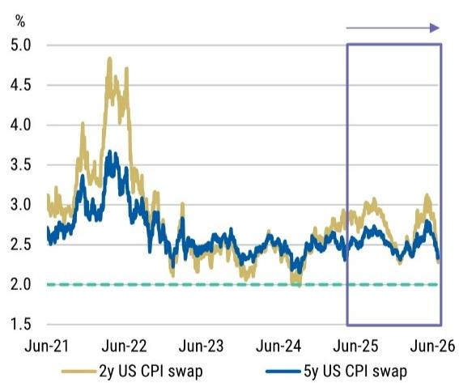  
Source: MS, Bloomberg

Exhibit 14: 2-year and 5-year US CPI inflation swaps since June 2025  
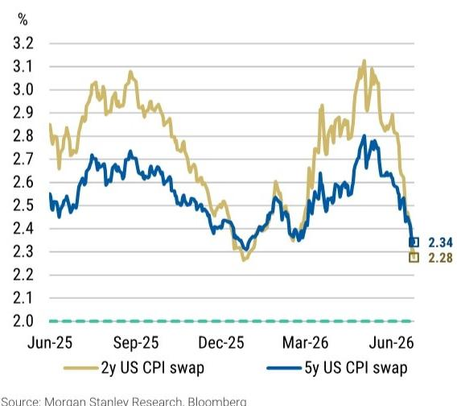  
Source: MS, Bloomberg

We continue to think SFRZ6M7 curve flatteners offer a compelling way to express the view that market pricing still places too much weight on hawkish Fed tail risks.

\- Investors seemingly discount the continued declines in Brent crude oil prices (as well as its distillates), but overweight investor optimism about US growth.

That said, fantasies of high-growth may soon start to fizzle should equity funding costs prove to be The Canary in the Coal Mine?. Our economists also do not read US GDP revisions as consistent with an economy that was already overheating in 1Q26:

\- Between the \~1ppt cut to 1Q consumption and similar trimming of our 2Q tracking estimate, the 1H consumption path no longer looks nearly as strong as it did.

Exhibit 15: SFRZ6M7 and SFRM7Z7 futures contracts over the past five years  
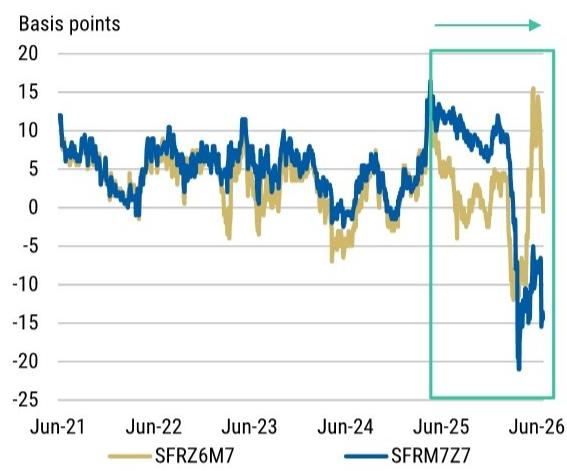  
Source: MS, Bloomberg

Exhibit 16: SFRZ6M7 and SFRM7Z7 futures contracts over the past year  
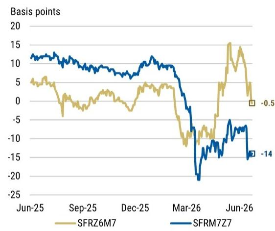  
Source: MS, Bloomberg

We suggest investors tighten trailing stops on SFRZ6M7 curve flatteners to 10bp and see payback from May strength in June employment data next week as a near-term catalyst for continued M7 outperformance against Z6 (see Exhibit 15 and Exhibit 16).

\- Trade idea: Maintain SFRZ6M7 curve flatteners at -0.5bp with a target of -10bp and a trailing stop of 10bp.

\- Trade idea: Maintain long 2-year (Sep '27) UST SOFR swap spreads at -10.4bp with a target of -9bp and a trailing stop of -15bp.

## Valuation Methodology and Risks

Below you will find a list of our current trade ideas, entry levels, entry dates, rationales, and risks.

<table><tr><td colspan="5">Interest RateStrategy</td></tr><tr><td>TRADE</td><td>ENTRY LEVEL</td><td>ENTRY DATE</td><td>RATIONALE</td><td>RISKS</td></tr><tr><td>Maintain SFRZ6M7 curve flattener</td><td>10.5bp</td><td>5/22/2026</td><td>We think SFRZ6M7 curve flatteners offer a compelling way to express the view that market pricing places too much weight on hawkish Fed tail risks, in response to the oil shock, and the allure of a AI-driven industrial activity renaissance. This relative value expression allows investors to exploit a substantial insurance premium against rate hikes, removes outright duration beta, while not requiring a near-term dovish pivot by the Fed.</td><td>The main risk is if fiscal stimulus arrives before the mid-term elections, which would justify currently elevated levels of near-term inflation expectations.</td></tr><tr><td>Long 2y (Sep &#x27;27) UST SOFR swap spread</td><td>-21.6</td><td>10/3/2025</td><td>We expect softer funding conditions and a steepening of the very front end to cause swap spreads in the front end to widen given recent relationships.</td><td>Risks to the trade include firmer funding than expected or a stabilizing job market.</td></tr></table>

Global Macro Strategy Team

<table><tr><td>MS &amp; CO. LLC</td><td>Matthew Hornbach, CMT
Matthew.Hornbach@morganstanley.com</td><td>Global Head of Macro Strategy</td><td>+1 212 761-1837</td></tr><tr><td></td><td>Martin Tobias, CFA, CMT</td><td>US Rates Strategist</td><td>+1 212 761-6076</td></tr><tr><td></td><td>Shaun Zhou</td><td>US Rates Strategist</td><td>+1 212 761-3348</td></tr><tr><td></td><td>Aryaman Singh</td><td>US Rates Strategist</td><td>+1 212 761-1993</td></tr><tr><td></td><td>Eli Carter</td><td>US Rates Strategist</td><td>+1 212 761-4703</td></tr><tr><td rowspan="2">MS &amp; CO. LLC</td><td>Andrew Watrous</td><td>G10 FX Strategist</td><td>+1 212 761-5287</td></tr><tr><td>Molly Nickolin</td><td>G10 FX Strategist</td><td>+1 212 761-3592</td></tr><tr><td></td><td>Simon Waever
Simon.Waever@morganstanley.com</td><td>Head of EM Sovereign Credit and Latin America Fixed Income Strategy</td><td>+1 212 296-8101</td></tr><tr><td></td><td>Ioana Zamfir</td><td>Head of Latin America Macro Strategy</td><td>+1 212 761-4012</td></tr><tr><td></td><td>Emma Cerda</td><td>Latin America Sovereign Credit</td><td>+1 212 761-2344</td></tr><tr><td></td><td>Sofia Palacios</td><td>Latin America Macro Strategist</td><td>+1 212 761-0428</td></tr><tr><td>MS &amp; CO. INTERNATIONAL PLC</td><td>James K. Lord
James.Lord@morganstanley.com</td><td>Global Head of FXEM Strategy</td><td>+44 20 7677-3254</td></tr><tr><td></td><td>Gianluca Salford
Luca.Salford@morganstanley.com</td><td>Head of European Rates Strategy</td><td>+44 20 7677-1337</td></tr><tr><td></td><td>Maria Chiara Russo</td><td>Euro Area Rates Strategist</td><td>+44 20 7425-3499</td></tr><tr><td></td><td>Fabio Bassanin, CFA</td><td>UK Rates Strategist</td><td>+44 20 7425-1869</td></tr><tr><td></td><td>David S. Adams, CFA
David.S.Adams@morganstanley.com</td><td>Head of G10 FX Strategy</td><td>+44 20 7425-3518</td></tr><tr><td rowspan="2"></td><td rowspan="2">Neville Mandimika
Arnav Gupta</td><td>CEEMEA Sovereign Credit Strategist</td><td>+44 20 7425-2509</td></tr><tr><td>CEEMEA Rates Strategist</td><td>+44 20 7677-0382</td></tr><tr><td>MS ASIA LIMITED+</td><td>Gek Teng Khoo</td><td>AXJ Macro Strategist</td><td>+852 3963-0303</td></tr><tr><td>MS INDIA COMPANY PRIVATE LIMITED</td><td>Nimish Prabhune</td><td>AXJ Macro Strategist</td><td>+91 22 6996-1862</td></tr><tr><td rowspan="2">MS MUFG SECURITIES CO., LTD.</td><td>Koichi Sugisaki
Koichi.Sugisaki@morganstanleymufg.com</td><td>Head of Japan Macro Strategy</td><td>+81 3 6836-8428</td></tr><tr><td>Hiromu Uezato</td><td>Japan Macro Strategist</td><td>+81 3 6836-8431</td></tr></table>

## Disclosure Section

The information and opinions in MS were prepared by MS & Co. LLC, and/or MS C.T.V.M. S.A., and/or MS Mexico, Casa de Bolsa, S.A. de C.V., and/or MS Canada Limited. As used in this disclosure section, "MS" includes MS & Co. LLC, MS C.T.V.M. S.A., MS Mexico, Casa de Bolsa, S.A. de C.V., MS Canada Limited and their affiliates as necessary.

For important disclosures, stock price charts and equity rating histories regarding companies that are the subject of this report, please see the MS Disclosure Website at www.morganstanley.com/eqr/disclosures/webapp/generalresearch, or contact your investment representative or MS at 1585 Broadway, (Attention: Research Management), New York, NY, 10036 USA.

For valuation methodology and risks associated with any recommendation, rating or price target referenced in this research report, please contact the Client Support Team as follows: US/Canada +1 800 303-2495; Hong Kong +852 2848-5999; Latin America +1 718 754-5444 (U.S.); London +44 (0)20-7425-8169; Singapore +65 6834-6860; Sydney +61 (0)2-9770-1505; Tokyo +81 (0)3-6836-9000. Alternatively you may contact your investment representative or MS at 1585 Broadway, (Attention: Research Management), New York, NY 10036 USA.

## Analyst Certification

The following analysts hereby certify that their views about the companies and their securities discussed in this report are accurately expressed and that they have not received and will not receive direct or indirect compensation in exchange for expressing specific recommendations or views in this report: Eli P Carter; Matthew Hornbach; Aryaman Singh; Martin W Tobias, CFA; Shaun Zhou.

## Global Research Conflict Management Policy

MS has been published in accordance with our conflict management policy, which is available at www.morganstanley.com/institutional/research/conflictpolicies. A Portuguese version of the policy can be found at www.morganstanley.com.br

## Important Regulatory Disclosures on Subject Companies

In the next 3 months, MS expects to receive or intends to seek compensation for investment banking services from United States of America.

Within the last 12 months, MS has provided or is providing investment banking services to, or has an investment banking client relationship with, the following company: United States of America.

The equity research analysts or strategists principally responsible for the preparation of MS have received compensation based upon various factors, including quality of research, investor client feedback, stock picking, competitive factors, firm revenues and overall investment banking revenues. Equity Research analysts' or strategists' compensation is not linked to investment banking or capital markets transactions performed by MS or the profitability or revenues of particular trading desks.

MS and its affiliates do business that relates to companies/instruments covered in MS, including market making, providing liquidity, fund management, commercial banking, extension of credit, investment services and investment banking. MS sells to and buys from customers the securities/instruments of companies covered in MS on a principal basis. MS may have a position in the debt of the Company or instruments discussed in this report. MS trades or may trade as principal in the debt securities (or in related derivatives) that are the subject of the debt research report.

Certain disclosures listed above are also for compliance with applicable regulations in non-US jurisdictions.

## STOCK RATINGS

MS uses a relative rating system using terms such as Overweight, Equal-weight, Not-Rated or Underweight (see definitions below). MS does not assign ratings of Buy, Hold or Sell to the stocks we cover. Overweight, Equal-weight, Not-Rated and Underweight are not the equivalent of buy, hold and sell. Investors should carefully read the definitions of all ratings used in MS. In addition, since MS contains more complete information concerning the analyst's views, investors should carefully read MS, in its entirety, and not infer the contents from the rating alone. In any case, ratings (or research) should not be used or relied upon as investment advice. An investor's decision to buy or sell a stock should depend on individual circumstances (such as the investor's existing holdings) and other considerations.

## Global Stock Ratings Distribution

## (as of May 31, 2026)

The Stock Ratings described below apply to MS's Fundamental Equity Research and do not apply to Debt Research produced by the Firm.

For disclosure purposes only (in accordance with FINRA requirements), we include the category headings of Buy, Hold, and Sell alongside our ratings of Overweight, Equal-weight, Not-Rated and Underweight. MS does not assign ratings of Buy, Hold or Sell to the stocks we cover. Overweight, Equal-weight, Not-Rated and Underweight are not the equivalent of buy, hold, and sell but represent recommended relative weightings (see definitions below). To satisfy regulatory requirements, we correspond Overweight, our most positive stock rating, with a buy recommendation; we correspond Equal-weight and Not-Rated to hold and Underweight to sell recommendations, respectively.

<table><tr><td rowspan="2">Stock Rating Category</td><td colspan="2">Coverage Universe</td><td colspan="3">Investment Banking Clients (IBC)</td><td colspan="2">Other Material Investment Services Clients (MISC)</td></tr><tr><td>Count</td><td>% of Total</td><td>Count</td><td>% of Total IBC</td><td>% of Rating Category</td><td>Count</td><td>% of Total Other MISC</td></tr><tr><td>Overweight/Buy</td><td>1542</td><td>42%</td><td>465</td><td>51%</td><td>30%</td><td>707</td><td>43%</td></tr><tr><td>Equal-weight/Hold</td><td>1571</td><td>43%</td><td>369</td><td>40%</td><td>23%</td><td>723</td><td>44%</td></tr><tr><td>Not-Rated/Hold</td><td>3</td><td>0%</td><td>0</td><td>0%</td><td>0%</td><td>1</td><td>0%</td></tr><tr><td>Underweight/Sell</td><td>551</td><td>15%</td><td>86</td><td>9%</td><td>16%</td><td>201</td><td>12%</td></tr><tr><td>Total</td><td>3,667</td><td></td><td>920</td><td></td><td></td><td>1632</td><td></td></tr></table>

Data include common stock and ADRs currently assigned ratings. Investment Banking Clients are companies from whom MS received investment banking compensation in the last 12 months. Due to rounding off of decimals, the percentages provided in the "% of total" column may not add up to exactly 100 percent.

## Analyst Stock Ratings

Overweight (O). The stock's total return is expected to exceed the average total return of the analyst's industry (or industry team's) coverage universe, on a risk-adjusted basis, over the next 12-18 months.

Equal-weight (E). The stock's total return is expected to be in line with the average total return of the analyst's industry (or industry team's) coverage universe, on a risk-adjusted basis, over the next 12-18 months.

Not-Rated (NR). Currently the analyst does not have adequate conviction about the stock's total return relative to the average total return of the analyst's industry (or industry team's) coverage universe, on a risk-adjusted basis, over the next 12-18 months.

Underweight (U). The stock's total return is expected to be below the average total return of the analyst's industry (or industry team's) coverage universe, on a risk-adjusted basis, over the next 12-18 months.

Unless otherwise specified, the time frame for price targets included in MS is 12 to 18 months.

## Analyst Industry Views

Attractive (A): The analyst expects the performance of his or her industry coverage universe over the next 12-18 months to be attractive vs. the relevant broad market benchmark, as indicated below.

In-Line (I): The analyst expects the performance of his or her industry coverage universe over the next 12-18 months to be in line with the relevant broad market benchmark, as indicated below. Cautious (C): The analyst views the performance of his or her industry coverage universe over the next 12-18 months with caution vs. the relevant broad market benchmark, as indicated below. Benchmarks for each region are as follows: North America - S&P 500; Latin America - relevant MSCI country index or MSCI Latin America Index; Europe - MSCI Europe; Japan - TOPIX; Asia - relevant MSCI country index or MSCI sub-regional index or MSCI AC Asia Pacific ex Japan Index.

## Important Disclosures for MS Smith Barney LLC Customers

Important disclosures regarding any material conflict of interest that can reasonably be expected to have influenced MS Smith Barney LLC's choice of a third-party research provider or the subject company of a third-party research report, are available on the MS Wealth Management disclosure website at www.morganstanley.com/online/researchdisclosures. For MS specific disclosures, you may refer to https://www.morganstanley.com/eqr/disclosures/webapp/generalresearch.

Each MS report is reviewed and approved on behalf of MS Smith Barney LLC. This review and approval is conducted by the same person who reviews the research report on behalf of MS. This could create a conflict of interest.

## Other Important Disclosures

MS policy is to update research reports as and when the Research Analyst and Research Management deem appropriate, based on developments with the issuer, the sector, or the market that may have a material impact on the research views or opinions stated therein. In addition, certain Research publications are intended to be updated on a regular periodic basis (weekly/monthly/quarterly/annual) and will ordinarily be updated with that frequency, unless the Research Analyst and Research Management determine that a different publication schedule is appropriate based on current conditions.

MS is not acting as a municipal advisor and the opinions or views contained herein are not intended to be, and do not constitute, advice within the meaning of Section 975 of the Dodd-Frank Wall Street Reform and Consumer Protection Act.

MS produces an equity research product called a "Tactical Idea." Views contained in a "Tactical Idea" on a particular stock may be contrary to the recommendations or views expressed in research on the same stock. This may be the result of differing time horizons, methodologies, market events, or other factors. For all research available on a particular stock, please contact your sales representative or go to Matrix at http://www.morganstanley.com/matrix.

MS is provided to our clients through our proprietary research portal on Matrix and also distributed electronically by MS to clients. Certain, but not all, MS products are also made available to clients through third-party vendors or redistributed to clients through alternate electronic means as a convenience. For access to all available MS, please contact your sales representative or go to Matrix at http://www.morganstanley.com/matrix.

Any access and/or use of MS is subject to MS's Terms of Use (http://www.morganstanley.com/terms.html). By accessing and/or using MS, you are indicating that you have read and agree to be bound by our Terms of Use (http://www.morganstanley.com/terms.html). In addition you consent to MS processing your personal data and using cookies in accordance with our Privacy Policy and our Global Cookies Policy (http://www.morganstanley.com/privacy\_pledge.html), including for the purposes of setting your preferences and to collect readership data so that we can deliver better and more personalized service and products to you. To find out more information about how MS processes personal data, how we use cookies and how to reject cookies see our Privacy Policy and our Global Cookies Policy (http://www.morganstanley.com/privacy\_pledge.html). Please use the provided link to review the Terms and Conditions and Most Important Terms and Conditions for MS India Company Private Limited (https://www.morganstanley.com/assets/pdfs/about-us-global-offices/india/Terms\_and\_conditions.pdf) and the following link to review the audit report (https://ny.matrix.ms.com/eqr/research/webapp/researchdocs/MSICPL\_Morgan\_Stanley\_Research\_Audit\_Report.pdf).

If you do not agree to our Terms of Use and/or if you do not wish to provide your consent to MS processing your personal data or using cookies please do not access our research. MS does not provide individually tailored investment advice. MS has been prepared without regard to the circumstances and objectives of those who receive it. MS recommends that investors independently evaluate particular investments and strategies, and encourages investors to seek the advice of a financial adviser. The appropriateness of an investment or strategy will depend on an investor's circumstances and objectives. The securities, instruments, or strategies discussed in MS may not be suitable for all investors, and certain investors may not be eligible to purchase or participate in some or all of them. MS is not an offer to buy or sell or the solicitation of an offer to buy or sell any security/instrument or to participate in any particular trading strategy. The value of and income from your investments may vary because of changes in interest rates, foreign exchange rates, default rates, prepayment rates, securities/instruments prices, market indexes, operational or financial conditions of companies or other factors. There may be time limitations on the exercise of options or other rights in securities/instruments transactions. Past performance is not necessarily a guide to future performance. Estimates of future performance are based on assumptions that may not be realized. If provided, and unless otherwise stated, the closing price on the cover page is that of the primary exchange for the subject company's securities/instruments.

The fixed income research analysts, strategists or economists principally responsible for the preparation of MS have received compensation based upon various factors, including quality, accuracy and value of research, firm profitability or revenues (which include fixed income trading and capital markets profitability or revenues), client feedback and competitive factors. Fixed Income Research analysts', strategists' or economists' compensation is not linked to investment banking or capital markets transactions performed by MS or the profitability or revenues of particular trading desks.

The "Important Regulatory Disclosures on Subject Companies" section in MS lists all companies mentioned where MS owns 1% or more of a class of common equity securities of the companies. For all other companies mentioned in MS, MS may have an investment of less than 1% in securities/instruments or derivatives of securities/instruments of companies and may trade them in ways different from those discussed in MS. Employees of MS not involved in the preparation of MS may have investments in securities/instruments or derivatives of securities/instruments of companies mentioned and may trade them in ways different from those discussed in MS. Derivatives may be issued by MS or associated persons.

With the exception of information regarding MS, MS is based on public information. MS makes every effort to use reliable, comprehensive information, but we make no representation that it is accurate or complete. We have no obligation to tell you when opinions or information in MS change apart from when we intend to discontinue equity research coverage of a subject company. Facts and views presented in MS have not been reviewed by, and may not reflect information known to, professionals in other MS business areas, including investment banking personnel.

MS personnel may participate in company events such as site visits and are generally prohibited from accepting payment by the company of associated expenses unless pre-approved by authorized members of Research management.

MS may make investment decisions that are inconsistent with the recommendations or views in this report.

To our readers based in Taiwan or trading in Taiwan securities/instruments: Information on securities/instruments that trade in Taiwan is distributed by MS Taiwan Limited ("MSTL"). Such information is for your reference only. The reader should independently evaluate the investment risks and is solely responsible for their investment decisions. MS may not be distributed to the public media or quoted or used by the public media without the express written consent of MS. Any non-customer reader within the scope of Article 7-1 of the Taiwan Stock Exchange Recommendation Regulations accessing and/or receiving MS is not permitted to provide MS to any third party (including but not limited to related parties, affiliated companies and any other third parties) or engage in any activities regarding MS which may create or give the appearance of creating a conflict of interest. Information on securities/instruments that do not trade in Taiwan is for informational purposes only and is not to be construed as a recommendation or a solicitation to trade in such securities/instruments. MSTL may not execute transactions for clients in these securities/instruments.

MS is not incorporated under PRC law and the research in relation to this report is conducted outside the PRC. MS does not constitute an offer to sell or the solicitation of an offer to buy any securities in the PRC. PRC investors shall have the relevant qualifications to invest in such securities and shall be responsible for obtaining all relevant approvals, licenses, verifications and/or registrations from the relevant governmental authorities themselves. Neither this report nor any part of it is intended as, or shall constitute, provision of any consultancy or advisory service of securities investment as defined under PRC law. Such information is provided for your reference only.

MS is disseminated in Brazil by MS C.T.V.M. S.A. located at Av. Brigadeiro Faria Lima, 3600, 6th floor, São Paulo - SP, Brazil; and is regulated by the Comissão de Valores Mobiliários; in Mexico by MS México, Casa de Bolsa, S.A. de C.V which is regulated by Comision Nacional Bancaria y de Valores. Paseo de los Tamarindos 90, Torre 1, Col. Bosques de las Lomas Floor 29, 05120 Mexico City; in Japan by MS MUFG Securities Co., Ltd. and, for Commodities related research reports only, MS Capital Group Japan Co., Ltd; in Hong Kong by MS Asia Limited (which accepts responsibility for its contents) and by MS Bank Asia Limited; in Singapore by MS Asia (Singapore) Pte. (Registration number 199206298Z) and/or MS Asia (Singapore) Securities Pte Ltd (Registration number 200008434H), regulated by the Monetary Authority of Singapore (which accepts legal responsibility for its contents and should be contacted with respect to any matters arising from, or in connection with, MS) and by MS Bank Asia Limited, Singapore Branch (Registration number T14FC0118); in Australia to "wholesale clients" within the meaning of the Australian Corporations Act by MS Australia Limited A.B.N. 67 003 734 576, holder of Australian financial services license No. 233742, which accepts responsibility for its contents; in Australia to "wholesale clients" and "retail clients" within the meaning of the Australian Corporations Act by MS Wealth Management Australia Pty Ltd (A.B.N. 19 009 145 555, holder of Australian financial services license No. 240813, which accepts responsibility for its contents; in Korea by MS & Co International plc, Seoul Branch; in India by MS India Company Private Limited having Corporate Identification No (CIN) U22990MH1998PTC115305, regulated by the Securities and Exchange Board of India ("SEBI") and holder of licenses as a Research Analyst (SEBI Registration No. INH000001105); Stock Broker (SEBI Stock Broker Registration No. INZ000244438), Merchant Banker (SEBI Registration No. INM000011203), and depository participant with National Securities Depository Limited (SEBI Registration No. IN-DP-NSDL-567-2021) having registered office at Altimus, Level 39 & 40, Pandurang Budhkar Marg, Worli, Mumbai 400018, India; Telephone no. +91-22-61181000; Compliance Officer Details: Mr. Tejarshi Hardas, Tel. No.: +91-22-61181000 or Email: tejarshi.hardas@morganstanley.com; Grievance officer details: Mr. Tejarshi Hardas, Tel. No.: +91-22-61181000 or Email: msic-compliance@morganstanley.com. MS India Company Private Limited (MSICPL) may use AI tools in providing research services. All recommendations contained herein are made by the duly qualified research analysts; in Canada by MS Canada Limited; in Germany and the European Economic Area where required by MS Europe S.E., authorised and regulated by Bundesanstalt fuer Finanzdienstleistungsaufsicht (BaFin) under the reference number 149169; in the US by MS & Co. LLC, which accepts responsibility for its contents. MS & Co. International plc, authorized by the Prudential Regulation Authority and regulated by the Financial Conduct Authority and the Prudential Regulation Authority, disseminates in the UK research that it has prepared, and research which has been prepared by any of its affiliates, only to persons who (i) are investment professionals falling within Article 19(5) of the Financial Services and Markets Act 2000 (Financial Promotion) Order 2005 (as amended, the "Order"); (ii) are persons who are high net worth entities falling within Article 49(2)(a) to (d) of the Order; or (iii) are persons to whom an invitation or inducement to engage in investment activity (within the meaning of section 21 of the Financial Services and Markets Act 2000, as amended) may otherwise lawfully be communicated or caused to be communicated. RMB MS Proprietary Limited is a member of the JSE Limited and A2X (Pty) Ltd. RMB MS Proprietary Limited is a joint venture owned equally by MS International Holdings Inc. and RMB Investment Advisory (Proprietary) Limited, which is wholly owned by FirstRand Limited. The information in MS is being disseminated by MS Saudi Arabia, regulated by the Capital Market Authority in the Kingdom of Saudi Arabia, and is directed at Sophisticated investors only.

The information in MS is being communicated by MS & Co. International plc (DIFC Branch), regulated by the Dubai Financial Services Authority (the DFSA) or by MS & Co. International plc (ADGM Branch), regulated by the Financial Services Regulatory Authority Abu Dhabi (the FSRA), and is directed at Professional Clients only, as defined by the DFSA or the FSRA, respectively. The financial products or financial services to which this research relates will only be made available to a customer who we are satisfied meets the regulatory criteria of a Professional Client. A distribution of the different MS Research ratings or recommendations, in percentage terms for Investments in each sector covered, is available upon request from your sales representative.

The information in MS is being communicated by MS & Co. International plc (QFC Branch), regulated by the Qatar Financial Centre Regulatory Authority (the QFCRA), and is directed at business customers and market counterparties only and is not intended for Retail Customers as defined by the QFCRA.

As required by the Capital Markets Board of Turkey, investment information, comments and recommendations stated here, are not within the scope of investment advisory activity. Investment advisory service is provided exclusively to persons based on their risk and income preferences by the authorized firms. Comments and recommendations stated here are general in nature. These opinions may not fit to your financial status, risk and return preferences. For this reason, to make an investment decision by relying solely to this information stated here may not bring about outcomes that fit your expectations.

The trademarks and service marks contained in MS are the property of their respective owners. Third-party data providers make no warranties or representations relating to the accuracy, completeness, or timeliness of the data they provide and shall not have liability for any damages relating to such data. The Global Industry Classification Standard (GICS) was developed by and is the exclusive property of MSCI and S&P.

MS, or any portion thereof may not be reprinted, sold or redistributed without the written consent of MS.

Indicators and trackers referenced in MS may not be used as, or treated as, a benchmark under Regulation EU 2016/1011, or any other similar framework.

The issuers and/or fixed income products recommended or discussed in certain fixed income research reports may not be continuously followed. Accordingly, investors should regard those fixed income research reports as providing stand-alone analysis and should not expect continuing analysis or additional reports relating to such issuers and/or individual fixed income products. MS may hold, from time to time, material financial and commercial interests regarding the company subject to the Research report.

Registration granted by SEBI and certification from the National Institute of Securities Markets (NISM) in no way guarantee performance of the intermediary or provide any assurance of returns to investors. Investment in securities market are subject to market risks. Read all the related documents carefully before investing.

The following authors are Fixed Income Research Analysts/Strategists and are not opining on or expressing recommendations on equity securities: Aryaman Singh; Shaun Zhou; Eli P Carter; Matthew Hornbach; Martin W Tobias, CFA.

© 2026 MS