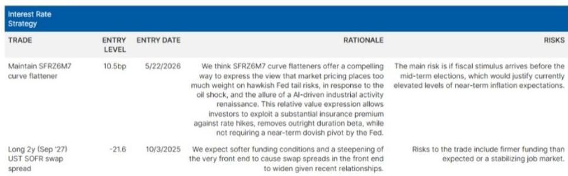

# 摩根斯坦利：MS：融资市场正发出二季度末最危险的信号

当美联储还在通过点阵图传递“一次加息”的鹰派信号时，华尔街最敏感的角落已经亮起了红灯。MS利率策略团队在6月27日发布的一份报告中直言：股票融资市场正在经历一场堪比2024年12月年末的紧张局面，二季度末发生去杠杆事件的风险正在上升。

这份报告的核心判断并非来自传统宏观经济模型，而是来自一个多数投资者容易忽视的角落——AXW期货。这个捕捉标普500总收益期货与浮动利率之间价差的工具，正在发出近十年来最极端的信号。

对于任何一个管理着数十亿美元资产、或正在为下半年配置做决策的投资者来说，理解这个信号的含义，可能比关注美联储下一次会议的点阵图更为紧迫。

> **KC评论：** MS不是在预测经济衰退，而是在警告一个技术性的、但可能引发连锁反应的流动性事件。历史上，这类信号往往出现在市场转折点之前。完整的报告里有一张图显示，当AXW期货超过2个标准差时，标普500在随后三个月内都会出现显著回调。这张图表值得每个人仔细看一遍。

## 1. 股票融资成本已逼近历史极值，而国债融资市场却异常平静

报告揭示了一个令人不安的分化：国债回购市场目前定价相当温和，隔夜GC回购报价仅为3.75/3.72，与2025年6月季度末和今年4月纳税日时的情况类似。这意味着美联储的利率走廊并未受到实质性挑战，SOFR利率大概率会稳定在目标区间内。

然而，在股票融资的另一端，情况截然不同。7月到期的1个月AXW期货合约在上周五飙升至+200个基点，正在迅速逼近2024年12月年末前创下的历史最高水平。报告特意使用了10日移动平均线来平滑合约滚动的影响，即便如此，读数依然触目惊心。

这种分化的本质是什么？国债融资市场受益于美联储自2025年12月启动的准备金管理购买操作，流动性相对充裕。而股票融资市场则面临一个更结构性的问题：对冲基金对杠杆化多头敞口的需求，与交易商资产负债表容量之间的失衡正在加剧。

几个因素叠加推高了AXW水平：股票发行相关的资产负债表需求、杠杆ETF的增长、以及居高不下的期货持仓。但报告特别强调了一个更危险的变量：过去一周半导体板块的财报引发的市场反应，恰恰发生在对冲基金杠杆化多头敞口最集中的领域。

> **KC评论：** 这里的关键不是某个板块的涨跌，而是“集中度”本身。当大量杠杆资金集中在少数几个板块时，任何一次波动都可能触发连锁反应。报告没有展开的是，这种集中度到底有多高、哪些基金最脆弱。这些细节正是完整版研报最有价值的部分。

## 2. 去杠杆的自我强化机制：当边际买家消失时

MS团队用了一个精妙的框架来解释当前的风险。他们指出，当股票融资成本达到统计上的极端水平时（超过252日滚动窗口的2个标准差），标普500往往会向均值回归。这不是一个偶然的相关性，而是有因果逻辑的。

逻辑链条如下：融资成本上升 -> 杠杆投资者维持多头头寸的门槛提高 -> 部分头寸被迫平仓 -> 价格下跌 -> 更多杠杆头寸触及风险阈值 -> 进一步平仓。在这个过程中，曾经推动资产价格上涨的杠杆力量，开始向相反方向切割。

报告特别提到，这种“去杠杆事件”的风险在二季度末尤为突出。因为临近季度末，主经纪商为了避免进入下一个GSIB附加费区间，会变得更加保守——这意味着更少的融资可用性和更高的定价。对于对冲基金来说，这意味着他们可能无法在季度末之前获得足够的融资来维持现有头寸。

更关键的是远期合约的信号。报告指出，如果6月30日季度末之后，远月AXW合约（如AXW3）的融资成本没有正常化，那就意味着股票融资成本将持续高企，直到发生一次相当显著的去杠杆事件。

> **KC评论：** MS实际上在说：市场可能正在等待一个“催化剂”。这个催化剂可能是某个大型基金的爆仓，也可能是某个宏观数据的意外。完整报告里有一张图展示了AXW3与标普500的统计关系，当AXW3超过2个标准差后，标普500在三个月内都会跌到1个标准差以下。这个时间窗口值得高度警惕。

## 3. 美联储的鹰派叙事可能被金融条件“反向绑架”

如果去杠杆事件真的发生，它对宏观资产定价的影响可能比事件本身更深远。报告提出了一个反直觉的判断：市场可能会开始重新评估美联储的加息风险。

目前，市场仍然在为美联储加息定价一定程度的保险溢价。但如果金融条件因去杠杆而收紧，投资者可能会对“经济过热”的叙事失去信心——尤其是当一季度消费数据已经与此叙事形成鲜明对比时。

MS构建了一个非常有力的分析工具：他们采用旧金山联储的方法论，创建了一个包含12个金融变量的代理有效联邦基金利率。这个工具显示，自伊朗冲突爆发以来，金融条件已经以相当于近4次25个基点加息的方式收紧。换句话说，市场已经替美联储做了75个基点的紧缩工作。

如果在此基础上再叠加去杠杆带来的金融条件进一步收紧，美联储实际上已经不需要再主动加息。报告进一步指出，如果市场开始意识到这一点，那么对美联储加息尾部风险的保险溢价就会下降，从而推动收益率曲线扁平化。

> **KC评论：** 这是整份报告最精妙的分析。MS实际上在说：美联储可能不需要真的加息，市场已经帮它加了。如果去杠杆事件发生，金融条件会进一步收紧，届时市场会开始定价“美联储政策错误”的风险——即美联储在点阵图上暗示的加息，可能根本不会发生。报告里有一张图展示了不同美联储资产负债表制度下准备金与SOFR-IORB利差的关系，这张图对于理解当前金融条件的真实位置至关重要。

## 4. 报告尚未完全回答的关键问题：去杠杆的触发点和传导路径

尽管MS的分析框架非常清晰，但报告本身也留下了一些未完全展开的问题。

第一个问题是：去杠杆的具体触发点在哪里？报告提到了半导体板块的财报，也提到了对冲基金在AI相关领域的集中度，但没有明确量化“什么水平的融资成本会触发系统性平仓”。AXW期货目前是+200bp，2024年12月的高点是多少？如果继续上行到+250bp或+300bp，哪些类型的基金最脆弱？

第二个问题是：去杠杆的传导路径有多宽？报告主要聚焦在股票融资市场，但去杠杆事件往往会通过衍生品、信用利差和流动性螺旋传染到其他资产类别。2008年的贝尔斯登和2020年的疫情冲击都证明了这一点。当前的结构与以往有何不同？

第三个问题是：如果去杠杆不发生，这个信号会如何演变？报告暗示“如果融资成本不恢复正常，就意味着市场在等待一次更大的去杠杆”，但反过来看——如果融资成本在季度末后自然回落，是否意味着警报解除？还是说这种“有惊无险”本身会鼓励更多杠杆行为，为下一次更大的风险埋下伏笔？

这些问题的答案，恰恰是区分“看懂报告”和“用好报告”的关键。

## 5. 投资者需要建立的新观察框架：从盯住美联储转向盯住融资市场

这份报告给所有市场参与者最大的启发，或许不是具体的交易建议，而是一个观察框架的转变。

传统上，宏观投资者习惯于通过美联储点阵图、经济数据和通胀预期来构建投资决策。但MS这份报告提醒我们：在当前的金融环境下，融资市场的微观结构可能比宏观数据更能预警风险。

建议投资者建立一个包含以下三个维度的观察框架：

第一，关注AXW期货的绝对水平和相对位置。当1个月AXW合约超过+150bp、或超过252日滚动窗口的2个标准差时，应该视为一个系统性预警信号。

第二，关注国债融资与股票融资之间的“价差”。当两者出现显著分化时，往往意味着资金正在从风险资产向安全资产转移，这是一个典型的“flight to quality”信号。

第三，关注对冲基金的杠杆率变化。虽然这部分数据不透明，但可以通过主经纪商的融资条件、衍生品市场的隐含融资成本、以及交易所的持仓报告来间接观察。

> **KC评论：** 这个观察框架的本质是：不要只看资产的“价格”，还要看持有这些资产的“成本”。当持有成本显著上升时，即使基本面没有变化，价格也可能因为技术性因素而剧烈波动。完整报告里有一组图表展示了AXW期货与标普500的滚动相关性，这对于构建具体的交易策略非常有帮助。

---

这份报告的价值不仅在于它指出了当前的风险，更在于它提供了一个从融资市场角度理解资产价格波动的分析框架。但正如报告本身所暗示的，这个框架的预测能力取决于能否准确判断去杠杆的触发点和传导路径。

对于希望深入理解这些问题的读者，我们的社群每天会由AI agent加上人工review，生成国际投行中文摘要与KC评论，daily更新约10-40页，并整理当天最新数据图表合集。这些内容既方便喂给AI进行批量分析，也方便人工快速把握market dynamics。如果你对MS这份报告的完整图表、以及AXW期货与标普500的统计关系细节感兴趣，欢迎来星球微信群里继续讨论。我们会在那里分享报告的核心图表，并持续跟踪融资市场的变化。

Personal reading notes and learning share only. Not investment advice.

